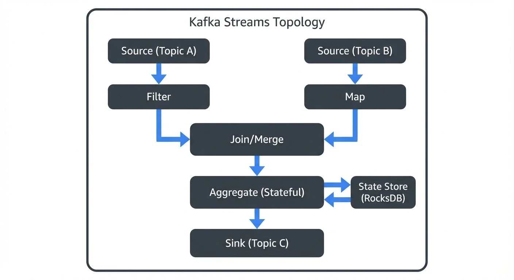
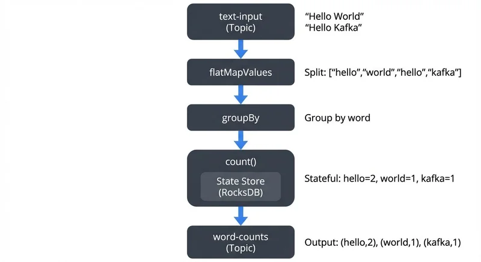
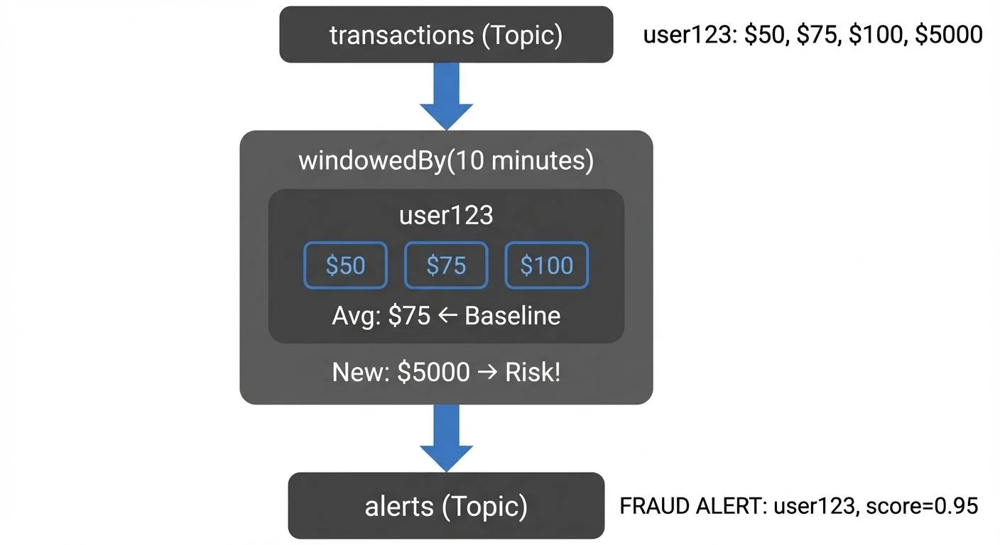

Stream processing has become essential for modern data architectures. Organizations need to react to events in real-time, whether detecting fraud, personalizing user experiences, or monitoring system health. Kafka Streams provides a lightweight yet powerful solution for building these real-time applications.

This article introduces Kafka Streams, explaining its core concepts, architecture, and practical applications. You'll learn how it fits into the broader stream processing landscape and how to get started building your own streaming applications.

## What is Kafka Streams?

Kafka Streams is a client library for building stream processing applications on top of Apache Kafka. Unlike heavyweight frameworks that require separate clusters, Kafka Streams runs as part of your application. It's simply a Java library you add to your project.

For foundational understanding of Apache Kafka's architecture, topics, and partitions, see [Apache Kafka](https://conduktor.io/glossary/apache-kafka).

As of Kafka 3.6+ and Kafka 4.0, Kafka Streams has matured significantly with features like versioned state stores, improved exactly-once semantics, and full compatibility with KRaft mode (Kafka's ZooKeeper-free architecture). These advancements make it production-ready for the most demanding real-time applications. For details on KRaft mode, see [Understanding KRaft Mode in Kafka](https://conduktor.io/glossary/understanding-kraft-mode-in-kafka).

The key advantage is simplicity. You write standard Java applications that read from and write to Kafka topics. No separate processing cluster is needed. Your application instances can be deployed, scaled, and managed like any other microservice.

Kafka Streams provides high-level abstractions for common stream processing patterns:

- Filtering and transforming events
- Joining multiple streams
- Aggregating data over time windows
- Maintaining stateful computations
- Handling late-arriving data

These capabilities enable you to build sophisticated real-time applications without dealing with low-level complexities of distributed stream processing.

## Core Architecture and Components

Understanding Kafka Streams architecture helps you design better applications and troubleshoot issues effectively.

### Stream Processing Topology

A Kafka Streams application defines a processing topology - a graph of stream processors connected by streams. The topology describes how data flows through your application:



<!-- ORIGINAL_DIAGRAM
```
┌──────────────────────────────────────────────────────┐
│         Kafka Streams Topology                       │
│                                                       │
│  ┌────────────┐       ┌─────────────┐               │
│  │  Source    │       │   Source    │               │
│  │ (Topic A)  │       │  (Topic B)  │               │
│  └─────┬──────┘       └──────┬──────┘               │
│        │                     │                       │
│        ▼                     ▼                       │
│  ┌──────────┐         ┌───────────┐                 │
│  │ Filter   │         │   Map     │                 │
│  └────┬─────┘         └─────┬─────┘                 │
│       │                     │                       │
│       └──────────┬──────────┘                       │
│                  ▼                                   │
│          ┌───────────────┐                          │
│          │  Join/Merge   │                          │
│          └───────┬───────┘                          │
│                  │                                   │
│                  ▼                                   │
│          ┌───────────────┐                          │
│          │  Aggregate    │◄───┐                     │
│          │  (Stateful)   │    │                     │
│          └───────┬───────┘    │                     │
│                  │             │                     │
│                  │      ┌──────┴──────┐             │
│                  │      │ State Store │             │
│                  │      │  (RocksDB)  │             │
│                  │      └─────────────┘             │
│                  ▼                                   │
│          ┌──────────────┐                           │
│          │   Sink       │                           │
│          │ (Topic C)    │                           │
│          └──────────────┘                           │
└──────────────────────────────────────────────────────┘
```
-->

1. **Source Processor**: Reads records from Kafka topics
2. **Stream Processors**: Transform, filter, or aggregate data
3. **Sink Processor**: Writes results back to Kafka topics

Each processor performs a specific operation. Data flows from sources through processors to sinks, with intermediate results stored in Kafka topics.

### State Stores

Many stream processing operations require state. For example, counting events or joining streams needs to remember previous data. Kafka Streams provides state stores - fault-tolerant, local databases embedded in your application.

State stores are backed by Kafka topics called changelog topics. Every state change is written to Kafka, ensuring durability. If an application instance fails, another instance can rebuild the state from the changelog.

**Modern State Store Features (Kafka 3.5+):**

Kafka Streams 3.5+ introduced **versioned state stores**, which maintain historical versions of each key's value with timestamps. This enables:

- Time-travel queries to retrieve values as they existed at specific points in time
- More accurate stream-stream joins with better handling of out-of-order data
- Improved consistency for temporal queries

```java
// Example: Creating a versioned state store
StoreBuilder<VersionedKeyValueStore<String, Long>> storeBuilder =
    Stores.versionedKeyValueStoreBuilder(
        Stores.persistentVersionedKeyValueStore("user-profiles-versioned", Duration.ofHours(24)),
        Serdes.String(),
        Serdes.Long()
    );
```

### Exactly-Once Processing Guarantees

Kafka Streams supports **exactly-once semantics (EOS)**, ensuring each record is processed exactly once even during failures. This is critical for applications like financial transactions or inventory management where duplicate processing causes serious problems.

Enable exactly-once processing with the `processing.guarantee` configuration:

```java
Properties props = new Properties();
props.put(StreamsConfig.APPLICATION_ID_CONFIG, "word-count-app");
props.put(StreamsConfig.BOOTSTRAP_SERVERS_CONFIG, "localhost:9092");
props.put(StreamsConfig.PROCESSING_GUARANTEE_CONFIG, StreamsConfig.EXACTLY_ONCE_V2);
```

Kafka 3.0+ introduced **exactly-once semantics v2 (EXACTLY_ONCE_V2)**, which significantly improves performance by reducing coordination overhead between brokers. Always use v2 for new applications.

For in-depth coverage of state store internals, RocksDB configuration, and optimization strategies, see [State Stores in Kafka Streams](https://conduktor.io/glossary/state-stores-in-kafka-streams).

### Parallel Processing

Kafka Streams automatically parallelizes processing based on Kafka's partition model. Each partition can be processed independently. If your input topic has 10 partitions, you can run 10 application instances, each processing one partition.

This design provides elastic scalability. Add more application instances to handle increased load. Remove instances when load decreases. Kafka's consumer group protocol handles partition assignment automatically.

For detailed coverage of how Kafka Streams uses consumer groups for coordination, see [Kafka Consumer Groups Explained](https://conduktor.io/glossary/kafka-consumer-groups-explained). For partitioning strategies that maximize parallel processing, see [Kafka Partitioning Strategies and Best Practices](https://conduktor.io/glossary/kafka-partitioning-strategies-and-best-practices).

## Stream Processing Fundamentals

Kafka Streams introduces several abstractions representing different types of data streams.

### KStream: Event Streams

A KStream represents an unbounded stream of events. Each record is a new fact. For example, user clicks, sensor readings, or transaction events are naturally modeled as KStreams.

KStreams are append-only. A new record with the same key doesn't replace previous records - it's simply another event in the stream.

```java
// Create a KStream from a Kafka topic
KStream<String, String> clicks = builder.stream("user-clicks");

// Filter clicks from mobile devices
KStream<String, String> mobileClicks = clicks.filter(
    (key, value) -> value.contains("mobile")
);

// Transform the stream
KStream<String, String> processed = mobileClicks.mapValues(
    value -> value.toUpperCase()
);

// Write results to an output topic
processed.to("mobile-clicks-processed");
```

### KTable: Changelog Streams

A KTable represents a changelog stream - a sequence of updates to a table. Each record with a given key updates the current value for that key. Think of it as a database table continuously updated by a stream of changes.

KTables are useful for representing current state. For example, user profiles, product inventory, or account balances are naturally modeled as KTables.

```java
// Create a KTable from a compacted Kafka topic
KTable<String, Long> userProfiles = builder.table("user-profiles");

// A new record with key "user123" replaces the previous value
// Materialize the table for interactive queries
KTable<String, Long> materializedProfiles = userProfiles.mapValues(
    profile -> profile,
    Materialized.<String, Long, KeyValueStore<Bytes, byte[]>>as("user-profiles-store")
);

// Convert KTable to KStream to send updates downstream
KStream<String, Long> profileUpdates = userProfiles.toStream();
```

**KStream vs KTable Decision Guide:**

- Use **KStream** when each event matters independently (transactions, clicks, sensor readings)
- Use **KTable** when you care about current state (user settings, inventory levels, account balances)
- A KTable is essentially a KStream with log compaction - only the latest value per key is retained

For details on how log compaction works and its role in KTables, see [Kafka Log Compaction Explained](https://conduktor.io/glossary/kafka-log-compaction-explained). To understand the transactional guarantees underlying exactly-once processing, see [Kafka Transactions Deep Dive](https://conduktor.io/glossary/kafka-transactions-deep-dive).

### Stateless vs Stateful Operations

Stateless operations process each record independently:

- `map`: Transform each record
- `filter`: Select records matching a condition
- `flatMap`: Transform one record into zero or more records

Stateful operations require remembering previous data:

- `aggregate`: Combine records with the same key
- `join`: Combine records from multiple streams
- `windowing`: Group records into time-based windows

Stateful operations use state stores and are more complex but enable powerful stream processing patterns.

For detailed coverage of windowing strategies including tumbling, sliding, and session windows, see [Session Windows in Stream Processing](https://conduktor.io/glossary/session-windows-in-stream-processing). For join patterns and stream enrichment techniques, see [Stream Joins and Enrichment Patterns](https://conduktor.io/glossary/stream-joins-and-enrichment-patterns). To understand how Kafka Streams handles out-of-order data and event time processing, see [Watermarks and Triggers in Stream Processing](https://conduktor.io/glossary/watermarks-and-triggers-in-stream-processing).

## Building Your First Kafka Streams Application

Let's build a simple word count application - the "Hello World" of stream processing. This example demonstrates core Kafka Streams concepts.

### Project Setup

First, add Kafka Streams to your project. For Maven:

```xml
<dependency>
    <groupId>org.apache.kafka</groupId>
    <artifactId>kafka-streams</artifactId>
    <version>3.6.0</version>
</dependency>
```

For Gradle:

```gradle
implementation 'org.apache.kafka:kafka-streams:3.6.0'
```

### The Word Count Application

Our application reads text from an input topic, counts word occurrences, and writes results to an output topic.



<!-- ORIGINAL_DIAGRAM
```
Data Flow:
┌─────────────────┐
│  text-input     │  "Hello World"
│  (Topic)        │  "Hello Kafka"
└────────┬────────┘
         │
         ▼
┌─────────────────┐
│  flatMapValues  │  Split: ["hello","world","hello","kafka"]
└────────┬────────┘
         │
         ▼
┌─────────────────┐
│    groupBy      │  Group by word
└────────┬────────┘
         │
         ▼
┌─────────────────────────┐
│   count()               │  Stateful: hello=2, world=1, kafka=1
│  ┌─────────────────┐    │
│  │  State Store    │    │
│  │  (RocksDB)      │    │
│  └─────────────────┘    │
└────────┬────────────────┘
         │
         ▼
┌─────────────────┐
│  word-counts    │  Output: (hello,2), (world,1), (kafka,1)
│  (Topic)        │
└─────────────────┘
```
-->

This simple application demonstrates several concepts:

1. **Stateless transformation**: `flatMapValues` splits lines into words
2. **Grouping**: `groupBy` organizes words with the same key
3. **Stateful aggregation**: `count` maintains running totals in a state store
4. **Output**: Results are written to another Kafka topic

### Complete Code Example

Here's the complete, runnable word count application:

```java
import org.apache.kafka.common.serialization.Serdes;
import org.apache.kafka.streams.KafkaStreams;
import org.apache.kafka.streams.StreamsBuilder;
import org.apache.kafka.streams.StreamsConfig;
import org.apache.kafka.streams.kstream.KStream;
import org.apache.kafka.streams.kstream.KTable;
import org.apache.kafka.streams.kstream.Materialized;
import org.apache.kafka.streams.kstream.Produced;

import java.util.Arrays;
import java.util.Properties;

public class WordCountApplication {

    public static void main(String[] args) {
        // Configure the Streams application
        Properties props = new Properties();
        props.put(StreamsConfig.APPLICATION_ID_CONFIG, "word-count-app");
        props.put(StreamsConfig.BOOTSTRAP_SERVERS_CONFIG, "localhost:9092");
        props.put(StreamsConfig.DEFAULT_KEY_SERDE_CLASS_CONFIG, Serdes.String().getClass());
        props.put(StreamsConfig.DEFAULT_VALUE_SERDE_CLASS_CONFIG, Serdes.String().getClass());

        // Build the topology
        StreamsBuilder builder = new StreamsBuilder();

        // Read from input topic
        KStream<String, String> textLines = builder.stream("text-input");

        // Process the stream
        KTable<String, Long> wordCounts = textLines
            // Split each line into words
            .flatMapValues(line -> Arrays.asList(line.toLowerCase().split("\\W+")))
            // Group by word
            .groupBy((key, word) -> word)
            // Count occurrences
            .count(Materialized.as("word-counts-store"));

        // Write results to output topic
        wordCounts.toStream()
            .to("word-counts", Produced.with(Serdes.String(), Serdes.Long()));

        // Start the application
        KafkaStreams streams = new KafkaStreams(builder.build(), props);

        // Add shutdown hook for graceful shutdown
        Runtime.getRuntime().addShutdownHook(new Thread(streams::close));

        streams.start();
    }
}
```

**Key Configuration Parameters:**

- `APPLICATION_ID_CONFIG`: Unique identifier for this application. Also serves as the consumer group ID and prefix for internal topics
- `BOOTSTRAP_SERVERS_CONFIG`: Kafka cluster connection string
- `DEFAULT_KEY_SERDE_CLASS_CONFIG` / `DEFAULT_VALUE_SERDE_CLASS_CONFIG`: Serialization/deserialization classes for keys and values

### Running the Application

The application runs as a standard Java process. Deploy it like any microservice - in containers, on VMs, or in Kubernetes. To scale, simply launch more instances. Kafka Streams automatically distributes partitions across instances.

**Before running:**

1. Create input and output topics:
```bash
kafka-topics --create --topic text-input --bootstrap-server localhost:9092 --partitions 3
kafka-topics --create --topic word-counts --bootstrap-server localhost:9092 --partitions 3
```

2. Run the application:
```bash
java -jar word-count-app.jar
```

3. Test with sample data:
```bash
echo "hello world" | kafka-console-producer --topic text-input --bootstrap-server localhost:9092
echo "hello kafka" | kafka-console-producer --topic text-input --bootstrap-server localhost:9092
```

4. View results:
```bash
kafka-console-consumer --topic word-counts --bootstrap-server localhost:9092 \
  --from-beginning --property print.key=true --property key.separator=" : "
```

## Real-World Use Cases

Kafka Streams powers diverse real-time applications across industries.

### Fraud Detection

Financial services use Kafka Streams to detect fraudulent transactions in real-time. The application aggregates recent transactions per user, calculates risk scores, and flags suspicious patterns immediately.



<!-- ORIGINAL_DIAGRAM
```
┌─────────────────┐
│  transactions   │  user123: $50, $75, $100, $5000
│  (Topic)        │
└────────┬────────┘
         │
         ▼
┌──────────────────────────────┐
│  windowedBy(10 minutes)      │
│  ┌────────────────────────┐  │
│  │ user123                │  │
│  │ ┌────┐┌────┐┌─────┐  │  │
│  │ │$50 ││$75 ││$100 │  │  │
│  │ └────┘└────┘└─────┘  │  │
│  │ Avg: $75  ← Baseline │  │
│  └────────────────────────┘  │
│                              │
│  New: $5000 → Risk!          │
└────────┬─────────────────────┘
         │
         ▼
┌─────────────────┐
│  alerts         │  FRAUD ALERT: user123, score=0.95
│  (Topic)        │
└─────────────────┘
```
-->

This pattern enables immediate action - blocking transactions, alerting users, or triggering manual review.

### Metrics and Monitoring

Applications generate continuous metrics - request rates, error counts, latency percentiles. Kafka Streams aggregates these metrics in real-time, providing up-to-the-second dashboards without expensive batch processing.

### Event-Driven Microservices

Modern architectures use events to communicate between services. Kafka Streams processes these events, maintaining materialized views, enforcing business rules, and orchestrating complex workflows.

For example, an e-commerce system might use Kafka Streams to:

- Update inventory after orders
- Calculate customer lifetime value
- Generate personalized recommendations
- Detect and prevent overselling

Each of these runs as an independent Kafka Streams application, reading from and writing to Kafka topics.

## Monitoring and Troubleshooting

Production Kafka Streams applications require careful monitoring and operational tooling.

### Key Metrics to Monitor

Kafka Streams exposes metrics through JMX:

- **Lag**: How far behind the application is from the latest data
- **Throughput**: Records processed per second
- **State store size**: Memory and disk usage
- **Rebalances**: Partition assignment changes

High lag indicates the application can't keep up with incoming data. Frequent rebalances suggest instability. Monitoring these metrics is essential for maintaining healthy stream processing.

For comprehensive monitoring strategies and alerting best practices, see [Kafka Cluster Monitoring and Metrics](https://conduktor.io/glossary/kafka-cluster-monitoring-and-metrics).

### Debugging Stream Processing

Stream processing applications are inherently complex. Data flows through multiple stages, state is distributed, and timing matters. Debugging requires specialized tools.

Platforms like Conduktor provide visual topology inspection through [topic management](https://docs.conduktor.io/guide/manage-kafka/kafka-resources/topics), allowing you to see your processing graph and understand data flow. They also offer state store browsers, letting you inspect the current state without complex queries. When issues arise, these tools significantly reduce debugging time.

### Testing Strategies

Kafka Streams includes the **TopologyTestDriver** for unit testing without running Kafka. This enables fast, reliable testing as part of your CI/CD pipeline.

**Example unit test using TopologyTestDriver:**

```java
import org.apache.kafka.common.serialization.Serdes;
import org.apache.kafka.streams.StreamsBuilder;
import org.apache.kafka.streams.StreamsConfig;
import org.apache.kafka.streams.TestInputTopic;
import org.apache.kafka.streams.TestOutputTopic;
import org.apache.kafka.streams.TopologyTestDriver;
import org.junit.jupiter.api.AfterEach;
import org.junit.jupiter.api.BeforeEach;
import org.junit.jupiter.api.Test;

import java.util.Properties;

import static org.junit.jupiter.api.Assertions.assertEquals;

public class WordCountApplicationTest {

    private TopologyTestDriver testDriver;
    private TestInputTopic<String, String> inputTopic;
    private TestOutputTopic<String, Long> outputTopic;

    @BeforeEach
    public void setup() {
        Properties props = new Properties();
        props.put(StreamsConfig.APPLICATION_ID_CONFIG, "test");
        props.put(StreamsConfig.BOOTSTRAP_SERVERS_CONFIG, "dummy:1234");

        StreamsBuilder builder = new StreamsBuilder();
        // Build your topology here (same as production code)

        testDriver = new TopologyTestDriver(builder.build(), props);
        inputTopic = testDriver.createInputTopic("text-input",
            Serdes.String().serializer(), Serdes.String().serializer());
        outputTopic = testDriver.createOutputTopic("word-counts",
            Serdes.String().deserializer(), Serdes.Long().deserializer());
    }

    @AfterEach
    public void tearDown() {
        testDriver.close();
    }

    @Test
    public void testWordCount() {
        // Send test data
        inputTopic.pipeInput("hello world");
        inputTopic.pipeInput("hello kafka");

        // Verify results
        assertEquals("hello", outputTopic.readKeyValue().key);
        assertEquals(1L, outputTopic.readKeyValue().value);
        assertEquals("world", outputTopic.readKeyValue().key);
        assertEquals(1L, outputTopic.readKeyValue().value);
        assertEquals("hello", outputTopic.readKeyValue().key);
        assertEquals(2L, outputTopic.readKeyValue().value);
        assertEquals("kafka", outputTopic.readKeyValue().key);
        assertEquals(1L, outputTopic.readKeyValue().value);
    }
}
```

**Benefits of TopologyTestDriver:**

- **No Kafka cluster required**: Tests run in milliseconds, not seconds
- **Deterministic**: Control input timing and ordering precisely
- **State inspection**: Access state stores directly for assertions
- **CI/CD friendly**: Fast enough for every commit

For comprehensive testing strategies including integration testing and chaos engineering approaches, see [Testing Strategies for Streaming Applications](https://conduktor.io/glossary/testing-strategies-for-streaming-applications).

## Summary

Kafka Streams provides a powerful yet accessible approach to stream processing. As a lightweight library rather than a separate framework, it integrates naturally into modern application architectures.

Key takeaways:

- **Simplicity**: No separate cluster required - just a Java library
- **Modern features (Kafka 3.6+/4.0)**: Versioned state stores, improved exactly-once semantics v2, full KRaft compatibility
- **Scalability**: Automatic parallelization based on Kafka partitions
- **Fault tolerance**: State backed by Kafka changelog topics with automatic recovery
- **Rich abstractions**: KStream and KTable model different stream semantics
- **Production-ready**: Built-in metrics, TopologyTestDriver for testing, and operational tools
- **Exactly-once processing**: EXACTLY_ONCE_V2 ensures no duplicate processing even during failures

Whether you're building fraud detection, real-time analytics, or event-driven microservices, Kafka Streams provides the building blocks for reliable stream processing. Start with simple transformations and gradually adopt more advanced patterns as your needs grow.

The stream processing landscape includes alternatives like Apache Flink and ksqlDB, each with different trade-offs. Kafka Streams excels when you want library-based processing, tight Kafka integration, and operational simplicity. For a detailed comparison, see [Kafka Streams vs Apache Flink](https://conduktor.io/glossary/kafka-streams-vs-apache-flink). For SQL-based stream processing, see [ksqlDB for Real-Time Data Processing](https://conduktor.io/glossary/ksqldb-for-real-time-data-processing).

For real-world implementation examples, see [Real-Time Fraud Detection with Streaming](https://conduktor.io/glossary/real-time-fraud-detection-with-streaming) which demonstrates advanced Kafka Streams patterns for production systems.

## Related Concepts

- [Exactly-Once Semantics in Kafka](https://conduktor.io/glossary/exactly-once-semantics-in-kafka) - Deep dive into Kafka's exactly-once processing guarantees and EXACTLY_ONCE_V2
- [Kafka Transactions Deep Dive](https://conduktor.io/glossary/kafka-transactions-deep-dive) - Understand the transactional guarantees underlying exactly-once processing in Kafka Streams
- [Consumer Lag Monitoring](https://conduktor.io/glossary/consumer-lag-monitoring) - Essential metrics and strategies for monitoring Kafka Streams application lag

## Sources and References

1. **Apache Kafka Documentation - Streams API**
   https://kafka.apache.org/documentation/streams/
   Official documentation covering architecture, API reference, and developer guide

2. **Confluent Kafka Streams Tutorial**
   https://docs.confluent.io/platform/current/streams/
   Comprehensive tutorials and best practices from Confluent, the company founded by Kafka's creators

3. **"Kafka: The Definitive Guide" by Neha Narkhede, Gwen Shapira, and Todd Palino**
   O'Reilly Media, 2021
   In-depth book covering Kafka fundamentals and stream processing patterns

4. **Apache Kafka Streams GitHub Repository**
   https://github.com/apache/kafka/tree/trunk/streams
   Source code and examples demonstrating Kafka Streams capabilities

5. **"Designing Event-Driven Systems" by Ben Stopford**
   O'Reilly Media, 2018
   Explores event-driven architectures and stream processing design patterns
