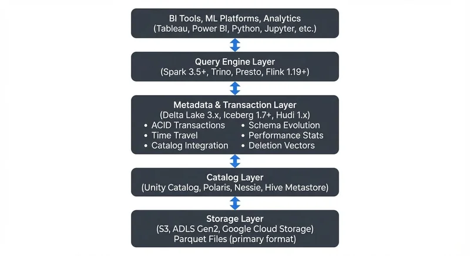

# Introduction to Lakehouse Architecture

Modern organizations face a critical challenge: how to efficiently store, process, and analyze massive volumes of diverse data types. For years, data teams have been forced to choose between the rigid structure of data warehouses and the flexible chaos of data lakes. Enter lakehouse architecture—a unified platform that promises the best of both worlds.

## What is Lakehouse Architecture?

Lakehouse architecture is a modern data management paradigm that combines the flexibility and cost-effectiveness of data lakes with the performance and ACID (Atomicity, Consistency, Isolation, Durability) transaction guarantees of data warehouses. Rather than maintaining separate systems for different workloads, a lakehouse provides a single, unified platform for all your data needs.

At its core, a lakehouse stores data in low-cost object storage (similar to data lakes) while implementing a metadata and governance layer on top (similar to data warehouses). This architecture enables both business intelligence queries and machine learning workloads to operate on the same data without requiring costly and error-prone data movement between systems.

The key innovation is the **table format layer**—technologies like Apache Iceberg 1.7+, Delta Lake 3.x, and Apache Hudi 1.x that sit between storage and compute, providing transactional guarantees and metadata management while keeping data in open formats.

## The Evolution: From Warehouses to Lakes to Lakehouses

### Traditional Data Warehouses

Data warehouses emerged in the 1980s as specialized databases optimized for analytical queries. They provide:

- **Structured data storage** with predefined schemas
- **ACID transactions** ensuring data consistency
- **High-performance SQL queries** for business intelligence
- **Data quality enforcement** through schema validation

However, warehouses come with significant limitations. They're expensive to scale, struggle with unstructured data (images, videos, logs), and require costly ETL (Extract, Transform, Load) processes to load data. Their rigid schemas make them inflexible for rapidly changing business needs.

### The Data Lake Era

Data lakes gained popularity in the 2010s as organizations needed to store massive volumes of diverse data types at lower costs. Built on technologies like Hadoop and cloud object storage, data lakes offer:

- **Schema-on-read flexibility** allowing storage of any data format (structure is applied when reading, not writing)
- **Cost-effective storage** using commodity hardware or cloud storage
- **Support for unstructured data** including logs, images, and streaming data
- **Native machine learning support** with direct access to raw data

Despite these advantages, data lakes introduced new problems. Without proper governance, they often became "data swamps"—disorganized repositories where data quality degraded over time. They lacked ACID transaction support, making it difficult to ensure data consistency. Performance for SQL queries was often poor compared to warehouses.

### The Lakehouse Solution

Lakehouse architecture emerged in the early 2020s to address the limitations of both approaches. By adding a transaction and metadata layer on top of data lake storage, lakehouses provide:

- **Unified storage** for all data types in open formats (primarily Parquet)
- **ACID transactions** through modern table formats like [Delta Lake](/delta-lake-transaction-log-how-it-works) 3.x, [Apache Iceberg](/apache-iceberg) 1.7+, or Apache Hudi 1.x
- **Schema evolution** supporting both schema-on-write (enforce structure during writes) and schema-on-read (apply structure during reads)
- **Performance optimization** through Z-ordering, [liquid clustering](/delta-lake-liquid-clustering-modern-partitioning), bloom filters, and [deletion vectors](/delta-lake-deletion-vectors-efficient-row-level-deletes)
- **Built-in governance** with fine-grained access controls, audit logging, and catalog integration
- **Time travel** allowing queries against historical table versions for auditing and debugging

## Core Components of Lakehouse Architecture

A typical lakehouse architecture consists of several key layers:



<!-- ORIGINAL_DIAGRAM
```
┌─────────────────────────────────────────────────────────┐
│           BI Tools, ML Platforms, Analytics             │
│         (Tableau, Power BI, Python, Jupyter, etc.)      │
└─────────────────────────────────────────────────────────┘
                           ↕
┌─────────────────────────────────────────────────────────┐
│              Query Engine Layer                         │
│      (Spark 3.5+, Trino, Presto, Flink 1.19+)         │
└─────────────────────────────────────────────────────────┘
                           ↕
┌─────────────────────────────────────────────────────────┐
│         Metadata & Transaction Layer                    │
│   (Delta Lake 3.x, Iceberg 1.7+, Hudi 1.x)            │
│   • ACID Transactions    • Schema Evolution            │
│   • Time Travel          • Performance Stats           │
│   • Catalog Integration  • Deletion Vectors            │
└─────────────────────────────────────────────────────────┘
                           ↕
┌─────────────────────────────────────────────────────────┐
│              Catalog Layer                              │
│    (Unity Catalog, Polaris, Nessie, Hive Metastore)   │
└─────────────────────────────────────────────────────────┘
                           ↕
┌─────────────────────────────────────────────────────────┐
│              Storage Layer                              │
│    (S3, ADLS Gen2, Google Cloud Storage)               │
│         Parquet Files (primary format)                 │
└─────────────────────────────────────────────────────────┘
```
-->

### Storage Layer

The foundation uses cost-effective object storage (AWS S3, Azure Data Lake Storage Gen2, or Google Cloud Storage) to store data in open file formats. **Parquet has emerged as the de facto standard** for lakehouse implementations due to its columnar format, excellent compression, and widespread support across all query engines. While ORC and Avro are supported, Parquet's efficient columnar storage and predicate pushdown capabilities make it ideal for analytical workloads. This ensures vendor independence and cost efficiency.

### Metadata & Transaction Layer

This critical layer provides lakehouse capabilities through modern table formats. As of 2025, the three major formats have converged on core features while maintaining distinct strengths:

- **[Apache Iceberg 1.7+](/apache-iceberg)**: Created by Netflix, now the most widely adopted format with support for REST catalogs, puffin statistics files, and [hidden partitioning](/iceberg-partitioning-and-performance-optimization). Excels at metadata management and [schema evolution](/schema-evolution-in-apache-iceberg). Offers the strongest multi-engine support (Spark, Trino, Flink, Presto, Dremio).

- **[Delta Lake 3.x](/delta-lake-transaction-log-how-it-works)**: Developed by Databricks, now features [Liquid Clustering](/delta-lake-liquid-clustering-modern-partitioning) for automatic data layout optimization, [Deletion Vectors](/delta-lake-deletion-vectors-efficient-row-level-deletes) for efficient row-level deletes, and UniForm for cross-format compatibility. Strong integration with Spark and [time travel](/time-travel-with-apache-iceberg) capabilities.

- **Apache Hudi 1.x**: Optimized by Uber, excels at incremental data processing with copy-on-write and merge-on-read storage types. Best for CDC pipelines and frequent upsert workloads.

These formats track which files belong to which table version, manage concurrent writes through optimistic concurrency control, enable [time travel queries](/time-travel-with-apache-iceberg), and maintain performance statistics for query optimization.

### Catalog Layer

The catalog layer manages table metadata, permissions, and discovery across the lakehouse. Modern catalogs include:

- **Polaris Catalog**: Snowflake's open-source REST catalog for Iceberg, offering centralized metadata management
- **Project Nessie**: Git-like catalog with branching and versioning for data, enabling data-as-code workflows
- **Unity Catalog**: Databricks' unified governance layer supporting Delta Lake, Iceberg, and Hudi
- **AWS Glue Catalog**: AWS-native catalog with [strong Iceberg integration](/iceberg-catalog-management-hive-glue-and-nessie)
- **Hive Metastore**: Legacy catalog still widely used but being phased out in favor of REST catalogs

The catalog enables [data governance](/data-governance-framework-roles-and-responsibilities), lineage tracking, and cross-platform table discovery.

### Query Engine Layer

As of 2025, compute engines have matured with robust lakehouse support:

- **Apache Spark 3.5+**: Universal compute engine with excellent support for all three table formats. Handles both batch and [streaming workloads](/flink-vs-spark-streaming-when-to-choose-each).
- **Trino**: Distributed SQL query engine optimized for interactive analytics, with strong Iceberg support
- **Apache Flink 1.19+**: [Stream processing powerhouse](/what-is-apache-flink-stateful-stream-processing) with growing batch capabilities and native Iceberg integration
- **Presto**: Facebook's original distributed SQL engine, now largely superseded by Trino

These engines leverage the metadata layer to optimize query plans, perform predicate pushdown, skip irrelevant files, and read only necessary columns (projection pushdown).

### Analytics & ML Layer

Business intelligence tools, data science platforms, and machine learning frameworks connect directly to the lakehouse, eliminating the need for separate systems.

## Streaming Integration in Lakehouse Architecture

One of the most powerful aspects of lakehouse architecture is its native support for both batch and streaming data processing. Modern data platforms must handle real-time data streams from applications, IoT devices, and event-driven systems, implementing what's known as **Kappa architecture**—a unified streaming approach that has largely replaced the older Lambda architecture pattern.

### Streaming Data Ingestion

Lakehouse platforms integrate seamlessly with streaming technologies:

- **[Apache Kafka](/apache-kafka)** serves as the primary streaming backbone for real-time event ingestion, providing durable, scalable message queuing
- **Apache Flink 1.19+** and **Spark 3.5+ Structured Streaming** process streams before writing to the lakehouse, with both engines now supporting native Iceberg writes
- **[Kafka Connect](/kafka-connect-building-data-integration-pipelines)** with Iceberg/Delta Lake sinks enables direct streaming ingestion without custom code
- **Change Data Capture (CDC)** tools like Debezium continuously sync database changes into the lakehouse via Kafka

### Example: Streaming to Iceberg with Flink

Here's a practical example of writing streaming data from Kafka to an Iceberg table:

```java
// Flink 1.19+ streaming to Iceberg
StreamExecutionEnvironment env = StreamExecutionEnvironment.getExecutionEnvironment();
TableEnvironment tableEnv = TableEnvironment.create(env);

// Configure Iceberg catalog
tableEnv.executeSql(
  "CREATE CATALOG iceberg_catalog WITH ("
  + "'type'='iceberg',"
  + "'catalog-impl'='org.apache.iceberg.rest.RESTCatalog',"
  + "'uri'='https://your-catalog.com/api/v1')"
);

// Read from Kafka and write to Iceberg with exactly-once semantics
tableEnv.executeSql(
  "INSERT INTO iceberg_catalog.db.events "
  + "SELECT event_id, user_id, event_type, event_time "
  + "FROM kafka_source"
);
```

### Stream Processing Management with Conduktor

Managing streaming infrastructure requires specialized expertise and governance. **Conduktor** provides comprehensive capabilities for data teams building lakehouse ingestion pipelines:

- **Kafka Cluster Management**: Monitor and manage Kafka clusters with intuitive dashboards, tracking lag, throughput, and consumer health
- **Data Governance**: Enforce schema validation, data contracts, and quality policies on streaming data before it reaches the lakehouse
- **Testing & Validation**: Use Conduktor Gateway to inject chaos scenarios, test failure handling, and validate exactly-once semantics
- **Pipeline Debugging**: Visualize data flows, inspect message payloads, and troubleshoot connector configurations

By integrating Conduktor with lakehouse architecture, organizations can build robust end-to-end data pipelines that maintain high data quality from ingestion through analytics.

### Unified Batch and Streaming (Kappa Architecture)

Modern lakehouse table formats enable **Kappa architecture**—a unified streaming paradigm that processes all data as streams. This approach has superseded Lambda architecture by supporting both:

- **Batch writes** for large-scale data loads and historical backfills
- **Streaming writes** with ACID guarantees for real-time upserts and incremental updates
- **Unified queries** that seamlessly read both batch and streaming data from the same tables
- **Exactly-once semantics** ensuring no duplicate or lost records

This eliminates the complexity of maintaining separate hot and cold data paths while providing consistent data across all query patterns.

## Benefits of Lakehouse Architecture

### Cost Efficiency

By consolidating data warehouses and data lakes into a single platform, organizations reduce:

- Storage costs through object storage pricing
- Data duplication across multiple systems
- Operational overhead of managing separate platforms
- ETL pipeline complexity and associated compute costs

### Simplified Data Management

Data teams benefit from:

- Single source of truth for all analytics and ML workloads
- Reduced data movement and synchronization issues
- Unified security and governance policies
- Simplified data lineage and compliance

### Performance and Flexibility

Lakehouses deliver:

- Near-warehouse performance for SQL queries through optimizations
- Direct access to raw data for machine learning
- Support for diverse workloads on the same data
- Real-time and batch processing in one platform

## Getting Started with Lakehouse Architecture

For organizations considering lakehouse adoption in 2025:

1. **Assess current architecture**: Identify pain points with existing warehouse and lake separation. Calculate costs of data duplication, ETL complexity, and operational overhead.

2. **Choose a table format**:
   - **[Apache Iceberg](/apache-iceberg)**: Best choice for multi-engine environments (Spark, Trino, Flink). Strongest community momentum and vendor support in 2025.
   - **[Delta Lake](/delta-lake-transaction-log-how-it-works)**: Best if you're heavily invested in Databricks or Spark-centric workflows. UniForm enables cross-format compatibility.
   - **Apache Hudi**: Best for CDC-heavy workloads with frequent upserts.

3. **Select a catalog strategy**: Choose between REST catalogs (Polaris, Nessie) for cloud-native flexibility or Unity Catalog for comprehensive governance. Avoid Hive Metastore for new implementations.

4. **Start with a pilot**: Migrate a single analytical use case (e.g., event analytics, customer 360) to validate the approach. Measure query performance, cost savings, and operational complexity.

5. **Build streaming pipelines**:
   - Set up [Kafka infrastructure](/apache-kafka) for event streaming
   - Use [Kafka Connect](/kafka-connect-building-data-integration-pipelines) or [Flink](/what-is-apache-flink-stateful-stream-processing) for lakehouse writes
   - Implement Conduktor for monitoring, governance, and testing

6. **Implement governance from day one**:
   - Establish [data governance framework](/data-governance-framework-roles-and-responsibilities) with clear ownership
   - Build [business glossary](/building-a-business-glossary-for-data-governance) for term standardization
   - Implement [data catalog](/what-is-a-data-catalog-modern-data-discovery) for discovery and lineage

7. **Train your team**: Invest in upskilling data engineers on table format internals, streaming patterns, and catalog management. Lakehouse architecture requires different thinking than traditional warehouses.

## Comparison: Data Warehouse vs Data Lake vs Lakehouse

| Feature | Data Warehouse | Data Lake | Lakehouse (2025) |
|---------|---------------|-----------|------------------|
| **Storage Format** | Proprietary | Open (any format) | Open (primarily Parquet) |
| **Schema** | Schema-on-write | Schema-on-read | Both supported |
| **ACID Transactions** | Yes | No | Yes (Iceberg/Delta/Hudi) |
| **Performance** | Excellent for BI | Poor for structured queries | Near-warehouse for BI, excellent for ML |
| **Cost** | High (proprietary compute+storage) | Low (object storage) | Low (object storage + open compute) |
| **Data Types** | Structured only | All types | All types |
| **Time Travel** | Limited | No | Yes (snapshot-based) |
| **Schema Evolution** | Difficult | Easy | Easy with compatibility checks |
| **Governance** | Built-in | Requires external tools | Built-in (catalog layer) |
| **Best For** | BI dashboards, reports | Raw data archival, ML | Unified analytics + ML + streaming |

## Conclusion

Lakehouse architecture represents a fundamental shift in how organizations approach data infrastructure. By unifying the capabilities of data warehouses and data lakes, lakehouses eliminate architectural complexity while delivering better performance, lower costs, and greater flexibility.

As of 2025, lakehouse architecture has matured significantly:

- **Table formats** (Iceberg 1.7+, Delta Lake 3.x, Hudi 1.x) provide production-grade ACID guarantees and performance optimizations
- **Query engines** (Spark 3.5+, Trino, Flink 1.19+) offer robust multi-format support and excellent performance
- **Catalogs** (Polaris, Nessie, Unity Catalog) enable enterprise governance and data discovery
- **Streaming integration** via Kafka and Flink enables real-time data ingestion with exactly-once semantics

For data architects, CTOs, and data analysts, understanding lakehouse architecture is no longer optional—it's essential for building modern, scalable data platforms. Whether you're starting fresh or evolving an existing infrastructure, the lakehouse approach offers a compelling path forward for organizations serious about becoming data-driven.

The future of data architecture is unified, open, and flexible. The lakehouse makes that future accessible today.

## Related Articles

- [Apache Iceberg: Open Table Format for Huge Analytic Tables](/apache-iceberg)
- [Delta Lake Transaction Log: How It Works](/delta-lake-transaction-log-how-it-works)
- [Schema Evolution in Apache Iceberg](/schema-evolution-in-apache-iceberg)
- [Time Travel with Apache Iceberg](/time-travel-with-apache-iceberg)
- [Iceberg Partitioning and Performance Optimization](/iceberg-partitioning-and-performance-optimization)
- [Delta Lake Liquid Clustering: Modern Partitioning](/delta-lake-liquid-clustering-modern-partitioning)
- [Delta Lake Deletion Vectors: Efficient Row-Level Deletes](/delta-lake-deletion-vectors-efficient-row-level-deletes)
- [Iceberg Catalog Management: Hive, Glue, and Nessie](/iceberg-catalog-management-hive-glue-and-nessie)
- [What is Apache Flink: Stateful Stream Processing](/what-is-apache-flink-stateful-stream-processing)
- [Kafka Connect: Building Data Integration Pipelines](/kafka-connect-building-data-integration-pipelines)
- [Data Governance Framework: Roles and Responsibilities](/data-governance-framework-roles-and-responsibilities)
- [What is a Data Catalog: Modern Data Discovery](/what-is-a-data-catalog-modern-data-discovery)

## Sources

- [Apache Iceberg 1.7.0 Documentation](https://iceberg.apache.org/docs/1.7.0/)
- [Delta Lake 3.x Documentation](https://docs.delta.io/latest/index.html)
- [Apache Hudi 1.x Documentation](https://hudi.apache.org/docs/overview/)
- [Apache Spark 3.5+ Structured Streaming](https://spark.apache.org/docs/latest/structured-streaming-programming-guide.html)
- [Apache Flink 1.19 Documentation](https://nightlies.apache.org/flink/flink-docs-release-1.19/)
- [Polaris Catalog Documentation](https://www.polaris.io/)
- [Project Nessie Documentation](https://projectnessie.org/)
- [The Data Lakehouse: Building the Next Generation of Data Platforms (2021)](https://www.cidrdb.org/cidr2021/papers/cidr2021_paper17.pdf)
- [Databricks: What is a Data Lakehouse?](https://www.databricks.com/glossary/data-lakehouse)
