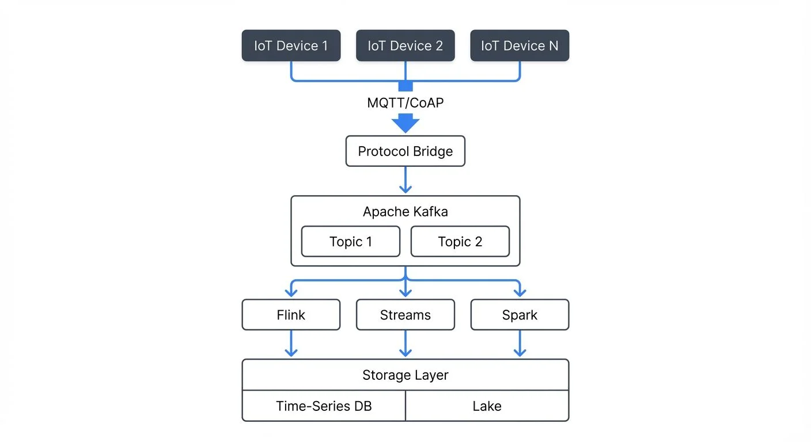

# IoT Data Streaming Architectures

The Internet of Things has transformed how we collect and process data. Billions of connected devices generate continuous streams of information, from industrial sensors monitoring equipment health to smart home devices tracking energy consumption. Traditional batch processing architectures cannot handle the volume, velocity, and variety of IoT data. This is where streaming architectures become essential.

IoT data streaming architectures enable organizations to ingest, process, and act on sensor data in real-time. These systems must handle millions of events per second, support diverse data formats, and provide low-latency processing for time-sensitive applications.

## Core Components of IoT Streaming Architectures

An effective IoT streaming architecture consists of several interconnected layers that work together to move data from devices to actionable insights.



<!-- ORIGINAL_DIAGRAM
```
┌─────────────────────────────────────────────────────────────────┐
│                    IoT Streaming Architecture                   │
└─────────────────────────────────────────────────────────────────┘

┌──────────────┐  ┌──────────────┐  ┌──────────────┐
│ IoT Device 1 │  │ IoT Device 2 │  │ IoT Device N │
└──────┬───────┘  └──────┬───────┘  └──────┬───────┘
       │                 │                 │
       └─────────────────┼─────────────────┘
                         │ MQTT/CoAP
                         ▼
              ┌──────────────────┐
              │  Protocol Bridge │
              └────────┬─────────┘
                       │
                       ▼
       ┌───────────────────────────────┐
       │       Apache Kafka            │
       │  ┌──────────┐  ┌──────────┐   │
       │  │ Topic 1  │  │ Topic 2  │   │
       │  └──────────┘  └──────────┘   │
       └───────────┬───────────────────┘
                   │
          ┌────────┼────────┐
          ▼        ▼        ▼
    ┌─────────┐ ┌─────────┐ ┌─────────┐
    │  Flink  │ │ Streams │ │  Spark  │
    └────┬────┘ └────┬────┘ └────┬────┘
         │           │           │
         └───────────┼───────────┘
                     ▼
         ┌───────────────────────┐
         │    Storage Layer      │
         ├───────────────────────┤
         │ Time-Series DB │ Lake │
         └───────────────────────┘
```
-->

### Data Ingestion Layer

The ingestion layer collects data from IoT devices and routes it into the streaming platform. MQTT 5.0 (Message Queuing Telemetry Transport) is the standard protocol for device-to-cloud communication in 2025, offering enhanced features like shared subscriptions for load balancing, message expiry intervals, and improved authentication flows. Its lightweight nature and support for unreliable networks make it ideal for constrained IoT devices.

Apache Kafka serves as the central message broker, providing durable storage and high-throughput ingestion. Modern IoT architectures leverage Kafka 4.0+ running in KRaft mode (without ZooKeeper), which simplifies deployment and improves metadata handling for millions of IoT device connections.

IoT devices publish messages to MQTT topics, which are then bridged to Kafka topics through protocol bridge services (lightweight applications that translate MQTT messages into Kafka records). This architecture decouples device communication from downstream processing, allowing the system to scale independently. For detailed coverage of Kafka's architecture, see [Apache Kafka](https://conduktor.io/glossary/apache-kafka).

### Stream Processing Layer

Once data enters the platform, stream processing engines transform, enrich, and analyze it in real-time. Apache Flink 1.19+ and Kafka Streams are popular choices for IoT workloads. They support stateful processing, windowing operations (time-based grouping of events), and complex event processing (detecting patterns across multiple events).

Flink's exactly-once semantics ensure critical IoT data like energy metering or industrial safety alerts are processed without loss or duplication. Its event time processing handles out-of-order events common when IoT devices buffer data during network interruptions. For comparing these technologies, see [Kafka Streams vs Apache Flink](https://conduktor.io/glossary/kafka-streams-vs-apache-flink).

For example, a smart city traffic management system might use Flink to aggregate vehicle speed data over five-minute windows, detect congestion patterns, and trigger alerts when traffic slows below thresholds. For more on windowing strategies, see [Windowing in Apache Flink](https://conduktor.io/glossary/windowing-in-apache-flink-tumbling-sliding-and-session-windows).

### Storage Layer

IoT architectures require multiple storage systems optimized for different access patterns. Hot data used for real-time dashboards goes into time-series databases like InfluxDB, TimescaleDB, QuestDB, or Apache IoTDB. These databases are optimized for time-stamped sensor readings and support efficient range queries.

Historical data for analytics moves to data lakes built on object storage using formats like Apache Iceberg or Delta Lake, which provide ACID transactions and schema evolution. For details on lakehouse architectures, see [Introduction to Lakehouse Architecture](https://conduktor.io/glossary/introduction-to-lakehouse-architecture) and [Streaming Ingestion to Lakehouse](https://conduktor.io/glossary/streaming-ingestion-to-lakehouse).

The storage strategy depends on retention requirements, query patterns, and cost constraints. IoT data volumes can grow rapidly, so implementing tiered storage and data lifecycle policies is essential.

## Architectural Patterns for IoT Streaming

Different IoT use cases require different architectural approaches. Understanding these patterns helps teams design systems that match their specific requirements.

### Edge-to-Cloud Architecture

Edge computing processes data close to IoT devices before sending it to the cloud. This pattern reduces bandwidth costs, improves latency for local decisions, and continues functioning during network outages.

Modern edge deployments use frameworks like AWS IoT Greengrass v2, Azure IoT Edge 2.0, Google Cloud IoT Edge, or lightweight Kubernetes distributions like K3s. These platforms enable running containerized stream processing applications (Kafka Streams, Flink) directly on edge gateways with resource constraints as low as 1GB RAM.

Edge nodes run lightweight stream processing to filter noise, aggregate readings, and detect anomalies. Only relevant data or summarized metrics flow to the cloud for long-term storage and advanced analytics. Edge devices can also run ML inference models (TinyML, TensorFlow Lite) for real-time decision-making without cloud connectivity.

A manufacturing plant might deploy edge processing on factory floor gateways. These gateways analyze vibration sensor data from machinery in real-time, triggering immediate maintenance alerts while sending hourly summaries to central systems for trend analysis. For more on real-time ML, see [Real-Time ML Inference with Streaming Data](https://conduktor.io/glossary/real-time-ml-inference-with-streaming-data).

### Lambda and Kappa Architectures

Lambda architecture maintains separate batch and stream processing paths, eventually reconciling them for complete accuracy. The batch layer reprocesses historical data to correct any streaming errors, while the speed layer provides real-time results.

Kappa architecture simplifies this by using only stream processing. All data flows through the streaming platform, and batch operations become replay operations over the same stream. For IoT systems with well-defined schemas and reliable processing logic, Kappa reduces operational complexity.

## Data Streaming Technologies in IoT

Modern IoT architectures rely on specialized streaming technologies designed to handle the unique challenges of sensor data.

### Apache Kafka for IoT

Kafka 4.0+ excels at IoT ingestion due to its high throughput, durability, and scalability. Topics can be partitioned by device ID or geographic region to parallelize processing. KRaft mode eliminates ZooKeeper, simplifying operations and improving metadata scalability for millions of IoT devices. Kafka's retention policies let organizations keep raw sensor data for days or weeks, enabling reprocessing if business logic changes.

For large-scale deployments, Tiered Storage offloads older IoT data to cost-effective object storage while keeping recent data on fast local disks. This dramatically reduces storage costs for long retention requirements. For details, see [Tiered Storage in Kafka](https://conduktor.io/glossary/tiered-storage-in-kafka).

Schema Registry ensures IoT data maintains consistent structure as devices evolve. When a sensor manufacturer updates firmware and adds new fields, Schema Registry manages backward compatibility across the streaming pipeline using versioned Avro, Protobuf, or JSON schemas. Each IoT message references a schema ID, enabling consumers to deserialize data correctly even as device fleets evolve over months or years. For schema management strategies, see [Schema Registry and Schema Management](https://conduktor.io/glossary/schema-registry-and-schema-management) and [Schema Evolution Best Practices](https://conduktor.io/glossary/schema-evolution-best-practices).

### Apache Flink for Real-Time Analytics

Flink 1.19+ processes IoT streams with exactly-once semantics, critical for applications like energy metering or financial transactions. Its event time processing handles out-of-order events common in IoT systems where devices may buffer data during network interruptions. Watermarks track event time progress, enabling accurate windowing even with delayed sensor readings.

Flink's stateful stream processing enables complex operations like sessionization of user interactions with smart devices or correlation of events from multiple sensors to detect system-wide patterns. State backends (RocksDB for large state, heap for low latency) can be configured based on IoT workload characteristics. For comprehensive coverage, see [What is Apache Flink](https://conduktor.io/glossary/what-is-apache-flink-stateful-stream-processing) and [Watermarks and Triggers in Stream Processing](https://conduktor.io/glossary/watermarks-and-triggers-in-stream-processing).

### Protocol Bridges and Integration

IoT ecosystems use various protocols beyond MQTT 5.0, including:

- **CoAP (Constrained Application Protocol)** with DTLS 1.3 for secure communication on resource-constrained devices
- **HTTP/3 over QUIC** for reliable, low-latency communication with reduced head-of-line blocking
- **AMQP 1.0** for enterprise messaging with transactional semantics
- **Proprietary protocols** from industrial equipment manufacturers

Streaming architectures employ protocol bridges—lightweight services (often written in Go or Rust for performance) that translate between device protocols and Kafka. These bridges handle authentication, protocol translation, and message batching before publishing to Kafka topics. Cloud IoT platforms like AWS IoT Core, Azure IoT Hub, and Google Cloud IoT Core provide managed protocol bridges with built-in device management, certificate provisioning, and fleet monitoring.

Protocol bridges standardize data formats early in the pipeline, simplifying downstream processing and enabling a single Kafka cluster to ingest data from diverse IoT device fleets. For serialization strategies, see [Message Serialization in Kafka](https://conduktor.io/glossary/message-serialization-in-kafka).

## Challenges and Best Practices

Building production IoT streaming architectures requires addressing several operational and technical challenges.

### Scalability and Resource Management

IoT deployments can grow from thousands to millions of devices rapidly. Architectures must scale horizontally by adding brokers, processing nodes, and storage capacity without downtime. Auto-scaling based on ingestion rates and processing lag helps manage variable workloads. Kubernetes-based deployments using operators like Strimzi enable dynamic scaling of Kafka clusters in response to IoT traffic patterns. For Kubernetes deployment strategies, see [Running Kafka on Kubernetes](https://conduktor.io/glossary/running-kafka-on-kubernetes) and [Strimzi Kafka Operator](https://conduktor.io/glossary/strimzi-kafka-operator-for-kubernetes).

Kafka cluster management becomes critical at scale. Conduktor provides comprehensive visibility into partition distribution, consumer lag, cluster health, and topic configuration ([Topics Guide](https://docs.conduktor.io/guide/manage-kafka/kafka-resources/topics)), enabling teams to identify bottlenecks before they impact data freshness. Real-time monitoring of consumer lag helps detect when downstream processors cannot keep pace with IoT device ingestion rates ([Monitoring](https://docs.conduktor.io/guide/monitor-brokers-apps/index)). For monitoring strategies, see [Kafka Cluster Monitoring and Metrics](https://conduktor.io/glossary/kafka-cluster-monitoring-and-metrics).

### Data Quality and Schema Evolution

IoT sensors operate in harsh environments and may send malformed data due to hardware failures or network corruption. Stream processing logic should validate data against schemas, filter invalid readings, and route anomalies to dead-letter queues for investigation. Data quality frameworks can monitor IoT streams for anomalies like missing sensor readings, out-of-range values, or timestamp drift. For error handling patterns, see [Dead Letter Queues for Error Handling](https://conduktor.io/glossary/dead-letter-queues-for-error-handling).

As device fleets evolve, schemas change. Implementing schema versioning and compatibility rules (forward, backward, full) ensures new device versions don't break existing processing pipelines. Schema Registry enforces compatibility policies, preventing incompatible schema changes that would break downstream consumers. Schema governance features help teams manage schema evolution across distributed IoT deployments with thousands of device types. For detailed guidance, see [Schema Evolution Best Practices](https://conduktor.io/glossary/schema-evolution-best-practices).

### Security and Access Control

IoT data often contains sensitive information requiring encryption in transit and at rest. Modern IoT architectures use TLS 1.3 for device-to-cloud communication, providing improved security and reduced handshake latency. Mutual TLS (mTLS) authenticates both devices and servers using X.509 certificates, preventing unauthorized devices from connecting to the platform.

Kafka supports authentication via SSL certificates, SASL (SCRAM, PLAIN, GSSAPI), or OAuth 2.0 for machine-to-machine communication. Fine-grained access control using ACLs ensures only authorized applications can consume specific sensor data streams. For example, building management applications can read HVAC sensor data but not security camera streams. For comprehensive security guidance, see [Kafka Security Best Practices](https://conduktor.io/glossary/kafka-security-best-practices), [Kafka Authentication](https://conduktor.io/glossary/kafka-authentication-sasl-ssl-oauth), [Kafka ACLs and Authorization Patterns](https://conduktor.io/glossary/kafka-acls-and-authorization-patterns), and [mTLS for Kafka](https://conduktor.io/glossary/mtls-for-kafka).

### Monitoring and Observability

Production IoT systems require comprehensive monitoring of device connectivity, message throughput, processing latency, and data quality metrics. Modern observability stacks use OpenTelemetry for instrumentation, exporting traces, metrics, and logs to centralized platforms.

Key IoT metrics to monitor include:
- **Device connectivity**: Online/offline status, connection duration, reconnection frequency
- **Ingestion rates**: Messages per second per device type, payload sizes, topic throughput
- **Processing lag**: Consumer lag across stream processing applications, end-to-end latency from device to storage
- **Data quality**: Schema validation failures, null value rates, out-of-range sensor readings

Distributed tracing (OpenTelemetry traces through MQTT bridges, Kafka, and Flink) helps diagnose issues spanning edge gateways, message brokers, and processing engines. Prometheus scrapes metrics from Kafka exporters, Flink job managers, and custom IoT metrics endpoints. Grafana dashboards visualize device fleet health, data pipelines, and alerting thresholds. For monitoring infrastructure, see [Kafka Cluster Monitoring and Metrics](https://conduktor.io/glossary/kafka-cluster-monitoring-and-metrics).

## IoT Streaming Architecture Example

Here's a practical example of publishing IoT sensor data to Kafka via an MQTT bridge:

```python
# IoT device publishing temperature readings via MQTT
import paho.mqtt.client as mqtt
import json
import time
from datetime import datetime

def publish_sensor_data():
    client = mqtt.Client()
    client.tls_set(ca_certs="ca.pem", certfile="device.crt", keyfile="device.key")
    client.connect("mqtt.iot-platform.com", 8883)

    while True:
        reading = {
            "device_id": "temp-sensor-001",
            "timestamp": datetime.utcnow().isoformat(),
            "temperature": 22.5,
            "humidity": 45.2,
            "location": {"lat": 37.7749, "lon": -122.4194}
        }

        # Publish to MQTT topic (bridged to Kafka)
        client.publish("sensors/temperature", json.dumps(reading))
        time.sleep(10)

# Kafka Streams processing IoT data
from kafka import KafkaConsumer
import json

consumer = KafkaConsumer(
    'iot.sensors.temperature',
    bootstrap_servers=['kafka-1:9092', 'kafka-2:9092'],
    security_protocol='SASL_SSL',
    sasl_mechanism='SCRAM-SHA-512',
    auto_offset_reset='latest',
    value_deserializer=lambda m: json.loads(m.decode('utf-8'))
)

for message in consumer:
    sensor_data = message.value

    # Detect temperature anomalies
    if sensor_data['temperature'] > 30.0:
        print(f"Alert: High temperature detected at {sensor_data['device_id']}")
        # Publish alert to downstream topic
```

This architecture enables:
- Secure device communication using TLS 1.3 and X.509 certificates
- Protocol translation from MQTT to Kafka for unified stream processing
- Real-time anomaly detection with sub-second latency
- Horizontal scalability to millions of devices

For building Kafka-based data pipelines, see [Kafka Connect: Building Data Integration Pipelines](https://conduktor.io/glossary/kafka-connect-building-data-integration-pipelines) and [Streaming Data Pipeline](https://conduktor.io/glossary/streaming-data-pipeline).

## Real-World IoT Streaming Use Cases

### Smart City Traffic Management

A metropolitan area deploys 10,000 traffic sensors across intersections, measuring vehicle counts, speeds, and pedestrian activity. These sensors publish readings every second to MQTT topics, bridged to Kafka.

Flink processes the streams to calculate real-time congestion scores, predict traffic patterns using historical data, and optimize traffic light timing. City operators view live dashboards built on the processed streams, while urban planners query historical data from the data lake to design infrastructure improvements.

### Industrial Predictive Maintenance

Manufacturing equipment contains hundreds of sensors monitoring temperature, vibration, pressure, and electrical current. An edge gateway collects readings every 100 milliseconds, running local anomaly detection algorithms.

When anomalies exceed thresholds, the gateway publishes detailed diagnostic data to Kafka topics. Cloud-based Flink jobs correlate patterns across multiple machines, predict component failures, and automatically schedule maintenance before breakdowns occur. This reduces unplanned downtime by 40% and extends equipment lifespan.

## Summary

IoT data streaming architectures enable organizations to harness the value of sensor data in real-time. These systems combine specialized ingestion protocols like MQTT 5.0 and HTTP/3 with powerful streaming platforms like Apache Kafka 4.0+ and Apache Flink 1.19+ to handle massive scale and low-latency requirements.

Modern IoT architectures in 2025 leverage:
- **KRaft-mode Kafka** for simplified operations and improved scalability to millions of devices
- **Edge computing frameworks** (AWS IoT Greengrass v2, Azure IoT Edge, K3s) for local processing and ML inference
- **Cloud IoT platforms** (AWS IoT Core, Azure IoT Hub) for managed protocol bridges and device management
- **Schema Registry** for managing data evolution across heterogeneous device fleets
- **OpenTelemetry, Prometheus, and Grafana** for comprehensive observability
- **Conduktor** for Kafka management, monitoring, and governance at scale

Effective architectures balance edge and cloud processing, implement robust data quality controls, and scale seamlessly as device fleets grow. By following architectural patterns like edge-to-cloud designs and adopting best practices for security (TLS 1.3, mTLS), schema management, and monitoring, teams can build reliable IoT streaming systems.

The combination of proven streaming technologies with proper operational tooling creates platforms that transform raw sensor data into actionable intelligence, powering applications from smart cities to industrial automation and predictive maintenance.

## Related Concepts

- [Apache Kafka](/apache-kafka) - Distributed streaming platform for IoT data ingestion
- [What is Apache Flink: Stateful Stream Processing](/what-is-apache-flink-stateful-stream-processing) - Real-time IoT analytics and pattern detection
- [Consumer Lag Monitoring](/consumer-lag-monitoring) - Monitor IoT data pipeline health and performance

## Sources and References

1. Apache Kafka Documentation - "Use Cases: Internet of Things" (https://kafka.apache.org/uses)
2. MQTT Version 5.0 Specification - OASIS Standard (https://docs.oasis-open.org/mqtt/mqtt/v5.0/mqtt-v5.0.html)
3. Eclipse Mosquitto - "MQTT and Kafka Integration Patterns" (https://mosquitto.org/)
4. AWS IoT Core Documentation - "Architecture Best Practices" (https://docs.aws.amazon.com/iot/)
5. Azure IoT Hub Documentation - "Device-to-Cloud Communication Guidance" (https://docs.microsoft.com/azure/iot-hub/)
6. Apache Flink Documentation - "Event Time and Watermarks" (https://nightlies.apache.org/flink/flink-docs-release-1.19/)
7. Conduktor Platform - "Kafka Management for IoT Workloads" (https://www.conduktor.io/)
8. OpenTelemetry Documentation - "Distributed Tracing for IoT Systems" (https://opentelemetry.io/docs/)
