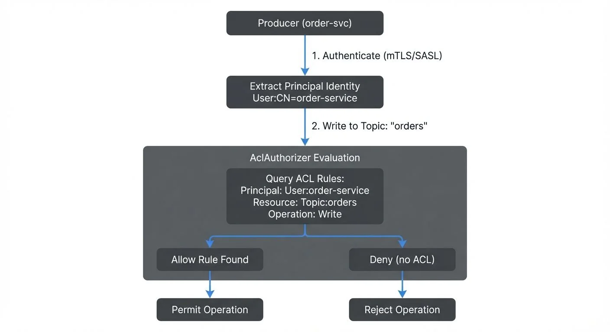

# Kafka ACLs and Authorization Patterns

Security in distributed systems is not optional. As Apache Kafka deployments grow from proof-of-concept experiments to mission-critical production platforms, controlling who can read, write, and manage streaming data becomes essential. Access Control Lists (ACLs) provide the foundation for authorization in Kafka, enabling organizations to enforce fine-grained permissions across topics, consumer groups, and cluster operations.

This article explores how Kafka ACLs work in modern KRaft-based clusters (Kafka 4.0+), modern authorization patterns including OAuth 2.0 and Open Policy Agent integration, and practical approaches to managing access control at scale.

## Prerequisites

Before diving into Kafka ACLs, you should understand:
- Basic Kafka concepts (topics, partitions, producers, consumers)
- Authentication mechanisms (see [Kafka Authentication: SASL, SSL, and OAuth](https://conduktor.io/glossary/kafka-authentication-sasl-ssl-oauth))
- The distinction between authentication (proving identity) and authorization (controlling access)
- KRaft mode architecture (see [Understanding KRaft Mode in Kafka](https://conduktor.io/glossary/understanding-kraft-mode-in-kafka))

## Understanding Kafka ACLs

An Access Control List in Kafka defines permissions that determine which principals (authenticated users or applications) can perform specific operations on particular resources. Unlike authentication, which verifies identity, authorization ensures that authenticated entities only access what they are permitted to.

Kafka ACLs follow a structured format with four core components:

- **Principal**: The identity attempting the operation
- **Resource**: The Kafka resource being accessed
- **Operation**: The action being performed
- **Permission Type**: Allow or Deny

### Principal Types

Principals represent authenticated identities in Kafka ACLs. The format depends on the authentication mechanism:

- **User principals**: `User:username` or `User:CN=service-name` (for mTLS, see [mTLS for Kafka](https://conduktor.io/glossary/mtls-for-kafka))
- **Group principals**: `Group:team-analytics` (when using group-based authorization)
- **Wildcard**: `User:*` grants permissions to all authenticated users (use with extreme caution)

For example, an ACL might specify: "User:analytics-app is allowed to Read from Topic:clickstream-events." Without this explicit permission, the analytics application would be denied access even if properly authenticated.

### ACL Storage in KRaft Mode

In modern Kafka deployments (Kafka 3.3+), ACLs are stored in the `__cluster_metadata` topic managed by KRaft controllers. This represents a significant improvement over the legacy approach where ACLs were stored in ZooKeeper (replaced by KRaft in Kafka 4.0+), providing:

- **Faster propagation**: Metadata changes replicate through Kafka's native replication, reducing latency from seconds to milliseconds
- **Simplified operations**: No external ZooKeeper cluster to manage and monitor
- **Better scalability**: The metadata topic scales with Kafka's proven log architecture
- **Consistent views**: All brokers read from the same replicated log, eliminating metadata inconsistencies

Legacy note: Kafka versions prior to 3.3 stored ACLs in ZooKeeper (legacy, replaced by KRaft in Kafka 4.0+) under `/kafka-acl` znodes. If migrating from ZooKeeper to KRaft, see [ZooKeeper to KRaft Migration](https://conduktor.io/glossary/zookeeper-to-kraft-migration).

### Authorizer Implementation

Kafka evaluates ACLs through the **StandardAuthorizer** class (introduced in Kafka 3.0, replacing the older AclAuthorizer). When a client attempts an operation, Kafka checks all applicable ACLs and denies access unless an explicit Allow rule exists. This deny-by-default model provides strong security guarantees.

To enable authorization, configure your broker with:

```properties
# Kafka 3.0+ configuration
authorizer.class.name=org.apache.kafka.metadata.authorizer.StandardAuthorizer

# Deny access by default if no ACL found (CRITICAL for security)
allow.everyone.if.no.acl.found=false

# Superusers bypass all ACL checks (for admin operations)
super.users=User:admin;User:kafka-operator
```

## How Kafka Authorization Works

Authorization in Kafka operates through the Authorizer interface. The default implementation, StandardAuthorizer, evaluates permissions whenever a client performs an operation.

Consider a producer attempting to write to a topic. The authorization flow includes:



<!-- ORIGINAL_DIAGRAM
```
┌─────────────────────────────────────────────────────────────────┐
│              Kafka ACL Authorization Flow                       │
├─────────────────────────────────────────────────────────────────┤
│                                                                 │
│  ┌──────────────┐                                               │
│  │   Producer   │                                               │
│  │ (order-svc)  │                                               │
│  └──────┬───────┘                                               │
│         │                                                       │
│         │ 1. Authenticate (mTLS/SASL)                           │
│         ▼                                                       │
│  ┌──────────────────────────────────────┐                      │
│  │    Extract Principal Identity        │                      │
│  │    User:CN=order-service             │                      │
│  └──────────────┬───────────────────────┘                      │
│                 │                                               │
│                 │ 2. Write to Topic: "orders"                   │
│                 ▼                                               │
│  ┌──────────────────────────────────────┐                      │
│  │      AclAuthorizer Evaluation        │                      │
│  │  ┌────────────────────────────────┐  │                      │
│  │  │ Query ACL Rules:               │  │                      │
│  │  │ Principal: User:order-service  │  │                      │
│  │  │ Resource: Topic:orders         │  │                      │
│  │  │ Operation: Write               │  │                      │
│  │  └───────────┬────────────────────┘  │                      │
│  └──────────────┼───────────────────────┘                      │
│                 │                                               │
│        ┌────────┴────────┐                                      │
│        ▼                 ▼                                      │
│  ┌──────────┐      ┌──────────┐                                │
│  │  Allow   │      │  Deny    │                                │
│  │  Rule    │      │  (no ACL)│                                │
│  │  Found   │      │          │                                │
│  └────┬─────┘      └────┬─────┘                                │
│       │                 │                                       │
│       ▼                 ▼                                       │
│  ┌──────────┐      ┌──────────┐                                │
│  │ Permit   │      │ Reject   │                                │
│  │Operation │      │Operation │                                │
│  └──────────┘      └──────────┘                                │
│                                                                 │
└─────────────────────────────────────────────────────────────────┘
```
-->

1. The client authenticates (via SASL, mTLS, or another mechanism)
2. The principal identity is extracted (e.g., `User:order-service`)
3. The producer attempts a Write operation on a Topic resource
4. AclAuthorizer queries stored ACLs for matching rules
5. If an Allow rule exists, the operation proceeds; otherwise, it is denied

A typical producer needs Write, Describe, and optionally Create permissions. Consumers require even more permissions because they interact with both topics and consumer groups (Read and Describe on both resources).

Missing any of these ACLs results in authorization failures that can be difficult to diagnose in production (see the Troubleshooting section below).

## Resource Patterns and Operations

Kafka supports multiple resource pattern types that control how ACLs match resources, enabling flexible permission management.

### Resource Pattern Types

**LITERAL**: Exact match only. An ACL for `--resource-pattern-type literal --topic orders` only applies to the topic named exactly "orders".

**PREFIXED**: Matches resources starting with the specified prefix. An ACL for `--resource-pattern-type prefixed --topic team-a.` applies to `team-a.orders`, `team-a.payments`, `team-a.inventory`, etc.

**MATCH**: (Not commonly used for ACL creation) Matches resources that would be matched by literal or prefixed patterns.

Example using prefixed patterns:

```bash
# Grant Team A write access to all topics starting with "team-a."
kafka-acls.sh --bootstrap-server localhost:9092 \
  --add \
  --allow-principal User:team-a-app \
  --operation Write \
  --operation Describe \
  --resource-pattern-type prefixed \
  --topic team-a.

# This grants access to:
# - team-a.orders
# - team-a.payments
# - team-a.analytics
# But NOT to team-b.orders or shared.events
```

Prefixed patterns dramatically reduce ACL sprawl in environments with many topics. Instead of creating individual ACLs for 50 team-specific topics, one prefixed ACL covers them all.

### Common Operations by Resource Type

Different Kafka resources support different operations:

**Topic Operations**:
- Read: Consume messages from the topic
- Write: Produce messages to the topic
- Create: Create the topic (auto-creation)
- Delete: Delete the topic
- Describe: View topic metadata and configuration
- Alter: Modify topic configuration
- DescribeConfigs: View topic configurations
- AlterConfigs: Modify topic configurations

**Group Operations** (for consumer groups):
- Read: Join the consumer group and consume
- Describe: View consumer group metadata and offsets
- Delete: Delete the consumer group

**Cluster Operations**:
- Create: Create topics at the cluster level
- ClusterAction: Execute cluster-level operations
- Describe: View cluster metadata
- Alter: Modify cluster-level settings
- DescribeConfigs: View broker configurations
- AlterConfigs: Modify broker configurations
- IdempotentWrite: Enable idempotent producer writes

**TransactionalId Operations** (for transactional producers):
- Describe: View transactional state
- Write: Use the transactional ID for transactions

### Practical ACL Examples

**Basic Producer** (writing to a specific topic):

```bash
# Producer needs Write and Describe on the topic
kafka-acls.sh --bootstrap-server localhost:9092 \
  --add \
  --allow-principal User:payment-service \
  --operation Write \
  --operation Describe \
  --topic payments.completed

# For idempotent producers, also grant ClusterAction
kafka-acls.sh --bootstrap-server localhost:9092 \
  --add \
  --allow-principal User:payment-service \
  --operation IdempotentWrite \
  --cluster
```

**Basic Consumer** (reading from a topic):

```bash
# Consumer needs Read and Describe on the topic
kafka-acls.sh --bootstrap-server localhost:9092 \
  --add \
  --allow-principal User:analytics-service \
  --operation Read \
  --operation Describe \
  --topic payments.completed

# Consumer also needs Read on the consumer group
kafka-acls.sh --bootstrap-server localhost:9092 \
  --add \
  --allow-principal User:analytics-service \
  --operation Read \
  --group analytics-group
```

**Stream Processing Application** (reading from input, writing to output):

```bash
# Input topic permissions
kafka-acls.sh --bootstrap-server localhost:9092 \
  --add \
  --allow-principal User:fraud-detector \
  --operation Read \
  --operation Describe \
  --topic transactions.raw

# Output topic permissions
kafka-acls.sh --bootstrap-server localhost:9092 \
  --add \
  --allow-principal User:fraud-detector \
  --operation Write \
  --operation Describe \
  --operation Create \
  --topic transactions.fraud-alerts

# Consumer group for state management
kafka-acls.sh --bootstrap-server localhost:9092 \
  --add \
  --allow-principal User:fraud-detector \
  --operation Read \
  --group fraud-detector-app

# For Kafka Streams internal topics (if using)
kafka-acls.sh --bootstrap-server localhost:9092 \
  --add \
  --allow-principal User:fraud-detector \
  --operation All \
  --resource-pattern-type prefixed \
  --topic fraud-detector-
```

**Admin/Operator** (managing topics and configurations):

```bash
# Grant broad permissions for cluster administration
kafka-acls.sh --bootstrap-server localhost:9092 \
  --add \
  --allow-principal User:kafka-admin \
  --operation All \
  --topic '*' \
  --cluster \
  --group '*'

# Or use superuser configuration (recommended)
# In server.properties: super.users=User:kafka-admin
```

## Common Authorization Patterns

Organizations typically adopt authorization patterns that align with their operational structure and security requirements.

### Team-Based Access Control

Many companies organize ACLs around team boundaries. An analytics team might have read-only access to all topics, while application teams have full control over their own topics:

- Analytics team: Read access to `clickstream.*`, `orders.*`, `inventory.*`
- Orders team: Full access to `orders.*` topics and consumer groups
- Inventory team: Full access to `inventory.*` topics and consumer groups

This pattern mirrors role-based access control (RBAC) principles and simplifies permission management as teams scale.

### Environment Separation

Production, staging, and development environments often require different authorization policies. A common pattern uses separate Kafka clusters with distinct ACL configurations:

- Production: Strict ACLs requiring explicit approval for all operations
- Staging: Relaxed ACLs allowing broader access for testing
- Development: Minimal ACLs or even disabled authorization

Some organizations use Kafka topic prefixes (e.g., `dev.`, `staging.`, `prod.`) to implement environment separation within a single cluster, though this approach requires careful ACL management.

### Service-Based Permissions

Microservices architectures benefit from service-specific principals where each service has a unique identity and receives only the permissions it needs:

- `User:payment-service`: Write to `payments.completed`, Read from `orders.validated`
- `User:notification-service`: Read from `payments.completed`, `orders.shipped`
- `User:analytics-service`: Read from all topics via wildcard ACL

This principle of least privilege minimizes blast radius if a service is compromised.

## Modern Authorization Patterns for 2025

Beyond traditional ACLs, modern Kafka deployments increasingly adopt advanced authorization patterns that integrate with cloud-native security frameworks and organizational identity systems.

### OAuth 2.0 and OIDC Integration

OAuth 2.0 with OpenID Connect (OIDC) has become the standard authentication mechanism for cloud-native applications. Kafka 2.0+ supports OAuth through the SASL/OAUTHBEARER mechanism, enabling integration with identity providers like Okta, Auth0, Keycloak, or cloud provider IAM systems.

In OAuth-based authorization:

1. Clients authenticate with the identity provider and receive a JWT token
2. The JWT token is presented to Kafka brokers
3. Kafka validates the token and extracts principal identity from claims
4. Standard ACLs are evaluated using the extracted principal

This pattern enables centralized identity management, single sign-on (SSO), and dynamic credential rotation without restarting Kafka clients.

Example broker configuration for OAuth:

```properties
# Enable OAuth authentication
sasl.enabled.mechanisms=OAUTHBEARER
sasl.mechanism.inter.broker.protocol=OAUTHBEARER

# Configure OAuth validation
listener.name.sasl_ssl.oauthbearer.sasl.jaas.config=org.apache.kafka.common.security.oauthbearer.OAuthBearerLoginModule required;
listener.name.sasl_ssl.oauthbearer.sasl.login.callback.handler.class=io.strimzi.kafka.oauth.client.JaasClientOauthLoginCallbackHandler
listener.name.sasl_ssl.oauthbearer.sasl.server.callback.handler.class=io.strimzi.kafka.oauth.server.JaasServerOauthValidatorCallbackHandler

# OAuth issuer URL
oauth.token.endpoint.uri=https://auth.company.com/oauth/token
oauth.jwks.endpoint.uri=https://auth.company.com/oauth/jwks
oauth.valid.issuer.uri=https://auth.company.com
```

Example producer configuration:

```properties
security.protocol=SASL_SSL
sasl.mechanism=OAUTHBEARER
sasl.jaas.config=org.apache.kafka.common.security.oauthbearer.OAuthBearerLoginModule required \
  oauth.client.id="payment-service" \
  oauth.client.secret="***" \
  oauth.token.endpoint.uri="https://auth.company.com/oauth/token";
sasl.login.callback.handler.class=io.strimzi.kafka.oauth.client.JaasClientOauthLoginCallbackHandler
```

Once OAuth authentication establishes identity, traditional ACLs control what the authenticated principal can access. For comprehensive OAuth setup, see [Kafka Authentication: SASL, SSL, and OAuth](https://conduktor.io/glossary/kafka-authentication-sasl-ssl-oauth).

### Open Policy Agent (OPA) Integration

Open Policy Agent provides policy-based authorization using the Rego policy language. OPA decouples authorization logic from application code, enabling centralized policy management and sophisticated authorization rules based on multiple attributes.

Instead of static ACLs, OPA can make authorization decisions based on:
- Principal identity and group membership
- Resource attributes (topic names, partitions)
- Operation types
- Contextual information (time of day, client IP, request metadata)
- External data sources (user databases, compliance systems)

Example OPA policy for time-based access control:

```rego
package kafka.authz

import future.keywords.if

# Allow analytics team to read only during business hours
allow if {
    input.principal.name == "analytics-service"
    input.operation.name == "Read"
    is_business_hours
}

is_business_hours if {
    hour := time.clock(time.now_ns())[0]
    hour >= 9
    hour < 18
}

# Allow payment service full access anytime
allow if {
    input.principal.name == "payment-service"
    startswith(input.resource.name, "payments.")
}
```

Integrating OPA with Kafka requires a custom authorizer that delegates decisions to the OPA service. Several open-source implementations exist, including those from Bisnode and Confluent's commercial offerings.

OPA excels in environments requiring complex authorization logic that goes beyond simple principal-resource-operation matching. For implementing broader policy enforcement, see [Policy Enforcement in Streaming](https://conduktor.io/glossary/policy-enforcement-in-streaming).

### Attribute-Based Access Control (ABAC)

ABAC extends authorization beyond identity to include attributes of the subject, resource, action, and environment. This enables dynamic, context-aware access control.

Example ABAC scenarios:
- Grant access based on data classification: Only principals with "PII-access" attribute can read topics tagged as "contains-pii"
- Environment-based rules: Production data can only be accessed from production networks
- Project-based access: Users can access topics tagged with their project ID
- Compliance-driven controls: GDPR-protected data requires additional authorization checks

ABAC typically requires:
1. A metadata system tagging resources with attributes
2. An identity provider supplying subject attributes
3. A policy engine evaluating attribute-based rules (like OPA)
4. Integration points in the Kafka authorizer

### Role-Based Access Control (RBAC)

RBAC assigns permissions to roles rather than individual principals, simplifying management in large organizations. Instead of granting "User:alice" access to 50 topics, you grant the "data-analyst" role access and assign users to roles.

Traditional Kafka ACLs don't natively support roles, but RBAC can be implemented through:

1. **Group-based ACLs**: Use `Group:analysts` principals when your authentication system supports group extraction
2. **Prefix-based role simulation**: Use topic naming conventions like `role-analysts.*` with prefixed ACLs
3. **External RBAC systems**: Integrate with LDAP, Active Directory, or cloud IAM systems that map roles to Kafka principals
4. **Commercial platforms**: Conduktor provides native RBAC support with visual role management

Example RBAC pattern using topic prefixes:

```bash
# Define role through topic naming: role-analysts.* topics
kafka-acls.sh --bootstrap-server localhost:9092 \
  --add \
  --allow-principal User:alice \
  --allow-principal User:bob \
  --allow-principal User:charlie \
  --operation Read \
  --resource-pattern-type prefixed \
  --topic role-analysts.

# Any topic named role-analysts.* is readable by these users
# New topics following the convention automatically inherit permissions
```

For multi-team environments, see [Multi-Tenancy in Kafka Environments](https://conduktor.io/glossary/multi-tenancy-in-kafka-environments) for comprehensive RBAC strategies.

## ACLs in Data Streaming Ecosystems

Kafka rarely operates in isolation. Modern data streaming platforms integrate Kafka with stream processors (Apache Flink, Kafka Streams), data warehouses (Snowflake, BigQuery), and operational databases. Authorization must extend across this entire ecosystem.

Stream processing applications often require complex ACL configurations. A Flink job reading from multiple input topics, maintaining state, and writing to output topics needs permissions for:

- Reading from input topics
- Writing to output topics
- Managing consumer groups for checkpointing
- Accessing internal Kafka topics for coordination (if applicable)

Schema registries add another authorization layer. While Kafka ACLs control access to data, schema registry permissions govern who can modify data contracts. Misaligned permissions between Kafka and schema registries can create operational headaches.

Change Data Capture (CDC) connectors reading from databases and writing to Kafka require careful ACL planning. These connectors often use service accounts with broad permissions, making them high-value targets for attackers.

Real-time analytics platforms that query Kafka topics (via tools like ksqlDB or Kafka Streams) need read access but should not have write permissions unless explicitly required. Separating read and write permissions prevents accidental data corruption.

## Managing ACLs at Scale

As Kafka clusters grow, ACL management becomes a significant operational challenge. A cluster with hundreds of topics, dozens of consumer groups, and numerous applications can accumulate thousands of ACL entries.

Manual ACL management using CLI commands quickly becomes error-prone. Common problems include:

- Typos in principal names or topic patterns
- Forgetting required permissions (e.g., Describe along with Read)
- Stale ACLs for decommissioned applications
- No audit trail for ACL changes
- Difficulty understanding current permission state
- Inconsistent ACL patterns across teams
- Authorization failures with unclear root causes

Organizations address these challenges through automation, infrastructure-as-code, and specialized tooling.

### Infrastructure-as-Code for ACLs

Treating ACLs as declarative infrastructure enables version control, peer review, and automated deployment. Store ACL definitions in YAML or JSON files alongside application code:

Example YAML ACL definition:

```yaml
# acls/payment-service.yaml
principals:
  - name: payment-service
    type: User

acls:
  - resource: Topic
    name: payments.completed
    pattern: LITERAL
    operations:
      - Write
      - Describe
    permission: Allow

  - resource: Topic
    name: orders.validated
    pattern: LITERAL
    operations:
      - Read
      - Describe
    permission: Allow

  - resource: Group
    name: payment-service-group
    pattern: LITERAL
    operations:
      - Read
    permission: Allow

  - resource: Cluster
    operations:
      - IdempotentWrite
    permission: Allow
```

Apply ACLs via CI/CD pipeline:

```bash
#!/bin/bash
# Apply ACLs from YAML definitions
for acl_file in acls/*.yaml; do
  echo "Applying ACLs from $acl_file"
  # Use a tool like yq to parse YAML and generate kafka-acls.sh commands
  # Or use a dedicated ACL management tool
  ./apply-acls.sh $acl_file
done
```

Benefits of infrastructure-as-code for ACLs:
- **Version control**: Every ACL change tracked in git history
- **Peer review**: Pull requests require approval before ACL changes
- **Rollback capability**: Revert to previous ACL state if issues occur
- **Documentation**: ACL definitions serve as documentation
- **Consistency**: Standardized format across all applications
- **Testing**: Validate ACL definitions in CI before applying

### Conduktor Platform for ACL Management

**Conduktor** provides enterprise-grade ACL management with [visual RBAC capabilities](https://docs.conduktor.io/guide/conduktor-in-production/admin/set-up-rbac) and governance features that dramatically simplify operations at scale.

Key Conduktor capabilities for ACLs:

**Visual ACL Editor**: Create and modify ACLs through an intuitive UI instead of complex CLI commands. See all permissions for a principal or resource in one view, eliminating the need to parse kafka-acls.sh output.

**ACL Validation**: Conduktor validates ACL configurations before applying them, catching common mistakes like missing Describe permissions or incorrect resource patterns. Dry-run mode shows what would change without actually modifying ACLs.

**Permission Explorer**: Understand "who can access what" through powerful search and filtering. Find all principals with access to a topic, or all resources a service can access. Identify over-permissioned accounts quickly.

**Audit Logging**: Every ACL change is logged with timestamp, user, and justification. Compliance teams can track permission changes over time and generate audit reports.

**Testing with Conduktor Gateway**: Test ACL configurations in a safe environment using Conduktor Gateway's authorization testing features. Gateway can simulate different principals and operations to verify ACLs work as intended before deploying to production. Gateway also enables chaos engineering for authorization - intentionally inject authorization failures to test application error handling.

**Self-Service ACL Requests**: Enable developers to request ACL changes through Conduktor's approval workflow. Platform teams review and approve requests, maintaining governance while reducing operational toil.

Example workflow with Conduktor:

1. Developer requests Read access to `customer-events` topic via Conduktor UI
2. Platform team reviews request, sees which permissions already exist
3. Conduktor generates the complete ACL configuration (including Describe)
4. Approval triggers automated deployment via Conduktor's API
5. Change logged in audit trail with requestor and approver

For authorization testing and chaos engineering, Conduktor Gateway acts as a proxy that can:
- Enforce additional authorization policies beyond Kafka ACLs
- Test application behavior when authorization fails
- Gradually roll out ACL changes to subset of clients
- Monitor authorization attempts in real-time

Learn more: https://conduktor.io

### Listing and Auditing ACLs

Regular ACL audits prevent permission sprawl and identify security issues:

```bash
# List all ACLs in the cluster
kafka-acls.sh --bootstrap-server localhost:9092 --list

# List ACLs for a specific principal
kafka-acls.sh --bootstrap-server localhost:9092 --list \
  --principal User:payment-service

# List ACLs for a specific topic
kafka-acls.sh --bootstrap-server localhost:9092 --list \
  --topic payments.completed

# Export all ACLs for backup/analysis
kafka-acls.sh --bootstrap-server localhost:9092 --list > acls-backup-$(date +%Y%m%d).txt
```

Audit questions to ask regularly:
- Which principals have wildcard access (`--topic '*'`)?
- Are there ACLs for decommissioned services?
- Do any principals have more permissions than required?
- Are superusers properly restricted?
- Do all production services use dedicated principals?

### Programmatic ACL Management

For advanced automation, use the Kafka Admin API to manage ACLs programmatically:

```java
// Java example using Kafka Admin Client
Properties props = new Properties();
props.put(AdminClientConfig.BOOTSTRAP_SERVERS_CONFIG, "localhost:9092");
AdminClient admin = AdminClient.create(props);

// Create ACL for payment service
AclBinding acl = new AclBinding(
    new ResourcePattern(ResourceType.TOPIC, "payments.completed", PatternType.LITERAL),
    new AccessControlEntry("User:payment-service", "*", AclOperation.WRITE, AclPermissionType.ALLOW)
);

CreateAclsResult result = admin.createAcls(Collections.singleton(acl));
result.all().get(); // Wait for completion

admin.close();
```

Programmatic management enables:
- Dynamic ACL creation based on service discovery
- Automated ACL lifecycle tied to application deployment
- Integration with external approval systems
- Complex ACL patterns based on organizational policies

### Monitoring Authorization Failures

Monitor authorization metrics to detect misconfigurations and potential security incidents:

Key metrics to track:
- `kafka.server:type=BrokerTopicMetrics,name=FailedProduceRequestsPerSec`: Failed produce requests (often ACL issues)
- `kafka.server:type=BrokerTopicMetrics,name=FailedFetchRequestsPerSec`: Failed consume requests
- Authorization failure log entries: `org.apache.kafka.common.errors.AuthorizationException`

Example alerting rule:
```
ALERT KafkaAuthorizationFailures
IF rate(kafka_server_broker_topic_metrics_failed_produce_requests_total[5m]) > 10
SUMMARY "High rate of authorization failures detected"
DESCRIPTION "{{ $value }} authorization failures/sec on cluster {{ $labels.cluster }}"
```

Regular ACL audits combined with real-time monitoring create a defense-in-depth authorization strategy. Monitoring authorization failures helps detect misconfigured applications before they impact users.

## Troubleshooting Common ACL Issues

Authorization failures often manifest as cryptic error messages in application logs. Understanding common issues accelerates debugging.

### Producer Authorization Errors

**Error**: `org.apache.kafka.common.errors.TopicAuthorizationException: Not authorized to access topics: [payments.completed]`

**Causes**:
- Missing Write permission on the topic
- Missing Describe permission (always required with Write)
- Principal name mismatch (e.g., ACL for `User:payment-service` but client authenticates as `User:CN=payment-service`)

**Solution**:
```bash
# Verify principal name (check client authentication logs)
# Add both Write and Describe permissions
kafka-acls.sh --bootstrap-server localhost:9092 \
  --add \
  --allow-principal User:payment-service \
  --operation Write \
  --operation Describe \
  --topic payments.completed
```

**Error**: `org.apache.kafka.common.errors.ClusterAuthorizationException: Cluster authorization failed`

**Causes**:
- Missing IdempotentWrite permission when using idempotent producer
- Missing ClusterAction permission for certain admin operations

**Solution**:
```bash
# Grant IdempotentWrite for idempotent producers
kafka-acls.sh --bootstrap-server localhost:9092 \
  --add \
  --allow-principal User:payment-service \
  --operation IdempotentWrite \
  --cluster
```

### Consumer Authorization Errors

**Error**: `org.apache.kafka.common.errors.TopicAuthorizationException: Not authorized to access topics: [customer-events]`

**Causes**:
- Missing Read permission on topic
- Missing Describe permission on topic

**Solution**:
```bash
kafka-acls.sh --bootstrap-server localhost:9092 \
  --add \
  --allow-principal User:analytics-service \
  --operation Read \
  --operation Describe \
  --topic customer-events
```

**Error**: `org.apache.kafka.common.errors.GroupAuthorizationException: Not authorized to access group: analytics-group`

**Causes**:
- Missing Read permission on consumer group
- Consumer group name doesn't match ACL pattern

**Solution**:
```bash
# Grant Read permission on the consumer group
kafka-acls.sh --bootstrap-server localhost:9092 \
  --add \
  --allow-principal User:analytics-service \
  --operation Read \
  --group analytics-group

# Or use prefixed pattern for multiple consumer groups
kafka-acls.sh --bootstrap-server localhost:9092 \
  --add \
  --allow-principal User:analytics-service \
  --operation Read \
  --resource-pattern-type prefixed \
  --group analytics-
```

### Admin Operation Errors

**Error**: `org.apache.kafka.common.errors.TopicAuthorizationException: Not authorized to access topics: [new-topic]` (when creating topics)

**Causes**:
- Missing Create permission on topic or cluster

**Solution**:
```bash
# Option 1: Grant Create on specific topic (for auto-creation)
kafka-acls.sh --bootstrap-server localhost:9092 \
  --add \
  --allow-principal User:app-service \
  --operation Create \
  --topic new-topic

# Option 2: Grant Create at cluster level (for admin operations)
kafka-acls.sh --bootstrap-server localhost:9092 \
  --add \
  --allow-principal User:kafka-admin \
  --operation Create \
  --cluster
```

### Debugging Techniques

**1. Enable authorization debug logging**:
```properties
# In broker log4j.properties
log4j.logger.kafka.authorizer.logger=DEBUG
```

This logs every authorization decision with principal, resource, operation, and result.

**2. List effective ACLs for a principal**:
```bash
# See all ACLs for a specific principal
kafka-acls.sh --bootstrap-server localhost:9092 \
  --list \
  --principal User:payment-service
```

**3. Test with superuser**:
```properties
# Temporarily add your test principal as superuser to verify non-ACL issues
# In server.properties:
super.users=User:test-principal
```

If the operation succeeds as superuser, the issue is definitely ACL-related.

**4. Check principal extraction**:

Verify how Kafka extracts the principal from authentication. For mTLS, Kafka uses the certificate's Distinguished Name (DN). For SASL, it depends on the mechanism.

Example: If your certificate has `CN=payment-service,OU=Engineering,O=Company`, Kafka might extract `User:CN=payment-service,OU=Engineering,O=Company` or just `User:payment-service` depending on configuration.

Check broker configuration:
```properties
# For mTLS, control principal extraction
ssl.principal.mapping.rules=RULE:^CN=(.*?),OU=.*$/$1/,DEFAULT
```

**5. Verify ACL propagation**:

In KRaft mode, ACL changes propagate through the metadata log. Verify all brokers have the latest metadata:

```bash
# Check metadata log on each broker
kafka-metadata-shell.sh --snapshot /var/lib/kafka/data/__cluster_metadata-0/*.checkpoint

# Or check broker logs for ACL updates
grep "Processing ACL" /var/log/kafka/server.log
```

### Common Pitfalls

**Forgetting Describe permission**: Almost all operations require Describe in addition to the primary operation. Missing Describe is the #1 ACL mistake.

**Principal name mismatches**: ACL says `User:app` but client authenticates as `User:CN=app` or `User:app@REALM.COM`. Always verify exact principal format.

**Consumer group wildcards**: Using `--group '*'` grants access to ALL consumer groups. Use prefix patterns instead.

**Order of operations**: Create ACLs BEFORE deploying the application. Applications fail fast without retrying authorization failures.

**Case sensitivity**: Kafka principal names are case-sensitive. `User:PaymentService` ≠ `User:paymentservice`.

## Best Practices for Kafka Authorization

Successful ACL implementations follow several key principles:

**Start with deny-by-default**: Never disable authorization in production. Configure `allow.everyone.if.no.acl.found=false` to require explicit ACLs for all operations.

**Use service accounts**: Avoid shared credentials. Each application should have its own principal with specific permissions.

**Apply least privilege**: Grant only the minimum permissions required. Wildcard ACLs (`--topic '*'`) should be rare and carefully justified.

**Separate administrative access**: Cluster administration operations (creating topics, modifying configurations) require special permissions. Limit these to a small set of operators or automation systems.

**Document ACL rationale**: Maintain documentation explaining why each ACL exists and which application or team owns it.

**Integrate with identity providers**: For user access, integrate Kafka authentication with corporate identity systems (LDAP, Active Directory, OAuth) to leverage existing access controls.

**Monitor and alert**: Track authorization failures in metrics and logs. Sudden spikes often indicate misconfiguration or security incidents.

**Test ACL changes**: Validate ACL modifications in non-production environments before applying to production clusters.

**Plan for rotation**: Service credentials should be rotated regularly. Ensure ACLs reference principals in a way that survives credential rotation.

**Use prefixes and patterns**: Kafka supports prefix and pattern matching in ACL rules, reducing the number of individual ACLs needed for related resources.

## Summary

Kafka ACLs provide fine-grained authorization control essential for production streaming platforms. Understanding how ACLs work in modern KRaft-based deployments—from the basic four-component structure to StandardAuthorizer evaluation—enables teams to design secure, scalable permission models.

Modern authorization extends beyond traditional ACLs to include OAuth 2.0/OIDC integration for cloud-native identity management, Open Policy Agent for policy-based authorization, and sophisticated RBAC/ABAC patterns for large-scale environments. These advanced patterns provide the flexibility and centralization required by enterprise streaming platforms in 2025.

Common patterns like team-based access control, environment separation, and service-specific permissions help organizations manage authorization at scale. Resource pattern types (LITERAL, PREFIXED) reduce ACL sprawl, while infrastructure-as-code practices enable version control and peer review of permission changes.

Managing ACLs through automation, infrastructure-as-code, and specialized tooling like Conduktor dramatically reduces errors and provides essential audit trails. Conduktor's visual ACL management, validation features, and Conduktor Gateway's authorization testing capabilities simplify operations for platform teams while maintaining strong security governance.

Following best practices like least privilege, deny-by-default, and regular audits ensures authorization remains a security strength rather than an operational burden. Combined with comprehensive troubleshooting knowledge and real-time monitoring, these practices create defense-in-depth security for streaming data infrastructure.

Effective authorization is not a one-time configuration but an ongoing process that evolves with organizational needs and security requirements.

## Related Concepts

- [Kafka Authentication: SASL, SSL, and OAuth](https://conduktor.io/glossary/kafka-authentication-sasl-ssl-oauth) - Authentication mechanisms that establish identity before ACL evaluation.
- [Multi-Tenancy in Kafka Environments](https://conduktor.io/glossary/multi-tenancy-in-kafka-environments) - Isolation strategies and ACL patterns for shared infrastructure across teams.
- [Policy Enforcement in Streaming](https://conduktor.io/glossary/policy-enforcement-in-streaming) - Broader governance patterns including OPA integration and policy-based authorization controls.

## Sources and References

1. **Apache Kafka Documentation - Authorization and ACLs**
   Official documentation covering Kafka's authorization model, StandardAuthorizer implementation, and KRaft-based ACL storage.
   https://kafka.apache.org/documentation/#security_authz

2. **KIP-500: Replace ZooKeeper with a Self-Managed Metadata Quorum**
   The Kafka Improvement Proposal that introduced KRaft mode and changed how ACLs are stored and propagated.
   https://cwiki.apache.org/confluence/display/KAFKA/KIP-500%3A+Replace+ZooKeeper+with+a+Self-Managed+Metadata+Quorum

3. **KIP-419: Extend ACL Resource Pattern Types**
   Introduces PREFIXED resource patterns for more flexible ACL management.
   https://cwiki.apache.org/confluence/display/KAFKA/KIP-419%3A+Extend+ACL+Resource+Pattern+Types

4. **Apache Kafka Security: OAuth 2.0 Authentication**
   Documentation for integrating OAuth 2.0/OIDC with Kafka for modern authentication flows.
   https://kafka.apache.org/documentation/#security_sasl_oauthbearer

5. **Open Policy Agent (OPA) Documentation**
   Policy-based authorization framework for implementing ABAC patterns with Kafka.
   https://www.openpolicyagent.org/docs/latest/

6. **Strimzi Kafka OAuth**
   Open-source implementation of OAuth 2.0 authentication and authorization for Kafka.
   https://github.com/strimzi/strimzi-kafka-oauth

7. **NIST Special Publication 800-162: Guide to Attribute Based Access Control (ABAC)**
   Framework for understanding modern access control patterns applicable to distributed systems.
   https://csrc.nist.gov/publications/detail/sp/800-162/final

8. **Conduktor Platform Documentation**
   Commercial platform for Kafka ACL management, visualization, and governance.
   https://docs.conduktor.io/platform/

9. **"Kafka: The Definitive Guide" (2nd Edition) by Neha Narkhede, Gwen Shapira, and Todd Palino**
   Chapter on Securing Kafka provides practical guidance on implementing ACLs in production environments.

10. **Cloud Native Computing Foundation (CNCF) - Kafka Security in Cloud-Native Environments**
    Community-driven best practices for securing Kafka with modern identity and authorization patterns.
    https://www.cncf.io/
