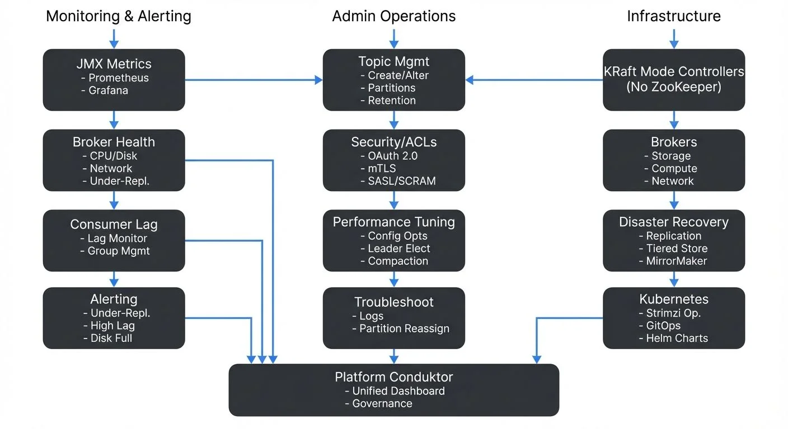

Apache Kafka has become the backbone of modern data streaming architectures, handling trillions of events daily across thousands of organizations. While developers focus on producing and consuming data, Kafka administrators ensure the underlying infrastructure remains healthy, performant, and secure. Effective admin operations and maintenance are critical to preventing data loss, minimizing downtime, and maintaining the reliability that streaming applications depend on.

This article explores the essential practices for administering Kafka clusters in production environments, from daily monitoring tasks to strategic planning for disaster recovery.

<!-- ORIGINAL_DIAGRAM
```
┌──────────────────────────────────────────────────────────────────┐
│         Kafka Admin Operations & Maintenance Layers              │
└──────────────────────────────────────────────────────────────────┘

Monitoring & Alerting          Admin Operations         Infrastructure
       │                              │                        │
       ▼                              ▼                        ▼
┌──────────────┐              ┌──────────────┐        ┌──────────────┐
│ JMX Metrics  │              │Topic Mgmt    │        │KRaft Mode    │
│ - Prometheus │─────────────▶│- Create/Alter│◀───────│Controllers   │
│ - Grafana    │              │- Partitions  │        │(No ZooKeeper)│
└──────────────┘              │- Retention   │        └──────────────┘
       │                      └──────────────┘               │
       │                              │                      │
       ▼                              ▼                      ▼
┌──────────────┐              ┌──────────────┐        ┌──────────────┐
│Broker Health │              │Security/ACLs │        │  Brokers     │
│- CPU/Disk    │──────┐       │- OAuth 2.0   │        │  - Storage   │
│- Network     │      │       │- mTLS        │        │  - Compute   │
│- Under-Repl. │      │       │- SASL/SCRAM  │        │  - Network   │
└──────────────┘      │       └──────────────┘        └──────────────┘
       │              │               │                      │
       │              │               │                      │
       ▼              │               ▼                      ▼
┌──────────────┐     │       ┌──────────────┐        ┌──────────────┐
│Consumer Lag  │     │       │Performance   │        │Disaster      │
│- Lag Monitor │     ├──────▶│Tuning        │        │Recovery      │
│- Group Mgmt  │     │       │- Config Opts │        │- Replication │
└──────────────┘     │       │- Leader Elect│        │- Tiered Store│
       │             │       │- Compaction  │        │- MirrorMaker │
       │             │       └──────────────┘        └──────────────┘
       │             │               │                      │
       ▼             │               ▼                      ▼
┌──────────────┐     │       ┌──────────────┐        ┌──────────────┐
│ Alerting     │     │       │Troubleshoot  │        │Kubernetes    │
│- Under-Repl. │     │       │- Logs        │        │- Strimzi Op. │
│- High Lag    │────▶│       │- Partition   │        │- GitOps      │
│- Disk Full   │     │       │  Reassign    │        │- Helm Charts │
└──────────────┘     │       └──────────────┘        └──────────────┘
                     │
                     ▼
              ┌──────────────┐
              │  Platform    │
              │  Conduktor   │
              │  - Unified   │
              │    Dashboard │
              │  - Governance│
              └──────────────┘
```
-->

## Understanding Kafka Administration Responsibilities

Kafka administrators manage the health and performance of broker clusters, coordinate topic configurations, enforce security policies, and respond to operational incidents. Unlike traditional databases with single-instance management, Kafka's distributed nature requires administrators to think about replication, partition leadership, and cluster-wide consistency.

Key responsibilities include:

- Monitoring broker health and resource utilization
- Managing topic lifecycles and partition assignments
- Configuring security policies and access controls
- Planning capacity and scaling strategies
- Performing upgrades with zero downtime
- Responding to production incidents and performance issues

The complexity increases with cluster size. A three-broker development cluster is straightforward, but a production cluster with dozens of brokers serving hundreds of topics requires systematic approaches to monitoring and automation.

### KRaft Mode: Modern Kafka Architecture

Since Kafka 3.3 (production-ready in Kafka 4.0+), Kafka uses **KRaft mode** (Kafka Raft metadata mode) instead of ZooKeeper for managing cluster metadata. This architectural change simplifies operations by:

- Eliminating ZooKeeper dependency, reducing operational complexity
- Improving metadata scalability (supporting millions of partitions)
- Enabling faster controller failover (sub-second instead of seconds)
- Simplifying deployment and reducing infrastructure costs

In KRaft mode, Kafka brokers elect controllers using the Raft consensus protocol. Administrators should understand:

- **Controller quorum**: A subset of brokers (or dedicated controller nodes) form the metadata quorum
- **Quorum sizing**: Typically 3 or 5 controller nodes for production (must be odd for majority voting)
- **Metadata logs**: Stored in `__cluster_metadata` topic, separate from data logs

For detailed coverage of KRaft architecture, see [Understanding KRaft Mode in Kafka](https://conduktor.io/glossary/understanding-kraft-mode-in-kafka). For migration from legacy ZooKeeper-based clusters, see [ZooKeeper to KRaft Migration](https://conduktor.io/glossary/zookeeper-to-kraft-migration).

## Cluster Health Monitoring

Continuous monitoring is the foundation of reliable Kafka operations. Administrators must track metrics across multiple dimensions: broker health, topic performance, consumer lag, and system resources.

### Critical Metrics to Monitor

**Broker-level metrics** include CPU usage, disk I/O, network throughput, and JVM heap memory. High disk utilization can indicate retention policies need adjustment, while consistent CPU spikes may signal undersized brokers or inefficient serialization.

**Topic-level metrics** track message rates (bytes in/out per second), partition count, and replication status. Under-replicated partitions are a critical warning sign, they indicate that some replicas are not keeping up with the leader, creating data durability risks.

**Consumer metrics** focus on consumer lag, the difference between the latest offset and the consumer's current position. Growing lag suggests consumers cannot keep pace with producers, requiring either consumer optimization or scaling.

### Monitoring Tools and Approaches

Kafka exposes metrics via JMX (Java Management Extensions), which can be collected by monitoring systems. Modern monitoring stacks (as of 2025) typically include:

**Open-source monitoring stack:**
- **Prometheus**: Collects Kafka metrics via JMX Exporter or Kafka Exporter
- **Kafka Lag Exporter**: Specialized tool for tracking consumer lag across all groups
- **Grafana**: Visualizes metrics with pre-built Kafka dashboards
- **Alertmanager**: Routes alerts based on configured thresholds

**Example monitoring setup:**
```yaml
# Prometheus JMX Exporter configuration for Kafka broker
rules:
  - pattern: kafka.server<type=BrokerTopicMetrics, name=(MessagesInPerSec|BytesInPerSec)><>Count
    name: kafka_server_broker_topic_metrics_$1
  - pattern: kafka.server<type=ReplicaManager, name=UnderReplicatedPartitions><>Value
    name: kafka_server_replica_manager_under_replicated_partitions
```

For example, an alert for under-replicated partitions exceeding zero for more than five minutes should trigger immediate investigation, as this indicates potential data loss risk if the leader broker fails.

**Commercial platforms:** [Conduktor](https://www.conduktor.io) provides unified dashboards that aggregate cluster health metrics, topic statistics, and consumer lag in a single interface, reducing the complexity of monitoring distributed systems. Conduktor includes built-in [alerting](https://docs.conduktor.io/guide/monitor-brokers-apps/alerts), governance, and operational features beyond basic monitoring. [Explore Conduktor's monitoring capabilities](https://docs.conduktor.io/guide/monitor-brokers-apps/index) for comprehensive cluster observability.

For comprehensive coverage of Kafka monitoring architecture and best practices, see [Kafka Cluster Monitoring and Metrics](https://conduktor.io/glossary/kafka-cluster-monitoring-and-metrics).

## Topic and Partition Management

Topics are the primary organizational structure in Kafka, and managing them properly is essential for performance and cost control.

### Topic Creation and Configuration

When creating topics, administrators must decide on:

- **Partition count**: Higher partition counts enable greater parallelism but increase overhead. A common starting point is one partition per expected consumer in the consumer group.
- **Replication factor**: Typically set to 3 for production workloads to survive two broker failures.
- **Retention policies**: Time-based (e.g., 7 days) or size-based (e.g., 100GB per partition) retention controls disk usage.
- **Compaction settings**: Log compaction is essential for changelog topics in stream processing applications.

**Using Kafka CLI tools:**

```bash
# Create a topic with 12 partitions and replication factor 3
kafka-topics.sh --bootstrap-server localhost:9092 \
  --create \
  --topic user-events \
  --partitions 12 \
  --replication-factor 3 \
  --config retention.ms=604800000 \
  --config compression.type=lz4

# List all topics
kafka-topics.sh --bootstrap-server localhost:9092 --list

# Describe a specific topic (shows partition distribution)
kafka-topics.sh --bootstrap-server localhost:9092 \
  --describe \
  --topic user-events

# Increase partition count (cannot be decreased)
kafka-topics.sh --bootstrap-server localhost:9092 \
  --alter \
  --topic user-events \
  --partitions 24
```

**Using AdminClient API (Java):**

```java
Properties props = new Properties();
props.put(AdminClientConfig.BOOTSTRAP_SERVERS_CONFIG, "localhost:9092");

try (AdminClient admin = AdminClient.create(props)) {
    NewTopic topic = new NewTopic("user-events", 12, (short) 3)
        .configs(Map.of(
            "retention.ms", "604800000",
            "compression.type", "lz4"
        ));

    admin.createTopics(List.of(topic)).all().get();
    System.out.println("Topic created successfully");
}
```

For detailed topic design guidelines, see [Kafka Topic Design Guidelines](https://conduktor.io/glossary/kafka-topic-design-guidelines).

### Real-World Example: Retention Tuning

Consider a logging topic receiving 1TB of data daily. With a default 7-day retention, the topic stores 7TB. If disk capacity is limited, administrators might reduce retention to 3 days or enable compression (e.g., `compression.type=lz4`) to reduce storage by 50-70%.

Changing retention on active topics requires careful planning. Reducing retention from 7 days to 1 day immediately makes 6 days of data eligible for deletion, which could impact consumers expecting historical data.

## Security and Access Control

Kafka security involves multiple layers: authentication (verifying identity), authorization (controlling permissions), and encryption (protecting data in transit and at rest).

### Authentication and Authorization

Kafka supports several authentication mechanisms (as of Kafka 4.0+):

- **SASL/PLAIN**: Simple username/password authentication (not recommended for production)
- **SASL/SCRAM-SHA-512**: Salted Challenge Response Authentication Mechanism, more secure than PLAIN
- **SSL/TLS (mTLS)**: Mutual certificate-based authentication, strongest security
- **OAuth 2.0**: Integration with enterprise identity providers (Okta, Azure AD, Keycloak)
- **Kerberos**: For enterprise environments with existing Kerberos infrastructure

**Example: Managing ACLs via CLI**

```bash
# Grant read access to a consumer group for a specific topic
kafka-acls.sh --bootstrap-server localhost:9092 \
  --add \
  --allow-principal User:analytics-service \
  --operation Read \
  --topic customer-events \
  --group analytics-consumers

# Grant write access for a producer
kafka-acls.sh --bootstrap-server localhost:9092 \
  --add \
  --allow-principal User:order-service \
  --operation Write \
  --topic orders

# List all ACLs for a topic
kafka-acls.sh --bootstrap-server localhost:9092 \
  --list \
  --topic customer-events
```

Authorization uses Access Control Lists (ACLs) to define who can produce to topics, consume from topics, or perform admin operations. For example, an ACL might grant the `analytics-team` group read access to `customer-events` but deny write access.

For detailed security architecture and best practices, see [Kafka Security Best Practices](https://conduktor.io/glossary/kafka-security-best-practices), [Kafka ACLs and Authorization Patterns](https://conduktor.io/glossary/kafka-acls-and-authorization-patterns), and [Kafka Authentication (SASL, SSL, OAuth)](https://conduktor.io/glossary/kafka-authentication-sasl-ssl-oauth). For mutual TLS implementation, see [mTLS for Kafka](https://conduktor.io/glossary/mtls-for-kafka).

### Audit Logging

Tracking who accessed what data and when is critical for compliance and security investigations. Kafka's audit logging capabilities, combined with tools like Conduktor that provide ACL management interfaces, help administrators maintain security without manual command-line ACL creation. Commercial platforms can integrate with SIEM systems for centralized security monitoring.

## Performance Tuning and Optimization

Kafka performance depends on proper configuration of brokers, producers, consumers, and the underlying infrastructure.

### Identifying Bottlenecks

Common performance bottlenecks include:

- **Disk I/O**: Slow disks or insufficient IOPS limit throughput. Using SSDs or provisioned IOPS on cloud platforms significantly improves write performance.
- **Network saturation**: Replication traffic and consumer fetch requests consume network bandwidth. Monitoring network utilization helps identify when additional brokers or network capacity is needed.
- **Unbalanced partition leadership**: If one broker handles leadership for many high-traffic partitions, it becomes a bottleneck. Running preferred leader election redistributes leadership.

### Configuration Tuning

Key broker configurations for performance include:

- `num.network.threads`: Handles network requests; increase for high-connection workloads (default: 3, consider 8-16 for large clusters)
- `num.io.threads`: Handles disk I/O; typically set to match disk count (default: 8)
- `socket.send.buffer.bytes` and `socket.receive.buffer.bytes`: Larger buffers improve throughput for high-latency networks (consider 1MB+ for WAN)
- `replica.fetch.max.bytes`: Maximum bytes per fetch request for replication (default: 1MB, increase for high-throughput topics)

**Example: Performance-tuned broker configuration**

```properties
# server.properties - Performance optimizations
num.network.threads=16
num.io.threads=16
socket.send.buffer.bytes=1048576
socket.receive.buffer.bytes=1048576
replica.fetch.max.bytes=5242880

# Enable compression to reduce network and disk I/O
compression.type=lz4

# Adjust log segment size for better performance
log.segment.bytes=536870912

# Background thread configuration
num.replica.fetchers=4
num.recovery.threads.per.data.dir=2
```

Producer and consumer configurations also matter. Producers using `acks=all` ensure durability but reduce throughput compared to `acks=1`. Batching (`linger.ms`, `batch.size`) trades latency for throughput.

**Running preferred leader election** to rebalance partition leadership:

```bash
# Trigger preferred leader election for all partitions
kafka-leader-election.sh --bootstrap-server localhost:9092 \
  --election-type PREFERRED \
  --all-topic-partitions
```

For comprehensive performance optimization strategies, see [Kafka Performance Tuning Guide](https://conduktor.io/glossary/kafka-performance-tuning-guide) and [Kafka Capacity Planning](https://conduktor.io/glossary/kafka-capacity-planning).

## Backup, Recovery, and Disaster Planning

While Kafka's replication provides durability within a cluster, administrators must plan for cluster-wide failures, data center outages, or data corruption scenarios.

### Replication Strategies

**Within-cluster replication** (via replication factor) protects against individual broker failures. **Multi-datacenter replication** using tools like MirrorMaker 2 (part of Kafka Connect framework) provides disaster recovery across geographic regions.

For detailed coverage of replication architecture, see [Kafka Replication and High Availability](https://conduktor.io/glossary/kafka-replication-and-high-availability). For cross-cluster replication patterns, see [Kafka MirrorMaker 2 for Cross-Cluster Replication](https://conduktor.io/glossary/kafka-mirrormaker-2-for-cross-cluster-replication).

### Backup Approaches and Tiered Storage

Kafka's append-only log structure makes backups straightforward conceptually but challenging operationally. Modern approaches (Kafka 3.6+) include:

**Tiered Storage (Kafka 3.6+):** Automatically offloads older log segments to object storage (S3, Azure Blob, GCS) while keeping recent data on local disks. This dramatically reduces storage costs and simplifies disaster recovery.

```properties
# server.properties - Enable tiered storage
remote.log.storage.system.enable=true
remote.log.storage.manager.class.name=org.apache.kafka.server.log.remote.storage.RemoteLogManager
remote.log.manager.task.interval.ms=30000

# Configure S3 as remote storage
remote.log.storage.backend=s3
s3.bucket.name=kafka-tiered-storage
s3.region=us-east-1
```

**Traditional backup approaches:**

- **Topic snapshots**: Using consumers to read entire topics and store in object storage
- **Log segment backups**: Directly copying log segment files from broker disks
- **Continuous replication**: Using MirrorMaker 2 to maintain a synchronized secondary cluster

**Example: Partition reassignment for disaster recovery**

```bash
# Generate partition reassignment plan
kafka-reassign-partitions.sh --bootstrap-server localhost:9092 \
  --topics-to-move-json-file topics.json \
  --broker-list "4,5,6" \
  --generate

# Execute the reassignment
kafka-reassign-partitions.sh --bootstrap-server localhost:9092 \
  --reassignment-json-file reassignment.json \
  --execute

# Verify completion
kafka-reassign-partitions.sh --bootstrap-server localhost:9092 \
  --reassignment-json-file reassignment.json \
  --verify
```

Testing recovery procedures is essential. Many organizations discover gaps in their disaster recovery plans only when attempting actual recovery. For comprehensive disaster recovery planning, see [Disaster Recovery Strategies for Kafka Clusters](https://conduktor.io/glossary/disaster-recovery-strategies-for-kafka-clusters). For tiered storage details, see [Tiered Storage in Kafka](https://conduktor.io/glossary/tiered-storage-in-kafka).

## Troubleshooting Common Issues

Effective troubleshooting requires understanding Kafka's architecture and having systematic diagnostic approaches.

### Under-Replicated Partitions

When partitions show as under-replicated, check:

1. Broker health: Is the follower broker offline or experiencing issues?
2. Network connectivity: Can followers reach the leader?
3. Disk space: Are brokers running out of disk?
4. Replication lag: Are followers too far behind to catch up?

### Consumer Lag

Growing consumer lag indicates consumers cannot keep pace with producers. Solutions include:

- Scaling consumer groups by adding consumer instances
- Optimizing consumer processing logic
- Increasing partition count to enable more parallelism
- Checking for network or serialization bottlenecks

For detailed coverage of consumer group management, see [Kafka Consumer Groups Explained](https://conduktor.io/glossary/kafka-consumer-groups-explained). For monitoring consumer lag patterns, see [Consumer Lag Monitoring](https://conduktor.io/glossary/consumer-lag-monitoring).

### Broker Restarts and Leadership Changes

When brokers restart, partition leadership changes. If restarts are frequent, investigate underlying causes (memory issues, crash loops) rather than treating symptoms.

**Diagnostic commands:**

```bash
# Check broker logs for errors
kafka-broker-logs.sh --log-dirs /var/lib/kafka/data

# Verify replica synchronization status
kafka-replica-verification.sh --broker-list localhost:9092 \
  --topic-white-list '.*'

# Monitor ISR (In-Sync Replica) shrinkage
kafka-topics.sh --bootstrap-server localhost:9092 \
  --describe \
  --under-replicated-partitions
```

## Kubernetes-Based Kafka Operations

Running Kafka on Kubernetes has become increasingly common, leveraging operators like **Strimzi** to automate deployment, configuration, and operational tasks.

### Strimzi Operator Benefits

The Strimzi Kafka Operator provides:
- Automated broker deployment and scaling
- Rolling updates with zero downtime
- Automatic TLS certificate management
- Integration with Kubernetes monitoring and logging
- GitOps-friendly declarative configuration

**Example: Kafka cluster definition in Strimzi**

```yaml
apiVersion: kafka.strimzi.io/v1beta2
kind: Kafka
metadata:
  name: production-cluster
spec:
  kafka:
    version: 4.0.0
    replicas: 6
    # KRaft mode - no ZooKeeper required
    metadataVersion: 4.0-IV0
    listeners:
      - name: plain
        port: 9092
        type: internal
        tls: false
      - name: tls
        port: 9093
        type: internal
        tls: true
    config:
      offsets.topic.replication.factor: 3
      transaction.state.log.replication.factor: 3
      transaction.state.log.min.isr: 2
      default.replication.factor: 3
      min.insync.replicas: 2
    storage:
      type: persistent-claim
      size: 1000Gi
      class: fast-ssd
  # Controllers for KRaft metadata management
  controllers:
    replicas: 3
    storage:
      type: persistent-claim
      size: 100Gi
      class: fast-ssd
  entityOperator:
    topicOperator: {}
    userOperator: {}
```

**Scaling Kafka on Kubernetes:**

```bash
# Scale Kafka cluster
kubectl patch kafka production-cluster --type merge \
  -p '{"spec":{"kafka":{"replicas":9}}}'

# Monitor rolling update
kubectl get pods -l strimzi.io/cluster=production-cluster -w
```

For comprehensive Kubernetes deployment patterns, see [Running Kafka on Kubernetes](https://conduktor.io/glossary/running-kafka-on-kubernetes) and [Strimzi Kafka Operator for Kubernetes](https://conduktor.io/glossary/strimzi-kafka-operator-for-kubernetes). For infrastructure automation, see [Infrastructure as Code for Kafka Deployments](https://conduktor.io/glossary/infrastructure-as-code-for-kafka-deployments).

## Kafka Admin Operations in Streaming Architectures

In modern streaming platforms, Kafka often serves as the central nervous system connecting hundreds of applications, stream processors, and data sinks. Admin operations directly impact the reliability of entire streaming pipelines.

For example, in a real-time fraud detection system, consumer lag in the fraud-scoring consumer group means delayed fraud detection. Administrators monitoring lag can proactively scale consumers before fraud slips through.

Similarly, improper partition scaling can bottleneck stream processing jobs in Apache Flink or Kafka Streams. If a stateful Flink job is bound to partition count, adding partitions requires rebalancing state, which administrators must coordinate with application teams.

## Summary

Kafka administration encompasses monitoring cluster health, managing topics and partitions, enforcing security policies, tuning performance, planning for disasters, and troubleshooting production issues. As Kafka clusters scale and become critical infrastructure for streaming applications, systematic operational practices become essential.

**Key takeaways for modern Kafka operations (2025):**

- **KRaft mode** (Kafka 4.0+) eliminates ZooKeeper, simplifying operations and improving scalability
- **Modern monitoring** combines Prometheus, Grafana, and Kafka Lag Exporter with commercial platforms like Conduktor
- **CLI tools and AdminClient API** provide programmatic control over cluster operations
- **Tiered storage** (Kafka 3.6+) reduces storage costs by offloading data to object storage
- **Kubernetes operators** like Strimzi automate deployment and operational tasks
- **Security best practices** emphasize OAuth 2.0, mTLS, and comprehensive ACL management

Administrators must balance competing concerns: durability versus throughput, retention versus disk costs, security versus operational complexity. Success requires deep understanding of Kafka's distributed architecture, proactive monitoring, and well-tested procedures for common scenarios.

By investing in proper tooling, automation, and monitoring, organizations can operate Kafka clusters that reliably handle massive event volumes while maintaining the low latency and high availability that streaming applications demand.

## Related Concepts

- [Kafka Capacity Planning](https://conduktor.io/kafka-capacity-planning) - Essential for sizing clusters based on monitoring insights and growth projections.
- [Multi-Tenancy in Kafka Environments](https://conduktor.io/glossary/multi-tenancy-in-kafka-environments) - Operational considerations for managing multiple teams and applications on shared clusters.
- [Chaos Engineering for Streaming Systems](https://conduktor.io/glossary/chaos-engineering-for-streaming-systems) - Proactive testing strategies to validate operational resilience and disaster recovery procedures.

## Related Articles

- [Understanding KRaft Mode in Kafka](https://conduktor.io/glossary/understanding-kraft-mode-in-kafka) - Modern metadata management without ZooKeeper
- [Kafka Cluster Monitoring and Metrics](https://conduktor.io/glossary/kafka-cluster-monitoring-and-metrics) - Comprehensive monitoring strategies
- [Kafka Performance Tuning Guide](https://conduktor.io/glossary/kafka-performance-tuning-guide) - Optimization techniques
- [Kafka Security Best Practices](https://conduktor.io/glossary/kafka-security-best-practices) - Security architecture
- [Running Kafka on Kubernetes](https://conduktor.io/glossary/running-kafka-on-kubernetes) - Kubernetes deployment patterns
- [Strimzi Kafka Operator for Kubernetes](https://conduktor.io/glossary/strimzi-kafka-operator-for-kubernetes) - Automated K8s operations
- [Infrastructure as Code for Kafka Deployments](https://conduktor.io/glossary/infrastructure-as-code-for-kafka-deployments) - IaC automation
- [Tiered Storage in Kafka](https://conduktor.io/glossary/tiered-storage-in-kafka) - Cost-effective storage management
- [Kafka Consumer Groups Explained](https://conduktor.io/glossary/kafka-consumer-groups-explained) - Consumer group operations
- [Kafka Replication and High Availability](https://conduktor.io/glossary/kafka-replication-and-high-availability) - Replication strategies

## Sources and References

1. Apache Kafka Documentation - Operations Guide (4.0+): https://kafka.apache.org/documentation/#operations
2. Apache Kafka Documentation - KRaft Mode: https://kafka.apache.org/documentation/#kraft
3. Narkhede, N., Shapira, G., & Palino, T. (2017). *Kafka: The Definitive Guide*. O'Reilly Media.
4. Strimzi Documentation - Kafka Operator: https://strimzi.io/docs/operators/latest/overview.html
5. Apache Kafka Improvement Proposals (KIPs):
   - KIP-500: Replace ZooKeeper with a Self-Managed Metadata Quorum
   - KIP-405: Kafka Tiered Storage
   - KIP-554: Add Broker-side SCRAM Config API
6. Conduktor Documentation - Kafka Management: https://www.conduktor.io/kafka
7. Prometheus JMX Exporter - Kafka Monitoring: https://github.com/prometheus/jmx_exporter
8. Kafka Lag Exporter: https://github.com/seglo/kafka-lag-exporter
