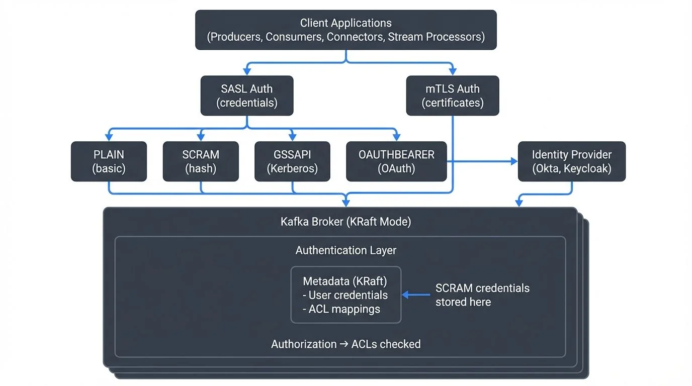

Securing Apache Kafka clusters is critical for any production deployment. Authentication ensures that only authorized clients and services can access your data streams. Kafka supports multiple authentication mechanisms, each with distinct characteristics and use cases optimized for different deployment patterns.

This article explores the primary authentication approaches in modern Kafka 4.0+ deployments: SASL mechanisms (PLAIN, SCRAM-SHA-512, GSSAPI, OAUTHBEARER), SSL/TLS certificate-based authentication (mTLS), and OAuth 2.0 integration with enterprise identity providers. Understanding how KRaft mode affects authentication and credential management is essential for securing contemporary Kafka clusters.

<!-- ORIGINAL_DIAGRAM
```
Kafka Authentication Mechanisms (2025)

┌─────────────────────────────────────────────────────────────────┐
│                    Client Applications                           │
│  (Producers, Consumers, Connectors, Stream Processors)          │
└────────────┬────────────────────────────┬──────────────────────┘
             │                            │
    ┌────────▼────────┐          ┌────────▼────────┐
    │  SASL Auth      │          │  mTLS Auth      │
    │  (credentials)  │          │  (certificates) │
    └────────┬────────┘          └────────┬────────┘
             │                            │
     ┌───────┴───────┬─────────┬──────────┴────────┐
     │               │         │                   │
┌────▼────┐    ┌────▼────┐   ┌▼────────┐   ┌──────▼──────┐
│ PLAIN   │    │ SCRAM   │   │ GSSAPI  │   │ OAUTHBEARER │
│ (basic) │    │ (hash)  │   │(Kerberos)│  │   (OAuth)   │
└────┬────┘    └────┬────┘   └─────┬───┘   └──────┬──────┘
     │              │              │               │
     │              │              │          ┌────▼────────┐
     │              │              │          │   Identity  │
     │              │              │          │   Provider  │
     │              │              │          │(Okta, Keycloak)
     │              │              │          └─────────────┘
     └──────┬───────┴──────┬───────┴───────────────┘
            │              │
     ┌──────▼──────────────▼──────────┐
     │   Kafka Broker (KRaft Mode)    │
     │  ┌──────────────────────────┐  │
     │  │  Authentication Layer    │  │
     │  │  ┌────────────────────┐  │  │
     │  │  │ Metadata (KRaft)   │  │  │ ← SCRAM credentials
     │  │  │ - User credentials │  │  │   stored here
     │  │  │ - ACL mappings     │  │  │
     │  │  └────────────────────┘  │  │
     │  └──────────────────────────┘  │
     │  Authorization → ACLs checked  │
     └────────────────────────────────┘
```
-->

## Why Authentication Matters in Kafka

Apache Kafka operates as a distributed streaming platform that handles sensitive data across producers, consumers, brokers, and various ecosystem components. Without proper authentication, any client could connect to your cluster, publish malicious data, or consume confidential information.

Authentication provides the foundation for a comprehensive security model. It works alongside authorization (ACLs) and encryption to create defense-in-depth protection. While encryption protects data in transit and authorization controls what authenticated users can do, authentication answers the fundamental question: "Who are you?" For a complete security strategy, see [Kafka Security Best Practices](https://conduktor.io/glossary/kafka-security-best-practices), and for authorization details, refer to [Access Control for Streaming](https://conduktor.io/glossary/access-control-for-streaming).

In regulated industries like finance and healthcare, authentication is not optional. Compliance frameworks such as GDPR, HIPAA, and SOC 2 require proof that only identified entities access data systems.

## Understanding SASL Authentication

SASL (Simple Authentication and Security Layer) is a framework that separates authentication mechanisms from application protocols. Kafka supports several SASL mechanisms, each suited to different environments.

### SASL/PLAIN

The simplest SASL mechanism transmits username and password credentials. While easy to configure, SASL/PLAIN sends credentials in cleartext and should always be combined with SSL/TLS encryption.

Configuration example for a Kafka producer:

```properties
security.protocol=SASL_SSL
sasl.mechanism=PLAIN
sasl.jaas.config=org.apache.kafka.common.security.plain.PlainLoginModule required \
  username="producer-app" \
  password="secure-password";
```

SASL/PLAIN works well for development environments or when integrated with external secret management systems that rotate credentials programmatically.

### SASL/SCRAM

SCRAM (Salted Challenge Response Authentication Mechanism) provides stronger security than PLAIN by avoiding cleartext password transmission. Instead of sending passwords over the network, SCRAM uses a challenge-response protocol where the client proves knowledge of the password through cryptographic hashing without revealing the password itself.

Kafka supports SCRAM-SHA-256 and SCRAM-SHA-512, with SCRAM-SHA-512 recommended for new deployments due to its stronger cryptographic properties.

In Kafka 4.0+ with KRaft mode (the default and only supported metadata management system), SCRAM credentials are stored in the cluster's metadata log. For legacy ZooKeeper-based clusters (deprecated and removed in Kafka 4.0), credentials were stored in ZooKeeper. This centralized credential management makes SCRAM particularly suitable for multi-tenant environments where you need to manage many application credentials without distributing password files to brokers.

Example broker configuration for SCRAM-SHA-512:

```properties
# Enable SCRAM-SHA-512 mechanism
sasl.enabled.mechanisms=SCRAM-SHA-512
sasl.mechanism.inter.broker.protocol=SCRAM-SHA-512

# For KRaft mode (Kafka 3.3+/4.0+)
# Credentials stored in metadata log automatically
```

To create SCRAM credentials in KRaft mode:

```bash
# Create a new SCRAM credential
kafka-configs --bootstrap-server localhost:9092 \
  --alter --add-config 'SCRAM-SHA-512=[password=secure-password]' \
  --entity-type users --entity-name producer-app
```

### SASL/GSSAPI (Kerberos)

For enterprise environments with existing Active Directory or Kerberos infrastructure, SASL/GSSAPI provides single sign-on capabilities. Clients authenticate using Kerberos tickets rather than passwords.

Kerberos offers robust security but requires significant infrastructure: a Key Distribution Center (KDC), proper DNS configuration, and synchronized clocks across all systems. This complexity makes it best suited for large organizations with dedicated identity management teams.

### SASL/OAUTHBEARER

The OAUTHBEARER mechanism enables Kafka to validate OAuth 2.0 bearer tokens, bridging traditional Kafka authentication with modern cloud-native identity providers. This mechanism is particularly relevant for Kafka 4.0+ deployments integrating with enterprise identity platforms.

Configuration for OAuth requires both client-side token acquisition and broker-side token validation:

```properties
# Client configuration (producer/consumer)
security.protocol=SASL_SSL
sasl.mechanism=OAUTHBEARER
sasl.jaas.config=org.apache.kafka.common.security.oauthbearer.OAuthBearerLoginModule required \
  clientId="kafka-client" \
  clientSecret="client-secret" \
  scope="kafka.cluster" \
  tokenEndpointUri="https://identity-provider.com/oauth2/token";

# Broker configuration for token validation
sasl.enabled.mechanisms=OAUTHBEARER
listener.name.sasl_ssl.oauthbearer.sasl.server.callback.handler.class=\
  org.apache.kafka.common.security.oauthbearer.secured.OAuthBearerValidatorCallbackHandler
listener.name.sasl_ssl.oauthbearer.sasl.jwks.endpoint.url=\
  https://identity-provider.com/.well-known/jwks.json
```

For detailed mTLS certificate management and automation in production environments, see [mTLS for Kafka](https://conduktor.io/glossary/mtls-for-kafka).

## SSL/TLS Certificate-Based Authentication

SSL/TLS serves dual purposes in Kafka: encrypting network traffic and authenticating clients through mutual TLS (mTLS). With mTLS, both the broker and client present certificates to verify their identities.

Certificate-based authentication eliminates password management entirely. Instead, you manage certificate lifecycles, certificate authorities (CAs), and trust stores. Modern certificate automation tools like cert-manager (Kubernetes), HashiCorp Vault, and AWS Certificate Manager significantly reduce the operational burden of mTLS at scale.

### How mTLS Works in Kafka

1. The broker presents its certificate to the client, proving its identity
2. The client validates the broker certificate against its trust store
3. The client presents its certificate to the broker
4. The broker validates the client certificate and extracts the principal (identity)
5. If validation succeeds on both sides, the encrypted connection is established

Configuration requires keystores (containing private keys and certificates) and trust stores (containing CA certificates):

```properties
security.protocol=SSL
ssl.keystore.location=/var/private/ssl/client.keystore.jks
ssl.keystore.password=keystore-password
ssl.key.password=key-password
ssl.truststore.location=/var/private/ssl/client.truststore.jks
ssl.truststore.password=truststore-password
```

Certificate authentication scales well in container environments where certificate issuance can be automated through systems like cert-manager in Kubernetes.

## OAuth 2.0 Integration

OAuth 2.0 has become the standard for API authentication in cloud environments. Kafka's OAuth support (via SASL/OAUTHBEARER) allows integration with enterprise identity providers like Keycloak, Okta, Azure AD, and AWS Cognito. This integration is increasingly important in Kafka 4.0+ deployments where centralized identity management simplifies security at scale.

### OAuth Flow in Kafka

When a producer or consumer connects to Kafka with OAuth:

1. **Token Acquisition**: The client application authenticates with the identity provider (IdP) using client credentials (client ID and secret) or other OAuth flows, requesting an access token with appropriate scopes for Kafka access
2. **Connection with Token**: The client sends the JWT access token to the Kafka broker via SASL/OAUTHBEARER during the authentication handshake
3. **Token Validation**: The broker validates the token by:
   - Verifying the cryptographic signature using the IdP's public keys (fetched from JWKS endpoint)
   - Checking token expiration and validity period
   - Validating audience and issuer claims match expected values
   - Ensuring required scopes are present
4. **Principal Extraction**: The broker extracts the principal identity from the token's subject (`sub`) claim or a custom claim configured in the broker
5. **Authorization**: Kafka ACLs are evaluated based on the extracted principal, determining which topics and operations the client can access

This approach centralizes authentication in a dedicated identity system, separating it from Kafka cluster management. Token-based authentication also enables fine-grained, time-limited access without distributing long-lived credentials. When tokens expire (typically after 15-60 minutes), clients automatically request new tokens from the IdP without service interruption.

OAuth particularly shines in microservices architectures where services already authenticate with an identity provider for other APIs. Using the same tokens for Kafka access creates consistent security posture across the entire platform. Modern service meshes like Istio can automate token acquisition and rotation, further reducing application complexity.

## Choosing the Right Authentication Method

The optimal authentication mechanism depends on your infrastructure, team expertise, and compliance requirements:

| Method | Best For | Complexity | Key Benefit | Kafka 4.0+ Notes |
|--------|----------|------------|-------------|------------------|
| SASL/PLAIN | Development, testing | Low | Simplicity | Use only with TLS encryption |
| SASL/SCRAM-SHA-512 | Multi-tenant production | Medium | Centralized credential management in KRaft metadata | **Recommended** for most production deployments |
| SASL/GSSAPI | Enterprise with Kerberos | High | Single sign-on integration | Mature, well-supported in KRaft |
| SSL/TLS (mTLS) | Container platforms, service mesh | Medium-High | No password management, cryptographic identity | Excellent for zero-trust architectures |
| OAuth 2.0 | Cloud-native, microservices | Medium | Centralized identity, token-based, time-limited access | **Growing adoption** in Kafka 4.0+ deployments |

Many organizations use different mechanisms in different environments. Development might use SASL/PLAIN for convenience, while production uses SASL/SCRAM-SHA-512, OAuth, or mTLS for stronger security. The choice often depends on existing infrastructure: enterprises with Kerberos use GSSAPI, cloud-native organizations prefer OAuth, and Kubernetes deployments commonly leverage mTLS with automated certificate management.

## Authentication in Data Streaming Ecosystems

Kafka authentication extends beyond broker connections. A complete data streaming platform includes multiple components that must authenticate:

- **Kafka Connect**: Connectors need credentials to authenticate with Kafka brokers
- **Schema Registry**: Should require authentication and verify client identity
- **ksqlDB**: Database queries operate under authenticated principals
- **Stream processors** (Kafka Streams, Flink): Applications authenticate as service accounts
- **Management tools**: Administrative interfaces need strong authentication to prevent unauthorized changes

When troubleshooting authentication issues, tools that visualize connection states and authentication failures can dramatically reduce debugging time. A failed SASL handshake might produce cryptic error messages in logs, but seeing the exact authentication flow and failure point makes resolution straightforward.

## Managing Authentication at Scale with Conduktor

As Kafka deployments grow, managing authentication across multiple clusters, hundreds of applications, and diverse authentication mechanisms becomes complex. **Conduktor** provides enterprise-grade authentication management that simplifies operations:

**Centralized Authentication Visibility**: Conduktor provides a unified interface to view and manage authentication configurations across all your Kafka clusters, whether using SASL, mTLS, or OAuth. See which applications use which credentials, identify authentication failures in real-time, and audit authentication attempts.

**Self-Service Credential Management**: Enable development teams to request and obtain Kafka credentials through a governed workflow. Platform teams approve requests based on policy, and Conduktor automatically provisions SCRAM credentials or distributes certificates, eliminating manual credential distribution bottlenecks.

**Authentication Testing and Validation**: Before deploying changes to production, test authentication configurations in Conduktor's testing environment. **Conduktor Gateway** can simulate various [authentication scenarios](https://docs.conduktor.io/guide/conduktor-concepts/gw-authen-author), including token expiration, certificate rotation, and authentication failures, helping teams validate their error handling.

**Certificate Lifecycle Management**: For mTLS deployments, Conduktor tracks certificate expiration dates across all clients and brokers, alerts teams before certificates expire, and provides workflows for certificate rotation without service disruption.

**OAuth Integration**: Conduktor integrates with enterprise identity providers (Okta, Azure AD, Keycloak) to provide unified OAuth-based access to both Kafka clusters and the Conduktor platform itself, creating a consistent authentication experience.

**Compliance and Audit Trails**: Maintain detailed audit logs of authentication changes, credential access, and permission modifications to satisfy regulatory requirements. Generate compliance reports showing who had access to which Kafka resources during specific time periods.

For organizations running multiple Kafka environments (development, staging, production) with different authentication requirements, Conduktor's centralized management significantly reduces operational complexity while maintaining security standards.

## Summary

Kafka provides flexible authentication options suitable for diverse deployment scenarios. SASL mechanisms (PLAIN, SCRAM-SHA-512, GSSAPI, OAUTHBEARER) use credentials or tokens, while SSL/TLS enables certificate-based authentication through mTLS. OAuth 2.0 integration brings modern, cloud-native identity management to Kafka.

**For Kafka 4.0+ deployments**, the recommended authentication strategies are:

- **SASL/SCRAM-SHA-512**: Best for most production environments, with credentials stored securely in KRaft metadata
- **mTLS**: Ideal for container platforms, Kubernetes, and zero-trust architectures with automated certificate management
- **OAuth 2.0**: Excellent for cloud-native microservices architectures with existing identity providers
- **SASL/PLAIN**: Acceptable only for development/testing, always with TLS encryption

Understanding KRaft mode's impact on authentication is essential for modern deployments. For details on how KRaft simplifies metadata management including authentication credentials, see [Understanding KRaft Mode in Kafka](https://conduktor.io/glossary/understanding-kraft-mode-in-kafka).

Regardless of mechanism, always combine authentication with encryption and authorization. Authentication identifies who is connecting, encryption protects data in transit, and authorization determines what authenticated principals can do. For comprehensive authorization strategies, see [Access Control for Streaming](https://conduktor.io/glossary/access-control-for-streaming).

Proper authentication configuration is foundational to Kafka security. It protects your data streams, satisfies compliance requirements, and enables audit trails showing exactly which services accessed which topics. For operational best practices covering authentication, authorization, encryption, and monitoring, consult [Kafka Security Best Practices](https://conduktor.io/glossary/kafka-security-best-practices).

## Related Concepts

- [Kafka ACLs and Authorization Patterns](https://conduktor.io/glossary/kafka-acls-and-authorization-patterns) - Fine-grained authorization controls that work with authentication to secure Kafka resources.
- [mTLS for Kafka](https://conduktor.io/glossary/mtls-for-kafka) - Certificate-based mutual authentication for service-to-service communication in zero-trust architectures.
- [Policy Enforcement in Streaming](https://conduktor.io/glossary/policy-enforcement-in-streaming) - Automated policy enforcement that builds on authentication to maintain security and compliance.

## Sources and References

1. **Apache Kafka Documentation - Security (2025)**: Official Kafka 4.0+ security configuration covering authentication, authorization, and encryption - https://kafka.apache.org/documentation/#security

2. **Apache Kafka KIP-500 - KRaft Mode**: Details on how KRaft mode affects metadata management including SCRAM credential storage - https://cwiki.apache.org/confluence/display/KAFKA/KIP-500

3. **RFC 7628 - SASL Mechanisms for OAuth**: Technical specification for OAuth 2.0 integration with SASL - https://datatracker.ietf.org/doc/html/rfc7628

4. **RFC 7519 - JSON Web Tokens (JWT)**: Standard for OAuth access tokens used in SASL/OAUTHBEARER - https://datatracker.ietf.org/doc/html/rfc7519

5. **Strimzi Kafka Operator - OAuth 2.0 Documentation**: Kubernetes-native OAuth implementation for Kafka - https://strimzi.io/docs/operators/latest/overview.html#security-oauth2

6. **OWASP Authentication Cheat Sheet**: Best practices for secure authentication implementation - https://cheatsheetseries.owasp.org/cheatsheets/Authentication_Cheat_Sheet.html

7. **cert-manager Documentation**: Automated certificate management for Kubernetes-based Kafka deployments - https://cert-manager.io/docs/
