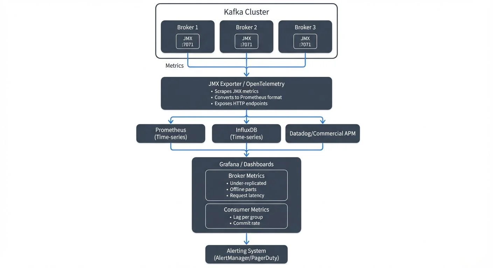

Monitoring an Apache Kafka cluster is essential for maintaining reliable data streaming operations. Without proper observability into broker health, partition replication, consumer lag, and throughput patterns, teams operate blind to performance degradation, capacity issues, and potential outages. Effective monitoring transforms Kafka from a black box into a well-understood system where problems can be detected, diagnosed, and resolved before they impact business operations.

This article explores the key metrics, monitoring architecture, and best practices that enable engineering teams to maintain healthy Kafka deployments at scale.

<!-- ORIGINAL_DIAGRAM
```
Kafka Monitoring Architecture

┌────────────────────────────────────────────────────────────────┐
│                      Kafka Cluster                             │
│  ┌──────────┐   ┌──────────┐   ┌──────────┐                   │
│  │ Broker 1 │   │ Broker 2 │   │ Broker 3 │                   │
│  │  JMX     │   │  JMX     │   │  JMX     │                   │
│  │  :7071   │   │  :7071   │   │  :7071   │                   │
│  └────┬─────┘   └────┬─────┘   └────┬─────┘                   │
│       │ Metrics      │              │                          │
└───────┼──────────────┼──────────────┼──────────────────────────┘
        │              │              │
        │   ┌──────────▼──────────────▼───────────┐
        │   │  JMX Exporter / OpenTelemetry       │
        │   │  • Scrapes JMX metrics              │
        └───►  • Converts to Prometheus format    │
            │  • Exposes HTTP endpoints           │
            └──────────────┬──────────────────────┘
                           │
        ┌──────────────────┼──────────────────────┐
        │                  │                      │
┌───────▼────────┐  ┌──────▼─────────┐  ┌────────▼────────┐
│  Prometheus    │  │  InfluxDB      │  │  Datadog/       │
│  (Time-series) │  │  (Time-series) │  │  Commercial APM │
└───────┬────────┘  └──────┬─────────┘  └────────┬────────┘
        │                  │                      │
        └──────────────────┼──────────────────────┘
                           │
              ┌────────────▼─────────────┐
              │   Grafana / Dashboards   │
              │  ┌────────────────────┐  │
              │  │ Broker Metrics     │  │
              │  │ • Under-replicated │  │
              │  │ • Offline parts    │  │
              │  │ • Request latency  │  │
              │  └────────────────────┘  │
              │  ┌────────────────────┐  │
              │  │ Consumer Metrics   │  │
              │  │ • Lag per group    │  │
              │  │ • Commit rate      │  │
              │  └────────────────────┘  │
              └──────────┬───────────────┘
                         │
              ┌──────────▼───────────┐
              │  Alerting System     │
              │  (AlertManager/      │
              │   PagerDuty)         │
              └──────────────────────┘
```
-->

## Why Kafka Monitoring Matters

Kafka clusters handle mission-critical data pipelines in modern architectures. A single under-replicated partition can lead to data loss. Unnoticed consumer lag can cause hours of processing delays. Broker resource exhaustion can cascade into cluster-wide failures.

Unlike traditional databases with simpler request-response patterns, Kafka's distributed nature creates complex interdependencies. A topic might have dozens of partitions spread across multiple brokers, each with its own replication state. Hundreds of consumers might be reading at different rates, each maintaining their own offset positions. Without visibility into these components, troubleshooting becomes guesswork.

Monitoring provides the foundation for operational excellence. It enables proactive capacity planning, rapid incident response, and informed optimization decisions. Teams that invest in robust monitoring spend less time fighting fires and more time building features.

## Core Metrics Categories

Kafka exposes hundreds of metrics through Java Management Extensions (JMX), a standard Java technology for monitoring and managing applications. JMX provides a structured way to access internal metrics from Kafka brokers, producers, and consumers through Management Beans (MBeans). Understanding which metrics matter requires organizing them into logical categories.

### Broker Metrics

Broker-level metrics reveal the health of individual Kafka servers. Key indicators include:

- **Under-replicated partitions** (`kafka.server:type=ReplicaManager,name=UnderReplicatedPartitions`): Partitions where follower replicas have fallen behind the leader. Should be 0 in healthy clusters; any value above 0 indicates replication issues requiring immediate investigation.

- **Offline partitions** (`kafka.controller:type=KafkaController,name=OfflinePartitionsCount`): Partitions without an active leader, representing immediate data unavailability. Must always be 0; any offline partitions mean data cannot be produced or consumed.

- **Request handler idle ratio** (`kafka.server:type=KafkaRequestHandlerPool,name=RequestHandlerAvgIdlePercent`): Percentage of time request handlers are idle. Values below 20% indicate broker saturation; healthy clusters typically show 60-80% idle time.

- **Network processor idle ratio** (`kafka.network:type=SocketServer,name=NetworkProcessorAvgIdlePercent`): Network thread utilization. Values below 30% suggest network bottlenecks; aim for 60%+ for healthy operations.

These metrics directly indicate whether brokers can handle current load and maintain replication guarantees.

### KRaft Controller Metrics (Kafka 3.3+)

With KRaft mode replacing ZooKeeper as Kafka's consensus mechanism, new controller-specific metrics become essential for monitoring metadata operations:

- **Active controller count** (`kafka.controller:type=KafkaController,name=ActiveControllerCount`): Should be exactly 1 in the cluster. If 0, the cluster cannot process metadata changes; if greater than 1, indicates a split-brain scenario requiring immediate attention.

- **Metadata log end offset** (`kafka.server:type=KafkaRaftServer,name=MetadataLogEndOffset`): Tracks the latest offset in the metadata log. Monitoring the rate of change helps identify metadata update patterns and potential issues.

- **Metadata error rate** (`kafka.server:type=KRaftMetrics,name=MetadataErrorRate`): Failed metadata operations. Should be 0 in healthy clusters; any errors indicate controller instability or configuration issues.

- **Controller event queue size** (`kafka.controller:type=ControllerEventManager,name=EventQueueSize`): Number of pending controller events. High values (>100) suggest the controller is overwhelmed, which can delay partition leadership elections and topic operations.

KRaft mode eliminates ZooKeeper monitoring complexity while introducing cleaner, more predictable controller metrics. For clusters still using ZooKeeper, see [Understanding KRaft Mode in Kafka](https://conduktor.io/glossary/understanding-kraft-mode-in-kafka) for migration guidance.

### Topic and Partition Metrics

Per-topic metrics help identify problematic topics and unbalanced workloads:

- **Bytes in/out rate**: Throughput for producers and consumers
- **Messages in rate**: Message volume over time
- **Partition count**: Number of partitions per topic, affecting parallelism
- **Leader partition distribution**: Whether partition leadership is balanced across brokers

Uneven partition distribution can overload specific brokers while others sit underutilized, creating performance bottlenecks.

### Consumer Group Metrics

Consumer lag is often the most critical metric for application teams. For comprehensive consumer monitoring strategies, see [Consumer Lag Monitoring](https://conduktor.io/glossary/consumer-lag-monitoring).

- **Consumer lag** (`kafka.consumer:type=consumer-fetch-manager-metrics,client-id=*,topic=*,partition=*`): Number of messages between the consumer's current offset and the log end offset. Lag of 1,000 messages might be normal during steady state, but 1,000,000+ messages indicates the consumer cannot keep pace with production rate.

- **Commit rate** (`kafka.consumer:type=consumer-coordinator-metrics,client-id=*`): Frequency of offset commits, indicating consumer progress. Low commit rates may signal consumer crashes or processing bottlenecks.

- **Fetch rate** (`kafka.consumer:type=consumer-fetch-manager-metrics,client-id=*`): Consumer fetch request patterns. Monitoring fetch latency helps identify network or broker-side issues affecting consumption.

- **Records consumed rate** (`kafka.consumer:type=consumer-fetch-manager-metrics,client-id=*`): Actual message consumption throughput measured in records per second. Compare this to production rate to identify processing capacity issues.

A consumer group processing payment events might accumulate lag during traffic spikes. If lag reaches millions of messages, transaction confirmations could be delayed by hours, directly impacting customer experience. Modern tools like Kafka Lag Exporter provide dedicated consumer lag monitoring with Prometheus integration.

### Producer Metrics

Producer metrics reveal client-side performance and health:

- **Record send rate**: Messages produced per second
- **Compression rate**: Efficiency of message compression
- **Request latency**: Time to receive acknowledgment from brokers
- **Error rate**: Failed produce requests indicating configuration or capacity issues

## Monitoring Architecture

Most Kafka monitoring solutions follow a similar pattern: expose JMX metrics, collect them into a time-series database, and visualize them in dashboards.

### JMX Metrics Export

Kafka brokers expose metrics via JMX, a standard Java monitoring interface. The Prometheus JMX Exporter converts these metrics into formats consumable by modern monitoring systems. The exporter runs as a Java agent alongside the broker, scraping metrics and making them available via HTTP endpoints.

**JMX Exporter Configuration Example**

Deploy the JMX Exporter as a Java agent by downloading the JAR and configuring Kafka startup:

```bash
# Download JMX Exporter
wget https://repo1.maven.org/maven2/io/prometheus/jmx/jmx_prometheus_javaagent/0.20.0/jmx_prometheus_javaagent-0.20.0.jar

# Add to Kafka broker startup (in kafka-server-start.sh or systemd unit)
export KAFKA_OPTS="-javaagent:/opt/kafka/jmx_exporter/jmx_prometheus_javaagent-0.20.0.jar=7071:/opt/kafka/jmx_exporter/kafka-broker.yml"
```

**Sample JMX Exporter Configuration (kafka-broker.yml)**

```yaml
# Enable lower-cased output for metric names
lowercaseOutputName: true
lowercaseOutputLabelNames: true

# Define which metrics to expose
rules:
  # Broker metrics
  - pattern: kafka.server<type=(.+), name=(.+)><>Value
    name: kafka_server_$1_$2

  # Controller metrics
  - pattern: kafka.controller<type=(.+), name=(.+)><>Value
    name: kafka_controller_$1_$2

  # Topic metrics
  - pattern: kafka.server<type=BrokerTopicMetrics, name=(.+), topic=(.+)><>Count
    name: kafka_server_brokertopicmetrics_$1_total
    labels:
      topic: "$2"

  # Network metrics
  - pattern: kafka.network<type=(.+), name=(.+), request=(.+)><>Count
    name: kafka_network_$1_$2_total
    labels:
      request: "$3"

  # KRaft-specific metrics (Kafka 3.3+)
  - pattern: kafka.server<type=KafkaRaftServer, name=(.+)><>Value
    name: kafka_kraft_$1
```

The exporter listens on port 7071 by default, exposing metrics at `http://broker-host:7071/metrics` for Prometheus to scrape. Filter patterns control which JMX beans are exported, reducing metric cardinality and improving performance.

### Time-Series Databases

Prometheus has become the de facto standard for storing Kafka metrics. Its dimensional data model naturally represents Kafka's hierarchical metric structure (cluster → broker → topic → partition). Prometheus scrapes JMX Exporter endpoints at regular intervals, storing metric history for alerting and trend analysis.

**Prometheus Configuration Example**

```yaml
# prometheus.yml
scrape_configs:
  - job_name: 'kafka-brokers'
    static_configs:
      - targets:
        - 'kafka-broker-1:7071'
        - 'kafka-broker-2:7071'
        - 'kafka-broker-3:7071'
    scrape_interval: 30s
    scrape_timeout: 10s
```

Alternative solutions include InfluxDB, TimescaleDB, or managed services like Datadog and New Relic.

### OpenTelemetry Integration

OpenTelemetry provides a vendor-neutral observability framework increasingly adopted for Kafka monitoring in 2025. Instead of using JMX Exporter directly, OpenTelemetry Collector can scrape JMX metrics and forward them to multiple backends simultaneously (Prometheus, Grafana Cloud, Datadog, etc.).

**OpenTelemetry Collector Configuration for Kafka**

```yaml
# otel-collector-config.yaml
receivers:
  prometheus:
    config:
      scrape_configs:
        - job_name: 'kafka-brokers'
          static_configs:
            - targets: ['kafka-broker-1:7071', 'kafka-broker-2:7071']

processors:
  batch:
    timeout: 10s

  # Add resource attributes for better filtering
  resource:
    attributes:
      - key: service.name
        value: kafka-cluster-prod
        action: upsert

exporters:
  prometheus:
    endpoint: "0.0.0.0:9090"

  otlp:
    endpoint: "https://your-observability-backend.com"
    headers:
      api-key: "${OTEL_API_KEY}"

service:
  pipelines:
    metrics:
      receivers: [prometheus]
      processors: [batch, resource]
      exporters: [prometheus, otlp]
```

OpenTelemetry's unified approach simplifies multi-backend observability and enables correlation between Kafka metrics, application traces, and infrastructure logs—essential for troubleshooting complex distributed systems.

### Visualization and Alerting

Grafana provides rich visualization capabilities with pre-built Kafka dashboards available from the community. Teams can create custom dashboards showing cluster health at a glance, with drill-down capabilities into specific brokers or consumer groups.

Alerting rules trigger notifications when metrics cross thresholds. Critical alerts might fire when under-replicated partitions exceed zero, while warning alerts could trigger when consumer lag exceeds baseline expectations.

## Kafka Monitoring in Data Streaming Systems

In modern data streaming architectures, Kafka often sits at the center of complex event pipelines. Real-time analytics, microservice communication, and event-driven workflows all depend on Kafka's reliable message delivery.

Consider a streaming analytics platform processing clickstream data. Raw events flow into Kafka from web applications, stream processing jobs (Apache Flink, Kafka Streams) transform the data, and results are written back to Kafka for consumption by dashboards and databases. Monitoring must cover the entire pipeline.

If a Flink job slows down, its consumer lag will increase in Kafka. If an upstream service starts producing malformed messages, error rates will spike. If a broker fails and partition leadership doesn't transfer cleanly, under-replicated partitions will appear. Each symptom requires different remediation, but all are visible through Kafka metrics.

Effective monitoring connects Kafka metrics to broader system health. Consumer lag in the analytics pipeline might correlate with increased database write latency. Broker CPU spikes might coincide with deployment of a new producer service. Understanding these relationships enables faster root cause analysis.

## Tools and Platforms

Several tools address Kafka monitoring needs across different complexity levels.

**Open Source Solutions**: The Prometheus + Grafana combination provides powerful monitoring at no licensing cost. JMX Exporter handles metric collection, Prometheus stores time-series data, and Grafana visualizes dashboards. This stack requires setup and maintenance but offers complete flexibility. Pre-built Grafana dashboards for Kafka are available in the community gallery.

**Kafka Lag Exporter**: A lightweight, specialized tool for monitoring consumer group lag. It exports lag metrics to Prometheus without requiring full JMX Exporter setup for consumers. Particularly useful for teams focused on consumer monitoring.

**AKHQ**: A modern web UI providing cluster administration interfaces with basic monitoring capabilities. While not a substitute for comprehensive monitoring, it offers quick visibility into topic configuration, consumer group status, and message browsing for development and troubleshooting.

**Conduktor Platform**: For teams seeking unified monitoring and management, Conduktor Platform provides comprehensive Kafka observability with visual insights into cluster health, real-time consumer lag tracking, broker performance metrics, and topic analytics. Unlike basic monitoring stacks, Conduktor combines monitoring with governance, security, and testing capabilities—essential for organizations managing multiple Kafka clusters in production. [Explore Conduktor's monitoring capabilities](https://docs.conduktor.io/guide/monitor-brokers-apps/index) and [configure alerts for proactive issue detection](https://docs.conduktor.io/guide/monitor-brokers-apps/alerts).

Conduktor Platform features include:
- Real-time cluster health dashboards with automated anomaly detection
- Consumer lag monitoring with customizable alerting thresholds
- Topic and partition metrics visualization
- Historical trend analysis for capacity planning via the [Insights Dashboard](https://docs.conduktor.io/guide/insights/index)
- Integration with existing Prometheus/Grafana stacks
- Governance features for topic configuration management

**Conduktor Gateway**: For advanced monitoring scenarios including chaos testing and traffic observability, Conduktor Gateway acts as a Kafka proxy enabling request inspection, latency injection, and error simulation—critical for validating monitoring and alerting systems under failure conditions.

**Commercial APM Tools**: Datadog, New Relic, and Dynatrace offer Kafka monitoring as part of broader application performance monitoring suites, providing correlation with infrastructure and application metrics.

The right choice depends on team size, existing monitoring infrastructure, and operational complexity. Teams starting from scratch often benefit from Conduktor Platform's integrated approach, while those with established observability pipelines may prefer open-source tools with custom integration.

## Best Practices for Kafka Monitoring

Successful monitoring programs follow consistent patterns:

**Establish Baselines**: Understand normal behavior before setting alerts. Consumer lag that's acceptable during low-traffic periods might indicate problems during peak hours. Record baseline metrics for throughput, latency, and resource utilization.

**Alert on Symptoms, Not Causes**: Alert when under-replicated partitions exist, not when CPU is high. Focus on metrics that directly impact availability and correctness rather than resource utilization alone.

**Monitor the Full Pipeline**: Track metrics from producers through Kafka to consumers. A problem anywhere in the chain affects overall system reliability.

**Use Tiered Alerting**: Distinguish between critical alerts requiring immediate action (offline partitions, cluster unavailability) and warnings indicating degraded performance (elevated lag, increased latency). Modern alerting tools like Prometheus AlertManager enable routing different severity levels to appropriate channels (PagerDuty for critical, Slack for warnings).

**Example Alert Rules**:

```yaml
# Prometheus alerting rules
groups:
  - name: kafka-cluster
    rules:
      - alert: KafkaOfflinePartitions
        expr: kafka_controller_kafkacontroller_offlinepartitionscount > 0
        for: 1m
        labels:
          severity: critical
        annotations:
          summary: "Kafka has offline partitions"
          description: "Cluster has {{ $value }} offline partitions - immediate data unavailability"

      - alert: KafkaUnderReplicatedPartitions
        expr: kafka_server_replicamanager_underreplicatedpartitions > 0
        for: 5m
        labels:
          severity: warning
        annotations:
          summary: "Kafka has under-replicated partitions"
          description: "{{ $value }} partitions are under-replicated on {{ $labels.instance }}"

      - alert: ConsumerLagCritical
        expr: kafka_consumer_lag > 1000000
        for: 10m
        labels:
          severity: critical
        annotations:
          summary: "Consumer lag exceeds 1M messages"
          description: "Consumer group {{ $labels.group }} is critically behind on topic {{ $labels.topic }}"
```

**Define SLOs and Error Budgets**: Modern monitoring practices emphasize Service Level Objectives (SLOs) over arbitrary thresholds. Define acceptable performance targets (e.g., "99.9% of messages processed within 5 seconds") and track error budgets to inform operational decisions.

**Automate Runbooks**: Common scenarios like consumer lag recovery or partition rebalancing should have documented procedures. Better yet, automate remediation for well-understood issues using tools like Kubernetes operators or Cruise Control for automated cluster rebalancing.

**Regular Review**: Schedule periodic reviews of monitoring dashboards and alert rules. As systems evolve, so should monitoring configuration. Conduct monthly reviews to eliminate noisy alerts, adjust thresholds based on actual behavior, and ensure new features are properly monitored.

## Summary

Kafka cluster monitoring provides the visibility required to operate reliable data streaming platforms. By tracking broker health, partition replication, consumer lag, and throughput metrics, teams can detect issues before they escalate into outages.

Modern Kafka monitoring in 2025 embraces KRaft mode metrics, OpenTelemetry integration, and cloud-native observability practices. Effective monitoring combines metrics collection (JMX Exporter or OpenTelemetry), storage (Prometheus), visualization (Grafana), and intelligent alerting with SLO-based thresholds into a cohesive observability platform.

As Kafka clusters grow in size and criticality, monitoring becomes non-negotiable infrastructure. The investment in proper observability pays dividends through reduced downtime, faster incident resolution, and confidence in system reliability.

## Related Concepts

- [Kafka Capacity Planning](https://conduktor.io/glossary/kafka-capacity-planning) - Leverage monitoring data to make informed capacity planning decisions and predict resource requirements.
- [Distributed Tracing for Kafka Applications](https://conduktor.io/glossary/distributed-tracing-for-kafka-applications) - Correlate metrics with traces for end-to-end observability in streaming pipelines.
- [DataOps for Streaming](https://conduktor.io/glossary/dataops-for-streaming) - Apply DataOps practices to integrate monitoring with streaming data quality and governance.

## Related Topics

For comprehensive Kafka operations and management, explore these related topics:

- **[Understanding KRaft Mode in Kafka](https://conduktor.io/glossary/understanding-kraft-mode-in-kafka)**: Learn about KRaft's architecture and monitoring implications for modern Kafka deployments
- **[Consumer Lag Monitoring](https://conduktor.io/glossary/consumer-lag-monitoring)**: Deep dive into consumer lag tracking strategies and tools
- **[Kafka Performance Tuning Guide](https://conduktor.io/glossary/kafka-performance-tuning-guide)**: Use monitoring insights to optimize Kafka performance
- **[Kafka Capacity Planning](https://conduktor.io/glossary/kafka-capacity-planning)**: Apply monitoring data to capacity planning decisions
- **[Kafka Replication and High Availability](https://conduktor.io/glossary/kafka-replication-and-high-availability)**: Understand replication metrics and availability monitoring
- **[Running Kafka on Kubernetes](https://conduktor.io/glossary/running-kafka-on-kubernetes)**: Container-native monitoring approaches for Kubernetes-based deployments
- **[What is Data Observability: The Five Pillars](https://conduktor.io/glossary/what-is-data-observability-the-five-pillars)**: Broader context for observability practices beyond metrics

## Sources and References

1. [Apache Kafka Monitoring Documentation](https://kafka.apache.org/documentation/#monitoring) - Official Kafka monitoring guide covering JMX metrics and operational best practices
2. [Confluent Monitoring Kafka](https://docs.confluent.io/platform/current/kafka/monitoring.html) - Comprehensive guide to Kafka metrics and monitoring strategies from Confluent
3. [Prometheus JMX Exporter](https://github.com/prometheus/jmx_exporter) - Official JMX to Prometheus exporter for collecting Kafka metrics
4. [Kafka Monitoring with Prometheus and Grafana](https://medium.com/@dunefro/kafka-monitoring-with-prometheus-and-grafana-5c0c0c0c0c0c) - Practical guide to setting up Kafka monitoring stack
5. [LinkedIn's Kafka Monitoring at Scale](https://engineering.linkedin.com/blog/2016/08/burrow-kafka-consumer-monitoring-reinvented) - Real-world insights from LinkedIn's Kafka operations team
