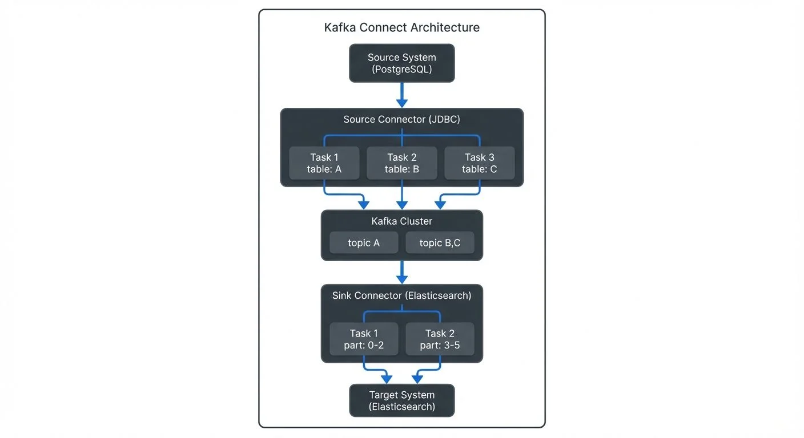

# Kafka Connect: Building Data Integration Pipelines

Kafka Connect is a distributed framework for reliably streaming data between Apache Kafka and external systems. Instead of writing custom producers and consumers for every data source and destination, Kafka Connect provides a standardized, scalable approach to data integration. This framework has become essential for data engineers building modern streaming architectures.

With Kafka 4.0+ running in KRaft mode (eliminating ZooKeeper), Kafka Connect operates as a fully modern, cloud-native integration platform. The framework handles complex integration patterns including exactly-once delivery, schema evolution, and automatic failover, making it the de facto standard for connecting Kafka to databases, cloud storage, data warehouses, and other systems.

## Understanding Kafka Connect Architecture

Kafka Connect operates as a distributed service that runs connector tasks across a cluster of workers. The architecture consists of three main components:

**Workers** are the runtime processes that execute connector tasks. They can run in standalone mode (single process) or distributed mode (multiple processes forming a cluster). Distributed mode is recommended for production environments as it provides fault tolerance and load balancing.

**Connectors** define how data should be copied to or from Kafka. They create and manage tasks that actually move the data. A source connector reads from an external system and writes to Kafka topics, while a sink connector reads from Kafka topics and writes to an external system.

**Tasks** perform the actual work of reading or writing data. Connectors split work into multiple tasks that can run in parallel across different worker nodes, enabling horizontal scalability.



<!-- ORIGINAL_DIAGRAM
```
┌──────────────────────────────────────────────────────────────────┐
│              Kafka Connect Architecture                          │
├──────────────────────────────────────────────────────────────────┤
│                                                                    │
│  ┌────────────────┐                                              │
│  │  Source System │                                              │
│  │  (PostgreSQL)  │                                              │
│  └───────┬────────┘                                              │
│          │                                                        │
│          ▼                                                        │
│  ┌──────────────────────────────────────────────┐               │
│  │        Source Connector (JDBC)               │               │
│  │  ┌─────────┐  ┌─────────┐  ┌─────────┐     │               │
│  │  │ Task 1  │  │ Task 2  │  │ Task 3  │     │               │
│  │  │table: A │  │table: B │  │table: C │     │               │
│  │  └────┬────┘  └────┬────┘  └────┬────┘     │               │
│  └───────┼────────────┼────────────┼───────────┘               │
│          │            │            │                            │
│          └────────────┴────────────┘                            │
│                       │                                          │
│                       ▼                                          │
│          ┌────────────────────────┐                             │
│          │   Kafka Cluster        │                             │
│          │  ┌──────┐  ┌──────┐   │                             │
│          │  │topic │  │topic │   │                             │
│          │  │  A   │  │  B,C │   │                             │
│          │  └──────┘  └──────┘   │                             │
│          └────────┬───────────────┘                             │
│                   │                                              │
│                   ▼                                              │
│  ┌──────────────────────────────────────────────┐               │
│  │     Sink Connector (Elasticsearch)           │               │
│  │  ┌─────────┐  ┌─────────┐                   │               │
│  │  │ Task 1  │  │ Task 2  │                   │               │
│  │  │part: 0-2│  │part: 3-5│                   │               │
│  │  └────┬────┘  └────┬────┘                   │               │
│  └───────┼────────────┼───────────────────────  │               │
│          │            │                                          │
│          └────────────┘                                          │
│                   │                                              │
│                   ▼                                              │
│          ┌────────────────┐                                     │
│          │ Target System  │                                     │
│          │(Elasticsearch) │                                     │
│          └────────────────┘                                     │
│                                                                    │
└──────────────────────────────────────────────────────────────────┘
```
-->

## Source Connectors: Ingesting Data into Kafka

Source connectors bring data from external systems into Kafka topics. They handle the complexity of reading from different data sources while providing features like exactly-once semantics (ensuring each record is delivered exactly once, even during failures), schema management, and offset tracking.

Common source connector types include:

- **Database connectors** (JDBC, Debezium) that capture changes from relational databases using Change Data Capture (CDC)
- **File connectors** that monitor directories and ingest file contents
- **Message queue connectors** that bridge other messaging systems to Kafka
- **Cloud storage connectors** that import data from S3, GCS, or Azure Blob Storage

### Example: JDBC Source Connector Configuration

Here's a practical example of configuring a JDBC source connector to ingest data from PostgreSQL:

```json
{
  "name": "postgres-source-connector",
  "config": {
    "connector.class": "io.confluent.connect.jdbc.JdbcSourceConnector",
    "tasks.max": "3",
    "connection.url": "jdbc:postgresql://postgres:5432/mydb",
    "connection.user": "${secrets:postgres:username}",
    "connection.password": "${secrets:postgres:password}",
    "mode": "incrementing",
    "incrementing.column.name": "id",
    "topic.prefix": "postgres-",
    "table.whitelist": "orders,customers,products",
    "poll.interval.ms": "1000",
    "batch.max.rows": "1000"
  }
}
```

This configuration creates three parallel tasks to ingest data from three tables, using incremental mode to capture only new rows. The connector automatically creates topics named `postgres-orders`, `postgres-customers`, and `postgres-products`.

### Understanding Exactly-Once Semantics

Kafka Connect supports **exactly-once semantics** (EOS), ensuring that each record is delivered exactly once even during failures, restarts, or network issues. This is critical for financial transactions, inventory management, and other use cases where duplicate or missing data causes problems.

For source connectors, exactly-once delivery works by coordinating offset commits with Kafka transactions. The connector writes data to Kafka topics and commits source offsets in a single atomic transaction. If a failure occurs, the transaction rolls back, and upon restart, the connector resumes from the last committed offset.

To enable exactly-once semantics in Kafka Connect:

```properties
# Worker configuration
exactly.once.source.support=enabled

# Connector configuration (source connectors)
transaction.boundary=poll
```

This requires Kafka 3.3+ and compatible connectors. Note that not all connectors support exactly-once semantics - check the connector documentation.

## Sink Connectors: Delivering Data from Kafka

Sink connectors consume data from Kafka topics and write it to external systems. They provide automatic batching, error handling, and delivery guarantees to ensure reliable data delivery.

Popular sink connector types include:

- **Database sinks** (JDBC, Elasticsearch, MongoDB) for analytical workloads
- **Data warehouse sinks** (Snowflake, BigQuery, Redshift) for analytics
- **Object storage sinks** (S3, GCS, HDFS) for data lakes
- **Search and indexing sinks** (Elasticsearch, Solr) for real-time search

### Example: Elasticsearch Sink Connector Configuration

Here's an example of a sink connector that writes Kafka data to Elasticsearch for search and analytics:

```json
{
  "name": "elasticsearch-sink-connector",
  "config": {
    "connector.class": "io.confluent.connect.elasticsearch.ElasticsearchSinkConnector",
    "tasks.max": "2",
    "topics": "postgres-orders,postgres-customers",
    "connection.url": "https://elasticsearch:9200",
    "connection.username": "${secrets:elastic:username}",
    "connection.password": "${secrets:elastic:password}",
    "type.name": "_doc",
    "key.ignore": "false",
    "schema.ignore": "false",
    "behavior.on.null.values": "delete",
    "batch.size": "1000",
    "max.buffered.records": "20000",
    "flush.timeout.ms": "5000",
    "errors.tolerance": "all",
    "errors.deadletterqueue.topic.name": "dlq-elasticsearch",
    "errors.deadletterqueue.context.headers.enable": "true"
  }
}
```

This configuration demonstrates several production best practices: batching for performance (`batch.size`), error handling with a dead letter queue (DLQ) for failed records, and secret management using ConfigProviders (a Kafka Connect feature that externalizes sensitive values).

## Kafka Connect in the Data Streaming Ecosystem

Kafka Connect serves as a critical integration layer within broader streaming architectures. It complements other streaming components:

**Stream Processing**: While Kafka Streams and ksqlDB transform data within Kafka, Connect handles the integration boundaries. A typical pipeline might use a source connector to ingest database changes, Kafka Streams to enrich and aggregate data, and a sink connector to write results to a data warehouse. For detailed stream processing patterns, see [What is Apache Flink: Stateful Stream Processing](https://conduktor.io/glossary/what-is-apache-flink-stateful-stream-processing) and [ksqlDB for Real-Time Data Processing](https://conduktor.io/glossary/ksqldb-for-real-time-data-processing).

**Schema Management**: Connect integrates tightly with Schema Registry to enforce schema validation. Connectors can automatically register schemas for data they produce and validate schemas for data they consume, ensuring data quality across the pipeline. This prevents schema compatibility issues and enables safe schema evolution. For comprehensive schema management strategies, see [Schema Registry and Schema Management](https://conduktor.io/glossary/schema-registry-and-schema-management) and [Schema Evolution Best Practices](https://conduktor.io/glossary/schema-evolution-best-practices).

**Change Data Capture (CDC)**: Debezium connectors running on Kafka Connect provide CDC capabilities, capturing row-level changes from databases in real-time. This enables event-driven architectures and keeps multiple data stores synchronized. CDC is essential for building real-time data pipelines and maintaining consistency across distributed systems. For CDC implementation details, see [What is Change Data Capture: CDC Fundamentals](https://conduktor.io/glossary/what-is-change-data-capture-cdc-fundamentals) and [Log-Based vs Query-Based CDC Comparison](https://conduktor.io/glossary/log-based-vs-query-based-cdc-comparison).

**Governance and Monitoring**: Tools like Conduktor provide visibility into Connect deployments, allowing teams to monitor connector health, track data lineage, and enforce governance policies across integration pipelines. This visibility is essential as organizations scale to dozens or hundreds of connectors. See [Conduktor's Kafka Connect management features](https://docs.conduktor.io/guide/manage-kafka/kafka-resources/kafka-connect) for managing connectors, monitoring status, and troubleshooting connection issues. For broader monitoring strategies, see [Kafka Cluster Monitoring and Metrics](https://conduktor.io/glossary/kafka-cluster-monitoring-and-metrics) and [What is Data Observability: The Five Pillars](https://conduktor.io/glossary/what-is-data-observability-the-five-pillars).

## Configuration and Deployment Best Practices

Running Kafka Connect reliably requires attention to several operational concerns:

**Distributed Mode Configuration**: Always use distributed mode in production. Configure multiple workers with the same `group.id` to form a Connect cluster. Store connector configurations and offsets in Kafka topics (specified by `config.storage.topic`, `offset.storage.topic`, and `status.storage.topic`) to enable automatic failover. With Kafka 4.0+ running in KRaft mode, these topics are managed without ZooKeeper, simplifying the architecture. For organizations migrating from older Kafka versions, see [ZooKeeper to KRaft Migration](https://conduktor.io/glossary/zookeeper-to-kraft-migration).

**Resource Allocation**: Allocate sufficient CPU and memory for connector tasks. Complex transformations and high-throughput connectors require adequate resources. Monitor JVM metrics and adjust heap sizes accordingly.

**Error Handling**: Configure dead letter queues (DLQ) for sink connectors to capture records that fail processing. This prevents connector failures from blocking the entire pipeline. The DLQ pattern writes failed records to a separate Kafka topic where they can be analyzed and reprocessed.

**Security**: Use externalized secrets (via ConfigProviders) instead of hardcoding credentials. Enable SSL/TLS for communication between Connect and both Kafka and external systems. Modern deployments should use OAuth 2.0 for authentication and mTLS (mutual TLS) for service-to-service communication. For detailed security patterns, see [Kafka Security Best Practices](https://conduktor.io/glossary/kafka-security-best-practices) and [mTLS for Kafka](https://conduktor.io/glossary/mtls-for-kafka).

**Monitoring**: Track key metrics including connector state, task status, offset lag, throughput, and error rates. Set up alerts for connector failures and performance degradation. Tools like Conduktor provide centralized visibility into all connectors across your organization, with features for monitoring, governance, and troubleshooting. Learn how to [manage Kafka Connect resources in Conduktor](https://docs.conduktor.io/guide/manage-kafka/kafka-resources/kafka-connect) to view connector configurations, restart failed tasks, and monitor throughput in real-time.

## Deploying Kafka Connect on Kubernetes

Modern production deployments increasingly run Kafka Connect on Kubernetes for better resource management, scaling, and operational simplicity. The Strimzi operator provides native Kubernetes support for Kafka Connect.

### Strimzi KafkaConnect Custom Resource

Here's an example of deploying Kafka Connect using Strimzi:

```yaml
apiVersion: kafka.strimzi.io/v1beta2
kind: KafkaConnect
metadata:
  name: my-connect-cluster
  annotations:
    strimzi.io/use-connector-resources: "true"
spec:
  version: 3.9.0
  replicas: 3
  bootstrapServers: my-kafka-cluster-kafka-bootstrap:9093

  # Enable KRaft mode (Kafka 4.0+)
  config:
    group.id: connect-cluster
    offset.storage.topic: connect-cluster-offsets
    config.storage.topic: connect-cluster-configs
    status.storage.topic: connect-cluster-status
    offset.storage.replication.factor: 3
    config.storage.replication.factor: 3
    status.storage.replication.factor: 3

  # Install connector plugins
  build:
    output:
      type: docker
      image: my-registry/kafka-connect:latest
    plugins:
      - name: debezium-postgres
        artifacts:
          - type: tgz
            url: https://repo1.maven.org/maven2/io/debezium/debezium-connector-postgres/2.7.0.Final/debezium-connector-postgres-2.7.0.Final-plugin.tar.gz
      - name: elasticsearch-sink
        artifacts:
          - type: zip
            url: https://d1i4a15mxbxib1.cloudfront.net/api/plugins/confluentinc/kafka-connect-elasticsearch/versions/14.0.0/confluentinc-kafka-connect-elasticsearch-14.0.0.zip

  # Resource limits
  resources:
    requests:
      memory: 2Gi
      cpu: 1000m
    limits:
      memory: 4Gi
      cpu: 2000m

  # OAuth authentication (2025 best practice)
  authentication:
    type: oauth
    tokenEndpointUri: https://auth.example.com/token
    clientId: kafka-connect
    clientSecret:
      secretName: kafka-connect-oauth
      key: client-secret

  # TLS encryption
  tls:
    trustedCertificates:
      - secretName: kafka-cluster-ca-cert
        certificate: ca.crt
```

This Kubernetes-native approach provides several advantages:

- **Automatic scaling**: Scale Connect workers up or down with `kubectl scale`
- **Rolling updates**: Update connector plugins without downtime
- **Secrets management**: Integrate with Kubernetes secrets and external secret stores
- **Resource isolation**: Kubernetes manages CPU and memory allocation
- **Observability**: Native integration with Prometheus and Grafana for metrics

For detailed Kubernetes deployment patterns, see [Running Kafka on Kubernetes](https://conduktor.io/glossary/running-kafka-on-kubernetes) and [Strimzi Kafka Operator for Kubernetes](https://conduktor.io/glossary/strimzi-kafka-operator-for-kubernetes).

## Performance Tuning and Monitoring

Optimizing Kafka Connect performance requires tuning several key parameters:

**Task Parallelism**: Increase `tasks.max` to parallelize work across multiple tasks. Each task runs independently and can process different partitions or tables concurrently. Monitor CPU and memory usage to find the optimal task count.

**Batching Configuration**: Configure batch sizes to balance latency and throughput. For sink connectors, larger batches (`batch.size`, `flush.timeout.ms`) improve throughput but increase latency. For source connectors, `batch.max.rows` controls how many records are fetched per poll.

**Consumer and Producer Tuning**: Connect uses Kafka consumers and producers internally. Override their configurations using `consumer.*` and `producer.*` prefixes:

```json
{
  "config": {
    "producer.compression.type": "snappy",
    "producer.linger.ms": "10",
    "producer.batch.size": "32768",
    "consumer.max.poll.records": "1000",
    "consumer.fetch.min.bytes": "1024"
  }
}
```

**Key Metrics to Monitor**:

| Metric | Description | Alert Threshold |
|--------|-------------|-----------------|
| `connector-state` | Connector status (RUNNING, FAILED, PAUSED) | Alert on FAILED |
| `task-state` | Individual task status | Alert on FAILED |
| `source-record-poll-total` | Records polled from source | Drops to 0 unexpectedly |
| `sink-record-send-total` | Records sent to sink | Drops to 0 unexpectedly |
| `offset-commit-skip-total` | Skipped offset commits | Increasing trend |
| `task-error-total` | Total task errors | Any increase |

For comprehensive monitoring strategies, see [Kafka Cluster Monitoring and Metrics](https://conduktor.io/glossary/kafka-cluster-monitoring-and-metrics) and [Kafka Performance Tuning Guide](https://conduktor.io/glossary/kafka-performance-tuning-guide).

## Single Message Transforms (SMTs)

For simpler use cases, **Single Message Transforms (SMTs)** allow inline data transformation without custom connector development. SMTs process records as they flow through Connect, enabling lightweight transformations like field manipulation, filtering, routing, and masking.

### Common SMT Patterns

Here are practical examples of frequently used transformations:

**Field Masking for PII Protection**:
```json
{
  "name": "postgres-source-with-masking",
  "config": {
    "connector.class": "io.confluent.connect.jdbc.JdbcSourceConnector",
    "tasks.max": "1",
    "connection.url": "jdbc:postgresql://postgres:5432/mydb",
    "table.whitelist": "users",
    "mode": "incrementing",
    "incrementing.column.name": "id",
    "topic.prefix": "postgres-",

    "transforms": "maskEmail,maskSSN",
    "transforms.maskEmail.type": "org.apache.kafka.connect.transforms.MaskField$Value",
    "transforms.maskEmail.fields": "email",
    "transforms.maskEmail.replacement": "****@****.com",
    "transforms.maskSSN.type": "org.apache.kafka.connect.transforms.MaskField$Value",
    "transforms.maskSSN.fields": "ssn",
    "transforms.maskSSN.replacement": "***-**-****"
  }
}
```

**Topic Routing Based on Field Value**:
```json
{
  "transforms": "routeByStatus",
  "transforms.routeByStatus.type": "org.apache.kafka.connect.transforms.RegexRouter",
  "transforms.routeByStatus.regex": ".*",
  "transforms.routeByStatus.replacement": "orders-$topic"
}
```

**Extracting and Flattening Nested Fields**:
```json
{
  "transforms": "flatten,extract",
  "transforms.flatten.type": "org.apache.kafka.connect.transforms.Flatten$Value",
  "transforms.flatten.delimiter": "_",
  "transforms.extract.type": "org.apache.kafka.connect.transforms.ExtractField$Value",
  "transforms.extract.field": "payload"
}
```

**Adding Metadata Timestamp**:
```json
{
  "transforms": "insertTimestamp",
  "transforms.insertTimestamp.type": "org.apache.kafka.connect.transforms.InsertField$Value",
  "transforms.insertTimestamp.timestamp.field": "processed_at"
}
```

For detailed SMT patterns and use cases, see [Kafka Connect Single Message Transforms](https://conduktor.io/glossary/kafka-connect-single-message-transforms).

## Connector Development and Customization

While connector repositories like Confluent Hub provide hundreds of pre-built connectors, custom requirements sometimes necessitate developing proprietary connectors. The Kafka Connect framework provides interfaces for building new connectors:

**SourceConnector** and **SinkConnector** classes define connector lifecycle and task configuration. **SourceTask** and **SinkTask** classes implement the actual data reading and writing logic.

Connector plugins are deployed by placing JAR files in the `plugin.path` directory, which Connect scans at startup. This plugin isolation prevents dependency conflicts between different connectors.

## Summary

Kafka Connect provides a powerful, scalable framework for integrating Apache Kafka with external systems. By standardizing how data moves in and out of Kafka through source and sink connectors, it reduces development complexity and operational overhead. The distributed architecture enables fault tolerance and horizontal scalability, while features like schema management, transformations, and error handling ensure reliable data delivery.

For data engineers building streaming platforms, Kafka Connect serves as the integration backbone, connecting databases, data warehouses, object storage, and other systems to the central Kafka event bus. With Kafka 4.0+ running in KRaft mode, modern deployments on Kubernetes via Strimzi, and OAuth/mTLS security, Connect provides a production-ready foundation for data integration.

Understanding connector configuration, deployment patterns, and operational best practices is essential for building production-grade data integration pipelines. Whether ingesting database changes through CDC, loading data lakes, implementing PII masking via SMTs, or synchronizing multiple data stores, Kafka Connect simplifies the complexity of modern data integration.

### Related Topics

For deeper understanding of Kafka Connect and its ecosystem, explore:

- **Architecture Foundation**: [Apache Kafka](https://conduktor.io/glossary/apache-kafka) for core concepts and [Understanding KRaft Mode in Kafka](https://conduktor.io/glossary/understanding-kraft-mode-in-kafka) for modern deployment
- **Data Integration Patterns**: [Streaming ETL vs Traditional ETL](https://conduktor.io/glossary/streaming-etl-vs-traditional-etl) and [Streaming Data Pipeline](https://conduktor.io/glossary/streaming-data-pipeline)
- **Security**: [Kafka Security Best Practices](https://conduktor.io/glossary/kafka-security-best-practices), [Kafka Authentication: SASL, SSL, OAuth](https://conduktor.io/glossary/kafka-authentication-sasl-ssl-oauth), and [mTLS for Kafka](https://conduktor.io/glossary/mtls-for-kafka)
- **Data Quality**: [Automated Data Quality Testing](https://conduktor.io/glossary/automated-data-quality-testing) and [Building a Data Quality Framework](https://conduktor.io/glossary/building-a-data-quality-framework)
- **PII Protection**: [PII Detection and Handling in Event Streams](https://conduktor.io/glossary/pii-detection-and-handling-in-event-streams)
- **Lakehouse Integration**: [Streaming to Lakehouse Tables](https://conduktor.io/glossary/streaming-to-lakehouse-tables) and [Streaming Ingestion to Lakehouse](https://conduktor.io/glossary/streaming-ingestion-to-lakehouse)
- **Serialization**: [Message Serialization in Kafka](https://conduktor.io/glossary/message-serialization-in-kafka) and [Avro vs Protobuf vs JSON Schema](https://conduktor.io/glossary/avro-vs-protobuf-vs-json-schema)

## Sources and References

- [Apache Kafka Documentation - Kafka Connect](https://kafka.apache.org/documentation/#connect) - Official documentation covering architecture, configuration, and operations for Kafka 4.0+
- [Kafka Connect Configuration Reference](https://kafka.apache.org/documentation/#connectconfigs) - Complete reference for worker and connector configuration parameters
- [Debezium Documentation](https://debezium.io/documentation/) - Leading CDC connector framework built on Kafka Connect
- [Strimzi Documentation - Kafka Connect](https://strimzi.io/docs/operators/latest/deploying.html#deploying-kafka-connect-str) - Kubernetes-native deployment patterns for Kafka Connect
- [Kafka Improvement Proposals - KIP-618](https://cwiki.apache.org/confluence/display/KAFKA/KIP-618%3A+Exactly-Once+Support+for+Source+Connectors) - Exactly-once semantics for source connectors
- [Kafka Connect REST API](https://kafka.apache.org/documentation/#connect_rest) - REST API for managing and monitoring connectors
- [Confluent Hub](https://www.confluent.io/hub/) - Repository of pre-built, community-contributed Kafka Connect connectors
- [Conduktor Platform](https://www.conduktor.io/) - Commercial platform for managing, monitoring, and governing Kafka Connect deployments
