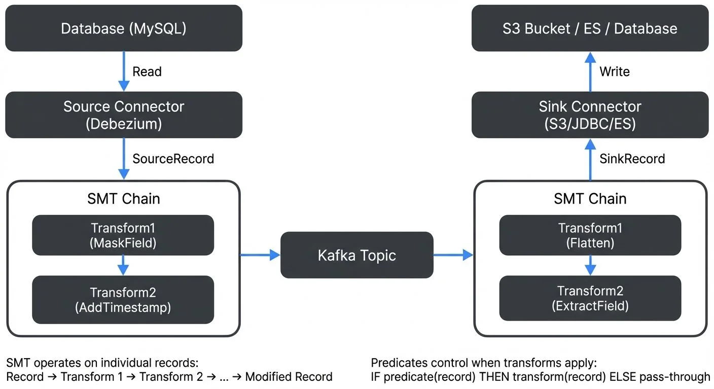

When building data pipelines with Kafka Connect, you often need to modify data as it flows between systems. Single Message Transforms (SMTs) provide a lightweight mechanism to transform records within the connector itself, without requiring separate stream processing applications. For comprehensive coverage of Kafka Connect fundamentals and architecture, see [Kafka Connect: Building Data Integration Pipelines](https://conduktor.io/glossary/kafka-connect-building-data-integration-pipelines).

<!-- ORIGINAL_DIAGRAM
```
Kafka Connect SMT Pipeline Flow

Source Connector                        Sink Connector
─────────────────                       ──────────────

┌──────────┐                                    ┌──────────┐
│ Database │                                    │ S3 Bucket│
│  (MySQL) │                                    │ / ES /   │
└────┬─────┘                                    │Database  │
     │                                          └────▲─────┘
     │ Read                                          │ Write
┌────▼─────────────┐                    ┌────────────┴─────┐
│  Source Connector│                    │  Sink Connector  │
│    (Debezium)    │                    │  (S3/JDBC/ES)    │
└────┬─────────────┘                    └────────────▲─────┘
     │                                               │
     │ SourceRecord                   SinkRecord     │
     │                                               │
┌────▼─────────────┐                    ┌───────────┴──────┐
│  SMT Chain       │                    │  SMT Chain       │
│  ┌────────────┐  │                    │  ┌────────────┐  │
│  │ Transform1 │  │   ┌──────────┐     │  │ Transform1 │  │
│  │ (MaskField)│──┼──►│  Kafka   │────►┼──│ (Flatten)  │  │
│  └────┬───────┘  │   │  Topic   │     │  └────┬───────┘  │
│  ┌────▼───────┐  │   └──────────┘     │  ┌────▼───────┐  │
│  │ Transform2 │  │                    │  │ Transform2 │  │
│  │(AddTimestamp)│                     │  │(ExtractField)│
│  └────────────┘  │                    │  └────────────┘  │
└──────────────────┘                    └──────────────────┘

SMT operates on individual records:
Record → Transform 1 → Transform 2 → ... → Modified Record

Predicates control when transforms apply:
IF predicate(record) THEN transform(record) ELSE pass-through
```
-->

## What Are Single Message Transforms?

Single Message Transforms are pluggable components in Kafka Connect that modify individual records as they pass through a connector. SMTs operate on one message at a time, applying transformations like field manipulation, filtering, or routing during the data movement process.

SMTs are configured directly in the connector configuration and execute within the Connect worker's JVM. This makes them simpler to deploy than standalone stream processing applications, but also more limited in capability. They are ideal for straightforward transformations that don't require aggregations, joins, or complex stateful processing.

The Kafka Connect framework includes several built-in SMTs, and you can also develop custom transformations by implementing the `org.apache.kafka.connect.transforms.Transformation` interface.

## How SMTs Work

SMTs are applied in a chain during the connector's data flow. For source connectors, transformations occur after data is read from the source system but before it's written to Kafka. For sink connectors, SMTs execute after reading from Kafka but before writing to the destination system.

Each SMT receives a `SinkRecord` or `SourceRecord` object, applies its transformation logic, and returns a modified record. The transformed record then passes to the next SMT in the chain, creating a pipeline of transformations.

Here's how you configure SMTs in a connector:

```properties
transforms=maskPII,addTimestamp
transforms.maskPII.type=org.apache.kafka.connect.transforms.MaskField$Value
transforms.maskPII.fields=ssn,creditCard
transforms.addTimestamp.type=org.apache.kafka.connect.transforms.InsertField$Value
transforms.addTimestamp.timestamp.field=processing_time
```

**Understanding the Configuration Syntax**: The `transforms` property defines the ordered list of transformation names. Each transformation is then configured using the pattern `transforms.<name>.<property>`. The `type` property specifies the Java class implementing the transformation, while other properties are specific to that transformation type.

This configuration creates a chain of two transformations: first masking sensitive fields, then adding a timestamp field.

**Before and After Example**: To illustrate how SMTs modify data, consider this input record:

```json
{
  "customer_id": 12345,
  "name": "Jane Doe",
  "ssn": "123-45-6789",
  "creditCard": "4111-1111-1111-1111"
}
```

After applying the SMT chain above, the output becomes:

```json
{
  "customer_id": 12345,
  "name": "Jane Doe",
  "ssn": null,
  "creditCard": null,
  "processing_time": 1704067200000
}
```

The sensitive fields are masked (replaced with null), and a timestamp field is added to track when the transformation occurred.

## Conditional Transformations with Predicates

Since Kafka Connect 2.6, you can apply SMTs conditionally using predicates. Predicates evaluate each record and determine whether to apply a transformation, enabling more sophisticated data processing logic.

```properties
transforms=addRegion,maskPII
transforms.addRegion.type=org.apache.kafka.connect.transforms.InsertField$Value
transforms.addRegion.static.field=region
transforms.addRegion.static.value=us-east
transforms.addRegion.predicate=isUSCustomer

transforms.maskPII.type=org.apache.kafka.connect.transforms.MaskField$Value
transforms.maskPII.fields=ssn
transforms.maskPII.predicate=hasSSN
transforms.maskPII.negate=false

predicates=isUSCustomer,hasSSN
predicates.isUSCustomer.type=org.apache.kafka.connect.transforms.predicates.TopicNameMatches
predicates.isUSCustomer.pattern=us-.*

predicates.hasSSN.type=org.apache.kafka.connect.transforms.predicates.HasHeaderKey
predicates.hasSSN.name=contains-ssn
```

This configuration adds a region field only for topics matching the `us-.*` pattern and masks SSN fields only when records have a specific header. Built-in predicates include `TopicNameMatches`, `HasHeaderKey`, and `RecordIsTombstone`. You can also create custom predicates for complex business logic.

Predicates support negation via the `negate=true` parameter, allowing you to apply transformations when a condition is NOT met. This is particularly useful for filtering or handling exceptional cases.

## Common Built-in SMT Types

Kafka Connect provides several useful built-in transformations:

**Field Manipulation**: The `InsertField` SMT adds metadata fields like timestamps or static values. The `ReplaceField` SMT renames or excludes specific fields. The `MaskField` SMT masks sensitive data with null values, useful for PII protection. For comprehensive strategies on handling personally identifiable information in streaming pipelines, see [PII Detection and Handling in Event Streams](https://conduktor.io/glossary/pii-detection-and-handling-in-event-streams).

**Casting and Type Conversion**: The `Cast` SMT converts field types, such as changing strings to integers or timestamps to different formats. The `TimestampConverter` SMT transforms timestamp fields between different formats (string, Unix, Timestamp) and timezones. This helps align data types between source and destination systems. For deeper understanding of data serialization formats in Kafka, see [Message Serialization in Kafka](https://conduktor.io/glossary/message-serialization-in-kafka).

**Key and Value Transformations**: The `ValueToKey` SMT copies fields from the record value to the record key, useful for rekeying streams. The `KeyToValue` SMT does the opposite, copying key fields into the value. The `ExtractField` SMT extracts a single field from a complex record structure.

**Filtering and Routing**: The `Filter` SMT drops records based on predicates, while `RegexRouter` and `TimestampRouter` modify topic names dynamically based on record content or timestamps. These are particularly useful for partitioning data across multiple topics or implementing routing logic.

**Schema Modifications**: The `Flatten` SMT converts nested structures into flat records, making complex JSON or Avro data compatible with relational databases. The `HoistField` SMT wraps the entire record value in a struct field. The `SetSchemaMetadata` SMT modifies schema names and versions, useful for schema evolution scenarios. For understanding schema management and evolution strategies, see [Schema Registry and Schema Management](https://conduktor.io/glossary/schema-registry-and-schema-management) and [Schema Evolution Best Practices](https://conduktor.io/glossary/schema-evolution-best-practices).

## Real-World Use Cases

Consider a typical scenario: streaming customer data from a PostgreSQL database to Amazon S3 for analytics. The source data contains sensitive information that must be masked before storage.

```properties
name=postgres-to-s3-connector
connector.class=io.aiven.kafka.connect.s3.AivenKafkaConnectS3SinkConnector
topics=customer_data
transforms=maskSensitive,addTimestamp,flatten

transforms.maskSensitive.type=org.apache.kafka.connect.transforms.MaskField$Value
transforms.maskSensitive.fields=ssn,credit_card,password

transforms.addTimestamp.type=org.apache.kafka.connect.transforms.InsertField$Value
transforms.addTimestamp.timestamp.field=ingest_timestamp

transforms.flatten.type=org.apache.kafka.connect.transforms.Flatten$Value
transforms.flatten.delimiter=_
```

This pipeline masks PII fields, adds a timestamp field for tracking and partitioning, and flattens nested structures for easier querying. Note that you would typically partition S3 data using the connector's built-in partitioning capabilities rather than SMTs.

Another common pattern involves dynamic topic routing. A source connector might read from multiple database tables and route each to a different Kafka topic:

```properties
transforms=route
transforms.route.type=org.apache.kafka.connect.transforms.RegexRouter
transforms.route.regex=(.*)
transforms.route.replacement=db_$1_events
```

This pattern is particularly common in Change Data Capture (CDC) scenarios where database changes from multiple tables need to be routed to separate Kafka topics. For detailed CDC implementation patterns, see [Implementing CDC with Debezium](https://conduktor.io/glossary/implementing-cdc-with-debezium).

## SMTs vs Full Stream Processing

While SMTs provide convenient transformation capabilities, they have important limitations compared to dedicated stream processing frameworks like Kafka Streams or Apache Flink.

SMTs operate on individual messages without state or context from other messages. You cannot perform aggregations, windowing, joins between streams, or complex event processing. If your transformation logic requires correlating multiple events or maintaining state over time, you need a stream processing framework.

SMTs also lack sophisticated error handling. If a transformation fails, the entire connector typically stops. Stream processing frameworks offer fine-grained error handling, dead letter queues, and retry mechanisms.

However, SMTs offer significant advantages for simple transformations. They eliminate the need to deploy and manage separate stream processing applications, reducing operational complexity. They're easier to configure and test, and they keep your data pipeline architecture simpler when complex processing isn't required.

Tools like Conduktor Platform help manage this complexity by providing visual configuration and validation of SMT chains through [Kafka Connect management](https://docs.conduktor.io/guide/manage-kafka/kafka-resources/kafka-connect), making it easier to build and debug transformation pipelines without manual JSON editing.

## Conduktor Interceptors: An Alternative to SMTs

While SMTs operate within Kafka Connect, Conduktor Interceptors provide transformation at the Gateway proxy layer, intercepting all Kafka traffic regardless of origin (Connect, producers, or consumers). Unlike SMTs configured per-connector, Interceptors apply globally to all matching traffic, creating consistent transformation behavior across your entire ecosystem. This makes them ideal for universal transformations like PII masking or timestamp standardization.

Interceptors also excel at policy enforcement that SMTs cannot address, blocking messages violating data quality rules, enforcing producer settings, or validating schema compliance in real-time. The trade-off is operational complexity: SMTs are simpler for connector-specific transformations, while Interceptors require Gateway deployment. For organizations already using Gateway, Interceptors provide centralized transformation without per-connector configuration. Learn more at the [Interceptors documentation](https://docs.conduktor.io/guide/conduktor-concepts/interceptors).

## Best Practices and Limitations

When working with SMTs, keep transformations simple and focused. Each SMT should perform one clear function. Complex multi-step transformations become difficult to debug and maintain.

Be aware of performance implications. SMTs execute synchronously in the connector's data path, so slow transformations directly impact throughput. Avoid expensive operations like external API calls or heavy computation within SMTs.

Consider schema compatibility carefully. If you're using a schema registry, ensure your transformations maintain schema compatibility or explicitly version your schemas. The `Cast` and `Flatten` SMTs can inadvertently break schema evolution if not configured properly.

Test your SMT configurations thoroughly before production deployment. Since SMTs modify data in flight, errors can corrupt your data pipeline. Use tools that validate configurations and provide test environments for SMT chains. For comprehensive testing strategies for streaming data pipelines, see [Testing Strategies for Streaming Applications](https://conduktor.io/glossary/testing-strategies-for-streaming-applications) and [Automated Data Quality Testing](https://conduktor.io/glossary/automated-data-quality-testing).

Remember that SMTs cannot access external data sources or services. They work only with the data in the current record and connector configuration. If you need to enrich data from external systems, consider using a stream processing framework instead.

## Developing Custom SMTs

When built-in transformations don't meet your needs, you can develop custom SMTs by implementing the `org.apache.kafka.connect.transforms.Transformation` interface. Custom SMTs are particularly useful for business-specific logic like data enrichment, validation, or format conversion.

Here's a simple custom SMT that adds a custom field:

```java
package com.example.transforms;

import org.apache.kafka.common.config.ConfigDef;
import org.apache.kafka.connect.connector.ConnectRecord;
import org.apache.kafka.connect.transforms.Transformation;
import org.apache.kafka.connect.data.Schema;
import org.apache.kafka.connect.data.SchemaBuilder;
import org.apache.kafka.connect.data.Struct;
import java.util.Map;

public class AddEnvironmentField<R extends ConnectRecord<R>>
    implements Transformation<R> {

    private String environmentValue;

    @Override
    public void configure(Map<String, ?> configs) {
        environmentValue = (String) configs.get("environment");
    }

    @Override
    public R apply(R record) {
        if (record.value() == null) {
            return record;
        }

        Struct value = (Struct) record.value();
        Schema updatedSchema = SchemaBuilder.struct()
            .field("environment", Schema.STRING_SCHEMA)
            .fields(value.schema().fields())
            .build();

        Struct updatedValue = new Struct(updatedSchema);
        updatedValue.put("environment", environmentValue);
        value.schema().fields()
            .forEach(f -> updatedValue.put(f.name(), value.get(f)));

        return record.newRecord(
            record.topic(),
            record.kafkaPartition(),
            record.keySchema(),
            record.key(),
            updatedSchema,
            updatedValue,
            record.timestamp()
        );
    }

    @Override
    public ConfigDef config() {
        return new ConfigDef()
            .define("environment", ConfigDef.Type.STRING,
                ConfigDef.Importance.HIGH,
                "Environment identifier");
    }

    @Override
    public void close() {
        // Clean up resources if needed
    }
}
```

**Packaging and Deployment**: Package your custom SMT as a JAR with dependencies, then place it in Kafka Connect's plugin path (typically defined by `plugin.path` in the worker configuration). Connect automatically discovers and loads plugins from this directory.

```bash
# Build the custom SMT
mvn clean package

# Copy to Connect's plugin path
mkdir -p /opt/kafka-connect/plugins/custom-smts
cp target/custom-smt-1.0.0-jar-with-dependencies.jar \
   /opt/kafka-connect/plugins/custom-smts/
```

**Best Practices for Custom SMTs**:
- Keep transformations stateless - SMTs should not maintain state between records
- Ensure thread-safety - multiple threads may execute your SMT concurrently
- Handle null values gracefully - check for null records, keys, and values
- Implement proper error handling - throw `DataException` for data issues
- Version your schemas appropriately when modifying schema structure
- Test thoroughly with different data types and edge cases
- Document configuration parameters clearly in the `ConfigDef`
- Consider performance impact - avoid expensive operations in the hot path

## Monitoring SMT Performance

SMT performance directly impacts connector throughput since transformations execute synchronously in the data path. Kafka Connect exposes JMX metrics for monitoring transformation performance:

**Key Metrics**:
- `transformation-time-ms-avg`: Average time spent in transformation per record
- `transformation-time-ms-max`: Maximum transformation time
- `transformation-record-rate`: Number of records transformed per second
- `transformation-record-total`: Total records transformed

Access these metrics via JMX or monitoring tools that integrate with Kafka Connect's metrics:

```bash
# Example: Query JMX metrics using jmxterm
echo "get -b kafka.connect:type=connector-task-metrics,connector=my-connector,task=0 transformation-time-ms-avg" | java -jar jmxterm.jar -l localhost:9999
```

**Performance Optimization Tips**:
- Profile SMT chains to identify bottlenecks - complex transformations may need optimization
- Consider batch processing patterns if you control the connector implementation
- Use predicates to skip unnecessary transformations on certain records
- Monitor memory usage - large transformations can cause GC pressure
- Test with production-like data volumes before deploying

Tools like Conduktor Platform provide built-in monitoring dashboards for Connect metrics, including SMT performance, making it easier to identify and resolve performance issues without manual JMX querying.

## Summary

Single Message Transforms provide a lightweight, convenient way to modify data within Kafka Connect pipelines. They're ideal for simple, per-record transformations like field masking, type conversion, schema flattening, and dynamic routing.

SMTs shine when you need straightforward transformations without the operational overhead of separate stream processing applications. They're configured directly in connector properties, execute efficiently within the Connect worker, and leverage built-in transformations for common patterns.

However, SMTs are not suitable for stateful processing, aggregations, or complex event patterns. Understanding when to use SMTs versus full stream processing frameworks is crucial for building efficient, maintainable data pipelines.

For simple transformations at the connector level, SMTs offer the right balance of capability and simplicity. For complex processing requirements, consider Apache Kafka Streams, Apache Flink, or similar frameworks that provide comprehensive stream processing capabilities. To understand when to choose stream processing frameworks over SMTs, see [Kafka Streams vs Apache Flink](https://conduktor.io/glossary/kafka-streams-vs-apache-flink) and [Introduction to Kafka Streams](https://conduktor.io/glossary/introduction-to-kafka-streams).

## Related Concepts

- [Kafka Connect: Building Data Integration Pipelines](https://conduktor.io/glossary/kafka-connect-building-data-integration-pipelines) - Comprehensive guide to Kafka Connect architecture and connector patterns where SMTs provide lightweight transformations.
- [Schema Evolution Best Practices](https://conduktor.io/glossary/schema-evolution-best-practices) - Understand how SMTs interact with schema evolution when transforming message structures and handling schema compatibility.
- [Data Quality Dimensions: Accuracy, Completeness, and Consistency](https://conduktor.io/glossary/data-quality-dimensions-accuracy-completeness-and-consistency) - Learn how SMTs can enforce data quality rules through validation and transformation at the connector level.

## Sources and References

1. Apache Kafka Documentation - "Kafka Connect Transformations": https://kafka.apache.org/documentation/#connect_transforms
2. Confluent Documentation - "Single Message Transforms": https://docs.confluent.io/platform/current/connect/transforms/overview.html
3. Kafka Connect GitHub Repository - SMT Source Code: https://github.com/apache/kafka/tree/trunk/connect/transforms
4. Confluent Blog - "12 Single Message Transformations to Make the Most of Kafka Connect": https://www.confluent.io/blog/kafka-connect-single-message-transformation-tutorial-with-examples/
5. Apache Kafka Javadoc - Transformation Interface: https://kafka.apache.org/documentation/#connect_transforms
