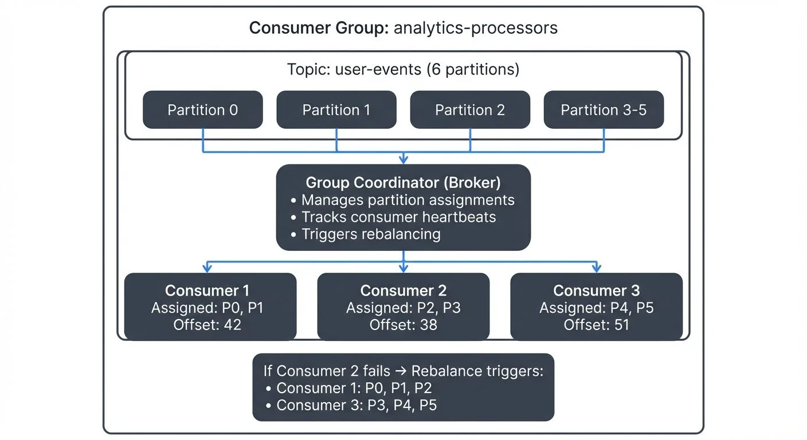

Consumer groups are one of Apache Kafka's most powerful features for building scalable data streaming applications. They enable multiple consumers to work together to process messages from Kafka topics in parallel, while ensuring each message is processed exactly once per group. Understanding consumer groups is essential for designing efficient, fault-tolerant streaming architectures.

This article explains what consumer groups are, how they work, and how to use them effectively in production environments.

For foundational understanding of Kafka's architecture including topics, partitions, and brokers, see [Kafka Topics, Partitions, and Brokers: Core Architecture](https://conduktor.io/glossary/kafka-topics-partitions-brokers-core-architecture).

## What Are Consumer Groups?

A consumer group is a collection of consumers that work together to consume messages from one or more Kafka topics. Each consumer in the group is assigned a subset of the topic's partitions, ensuring that no two consumers in the same group read from the same partition simultaneously.

The key benefit is parallel processing. Instead of a single consumer reading all messages sequentially, multiple consumers can process different partitions concurrently. This approach scales horizontally, add more consumers to handle increased throughput. For a broader overview of how consumers and producers work together, see [Kafka Producers and Consumers](https://conduktor.io/glossary/kafka-producers-and-consumers).

Kafka tracks which messages each consumer group has processed by storing offsets in a special internal topic called `__consumer_offsets`. Think of this as a ledger that records "Consumer Group A has processed messages up to offset 1000 on partition 0." This allows consumers to resume from where they left off after a restart or failure.

In Kafka 4.0+ with KRaft mode (the successor to ZooKeeper), the group coordinator functionality is handled by dedicated controller nodes. This improves scalability and reduces operational complexity compared to the legacy ZooKeeper-based coordination. For more details, see [Understanding KRaft Mode in Kafka](https://conduktor.io/glossary/understanding-kraft-mode-in-kafka).

## How Consumer Groups Enable Scalability

Partition assignment is at the heart of consumer group scalability. When consumers join a group, Kafka's group coordinator assigns partitions to each consumer using a partition assignment strategy.

```java
// Java consumer group configuration example
Properties props = new Properties();
props.put("bootstrap.servers", "localhost:9092");
props.put("group.id", "analytics-processors");
props.put("key.deserializer", "org.apache.kafka.common.serialization.StringDeserializer");
props.put("value.deserializer", "org.apache.kafka.common.serialization.StringDeserializer");
props.put("enable.auto.commit", "false"); // Manual offset management
props.put("partition.assignment.strategy", "org.apache.kafka.clients.consumer.CooperativeStickyAssignor");

KafkaConsumer<String, String> consumer = new KafkaConsumer<>(props);
consumer.subscribe(Arrays.asList("user-events"));
```

<!-- ORIGINAL_DIAGRAM
```
┌────────────────────────────────────────────────────────────────┐
│              Consumer Group: analytics-processors              │
├────────────────────────────────────────────────────────────────┤
│                                                                  │
│  Topic: user-events (6 partitions)                             │
│                                                                  │
│  ┌──────────┐  ┌──────────┐  ┌──────────┐  ┌──────────┐      │
│  │Partition │  │Partition │  │Partition │  │Partition │ ...  │
│  │    0     │  │    1     │  │    2     │  │    3-5   │      │
│  └────┬─────┘  └────┬─────┘  └────┬─────┘  └────┬─────┘      │
│       │             │             │             │              │
│       ▼             ▼             ▼             ▼              │
│  ┌─────────────────────────────────────────────────────────┐  │
│  │              Group Coordinator (Broker)                 │  │
│  │  • Manages partition assignments                        │  │
│  │  • Tracks consumer heartbeats                           │  │
│  │  • Triggers rebalancing                                 │  │
│  └──────┬──────────────┬──────────────┬────────────────────┘  │
│         │              │              │                        │
│         ▼              ▼              ▼                        │
│  ┌────────────┐ ┌────────────┐ ┌────────────┐                │
│  │ Consumer 1 │ │ Consumer 2 │ │ Consumer 3 │                │
│  ├────────────┤ ├────────────┤ ├────────────┤                │
│  │ Assigned:  │ │ Assigned:  │ │ Assigned:  │                │
│  │ P0, P1     │ │ P2, P3     │ │ P4, P5     │                │
│  │            │ │            │ │            │                │
│  │ Offset: 42 │ │ Offset: 38 │ │ Offset: 51 │                │
│  └────────────┘ └────────────┘ └────────────┘                │
│                                                                  │
│  ┌──────────────────────────────────────────────────────────┐ │
│  │  If Consumer 2 fails → Rebalance triggers:              │ │
│  │  • Consumer 1: P0, P1, P2                                │ │
│  │  • Consumer 3: P3, P4, P5                                │ │
│  └──────────────────────────────────────────────────────────┘ │
│                                                                  │
└────────────────────────────────────────────────────────────────┘
```
-->

Consider a topic with six partitions and three consumers in the same group. Each consumer might receive two partitions. If you add a fourth consumer, the partitions are redistributed, perhaps three consumers get two partitions each, and one gets none. If you have more consumers than partitions, the extra consumers remain idle.

Common assignment strategies include:

- **Cooperative Sticky (Incremental Cooperative Rebalancing)**: The modern default since Kafka 2.4+. Allows consumers to continue processing unaffected partitions during rebalancing, minimizing disruption. This is the recommended protocol for all new applications in 2025.
- **Sticky**: Minimizes partition movement during rebalancing but requires all consumers to stop (eager rebalancing)
- **Range**: Assigns partitions in ranges, which can lead to uneven distribution across multiple topics
- **Round-robin**: Distributes partitions evenly in a circular fashion (deprecated in favor of cooperative sticky)

Set the assignment strategy using `partition.assignment.strategy` configuration (default is `[CooperativeStickyAssignor]` in Kafka 3.0+).

For most applications, use **cooperative sticky**, which provides the best balance of even distribution and minimal disruption during rebalancing. Only consider other strategies if you have specific requirements like maintaining partition locality across topics (range) or need compatibility with older Kafka versions.

The group coordinator is one of the Kafka brokers that takes responsibility for managing a specific consumer group. Kafka automatically assigns coordinator duties among brokers to distribute the load. This coordinator tracks which consumers are alive (via heartbeats) and triggers rebalancing when needed.

## The Rebalancing Process

Rebalancing occurs when the consumer group membership or topic metadata changes. Common triggers include:

- A consumer joins the group
- A consumer leaves (gracefully or due to failure)
- A consumer is considered dead (missed heartbeat deadline)
- Partitions are added to a subscribed topic

During a traditional rebalance, all consumers stop processing, release their partitions, and wait for new assignments. This causes a processing pause that can impact latency-sensitive applications.

Modern rebalancing protocols like cooperative rebalancing (also called incremental cooperative rebalancing) reduce this impact significantly. Instead of stopping all consumers, only the partitions being reassigned are revoked. Consumers not affected by the change continue processing without interruption. This protocol has been the default since Kafka 2.4+ and is essential for minimizing disruption in production systems.

Rebalancing is necessary for fault tolerance and elasticity, but frequent rebalances can hurt performance. Setting appropriate session timeout and heartbeat interval configurations helps balance responsiveness with stability.

Set `session.timeout.ms` (default: 10 seconds) higher than your maximum expected processing time for a single message, or process messages asynchronously. Use `max.poll.interval.ms` (default: 5 minutes) to control how long consumers can spend in their processing loop before calling `poll()` again. If consumers don't poll within this interval, Kafka considers them stuck and triggers a rebalance.

Typical production settings:
- `session.timeout.ms`: 45000 (45 seconds)
- `heartbeat.interval.ms`: 3000 (3 seconds, typically 1/3 of session timeout)
- `max.poll.interval.ms`: 300000 (5 minutes)

### Static Membership

In containerized and cloud environments where consumers may restart frequently, Kafka 4.0+ supports static membership to avoid unnecessary rebalances. By setting a unique `group.instance.id` for each consumer, Kafka preserves partition assignments across restarts within the `session.timeout.ms` window.

This is particularly valuable in Kubernetes deployments where pods restart for rolling updates or scaling operations. Static membership reduces rebalancing overhead and improves processing stability. For comprehensive guidance on running Kafka consumers in Kubernetes, see [Running Kafka on Kubernetes](https://conduktor.io/glossary/running-kafka-on-kubernetes).

```java
Properties props = new Properties();
props.put("group.id", "analytics-processors");
props.put("group.instance.id", "consumer-1"); // Unique static ID
props.put("session.timeout.ms", "60000"); // 60 seconds for restart window
```

## Consumer Group Patterns

Different applications have different consumption patterns. Understanding common approaches helps you design the right architecture.

### Multiple Consumer Groups

The same topic can be consumed by multiple independent consumer groups. Each group maintains its own offsets and processes all messages independently.

For example, imagine a topic containing user activity events. One consumer group might run real-time analytics, calculating metrics as events arrive. A second group might feed an alerting system, detecting anomalies. A third group could replicate data to a data warehouse for historical analysis.

Each group processes the complete event stream at its own pace. This pattern enables building multiple independent applications from the same data source without coupling their implementations.

### Single Consumer Per Group

Some use cases require processing all messages in order or maintaining state across the entire topic. Using a single consumer in a group ensures sequential processing but sacrifices parallelism and fault tolerance.

This pattern is rare and typically indicates an architectural concern. Consider whether partitioning your data differently could enable parallel processing while maintaining necessary ordering guarantees within each partition.

## Monitoring Consumer Groups

Effective monitoring is critical for operating consumer groups in production. The most important metric is consumer lag, the difference between the latest message offset in a partition and the consumer's committed offset.

For example, if a partition's latest offset is 10,000 but your consumer has only committed offset 9,200, your lag is 800 messages. If that number keeps growing, your consumer is falling behind.

High lag indicates consumers cannot keep up with incoming messages. This might signal:

- Insufficient consumer capacity (need more consumers or instances)
- Slow message processing logic
- Network or broker issues
- Frequent rebalancing disrupting processing

Tracking rebalancing frequency and duration helps identify stability issues. Frequent rebalances suggest configuration problems or unstable consumers.

Tools like Conduktor provide real-time visibility into consumer group health, displaying lag per partition, rebalancing events, and consumer assignment status. Learn more about [managing consumer groups in Conduktor](https://docs.conduktor.io/guide/manage-kafka/kafka-resources/topics) to monitor lag, track offsets, and troubleshoot rebalancing issues. For open-source monitoring, Kafka Lag Exporter (the 2025 standard for Prometheus-based monitoring) and Burrow provide robust lag tracking and alerting capabilities. These insights help teams quickly identify and resolve performance bottlenecks before they impact downstream systems.

For detailed coverage of consumer lag monitoring strategies and metrics collection, see [Kafka Cluster Monitoring and Metrics](https://conduktor.io/glossary/kafka-cluster-monitoring-and-metrics).

## Common Pitfalls and Best Practices

### Rebalancing Storms

Misconfigured session timeouts can cause cascading failures. If processing a single message takes longer than the session timeout, the consumer is kicked out, triggering a rebalance. When it rejoins, the cycle repeats, a rebalancing storm.

Set `session.timeout.ms` higher than your maximum expected processing time, or process messages asynchronously. Use `max.poll.interval.ms` to control how long consumers can spend in processing loops. Consider using static membership (`group.instance.id`) to reduce rebalance sensitivity during restarts.

### Partition Skew

Uneven data distribution across partitions can leave some consumers idle while others are overloaded. Use partition keys that distribute load evenly. For detailed strategies on partition key design and distribution, see [Kafka Partitioning Strategies and Best Practices](https://conduktor.io/glossary/kafka-partitioning-strategies-and-best-practices). Monitor per-partition metrics to identify skew.

### Offset Management

Kafka provides automatic offset commits, but these can lead to message loss or duplication in failure scenarios. For exactly-once semantics (EOS), configure consumers with `isolation.level=read_committed` to only read transactionally committed messages. Combine this with idempotent producers (`enable.idempotence=true`) and transactional producers to achieve end-to-end exactly-once processing. For more details, see [Kafka Transactions Deep Dive](https://conduktor.io/glossary/kafka-transactions-deep-dive).

Always commit offsets after successfully processing messages, not before. Processing then committing ensures at-least-once delivery.

### Scaling Limits

You cannot have more active consumers than partitions in a consumer group. Plan partition counts based on expected parallelism requirements. Creating topics with too few partitions limits future scaling. For guidance on planning partition counts and topic design, see [Kafka Topic Design Guidelines](https://conduktor.io/glossary/kafka-topic-design-guidelines).

## Related Concepts

- [Consumer Lag Monitoring](https://conduktor.io/glossary/consumer-lag-monitoring) - Essential for tracking consumer group performance and detecting processing bottlenecks.
- [Kafka Partitioning Strategies and Best Practices](https://conduktor.io/glossary/kafka-partitioning-strategies-and-best-practices) - Partition design directly impacts consumer group scalability and performance.
- [Exactly-Once Semantics in Kafka](https://conduktor.io/glossary/exactly-once-semantics-in-kafka) - Combines consumer group offset management with transactional processing for guaranteed delivery semantics.

## Summary

Consumer groups are fundamental to Kafka's scalability model. They enable parallel processing through partition assignment, provide fault tolerance through rebalancing, and allow multiple applications to consume the same data independently.

Key takeaways:

- Consumer groups distribute partitions among consumers for parallel processing
- Cooperative sticky rebalancing (default in Kafka 2.4+) minimizes disruption during membership changes
- Static membership prevents unnecessary rebalances in containerized environments like Kubernetes
- KRaft mode (Kafka 4.0+) improves group coordinator scalability and operational simplicity
- Monitoring lag with tools like Kafka Lag Exporter, Burrow, and Conduktor is essential for production operations
- Proper configuration of `session.timeout.ms`, `max.poll.interval.ms`, and `heartbeat.interval.ms` prevents common issues like rebalancing storms
- Exactly-once semantics (EOS) requires careful configuration of consumers with transactional producers

Understanding consumer groups deeply allows you to build robust, scalable streaming applications that can grow with your data volumes and processing requirements.

## Sources and References

1. Apache Kafka Documentation - Consumer Groups: https://kafka.apache.org/documentation/#consumerconfigs
2. Narkhede, N., Shapira, G., & Palino, T. (2017). *Kafka: The Definitive Guide*. O'Reilly Media.
3. Confluent Blog - Apache Kafka Rebalance Protocol: https://www.confluent.io/blog/cooperative-rebalancing-in-kafka-streams-consumer-ksqldb/
4. KIP-429: Kafka Improvement Proposal for Incremental Cooperative Rebalancing: https://cwiki.apache.org/confluence/display/KAFKA/KIP-429
5. Kreps, J. (2013). The Log: What every software engineer should know about real-time data's unifying abstraction: https://engineering.linkedin.com/distributed-systems/log-what-every-software-engineer-should-know-about-real-time-datas-unifying
