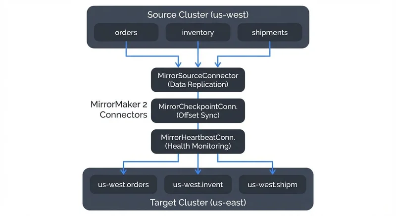
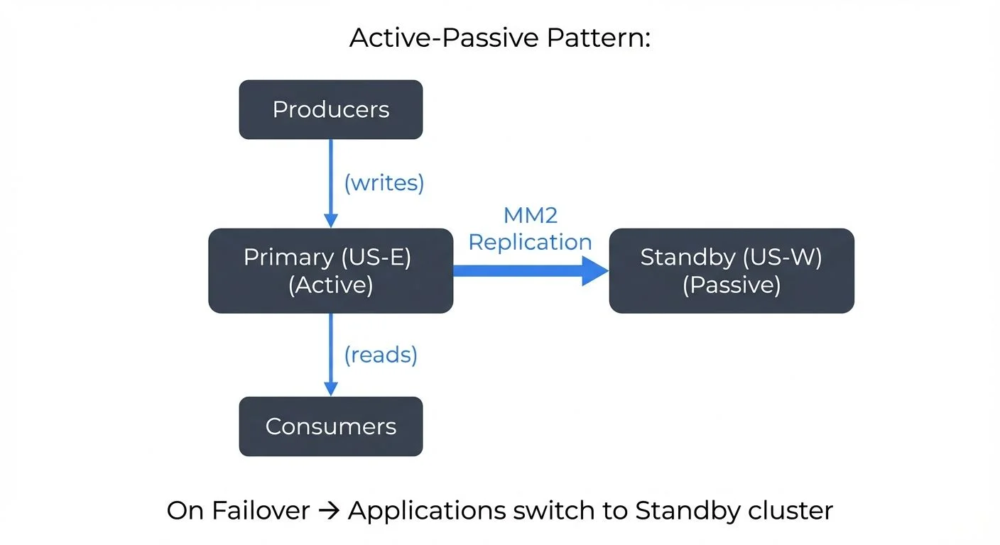

# Kafka MirrorMaker 2 for Cross-Cluster Replication

Modern data streaming architectures often span multiple Kafka clusters across different data centers, cloud regions, or even cloud providers. Organizations need robust solutions to replicate data between these clusters for disaster recovery, regulatory compliance, low-latency regional access, and data aggregation. Kafka MirrorMaker 2 (MM2) is the Apache Kafka project's solution for reliable, scalable cross-cluster replication. For comprehensive disaster recovery planning beyond cross-cluster replication, see [Disaster Recovery Strategies for Kafka Clusters](disaster-recovery-strategies-for-kafka-clusters.md).

## What is Kafka MirrorMaker 2

MirrorMaker 2 is a Kafka Connect-based replication tool that copies data between Apache Kafka clusters. It serves as the successor to the original MirrorMaker (now called MirrorMaker 1), addressing several critical limitations of its predecessor.

While MirrorMaker 1 was a simple consumer-producer pair that could replicate topic data, it lacked essential features for production use. MM2 introduces significant improvements including automatic topic creation, consumer group offset synchronization, access control list (ACL) replication, and exactly-once semantics support. These enhancements make MM2 suitable for enterprise-grade replication scenarios where data consistency and operational simplicity matter.

MM2 was introduced in Apache Kafka 2.4 through KIP-382 and has become the recommended approach for cross-cluster replication. It leverages the Kafka Connect framework, which means it benefits from Connect's scalability, fault tolerance, and operational characteristics.

**Modern Deployment with Kafka 4.0+ and KRaft**: As of Kafka 4.0 and later, MirrorMaker 2 runs seamlessly on KRaft-based clusters (Kafka's consensus protocol that replaced ZooKeeper). KRaft simplifies operations by eliminating ZooKeeper dependencies, reducing operational complexity and improving cluster startup times. When deploying MM2 with KRaft clusters, the connectors interact with cluster metadata through the KRaft controller layer, maintaining the same replication semantics while benefiting from KRaft's improved metadata management and faster failover capabilities. For organizations migrating from ZooKeeper-based Kafka, MM2 can replicate between mixed environments, making it valuable during transitions. For details on KRaft architecture, see [Understanding KRaft Mode in Kafka](understanding-kraft-mode-in-kafka.md).

## Architecture and Components

MirrorMaker 2 consists of three main connector types that work together to provide comprehensive replication:



<!-- ORIGINAL_DIAGRAM
```
┌─────────────────────────────────────────────────────────────────────┐
│                        Source Cluster (us-west)                     │
│  ┌───────────┐  ┌───────────┐  ┌───────────┐                       │
│  │  orders   │  │ inventory │  │ shipments │                       │
│  └─────┬─────┘  └─────┬─────┘  └─────┬─────┘                       │
└────────┼──────────────┼──────────────┼─────────────────────────────┘
         │              │              │
         │              │              │  MirrorMaker 2 Connectors
         ▼              ▼              ▼  ┌────────────────────────┐
    ┌────────────────────────────────────┤ MirrorSourceConnector  │
    │                                    │ (Data Replication)     │
    │  ┌─────────────────────────────────┤ MirrorCheckpointConn.  │
    │  │                                 │ (Offset Sync)          │
    │  │  ┌──────────────────────────────┤ MirrorHeartbeatConn.   │
    │  │  │                              │ (Health Monitoring)    │
    ▼  ▼  ▼                              └────────────────────────┘
┌─────────────────────────────────────────────────────────────────────┐
│                       Target Cluster (us-east)                      │
│  ┌──────────────┐  ┌──────────────┐  ┌──────────────┐             │
│  │us-west.orders│  │us-west.invent│  │us-west.shipm │             │
│  └──────────────┘  └──────────────┘  └──────────────┘             │
└─────────────────────────────────────────────────────────────────────┘
```
-->

**MirrorSourceConnector** handles the core data replication task. It consumes records from topics in the source cluster and produces them to corresponding topics in the target cluster. The connector preserves message keys, values, headers, and timestamps, ensuring data fidelity across clusters.

**MirrorCheckpointConnector** synchronizes consumer group offsets between clusters. This is crucial for disaster recovery scenarios where applications need to fail over from one cluster to another. By tracking which offsets have been replicated, the checkpoint connector enables applications to resume consumption from the correct position after a failover.

Understanding how offset translation works is essential for successful failover. When MM2 replicates messages from the source cluster, the target cluster assigns new offsets to these messages (starting from 0 for new topics). The checkpoint connector maintains a mapping between source offsets and target offsets. For example, if a consumer has read up to offset 1000 in the source cluster's `orders` topic, the checkpoint connector calculates the equivalent offset in the target cluster's `us-west.orders` topic (perhaps offset 1000 maps to target offset 998 if two messages failed replication). This translation is stored in the `*.checkpoints.internal` topic on the target cluster. During failover, consumers can query this mapping to determine where to start reading in the target cluster, ensuring continuity without message loss or duplication. For more on consumer offset management, see [Kafka Consumer Groups Explained](kafka-consumer-groups-explained.md).

**MirrorHeartbeatConnector** monitors replication health by emitting heartbeat messages. These heartbeats help track replication lag and detect connectivity issues between clusters.

All three connectors run within the Kafka Connect framework, either in standalone mode for simple setups or distributed mode for production deployments. The distributed mode provides fault tolerance and horizontal scaling, allowing MM2 to handle high-throughput replication across large Kafka deployments. For detailed coverage of Kafka Connect architecture and building integration pipelines, see [Kafka Connect: Building Data Integration Pipelines](kafka-connect-building-data-integration-pipelines.md).

One notable aspect of MM2's design is its topic naming convention. By default, replicated topics are prefixed with the source cluster name. For example, a topic named `orders` in a cluster designated as `us-west` would appear as `us-west.orders` in the target cluster. This naming pattern prevents conflicts and makes the data lineage clear, though it can be customized if needed.

## Replication Patterns and Use Cases

MirrorMaker 2 supports several replication patterns, each suited to different business and technical requirements:

**Active-Passive Replication** is the most common pattern for disaster recovery. A primary cluster handles all production traffic while MM2 continuously replicates data to a secondary cluster in a different region or availability zone. If the primary cluster fails, applications can fail over to the secondary cluster. The checkpoint connector ensures that consumers can resume from the correct offset, minimizing data loss and duplication. For broader disaster recovery strategies including RTO/RPO planning and backup mechanisms, see [Disaster Recovery Strategies for Kafka Clusters](disaster-recovery-strategies-for-kafka-clusters.md).



<!-- ORIGINAL_DIAGRAM
```
Active-Passive Pattern:

  ┌──────────────┐
  │ Producers    │
  └──────┬───────┘
         │ (writes)
         ▼
  ┌─────────────────┐                  ┌─────────────────┐
  │  Primary (US-E) │────MM2──────────▶│  Standby (US-W) │
  │  (Active)       │  Replication     │  (Passive)      │
  └────────┬────────┘                  └─────────────────┘
           │
           │ (reads)
           ▼
  ┌──────────────┐
  │  Consumers   │
  └──────────────┘

  On Failover →  Applications switch to Standby cluster
```
-->

For example, a financial services company might run its primary Kafka cluster in US-East with active replication to a standby cluster in US-West. If the US-East data center experiences an outage, trading applications can quickly switch to the US-West cluster using the synchronized consumer offsets.

**Active-Active Replication** involves bidirectional replication where multiple clusters both produce and consume data. This pattern supports multi-region deployments where applications in different geographies need low-latency access to data. However, active-active replication requires careful handling of potential data conflicts and cycles in the replication topology.

Understanding cycle detection and conflict resolution is critical for active-active patterns. When you configure bidirectional replication (Cluster A → Cluster B and Cluster B → Cluster A), MM2 must prevent infinite replication loops where messages bounce back and forth between clusters indefinitely. MM2 handles this through header-based cycle detection: when replicating a message, the MirrorSourceConnector adds a header indicating the source cluster. Before replicating, MM2 checks message headers to detect if a message originated from the target cluster—if so, it's skipped to break the cycle.

However, cycle detection doesn't solve application-level conflicts. Consider this scenario: An order-processing application in US-East updates order ID 12345 to status "SHIPPED", while simultaneously an application in US-West updates the same order to "CANCELLED". Both updates get replicated bidirectionally, but which update wins? MM2 doesn't provide conflict resolution—it replicates both updates in the order they arrive. Applications must implement their own conflict resolution strategies:

- **Timestamp-based resolution**: Use message timestamps to keep the latest update
- **Application-level versioning**: Include version numbers in messages and apply optimistic locking
- **Regional authority**: Designate specific clusters as authoritative for certain data domains
- **Last-writer-wins with CRDTs**: Use Conflict-free Replicated Data Types for commutative operations

For critical use cases requiring active-active with strong consistency, consider application-level distributed coordination (like etcd or Consul) or single-region writes with cross-region reads.

**Hub-and-Spoke Aggregation** centralizes data from multiple regional or edge clusters into a central cluster for analytics, reporting, or cross-regional data access. For instance, a global retail company might replicate sales data from clusters in different countries to a central data hub for enterprise-wide analytics.

**Fan-Out Distribution** does the opposite, replicating data from a central cluster to multiple regional clusters. This pattern works well for distributing reference data, configuration updates, or content that needs to be available locally in multiple regions.

## Configuration and Deployment

Deploying MirrorMaker 2 requires configuring source and target cluster connections, specifying which topics to replicate, and tuning performance parameters.

A basic MM2 configuration defines cluster aliases, connection details, and replication flows. Here's a simplified example:

```properties
clusters = source, target
source.bootstrap.servers = source-kafka:9092
target.bootstrap.servers = target-kafka:9092

source->target.enabled = true
source->target.topics = orders.*, inventory.*, shipments.*

replication.factor = 3
offset-syncs.topic.replication.factor = 3
checkpoints.topic.replication.factor = 3
```

This basic configuration establishes replication from the `source` cluster to the `target` cluster for all topics matching the patterns `orders.*`, `inventory.*`, and `shipments.*`. The replication factor settings ensure that MM2's internal topics are properly replicated for fault tolerance.

**Production Configuration with Security and Exactly-Once Semantics**: For enterprise deployments, a comprehensive configuration includes authentication, encryption, and transactional guarantees:

```properties
# Cluster definitions
clusters = source, target

# Source cluster configuration (KRaft-based Kafka 4.0+)
source.bootstrap.servers = source-kafka-1:9093,source-kafka-2:9093,source-kafka-3:9093
source.security.protocol = SASL_SSL
source.sasl.mechanism = SCRAM-SHA-512
source.sasl.jaas.config = org.apache.kafka.common.security.scram.ScramLoginModule required \
  username="mm2-source-user" \
  password="${file:/etc/mm2/source-password.txt:password}";
source.ssl.truststore.location = /etc/mm2/truststore.jks
source.ssl.truststore.password = ${file:/etc/mm2/truststore-password.txt:password}

# Target cluster configuration (KRaft-based Kafka 4.0+)
target.bootstrap.servers = target-kafka-1:9093,target-kafka-2:9093,target-kafka-3:9093
target.security.protocol = SASL_SSL
target.sasl.mechanism = SCRAM-SHA-512
target.sasl.jaas.config = org.apache.kafka.common.security.scram.ScramLoginModule required \
  username="mm2-target-user" \
  password="${file:/etc/mm2/target-password.txt:password}";
target.ssl.truststore.location = /etc/mm2/truststore.jks
target.ssl.truststore.password = ${file:/etc/mm2/truststore-password.txt:password}

# Replication flow configuration
source->target.enabled = true
source->target.topics = orders.*, inventory.*, shipments.*
source->target.groups = .*
source->target.topics.blacklist = .*[\-\.]internal, .*\.replica, __.*

# MirrorSourceConnector configuration
source->target.emit.checkpoints.enabled = true
source->target.emit.heartbeats.enabled = true
source->target.sync.topic.configs.enabled = true
source->target.sync.topic.acls.enabled = true

# Exactly-once semantics (Kafka 2.5+)
source->target.exactly.once.support = enabled
source->target.transaction.timeout.ms = 900000

# Performance tuning
tasks.max = 8
source->target.producer.compression.type = zstd
source->target.producer.batch.size = 32768
source->target.producer.linger.ms = 100
source->target.producer.buffer.memory = 67108864
source->target.consumer.max.poll.records = 2000
source->target.consumer.fetch.min.bytes = 1048576

# Internal topic configuration
replication.factor = 3
offset-syncs.topic.replication.factor = 3
checkpoints.topic.replication.factor = 3
heartbeats.topic.replication.factor = 3
config.storage.replication.factor = 3
offset.storage.replication.factor = 3
status.storage.replication.factor = 3

# Offset sync configuration
refresh.topics.interval.seconds = 60
sync.topic.configs.interval.seconds = 60
emit.checkpoints.interval.seconds = 30
emit.heartbeats.interval.seconds = 5

# Replication policy (use IdentityReplicationPolicy to avoid prefixes)
replication.policy.class = org.apache.kafka.connect.mirror.DefaultReplicationPolicy
replication.policy.separator = .
```

This production configuration demonstrates several critical features:

**Security**: Both clusters use SASL/SSL with SCRAM-SHA-512 authentication. Passwords are externalized using Kafka's configuration provider mechanism (the `${file:...}` syntax), preventing credential exposure. For detailed security configuration, see [Kafka Authentication: SASL, SSL, and OAuth](kafka-authentication-sasl-ssl-oauth.md).

**Exactly-Once Semantics**: Setting `exactly.once.support = enabled` activates transactional replication, ensuring that messages are replicated exactly once even during failures. This uses Kafka's transactional API under the hood, writing to the target cluster atomically. Note that exactly-once replication requires both clusters to support transactions (Kafka 2.5+) and adds some latency overhead due to transaction coordination.

**Performance Optimization**: The configuration uses zstd compression (superior compression ratios compared to gzip or snappy in Kafka 4.0+), increased batch sizes, and optimized fetch parameters. The `tasks.max = 8` setting allows parallel processing across partitions.

**Topic Filtering**: The blacklist pattern excludes internal Kafka topics and system topics from replication, preventing unnecessary overhead.

Key configuration considerations include topic filtering (using regex patterns), replication factor settings, security credentials (when clusters use authentication), and performance tuning parameters like buffer sizes and number of tasks. For high-throughput environments, increasing the number of tasks allows MM2 to parallelize replication across multiple partitions and topics.

MM2 can be deployed as a dedicated cluster or co-located with existing Kafka Connect infrastructure. Many organizations run MM2 on dedicated hardware close to the source cluster to minimize network latency and egress costs.

## Kubernetes Deployment

Modern organizations increasingly deploy MirrorMaker 2 on Kubernetes for better resource management, automated scaling, and declarative infrastructure. Kubernetes deployments offer advantages including pod-level isolation, horizontal scaling, health monitoring, and integration with cloud-native observability stacks.

**Deploying MM2 with Strimzi Operator**: The Strimzi Kafka Operator provides Kubernetes-native support for running both Kafka clusters and Kafka Connect (which powers MM2) as custom resources. For comprehensive Strimzi guidance, see [Strimzi Kafka Operator for Kubernetes](strimzi-kafka-operator-for-kubernetes.md).

Here's a Kubernetes manifest for deploying MM2 using Strimzi:

```yaml
apiVersion: kafka.strimzi.io/v1beta2
kind: KafkaMirrorMaker2
metadata:
  name: mm2-cluster
  namespace: kafka
spec:
  version: 3.8.0
  replicas: 3
  connectCluster: "target"

  clusters:
  - alias: "source"
    bootstrapServers: source-kafka-bootstrap.source-ns:9093
    config:
      config.storage.replication.factor: 3
      offset.storage.replication.factor: 3
      status.storage.replication.factor: 3
    tls:
      trustedCertificates:
      - secretName: source-cluster-ca-cert
        certificate: ca.crt
    authentication:
      type: tls
      certificateAndKey:
        secretName: source-mm2-credentials
        certificate: user.crt
        key: user.key

  - alias: "target"
    bootstrapServers: target-kafka-bootstrap.kafka:9093
    config:
      config.storage.replication.factor: 3
      offset.storage.replication.factor: 3
      status.storage.replication.factor: 3
      ssl.cipher.suites: "TLS_AES_256_GCM_SHA384"
      ssl.enabled.protocols: "TLSv1.3"
      ssl.protocol: "TLSv1.3"
    tls:
      trustedCertificates:
      - secretName: target-cluster-ca-cert
        certificate: ca.crt
    authentication:
      type: tls
      certificateAndKey:
        secretName: target-mm2-credentials
        certificate: user.crt
        key: user.key

  mirrors:
  - sourceCluster: "source"
    targetCluster: "target"
    sourceConnector:
      tasksMax: 8
      config:
        replication.factor: 3
        offset-syncs.topic.replication.factor: 3
        sync.topic.acls.enabled: "true"
        sync.topic.configs.enabled: "true"
        replication.policy.class: "org.apache.kafka.connect.mirror.IdentityReplicationPolicy"
        refresh.topics.interval.seconds: 60
    checkpointConnector:
      tasksMax: 4
      config:
        checkpoints.topic.replication.factor: 3
        sync.group.offsets.enabled: "true"
        emit.checkpoints.interval.seconds: 30
    heartbeatConnector:
      tasksMax: 1
      config:
        heartbeats.topic.replication.factor: 3
    topicsPattern: "orders.*|inventory.*|shipments.*"
    groupsPattern: ".*"

  resources:
    requests:
      memory: 4Gi
      cpu: 2000m
    limits:
      memory: 8Gi
      cpu: 4000m

  metricsConfig:
    type: jmxPrometheusExporter
    valueFrom:
      configMapKeyRef:
        name: mm2-metrics-config
        key: metrics-config.yml

  template:
    pod:
      affinity:
        podAntiAffinity:
          requiredDuringSchedulingIgnoredDuringExecution:
          - labelSelector:
              matchExpressions:
              - key: app.kubernetes.io/name
                operator: In
                values:
                - kafka-mirror-maker2
            topologyKey: "kubernetes.io/hostname"
```

This configuration demonstrates several production best practices:

- **High availability**: 3 replicas with pod anti-affinity to distribute across nodes
- **Security**: TLS encryption and authentication for both clusters
- **Performance**: 8 source connector tasks for parallelism across partitions
- **Monitoring**: JMX Prometheus exporter integration for metrics
- **Resource management**: Appropriate CPU and memory limits
- **Topic synchronization**: ACL and configuration replication enabled

**Alternative Helm Deployment**: For organizations not using Strimzi, standard Kafka Connect Helm charts can deploy MM2. The Bitnami Kafka Connect Helm chart works well:

```bash
helm repo add bitnami https://charts.bitnami.com/bitnami

helm install mm2-connect bitnami/kafka \
  --set replicaCount=3 \
  --set mode=connect \
  --set connectConfig.connectorClass=org.apache.kafka.connect.mirror.MirrorSourceConnector
```

Then deploy MM2 connectors via the Connect REST API or Kubernetes ConfigMaps.

**Resource Sizing**: For Kubernetes deployments, size MM2 pods based on replication throughput:
- **Low throughput** (<100 MB/s): 2 CPU cores, 4GB RAM
- **Medium throughput** (100-500 MB/s): 4 CPU cores, 8GB RAM
- **High throughput** (>500 MB/s): 8+ CPU cores, 16GB+ RAM, consider vertical pod autoscaling

Monitor JVM heap usage and adjust memory limits accordingly. MM2 is memory-intensive when replicating high-partition-count topics.

## Monitoring and Operational Considerations

Effective monitoring is essential for maintaining healthy cross-cluster replication. The primary metric to track is replication lag, which measures how far behind the source cluster the target cluster has fallen. High replication lag can indicate network issues, insufficient MM2 capacity, or problems with the target cluster.

**Modern Observability with Prometheus and OpenMetrics**: While MM2 traditionally exposes metrics via JMX, modern deployments (especially on Kubernetes) increasingly use Prometheus-based monitoring. The JMX Prometheus Exporter (shown in the Kubernetes example above) converts JMX metrics to Prometheus format. Key metrics to monitor include:

```
# Replication lag metrics
kafka_connect_mirror_source_connector_record_age_ms{cluster="source", topic="orders"} > 10000
kafka_connect_mirror_source_connector_replication_latency_ms{cluster="source"} > 5000

# Throughput metrics
kafka_connect_mirror_source_connector_byte_rate{cluster="source"}
kafka_connect_mirror_source_connector_record_count{cluster="source"}

# Error metrics
kafka_connect_mirror_source_connector_failed_record_count{cluster="source"}
kafka_connect_task_error_total{connector="MirrorSourceConnector"}

# Checkpoint lag
kafka_connect_mirror_checkpoint_connector_checkpoint_latency_ms > 30000
```

Set up Prometheus alerts for replication lag exceeding SLA thresholds (e.g., >60 seconds for real-time use cases) and failed record counts. For comprehensive Kafka monitoring patterns, see [Kafka Cluster Monitoring and Metrics](kafka-cluster-monitoring-and-metrics.md).

**Conduktor Platform for Multi-Cluster Management**: Conduktor provides enterprise-grade visibility and management capabilities specifically designed for multi-cluster Kafka environments. Conduktor's replication monitoring features include:

- **Cross-cluster topology visualization**: Visual maps showing replication flows between clusters, making it easy to understand data lineage and identify bottlenecks
- **Replication lag dashboards**: Real-time lag tracking with historical trends, alerting when lag exceeds configured thresholds
- **Consumer offset tracking**: View source and target offset mappings for failover planning
- **Configuration management**: Centralized interface for managing MM2 connector configurations across multiple environments
- **Topic comparison**: Compare topic configurations, partition counts, and data between source and target clusters
- **Governance and compliance**: Audit trails for replication changes and data movement tracking for regulatory requirements

For disaster recovery scenarios, Conduktor's failover simulation capabilities let teams validate that consumer offset translations work correctly before actual outages occur. This is invaluable for building confidence in your DR strategy.

**Operational Procedures and Failover**: Coordinating failover procedures requires careful planning. When failing over to a backup cluster, teams must ensure that consumer groups start from the correct offsets and that producers switch to the new cluster atomically to avoid data inconsistencies. A typical failover procedure includes:

1. **Detect primary cluster failure** through monitoring alerts
2. **Verify target cluster health** and replication lag (ideally <1 minute)
3. **Stop producers** writing to the primary cluster (or redirect via DNS/load balancer)
4. **Wait for replication to catch up** to minimize data loss
5. **Query checkpoint topic** to retrieve translated consumer offsets
6. **Reset consumer groups** to translated offsets on target cluster
7. **Start consumers** on target cluster
8. **Redirect producers** to target cluster
9. **Verify data flow** through both consumer and producer metrics

Automate this procedure where possible using orchestration tools (Kubernetes operators, Ansible playbooks) to reduce recovery time objectives (RTO).

**Operational Challenges**: Managing topic configuration drift between clusters, handling schema evolution, and coordinating failover procedures remain key challenges. When using Schema Registry, synchronize schemas between clusters using Schema Registry replication or backup/restore procedures. For schema management best practices, see [Schema Registry and Schema Management](schema-registry-and-schema-management.md). Topic configuration drift (different retention policies, partition counts, compression settings) can occur over time—regularly audit and reconcile configurations to prevent issues during failover. Understanding Kafka's built-in replication mechanisms helps optimize MM2 configurations; see [Kafka Replication and High Availability](kafka-replication-and-high-availability.md) for details.

**Network Bandwidth and Cost Optimization**: Replicating high-throughput topics across cloud regions can incur significant egress charges. Organizations should monitor bandwidth usage and consider:
- **Compression**: Use zstd compression (Kafka 4.0+) for superior compression ratios
- **Topic filtering**: Only replicate business-critical topics, exclude logs and debugging topics
- **Dedicated network links**: Use AWS Transit Gateway, Azure ExpressRoute, or GCP Interconnect for predictable costs
- **Strategic cluster placement**: Co-locate clusters in the same region when possible, use multi-AZ before multi-region
- **Batch vs. real-time**: Consider whether all topics need real-time replication or if hourly/daily batches suffice

For large-scale deployments, monitoring bandwidth consumption by topic helps identify cost optimization opportunities.

## MirrorMaker 2 in the Data Streaming Ecosystem

Cross-cluster replication is a foundational capability for building resilient real-time data streaming architectures. In modern streaming platforms, data flows continuously through Kafka topics, feeding stream processing applications built with Kafka Streams or Apache Flink, populating real-time dashboards, and triggering automated business processes.

When these streaming pipelines span multiple regions or require disaster recovery capabilities, MirrorMaker 2 becomes an essential component. It ensures that the streaming data infrastructure remains available even during regional outages, supports compliance requirements for data sovereignty, and enables global applications to access data with minimal latency.

MM2 integrates naturally with the broader Kafka ecosystem. Since it's built on Kafka Connect, it works alongside other connectors that move data in and out of Kafka. Stream processing applications can consume from replicated topics without modification, and schema registries can be synchronized using separate replication strategies to maintain compatibility across clusters.

For organizations running complex streaming platforms with multiple Kafka clusters, Connect clusters, stream processing applications, and data pipelines, managing the entire topology becomes challenging. This is where unified platform solutions can help by providing centralized visibility, governance, and operational controls across the distributed streaming infrastructure.

## Summary

Kafka MirrorMaker 2 provides enterprise-grade cross-cluster replication capabilities that are essential for modern data streaming architectures. Its Connect-based architecture, support for multiple replication patterns, and features like offset synchronization make it significantly more capable than its predecessor.

Whether implementing disaster recovery with active-passive replication, enabling global applications with active-active patterns, or aggregating data from distributed edge clusters, MM2 offers the flexibility and reliability needed for production deployments. Successful MM2 implementations require careful attention to configuration, monitoring, and operational procedures, particularly around failover scenarios.

As organizations continue to adopt multi-region, multi-cloud, and hybrid cloud architectures, tools like MirrorMaker 2 become increasingly important for maintaining data availability, consistency, and performance across distributed streaming platforms.

## Sources and References

1. [Apache Kafka Documentation - MirrorMaker 2.0](https://kafka.apache.org/documentation/#georeplication) - Official Apache Kafka documentation covering MM2 architecture and configuration
2. [KIP-382: MirrorMaker 2.0](https://cwiki.apache.org/confluence/display/KAFKA/KIP-382%3A+MirrorMaker+2.0) - Kafka Improvement Proposal that introduced MirrorMaker 2
3. [Kafka Connect Documentation](https://kafka.apache.org/documentation/#connect) - Framework documentation for understanding MM2's underlying architecture
4. [Apache Kafka Operations Guide](https://kafka.apache.org/documentation/#operations) - Operational best practices for monitoring and managing Kafka deployments
5. [Strimzi Kafka Operator Documentation](https://strimzi.io/docs/operators/latest/overview.html) - Kubernetes-native Kafka deployment including MirrorMaker 2 support
