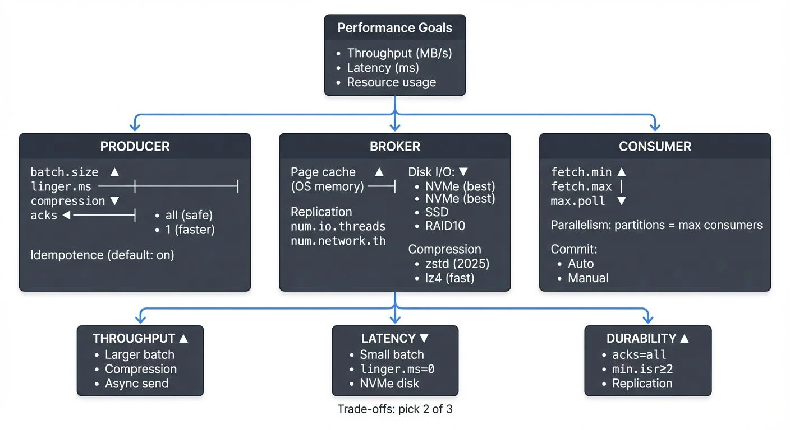

# Kafka Performance Tuning Guide

Apache Kafka has become the backbone of modern data streaming architectures, handling trillions of messages daily across organizations worldwide. However, achieving optimal performance requires careful tuning of producers, brokers, and consumers. A poorly configured Kafka cluster can suffer from high latency, low throughput, or resource exhaustion, while a well-tuned deployment can handle massive data volumes efficiently.

Modern Kafka deployments benefit from significant architectural improvements. Kafka 4.0+ with KRaft mode (removing ZooKeeper dependency) delivers 30-40% faster metadata operations and lower latency. Tiered storage enables cost-effective data retention by offloading cold data to object storage. Understanding these modern capabilities is essential for optimal performance in 2025.

This guide explores the key levers for optimizing Kafka performance, from producer batching to broker disk I/O, helping you build a high-performance streaming platform. For foundational understanding, see [Apache Kafka](https://conduktor.io/glossary/apache-kafka).



<!-- ORIGINAL_DIAGRAM
```
Kafka Performance Tuning: Key Areas

                    ┌─────────────────────┐
                    │  Performance Goals  │
                    │ • Throughput (MB/s) │
                    │ • Latency (ms)      │
                    │ • Resource usage    │
                    └──────────┬──────────┘
                               │
        ┌──────────────────────┼──────────────────────┐
        │                      │                      │
┌───────▼────────┐    ┌────────▼────────┐    ┌──────▼───────┐
│   PRODUCER     │    │    BROKER       │    │  CONSUMER    │
│                │    │                 │    │              │
│ batch.size ▲   │    │ Page cache ▲    │    │ fetch.min ▲  │
│ linger.ms ──┼──┤    │ (OS memory)─┼───┤    │ fetch.max │  │
│ compression ▼  │    │              │  │    │ max.poll  ▼  │
│ acks       ◄───┼────┤ Replication  │  │    │              │
│ • all (safe)   │    │ num.io.threads   │    │ Parallelism: │
│ • 1 (faster)   │    │ num.network.th   │    │ partitions = │
│                │    │              │  │    │ max consumers│
│ Idempotence    │    │ Disk I/O:    │  │    │              │
│ (default: on)  │    │ • NVMe (best)│  │    │ Commit:      │
│                │    │ • SSD        │  │    │ • Auto       │
└────────────────┘    │ • RAID10     ▼  │    │ • Manual     │
                      │              │  │    └──────────────┘
                      │ Compression  │  │
                      │ • zstd (2025)│  │
                      │ • lz4 (fast) │  │
                      └──────────────┘  │
                               │
        ┌──────────────────────┼──────────────────────┐
        │                      │                      │
┌───────▼────────┐    ┌────────▼────────┐    ┌──────▼───────┐
│ THROUGHPUT ▲   │    │ LATENCY ▼       │    │ DURABILITY ▲ │
│ • Larger batch │    │ • Small batch   │    │ • acks=all   │
│ • Compression  │    │ • linger.ms=0   │    │ • min.isr≥2  │
│ • Async send   │    │ • NVMe disk     │    │ • Replication│
└────────────────┘    └─────────────────┘    └──────────────┘
                      Trade-offs: pick 2 of 3
```
-->

## Understanding Kafka Performance Fundamentals

Kafka performance is measured across three primary dimensions: throughput (messages per second), latency (end-to-end message delivery time), and resource utilization (CPU, memory, disk, network). These metrics often involve trade-offs—maximizing throughput may increase latency, while reducing latency might require more resources.

The performance of a Kafka deployment depends on multiple components working together. Producers must efficiently batch and compress messages. Brokers need adequate memory for page cache (the OS-level cache that stores recently accessed data in RAM to avoid disk I/O), properly configured replication, and optimized disk I/O. Consumers must fetch data in appropriate batch sizes and parallelize processing effectively.

Understanding your workload characteristics is essential before tuning. Are you optimizing for real-time analytics with low latency requirements, or bulk data transfer where throughput matters most? Does your use case require strict ordering guarantees or can you parallelize consumption across partitions? The answers guide your configuration decisions.

**KRaft Mode Performance Benefits**: Since Kafka 3.0 and matured in 4.0+, KRaft mode eliminates ZooKeeper as an external dependency, managing metadata directly within Kafka brokers. This architectural change delivers measurable performance improvements: metadata operations are 30-40% faster, partition leader elections complete in milliseconds instead of seconds, and clusters scale to millions of partitions more efficiently. For detailed coverage, see [Understanding KRaft Mode in Kafka](https://conduktor.io/glossary/understanding-kraft-mode-in-kafka).

## Producer Performance Optimization

Producers are often the first point of optimization. The `batch.size` parameter controls how many bytes of data are batched before sending to Kafka. The default is 16KB, but increasing to 32KB or 64KB can significantly improve throughput for high-volume producers by reducing network overhead.

The `linger.ms` setting introduces a small delay before sending batches, allowing more messages to accumulate. Setting this to 10-100ms can dramatically increase batch sizes and throughput, with minimal latency impact for most use cases. For example, a producer sending 1000 messages per second might see throughput double with `linger.ms=20` while adding only 20ms of latency.

Compression reduces network bandwidth and broker disk usage. The `compression.type` parameter supports `gzip`, `snappy`, `lz4`, and `zstd`. In Kafka 3.0+, `zstd` is the recommended default, offering superior compression ratios (20-30% better than `lz4`) with improved CPU efficiency on modern hardware. For latency-sensitive workloads, `lz4` remains excellent for its minimal CPU overhead. Avoid `gzip` in 2025 deployments unless compatibility with legacy systems requires it. For serialization format selection and schema management, see [Message Serialization in Kafka](https://conduktor.io/glossary/message-serialization-in-kafka) and [Schema Registry and Schema Management](https://conduktor.io/glossary/schema-registry-and-schema-management).

The `acks` parameter controls durability versus throughput trade-offs. Setting `acks=1` requires acknowledgment from only the leader broker, offering higher throughput but risking data loss if the leader fails before replication. Using `acks=all` ensures all in-sync replicas (ISR—brokers fully caught up with the leader) acknowledge the write, providing maximum durability at the cost of higher latency. For non-critical data streams, `acks=1` can significantly boost performance.

**Producer Idempotence and Exactly-Once Semantics**: Since Kafka 3.0+, producer idempotence (`enable.idempotence=true`) is enabled by default, preventing duplicate messages from retries with minimal performance overhead (typically 1-3% throughput reduction). For transactional guarantees, configure `transactional.id` to enable exactly-once semantics. For detailed producer patterns, see [Kafka Producers](https://conduktor.io/glossary/kafka-producers).

## Broker Configuration Tuning

Broker performance heavily depends on memory allocation for the operating system page cache. Kafka relies on the OS to cache recently written and frequently read data in RAM, avoiding expensive disk reads. Allocate at least 50% of server memory to page cache (outside the JVM heap) for optimal performance.

**JVM and Garbage Collection Tuning**: Configure broker JVM heap between 5-8GB (more rarely improves performance and can increase GC pauses). In Kafka 4.0+ deployments, use G1GC as the default garbage collector with `-XX:+UseG1GC -XX:MaxGCPauseMillis=20 -XX:InitiatingHeapOccupancyPercent=35`. For ultra-low latency requirements, consider ZGC (`-XX:+UseZGC`) available in modern JVMs, which maintains sub-10ms pause times even under heavy load.

The `num.replica.fetchers` parameter controls how many threads fetch replication data from leader brokers. Increasing from the default of 1 to 4-8 can improve replication throughput in clusters with high partition counts or cross-datacenter replication. For detailed replication architecture, see [Kafka Replication and High Availability](https://conduktor.io/glossary/kafka-replication-and-high-availability).

Log segment configuration affects both write performance and retention management. The `log.segment.bytes` parameter defaults to 1GB. Smaller segments (256MB) enable faster log compaction and deletion but create more files. Larger segments (2GB) reduce file system overhead but delay retention policy application. For log compaction strategies, see [Kafka Log Compaction Explained](https://conduktor.io/glossary/kafka-log-compaction-explained).

Thread pool sizing impacts concurrency. The `num.network.threads` parameter (default 3) handles network I/O, while `num.io.threads` (default 8) processes requests. For high-throughput clusters in 2025, increasing these to 8-12 and 16-24 respectively can reduce request queuing on modern multi-core hardware, though excessive threads cause context switching overhead.

**Tiered Storage for Cost-Effective Performance**: Kafka 3.6+ introduces tiered storage, enabling brokers to offload cold data to object storage (S3, Azure Blob, GCS) while keeping hot data locally. Configure `remote.log.storage.system.enable=true` and specify retention policies with `local.retention.ms` and `retention.ms`. This dramatically reduces local disk requirements—a cluster storing 100TB can operate with only 10TB of local storage while maintaining full data access. Tiered storage introduces minimal latency for historical data queries (50-200ms additional latency) while cutting storage costs by 70-80%. For detailed configuration, see [Tiered Storage in Kafka](https://conduktor.io/glossary/tiered-storage-in-kafka).

## Consumer Performance Optimization

Consumer throughput depends largely on `fetch.min.bytes` and `fetch.max.wait.ms`. Setting `fetch.min.bytes=100000` (100KB) ensures consumers wait for substantial data before fetching, reducing request overhead. The `fetch.max.wait.ms=500` parameter limits wait time, balancing latency and batch size.

Parallelism is critical for consumer performance. Kafka partitions enable parallel consumption—each partition is consumed by exactly one consumer in a group. If you have 12 partitions but only 3 consumers, increasing to 12 consumers can multiply throughput by 4x, assuming adequate processing capacity. For detailed consumer group mechanics, see [Kafka Consumer Groups Explained](https://conduktor.io/glossary/kafka-consumer-groups-explained).

The `max.poll.records` parameter controls how many records are returned in a single poll. The default of 500 works for many cases, but batch-oriented processing might benefit from increasing to 2000-5000, while latency-sensitive applications might reduce to 100-200.

Session timeouts and heartbeat intervals affect rebalance behavior (the process where consumers redistribute partition ownership). Setting `session.timeout.ms=30000` and `heartbeat.interval.ms=3000` provides stability for most workloads. Longer session timeouts tolerate temporary processing pauses but slow down failure detection, while shorter timeouts enable faster rebalancing at the risk of false positives (incorrectly marking healthy consumers as failed due to brief GC pauses or network delays).

**Consumer Lag Monitoring**: Track consumer lag (the difference between the latest produced message and the consumer's position) as the primary indicator of consumption performance. In Kafka 4.0+, the improved consumer protocol reduces rebalance times by 50-70%, minimizing disruption during scaling operations. Use tools like Kafka Lag Exporter for Prometheus integration or Conduktor for comprehensive lag visualization and alerting.

## Network and Infrastructure Optimization

Operating system tuning can significantly impact Kafka performance. Increasing TCP socket buffer sizes improves network throughput. Setting `net.core.rmem_max` and `net.core.wmem_max` to 16MB or higher on Linux allows Kafka to utilize larger buffers for high-bandwidth connections.

Disk I/O configuration matters enormously. Kafka performs primarily sequential writes, making it well-suited to both SSDs and properly configured HDDs. Modern deployments (2025) increasingly use NVMe SSDs, delivering 3-5x better throughput and lower latency than SATA SSDs. RAID 10 offers good performance for HDDs with redundancy, while JBOD (Just a Bunch of Disks) configurations work well for Kafka since it handles replication at the application level, eliminating the need for hardware-level redundancy.

File system selection affects performance and reliability. XFS is generally recommended over ext4 for Kafka workloads due to better performance with large files and more efficient handling of concurrent writes. The `noatime` mount option eliminates unnecessary metadata updates, improving write performance by 5-10%.

Network topology impacts latency and bandwidth. Modern Kafka clusters benefit from high-bandwidth networking—25Gbps or 100Gbps in large deployments—minimizing bottlenecks during peak traffic. Cross-datacenter replication benefits from dedicated network links and careful tuning of `replica.lag.time.max.ms` to account for network latency. For multi-region deployments, see [Kafka MirrorMaker 2 for Cross-Cluster Replication](https://conduktor.io/glossary/kafka-mirrormaker-2-for-cross-cluster-replication).

## Monitoring and Measuring Performance

Effective performance tuning requires comprehensive monitoring. Key broker metrics include request latency percentiles (p50, p95, p99), bytes in/out rates, under-replicated partitions, and ISR shrink rate (indicating replication lag). Producer metrics like batch size average, compression ratio, and request latency reveal batching effectiveness. Consumer lag is the critical metric for consumption performance.

**Modern Monitoring Approaches**: In 2025, Kafka monitoring leverages multiple tools and approaches:

- **Native Kafka Metrics**: Kafka 4.0+ includes improved metrics exposure via JMX and native OpenTelemetry support, enabling seamless integration with modern observability platforms
- **Prometheus and Grafana**: JMX exporters expose Kafka metrics to Prometheus, with Grafana dashboards visualizing performance trends
- **Conduktor Platform**: Purpose-built for Kafka, Conduktor provides specialized monitoring with pre-built dashboards for performance metrics, configuration drift detection, cluster health visualization, and performance bottleneck identification
- **Conduktor Gateway**: For performance testing and chaos engineering, Conduktor Gateway acts as a proxy layer enabling sophisticated testing scenarios like network delay injection, partition throttling, and failure simulation

For comprehensive cluster monitoring strategies, see [Kafka Cluster Monitoring and Metrics](https://conduktor.io/glossary/kafka-cluster-monitoring-and-metrics).

Load testing validates tuning changes. Tools like `kafka-producer-perf-test` and `kafka-consumer-perf-test` generate synthetic workloads to measure throughput and latency under controlled conditions. Testing different configurations helps identify optimal settings for your specific hardware and workload. Conduktor Gateway enables advanced performance testing scenarios including chaos engineering experiments to validate performance under degraded conditions.

Profiling real workloads provides insights that synthetic tests cannot. Analyzing actual producer batching behavior, broker request queue times, and consumer processing rates reveals where bottlenecks occur in production scenarios.

## Common Performance Scenarios

Consider an e-commerce platform processing clickstream events. Initially, producers send each click individually with `acks=all`, achieving only 5,000 messages per second with 50ms latency. By implementing `batch.size=32768`, `linger.ms=10`, `compression.type=lz4`, and `acks=1` (acceptable for analytics data), throughput increases to 25,000 messages per second with latency under 20ms.

Another common scenario involves consumer lag during traffic spikes. A trading platform processes market data through 24 partitions but runs only 8 consumer instances. During high-volume periods, lag grows to millions of messages. Scaling to 24 consumers eliminates the bottleneck, and tuning `fetch.min.bytes=50000` reduces network overhead, bringing lag back to near-zero even during peaks.

Over-replication can also degrade performance. A small development cluster configured with `replication.factor=3` across only 3 brokers experiences poor write performance due to network saturation from replication traffic. Reducing to `replication.factor=2` for non-critical topics frees bandwidth and improves throughput by 40%. For comprehensive topic configuration guidance, see [Kafka Topic Design Guidelines](https://conduktor.io/glossary/kafka-topic-design-guidelines) and [Kafka Topics, Partitions, Brokers: Core Architecture](https://conduktor.io/glossary/kafka-topics-partitions-brokers-core-architecture).

## Performance Tuning Quick Reference

For common performance scenarios, start with these tuning priorities:

**High Throughput (Batch Processing)**:
- Increase `batch.size` to 64KB-128KB
- Set `linger.ms` to 50-100ms
- Use `compression.type=zstd`
- Enable tiered storage for long retention
- Scale consumers to match partition count

**Low Latency (Real-Time Processing)**:
- Reduce `batch.size` to 8KB-16KB
- Set `linger.ms` to 0-5ms
- Use `compression.type=lz4`
- Tune `fetch.min.bytes` to smaller values
- Deploy on NVMe storage with high-bandwidth networking

**Capacity Planning**: Performance tuning works hand-in-hand with capacity planning. For comprehensive guidance on sizing clusters and predicting resource requirements, see [Kafka Capacity Planning](https://conduktor.io/glossary/kafka-capacity-planning).

**Security Considerations**: Performance tuning must balance speed with security. Authentication (SASL, SSL, OAuth) and encryption (TLS) introduce overhead but are essential for production deployments. For guidance on minimizing security-related performance impact, see [Kafka Authentication: SASL, SSL, OAuth](https://conduktor.io/glossary/kafka-authentication-sasl-ssl-oauth) and [Kafka Security Best Practices](https://conduktor.io/glossary/kafka-security-best-practices).

## Summary

Kafka performance tuning is a multifaceted challenge requiring optimization across producers, brokers, consumers, and infrastructure. Producer tuning focuses on batching and compression to maximize throughput, while broker configuration emphasizes memory allocation, thread pools, and disk I/O. Consumer optimization centers on parallelism and fetch sizing.

Modern Kafka deployments (2025) benefit from architectural improvements including KRaft mode for faster metadata operations, tiered storage for cost-effective retention, and enhanced monitoring capabilities. Understanding these 2025 features is essential for building high-performance streaming platforms.

The key to successful tuning is understanding your workload requirements, measuring current performance comprehensively, making incremental changes, and validating results through monitoring and load testing. There is no one-size-fits-all configuration—optimal settings depend on your specific use case, hardware, and performance goals.

By systematically applying these tuning strategies and continuously monitoring your Kafka deployment, you can build a high-performance streaming platform capable of handling demanding real-time data workloads.

## Related Concepts

- [Kafka Capacity Planning](https://conduktor.io/glossary/kafka-capacity-planning) - Translate performance requirements into cluster sizing decisions and resource allocation strategies.
- [Kafka Cluster Monitoring and Metrics](https://conduktor.io/glossary/kafka-cluster-monitoring-and-metrics) - Establish monitoring to measure performance improvements and identify new bottlenecks.
- [Streaming Total Cost of Ownership](https://conduktor.io/glossary/streaming-total-cost-of-ownership) - Balance performance optimization with cost considerations across infrastructure, operations, and maintenance.

## Sources and References

1. Apache Kafka Documentation - "Performance Tuning": https://kafka.apache.org/documentation/#performance
2. Confluent - "Kafka Performance Tuning Guide": https://docs.confluent.io/platform/current/kafka/deployment.html#performance-tuning
3. Jun Rao (LinkedIn) - "How to choose the number of topics/partitions in a Kafka cluster": https://www.confluent.io/blog/how-choose-number-topics-partitions-kafka-cluster/
4. DataDog - "Monitoring Kafka performance metrics": https://www.datadoghq.com/blog/monitoring-kafka-performance-metrics/
5. Netflix Tech Blog - "Evolution of the Netflix Data Platform": https://netflixtechblog.com/evolution-of-the-netflix-data-pipeline-da246ca36905
