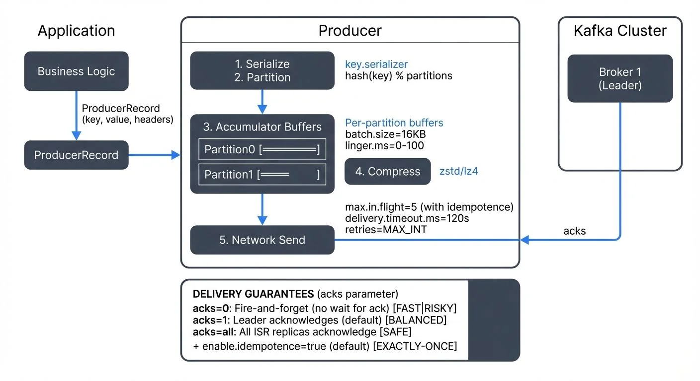

A Kafka producer sends records to a topic and routes each record to a partition. The client connects to brokers, fetches metadata, and batches writes for throughput. Producers control delivery policy, retries, compression, and partition choice, which sets latency, cost, and durability.


<!-- ORIGINAL_DIAGRAM
```
Kafka Producer: Record Journey

Application                     Producer                Kafka Cluster
────────────                    ────────                ─────────────

┌──────────┐                                         ┌─────────────┐
│ Business │                                         │   Broker 1  │
│  Logic   │                                         │  (Leader)   │
└────┬─────┘                                         └──────▲──────┘
     │ ProducerRecord                                       │ acks
     │ (key, value, headers)                                │
┌────▼─────────────────┐                                    │
│  KafkaProducer       │                                    │
│  ┌────────────────┐  │                                    │
│  │ 1. Serialize   │  │  key.serializer                    │
│  │ 2. Partition   │  │  hash(key) % partitions            │
│  └────────┬───────┘  │                                    │
│  ┌────────▼───────┐  │                                    │
│  │ 3. Accumulator │  │  Per-partition buffers             │
│  │    Buffers     │  │                                    │
│  │  ┌──────────┐  │  │  batch.size=16KB                   │
│  │  │Partition0│  │  │  linger.ms=0-100                   │
│  │  │[═══════] │  │  │                                    │
│  │  │Partition1│  │  │  ┌─────────────┐                   │
│  │  │[═══════] │  │  │  │4. Compress  │  zstd/lz4         │
│  │  └──────────┘  │  │  └─────────────┘                   │
│  └────────┬───────┘  │                                    │
│  ┌────────▼───────┐  │                                    │
│  │ 5. Network     │──┼────────────────────────────────────┘
│  │    Send        │  │  max.in.flight=5 (with idempotence)
│  │                │  │  delivery.timeout.ms=120s
│  └────────────────┘  │  retries=MAX_INT
└──────────────────────┘

DELIVERY GUARANTEES (acks parameter):
┌────────────────────────────────────────────────────────────┐
│ acks=0: Fire-and-forget (no wait for ack)    [FAST|RISKY]│
│ acks=1: Leader acknowledges (default)        [BALANCED]  │
│ acks=all: All ISR replicas acknowledge       [SAFE]      │
│           + enable.idempotence=true (default) [EXACTLY-ONCE]
└────────────────────────────────────────────────────────────┘
```
-->

## What a Kafka Producer Does

### API notes

A record carries a topic, optional key, value, and optional headers. The `KafkaProducer` is thread safe, so one shared instance per process often works best. You can send asynchronously with a callback or call `Future.get()` for sync behavior. Set a clear `client.id`, since brokers expose it in logs and metrics and this speeds triage.

### Example: CLI quick start

```
kafka-console-producer --topic orders --bootstrap-server localhost:9092 \
  --property parse.key=true --property key.separator=:
```

Each `key:value` line becomes a keyed record.

## Setup and Serialization

Producers must serialize keys and values into bytes. A schema keeps changes safe across teams and time.

Pick a format and a registry. Avro, Protobuf, and JSON Schema pair well with a Schema Registry that stores versions and enforces compatibility. For detailed serialization guidance, see [Message Serialization in Kafka](https://conduktor.io/glossary/message-serialization-in-kafka) and [Schema Registry and Schema Management](https://conduktor.io/glossary/schema-registry-and-schema-management).

Key properties:

* `bootstrap.servers` for initial brokers.
* `key.serializer` and `value.serializer` for encoding.
* `client.id` for traceability.
* `compression.type` to reduce bytes on the wire.
* `delivery.timeout.ms`, `request.timeout.ms`, and `retries` for retry policy.

### Example: Java producer with Avro and callback

```java
Properties p = new Properties();
p.put("bootstrap.servers", "broker1:9092,broker2:9092");
p.put("key.serializer", "org.apache.kafka.common.serialization.StringSerializer");
p.put("value.serializer", "io.confluent.kafka.serializers.KafkaAvroSerializer");
p.put("schema.registry.url", "http://registry:8081");
p.put("client.id", "payments-prod-v1");
// Note: enable.idempotence=true is the default since Kafka 3.0+
p.put("acks", "all"); // Ensures durability with in-sync replicas

try (Producer<String, GenericRecord> producer = new KafkaProducer<>(p)) {
  ProducerRecord<String, GenericRecord> rec = new ProducerRecord<>("payments", "user-42", value);
  producer.send(rec, (md, ex) -> {
    if (ex != null) {
      // log error with client.id, topic, partition
    } else {
      // md.topic(), md.partition(), md.offset()
    }
  });
  producer.flush(); // optional if you close soon after
}
```

The try-with-resources block calls `close()`, which flushes in-flight records and releases resources.

## Delivery Guarantees and Acknowledgments

Delivery behavior depends on acks, retries, idempotence, and transactions.

* **At-most-once** sends do not retry. You can lose data on faults.
* **At-least-once** sends retry. You can see duplicates.
* **Exactly-once processing** uses idempotent producers and transactions with read-committed consumers to avoid both loss and duplicates in a pipeline.

Key settings:

* `acks=0` returns before storage. Lowest safety.
* `acks=1` waits for the leader write (default).
* `acks=all` waits for the leader and in-sync replicas. Use with topic `min.insync.replicas`. Required for exactly-once semantics.
* `enable.idempotence=true` (default since Kafka 3.0+) drops duplicates created by retries within a producer session. Enables Producer ID (PID) and sequence numbers per partition.
* Transactions use a stable `transactional.id`, `initTransactions`, `beginTransaction`, and `commitTransaction`, with consumers set to `isolation.level=read_committed`. Provides atomic multi-partition writes and exactly-once delivery.

### Transactional producer example

For exactly-once semantics across multiple partitions or topics:

```java
Properties p = new Properties();
p.put("bootstrap.servers", "broker1:9092");
p.put("transactional.id", "payment-processor-001"); // Stable unique ID
p.put("enable.idempotence", "true"); // Required (default since 3.0+)
p.put("acks", "all"); // Required for transactions

try (KafkaProducer<String, String> producer = new KafkaProducer<>(p)) {
  producer.initTransactions(); // One-time initialization

  try {
    producer.beginTransaction();
    producer.send(new ProducerRecord<>("orders", "order-123", orderJson));
    producer.send(new ProducerRecord<>("inventory", "item-456", inventoryUpdate));
    producer.commitTransaction(); // Atomic commit across both topics
  } catch (Exception e) {
    producer.abortTransaction(); // Rollback on failure
    throw e;
  }
}
```

Consumers must set `isolation.level=read_committed` to see only committed messages. The `transactional.id` ties the producer to a transaction coordinator; if the producer crashes, a new instance with the same ID can fence out the old one and continue.

### Error handling checklist

Treat these as retriable: `NOT_LEADER_FOR_PARTITION`, `NETWORK_EXCEPTION`, `UNKNOWN_TOPIC_OR_PARTITION`, `REQUEST_TIMED_OUT`. Treat these as non-retriable: `INVALID_CONFIG`, `TOPIC_AUTHORIZATION_FAILED`, `RECORD_TOO_LARGE`. Route non-retriable failures to a dead-letter topic or alert the team, then fix the cause. Handle `NotEnoughReplicas` on `acks=all` with `min.insync.replicas` by backing off or failing fast.

### Safe write profile (Kafka 3.0+ defaults)

Since Kafka 3.0, the following safe settings are enabled by default:

```properties
acks=1  # Change to acks=all for stronger durability
enable.idempotence=true  # Default since 3.0+
retries=2147483647  # Max int, effectively unlimited
max.in.flight.requests.per.connection=5  # Safe with idempotence
delivery.timeout.ms=120000  # 2 minutes
```

**For strongest durability**, explicitly set `acks=all` and ensure topic has `min.insync.replicas=2` or higher.

**For strict per-key ordering during retries**: With idempotence enabled (default), Kafka maintains partition order even with `max.in.flight.requests.per.connection=5`. Only set this to `1` if you observe out-of-order issues with older brokers or need absolute guarantees, accepting lower throughput.

## Keys, Partitions, and Ordering

Kafka guarantees order per partition per producer session. Your key choice decides partition placement and thus locality. For partition strategy details, see [Kafka Topics, Partitions, Brokers: Core Architecture](https://conduktor.io/glossary/kafka-topics-partitions-brokers-core-architecture).

Practical rules:

* Use a stable business key, for example `user_id` or `order_id`, to keep related events together.
* Records without keys use a sticky strategy that forms larger batches while spreading load.
* Hot keys can overload a single partition. Use a composite key, a salted hash for the hottest keys, or a custom partitioner.
* Increasing partition count changes key-to-partition mapping. Plan the change during low traffic and confirm ordering needs.

### Quick check for routing

Send a few `key:message` pairs with the console producer, then consume with partition info. You should see all records for a key in the same partition, in order.

## Batching, Backpressure, and Throughput Tuning

The producer batches per partition to improve throughput. Larger batches raise efficiency and compression ratio at some latency cost. For handling downstream slowness and flow control, see [Backpressure Handling in Streaming Systems](https://conduktor.io/glossary/backpressure-handling-in-streaming-systems).

Levers that matter:

* `batch.size` sets the target batch bytes (default 16384).
* `linger.ms` lets the client wait briefly to coalesce records. Values around 1 to 5 ms help throughput while keeping tail latency reasonable.
* `compression.type` trades CPU for bytes. **Zstd** (available since Kafka 2.1+) is recommended for new deployments in 2025, offering 20-30% better compression than gzip with comparable CPU usage. LZ4 works for speed with modest savings. Snappy is deprecated in favor of LZ4 or Zstd.
* `buffer.memory` bounds the client buffer (default 32MB). When full, `send()` blocks up to `max.block.ms` or throws.
* `max.request.size` (default 1MB) and broker `message.max.bytes` cap record size. Use chunking or external object storage for very large payloads.

Watch `record-send-rate`, `record-error-rate`, `request-latency-avg`, p95 or p99 latency, `compression-rate-avg`, average batch size, and `bufferpool-wait-ratio`. Rising retries, timeouts, or buffer waits point to broker load or network issues. Tune, then measure again.

### Modern producer monitoring (2025)

**Kafka 4.0+ improvements**: Kafka 4.0 runs on KRaft (no ZooKeeper), which improves producer metadata fetch times and reduces tail latencies. Enhanced producer metrics expose per-partition batch stats and compression ratios. For KRaft migration details, see [Understanding KRaft Mode in Kafka](https://conduktor.io/glossary/understanding-kraft-mode-in-kafka) and [ZooKeeper to KRaft Migration](https://conduktor.io/glossary/zookeeper-to-kraft-migration).

**Observability stack**: Use **Kafka Lag Exporter** with Prometheus to track producer throughput and errors. Export JMX metrics (`kafka.producer:*`) to Grafana dashboards. Monitor consumer lag to understand producer impact on downstream systems: [Consumer Lag Monitoring](https://conduktor.io/glossary/consumer-lag-monitoring). For commercial environments, **Conduktor** provides unified producer monitoring, real-time error tracking, schema validation, and governance across clusters. See [Conduktor's topic management](https://docs.conduktor.io/guide/manage-kafka/kafka-resources/topics) to view producer metrics, track message throughput, and inspect message content.

## Where It Fits in Streaming Architectures

Producers sit at the edge of a streaming stack and shape downstream state and cost.

Common placements:

* **Microservices** publish domain events that drive other services. See [Outbox Pattern for Reliable Event Publishing](https://conduktor.io/glossary/outbox-pattern-for-reliable-event-publishing) for safe event emission from databases.
* **CDC to Kafka** uses Debezium to read database logs and publish to topics. Stable schemas and keys reduce reprocess churn. See [What is Change Data Capture (CDC) Fundamentals](https://conduktor.io/glossary/what-is-change-data-capture-cdc-fundamentals).
* **Flink** jobs read topics and write results to Kafka with exactly-once sinks that coordinate with Kafka transactions. See [What is Apache Flink: Stateful Stream Processing](https://conduktor.io/glossary/what-is-apache-flink-stateful-stream-processing).
* **Kafka Streams** reads and writes topics inside the same process. Idempotent or transactional producers prevent duplicate outputs on recovery.
* **Kafka Connect** acts as a managed producer for databases and SaaS sources.
* **ETL to lakehouses** publishes to topics that hydrate Iceberg or Delta tables through sinks. See [Streaming to Lakehouse Tables](https://conduktor.io/glossary/streaming-to-lakehouse-tables).

Design notes:

* Pick keys that match downstream grouping, for example session joins on `session_id`.
* Use compatibility rules in the registry to protect consumers. See [Schema Evolution Best Practices](https://conduktor.io/glossary/schema-evolution-best-practices).
* If the pipeline needs end-to-end exactly-once, combine idempotent producers, transactions, and read-committed consumers. For deep dive, see [Kafka Transactions Deep Dive](https://conduktor.io/glossary/kafka-transactions-deep-dive).
* For headers usage (metadata, tracing, routing), see [Using Kafka Headers Effectively](https://conduktor.io/glossary/using-kafka-headers-effectively).

## Governance and Platform Support

The producer is the first gate for safety and reuse. Teams need clear controls on who can write, what shapes are allowed, and how changes get tracked.

What to enforce:

* **RBAC and ACLs** for write access, for example a service account with write to `orders-*`. See [Access Control for Streaming](https://conduktor.io/glossary/access-control-for-streaming) and [Kafka Security Best Practices](https://conduktor.io/glossary/kafka-security-best-practices).
* **Schema policy** for backward or full compatibility, required fields like `event_time` or `tenant_id`, and validation in CI.
* **Field protection** with masking or encryption on sensitive fields in transit or at a gateway. See [PII Detection and Handling in Event Streams](https://conduktor.io/glossary/pii-detection-and-handling-in-event-streams).
* **Quotas** per client ID to protect shared clusters. See [Quotas and Rate Limiting in Kafka](https://conduktor.io/glossary/quotas-and-rate-limiting-in-kafka).
* **Audit and lineage** that record who wrote, when, with which schema version, and how downstream tables or features depend on that topic. See [Audit Logging for Streaming Platforms](https://conduktor.io/glossary/audit-logging-for-streaming-platforms).
* **Standard producer libs** or config bundles to keep defaults consistent across teams.

### Platform support with Conduktor

**Conduktor** provides comprehensive producer governance and monitoring for Kafka clusters:

* **RBAC and access control**: Manage which service accounts can write to specific topics with fine-grained policies. Learn about [service accounts and ACL management](https://docs.conduktor.io/guide/manage-kafka/kafka-resources/service-accounts-acls) in Conduktor.
* **Schema validation**: Enforce schema compatibility rules before messages reach brokers, preventing breaking changes
* **Data masking**: Apply dynamic field-level masking on sensitive data (PII, credentials) at produce time using [Conduktor interceptors](https://docs.conduktor.io/guide/conduktor-concepts/interceptors)
* **Audit trail**: Track all produce operations with full lineage - who wrote what, when, and with which schema version
* **Monitoring**: Real-time dashboards showing producer throughput, error rates, latency, and authorization failures across clusters via [topic management](https://docs.conduktor.io/guide/manage-kafka/kafka-resources/topics)
* **Testing with Conduktor Gateway**: Inject chaos scenarios (latency, failures, broker outages) to test producer retry logic and resilience. For broader testing strategies, see [Testing Strategies for Streaming Applications](https://conduktor.io/glossary/testing-strategies-for-streaming-applications).
* **Impact analysis**: Visualize dependencies between producers, topics, schemas, and downstream consumers

This centralized approach keeps producer changes safe, traceable, and compliant at scale without requiring custom tooling.

## Related Concepts

- [Schema Registry and Schema Management](https://conduktor.io/glossary/schema-registry-and-schema-management) - Ensures producers write messages with validated, compatible schemas that consumers can reliably deserialize.
- [Exactly-Once Semantics in Kafka](https://conduktor.io/glossary/exactly-once-semantics-in-kafka) - Combines idempotent and transactional producers to achieve end-to-end exactly-once delivery guarantees.
- [Kafka Security Best Practices](https://conduktor.io/glossary/kafka-security-best-practices) - Critical for securing producer authentication, authorization, and data encryption in production environments.

## Summary

Producers turn domain events and CDC streams into durable topic data. Their settings for serialization, acks, retries, batching, and keys decide reliability, latency, and cost for the whole stack.

**Modern defaults (Kafka 3.0+)** include idempotent producers, making at-least-once delivery safe by default. **Kafka 4.0 with KRaft** improves metadata fetch performance and reduces tail latencies. For 2025 deployments, use **Zstd compression**, monitor with Kafka Lag Exporter and Prometheus, and enforce governance with platforms like **Conduktor**.

Streaming engines such as Flink and Kafka Streams depend on producer choices for correct joins, windows, and state. Teams reach stable results with schema-aware encoding, safe acks with idempotence (or transactions for exactly-once), tuned batching, and clear key strategy. Governance platforms add RBAC, schema policy, masking, audit, lineage, quotas, and shared defaults, which keeps producer changes safe and traceable at scale.

## Sources and References

* Apache Kafka documentation, Producer API and configuration: [https://kafka.apache.org/documentation/](https://kafka.apache.org/documentation/)
* Confluent documentation, Producer configs, idempotence, transactions, and exactly-once semantics: [https://docs.confluent.io/platform/current/clients/producer.html](https://docs.confluent.io/platform/current/clients/producer.html)
* Apache Flink documentation, Kafka connector and sinks: [https://nightlies.apache.org/flink/flink-docs-stable/docs/connectors/datastream/kafka/](https://nightlies.apache.org/flink/flink-docs-stable/docs/connectors/datastream/kafka/)
* Debezium documentation, Architecture and Kafka topics: [https://debezium.io/documentation/](https://debezium.io/documentation/)
* Kafka Improvement Proposals index, producer design background: [https://cwiki.apache.org/confluence/display/KAFKA/Kafka+Improvement+Proposals](https://cwiki.apache.org/confluence/display/KAFKA/Kafka+Improvement+Proposals)
](http://localhost:4321/articles/kafka-producers-sending-messages-to-topics)
