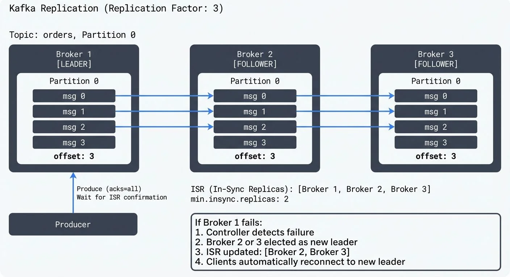

Apache Kafka has become the backbone of modern data streaming architectures, processing trillions of messages daily across organizations worldwide. At the core of Kafka's reliability lies its replication system, which ensures data durability and high availability even when hardware fails or network partitions occur.

Understanding how Kafka achieves fault tolerance is essential for anyone designing or operating production streaming platforms. This article explores the mechanics of Kafka replication, high availability features, and practical considerations for building resilient systems. For foundational Kafka concepts, see [Apache Kafka](https://conduktor.io/glossary/apache-kafka). To understand Kafka's modern architecture, refer to [Understanding KRaft Mode in Kafka](https://conduktor.io/glossary/understanding-kraft-mode-in-kafka).

## Understanding Kafka Replication

Kafka replication works by maintaining multiple copies of data across different brokers in a cluster. When you create a topic, you specify a replication factor that determines how many copies of each partition will exist. For detailed coverage of topics, partitions, and brokers, see [Kafka Topics, Partitions, Brokers: Core Architecture](https://conduktor.io/glossary/kafka-topics-partitions-brokers-core-architecture).

<!-- ORIGINAL_DIAGRAM
```
┌─────────────────────────────────────────────────────────────────┐
│          Kafka Replication (Replication Factor: 3)              │
├─────────────────────────────────────────────────────────────────┤
│                                                                   │
│  Topic: orders, Partition 0                                     │
│                                                                   │
│  ┌──────────────┐        ┌──────────────┐      ┌─────────────┐ │
│  │   Broker 1   │        │   Broker 2   │      │  Broker 3   │ │
│  │  [LEADER]    │        │  [FOLLOWER]  │      │ [FOLLOWER]  │ │
│  │              │        │              │      │             │ │
│  │  Partition 0 │        │  Partition 0 │      │ Partition 0 │ │
│  │  ┌────────┐  │        │  ┌────────┐  │      │ ┌────────┐  │ │
│  │  │ msg 0  │  │───────▶│  │ msg 0  │  │      │ │ msg 0  │  │ │
│  │  │ msg 1  │  │───────▶│  │ msg 1  │  │      │ │ msg 1  │  │ │
│  │  │ msg 2  │  │───────▶│  │ msg 2  │  │◀─────│ │ msg 2  │  │ │
│  │  │ msg 3  │  │        │  │ msg 3  │  │      │ │ msg 3  │  │ │
│  │  └────────┘  │        │  └────────┘  │      │ └────────┘  │ │
│  │   offset: 3  │        │   offset: 3  │      │  offset: 3  │ │
│  └──────▲───────┘        └──────────────┘      └─────────────┘ │
│         │                                                        │
│         │ Produce (acks=all)                                   │
│         │ Wait for ISR confirmation                             │
│  ┌──────┴───────┐                                               │
│  │   Producer   │                                               │
│  └──────────────┘                                               │
│                                                                   │
│  ISR (In-Sync Replicas): [Broker 1, Broker 2, Broker 3]        │
│  min.insync.replicas: 2                                         │
│                                                                   │
│  ┌─────────────────────────────────────────────────────────┐   │
│  │  If Broker 1 fails:                                     │   │
│  │  1. Controller detects failure                          │   │
│  │  2. Broker 2 or 3 elected as new leader                │   │
│  │  3. ISR updated: [Broker 2, Broker 3]                  │   │
│  │  4. Clients automatically reconnect to new leader      │   │
│  └─────────────────────────────────────────────────────────┘   │
│                                                                   │
└─────────────────────────────────────────────────────────────────┘
```
-->

For example, with a replication factor of 3, each partition has one leader and two followers. The leader handles all read and write requests, while followers continuously replicate data from the leader. If the leader fails, one of the followers automatically becomes the new leader.

This design provides fault tolerance without requiring complex coordination protocols during normal operations. Writers and readers only interact with the leader, which simplifies the programming model while maintaining strong consistency guarantees.

## In-Sync Replicas (ISR)

Not all replicas are equal in Kafka's replication model. The system maintains a critical concept called In-Sync Replicas (ISR), which determines which followers are fully caught up with the leader.

A follower is considered in-sync if it has fetched messages up to the leader's high watermark within a configurable time window (controlled by `replica.lag.time.max.ms`, typically 10 seconds). Only in-sync replicas are eligible to become leaders during failover.

The ISR mechanism balances durability and availability. When `min.insync.replicas` is set to 2 and a producer uses `acks=all`, Kafka guarantees that writes are acknowledged only after at least two replicas (including the leader) have received the data. This prevents data loss even if a broker fails immediately after acknowledging a write.

Consider a scenario with three brokers and a replication factor of 3. If one broker goes offline, the partition remains available as long as two replicas stay in-sync. However, if two brokers fail simultaneously, the partition becomes unavailable for writes when `min.insync.replicas=2`, preventing potential data loss.

## Automatic Failover and Recovery

Kafka's high availability capabilities shine during failure scenarios. When a broker fails, the cluster controller (one of the brokers in the KRaft quorum since Kafka 4.0+) detects the failure and triggers leader election for all partitions where the failed broker was the leader.

The controller selects a new leader from the ISR set, ensuring that no committed data is lost. Clients experience a brief interruption (typically a few seconds) while the election completes, but the system automatically recovers without manual intervention.

When the failed broker comes back online, it rejoins the cluster as a follower for its partitions. It catches up by replicating missing messages from the current leaders, eventually rejoining the ISR once fully synchronized.

### KRaft and Controller Quorum (Kafka 4.0+)

Starting with Kafka 4.0, the Apache Kafka project removed ZooKeeper dependency entirely, adopting KRaft (Kafka Raft) as the consensus protocol for cluster metadata management. This architectural shift significantly improves high availability characteristics.

In KRaft mode, controller nodes form a quorum using the Raft consensus algorithm. The controller quorum itself is replicated, typically across 3 or 5 nodes, ensuring that metadata operations (like leader elections) can continue even when controller nodes fail. This eliminates ZooKeeper as a potential single point of failure and reduces failover times.

**Key KRaft improvements for high availability:**
- **Faster Leader Elections**: Metadata changes propagate more quickly through the Raft log, reducing partition unavailability windows from seconds to milliseconds in many cases.
- **Controller Quorum Resilience**: With 3 controller nodes, the cluster tolerates 1 controller failure. With 5 controllers, it tolerates 2 failures while maintaining metadata availability.
- **Unified Storage Model**: Controllers store metadata in the same log-based format as regular Kafka topics, simplifying backup and disaster recovery procedures.
- **No External Dependencies**: Eliminating ZooKeeper reduces operational complexity and removes a potential failure domain from your architecture.

For production deployments, configure dedicated controller nodes separate from broker nodes to prevent resource contention. Use `controller.quorum.voters` to specify the controller quorum members and ensure they're distributed across failure domains (availability zones or racks).

```properties
# Example KRaft controller configuration (Kafka 4.0+)
process.roles=controller
node.id=1
controller.quorum.voters=1@controller-1:9093,2@controller-2:9093,3@controller-3:9093
controller.listener.names=CONTROLLER

# Distribute controllers across availability zones for resilience
broker.rack=us-east-1a  # Set appropriately for each controller node
```

### Unclean Leader Election

In extreme scenarios where all ISR members are unavailable, Kafka faces a choice: remain unavailable or elect a non-ISR replica as leader. This trade-off is controlled by `unclean.leader.election.enable`.

Setting this to `false` (recommended for most applications) prioritizes consistency over availability. The partition remains offline until an ISR member recovers. Setting it to `true` allows non-ISR replicas to become leaders, restoring availability but potentially losing committed messages.

## Configuration Best Practices

Proper configuration is crucial for achieving desired availability and durability guarantees. Here are key settings to consider:

**Replication Factor**: Use a minimum of 3 for production systems. This allows the system to tolerate one broker failure while maintaining redundancy. Critical data might warrant a replication factor of 5 or higher.

**min.insync.replicas**: Set to `replication_factor - 1` for balanced durability. With replication factor 3, use `min.insync.replicas=2`. This ensures writes are acknowledged by multiple replicas while allowing the system to tolerate one replica being temporarily unavailable.

**acks Configuration**: Producers should use `acks=all` for critical data, ensuring writes are replicated before acknowledgment. Use `acks=1` only for use cases where some data loss is acceptable in exchange for lower latency.

```java
// Producer configuration for high durability (Kafka 4.0+)
Properties props = new Properties();
props.put("bootstrap.servers", "broker1:9092,broker2:9092,broker3:9092");
props.put("key.serializer", "org.apache.kafka.common.serialization.StringSerializer");
props.put("value.serializer", "org.apache.kafka.common.serialization.StringSerializer");

// Critical settings for durability
props.put("acks", "all");  // Wait for all in-sync replicas
props.put("enable.idempotence", "true");  // Prevent duplicates
props.put("retries", Integer.MAX_VALUE);  // Retry failed sends
props.put("max.in.flight.requests.per.connection", "5");  // Kafka 3.0+ safe with idempotence

KafkaProducer<String, String> producer = new KafkaProducer<>(props);
```

For comprehensive producer configuration guidance, see [Kafka Producers](https://conduktor.io/glossary/kafka-producers).

**Rack Awareness**: Configure rack awareness (`broker.rack`) to ensure replicas are distributed across physical failure domains like availability zones or data centers. This protects against correlated failures from power outages or network issues.

```properties
# Broker configuration for rack awareness (Kafka 4.0+)
# broker-1.properties (in availability zone us-east-1a)
broker.id=1
broker.rack=us-east-1a

# broker-2.properties (in availability zone us-east-1b)
broker.id=2
broker.rack=us-east-1b

# broker-3.properties (in availability zone us-east-1c)
broker.id=3
broker.rack=us-east-1c
```

When rack awareness is enabled, Kafka's replica assignment algorithm ensures that replicas for each partition are distributed across different racks. With a replication factor of 3 and 3 availability zones, each zone hosts exactly one replica, protecting against entire zone failures.

**Replica Fetcher Configuration**: Modern Kafka (2.4+) supports reading from follower replicas in the same rack, reducing cross-AZ data transfer costs and improving read latency. Configure `replica.selector.class=org.apache.kafka.common.replica.RackAwareReplicaSelector` and set consumer `client.rack` to enable this feature.

```java
// Consumer configuration for rack-aware reads (Kafka 4.0+)
Properties consumerProps = new Properties();
consumerProps.put("bootstrap.servers", "broker1:9092,broker2:9092,broker3:9092");
consumerProps.put("group.id", "my-consumer-group");
consumerProps.put("client.rack", "us-east-1a");  // Consumer's rack/AZ
// Consumer will prefer reading from replicas in us-east-1a when available
```

## Monitoring and Troubleshooting

Effective monitoring is essential for maintaining high availability. Key metrics to track include:

**Under-replicated Partitions**: Tracks partitions where followers have fallen behind the leader. Monitor the JMX metric `kafka.server:type=ReplicaManager,name=UnderReplicatedPartitions`. Sustained under-replication suggests insufficient broker resources, network issues, or failing hardware. A value of 0 indicates healthy replication.

**Offline Partitions**: Partitions with no in-sync replicas represent actual unavailability and require immediate attention. Monitor `kafka.controller:type=KafkaController,name=OfflinePartitionsCount`. Any non-zero value indicates a production incident requiring immediate investigation.

**ISR Shrink/Expand Rate**: Frequent ISR changes indicate instability. Monitor `kafka.server:type=ReplicaManager,name=IsrShrinksPerSec` and `IsrExpandsPerSec`. Frequent shrinks/expands suggest resource contention, network problems, or GC pauses affecting replication.

**Replication Lag**: The offset difference between leaders and followers helps identify slow replicas before they fall out of ISR. Monitor `kafka.server:type=ReplicaFetcherManager,name=MaxLag,clientId=Replica`. High lag (>1000 messages) indicates performance issues.

**Controller Status**: In KRaft mode (Kafka 4.0+), monitor controller quorum health with `kafka.controller:type=KafkaController,name=ActiveControllerCount` (should be 1) and `kafka.server:type=raft-metrics,name=state` (should show "Leader" for active controller).

### Monitoring Tools and Setup

For production Kafka clusters, implement comprehensive monitoring using:

**Conduktor Platform**: Provides real-time visibility into replication metrics through visual dashboards, partition topology views, and alerting. Conduktor helps operators quickly identify under-replicated partitions, visualize rack distribution, and diagnose replication issues before they impact availability.

**JMX Exporters**: Use Prometheus JMX Exporter to expose Kafka metrics for time-series monitoring:

```yaml
# jmx_prometheus_exporter config for replication metrics (Kafka 4.0+)
lowercaseOutputName: true
rules:
  - pattern: kafka.server<type=ReplicaManager, name=(.+)><>(Value|Count)
    name: kafka_server_replicamanager_$1
  - pattern: kafka.controller<type=KafkaController, name=(.+)><>(Value|Count)
    name: kafka_controller_$1
  - pattern: kafka.server<type=ReplicaFetcherManager, name=MaxLag, clientId=(.+)><>Value
    name: kafka_server_replica_fetcher_max_lag
    labels:
      client_id: "$1"
```

**Open-Source Monitoring Tools**:
- **kafka-ui**: Lightweight web UI for monitoring Kafka clusters, including replication status
- **Redpanda Console** (open-source): Visual monitoring of topics, partitions, and consumer groups
- **Kafka Exporter**: Dedicated Prometheus exporter for Kafka lag and partition metrics

**Alerting Thresholds**: Configure alerts for:
- `OfflinePartitionsCount > 0` (critical - immediate response)
- `UnderReplicatedPartitions > 0` for >5 minutes (warning)
- `MaxLag > 10000` messages (warning - investigate broker performance)
- `IsrShrinksPerSec > 5` sustained rate (warning - cluster instability)

For comprehensive monitoring strategies, see [Consumer Lag Monitoring](https://conduktor.io/glossary/consumer-lag-monitoring). For Kubernetes deployments, refer to [Running Kafka on Kubernetes](https://conduktor.io/glossary/running-kafka-on-kubernetes) and [Strimzi Kafka Operator for Kubernetes](https://conduktor.io/glossary/strimzi-kafka-operator-for-kubernetes).

## Role in Data Streaming Platforms

Replication and high availability are foundational to building reliable data streaming platforms. Stream processing frameworks like Apache Flink, Kafka Streams, and ksqlDB depend on Kafka's durability guarantees to maintain processing state and ensure exactly-once semantics. For details on exactly-once semantics, see [Kafka Transactions Deep Dive](https://conduktor.io/glossary/kafka-transactions-deep-dive).

When a stream processor checkpoints its state to Kafka topics, replication ensures that state survives broker failures. This allows processors to recover and resume from the last checkpoint without data loss or duplicate processing.

### Multi-Datacenter Replication and Disaster Recovery

In multi-datacenter deployments, Apache Kafka's MirrorMaker 2 (MM2) extends replication across geographic regions, providing disaster recovery capabilities and enabling active-active architectures for global applications. Kafka 4.0+ includes performance improvements to MM2's replication streams and better handling of metadata synchronization.

**MirrorMaker 2 Features for High Availability**:
- **Active-Active Replication**: Bi-directional mirroring enables writes to multiple clusters with conflict resolution
- **Offset Translation**: Automatically maps consumer offsets between clusters for seamless failover
- **Topic Configuration Sync**: Replicates topic configurations, ACLs, and quotas across datacenters (see [Kafka Security Best Practices](https://conduktor.io/glossary/kafka-security-best-practices) for ACL design)
- **Exactly-Once Semantics**: Supports transactional producers for consistent cross-cluster replication

**Tiered Storage (Kafka 3.6+)**: Kafka's tiered storage feature offloads older log segments to object storage (S3, Azure Blob, GCS) while maintaining recent data on local disks. This reduces storage costs and improves recovery times by limiting the data that needs replication when brokers restart. While tiered storage doesn't replace replication for high availability, it complements it by reducing the cost of maintaining high replication factors for long retention periods. For detailed information, see [Tiered Storage in Kafka](https://conduktor.io/glossary/tiered-storage-in-kafka).

The combination of local replication for fault tolerance, cross-datacenter replication for disaster recovery, and tiered storage for cost-effective retention creates a comprehensive availability strategy. Organizations can achieve five-nines (99.999%) availability by carefully designing their replication topology and failover procedures.

## Related Concepts

- [Understanding KRaft Mode in Kafka](https://conduktor.io/glossary/understanding-kraft-mode-in-kafka) - KRaft's modern consensus protocol improves failover speed and simplifies high availability operations.
- [Kafka Cluster Monitoring and Metrics](https://conduktor.io/glossary/kafka-cluster-monitoring-and-metrics) - Essential monitoring strategies for tracking replication health and detecting availability issues.
- [Tiered Storage in Kafka](https://conduktor.io/glossary/tiered-storage-in-kafka) - Complements replication by providing cost-effective long-term retention while maintaining availability.

## Summary

Kafka's replication and high availability features provide the foundation for building reliable data streaming platforms. By maintaining multiple synchronized copies of data across brokers and automatically handling failover, Kafka ensures that systems can survive hardware failures and network issues without data loss.

The ISR mechanism, leader election process, and configurable durability settings give operators fine-grained control over the availability-consistency trade-offs. Proper configuration of replication factors, acknowledgment settings, and rack awareness ensures systems meet their reliability requirements. With Kafka 4.0+, the adoption of KRaft consensus eliminates ZooKeeper dependencies and significantly improves failover times and operational simplicity.

Effective monitoring of replication health metrics allows teams to identify and resolve issues proactively. Modern tools like Conduktor provide comprehensive visibility into replication status, partition distribution, and controller health. Combined with geographic replication strategies and tiered storage, these capabilities enable organizations to build streaming platforms that meet demanding availability and durability SLAs.

Understanding these concepts is essential for anyone working with Kafka in production environments, from platform engineers to application developers building event-driven architectures.

## Sources and References

1. Apache Kafka Documentation - "Replication" - Official documentation covering replication design and configuration: https://kafka.apache.org/documentation/#replication

2. Neha Narkhede, Gwen Shapira, Todd Palino - "Kafka: The Definitive Guide, 2nd Edition" (O'Reilly, 2021) - Comprehensive coverage of Kafka internals including replication mechanics

3. Jun Rao - "Intra-cluster Replication in Apache Kafka" (Confluent Blog) - Detailed explanation from Kafka's co-creator: https://www.confluent.io/blog/hands-free-kafka-replication-a-lesson-in-operational-simplicity/

4. Jay Kreps - "Benchmarking Apache Kafka: 2 Million Writes Per Second" (LinkedIn Engineering Blog) - Real-world insights into replication performance: https://engineering.linkedin.com/kafka/benchmarking-apache-kafka-2-million-writes-second-three-cheap-machines

5. Confluent Documentation - "Durability Guarantees" - Production best practices for configuring replication: https://docs.confluent.io/platform/current/kafka/design.html#durability-guarantees
