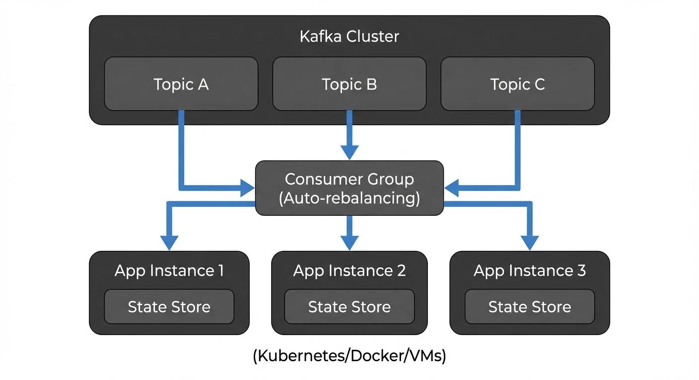
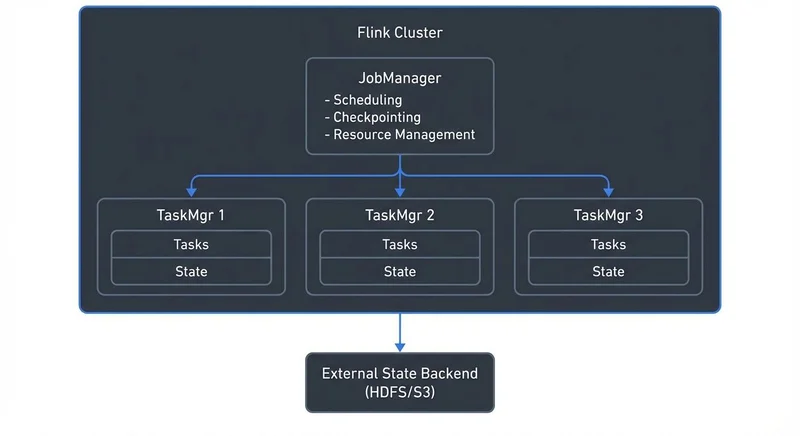

When building real-time data pipelines, two names dominate the conversation: Kafka Streams and Apache Flink. Both are mature, production-ready stream processing frameworks, but they take fundamentally different approaches to solving similar problems. Understanding these differences is crucial for choosing the right tool for your use case.

## What Are Kafka Streams and Apache Flink?

**Kafka Streams** is a client library for building stream processing applications that read from and write to Apache Kafka. Released in 2016 as part of Apache Kafka, it's designed to be lightweight and embedded directly into your Java or Scala applications. As of 2025, Kafka Streams 3.6+ provides mature stateful processing with improved RocksDB performance, enhanced error handling, and seamless integration with Kafka's KRaft mode (the ZooKeeper-free architecture). There's no separate cluster to manage—your application is the stream processor.

**Apache Flink** is a distributed stream processing framework with its own cluster runtime. Originally developed in academia and open-sourced in 2014, Flink provides a complete execution environment with advanced features for complex event processing, batch processing, and machine learning. Flink 1.19+ (current as of 2025) delivers significant improvements in checkpoint performance, unified SQL/Table API capabilities, and mature Python DataStream API support. Applications are submitted to a Flink cluster, which handles scheduling, fault tolerance, and resource management.

The fundamental difference: Kafka Streams is a library you embed in your application, while Flink is a framework that runs your application.

For in-depth coverage of each framework individually, see [What is Apache Flink? Stateful Stream Processing](https://conduktor.io/glossary/what-is-apache-flink-stateful-stream-processing) and [Introduction to Kafka Streams](https://conduktor.io/glossary/introduction-to-kafka-streams).

## Architecture and Design Philosophy

### Kafka Streams: The Library Approach

Kafka Streams applications are standard Java applications that happen to process streams. You package your application as a JAR file and deploy it like any other microservice. Scaling is horizontal—run more instances of your application, and Kafka Streams automatically redistributes the work based on Kafka partition assignments.

<!-- ORIGINAL_DIAGRAM
```
Kafka Streams Architecture:
┌────────────────────────────────────────┐
│  Kafka Cluster                         │
│  ┌──────┐ ┌──────┐ ┌──────┐           │
│  │Topic │ │Topic │ │Topic │           │
│  │  A   │ │  B   │ │  C   │           │
│  └───┬──┘ └───┬──┘ └───┬──┘           │
└──────┼────────┼────────┼───────────────┘
       │        │        │
    ┌──▼────────▼────────▼───┐
    │ Consumer Group         │
    │  (Auto-rebalancing)    │
    └──┬────────┬────────┬───┘
       │        │        │
┌──────▼──┐ ┌──▼─────┐ ┌▼────────┐
│ App     │ │ App    │ │ App     │
│Instance │ │Instance│ │Instance │
│ 1       │ │ 2      │ │ 3       │
│┌───────┐│ │┌──────┐│ │┌───────┐│
││State  ││ ││State ││ ││State  ││
││Store  ││ ││Store ││ ││Store  ││
│└───────┘│ │└──────┘│ │└───────┘│
└─────────┘ └────────┘ └─────────┘
 (Kubernetes/Docker/VMs)
```
-->

This architecture has significant implications. There's no separate cluster to operate, no JobManager or TaskManager to monitor. Your operations team uses the same tools they already know for deploying and monitoring Java applications. State is stored locally using RocksDB, with changelog topics in Kafka providing durability and recovery.

### Apache Flink: The Framework Approach

Flink provides a complete distributed runtime. You submit jobs to a Flink cluster, which consists of a JobManager (coordinator) and one or more TaskManagers (workers). The JobManager handles scheduling, checkpointing, and failure recovery, while TaskManagers execute the actual data processing tasks.

<!-- ORIGINAL_DIAGRAM
```
Apache Flink Architecture:
┌────────────────────────────────┐
│    Flink Cluster               │
│                                │
│  ┌──────────────────────────┐  │
│  │     JobManager           │  │
│  │  - Scheduling            │  │
│  │  - Checkpointing         │  │
│  │  - Resource Management   │  │
│  └───────────┬──────────────┘  │
│              │                 │
│     ┌────────┼────────┐        │
│     │        │        │        │
│  ┌──▼─────┐┌─▼──────┐┌▼──────┐│
│  │TaskMgr ││TaskMgr ││TaskMgr││
│  │   1    ││   2    ││   3   ││
│  │┌──────┐││┌──────┐││┌─────┐││
│  ││Tasks ││││Tasks ││││Tasks│││
│  ││State ││││State ││││State│││
│  │└──────┘││└──────┘││└─────┘││
│  └────────┘└────────┘└───────┘│
└────────────────────────────────┘
         │
         ▼
┌────────────────┐
│ External State │
│ Backend        │
│ (HDFS/S3)      │
└────────────────┘
```
-->

This architecture enables sophisticated features like dynamic resource allocation, savepoints for versioning application state, and unified batch and stream processing. However, it also means operating a separate cluster infrastructure with its own monitoring, scaling, and high availability requirements.

## Deployment and Operations

### Operational Complexity

Kafka Streams wins on operational simplicity. Deploy it as a standard application using Docker, Kubernetes (with operators like Strimzi), or traditional application servers. Scaling means starting more instances. Rolling updates are straightforward—just redeploy your application. With Kafka 4.0's KRaft mode (ZooKeeper-free architecture), the entire stack is simpler to operate. For detailed guidance on Kubernetes deployments, see [Running Kafka on Kubernetes](https://conduktor.io/glossary/running-kafka-on-kubernetes) and [Strimzi Kafka Operator for Kubernetes](https://conduktor.io/glossary/strimzi-kafka-operator-for-kubernetes). To understand KRaft mode, see [Understanding KRaft Mode in Kafka](https://conduktor.io/glossary/understanding-kraft-mode-in-kafka).

Flink requires cluster management. You need to provision JobManagers with high availability (using Kubernetes native HA since Flink 1.15+), manage TaskManager resources, and understand Flink-specific operational concepts like checkpoints and savepoints. The Flink Kubernetes Operator (officially supported as of 2025) significantly simplifies deployment and management on Kubernetes, providing automated lifecycle management, autoscaling, and upgrade capabilities. Cloud platforms like Amazon Managed Service for Apache Flink and Conduktor Gateway for development and testing help reduce operational burden, but there's inherently more infrastructure to manage than Kafka Streams.

For teams already running Kafka and familiar with microservices deployment, Kafka Streams fits naturally into existing workflows. Streaming management tools like Conduktor can enhance this by providing visibility into Kafka topic health through [topic management](https://docs.conduktor.io/guide/manage-kafka/kafka-resources/topics), consumer lag, and data quality—critical for monitoring Kafka Streams applications. For comprehensive monitoring strategies, see [Consumer Lag Monitoring](https://conduktor.io/glossary/consumer-lag-monitoring).

### State Management

Both frameworks support stateful processing with fault tolerance, but with different approaches and scale characteristics.

**Kafka Streams** uses local state stores backed by changelog topics in Kafka. State is partitioned alongside data, keeping related data and computation together on the same instance. When state changes, updates are written to both the local RocksDB store and a Kafka changelog topic. Recovery involves replaying the changelog topic to rebuild local state. This approach works well for moderate state sizes—typically up to 50-100GB per instance, though Kafka Streams 3.6+ improvements to RocksDB integration push these limits higher. The co-location of state and processing provides excellent locality and low-latency access.

**Flink** uses distributed snapshots (checkpoints) to external storage like S3, HDFS, or distributed filesystems. Checkpoints are coordinated across all parallel tasks, providing consistent global snapshots of the entire application state at specific points in time. Flink 1.19+ delivers significant checkpoint performance improvements, handling incremental and asynchronous snapshots efficiently. This architecture enables much larger state—terabytes or even petabytes across a cluster—and advanced features like savepoints (manual snapshots for application versioning, migration, or A/B testing). The tradeoff is added latency for checkpoint writes and dependency on external storage systems.

**Practical guidance**: If your state fits comfortably in 10s of GBs per partition and you value operational simplicity, Kafka Streams' local storage is efficient. For 100s of GBs to TBs of state, or when you need savepoint capabilities for zero-downtime upgrades, Flink's distributed state backend is the better choice.

For detailed implementation guidance on Kafka Streams state management, see [State Stores in Kafka Streams](https://conduktor.io/glossary/state-stores-in-kafka-streams).

## Feature Comparison

### Processing Capabilities

Both frameworks support core stream processing operations: filtering, mapping, aggregations, joins, and windowing. However, differences emerge in advanced scenarios.

**Windowing**: Both support tumbling (fixed, non-overlapping time windows), sliding (overlapping windows), and session windows (dynamic windows based on activity gaps). Flink additionally offers custom window logic with flexible trigger mechanisms and custom eviction policies, enabling sophisticated time-based analytics. For more on windowing patterns, see [Session Windows in Stream Processing](https://conduktor.io/glossary/session-windows-in-stream-processing) and [Windowing in Apache Flink: Tumbling, Sliding, and Session Windows](https://conduktor.io/glossary/windowing-in-apache-flink-tumbling-sliding-and-session-windows).

**Joins**: Kafka Streams excels at stream-table and stream-stream joins over Kafka topics, with strong consistency guarantees within Kafka's partitioning model. Flink supports similar joins plus more complex patterns like interval joins (joining events within a time range) and temporal table joins (joining with versioned lookup tables), useful for enrichment scenarios. For comprehensive coverage of join patterns, see [Stream Joins and Enrichment Patterns](https://conduktor.io/glossary/stream-joins-and-enrichment-patterns).

**Exactly-Once Semantics**: Both provide exactly-once processing guarantees, meaning each record is processed exactly one time even in the presence of failures—critical for financial transactions, billing, and audit scenarios. Kafka Streams achieves this through Kafka's native transaction support, ensuring atomic writes across multiple topics and state stores. Flink uses distributed checkpoints with two-phase commit protocol for external systems, coordinating state consistency across the entire job graph. For implementation details of Kafka transactions, see [Kafka Transactions Deep Dive](https://conduktor.io/glossary/kafka-transactions-deep-dive).

**Complex Event Processing (CEP)**: Flink's CEP library enables sophisticated pattern matching over event streams—detecting event sequences, timeouts, and complex conditions like "detect three failed login attempts within 5 minutes followed by a successful login from a different location." This is powerful for fraud detection, security monitoring, and business process tracking. Kafka Streams handles simpler patterns through custom processors but requires significantly more code for advanced CEP scenarios. For practical CEP applications, see [Real-Time Fraud Detection with Streaming](https://conduktor.io/glossary/real-time-fraud-detection-with-streaming).

### Language Support

Kafka Streams is Java-native with Scala support through wrapper libraries. Your application must run on the JVM. This limitation is rarely a problem for teams already using Java/Kotlin/Scala for backend services, but can be a barrier for Python-first organizations.

Flink provides native APIs for Java, Scala, and Python. As of Flink 1.15+, the Python DataStream API has matured significantly, bringing near-feature-parity with Java/Scala for most streaming operations. The DataStream API offers fine-grained control over stream processing logic, while the Table API and Flink SQL provide higher-level, declarative abstractions for analytics use cases. Flink SQL in particular has become powerful in 2025, supporting complex streaming queries, temporal joins, and window aggregations with SQL syntax familiar to data analysts.

## When to Use Kafka Streams

Choose Kafka Streams when:

**Your data lives in Kafka**: If you're already using Kafka for event streaming, Kafka Streams is the natural choice. No data movement required, and you leverage Kafka's partitioning and consumer groups for scaling. For foundational Kafka concepts, see [Apache Kafka](https://conduktor.io/glossary/apache-kafka) and [Kafka Topics, Partitions, Brokers: Core Architecture](https://conduktor.io/glossary/kafka-topics-partitions-brokers-core-architecture).

**You prefer microservices architecture**: Kafka Streams applications deploy like any other microservice. They fit cleanly into containerized environments and don't require separate cluster infrastructure.

**State requirements are moderate**: For applications with gigabytes of state per instance, Kafka Streams' local storage model works well. Think fraud detection with recent transaction history, real-time aggregations over short windows, or event-driven microservices.

**Team expertise favors application development over cluster operations**: If your team is comfortable with Java application development but less experienced with distributed systems operations, Kafka Streams reduces operational burden.

**Example**: An e-commerce platform processing clickstream data to generate real-time product recommendations. Each Kafka Streams instance processes a subset of users, maintaining recent browsing history in local state stores. Scaling happens by adding instances, and the existing Kafka infrastructure handles message distribution.

## When to Use Apache Flink

Choose Apache Flink when:

**You need advanced processing capabilities**: Complex event processing, ML model serving, iterative algorithms, or sophisticated windowing logic favor Flink's richer API surface. For ML use cases, see [Real-Time ML Inference with Streaming Data](https://conduktor.io/glossary/real-time-ml-inference-with-streaming-data).

**State size is large or unbounded**: Applications with terabytes of state, or state that grows without bound, benefit from Flink's distributed state backend and checkpoint mechanism.

**Multiple data sources**: While Flink works excellently with Kafka, it also connects to databases, filesystems, message queues, and custom sources. If your pipeline integrates diverse systems, Flink's broad connector ecosystem helps.

**Batch and stream unification matters**: Flink's unified runtime lets you write logic once and execute it on both streaming and batch data, useful for backfilling or reprocessing historical data.

**You have cluster operations expertise**: Teams already running Kubernetes, YARN, or other cluster managers can leverage that expertise for Flink deployments.

**Example**: A financial services firm detecting complex fraud patterns across multiple event types (transactions, logins, device changes) with pattern matching over days of history. Flink's CEP library expresses multi-step fraud scenarios naturally, while distributed state handles millions of customer profiles.

## Monitoring and Development Tools

Both frameworks benefit from proper tooling for development and operations.

For Kafka Streams, monitoring happens through application metrics (JMX), Kafka consumer lag, and state store health. Since Kafka Streams applications are standard Java services, you can use familiar observability tools like Prometheus, Grafana, and application performance monitoring (APM) solutions. However, understanding the full picture requires correlating application metrics with underlying Kafka infrastructure—topic health, partition distribution, consumer group behavior, and data quality. This is where platforms like **Conduktor** excel, providing unified visibility into Kafka topics through [topic management](https://docs.conduktor.io/guide/manage-kafka/kafka-resources/topics), consumer lag, schema evolution, and data governance policies. Conduktor's interface helps teams quickly identify whether issues stem from the Kafka Streams application logic or underlying Kafka infrastructure problems.

For Flink, the built-in web UI provides comprehensive job graphs, checkpoint statistics, backpressure indicators, and task manager metrics. Third-party monitoring integrates with systems like Prometheus and Grafana for time-series metrics and alerting. The operational challenge is correlating Flink job metrics with source systems—particularly Kafka topics. **Conduktor** provides this unified visibility, letting teams see both Flink consumer lag on Kafka topics and governance policies, critical for debugging data pipeline issues. For development and testing, **Conduktor Gateway** enables chaos engineering scenarios, letting teams test how their Flink jobs handle Kafka failures, latency injection, and schema evolution issues before production deployment.

Understanding backpressure behavior is critical for both frameworks—see [Backpressure Handling in Streaming Systems](https://conduktor.io/glossary/backpressure-handling-in-streaming-systems) for strategies. For comprehensive testing approaches, refer to [Testing Strategies for Streaming Applications](https://conduktor.io/glossary/testing-strategies-for-streaming-applications).

## Summary

Kafka Streams and Apache Flink both deliver production-grade stream processing, but serve different needs:

**Choose Kafka Streams** for Kafka-centric pipelines with moderate state, when you value operational simplicity and microservices deployment patterns. It excels at event-driven applications and real-time aggregations within the Kafka ecosystem.

**Choose Apache Flink** for complex processing requirements, large state, multiple data sources, or when you need advanced features like CEP, ML integration, or unified batch/stream processing. Accept the operational complexity of managing a separate cluster in exchange for greater flexibility.

Many organizations use both: Kafka Streams for microservices and simple transformations, Flink for complex analytics and ML pipelines. The key is matching the tool to the problem, not choosing one as the universal solution.

For teams seeking SQL-based stream processing on Kafka, consider [ksqlDB for Real-Time Data Processing](https://conduktor.io/glossary/ksqldb-for-real-time-data-processing) as an alternative that provides declarative stream processing without writing application code.

Start with your requirements: data sources, state size, processing complexity, and team capabilities. The right choice becomes clear when you prioritize what matters most for your use case.

## Related Concepts

- [Exactly-Once Semantics](https://conduktor.io/glossary/exactly-once-semantics) - Understanding exactly-once processing guarantees in distributed stream processing systems
- [Backpressure Handling in Streaming Systems](https://conduktor.io/glossary/backpressure-handling-in-streaming-systems) - Critical patterns for managing flow control in stream processing pipelines
- [Stream Joins and Enrichment Patterns](https://conduktor.io/glossary/stream-joins-and-enrichment-patterns) - Comprehensive guide to joining streams and enriching data in real-time

## Sources and References

1. Apache Kafka Documentation - Kafka Streams Architecture: https://kafka.apache.org/documentation/streams/architecture
2. Apache Flink Documentation - Concepts and Architecture: https://nightlies.apache.org/flink/flink-docs-stable/docs/concepts/overview/
3. Confluent - Kafka Streams vs Apache Flink: https://www.confluent.io/blog/kafka-streams-vs-apache-flink/
4. Ververica - Stream Processing with Apache Flink: https://www.ververica.com/what-is-stream-processing
5. "Stream Processing with Apache Flink" by Fabian Hueske and Vasiliki Kalavri (O'Reilly Media, 2019)
