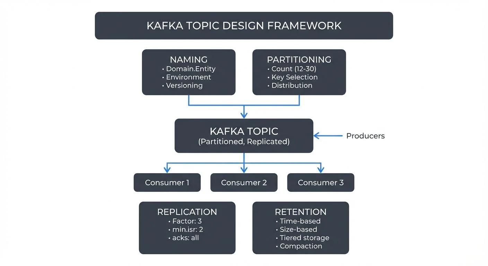

Designing Kafka topics is a foundational decision that impacts performance, scalability, and maintainability of your entire streaming architecture. Poor topic design can lead to operational complexity, data inconsistency, and difficulty in evolving your system over time. This article explores key guidelines for creating well-structured Kafka topics.

<!-- ORIGINAL_DIAGRAM
```
┌─────────────────────────────────────────────────────────────────────┐
│                    KAFKA TOPIC DESIGN FRAMEWORK                     │
└─────────────────────────────────────────────────────────────────────┘

    ┌─────────────────┐        ┌─────────────────┐
    │ NAMING          │        │ PARTITIONING    │
    │ • Domain.Entity │        │ • Count (12-30) │
    │ • Environment   │        │ • Key Selection │
    │ • Versioning    │        │ • Distribution  │
    └────────┬────────┘        └────────┬────────┘
             │                          │
             └──────────┬───────────────┘
                        ▼
              ┌──────────────────┐
              │   KAFKA TOPIC    │◀──── Producers
              │  (Partitioned,   │
              │   Replicated)    │
              └────────┬─────────┘
                       │
          ─────────────┼─────────────
          │            │            │
          ▼            ▼            ▼
    Consumer 1   Consumer 2   Consumer 3

    ┌─────────────────┐        ┌─────────────────┐
    │ REPLICATION     │        │ RETENTION       │
    │ • Factor: 3     │        │ • Time-based    │
    │ • min.isr: 2    │        │ • Size-based    │
    │ • acks: all     │        │ • Tiered storage│
    └─────────────────┘        │ • Compaction    │
                               └─────────────────┘
```
-->

## Why Topic Design Matters

Topics are the fundamental unit of organization in Apache Kafka. They define how data flows through your system, how it's partitioned across brokers, and how consumers access it. Unlike traditional databases where schema changes are common, topic design decisions in Kafka are harder to reverse once producers and consumers are deployed.

A well-designed topic structure supports multiple teams working independently, enables efficient data processing, and makes governance manageable. Conversely, poorly designed topics can create bottlenecks, increase operational overhead, and make debugging difficult.

Modern Kafka (4.0+ with KRaft mode) has removed many historical limitations around partition counts and cluster management, enabling more flexible topic designs. However, the core principles of good topic architecture remain essential for building scalable streaming systems. For foundational understanding of Kafka's architecture, see [Kafka Topics, Partitions, and Brokers: Core Architecture](https://conduktor.io/glossary/kafka-topics-partitions-brokers-core-architecture).

## Naming Conventions

Consistent naming conventions make Kafka clusters manageable as they grow. A clear naming scheme helps teams understand data ownership, purpose, and lifecycle at a glance.

### Common Patterns

Many organizations adopt hierarchical naming patterns such as:

- `<domain>.<entity>.<event-type>`: `payments.order.created`, `inventory.product.updated`
- `<environment>.<team>.<purpose>`: `prod.analytics.user-events`, `staging.fraud.alerts`
- `<data-classification>.<subject>`: `public.metrics`, `confidential.customer-pii`

The key is choosing a pattern that reflects your organizational structure and sticking to it consistently. Avoid generic names like `data`, `events`, or `topic1` that provide no context.

### Versioning

For topics that will evolve over time, consider including version information in the name: `orders.v2`, `user-events-v3`. This allows you to run multiple schema versions in parallel during migrations without breaking existing consumers.

## Partitioning Strategy

Partitions are Kafka's unit of parallelism. The number of partitions determines how many consumers can read from a topic concurrently and affects throughput and latency.

### Determining Partition Count

Start with your throughput requirements. If you need to process 100 MB/s and each consumer can handle 10 MB/s, you need at least 10 partitions. Also consider:

- **Consumer parallelism**: You can't have more active consumers in a consumer group than partitions (see [Kafka Consumer Groups Explained](https://conduktor.io/glossary/kafka-consumer-groups-explained))
- **Broker distribution**: Partitions should be distributed across brokers for fault tolerance
- **Future growth**: Adding partitions later affects message ordering guarantees
- **Cluster capabilities**: Kafka 4.0 with KRaft mode eliminates the ZooKeeper-era partition scaling limitations, supporting 100,000+ partitions per cluster efficiently

**2025 Guidance**: Start with 12-30 partitions for production topics to allow for growth. The old conservative guidance of 6-12 partitions was based on ZooKeeper's metadata limitations, which no longer apply with KRaft. However, don't over-partition unnecessarily, each partition adds overhead for replication and broker management.

For capacity planning and partition sizing calculations, refer to [Kafka Capacity Planning and Performance Tuning](https://conduktor.io/glossary/kafka-capacity-planning-performance-tuning).

### Partition Key Selection

The partition key determines which partition a message goes to. Choosing the right key is critical for maintaining ordering guarantees and load distribution.

**Example**: For a user activity tracking system, using `user_id` as the partition key ensures all events for a specific user go to the same partition, maintaining per-user ordering. However, if some users are extremely active, this could create hot partitions. In such cases, consider composite keys like `user_id + session_id` to distribute load more evenly. When combining keys, concatenate them with a delimiter (e.g., `"user123:session456"`) or use a hashing function that combines both values.

```java
// Example: Composite partition key using Kafka producer
String partitionKey = userId + ":" + sessionId;
ProducerRecord<String, Event> record = new ProducerRecord<>(
    "user-events",
    partitionKey,  // Composite key
    event
);
```

Avoid using keys that could lead to skewed data distribution, such as timestamps (if most events happen during business hours) or geographic regions (if one region dominates traffic).

## Replication and Durability

Replication protects against data loss when brokers fail. The replication factor determines how many copies of each partition exist across the cluster.

### Standard Configurations

- **Replication factor of 3**: The industry standard for production systems, providing good fault tolerance without excessive storage costs
- **Minimum in-sync replicas (min.isr) of 2**: Ensures writes are acknowledged by at least 2 replicas before confirming success
- **acks=all**: Producer configuration ensuring writes succeed on all in-sync replicas

These settings balance durability with performance. For non-critical data like metrics or logs, you might use a replication factor of 2. For financial transactions or critical state, maintain factor of 3 or higher.

**Configuration Example**:
```properties
# Topic-level configuration (topic creation or alter)
replication.factor=3
min.insync.replicas=2
```

```java
// Producer-side durability configuration
Properties props = new Properties();
props.put("acks", "all");  // Wait for all in-sync replicas
props.put("enable.idempotence", "true");  // Kafka 3.0+ default
props.put("max.in.flight.requests.per.connection", "5");
```

### Advanced Replication Features (Kafka 3.0+)

- **Rack awareness**: Distribute replicas across availability zones to survive zone failures
- **Follower fetching (KIP-392)**: Consumers can read from nearby follower replicas to reduce cross-AZ traffic and improve latency
- **Tiered Storage Integration**: Replicas in hot tier with historical data in object storage

For comprehensive replication architecture, see [Kafka Replication and High Availability](https://conduktor.io/glossary/kafka-replication-and-high-availability).

## Retention Policies

Retention policies determine how long Kafka keeps messages. Unlike traditional message queues where messages are deleted after consumption, Kafka retains data based on time or size limits.

### Time-Based Retention

Common patterns include:

- **Short retention (hours to days)**: Real-time event streams, operational metrics
- **Medium retention (days to weeks)**: Application logs, user activity events
- **Long retention (months to years)**: Audit logs, compliance data, event sourcing
- **Infinite retention with tiered storage (2025)**: Historical data in object storage with recent data on local disks

**Example**: A topic containing IoT sensor readings might use 7-day retention on local storage for operational monitoring, while a topic storing financial transactions might retain data for 7 years for regulatory compliance using tiered storage.

```properties
# Short retention example (7 days on local storage)
retention.ms=604800000

# Medium retention (30 days)
retention.ms=2592000000

# Tiered storage configuration (Kafka 3.6+)
# Keep 7 days locally, indefinite in object storage
local.retention.ms=604800000
retention.ms=-1  # Infinite with tiered storage
```

### Size-Based Retention

For topics with unpredictable message rates, size-based retention (`retention.bytes`) prevents uncontrolled storage growth. Combine time and size limits for robust lifecycle management.

```properties
# Limit topic size to 100GB per partition
retention.bytes=107374182400
```

### Compaction

Log compaction is useful for changelog topics where only the latest state per key matters. Compacted topics retain the most recent message for each key indefinitely, making them ideal for building materialized views or caching layers.

**Example**: A `product-catalog` topic with product IDs as keys. As products are updated, old versions are eventually removed, but the current state of every product remains available forever.

```properties
# Enable log compaction
cleanup.policy=compact

# Hybrid: delete old data AND compact
cleanup.policy=compact,delete
retention.ms=2592000000  # 30 days before eligible for deletion
```

### Tiered Storage for Long Retention (Kafka 3.6+)

Tiered storage (KIP-405) revolutionizes retention strategies by offloading older segments to cost-effective object storage (S3, GCS, Azure Blob) while keeping recent data on fast local disks. This enables:

- **Infinite retention** at low cost (pennies per GB/month vs. dollars for SSD)
- **No partition reassignment** when scaling storage
- **Time-travel queries** on historical data without separate archival systems

**Configuration Example**:
```properties
# Enable tiered storage
remote.log.storage.enable=true
remote.log.storage.system.enable=true

# Keep only 3 days locally, rest in object storage
local.retention.ms=259200000
local.retention.bytes=107374182400

# Infinite total retention
retention.ms=-1
retention.bytes=-1
```

For detailed tiered storage architecture and use cases, see [Tiered Storage in Kafka](https://conduktor.io/glossary/tiered-storage-in-kafka).

## Schema Design Considerations

While Kafka topics don't enforce schemas, planning for schema evolution is essential for long-term maintainability.

### Schema Registry Integration

Using a schema registry enables:

- **Centralized schema management**: Single source of truth for message formats
- **Compatibility enforcement**: Prevents incompatible schema changes
- **Version tracking**: Clear history of schema evolution

**Popular Schema Registry Options (2025)**:
- **Apache Schema Registry implementations**: Open-source, compatible with multiple formats (Avro, Protobuf, JSON Schema)
- **Apicurio Registry**: Open-source with REST API and web console
- **AWS Glue Schema Registry**: Integrated with AWS services
- **Conduktor**: Commercial platform providing visual schema management, compatibility testing, and governance workflows across multiple clusters

For comprehensive schema management practices, see [Schema Registry and Schema Management](https://conduktor.io/glossary/schema-registry-and-schema-management) and [Schema Evolution Best Practices](https://conduktor.io/glossary/schema-evolution-best-practices).

### Evolution Strategies

Design schemas with evolution in mind:

- Use optional fields for new attributes
- Never remove required fields
- Avoid changing field types
- Use enums carefully (adding values is safe, removing is not)

**Example of Safe vs. Unsafe Evolution**:

```json
// Original schema (v1)
{
  "type": "record",
  "name": "UserEvent",
  "fields": [
    {"name": "userId", "type": "string"},
    {"name": "eventType", "type": "string"}
  ]
}

// ✅ SAFE: Adding optional field with default
{
  "type": "record",
  "name": "UserEvent",
  "fields": [
    {"name": "userId", "type": "string"},
    {"name": "eventType", "type": "string"},
    {"name": "timestamp", "type": ["null", "long"], "default": null}
  ]
}

// ❌ UNSAFE: Removing required field breaks old consumers
{
  "type": "record",
  "name": "UserEvent",
  "fields": [
    {"name": "userId", "type": "string"}
    // eventType removed - old consumers will fail!
  ]
}
```

Formats like Avro, Protobuf, and JSON Schema support backward and forward compatibility when followed correctly. See [Avro vs Protobuf vs JSON Schema](https://conduktor.io/glossary/avro-vs-protobuf-vs-json-schema) for format-specific guidance.

## Organizational and Governance Patterns

As Kafka deployments grow, governance becomes critical. Without clear ownership and policies, topic proliferation leads to confusion and maintenance burden.

### Topic Ownership

Define clear ownership for each topic:

- Who approves schema changes?
- Who monitors data quality?
- Who handles incidents?

Metadata systems or topic naming conventions can encode ownership information. Some organizations use topic prefixes to indicate owning teams: `team-payments.orders.created`.

### Access Control

Implement fine-grained ACLs (Access Control Lists) to control who can:

- Produce to topics
- Consume from topics
- Create or delete topics
- Modify configurations

**ACL Configuration Example**:
```bash
# Grant producer access to a specific topic
kafka-acls --bootstrap-server localhost:9092 \
  --add --allow-principal User:app-producer \
  --operation Write --topic payments.order.created

# Grant consumer group access
kafka-acls --bootstrap-server localhost:9092 \
  --add --allow-principal User:analytics-service \
  --operation Read --topic payments.order.created \
  --group analytics-consumer-group
```

**2025 Governance Tools**:
- **Conduktor**: Centralized ACL management with visual interface, approval workflows, and audit trails across multiple clusters. For implementing self-service topic creation with governance policies, see the [Self-Service documentation](https://docs.conduktor.io/guide/conduktor-concepts/self-service) and [Topics Management guide](https://docs.conduktor.io/guide/manage-kafka/kafka-resources/topics)
- **OPA (Open Policy Agent)**: Policy-as-code for automated authorization decisions
- **Kafka KRaft ACLs**: Simplified ACL storage and management without ZooKeeper dependency

For comprehensive security practices, see [Kafka Security Best Practices](https://conduktor.io/glossary/kafka-security-best-practices) and [Access Control for Streaming](https://conduktor.io/glossary/access-control-for-streaming).

### Topic Lifecycle Management

Establish processes for:

- **Creation**: Approval workflows, configuration templates
- **Monitoring**: Data quality checks, lag alerts, throughput metrics
- **Deprecation**: Migration plans, sunset timelines, archival procedures

Document these processes and enforce them through automation where possible.

### Logical Topics: Abstraction Layer for Topic Design Flexibility

Conduktor's [Logical Topics](https://docs.conduktor.io/guide/conduktor-concepts/logical-topics) provide an abstraction layer that addresses common topic design challenges. **Alias Topics** solve Kafka's inability to rename topics, teams share topics using business-friendly names while maintaining internal conventions. **Concentrated Topics** dramatically reduce partition counts by co-locating multiple logical topics on a single physical topic (e.g., 4 regional topics with 400 partitions consolidate to 100 partitions, 75% reduction). **SQL Topics** enable filtering at the topic level using SQL WHERE clauses.

These abstractions reduce topic proliferation and partition overhead while maintaining logical separation for producers and consumers, particularly valuable for multi-tenant architectures or regional deployments.

## Connecting to Data Streaming Architecture

Kafka topics are the connective tissue of modern data streaming architectures. They integrate with:

- **Stream processing frameworks**: Kafka Streams, Apache Flink, and Spark Structured Streaming consume from and produce to topics. See [Kafka Streams vs Apache Flink](https://conduktor.io/glossary/kafka-streams-vs-apache-flink) for framework selection guidance.
- **CDC pipelines**: Change Data Capture tools like Debezium write database changes to topics. See [Implementing CDC with Debezium](https://conduktor.io/glossary/implementing-cdc-with-debezium) for topic design considerations in CDC scenarios.
- **Data lakes and lakehouses**: Connectors stream data from topics to object storage and table formats. See [Streaming to Lakehouse Tables](https://conduktor.io/glossary/streaming-to-lakehouse-tables) for integration patterns.
- **Microservices**: Services communicate asynchronously through topics using event-driven patterns. See [CQRS and Event Sourcing with Kafka](https://conduktor.io/glossary/cqrs-and-event-sourcing-with-kafka) for architectural patterns.

Proper topic design ensures these integrations remain maintainable as your architecture evolves:

- **Well-partitioned topics** enable parallel processing in Flink jobs without consumer lag bottlenecks
- **Consistent naming conventions** help data engineers discover relevant data for analytics pipelines
- **Appropriate retention policies** ensure downstream systems can replay data during outages or migrations
- **Schema enforcement** prevents breaking changes from propagating through dependent systems

**Example**: An e-commerce platform might design topics like:
- `orders.created` (30 partitions, 7-day retention) → feeds real-time analytics dashboards
- `orders.enriched` (30 partitions, 30-day retention + tiered storage) → used by data warehouse ETL jobs
- `customer.profile.changelog` (12 partitions, compacted) → maintains customer state for microservices caches

## Summary

Effective Kafka topic design requires balancing technical constraints with organizational needs. Key guidelines include:

- **Adopt consistent naming conventions** that reflect your domain and team structure
- **Choose partition counts and keys** based on throughput requirements and ordering guarantees
  - Modern Kafka (4.0+ with KRaft) supports 100k+ partitions per cluster
  - Start with 12-30 partitions for production topics
- **Configure replication** for appropriate durability without excessive overhead
  - Standard: replication factor 3, min.isr 2, acks=all
  - Use rack awareness and follower fetching for improved availability and performance
- **Set retention policies** aligned with data lifecycle and compliance requirements
  - Leverage tiered storage (Kafka 3.6+) for cost-effective long retention
  - Use log compaction for changelog topics
- **Plan for schema evolution** using schema registries and compatible change practices
  - Always add optional fields, never remove required fields
  - Test compatibility before deploying changes
- **Establish clear governance processes** for topic ownership, access control, and lifecycle management
  - Use tooling like Conduktor for centralized governance
  - Implement ACLs following least-privilege principles

**2025 Key Enhancements**:
- **KRaft mode** eliminates ZooKeeper-era partition scaling limitations
- **Tiered storage** enables infinite retention at low cost
- **Follower fetching** improves read performance across availability zones
- **Enhanced ACL management** with KRaft's simplified metadata model

These principles help build Kafka deployments that scale efficiently and remain maintainable as your streaming architecture grows. For deeper dives into specific topics, explore the cross-referenced articles throughout this guide.

## Related Concepts

- [Schema Registry and Schema Management](https://conduktor.io/glossary/schema-registry-and-schema-management) - Essential for enforcing schema compatibility rules that prevent breaking changes in topic evolution.
- [Tiered Storage in Kafka](https://conduktor.io/glossary/tiered-storage-in-kafka) - Modern retention strategy that separates hot and cold data for cost-effective long-term storage.
- [Kafka Security Best Practices](https://conduktor.io/glossary/kafka-security-best-practices) - Critical for implementing access control and encryption policies at the topic level.

## Related Articles

- [Kafka Topics, Partitions, and Brokers: Core Architecture](https://conduktor.io/glossary/kafka-topics-partitions-brokers-core-architecture) - Foundational concepts
- [Understanding KRaft Mode in Kafka](https://conduktor.io/glossary/understanding-kraft-mode-in-kafka) - ZooKeeper-free architecture
- [Tiered Storage in Kafka](https://conduktor.io/glossary/tiered-storage-in-kafka) - Long-term retention strategies
- [Kafka Replication and High Availability](https://conduktor.io/glossary/kafka-replication-and-high-availability) - Durability and fault tolerance
- [Kafka Consumer Groups Explained](https://conduktor.io/glossary/kafka-consumer-groups-explained) - Consumer parallelism and partition assignment
- [Schema Registry and Schema Management](https://conduktor.io/glossary/schema-registry-and-schema-management) - Managing message schemas
- [Schema Evolution Best Practices](https://conduktor.io/glossary/schema-evolution-best-practices) - Safe schema changes
- [Kafka Security Best Practices](https://conduktor.io/glossary/kafka-security-best-practices) - Authentication and authorization
- [Consumer Lag Monitoring](https://conduktor.io/glossary/consumer-lag-monitoring) - Tracking partition consumption

## Sources and References

1. Apache Kafka Documentation - Topic Configuration: https://kafka.apache.org/documentation/#topicconfigs
2. "Kafka: The Definitive Guide, 2nd Edition" by Gwen Shapira, Todd Palino, Rajini Sivaram, and Krit Petty (O'Reilly Media, 2021)
3. KIP-405: Kafka Tiered Storage: https://cwiki.apache.org/confluence/display/KAFKA/KIP-405%3A+Kafka+Tiered+Storage
4. KIP-500: Replace ZooKeeper with a Self-Managed Metadata Quorum (KRaft): https://cwiki.apache.org/confluence/display/KAFKA/KIP-500
5. KIP-392: Allow consumers to fetch from closest replica: https://cwiki.apache.org/confluence/display/KAFKA/KIP-392
6. Jay Kreps - "The Log: What every software engineer should know about real-time data's unifying abstraction": https://engineering.linkedin.com/distributed-systems/log-what-every-software-engineer-should-know-about-real-time-datas-unifying
