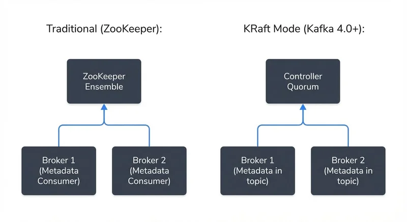
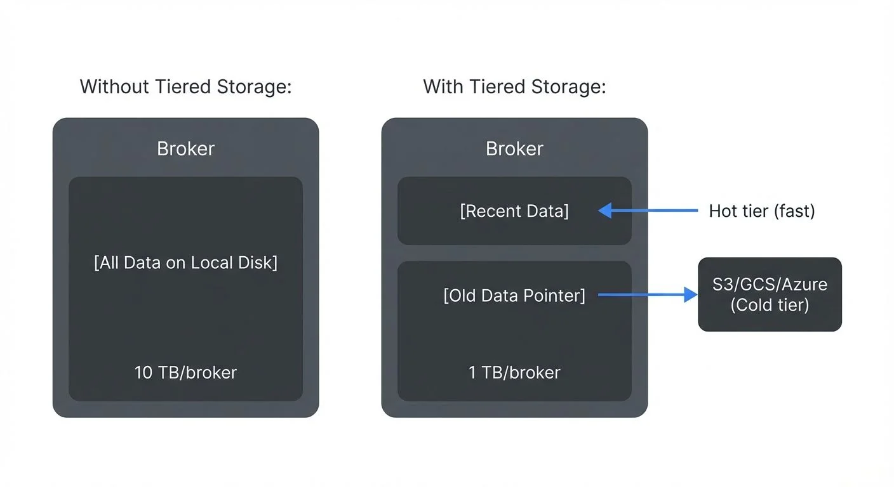
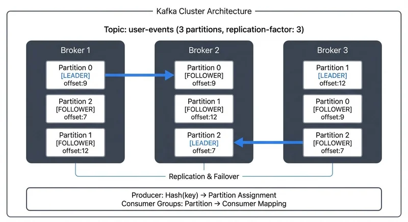

# Kafka Topics, Partitions, and Brokers: Core Architecture

Apache Kafka's architecture is built on three fundamental components: topics, partitions, and brokers. Understanding how these elements interact is essential for designing robust data streaming systems. This article explores each component and explains how they work together to deliver Kafka's core capabilities: scalability, fault tolerance, and high throughput.

## Topics: The Logical Organization Layer

A **topic** in Kafka represents a logical stream of records. Think of it as a category or feed name to which producers publish data and from which consumers read data. Topics are append-only logs that store records in the order they arrive.

Each topic has a name (e.g., `user-events`, `payment-transactions`) and can handle different types of data. Topics are schema-agnostic at the broker level, though producers and consumers typically agree on a data format (JSON, Avro, Protobuf).

Key characteristics of topics:

- **Append-only**: Records are always added to the end of the log
- **Immutable**: Once written, records cannot be modified
- **Retention-based**: Records are retained based on time or size limits, not consumption
- **Multi-subscriber**: Multiple consumer groups can independently read the same topic

## Partitions: The Scalability Mechanism

While topics provide logical organization, **partitions** enable Kafka's scalability. Each topic is split into one or more partitions, which are the fundamental unit of parallelism and distribution in Kafka.

### How Partitions Work

Each partition is an ordered, immutable sequence of records. Records within a partition have a unique sequential ID called an **offset**. When a producer sends a message to a topic, Kafka assigns it to a specific partition based on:

1. **Explicit partition**: Producer specifies the partition number
2. **Key-based routing**: Hash of the message key determines the partition (guarantees ordering for the same key)
3. **Round-robin**: If no key is provided, messages are distributed evenly

```java
// Key-based routing example (Java)
ProducerRecord<String, String> record =
    new ProducerRecord<>("user-events", "user-123", eventData);
// All messages with key "user-123" go to the same partition

// Explicit partition
ProducerRecord<String, String> record =
    new ProducerRecord<>("user-events", 2, "user-123", eventData);
// Forces message to partition 2
```

```
Topic: user-events (3 partitions)

Partition 0: [msg0, msg3, msg6, msg9]  → offset: 0, 1, 2, 3
Partition 1: [msg1, msg4, msg7]        → offset: 0, 1, 2
Partition 2: [msg2, msg5, msg8]        → offset: 0, 1, 2
```

### Partition Count Trade-offs

Choosing the right number of partitions involves several considerations:

**More partitions enable:**
- Higher parallelism (more consumers can read simultaneously)
- Better throughput distribution across brokers
- Finer-grained scaling

**But too many partitions can cause:**
- Longer leader election times during failures
- More memory overhead per partition
- Increased latency for end-to-end replication
- Higher metadata overhead in the controller

A common starting point: calculate partitions based on desired throughput divided by single-partition throughput, typically resulting in 6-12 partitions per topic for moderate-scale systems.

**Example Calculation:**
- Target throughput: 100 MB/s
- Single partition throughput: ~10 MB/s
- Recommended partitions: 100 / 10 = 10 partitions

**Topic Creation Example:**

```bash
# Kafka 4.0+ with KRaft
kafka-topics.sh --bootstrap-server localhost:9092 \
  --create \
  --topic user-events \
  --partitions 10 \
  --replication-factor 3 \
  --config min.insync.replicas=2 \
  --config retention.ms=604800000

# Verify topic configuration
kafka-topics.sh --bootstrap-server localhost:9092 \
  --describe \
  --topic user-events
```

For comprehensive topic planning strategies, see [Kafka Topic Design Guidelines](https://conduktor.io/glossary/kafka-topic-design-guidelines).

## Brokers: The Storage and Coordination Layer

A **broker** is a Kafka server that stores data and serves client requests. A Kafka cluster consists of multiple brokers working together to distribute the load and provide fault tolerance.

### Broker Responsibilities

Each broker in a cluster:

- Stores partition replicas assigned to it
- Handles read and write requests from producers and consumers
- Participates in partition leadership election
- Manages data retention and compaction
- Communicates with other brokers for replication

Brokers are identified by a unique integer ID. When you create a topic with multiple partitions, Kafka distributes partition replicas across available brokers.

### Replication and Leadership

For fault tolerance, each partition is replicated across multiple brokers. One replica serves as the **leader** (handles all reads and writes), while others are **followers** (replicate data from the leader).

```
Topic: transactions (2 partitions, replication-factor: 3)

Partition 0:
  Leader: Broker 1
  Followers: Broker 2, Broker 3

Partition 1:
  Leader: Broker 2
  Followers: Broker 1, Broker 3
```

If a broker fails, partitions where it was the leader automatically elect a new leader from the **in-sync replicas (ISR)** - replicas that have fully caught up with the leader's log and meet the `replica.lag.time.max.ms` threshold. This ensures continuous availability without data loss, as only synchronized replicas can become leaders.

**Durability Configuration:**

For critical data, configure `min.insync.replicas` (typically 2) to ensure writes are acknowledged only after being replicated to multiple brokers. Combined with producer setting `acks=all`, this guarantees no data loss even during broker failures.

For comprehensive replication strategies, see [Kafka Replication and High Availability](https://conduktor.io/glossary/kafka-replication-and-high-availability).

### Metadata Management with KRaft (Kafka 4.0+)

Since Kafka 3.3 (GA in 3.5, required in 4.0+), clusters use **KRaft** (Kafka Raft) instead of ZooKeeper for metadata management. KRaft fundamentally changes how Kafka stores and manages cluster metadata.

**How KRaft Works:**

Instead of external ZooKeeper nodes, dedicated **controller nodes** (or combined broker-controller nodes) form a Raft quorum that manages metadata. Cluster state (topic configurations, partition assignments, broker registrations) is stored in an internal `__cluster_metadata` topic, treated as the source of truth.

**KRaft Benefits:**

- **Faster failover**: Controller election happens in milliseconds instead of seconds
- **Scalability**: Supports millions of partitions per cluster (vs. ZooKeeper's ~200K limit)
- **Simplified operations**: No external coordination service to maintain
- **Stronger consistency**: Raft consensus algorithm provides clearer guarantees
- **Improved security**: Unified authentication and authorization model

**Architecture Impact:**



<!-- ORIGINAL_DIAGRAM
```
Traditional (ZooKeeper):                 KRaft Mode (Kafka 4.0+):
┌────────────┐                          ┌────────────┐
│ ZooKeeper  │                          │ Controller │
│  Ensemble  │◄─────────────┐           │   Quorum   │◄─────────────┐
└────────────┘              │           └────────────┘              │
      ▲                     │                 ▲                     │
      │                     │                 │                     │
┌─────┴──────┐         ┌────┴─────┐    ┌─────┴──────┐         ┌────┴─────┐
│  Broker 1  │         │ Broker 2 │    │  Broker 1  │         │ Broker 2 │
│ (Metadata  │         │(Metadata │    │ (Metadata  │         │(Metadata │
│  Consumer) │         │Consumer) │    │  in topic) │         │in topic) │
└────────────┘         └──────────┘    └────────────┘         └──────────┘
```
-->

For in-depth coverage of KRaft architecture and migration strategies, see [Understanding KRaft Mode in Kafka](https://conduktor.io/glossary/understanding-kraft-mode-in-kafka).

### Tiered Storage Architecture (Kafka 3.6+)

Kafka 3.6+ introduced **tiered storage**, fundamentally changing how brokers manage data retention. This feature allows brokers to offload older log segments to remote object storage (S3, GCS, Azure Blob Storage) while keeping recent, frequently accessed data on local disks.

**How Tiered Storage Works:**

- **Hot tier**: Recent segments stored on broker local disk (fast access)
- **Cold tier**: Older segments archived to object storage (cost-efficient)
- **Transparent consumption**: Consumers automatically fetch from the appropriate tier
- **Retention policy**: Configure `local.retention.ms` (hot) and `retention.ms` (total)

**Architectural Benefits:**



<!-- ORIGINAL_DIAGRAM
```
Without Tiered Storage:              With Tiered Storage:
┌──────────────┐                    ┌──────────────┐
│   Broker     │                    │   Broker     │
│              │                    │              │
│ [All Data    │                    │ [Recent Data]│ ← Hot tier (fast)
│  on Local    │                    │              │
│  Disk]       │                    │ [Old Data    │
│              │                    │  Pointer]────┼─→ S3/GCS/Azure
│ 10 TB/broker │                    │ 1 TB/broker  │   (Cold tier)
└──────────────┘                    └──────────────┘
```
-->

**Why It Matters:**

- **Decoupled storage**: Retention no longer tied to disk capacity
- **Cost reduction**: Object storage is ~90% cheaper than broker disk
- **Longer retention**: Keep months or years of data without scaling brokers
- **Faster recovery**: New brokers don't need to replicate cold data
- **Better elasticity**: Scale compute (brokers) independently from storage

For detailed configuration and best practices, see [Tiered Storage in Kafka](https://conduktor.io/glossary/tiered-storage-in-kafka).

## How Components Work Together

The interaction between topics, partitions, and brokers creates Kafka's distributed log architecture:



<!-- ORIGINAL_DIAGRAM
```
┌─────────────────────────────────────────────────────────────────────┐
│                 Kafka Cluster Architecture                          │
├─────────────────────────────────────────────────────────────────────┤
│                                                                       │
│   Topic: user-events (3 partitions, replication-factor: 3)         │
│                                                                       │
│   ┌─────────────┐      ┌─────────────┐      ┌─────────────┐       │
│   │  Broker 1   │      │  Broker 2   │      │  Broker 3   │       │
│   ├─────────────┤      ├─────────────┤      ├─────────────┤       │
│   │             │      │             │      │             │       │
│   │ Partition 0 │      │ Partition 0 │      │ Partition 1 │       │
│   │  [LEADER]   │─────▶│ [FOLLOWER]  │      │  [LEADER]   │       │
│   │  offset:9   │      │  offset:9   │      │  offset:12  │       │
│   │             │      │             │      │             │       │
│   │ Partition 2 │      │ Partition 1 │      │ Partition 0 │       │
│   │ [FOLLOWER]  │      │ [FOLLOWER]  │      │ [FOLLOWER]  │       │
│   │  offset:7   │      │  offset:12  │      │  offset:9   │       │
│   │             │      │             │      │             │       │
│   │ Partition 1 │      │ Partition 2 │      │ Partition 2 │       │
│   │ [FOLLOWER]  │      │  [LEADER]   │◀─────│ [FOLLOWER]  │       │
│   │  offset:12  │      │  offset:7   │      │  offset:7   │       │
│   └─────────────┘      └─────────────┘      └─────────────┘       │
│          ▲                    ▲                     ▲              │
│          │                    │                     │              │
│          └────────────────────┴─────────────────────┘              │
│                               │                                    │
│                    Replication & Failover                          │
│                                                                       │
│   ┌────────────────────────────────────────────────────────────┐  │
│   │  Producer: Hash(key) → Partition Assignment               │  │
│   │  Consumer Groups: Partition → Consumer Mapping            │  │
│   └────────────────────────────────────────────────────────────┘  │
│                                                                       │
└─────────────────────────────────────────────────────────────────────┘
```
-->

This architecture enables:

- **Horizontal scalability**: Add brokers to increase storage and throughput
- **Fault tolerance**: Replica failover ensures availability
- **Ordering guarantees**: Per-partition ordering with key-based routing
- **Independent consumption**: Multiple consumer groups process data at their own pace

## Kafka in the Data Streaming Ecosystem

Kafka's architecture makes it the central nervous system of modern data platforms. Topics serve as durable, replayable event streams that connect disparate systems:

- **Stream processing**: Frameworks like Kafka Streams and Flink consume from topics, transform data, and write to new topics
- **Data integration**: Kafka Connect uses topics as intermediaries between source and sink systems
- **Event-driven microservices**: Services publish domain events to topics and subscribe to events from other services
- **Analytics pipelines**: Data flows from operational topics into data lakes and warehouses

For foundational understanding of Kafka's role in data platforms, see [Apache Kafka](https://conduktor.io/glossary/apache-kafka).

For complex deployments, tools like **Conduktor** provide visibility into topic configurations, partition distribution, and broker health. This governance layer helps teams understand data lineage, monitor consumer lag across partitions (see [Consumer Lag Monitoring](https://conduktor.io/glossary/consumer-lag-monitoring)), and ensure replication factors meet compliance requirements.

**Related Concepts:**

- Producer and consumer client interactions: [Kafka Producers and Consumers](https://conduktor.io/glossary/kafka-producers-and-consumers)
- Message format and serialization: [Message Serialization in Kafka](https://conduktor.io/glossary/message-serialization-in-kafka)
- Schema management: [Schema Registry and Schema Management](https://conduktor.io/glossary/schema-registry-and-schema-management)
- Security configurations: [Kafka Security Best Practices](https://conduktor.io/glossary/kafka-security-best-practices)

## Summary

Kafka's architecture is elegantly simple yet powerful. Topics provide logical organization, partitions enable horizontal scaling and parallelism, and brokers offer distributed storage with fault tolerance. With Kafka 4.0+, the shift to KRaft and tiered storage has modernized this architecture for cloud-native deployments.

**When planning your Kafka deployment:**

- Choose partition counts based on throughput requirements and parallelism needs (10-100 partitions for most use cases)
- Set replication factors (typically 3) to balance fault tolerance and resource usage
- Configure `min.insync.replicas=2` with producer `acks=all` for critical data
- Distribute partition leadership across brokers to avoid hotspots
- Monitor ISR status to ensure replicas stay synchronized
- **Adopt KRaft mode** for new deployments (required in Kafka 4.0+)
- **Consider tiered storage** (Kafka 3.6+) for long retention windows to reduce costs
- Use rack awareness for partition placement in multi-AZ deployments

**Modern Architecture Considerations (2025):**

- KRaft eliminates operational complexity and improves scalability
- Tiered storage decouples storage costs from compute capacity
- Controller quorum sizing: 3-5 nodes for production KRaft clusters
- Partition leadership balancing: Leverage automatic rebalancing in Kafka 4.0+

Mastering these architectural fundamentals positions you to build scalable, reliable streaming platforms that form the backbone of modern data infrastructure.

## Sources and References

- [Apache Kafka 4.0 Documentation - Core Concepts](https://kafka.apache.org/documentation/#intro_concepts_and_terms)
- [Apache Kafka - KIP-500: Replace ZooKeeper with a Self-Managed Metadata Quorum](https://cwiki.apache.org/confluence/display/KAFKA/KIP-500%3A+Replace+ZooKeeper+with+a+Self-Managed+Metadata+Quorum)
- [Apache Kafka - KIP-405: Kafka Tiered Storage](https://cwiki.apache.org/confluence/display/KAFKA/KIP-405%3A+Kafka+Tiered+Storage)
- [Apache Kafka - Topic and Partition Configuration](https://kafka.apache.org/documentation/#topicconfigs)
- [Apache Kafka - Replication](https://kafka.apache.org/documentation/#replication)
- [Kafka: The Definitive Guide, 2nd Edition](https://www.confluent.io/resources/kafka-the-definitive-guide/) - Chapter 5: Kafka Internals
- [Conduktor - Kafka Architecture Guide](https://www.conduktor.io/kafka/kafka-topics-internals-segments-and-offsets/) (2025)
