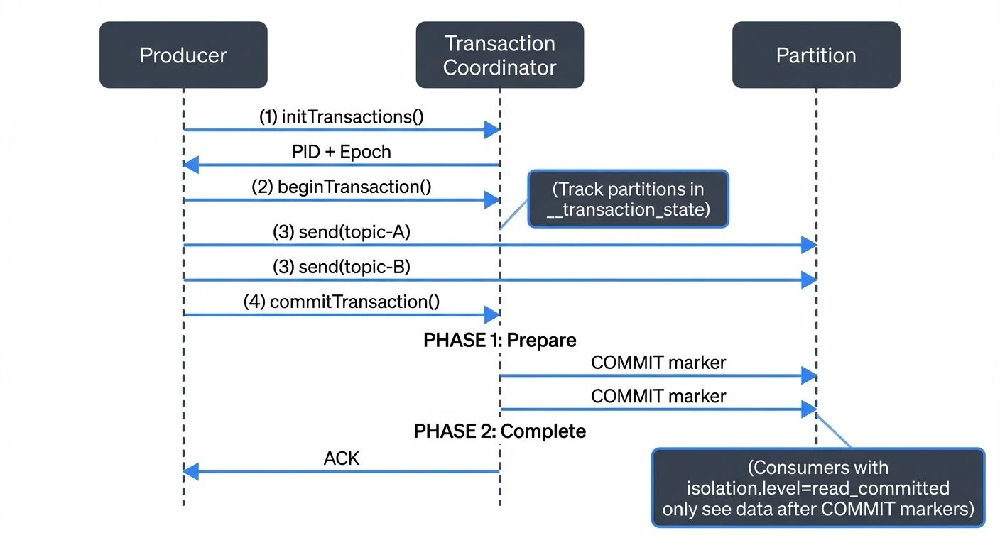

# Kafka Transactions Deep Dive

## Introduction: The Challenge of Exactly-Once Semantics

In distributed systems, ensuring that messages are processed exactly once is notoriously difficult. Traditional message delivery semantics offer two guarantees: at-most-once (messages may be lost) and at-least-once (messages may be duplicated). For critical applications like financial transactions, inventory management, or payment processing, neither is acceptable.

Apache Kafka introduced transactions to solve this challenge, enabling exactly-once semantics (EOS) across producers, brokers, and consumers. This capability transforms Kafka from a reliable message broker into a platform capable of handling mission-critical operations where duplicate processing or data loss is unacceptable.

This article provides a comprehensive technical deep dive into Kafka's transaction implementation. For a broader overview of exactly-once semantics including use cases and simpler explanations, see [Exactly-Once Semantics in Kafka](https://conduktor.io/glossary/exactly-once-semantics-in-kafka). For foundational Kafka concepts, refer to [Apache Kafka](https://conduktor.io/glossary/apache-kafka).



<!-- ORIGINAL_DIAGRAM
```
┌──────────────────────────────────────────────────────────────────┐
│              KAFKA TRANSACTION FLOW (2-PHASE COMMIT)             │
└──────────────────────────────────────────────────────────────────┘

  Producer                Transaction Coordinator           Partition
     │                              │                           │
     │─────(1) initTransactions()──▶│                           │
     │◀────────PID + Epoch──────────│                           │
     │                              │                           │
     │─────(2) beginTransaction()──▶│                           │
     │                              │                           │
     │─────(3) send(topic-A)────────┼──────────────────────────▶│
     │─────(3) send(topic-B)────────┼──────────────────────────▶│
     │                              │                           │
     │                              │  (Track partitions in     │
     │                              │   __transaction_state)    │
     │                              │                           │
     │─────(4) commitTransaction()─▶│                           │
     │                              │                           │
     │                      PHASE 1: Prepare                    │
     │                              │──────COMMIT marker───────▶│
     │                              │──────COMMIT marker───────▶│
     │                              │                           │
     │                      PHASE 2: Complete                   │
     │◀─────────ACK─────────────────│                           │
                                    │
                   (Consumers with isolation.level=read_committed
                    only see data after COMMIT markers)
```
-->

## Understanding Kafka Transactions

Kafka transactions allow producers to send multiple messages to multiple partitions atomically. Either all messages in a transaction are committed and become visible to consumers, or none are. This atomic guarantee extends across multiple topic partitions and even spans multiple Kafka clusters in some configurations.

### The Core Problem

Consider a stream processing application that reads from topic A, transforms the data, and writes results to topic B. Without transactions, failures can lead to:

- **Duplicate writes**: A producer crashes after writing to topic B but before committing its consumer offset for topic A
- **Data loss**: Consumer commits offset before processing completes
- **Inconsistent state**: Partial writes when processing multiple output records

Transactions solve these issues by coordinating producer writes and consumer offset commits in a single atomic operation.

## How Kafka Transactions Work

Kafka's transactional mechanism relies on several key components working together to maintain consistency across distributed operations.

### Transaction Coordinator

The transaction coordinator is a broker-side component responsible for managing transaction state. Each producer with transactions enabled is assigned a transaction coordinator based on its `transactional.id`. The coordinator:

- Assigns Producer IDs (PIDs) and epoch numbers for idempotency
- Maintains transaction logs in the internal `__transaction_state` topic (which stores transaction metadata, state transitions, and participant partitions)
- Coordinates the two-phase commit protocol across partitions (a distributed algorithm ensuring all participants agree to commit or abort)
- Handles transaction timeouts and recovery

In Kafka 4.0+ with KRaft mode (Kafka's ZooKeeper-free architecture), transaction coordinator performance has been significantly improved. KRaft-based transaction coordinators provide faster transaction commits, reduced coordinator overhead, and better scalability compared to the legacy ZooKeeper-based implementation. For more on KRaft's benefits, see [Understanding KRaft Mode in Kafka](https://conduktor.io/glossary/understanding-kraft-mode-in-kafka).

### Transactional Producer Flow

When a producer initiates a transaction, the following sequence occurs:

1. **Initialization**: Producer registers with the transaction coordinator using its `transactional.id`
2. **Begin Transaction**: Producer starts a transaction locally
3. **Add Partitions**: As the producer writes to partitions, the coordinator tracks which partitions are involved
4. **Commit/Abort**: Producer sends commit or abort request to coordinator
5. **Two-Phase Commit**: Coordinator writes commit markers to all involved partitions and updates the transaction log

### Control Messages and Consumer Isolation

Kafka uses special control messages (`COMMIT` and `ABORT` markers) written to partitions to signal transaction boundaries. Consumers configured with `isolation.level=read_committed` only see messages from committed transactions, while those set to `read_uncommitted` see all messages.

## Transactional APIs and Configuration

Implementing transactions requires specific configuration on both producers and consumers.

### Producer Configuration

```java
Properties props = new Properties();
props.put("bootstrap.servers", "localhost:9092");
props.put("transactional.id", "my-transactional-producer");
// Note: enable.idempotence is default true in Kafka 3.0+, explicit setting optional
props.put("enable.idempotence", "true");
props.put("acks", "all");

KafkaProducer<String, String> producer = new KafkaProducer<>(props);
producer.initTransactions();

try {
    producer.beginTransaction();
    producer.send(new ProducerRecord<>("topic-a", "key", "value1"));
    producer.send(new ProducerRecord<>("topic-b", "key", "value2"));
    producer.commitTransaction();
} catch (Exception e) {
    producer.abortTransaction();
}
```

The `transactional.id` must be unique per producer instance and enables the coordinator to identify and fence zombie producers (producers that appear to have failed but resume later). Note that idempotent producers (`enable.idempotence=true`) are the default since Kafka 3.0+, providing automatic duplicate prevention even without explicit transactions. For comprehensive coverage of producer configuration and idempotence, see [Kafka Producers](https://conduktor.io/glossary/kafka-producers).

### Consumer Configuration

```java
Properties props = new Properties();
props.put("bootstrap.servers", "localhost:9092");
props.put("group.id", "my-consumer-group");
props.put("isolation.level", "read_committed");
props.put("enable.auto.commit", "false");

KafkaConsumer<String, String> consumer = new KafkaConsumer<>(props);
```

Disabling auto-commit is crucial when using transactions, as you'll manually commit offsets within the transaction boundary. For more details on consumer group coordination and offset management, see [Kafka Consumer Groups Explained](https://conduktor.io/glossary/kafka-consumer-groups-explained).

### Consume-Process-Produce Pattern

The most common transactional pattern combines consumption and production:

```java
while (true) {
    ConsumerRecords<String, String> records = consumer.poll(Duration.ofMillis(100));

    producer.beginTransaction();
    try {
        for (ConsumerRecord<String, String> record : records) {
            // Process and produce
            ProducerRecord<String, String> output = transform(record);
            producer.send(output);
        }

        // Commit consumer offsets as part of transaction
        producer.sendOffsetsToTransaction(
            getOffsets(records),
            consumer.groupMetadata()
        );

        producer.commitTransaction();
    } catch (Exception e) {
        producer.abortTransaction();
    }
}
```

## Real-World Use Cases

### Financial Payment Processing

A payment processing system reads payment requests from a Kafka topic, validates them, debits accounts, and writes confirmation records. Transactions ensure that if any step fails, the entire operation rolls back, preventing partial payments or duplicate charges. For patterns implementing reliable payment processing and financial data flows, see [Streaming Data in Financial Services](https://conduktor.io/glossary/streaming-data-in-financial-services).

### Multi-System Data Synchronization

When synchronizing data between a database and Kafka, transactions guarantee that database changes and Kafka messages are committed together. For example, an e-commerce platform updating inventory in PostgreSQL while publishing availability events to Kafka can use transactions to maintain consistency. For coordinating transactions across multiple microservices using event-driven patterns, see [Saga Pattern for Distributed Transactions](https://conduktor.io/glossary/saga-pattern-for-distributed-transactions). For reliable event publishing from databases, the [Outbox Pattern for Reliable Event Publishing](https://conduktor.io/glossary/outbox-pattern-for-reliable-event-publishing) provides complementary guarantees.

### Stream Processing Pipelines

Kafka Streams and Flink use transactions internally to provide exactly-once processing guarantees. When aggregating real-time analytics or joining multiple streams, transactions ensure that state stores and output topics remain consistent even during failures. Kafka Streams leverages the `exactly_once_v2` protocol (introduced in Kafka 2.5) for improved performance, and Kafka 4.0+ further optimizes transaction handling in KRaft mode. For a detailed comparison of these frameworks and their transactional capabilities, see [Kafka Streams vs Apache Flink](https://conduktor.io/glossary/kafka-streams-vs-apache-flink).

## Monitoring and Troubleshooting Transactions

Understanding transaction health requires monitoring several key metrics and understanding common failure patterns.

### Key Metrics

Monitor these critical transaction metrics to ensure healthy operation:

- `transaction-state`: Number of transactions in each state (ongoing, prepare commit, completed) - helps identify stuck transactions
- `txn-commit-time-ms`: Time taken to commit transactions - increases may indicate coordinator or network issues
- `producer-id-expiration-time-ms`: Time before inactive producer IDs are expired - tracks producer lifecycle
- `last-stable-offset-lag`: Gap between log end offset and last stable offset (LSO) - measures the backlog of uncommitted transactions waiting to be read by `read_committed` consumers

**Open-source monitoring**: For Prometheus-based monitoring, Kafka Lag Exporter (the 2025 standard for consumer lag tracking) provides transaction-aware metrics. JMX metrics can be scraped using Prometheus JMX Exporter to track transaction coordinator performance. Tools like Burrow can detect consumer lag issues related to transaction processing delays.

**Commercial platforms**: Tools like Conduktor provide comprehensive visibility into transactional flows through [topic monitoring](https://docs.conduktor.io/guide/manage-kafka/kafka-resources/topics), allowing teams to visualize transaction states, identify hanging transactions, and debug configuration issues. The platform can surface warnings when transaction timeouts are misconfigured or when zombie producers are detected, and provides real-time alerts on transaction performance degradation. Conduktor Gateway also enables chaos testing of transactional scenarios by injecting faults, latency, and network partitions to validate transaction behavior under failure conditions. For comprehensive testing strategies including transaction testing, see [Testing Strategies for Streaming Applications](https://conduktor.io/glossary/testing-strategies-for-streaming-applications) and [Chaos Engineering for Streaming Systems](https://conduktor.io/glossary/chaos-engineering-for-streaming-systems).

### Common Issues

**Transaction Timeout**: If `transaction.timeout.ms` is too short for your processing time, transactions will abort automatically. Monitor processing times and adjust accordingly.

**Zombie Fencing**: When a producer is fenced (its epoch is incremented), it can no longer commit transactions. This is by design to prevent split-brain scenarios, but requires proper producer lifecycle management.

**Coordinator Overload**: High transaction volumes can overload the transaction coordinator. Consider partitioning transactional load across multiple `transactional.id` values.

## Best Practices and Considerations

### When to Use Transactions

Transactions add latency and complexity. Use them when:

- Exactly-once semantics are required for correctness
- Processing spans multiple partitions or topics
- You're implementing consume-process-produce patterns

Avoid transactions for:

- Simple logging or metrics where occasional duplicates are acceptable
- Ultra-low latency scenarios where the overhead is prohibitive
- Single-partition writes where idempotence alone suffices

### Performance Implications

Transactions introduce several performance considerations:

- **Increased latency**: Two-phase commit adds network round trips
- **Throughput impact**: Transaction state management consumes broker resources
- **Storage overhead**: Control messages and transaction logs require additional storage

Batch messages within transactions to amortize the coordination overhead. A transaction writing 100 messages is much more efficient than 100 transactions writing one message each.

### Idempotence vs. Transactions

Kafka's idempotent producer (`enable.idempotence=true`, default since Kafka 3.0+) prevents duplicate writes within a single partition but doesn't coordinate across partitions or provide atomic multi-partition writes. Transactions build on idempotence to provide cross-partition atomicity and exactly-once semantics (EOS). Use idempotence alone when you only need duplicate prevention without multi-partition coordination. For a broader overview of exactly-once semantics including idempotence, transactions, and their relationship, see [Exactly-Once Semantics in Kafka](https://conduktor.io/glossary/exactly-once-semantics-in-kafka).

### Transaction Timeout Configuration

Set `transaction.timeout.ms` based on your maximum expected processing time, including retries. The default is 60 seconds, but long-running transformations may need higher values. However, longer timeouts delay the detection of failed transactions, so balance carefully.

## Summary

Kafka transactions provide exactly-once semantics by coordinating atomic writes across multiple partitions and topics. Through the transaction coordinator, two-phase commit protocol, and control messages, Kafka ensures that either all messages in a transaction are visible to consumers or none are.

The transactional APIs enable powerful patterns like consume-process-produce, where reading, transforming, and writing occur atomically. This capability is essential for financial systems, data synchronization, and stream processing pipelines where data consistency is critical.

While transactions add complexity and latency, they're indispensable for applications that cannot tolerate duplicates or data loss. Understanding the internals, configuration options, and monitoring requirements allows teams to implement robust exactly-once processing in production environments.

**Key 2025 updates:**
- Idempotent producers are now default in Kafka 3.0+, providing automatic duplicate prevention
- Kafka 4.0+ with KRaft mode delivers significantly improved transaction coordinator performance with faster commits and reduced overhead
- Modern monitoring tools like Kafka Lag Exporter and Conduktor provide enhanced visibility into transaction health and performance
- The `exactly_once_v2` protocol in Kafka Streams (2.5+) combined with KRaft optimizations makes exactly-once semantics more performant than ever

## Related Concepts

- [Exactly-Once Semantics in Kafka](https://conduktor.io/glossary/exactly-once-semantics-in-kafka) - Overview of exactly-once guarantees in Kafka
- [Kafka Topics, Partitions, and Brokers: Core Architecture](https://conduktor.io/glossary/kafka-topics-partitions-brokers-core-architecture) - Foundational architecture enabling transactions
- [Saga Pattern for Distributed Transactions](https://conduktor.io/glossary/saga-pattern-for-distributed-transactions) - Using transactions in distributed workflows

## Sources and References

1. [Apache Kafka Documentation - Transactions](https://kafka.apache.org/documentation/#semantics) - Official documentation covering transaction semantics and configuration
2. [KIP-98: Exactly Once Delivery and Transactional Messaging](https://cwiki.apache.org/confluence/display/KAFKA/KIP-98+-+Exactly+Once+Delivery+and+Transactional+Messaging) - Original Kafka Improvement Proposal detailing transaction design
3. [Confluent: Transactions in Apache Kafka](https://www.confluent.io/blog/transactions-apache-kafka/) - Technical deep-dive from Kafka creators
4. [Exactly-once Semantics in Kafka Streams](https://www.confluent.io/blog/enabling-exactly-once-kafka-streams/) - How Kafka Streams leverages transactions
5. [Understanding Kafka Transaction Coordinator](https://www.conduktor.io/kafka/kafka-transactions/) - Practical guide to transaction internals and troubleshooting
