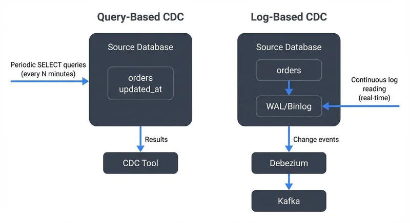

# Log-Based vs Query-Based CDC: Comparison

Change Data Capture (CDC) is a fundamental pattern in modern data engineering that enables real-time data synchronization between systems. As organizations move toward event-driven architectures and real-time analytics, choosing the right CDC approach becomes critical. This article compares the two primary CDC strategies—log-based and query-based—to help data architects and engineers make informed decisions.

For foundational CDC concepts, see [What is Change Data Capture (CDC): Fundamentals](https://conduktor.io/glossary/what-is-change-data-capture-cdc-fundamentals). For hands-on implementation guidance, refer to [Implementing CDC with Debezium](https://conduktor.io/glossary/implementing-cdc-with-debezium).

## Understanding CDC Approaches

CDC captures changes made to data sources and propagates them to downstream systems. While the goal remains consistent across implementations, the mechanism for detecting and capturing changes varies significantly between approaches.

**Query-Based CDC** periodically polls the source database using SQL queries to identify changed records. Think of it like checking your mailbox every few minutes to see if new mail arrived—you actively look for changes at regular intervals. It typically relies on timestamp columns, version numbers, or hash comparisons to detect modifications.

**Log-Based CDC** reads changes directly from the database's transaction log (also called write-ahead log or redo log), capturing every committed transaction without querying the source tables. This is like having a doorbell notification—the database tells you immediately when something changes. The transaction log is an internal file that databases maintain for crash recovery and replication, recording every write operation in order.



<!-- ORIGINAL_DIAGRAM
```
Query-Based CDC:
┌──────────────────┐
│  Source Database │
│  ┌────────────┐  │
│  │   orders   │  │◄─── Periodic SELECT queries
│  │ updated_at │  │     (every N minutes)
│  └────────────┘  │
└─────────┬────────┘
          │ Results
          ▼
    ┌──────────┐
    │ CDC Tool │
    └──────────┘

Log-Based CDC:
┌──────────────────┐
│  Source Database │
│  ┌────────────┐  │
│  │   orders   │  │
│  └────────────┘  │
│         │        │
│         ▼        │
│  ┌────────────┐  │
│  │ WAL/Binlog │  │◄─── Continuous log reading
│  └────────────┘  │     (real-time)
└─────────┬────────┘
          │ Change events
          ▼
    ┌──────────┐
    │ Debezium │
    └────┬─────┘
         │
         ▼
    ┌────────┐
    │ Kafka  │
    └────────┘
```
-->

## Query-Based CDC: Architecture and Characteristics

Query-based CDC operates by executing periodic SELECT queries against source tables to identify new, modified, or deleted records.

### How It Works

The process follows this pattern:

1. Store the last synchronization checkpoint (timestamp, ID, or hash)
2. Execute a query filtering records beyond the checkpoint
3. Process captured changes
4. Update the checkpoint for the next iteration

**Example: Timestamp-based polling**

```sql
-- Initial checkpoint: store max timestamp
SELECT MAX(updated_at) AS checkpoint
FROM orders;
-- Result: 2025-01-15 10:30:00

-- Subsequent polling query (runs every 5 minutes)
SELECT order_id, customer_id, total_amount, status, updated_at
FROM orders
WHERE updated_at > '2025-01-15 10:30:00'
ORDER BY updated_at ASC
LIMIT 10000;

-- Update checkpoint after processing
UPDATE cdc_checkpoints
SET last_sync = '2025-01-15 10:35:00'
WHERE table_name = 'orders';
```

**Example: Version-based polling**

```sql
-- Each row has a monotonically increasing version number
CREATE TABLE orders (
  order_id BIGINT PRIMARY KEY,
  customer_id BIGINT,
  total_amount DECIMAL(10,2),
  version BIGINT DEFAULT 1,
  updated_at TIMESTAMP DEFAULT CURRENT_TIMESTAMP
);

-- Trigger to increment version on every update
CREATE TRIGGER orders_version_trigger
BEFORE UPDATE ON orders
FOR EACH ROW
SET NEW.version = OLD.version + 1;

-- Polling query using version number
SELECT order_id, customer_id, total_amount, version
FROM orders
WHERE version > 1523678
ORDER BY version ASC
LIMIT 10000;
```

The checkpoint value (timestamp `2025-01-15 10:30:00` or version `1523678`) is persisted between polling intervals to track progress.

### Advantages

- **Simple Implementation**: Requires only database read access and basic SQL knowledge
- **Database Agnostic**: Works with any database supporting SQL queries
- **No Special Permissions**: Standard read permissions suffice
- **Easy Debugging**: Query logic is transparent and traceable

### Limitations

- **Performance Impact**: Periodic queries add load to production databases
- **Missing Deletes**: Hard deletes cannot be captured without additional tracking tables
- **Latency**: Polling interval creates inherent delay (typically minutes)
- **Schema Dependencies**: Requires specific columns (timestamps, version fields)
- **Incomplete Capture**: Only sees final state, misses intermediate changes within polling intervals

## Log-Based CDC: Architecture and Characteristics

Log-based CDC reads changes directly from the database's transaction log, capturing every modification as it occurs.

### How It Works

Database transaction logs record every committed change for recovery and replication purposes. Log-based CDC tools parse these binary logs (read and interpret the database's internal format) to extract change events, converting them into structured messages that applications can consume.

### Advantages

- **Low Latency**: Near real-time capture (sub-second to seconds)
- **Minimal Source Impact**: No queries against production tables
- **Complete Change Capture**: Captures all operations including deletes
- **Historical Accuracy**: Preserves order and timing of changes
- **Schema Flexibility**: No special columns required in source tables

### Limitations

- **Complex Setup**: Requires specialized tools and database-specific configuration
- **Permission Requirements**: Needs elevated database privileges
- **Database Specific**: Implementation varies by database system
- **Operational Complexity**: Log retention, parsing errors, and schema evolution require careful management

## Head-to-Head Comparison

| Dimension | Query-Based CDC | Log-Based CDC |
|-----------|----------------|---------------|
| **Latency** | Minutes (polling interval) | Sub-second to seconds |
| **Source Impact** | High (periodic queries) | Minimal (log reading) |
| **Delete Capture** | Difficult/impossible | Native support |
| **Setup Complexity** | Low | High |
| **Database Support** | Universal | Database-specific |
| **Permissions** | Read access | Replication/log access |
| **Resource Usage** | CPU/IO on source DB | Minimal on source |
| **Operational Maturity** | Well-understood | Requires specialized expertise |
| **Cost** | Lower (simpler tooling) | Higher (specialized tools) |
| **Schema Changes** | Manual query updates | Automatic detection |

## Streaming Ecosystem Integration

Modern data architectures increasingly rely on streaming platforms for event distribution, making CDC integration with streaming ecosystems essential. For comprehensive coverage of Apache Kafka's role in CDC pipelines, see [Apache Kafka](https://conduktor.io/glossary/apache-kafka).

### Kafka and Debezium

**Debezium 2.5+** is the leading open-source platform for log-based CDC, providing connectors for MySQL, PostgreSQL, MongoDB, SQL Server, Oracle, Db2, Cassandra, and Vitess. It streams database changes directly to **Apache Kafka 4.0+** (with KRaft replacing ZooKeeper for simplified operations), enabling real-time data pipelines with sub-second latency.

Modern Debezium deployments (2025) leverage several advanced features:

- **Incremental Snapshotting**: Capture initial table state without locking, enabling safe production deployment
- **Signal Tables**: Control connector behavior at runtime (pause, resume, trigger ad-hoc snapshots)
- **Schema Evolution**: Automatic handling of DDL changes with schema registry integration
- **Exactly-Once Semantics**: When paired with Kafka transactions, ensures no duplicate or lost events
- **Multi-Tenant Support**: Single connector instance can replicate multiple databases efficiently

A typical Debezium connector configuration for PostgreSQL:

```json
{
  "name": "postgres-orders-connector",
  "config": {
    "connector.class": "io.debezium.connector.postgresql.PostgresConnector",
    "database.hostname": "postgres.example.com",
    "database.port": "5432",
    "database.user": "debezium_user",
    "database.password": "${secret:dbpassword}",
    "database.dbname": "ecommerce",
    "database.server.name": "prod-orders",
    "table.include.list": "public.orders,public.order_items",
    "plugin.name": "pgoutput",
    "publication.autocreate.mode": "filtered",
    "slot.name": "debezium_orders_slot",
    "transforms": "unwrap",
    "transforms.unwrap.type": "io.debezium.transforms.ExtractNewRecordState",
    "transforms.unwrap.drop.tombstones": "false",
    "key.converter": "org.apache.kafka.connect.json.JsonConverter",
    "value.converter": "org.apache.kafka.connect.json.JsonConverter",
    "snapshot.mode": "incremental"
  }
}
```

This produces CDC events in Kafka topics following the pattern `{server.name}.{schema}.{table}`:

```json
{
  "before": null,
  "after": {
    "order_id": 12345,
    "customer_id": 67890,
    "total_amount": 149.99,
    "status": "pending",
    "created_at": 1735689600000
  },
  "source": {
    "version": "2.5.0.Final",
    "connector": "postgresql",
    "name": "prod-orders",
    "ts_ms": 1735689601234,
    "snapshot": "false",
    "db": "ecommerce",
    "schema": "public",
    "table": "orders",
    "lsn": 123456789
  },
  "op": "c",
  "ts_ms": 1735689601456
}
```

Key fields:
- **op**: Operation type (`c` = create, `u` = update, `d` = delete, `r` = read/snapshot)
- **before**: Previous row state (null for inserts, populated for updates/deletes)
- **after**: New row state (null for deletes, populated for inserts/updates)
- **source**: Metadata including LSN (log sequence number) for ordering and deduplication

### Governance and Observability

As CDC implementations scale, governance and visibility become critical. Modern streaming governance platforms like **Conduktor** provide centralized management for Kafka-based CDC pipelines, offering:

- **Schema Registry Management**: Track schema evolution across CDC topics with version history
- **Data Flow Visualization**: Map data lineage from source databases through Kafka to consumers (see [Data Lineage Tracking: Data from Source to Consumption](https://conduktor.io/glossary/data-lineage-tracking-data-from-source-to-consumption) for detailed coverage)
- **Connector Health Monitoring**: Real-time visibility into Debezium connector status, throughput, and errors with [Kafka Connect Management](https://docs.conduktor.io/guide/manage-kafka/kafka-resources/kafka-connect)
- **Consumer Lag Tracking**: Identify downstream bottlenecks consuming CDC events
- **Quality Monitoring**: Detect data quality issues, lag, and throughput anomalies with [Data Quality tools](https://docs.conduktor.io/guide/use-cases/observe-data-quality)
- **Access Control**: Govern who can consume CDC streams and enforce data policies
- **Alerting**: Proactive notifications for connector failures, lag spikes, or schema conflicts
- **Testing and Chaos Engineering**: Use Conduktor Gateway to inject failures and test CDC pipeline resilience

For teams running Debezium at scale, platforms like Conduktor simplify operations by providing:
- Single-pane-of-glass view of all CDC connectors across environments
- Historical metrics for capacity planning and SLA monitoring
- Automated runbooks for common failure scenarios (connector restarts, rebalancing)
- Integration with incident management tools (PagerDuty, Slack, etc.)

Modern CDC monitoring (2025) also leverages:
- **Kafka Lag Exporter**: Prometheus-compatible metrics for consumer lag
- **JMX metrics**: Connector-level throughput, error rates, and snapshot progress
- **Custom Kafka Streams applications**: Real-time data quality validation on CDC streams

## Operational Considerations

Beyond the architectural differences, several operational aspects impact CDC implementation success.

### Initial Snapshots and Bootstrapping

Both approaches must handle the initial state before capturing ongoing changes:

**Query-Based Snapshot:**
```sql
-- Full table scan for initial load
SELECT * FROM orders ORDER BY order_id;

-- Then switch to incremental polling
SELECT * FROM orders
WHERE updated_at > '2025-01-15 10:00:00';
```

Simple but locks tables during read, potentially impacting production.

**Log-Based Snapshot:**

Debezium 2.5+ offers three snapshot modes:

1. **initial**: Lock-based consistent snapshot (default, safest)
2. **incremental**: Lock-free snapshot using signals (recommended for production)
3. **never**: Skip snapshot, capture only new changes

Incremental snapshots avoid table locks by:
- Reading data in chunks (configurable size)
- Interleaving snapshot reads with live CDC events
- Using watermarks to track progress

```json
{
  "snapshot.mode": "incremental",
  "incremental.snapshot.chunk.size": 1024,
  "signal.data.collection": "public.debezium_signal"
}
```

### Schema Evolution Handling

**Query-Based CDC**: Schema changes require manual intervention:
- Update SQL queries to match new column structure
- Add mappings for renamed columns
- Handle data type changes in application code

**Log-Based CDC**: Automatic schema evolution with caveats:
- New columns appear in CDC events automatically
- Dropped columns stop appearing in `after` block
- Renamed columns require manual mapping (SMT - Single Message Transform)
- Data type changes may require consumer updates

Example SMT for column renaming:

```json
{
  "transforms": "renameField",
  "transforms.renameField.type": "org.apache.kafka.connect.transforms.ReplaceField$Value",
  "transforms.renameField.renames": "old_column_name:new_column_name"
}
```

### Transaction Ordering and Guarantees

**Query-Based CDC**: No transaction guarantees:
- Polling may capture partial transactions
- Updates within polling window may be seen out of order
- No way to correlate changes from the same transaction

**Log-Based CDC**: Strong ordering guarantees:
- All changes from a transaction appear in order
- Transaction boundaries preserved (when using Debezium's transaction metadata)
- LSN (Log Sequence Number) enables deduplication and ordering

For exactly-once processing, use Kafka transactions:

```properties
enable.idempotence=true
transactional.id=debezium-connector-1
transaction.timeout.ms=900000
```

### Failure Recovery Patterns

**Query-Based CDC**: Simple checkpoint recovery:
- Store last successful checkpoint
- Resume from checkpoint on failure
- Risk: may re-process recent changes (at-least-once)

**Log-Based CDC**: Connector offset management:
- Kafka Connect stores offsets in internal topics
- Connector resumes from last committed offset (LSN/binlog position)
- Exactly-once possible with Kafka transactions

If connector fails during snapshot:
```json
{
  "snapshot.mode": "recovery",
  "snapshot.recovery.enabled": true
}
```

## Choosing the Right Approach

Select your CDC strategy based on these criteria:

### Choose Query-Based CDC When:

- Latency requirements are relaxed (5-15+ minute delays acceptable)
- Source system load can accommodate periodic queries
- Budget constrains specialized tooling investment
- Team lacks database administration expertise
- Deletes are rare or handled through soft-delete patterns
- Database variety makes log-based tooling impractical

### Choose Log-Based CDC When:

- Near real-time data (seconds) is required
- Source database performance must be protected
- Complete audit trail including deletes is necessary
- Integrating with streaming platforms like [Apache Kafka](https://conduktor.io/glossary/apache-kafka)
- Organization has database administration capabilities
- Data consistency and ordering matter
- Supporting event-driven architectures (see [CDC for Microservices Event-Driven Architectures](https://conduktor.io/glossary/cdc-for-microservices-event-driven-architectures))

### Hybrid Approaches

Some organizations combine both approaches:

- **Log-based for critical tables**: High-value, frequently changing data
- **Query-based for dimension tables**: Slowly changing, less critical data
- **Fallback mechanisms**: Query-based as backup when log access is unavailable

## Summary

Log-based and query-based CDC serve the same fundamental purpose but differ significantly in architecture, performance, and operational characteristics.

**Query-based CDC** offers simplicity and universal compatibility, making it suitable for batch-oriented use cases with relaxed latency requirements. Its polling mechanism introduces source database load and inherent delays but requires minimal setup and expertise.

**Log-based CDC** delivers near real-time capture with minimal source impact by reading transaction logs directly. While operationally complex and database-specific, it excels in streaming architectures and event-driven systems where latency and completeness matter.

For modern data engineering scenarios involving real-time analytics (see [CDC for Real-Time Data Warehousing](https://conduktor.io/glossary/cdc-for-real-time-data-warehousing)), microservices integration, or event streaming platforms like Kafka, log-based CDC with tools like Debezium generally provides superior capabilities. Organizations implementing these solutions should leverage governance platforms to maintain visibility and control as CDC pipelines scale.

The choice ultimately depends on your specific requirements: if you need simplicity and can accept delays, query-based CDC suffices. If real-time data, minimal source impact, and complete change capture are priorities, invest in log-based CDC infrastructure.

## Related Concepts

- [What is Change Data Capture: CDC Fundamentals](https://conduktor.io/glossary/what-is-change-data-capture-cdc-fundamentals) - Foundational CDC concepts that apply to both log-based and query-based approaches.
- [Implementing CDC with Debezium](https://conduktor.io/glossary/implementing-cdc-with-debezium) - Hands-on guide to implementing production-grade log-based CDC using Debezium for real-time database replication.
- [Streaming Data Pipeline](https://conduktor.io/glossary/streaming-data-pipeline) - Understand how CDC integrates into broader streaming data pipeline architectures for real-time data movement.

## Sources and References

- **Debezium Documentation**: [https://debezium.io/documentation/](https://debezium.io/documentation/)
- **Kafka Connect Documentation**: [https://kafka.apache.org/documentation/#connect](https://kafka.apache.org/documentation/#connect)
- **PostgreSQL Logical Decoding**: [https://www.postgresql.org/docs/current/logicaldecoding.html](https://www.postgresql.org/docs/current/logicaldecoding.html)
- **MySQL Binary Log**: [https://dev.mysql.com/doc/refman/8.0/en/binary-log.html](https://dev.mysql.com/doc/refman/8.0/en/binary-log.html)
- **Martin Kleppmann - "Designing Data-Intensive Applications"**: Chapter 11 on Stream Processing
- **Apache Kafka Connect JDBC Connector**: Open-source connector for query-based CDC
