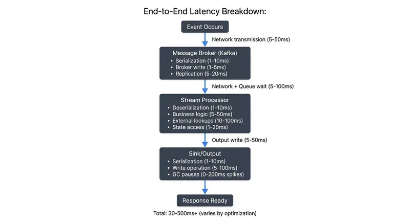

## Introduction: The Need for Speed

In the world of data streaming, latency is the interval between an event occurring and your system responding to it. While a batch processing system might measure success in hours or minutes, low-latency pipelines operate on an entirely different timescale: milliseconds to sub-second response times.

For fraud detection systems, every millisecond counts—the difference between blocking a fraudulent transaction and letting it through. In high-frequency trading, microseconds can translate to millions in profit or loss. Real-time recommendation engines must respond before a user's attention wavers. These applications don't just benefit from low latency; they fundamentally require it.

A low-latency pipeline typically targets end-to-end latencies under 100 milliseconds, with some critical applications demanding single-digit millisecond responses. Achieving this requires understanding every source of delay and making deliberate architectural choices at every layer of your streaming infrastructure.

## Understanding Latency Sources

Before optimizing for low latency, you must identify where time is being spent. Latency accumulates across multiple dimensions of your pipeline:

**Network transmission** often represents the most significant and variable component. Data traveling across regions or poorly configured networks can introduce tens to hundreds of milliseconds. Even within a data center, network congestion and routing decisions impact latency.

**Serialization and deserialization** impose CPU overhead that many developers underestimate. Converting objects to bytes and back isn't free—the choice between JSON, Avro, or Protocol Buffers can mean the difference between 5ms and 50ms per message at scale.

**Processing logic** includes your business rules, transformations, and enrichments. Complex joins, external lookups, or inefficient algorithms create bottlenecks. Even well-written code suffers if it blocks on I/O or waits for external services.

**I/O operations** to disk or external systems interrupt the flow of data. While SSDs have dramatically reduced disk latency, any synchronous write still introduces milliseconds of delay. Remote database queries or API calls can add 10-100ms per operation.

**Garbage collection pauses** in JVM-based systems like Kafka or Flink can cause intermittent spikes. A poorly tuned JVM might pause for hundreds of milliseconds during a major GC cycle, creating latency outliers that violate SLAs.

**Queue waiting times** occur when messages sit in buffers waiting for processing. If your pipeline can't keep pace with incoming data, queues grow and latency increases proportionally. For strategies to manage this, see [Backpressure Handling in Streaming Systems](https://conduktor.io/glossary/backpressure-handling-in-streaming-systems).

## Design Principles for Low-Latency Pipelines

Building a low-latency pipeline requires architectural discipline from the start. Several core principles guide effective designs:

**Minimize processing hops.** Each stage in your pipeline adds latency. A message flowing through Kafka to a stream processor to another Kafka topic to a database accumulates delays at each transition. Evaluate whether you truly need each component or if operations can be consolidated.

**Avoid blocking operations.** Any synchronous wait—for a database query, an HTTP call, or a file write—stalls your processing thread. Embrace asynchronous, non-blocking patterns. Use reactive frameworks or async/await patterns to keep threads productive while waiting for I/O.

**Design for asynchronous processing.** Structure your pipeline as a series of independent, asynchronous stages. Each component consumes messages, processes them without waiting, and publishes results immediately. This allows different stages to work in parallel rather than sequentially.

**Prioritize data locality.** Co-locate related processing steps to avoid network hops. If a Kafka consumer must enrich data from a database, place them in the same data center or availability zone. Better yet, cache frequently accessed reference data locally to eliminate the remote call entirely.

**Consider stateless vs stateful trade-offs.** Stateless processing scales easily and introduces minimal latency, but many real-world applications require state (aggregations, joins, pattern detection). When state is necessary, use in-memory state stores and minimize serialization overhead.

## Technology Choices and Trade-offs

Your technology stack profoundly impacts achievable latency. Understanding the characteristics of each component helps you make informed decisions:

**Apache Kafka** excels at low-latency message delivery when properly configured. Unlike traditional message queues that optimize for guaranteed delivery semantics, Kafka's log-based architecture allows for extremely fast appends and sequential reads. For detailed configuration strategies, see [Kafka Performance Tuning Guide](https://conduktor.io/glossary/kafka-performance-tuning-guide).

With Kafka 4.0+ and KRaft mode (eliminating ZooKeeper overhead), you can achieve sub-5ms producer-to-broker latencies. Critical producer settings for low latency:

```properties
# Kafka Producer Configuration for Low Latency
linger.ms=0                    # Send immediately, no batching delay
batch.size=16384               # Small batches for quick sends
acks=1                         # Leader acknowledgment only (trade durability for speed)
compression.type=none          # Avoid CPU overhead (or use lz4 if network-bound)
buffer.memory=33554432         # Adequate buffer to prevent blocking
socket.send.buffer.bytes=131072
socket.receive.buffer.bytes=131072
```

For latency-sensitive consumers, configure:

```properties
# Kafka Consumer Configuration for Low Latency
fetch.min.bytes=1              # Don't wait for batches
fetch.max.wait.ms=0            # Return immediately with available data
max.poll.records=500           # Smaller batches for faster processing
```

KRaft mode (Kafka 4.0+) eliminates controller election overhead and reduces broker communication latency by 20-50% compared to ZooKeeper-based deployments. For fundamentals, see [Apache Kafka](https://conduktor.io/glossary/apache-kafka).

Traditional message queues like RabbitMQ or ActiveMQ provide different guarantees but often introduce higher latency due to acknowledgment protocols and message routing overhead. They excel in scenarios requiring complex routing or transactional guarantees, not raw speed.

**For stream processing,** Apache Flink 1.19+ is purpose-built for low latency with true streaming semantics and event-time processing. It processes events individually as they arrive, making it ideal for millisecond-latency requirements. For in-depth coverage, see [What is Apache Flink: Stateful Stream Processing](https://conduktor.io/glossary/what-is-apache-flink-stateful-stream-processing).

Flink's state backend choice significantly impacts latency:
- **HashMapStateBackend**: In-memory state for lowest latency (sub-millisecond access), requires sufficient heap
- **EmbeddedRocksDBStateBackend**: Disk-backed state for larger state sizes, adds 1-5ms latency per access

Spark Structured Streaming, while continuously improving, uses micro-batching (even with continuous processing mode), which introduces inherent latency from batch intervals. For understanding micro-batching trade-offs, see [Micro-Batching in Streaming](https://conduktor.io/glossary/micro-batching-streaming).

**Serialization formats** present a classic latency-throughput-compatibility trade-off. JSON is human-readable and flexible but verbose and slow to parse. Apache Avro provides schema evolution and compact encoding with good performance. Protocol Buffers offer excellent performance and smaller message sizes but require more rigid schema management. For lowest latency, Protocol Buffers or even more specialized formats like FlatBuffers reduce serialization overhead. For detailed comparison and best practices, see [Message Serialization in Kafka](https://conduktor.io/glossary/message-serialization-in-kafka).

## Optimization Techniques

Once your architecture is sound, fine-tuning extracts the final milliseconds of latency:

**Batching strategies** require careful balance. Sending messages one-by-one minimizes latency but sacrifices throughput and increases CPU overhead. Kafka's `linger.ms` parameter controls how long producers wait to batch messages—set it to 0 for minimum latency, but understand this reduces throughput. Monitor your p99 latencies to find the sweet spot for your workload.

**Compression trade-offs** must account for CPU cost. While compression reduces network transfer time, it adds CPU overhead for compression and decompression. For low-latency pipelines, test whether the network savings justify the CPU cost. In well-provisioned networks, uncompressed messages might be faster. If you do compress, use fast algorithms like LZ4 or Snappy rather than heavier options like gzip.

**Partitioning and parallelism** allow horizontal scaling. More Kafka partitions enable more parallel consumers, reducing per-consumer load and latency. However, too many partitions introduce management overhead. Size partitions to match your consumer capacity and scale horizontally rather than vertically when possible.

**Connection pooling and keepalives** eliminate connection establishment overhead. Opening a new database connection or HTTP connection can cost 50-100ms. Maintain warm connection pools and use HTTP keepalive to reuse connections across requests.

**Memory management and GC tuning** for JVM applications requires expertise but pays dividends. Modern garbage collectors (GC) automatically manage memory but can cause pause times that spike latency:

- **G1GC** (Garbage-First): Default in Java 11+, targets predictable pause times (10-50ms)
- **ZGC** (Z Garbage Collector): Ultra-low latency GC in Java 17+, pauses typically <1ms even with large heaps
- **Shenandoah GC**: Another low-latency option with sub-10ms pauses
- **Generational ZGC** (Java 21+): Combines ZGC's low latency with generational memory management for better throughput

For sub-10ms latency requirements, use ZGC or Shenandoah. Size your heap appropriately—too small causes frequent GCs, too large causes longer pauses. Monitor GC logs and tune based on your specific workload patterns:

```bash
# Example JVM flags for low-latency Kafka/Flink applications (Java 17+)
-XX:+UseZGC
-XX:MaxGCPauseMillis=5
-Xms8g -Xmx8g  # Equal min/max prevents heap resizing
-XX:+AlwaysPreTouch  # Initialize memory at startup
```

## Monitoring and Measuring Latency

You cannot optimize what you don't measure. Effective latency monitoring requires instrumentation throughout your pipeline:

**End-to-end latency tracking** follows individual events from source to sink. Embed timestamps in your messages at origin, then measure elapsed time at each processing stage. This reveals which components contribute most to total latency and where optimization efforts should focus.

**Percentile metrics** matter more than averages. Your median (p50) latency might be 10ms, but if your p99 is 500ms, 1% of users experience terrible performance. Monitor p50, p95, p99, and p99.9 latencies separately. Many SLAs focus on p99 because outliers often indicate systemic issues. For comprehensive lag tracking strategies, see [Consumer Lag Monitoring](https://conduktor.io/glossary/consumer-lag-monitoring).

**Identifying bottlenecks** requires correlation between latency metrics and system metrics. Is high latency correlated with CPU saturation? Network throughput limits? Garbage collection pauses? Tools like distributed tracing (Jaeger, Zipkin) visualize latency breakdowns across microservices, making bottlenecks obvious.

**Alerting strategies** should trigger on latency percentiles, not averages. Alert when p99 latency exceeds thresholds for a sustained period (avoiding noise from transient spikes). Include latency SLOs in your incident response runbooks.

## Infrastructure and Hardware Considerations

Software optimization can only go so far—hardware and infrastructure set fundamental limits:

**Network topology and co-location** dramatically affect latency. Placing Kafka brokers, stream processors, and downstream services in the same availability zone reduces network hops and latency variance. For the most demanding applications, dedicated network links or premium networking tiers reduce jitter.

**Network tuning** involves operating system and TCP parameter optimization. Increase TCP buffer sizes for high-throughput connections. Adjust MTU (Maximum Transmission Unit) to reduce packet fragmentation. Disable Nagle's algorithm by enabling `TCP_NODELAY` (in Kafka: `socket.nagle.enable=false`) to prevent batching delays on small messages. Nagle's algorithm batches small TCP packets to improve efficiency, but this adds 40-200ms of latency—unacceptable for low-latency pipelines.

**Hardware choices** impact latency at every layer. SSDs provide 10-100x lower latency than spinning disks for any stateful operations. Modern NICs with kernel bypass (DPDK) eliminate context switches for ultra-low latency applications. CPU selection matters too—higher clock speeds and better single-thread performance benefit stream processing.

**Cloud vs on-premises** considerations involve trade-offs. Cloud providers offer elasticity and managed services but introduce network variability and multi-tenancy effects. Bare-metal or dedicated instances provide more consistent performance but less flexibility. Premium networking options in cloud environments (AWS Enhanced Networking, Azure Accelerated Networking) narrow this gap.

## The Latency-Throughput-Cost Triangle

Low-latency pipelines require balancing three competing concerns:

**Latency vs Throughput:** Optimizing for minimum latency (small batches, no compression, many partitions) often reduces maximum throughput. Conversely, maximizing throughput (large batches, compression, buffering) increases latency. Define your requirements clearly—is it more important to process 100,000 events per second with 50ms latency or 50,000 events per second with 5ms latency?

**Latency vs Cost:** Achieving single-digit millisecond latencies is expensive. It requires premium hardware, over-provisioning for headroom, dedicated networking, and significant engineering effort. For many applications, spending 10x more to reduce latency from 50ms to 5ms doesn't justify the business value. Understand your true latency requirements before optimizing prematurely.

**Governance and Control:** As pipelines become more complex and performance-critical, maintaining quality and compliance becomes challenging. Tools like Conduktor provide governance capabilities for streaming platforms, ensuring that performance optimizations don't compromise data quality, schema compatibility, or access controls. Monitor your topics and validate data quality with [Data Quality tools](https://docs.conduktor.io/guide/use-cases/observe-data-quality), and manage Kafka resources efficiently through the [Topics interface](https://docs.conduktor.io/guide/manage-kafka/kafka-resources/topics). Conduktor's real-time monitoring can track end-to-end latencies, identify slow consumers, and alert on SLA violations—critical for maintaining predictable low-latency performance. Clean, well-governed streams are essential—schema validation failures or malformed messages introduce latency spikes and recovery overhead.

## Practical Example: End-to-End Configuration

Here's a complete example of configuring a low-latency Kafka-to-Flink pipeline:

```yaml
# Kafka Broker Configuration (server.properties)
# KRaft mode for reduced latency (Kafka 4.0+)
num.network.threads=8
num.io.threads=16
socket.send.buffer.bytes=131072
socket.receive.buffer.bytes=131072
socket.request.max.bytes=104857600
replica.lag.time.max.ms=10000
```

```java
// Java Producer Configuration
Properties props = new Properties();
props.put("bootstrap.servers", "localhost:9092");
props.put("linger.ms", "0");                    // No batching
props.put("batch.size", "16384");
props.put("acks", "1");                         // Leader ack only
props.put("compression.type", "none");
props.put("buffer.memory", "33554432");
props.put("key.serializer", "org.apache.kafka.common.serialization.StringSerializer");
props.put("value.serializer", "io.confluent.kafka.serializers.protobuf.KafkaProtobufSerializer");

KafkaProducer<String, Transaction> producer = new KafkaProducer<>(props);
```

```java
// Flink Low-Latency Configuration
StreamExecutionEnvironment env = StreamExecutionEnvironment.getExecutionEnvironment();
env.setBufferTimeout(0);  // Disable buffering for immediate forwarding
env.enableCheckpointing(60000);  // Checkpoint every minute (balance latency vs fault tolerance)

// Use HashMapStateBackend for in-memory state (lowest latency)
env.setStateBackend(new HashMapStateBackend());

KafkaSource<Transaction> source = KafkaSource.<Transaction>builder()
    .setBootstrapServers("localhost:9092")
    .setTopics("transactions")
    .setStartingOffsets(OffsetsInitializer.latest())
    .setValueOnlyDeserializer(new ProtobufDeserializationSchema<>(Transaction.class))
    .setProperty("fetch.min.bytes", "1")        // Don't wait for batches
    .setProperty("fetch.max.wait.ms", "0")
    .build();
```

This configuration prioritizes latency over throughput and durability. For production use, adjust based on your specific SLA requirements.

## Use Cases Demanding Low Latency

Understanding which applications truly need low latency helps prioritize engineering investment:

**Fraud detection** systems must evaluate transactions in milliseconds before authorizing payment. A 100ms latency budget leaves little room for complex rule evaluation and machine learning inference, driving architectural decisions around pre-computed features and in-memory state. For implementation patterns, see [Real-Time Fraud Detection with Streaming](https://conduktor.io/glossary/real-time-fraud-detection-with-streaming).

**High-frequency trading** operates at microsecond scales where even minor latency improvements provide competitive advantage. These systems often bypass general-purpose stream processors entirely in favor of custom C++ applications with kernel bypass networking.

**Real-time recommendation engines** power e-commerce and content platforms where user engagement depends on immediate, relevant suggestions. Latencies above 100ms create perceptible lag in user interfaces, degrading experience and conversion rates. For building these systems, see [Building Recommendation Systems with Streaming Data](https://conduktor.io/glossary/building-recommendation-systems-with-streaming-data).

**IoT and industrial applications** like autonomous vehicles or manufacturing process control require deterministic latencies to ensure safety and coordination. These systems often use specialized real-time operating systems and dedicated networks.

**Real-time machine learning inference** requires low-latency feature extraction, model serving, and result delivery. For comprehensive patterns, see [Real-Time ML Inference with Streaming Data](https://conduktor.io/glossary/real-time-ml-inference-with-streaming-data).

## Troubleshooting High Latency

When latency exceeds your targets, systematically investigate these common causes:

**P99 Latency Spikes:**
1. Check GC logs for major collection pauses (>100ms)
2. Review Kafka broker logs for ISR shrinks (replication delays)
3. Examine network metrics for packet loss or retransmission
4. Verify no resource contention (CPU throttling, memory swapping)

**Steady High Latency:**
1. Measure producer `batch.queue.time.ms` and consumer `fetch-latency-avg` metrics
2. Check if consumers are keeping up—review lag metrics
3. Profile application code for slow operations (database calls, complex computations)
4. Verify serialization format efficiency and message sizes

**Intermittent Latency:**
1. Correlate with batch jobs or scheduled tasks (resource competition)
2. Check for network routing changes or cross-AZ traffic
3. Review deployment/scaling events
4. Monitor for cascading failures from downstream systems

Use tools like Conduktor for real-time latency monitoring across your entire Kafka ecosystem, helping identify bottlenecks quickly.

## Related Topics

For deeper exploration of related concepts:

- **[Apache Kafka](https://conduktor.io/glossary/apache-kafka)** - Foundational platform architecture and capabilities
- **[Kafka Performance Tuning Guide](https://conduktor.io/glossary/kafka-performance-tuning-guide)** - Comprehensive configuration optimization strategies
- **[What is Apache Flink: Stateful Stream Processing](https://conduktor.io/glossary/what-is-apache-flink-stateful-stream-processing)** - Stream processing engine for low-latency applications
- **[Message Serialization in Kafka](https://conduktor.io/glossary/message-serialization-in-kafka)** - Choosing and optimizing serialization formats
- **[Backpressure Handling in Streaming Systems](https://conduktor.io/glossary/backpressure-handling-in-streaming-systems)** - Managing flow control and queue buildup
- **[Consumer Lag Monitoring](https://conduktor.io/glossary/consumer-lag-monitoring)** - Tracking and alerting on processing delays
- **[Understanding KRaft Mode in Kafka](https://conduktor.io/glossary/understanding-kraft-mode-in-kafka)** - Modern Kafka architecture without ZooKeeper
- **[Real-Time Fraud Detection with Streaming](https://conduktor.io/glossary/real-time-fraud-detection-with-streaming)** - Practical low-latency use case

## Conclusion

Building a low-latency streaming pipeline is an exercise in eliminating waste at every level of your architecture. From choosing the right technologies to tuning JVM garbage collection, every decision either adds or removes milliseconds from your critical path.

**Key Takeaways:**

1. **Start with requirements** - Not all applications need single-digit millisecond responses. Define your true latency SLAs before optimizing.
2. **Measure comprehensively** - Track p50, p95, p99, and p99.9 latencies separately. Outliers often indicate systemic issues.
3. **Optimize architecture first** - Minimize hops, avoid blocking operations, and embrace asynchronous patterns before tuning parameters.
4. **Leverage modern technology** - Kafka 4.0+ with KRaft, Flink 1.19+, ZGC, and Protocol Buffers provide significant latency improvements.
5. **Balance trade-offs** - Low latency requires investment in hardware, engineering effort, and often compromises on throughput or cost.

Remember that low latency is not free. It requires premium hardware, over-provisioning for headroom, dedicated networking, and significant engineering effort. The key is balancing these factors against your application's business requirements.

Most importantly, maintain discipline around data quality and governance. A pipeline that's fast but unreliable serves no one. Proper streaming governance ensures that your optimizations don't introduce risk or compromise compliance, allowing you to achieve both speed and reliability.

With careful design, appropriate technology choices, and systematic optimization, modern streaming platforms like Apache Kafka and Apache Flink can deliver the millisecond-scale latencies that power today's most demanding real-time applications.

## Related Concepts

- [Apache Kafka](https://conduktor.io/glossary/apache-kafka) - High-performance streaming platform for low-latency pipelines
- [What is Apache Flink: Stateful Stream Processing](https://conduktor.io/glossary/what-is-apache-flink-stateful-stream-processing) - Stream processor designed for millisecond-latency requirements
- [Backpressure Handling in Streaming Systems](https://conduktor.io/glossary/backpressure-handling-in-streaming-systems) - Managing flow control to maintain low latency

## Sources and References

1. **Apache Kafka Documentation - Performance Tuning** - Official Apache Kafka documentation covering producer and broker configuration for optimal performance and low latency. [https://kafka.apache.org/documentation/#performance](https://kafka.apache.org/documentation/#performance)

2. **Apache Flink Documentation - Low Latency Streaming** - Official documentation on Apache Flink's architecture and configuration for achieving low-latency stream processing. [https://flink.apache.org/](https://flink.apache.org/)

3. **Confluent - Optimizing Kafka for Low Latency** - Best practices and configuration recommendations from Confluent for minimizing end-to-end latency in Kafka deployments. [https://www.confluent.io/blog/configure-kafka-to-minimize-latency/](https://www.confluent.io/blog/configure-kafka-to-minimize-latency/)

4. **Martin Kleppmann - Designing Data-Intensive Applications** - Comprehensive coverage of distributed systems performance, including latency optimization techniques and trade-offs. O'Reilly Media, 2017.

5. **Google - The Tail at Scale** - Research paper on understanding and optimizing tail latency in distributed systems, applicable to streaming architectures. [https://research.google/pubs/pub40801/](https://research.google/pubs/pub40801/)
