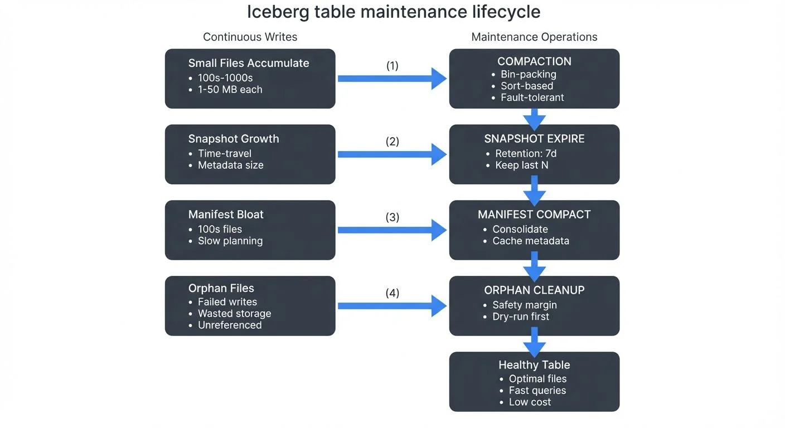

# Maintaining Iceberg Tables: Compaction and Cleanup

Apache Iceberg's time-travel capabilities and transactional guarantees come with a maintenance cost: small files, expired snapshots, and orphan data files can accumulate over time. Without proper maintenance, these artifacts degrade query performance, inflate storage costs, and complicate metadata management. This article explores the essential maintenance procedures that keep Iceberg tables healthy and performant in production environments.

For foundational understanding of Iceberg's architecture and how maintenance relates to metadata layers, see [Iceberg Table Architecture: Metadata and Snapshots](https://conduktor.io/glossary/iceberg-table-architecture-metadata-and-snapshots). For broader lakehouse context, refer to [Introduction to Lakehouse Architecture](https://conduktor.io/glossary/introduction-to-lakehouse-architecture).



<!-- ORIGINAL_DIAGRAM
```
┌─────────────────────────────────────────────────────────────────┐
│           ICEBERG TABLE MAINTENANCE LIFECYCLE                   │
└─────────────────────────────────────────────────────────────────┘

  Continuous Writes          Maintenance Operations
        ▼                           ▼
┌─────────────────┐         ┌──────────────────┐
│  Small Files    │──(1)───▶│   COMPACTION     │
│ Accumulate      │         │  • Bin-packing   │
│ • 100s-1000s    │         │  • Sort-based    │
│ • 1-50 MB each  │         │  • Fault-tolerant│
└─────────────────┘         └────────┬─────────┘
                                     │
┌─────────────────┐                  ▼
│  Snapshot       │         ┌──────────────────┐
│  Growth         │──(2)───▶│SNAPSHOT EXPIRE   │
│ • Time-travel   │         │ • Retention: 7d  │
│ • Metadata size │         │ • Keep last N    │
└─────────────────┘         └────────┬─────────┘
                                     │
┌─────────────────┐                  ▼
│  Manifest       │         ┌──────────────────┐
│  Bloat          │──(3)───▶│MANIFEST COMPACT  │
│ • 100s files    │         │ • Consolidate    │
│ • Slow planning │         │ • Cache metadata │
└─────────────────┘         └────────┬─────────┘
                                     │
┌─────────────────┐                  ▼
│  Orphan Files   │         ┌──────────────────┐
│ • Failed writes │──(4)───▶│ ORPHAN CLEANUP   │
│ • Wasted storage│         │ • Safety margin  │
│ • Unreferenced  │         │ • Dry-run first  │
└─────────────────┘         └────────┬─────────┘
                                     │
                                     ▼
                            ┌──────────────────┐
                            │  Healthy Table   │
                            │ • Optimal files  │
                            │ • Fast queries   │
                            │ • Low cost       │
                            └──────────────────┘
```
-->

## Understanding Iceberg's Maintenance Challenges

### Small File Problem

Iceberg tables can accumulate numerous small files through incremental writes, streaming ingestion, or high-frequency updates. Each insert operation typically creates new data files rather than modifying existing ones, following Iceberg's immutable file design. While this approach enables ACID transactions and time travel, it leads to several performance issues:

- **Query overhead**: Reading hundreds of small files is slower than reading fewer large files due to I/O overhead and metadata processing
- **Planning latency**: Query planning time increases with the number of files the optimizer must evaluate
- **Cloud storage costs**: Object storage systems often charge per-request, making small files expensive to read

### Metadata Growth

Every commit to an Iceberg table creates a new snapshot, capturing the table's state at that point in time. Each snapshot references manifest files, which in turn reference data files. Over time, this metadata accumulates (for detailed architecture, see [Iceberg Table Architecture: Metadata and Snapshots](https://conduktor.io/glossary/iceberg-table-architecture-metadata-and-snapshots)):

- Snapshot history grows linearly with commit frequency
- Manifest files accumulate faster in tables with frequent schema evolution or partition changes
- Metadata JSON files can reach sizes that impact table loading performance

### Orphan Files

Orphan files are data files present in table storage but not referenced by any snapshot. They arise from:

- **Failed writes**: Transactions that write files but fail before committing metadata
- **Concurrent operations**: Race conditions in distributed systems
- **Improper cleanup**: Manual interventions or external tools modifying table storage

Orphan files waste storage but don't affect correctness since Iceberg never reads unreferenced files.

## Compaction: Consolidating Small Files

Compaction merges small data files into larger ones, optimizing file sizes for query performance. Iceberg provides two compaction strategies: **bin-packing** and **sorting**.

### Bin-Packing Compaction

Bin-packing groups small files together without changing data order (like packing items efficiently into bins), making it ideal for tables where write order matters or when you want a fast compaction process.

```sql
-- Spark SQL: Rewrite small files using bin-packing
CALL catalog.system.rewrite_data_files(
  table => 'db.events',
  strategy => 'binpack',
  options => map(
    'target-file-size-bytes', '536870912',  -- 512 MB target
    'min-input-files', '5'                   -- Only rewrite partitions with 5+ files
  )
);
```

```python
# PySpark: Programmatic compaction with filtering
from pyspark.sql import SparkSession

spark = SparkSession.builder.appName("compaction").getOrCreate()

# Compact specific partitions
spark.sql("""
  CALL catalog.system.rewrite_data_files(
    table => 'db.events',
    strategy => 'binpack',
    where => 'event_date >= current_date() - 7'
  )
""")
```

### Sort-Based Compaction

Sort-based compaction rewrites data in a sorted order, improving query performance through better data clustering and predicate pushdown. This is particularly valuable for tables with frequent range queries.

```sql
-- Compact and sort by frequently queried columns
-- Choose sort columns based on your most common WHERE clauses and JOIN keys
CALL catalog.system.rewrite_data_files(
  table => 'db.user_events',
  strategy => 'sort',
  sort_order => 'user_id, event_timestamp',  -- Sort by filter/join columns
  options => map('target-file-size-bytes', '536870912')
);
```

### Fault-Tolerant Compaction (Iceberg 1.6+)

For large tables or long-running compaction jobs, Iceberg 1.6+ supports **partial progress mode**, which commits work incrementally to prevent data loss if the operation fails partway through:

```sql
-- Enable partial progress for fault-tolerant compaction
CALL catalog.system.rewrite_data_files(
  table => 'db.large_events',
  strategy => 'binpack',
  options => map(
    'target-file-size-bytes', '536870912',
    'partial-progress.enabled', 'true',         -- Commit progress incrementally
    'partial-progress.max-commits', '10'        -- Commit every 10 file groups
  )
);
```

Partial progress mode is essential for production environments with:
- Tables containing millions of small files
- Resource-constrained compaction windows
- Cloud environments with spot instances that may be interrupted
- Distributed compaction across multiple partitions

### Compaction Best Practices

- **Schedule during low-traffic periods**: Compaction is resource-intensive and benefits from dedicated compute resources
- **Partition-aware compaction**: Use `where` clauses to compact only recently modified partitions
- **Monitor file sizes**: Set target file sizes based on your query patterns (typically 256 MB to 1 GB)
- **Combine with snapshot expiration**: Compact first, then expire snapshots to maximize cleanup

## Expiring Snapshots

Snapshot expiration removes old snapshots and their associated metadata files, reclaiming storage and preventing unbounded metadata growth.

```sql
-- Expire snapshots older than 7 days
CALL catalog.system.expire_snapshots(
  table => 'db.events',
  older_than => TIMESTAMP '2025-11-30 00:00:00',
  retain_last => 10  -- Always keep at least 10 snapshots
);
```

```python
# PySpark: Expire snapshots with retention period
spark.sql("""
  CALL catalog.system.expire_snapshots(
    table => 'db.events',
    older_than => current_timestamp() - INTERVAL '7' DAY,
    retain_last => 5,
    max_concurrent_deletes => 10  -- Parallel file deletion threads
  )
""")
```

### Retention Considerations

- **Compliance requirements**: Ensure retention periods satisfy audit and regulatory needs
- **Time-travel dependencies**: Don't expire snapshots that downstream consumers rely on for incremental processing
- **Snapshot metadata size**: Check metadata directory sizes to determine aggressive expiration schedules

```sql
-- Query snapshot history to understand retention needs
SELECT
  snapshot_id,
  committed_at,
  operation,
  summary
FROM db.events.snapshots
ORDER BY committed_at DESC
LIMIT 20;
```

## Removing Orphan Files

Orphan file removal identifies and deletes files not referenced by any valid snapshot. This operation is safe only after ensuring no concurrent writes are occurring.

```sql
-- Remove orphan files older than 3 days (safety margin)
CALL catalog.system.remove_orphan_files(
  table => 'db.events',
  older_than => TIMESTAMP '2025-12-04 00:00:00',
  location => 's3://bucket/warehouse/db/events'
);
```

```python
# PySpark: Dry-run to preview orphan files
result = spark.sql("""
  CALL catalog.system.remove_orphan_files(
    table => 'db.events',
    older_than => current_timestamp() - INTERVAL '3' DAY,
    dry_run => true
  )
""")

result.show()
```

### Safety Guidelines

- **Use safety margins**: Only delete files older than your longest-running transaction or write operation
- **Run during maintenance windows**: Ensure no active writers exist when removing orphans
- **Test with dry-run**: Always preview deletions before executing
- **Backup metadata**: Maintain metadata backups before aggressive cleanup operations

## Compacting Manifest Files

While data file compaction addresses the small file problem, **manifest files themselves can also accumulate** and slow down query planning. Each write operation creates new manifest files that track data file changes. Over time, tables with frequent writes accumulate hundreds or thousands of small manifest files.

### Understanding Manifest Bloat

Manifest files contain metadata about data files (paths, row counts, partition values, column statistics). When query engines plan queries, they must read all relevant manifest files to determine which data files to scan. Too many small manifest files cause:

- **Slow query planning**: Reading thousands of small manifest files sequentially
- **Metadata overhead**: Storing many small objects inefficiently in cloud storage
- **Cache inefficiency**: Limited manifest caching with fragmented metadata

### Manifest Compaction Procedure

Iceberg provides `rewrite_manifests` to consolidate small manifest files:

```sql
-- Compact manifest files (Iceberg 1.3+)
CALL catalog.system.rewrite_manifests(
  table => 'db.events',
  use_caching => true  -- Cache manifest contents during rewrite
);
```

```python
# PySpark: Manifest compaction with filtering
from pyspark.sql import SparkSession

spark = SparkSession.builder.appName("manifest_compaction").getOrCreate()

# Compact manifests for specific partitions
spark.sql("""
  CALL catalog.system.rewrite_manifests(
    table => 'db.events',
    use_caching => true
  )
""")
```

### When to Compact Manifests

Monitor manifest file counts and schedule compaction when:

- Query planning times increase noticeably
- Tables have more than 100 manifest files per snapshot
- Frequent small writes create many single-file manifests
- After large bulk operations (imports, migrations)

```sql
-- Check manifest file count
SELECT COUNT(*) as manifest_count
FROM db.events.manifests
WHERE added_snapshot_id = (SELECT MAX(snapshot_id) FROM db.events.snapshots);
```

Manifest compaction is particularly important for streaming tables with high write frequency, where each micro-batch creates new manifest files.

## Streaming Ecosystem Integration

Iceberg maintenance becomes more critical in streaming environments where continuous writes amplify small file and metadata growth.

### Spark Structured Streaming Maintenance

```python
from pyspark.sql.streaming import StreamingQuery

# Streaming write with periodic compaction trigger
query = (
    stream_df
    .writeStream
    .format("iceberg")
    .outputMode("append")
    .option("checkpointLocation", "s3://bucket/checkpoints/events")
    .trigger(processingTime="5 minutes")
    .toTable("db.events")
)

# Separate maintenance job
def maintain_table():
    spark.sql("""
      CALL catalog.system.rewrite_data_files(
        table => 'db.events',
        strategy => 'binpack',
        where => 'event_hour >= current_timestamp() - INTERVAL 2 HOUR'
      )
    """)

# Schedule maintenance every hour
from apscheduler.schedulers.background import BackgroundScheduler
scheduler = BackgroundScheduler()
scheduler.add_job(maintain_table, 'interval', hours=1)
scheduler.start()
```

### Flink Integration

Apache Flink 1.18+ provides native Iceberg maintenance actions through the `FlinkActions` API, enabling programmatic compaction integrated with your streaming jobs:

```java
// Flink 1.18+: Programmatic maintenance with FlinkActions
import org.apache.iceberg.flink.actions.Actions;
import org.apache.iceberg.catalog.TableIdentifier;
import org.apache.flink.table.api.bridge.java.StreamTableEnvironment;

StreamTableEnvironment tableEnv = // ... your table environment

// Load the Iceberg table
Table icebergTable = catalog.loadTable(TableIdentifier.of("db", "events"));

// Configure and execute compaction action
Actions.forTable(icebergTable)
    .rewriteDataFiles()
    .option("target-file-size-bytes", "536870912")      // 512 MB target
    .option("min-input-files", "5")                      // Only compact partitions with 5+ files
    .option("use-starting-sequence-number", "true")      // Incremental compaction
    .execute();
```

For tables with write-time configuration, you can also set target file sizes in table properties:

```sql
-- Configure target file sizes at table creation
CREATE TABLE events (
  event_id STRING,
  user_id BIGINT,
  event_time TIMESTAMP(3),
  payload STRING
) WITH (
  'connector' = 'iceberg',
  'catalog-name' = 'iceberg_catalog',
  'write.upsert.enabled' = 'true',
  'write.target-file-size-bytes' = '134217728',  -- 128 MB target for writes
  'commit.manifest.target-size-bytes' = '8388608'  -- 8 MB manifest target
);
```

Note that write-time configuration minimizes small files during ingestion but doesn't eliminate the need for periodic compaction as data patterns and partition distributions change over time.

### Governance and Visibility with Conduktor

In organizations managing multiple Iceberg tables across streaming pipelines, visibility into table health becomes critical. When Kafka streams feed Iceberg tables through Flink or Spark, **Conduktor** provides comprehensive governance capabilities that ensure data quality and operational health:

**Kafka-to-Iceberg Pipeline Monitoring:**
- **End-to-end latency tracking**: Monitor time from Kafka ingestion through Iceberg commit using [Conduktor's topic monitoring](https://docs.conduktor.io/guide/manage-kafka/kafka-resources/topics), identifying bottlenecks in streaming writes
- **Consumer lag monitoring**: Track Flink/Spark consumer lag to detect when compaction jobs slow down streaming ingestion
- **Data quality validation**: Enforce schema contracts and validation rules with [Schema Registry integration](https://docs.conduktor.io/guide/manage-kafka/kafka-resources/schema-registry) on Kafka messages before they reach Iceberg tables
- **Throughput analysis**: Measure messages per second and file creation rates to optimize micro-batch sizes using [Kafka Connect monitoring](https://docs.conduktor.io/guide/manage-kafka/kafka-resources/kafka-connect)

**Table Health Management:**
- **Small file detection**: Alert when Iceberg partitions exceed thresholds (e.g., more than 100 files under 10MB)
- **Snapshot growth monitoring**: Track snapshot accumulation rate and alert when retention policies may be insufficient
- **Maintenance job observability**: Log all compaction, expiration, and cleanup operations with execution duration and files affected
- **Cost tracking**: Correlate cloud storage costs with table file counts and maintenance schedules

**Chaos Testing with Conduktor Gateway:**
- **Simulate Kafka broker failures**: Test how streaming-to-Iceberg pipelines handle broker outages and consumer rebalancing
- **Inject latency**: Validate that compaction jobs don't interfere with time-sensitive streaming ingestion
- **Test exactly-once guarantees**: Verify that Flink checkpoints and Iceberg commits maintain consistency during failures

**Compliance and Auditing:**
- **Data lineage tracking**: Trace data from Kafka topic partitions through Iceberg snapshots to query results
- **Access auditing**: Log which users and applications query specific Iceberg snapshots, critical for GDPR and compliance
- **Retention policy enforcement**: Automate snapshot expiration aligned with regulatory requirements

This governance layer is essential when multiple teams manage different parts of the streaming-to-lakehouse pipeline—ensuring that developers can iterate quickly while maintaining production reliability.

## Branch-Specific Maintenance (Iceberg 1.5+)

Iceberg 1.5+ introduced **branches and tags**, enabling Git-like version management for tables. Each branch maintains its own snapshot lineage and can have **independent retention policies**, making branches ideal for development, testing, and experimental workflows without affecting production data.

### Maintenance Operations on Branches

Branches require separate maintenance from the main table, allowing teams to manage staging and production environments independently:

```sql
-- Expire snapshots only on the experimental branch
CALL catalog.system.expire_snapshots(
  table => 'db.events',
  branch => 'experimental',
  older_than => TIMESTAMP '2025-12-10 00:00:00',
  retain_last => 3  -- Keep fewer snapshots on experimental branches
);

-- Compact data files on a specific branch
CALL catalog.system.rewrite_data_files(
  table => 'db.events',
  branch => 'staging',
  strategy => 'binpack',
  options => map('target-file-size-bytes', '536870912')
);

-- Remove orphan files specific to a branch's history
CALL catalog.system.remove_orphan_files(
  table => 'db.events',
  branch => 'dev',
  older_than => TIMESTAMP '2025-12-14 00:00:00'
);
```

### Branch Maintenance Patterns

**Development branches** (short-lived, aggressive cleanup):
- Expire snapshots older than 24 hours
- Retain only last 5 snapshots
- Run orphan cleanup after every merge to main

**Staging branches** (moderate retention):
- Expire snapshots older than 7 days
- Retain last 20 snapshots for debugging
- Weekly compaction aligned with test cycles

**Production (main branch)** (long retention for compliance):
- Expire snapshots older than 90 days (or compliance requirement)
- Retain last 100 snapshots
- Daily compaction during low-traffic windows

### Cleaning Up Merged Branches

After fast-forwarding or merging a branch to main, the branch's exclusive snapshots become orphaned. Clean them up explicitly:

```sql
-- Drop a branch after merging to main
ALTER TABLE db.events DROP BRANCH IF EXISTS experimental;

-- This marks branch-exclusive snapshots for expiration
-- Run orphan cleanup to reclaim storage
CALL catalog.system.remove_orphan_files(
  table => 'db.events',
  older_than => current_timestamp() - INTERVAL '3' DAY
);
```

### Use Cases for Branch-Specific Maintenance

- **Isolated testing**: Create a `test` branch, run experiments, compact aggressively, then drop the branch without affecting main
- **Cost optimization**: Apply aggressive retention on ephemeral branches to minimize storage costs
- **Compliance isolation**: Keep production snapshots for regulatory periods while cleaning up dev/test branches frequently
- **Multi-tenant tables**: Different teams manage their own branches with customized maintenance schedules

Branch-specific maintenance is essential for organizations adopting data-as-code workflows, where table branches mirror software development branch strategies.

## When to Perform Maintenance

Knowing when tables need maintenance prevents both over-maintenance (wasting compute) and under-maintenance (degrading performance). Monitor these signals to trigger maintenance operations:

### Signals for Data File Compaction

**Small File Indicators:**
```sql
-- Check average file size and count
SELECT
  COUNT(*) as file_count,
  AVG(file_size_in_bytes) / 1024 / 1024 as avg_size_mb,
  COUNT(CASE WHEN file_size_in_bytes < 10485760 THEN 1 END) as files_under_10mb
FROM db.events.files
WHERE file_size_in_bytes > 0;
```

**Trigger compaction when:**
- More than 30% of files are under 10MB
- Average file size drops below 100MB (for typical analytical workloads)
- A single partition contains more than 100 files
- Query planning time increases by more than 20% compared to baseline

**Cost indicators:**
- Cloud storage request costs spike (common with many small files)
- Query execution time increases despite same data volume

### Signals for Snapshot Expiration

**Snapshot Growth Indicators:**
```sql
-- Count snapshots and check age
SELECT
  COUNT(*) as snapshot_count,
  MIN(committed_at) as oldest_snapshot,
  MAX(committed_at) as newest_snapshot,
  DATEDIFF('day', MIN(committed_at), MAX(committed_at)) as retention_days
FROM db.events.snapshots;
```

**Trigger expiration when:**
- More than 500 snapshots exist (impacts metadata loading)
- Oldest snapshot exceeds compliance retention requirements
- Metadata directory size exceeds 500MB
- Table loading time increases noticeably

**Balance considerations:**
- Compliance: Regulatory requirements may mandate minimum retention
- Time travel dependencies: Downstream jobs may need historical snapshots
- Debugging: Recent snapshots help troubleshoot data issues

### Signals for Manifest Compaction

**Manifest Bloat Indicators:**
```sql
-- Check manifest file count and sizes
SELECT
  COUNT(*) as manifest_count,
  AVG(LENGTH) / 1024 as avg_size_kb,
  COUNT(CASE WHEN added_data_files_count = 1 THEN 1 END) as single_file_manifests
FROM db.events.manifests
WHERE added_snapshot_id = (SELECT MAX(snapshot_id) FROM db.events.snapshots);
```

**Trigger manifest compaction when:**
- More than 100 manifest files exist in current snapshot
- Over 50% of manifests track only 1-2 data files
- Query planning time exceeds 5 seconds consistently
- After major bulk operations (imports, schema changes)

### Signals for Orphan File Cleanup

**Orphan Indicators:**
```sql
-- Compare storage size to tracked files (run via cloud CLI)
-- AWS example: aws s3 ls s3://bucket/warehouse/db/events/data/ --recursive --summarize

-- Compare to Iceberg's tracked size
SELECT SUM(file_size_in_bytes) / 1024 / 1024 / 1024 as tracked_size_gb
FROM db.events.files;
```

**Trigger orphan cleanup when:**
- Storage size exceeds tracked file size by more than 10%
- After failed write operations or job cancellations
- Weekly or monthly as a preventive measure
- Before major cost optimization reviews

### Monitoring Dashboard Metrics

Set up monitoring dashboards tracking:
- **File count trends**: Growing file count suggests compaction needed
- **Average file size trends**: Declining size indicates small file accumulation
- **Query planning time**: Increasing duration signals metadata bloat
- **Snapshot count**: Unbounded growth requires expiration
- **Storage costs**: Spikes correlate with maintenance gaps

**Recommended alert thresholds:**
- File count growth rate: >10% per day for 3 consecutive days
- Average file size: <50MB for tables with >1000 files
- Query planning time: >3 seconds for simple SELECT COUNT(*) queries
- Snapshot count: >300 for frequently updated tables

## Maintenance Automation and Scheduling

Production Iceberg deployments require automated maintenance schedules to prevent degradation.

### Airflow DAG Example

```python
from airflow import DAG
from airflow.providers.apache.spark.operators.spark_submit import SparkSubmitOperator
from datetime import datetime, timedelta

default_args = {
    'owner': 'data-platform',
    'depends_on_past': False,
    'start_date': datetime(2025, 12, 1),
    'retries': 2,
    'retry_delay': timedelta(minutes=5)
}

dag = DAG(
    'iceberg_maintenance',
    default_args=default_args,
    schedule_interval='0 2 * * *',  # Daily at 2 AM
    catchup=False
)

compact_task = SparkSubmitOperator(
    task_id='compact_events_table',
    application='/path/to/compact.py',
    conf={
        'spark.sql.catalog.iceberg': 'org.apache.iceberg.spark.SparkCatalog',
        'spark.sql.catalog.iceberg.type': 'hive'
    },
    dag=dag
)

expire_task = SparkSubmitOperator(
    task_id='expire_snapshots',
    application='/path/to/expire.py',
    dag=dag
)

orphan_task = SparkSubmitOperator(
    task_id='remove_orphans',
    application='/path/to/orphan_cleanup.py',
    dag=dag
)

compact_task >> expire_task >> orphan_task
```

### Maintenance Sequence

Always perform maintenance operations in this order:

1. **Compaction**: Consolidate small files first
2. **Manifest compaction**: Consolidate manifest files after data compaction
3. **Snapshot expiration**: Remove old snapshots that reference old small files
4. **Orphan cleanup**: Delete unreferenced files after snapshots are expired

This sequence ensures maximum storage reclamation while maintaining data integrity.

### Operational Considerations

**Duration and Resource Planning:**

Maintenance operations consume significant compute and I/O resources. Plan accordingly:

- **Compaction duration**: Typically 1-2 minutes per GB of data being rewritten. A 500GB partition may take 8-16 hours depending on cluster size and parallelism.
- **Snapshot expiration**: Fast metadata-only operation, usually completes in seconds to minutes regardless of table size.
- **Manifest compaction**: Quick metadata operation, typically under 5 minutes even for large tables.
- **Orphan cleanup**: I/O intensive, requires listing all files in table storage. Can take hours for tables with millions of files.

**Compute Costs:**

- Compaction reads and rewrites data, costing 2x I/O (read + write) plus compute time
- Use autoscaling clusters or spot instances for cost-effective maintenance
- Schedule during off-peak hours to leverage lower cloud pricing
- Consider dedicated maintenance clusters to avoid resource contention with production queries

**Query Availability During Maintenance:**

Iceberg's MVCC (Multi-Version Concurrency Control) architecture allows queries to continue during maintenance:

- **Read queries**: Continue unaffected, reading existing snapshots while maintenance creates new ones
- **Write queries**: May experience brief contention during snapshot commits but remain available
- **Time travel**: Historical snapshots remain queryable until explicitly expired
- **Zero downtime**: No need for maintenance windows or table locks

**Rollback and Recovery:**

If maintenance fails or produces unexpected results:

```sql
-- Rollback to a previous snapshot if needed
CALL catalog.system.rollback_to_snapshot('db.events', <snapshot_id_before_maintenance>);

-- Check recent snapshots to find the right restore point
SELECT snapshot_id, committed_at, operation, summary
FROM db.events.snapshots
ORDER BY committed_at DESC
LIMIT 10;
```

**Best Practices:**
- Run dry-run mode first for orphan cleanup
- Test maintenance procedures on non-production tables
- Monitor job progress and set up alerts for failures
- Document baseline metrics (file counts, query times) before maintenance
- Keep at least 2-3 snapshots before major maintenance operations for easy rollback

## Summary

Maintaining Iceberg tables through compaction, snapshot expiration, manifest compaction, and orphan file cleanup is essential for production deployments. **Data file compaction** addresses the small file problem through bin-packing or sort-based strategies, with Iceberg 1.6+ introducing fault-tolerant partial progress mode for long-running jobs. **Manifest compaction** prevents query planning slowdowns by consolidating metadata files. **Snapshot expiration** prevents unbounded metadata growth while respecting time-travel requirements and compliance needs. **Orphan file removal** reclaims wasted storage from failed writes and concurrent operations.

Iceberg 1.5+ **branch-specific maintenance** enables independent retention policies for development, staging, and production environments, aligning data maintenance with software development workflows. Branches allow aggressive cleanup on experimental tables while maintaining long retention for compliance on production data.

In streaming environments, maintenance becomes more critical as continuous writes amplify these challenges. Modern integrations like **Flink 1.18+ Actions API** enable programmatic maintenance alongside streaming ingestion. Platforms like **Conduktor** provide comprehensive governance for Kafka-to-Iceberg pipelines, monitoring table health metrics, enforcing data quality, and enabling chaos testing to validate pipeline resilience.

**When to perform maintenance** is as important as how—monitor file counts, average file sizes, query planning times, and snapshot growth to trigger maintenance proactively. Set up dashboards tracking these metrics and automate maintenance through orchestration platforms like Airflow, triggering operations based on concrete thresholds rather than arbitrary schedules.

Understanding **operational considerations**—duration, compute costs, and query availability—ensures maintenance operations run efficiently without disrupting production workloads. Iceberg's MVCC architecture enables zero-downtime maintenance, allowing queries to continue uninterrupted while compaction and cleanup proceed in the background.

By following the best practices and automation patterns outlined here, data platform teams can maintain Iceberg tables efficiently while optimizing for both performance and cost. Regular maintenance transforms Iceberg from a powerful but maintenance-heavy table format into a truly production-grade foundation for modern data lakehouses.

## Related Concepts

- [Data Pipeline Orchestration with Streaming](/data-pipeline-orchestration-with-streaming)
- [Kafka Connect: Building Data Integration Pipelines](/kafka-connect-building-data-integration-pipelines)
- [Real-Time Analytics with Streaming Data](/real-time-analytics-with-streaming-data)

## Related Articles

- [Iceberg Table Architecture: Metadata and Snapshots](https://conduktor.io/glossary/iceberg-table-architecture-metadata-and-snapshots) - Understanding Iceberg's internal architecture
- [Apache Iceberg](https://conduktor.io/glossary/apache-iceberg) - Comprehensive overview of Iceberg features
- [Introduction to Lakehouse Architecture](https://conduktor.io/glossary/introduction-to-lakehouse-architecture) - Lakehouse fundamentals and ecosystem
- [Time Travel with Apache Iceberg](https://conduktor.io/glossary/time-travel-with-apache-iceberg) - Advanced time travel and snapshot management
- [Schema Evolution in Apache Iceberg](https://conduktor.io/glossary/schema-evolution-in-apache-iceberg) - Managing schema changes safely
- [Iceberg Partitioning and Performance Optimization](https://conduktor.io/glossary/iceberg-partitioning-and-performance-optimization) - Partitioning strategies

## Sources and References

- [Apache Iceberg Documentation: Maintenance](https://iceberg.apache.org/docs/latest/maintenance/)
- [Apache Iceberg: Spark Procedures](https://iceberg.apache.org/docs/latest/spark-procedures/)
- [Apache Iceberg 1.6.0 Release Notes: Partial Progress Support](https://iceberg.apache.org/releases/#160-release)
- [Apache Iceberg 1.5.0 Release Notes: Branches and Tags](https://iceberg.apache.org/releases/#150-release)
- [Apache Flink 1.18 Iceberg Connector Documentation](https://nightlies.apache.org/flink/flink-docs-release-1.18/docs/connectors/table/iceberg/)
- [Netflix Tech Blog: Managing Apache Iceberg Tables](https://netflixtechblog.com/apache-iceberg-managing-data-files-at-scale-7465e2f5d9e9)
- [Tabular: Iceberg Table Maintenance Best Practices](https://tabular.io/blog/table-maintenance/)
- [Apache Iceberg GitHub: Maintenance Actions](https://github.com/apache/iceberg/tree/master/spark/v3.3/spark/src/main/java/org/apache/iceberg/actions)
