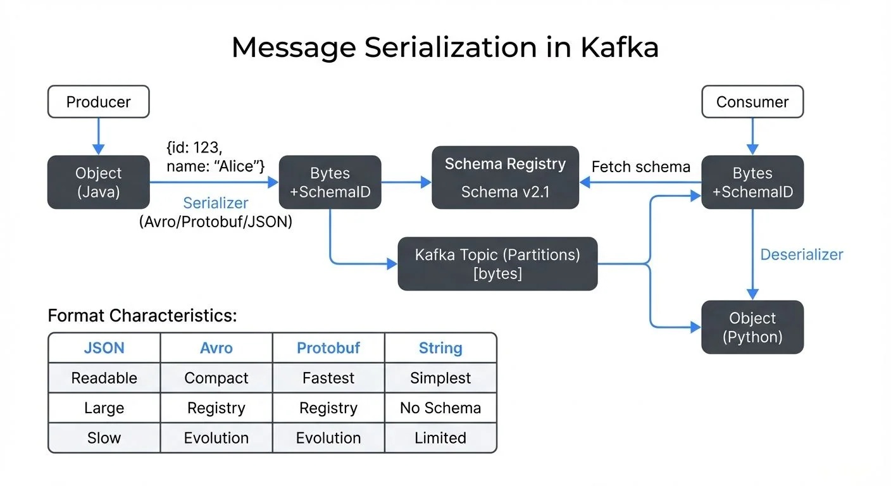

## What is Serialization and Why Does It Matter?

Serialization is the process of converting data structures or objects into a byte format that can be transmitted over a network or stored on disk. Deserialization is the reverse process—reconstructing the original data structure from bytes.

In [Apache Kafka](https://conduktor.io/glossary/apache-kafka), every message is stored and transmitted as an array of bytes. This means that before a [producer](https://conduktor.io/glossary/kafka-producers) sends a message to Kafka, it must serialize the data. Similarly, when a consumer reads a message, it must deserialize those bytes back into a meaningful data structure.

The choice of serialization format affects multiple critical aspects of your streaming architecture: message size, processing speed, schema evolution capabilities, interoperability between systems, and developer productivity.



<!-- ORIGINAL_DIAGRAM
```
┌─────────────────────────────────────────────────────────────────┐
│            KAFKA MESSAGE SERIALIZATION FLOW                     │
└─────────────────────────────────────────────────────────────────┘

  Producer                                           Consumer
     │                                                   │
     ▼                                                   │
┌──────────┐                                            │
│  Object  │  {id: 123,                                 │
│  (Java)  │   name: "Alice"}                           │
└────┬─────┘                                            │
     │                                                   │
     │ Serializer                                        │
     │ (Avro/Protobuf/JSON)                             │
     ▼                                                   │
┌──────────┐    ┌────────────────┐                      │
│  Bytes   │───▶│Schema Registry │                      │
│ +SchemaID│    │  Schema v2.1   │                      │
└────┬─────┘    └────────────────┘                      │
     │                   │                              │
     │                   │ Fetch schema                 │
     ▼                   │                              │
┌─────────────┐          │                         ┌────▼─────┐
│ Kafka Topic │          └────────────────────────▶│  Bytes   │
│ (Partitions)│                                    │+SchemaID │
│  [bytes]    │                                    └────┬─────┘
└─────────────┘                                         │
                                                        │ Deserializer
                                                        │
                                                        ▼
                                                   ┌──────────┐
                                                   │  Object  │
                                                   │ (Python) │
                                                   └──────────┘

    Format Characteristics:
    ┌──────────┬──────────┬──────────┬──────────┐
    │   JSON   │   Avro   │ Protobuf │  String  │
    ├──────────┼──────────┼──────────┼──────────┤
    │ Readable │  Compact │ Fastest  │ Simplest │
    │ Large    │ Registry │ Registry │ No Schema│
    │ Slow     │ Evolution│ Evolution│ Limited  │
    └──────────┴──────────┴──────────┴──────────┘
```
-->

## How Kafka Uses Serialization

Kafka itself is agnostic to the content of your messages. It treats both keys and values as byte arrays. The responsibility for serialization and deserialization falls on producers and consumers through serializers and deserializers (often called "serdes").

When configuring a Kafka producer, you specify two serializers (often called "serdes"—a shorthand for serializers/deserializers):

```java
properties.put("key.serializer", "org.apache.kafka.common.serialization.StringSerializer");
properties.put("value.serializer", "org.apache.kafka.common.serialization.ByteArraySerializer");
// For Avro with Schema Registry, use schema-aware serializers:
// properties.put("value.serializer", "io.apicurio.registry.serde.avro.AvroKafkaSerializer");
```

Similarly, consumers specify deserializers:

```java
properties.put("key.deserializer", "org.apache.kafka.common.serialization.StringDeserializer");
properties.put("value.deserializer", "org.apache.kafka.common.serialization.ByteArrayDeserializer");
// For Avro with Schema Registry:
// properties.put("value.deserializer", "io.apicurio.registry.serde.avro.AvroKafkaDeserializer");
```

This decoupling allows different applications to use different serialization formats, though consistency across producers and consumers of the same topic is essential to avoid deserialization failures.

## Common Serialization Formats

Here's a quick comparison to help you choose the right format:

| Feature | String/Primitives | JSON | Avro | Protobuf |
|---------|------------------|------|------|----------|
| **Message Size** | Small | Large (2-3x binary) | Compact | Most compact |
| **Human Readable** | Yes | Yes | No | No |
| **Schema Evolution** | None | Limited | Excellent | Excellent |
| **Serialization Speed** | Fastest | Slow | Fast | Fastest |
| **Schema Registry** | Not needed | Optional | Required | Required |
| **Code Generation** | No | No | Optional | Yes |
| **Best For** | Simple values | APIs, debugging | Data pipelines | Microservices |
| **2025 Compression** | N/A | Zstd | Zstd | Zstd |

### String and Primitive Types

The simplest approach is using Kafka's built-in serializers for strings, integers, and other primitive types. This works well for simple use cases but lacks structure and schema enforcement.

**Use case**: Log messages, simple metrics, prototype development.

### JSON

JSON is human-readable, widely supported, and familiar to most developers. However, it comes with significant drawbacks: larger message sizes due to field name repetition, no built-in schema enforcement, and slower parsing compared to binary formats.

**Use case**: External APIs, when human readability during debugging is prioritized, initial development phases.

### Apache Avro

Avro is a binary serialization format that separates schema from data. Messages contain only the values, making them compact. Schemas are typically stored in a [Schema Registry](https://conduktor.io/glossary/schema-registry-and-schema-management), and messages reference the schema by ID.

Avro supports rich schema evolution rules, allowing you to add fields with defaults, remove optional fields, and maintain backward and forward compatibility. This makes it ideal for long-lived streaming applications where schemas evolve over time. For detailed comparison with other formats, see [Avro vs Protobuf vs JSON Schema](https://conduktor.io/glossary/avro-vs-protobuf-vs-json-schema).

**Use case**: High-throughput data pipelines, analytics platforms, event-driven architectures requiring schema evolution.

### Protocol Buffers (Protobuf)

Protobuf is Google's binary serialization format. It offers excellent performance and compact message sizes. Like Avro, it requires schema definition files (.proto files) and supports schema evolution, though with slightly different compatibility rules.

**Use case**: Microservices architectures, polyglot environments, systems requiring cross-language compatibility.

## Schema Evolution and Compatibility

One of the most challenging aspects of distributed systems is managing schema changes over time. As your business evolves, you'll need to add new fields, deprecate old ones, or change data types.

Consider this real-world scenario: You have a `CustomerOrder` event with fields `orderId`, `customerId`, and `amount`. Six months later, you need to add a `discount` field.

With Avro, you can add this field with a default value (e.g., 0.0). Old consumers that don't know about the discount field will continue working. New consumers can read both old messages (using the default) and new messages (with the actual discount value). This is **backward compatibility**.

**Forward compatibility** means old consumers can read messages produced by new producers, even if those messages have fields the consumer doesn't know about. The [Schema Registry](https://conduktor.io/glossary/schema-registry-and-schema-management) enforces compatibility rules to prevent breaking changes.

A Schema Registry typically supports four compatibility modes:

- **BACKWARD**: New schema can read old data
- **FORWARD**: Old schema can read new data
- **FULL**: Both backward and forward compatible
- **NONE**: No compatibility checking

For comprehensive guidance on managing schema changes safely, see [Schema Evolution Best Practices](https://conduktor.io/glossary/schema-evolution-best-practices).

Without proper schema management, you risk runtime errors, data loss, or forcing synchronized deployments across all producers and consumers—a significant operational burden.

## Performance and Operational Considerations

Different serialization formats have distinct performance characteristics:

**Message Size**: Binary formats like Avro and Protobuf are significantly smaller than JSON. In a high-throughput system processing millions of messages per second, this translates to reduced network bandwidth and storage costs. A JSON message might be 2-3x larger than its Avro equivalent.

**Compression (2025 Recommendations)**: Modern Kafka deployments should use **Zstd compression** (available since Kafka 2.1+), which provides 20-30% better compression ratios than gzip with similar CPU usage. Combined with binary serialization formats, Zstd offers optimal throughput-to-storage tradeoffs. Configure compression at the producer level with `compression.type=zstd`.

**Serialization/Deserialization Speed**: Binary formats are generally faster to serialize and deserialize because they avoid text parsing. However, the difference may be negligible compared to network I/O in many applications. In benchmarks, Protobuf typically offers the fastest serialization, followed by Avro, with JSON being 3-5x slower.

**CPU Usage**: JSON parsing is CPU-intensive compared to binary formats, which can impact consumer lag during peak loads. For high-throughput applications (>100k messages/sec per consumer), binary formats significantly reduce CPU overhead.

**Developer Experience**: JSON is easier to debug because you can read messages directly. Binary formats require tools to decode messages. Governance platforms like **Conduktor** provide message viewers that automatically deserialize and display messages in human-readable formats regardless of the underlying serialization, bridging the gap between binary efficiency and developer productivity. For managing schemas in Conduktor, see [Schema Registry Management](https://docs.conduktor.io/guide/manage-kafka/kafka-resources/schema-registry).

## Serialization in Data Streaming Ecosystems

Message serialization is foundational to the broader data streaming ecosystem. Apache Kafka acts as the central nervous system, but data flows through multiple systems—stream processing frameworks like Apache Flink or Kafka Streams, data warehouses, analytics platforms, and microservices.

Choosing a well-supported serialization format ensures interoperability across these systems. Avro's tight integration with [Schema Registry](https://conduktor.io/glossary/schema-registry-and-schema-management) makes it a de facto standard in Kafka-based ecosystems. Protobuf's wide language support makes it popular in polyglot microservices architectures.

Stream processing frameworks like Flink support multiple serialization formats and can automatically handle schema evolution when integrated with a Schema Registry. This enables complex transformations while maintaining data consistency.

When operating Kafka clusters at scale, managing schemas becomes critical. Governance platforms help teams visualize schema evolution, validate compatibility before deployment, and troubleshoot deserialization errors by providing clear visibility into message formats and schema versions across topics.

For example, if a consumer starts failing due to a deserialization error, you can quickly inspect the Schema Registry to identify which schema version changed, compare schemas side-by-side, and determine whether the issue is a compatibility violation or a configuration problem.

## Troubleshooting Serialization Issues

Serialization problems are among the most common issues in Kafka deployments. Here are practical approaches to common scenarios:

### Deserialization Failures

**Symptom**: Consumers throw exceptions like `SerializationException` or `InvalidAvroSchemaException`.

**Common Causes**:
- Schema version mismatch between producer and consumer
- Missing schema in Schema Registry
- Incorrect deserializer configuration
- Corrupted or malformed messages

**Resolution Steps**:
1. Check consumer logs for the specific error and schema ID
2. Verify the schema exists in Schema Registry: `curl http://registry:8081/schemas/ids/{id}`
3. Confirm producer and consumer use compatible serializer/deserializer classes
4. Inspect the problematic message offset using CLI tools or Conduktor's message viewer
5. Validate Schema Registry connectivity from consumer hosts

### Schema Evolution Errors

**Symptom**: Schema Registry rejects new schema versions with compatibility errors.

**Common Causes**:
- Breaking changes (removing required fields, changing types)
- Incorrect compatibility mode for use case
- Missing default values on new fields

**Resolution Steps**:
1. Review compatibility mode: `curl http://registry:8081/config/{subject}`
2. Use schema validation tools to test compatibility before deployment
3. Add default values to new required fields
4. Consider using FULL compatibility mode if producers and consumers upgrade independently
5. For breaking changes, create a new topic and migrate consumers gradually

### Performance Degradation

**Symptom**: High consumer lag, increased CPU usage, or slow message processing.

**Common Causes**:
- Inefficient serialization format (JSON at high volumes)
- Missing compression
- Large message payloads
- Schema Registry connection issues

**Resolution Steps**:
1. Profile serialization/deserialization time in your application
2. Enable Zstd compression if not already configured
3. Consider switching from JSON to Avro or Protobuf for high-throughput topics
4. Implement Schema Registry client-side caching to reduce registry calls
5. For very large messages (>1MB), consider storing payload in object storage and sending references

### Custom Serializers

For specialized requirements, you can implement custom serializers by implementing Kafka's `Serializer` and `Deserializer` interfaces. Common use cases include:

- **Encryption/Decryption**: Transparent field-level encryption during serialization
- **Compression**: Application-level compression before Kafka's transport compression
- **Multi-format support**: Detect format based on magic bytes and route to appropriate deserializer
- **Validation**: Enforce business rules during serialization

**Example custom serializer skeleton**:
```java
public class CustomSerializer implements Serializer<MyObject> {
    @Override
    public void configure(Map<String, ?> configs, boolean isKey) {
        // Initialize with configuration
    }

    @Override
    public byte[] serialize(String topic, MyObject data) {
        // Implement serialization logic
        // Example: encrypt sensitive fields, add headers, etc.
        return serializedBytes;
    }

    @Override
    public void close() {
        // Cleanup resources
    }
}
```

For complex serialization needs, consider using **Conduktor Gateway**, which can intercept messages and apply transformations, encryption, or validation rules without modifying application code.

## Serialization and Kafka Headers

Kafka message headers provide metadata about messages without affecting the serialized payload. Headers are commonly used with serialization for:

**Schema Version Tracking**: Schema-aware serializers automatically embed schema IDs in message headers, allowing consumers to retrieve the correct schema for deserialization without parsing the payload.

**Content Type Identification**: When topics contain messages with multiple serialization formats, a `content-type` header can indicate the format (e.g., `application/avro`, `application/protobuf`), enabling polyglot consumers to route to the appropriate deserializer.

**Tracing and Lineage**: Headers can track serialization metadata like producer application ID, serialization timestamp, and data lineage information for debugging and governance.

**Encryption Metadata**: For encrypted payloads, headers can store encryption algorithm details, key IDs, or initialization vectors needed for decryption.

**Example with headers**:
```java
ProducerRecord<String, byte[]> record = new ProducerRecord<>("orders", key, serializedValue);
record.headers().add("content-type", "application/avro".getBytes());
record.headers().add("schema-version", "v2.1.0".getBytes());
record.headers().add("trace-id", traceId.getBytes());
producer.send(record);
```

For comprehensive guidance on leveraging headers effectively, see [Using Kafka Headers Effectively](https://conduktor.io/glossary/using-kafka-headers-effectively).

## Summary

Message serialization in Kafka is more than a technical implementation detail—it's a foundational decision that affects performance, operational complexity, and system evolution over time.

**Key Takeaways**:
- Binary formats like Avro and Protobuf offer the best combination of performance, schema evolution capabilities, and ecosystem support for production streaming applications
- JSON remains useful for development and debugging but comes with trade-offs in production (2-3x larger messages, slower parsing)
- [Schema Registry](https://conduktor.io/glossary/schema-registry-and-schema-management) is essential for managing schema evolution and enforcing compatibility rules
- [Schema evolution best practices](https://conduktor.io/glossary/schema-evolution-best-practices) prevent runtime errors and enable independent evolution of producers and consumers

**2025 Recommendations**:
- Use **Zstd compression** (`compression.type=zstd`) for optimal throughput-to-storage ratio
- Leverage **Conduktor** for unified message debugging, schema validation, and governance across formats
- Implement custom serializers for encryption, validation, or multi-format support when needed
- Use Kafka headers for metadata like schema versions, content types, and tracing information

**Choosing Your Format**:
- **Avro**: High-throughput data pipelines with frequent schema changes ([comparison details](https://conduktor.io/glossary/avro-vs-protobuf-vs-json-schema))
- **Protobuf**: High-performance microservices requiring strong typing and cross-language support
- **JSON**: APIs, debugging, initial development (use JSON Schema for validation)
- **Primitives**: Simple values, metrics, logs

When choosing a serialization format, consider your specific requirements: throughput needs, schema evolution frequency, team expertise, and ecosystem constraints. The right choice balances technical performance with operational maintainability. Start with Avro for data pipelines or Protobuf for services, and use governance platforms to manage the complexity as your system scales.

## Related Concepts

- [Schema Registry and Schema Management](https://conduktor.io/glossary/schema-registry-and-schema-management) - Essential for managing serialization schemas centrally and enforcing compatibility rules across producers and consumers.
- [Avro vs Protobuf vs JSON Schema](https://conduktor.io/glossary/avro-vs-protobuf-vs-json-schema) - Detailed comparison of the three major serialization formats to help choose the right one for your use case.
- [Schema Evolution Best Practices](https://conduktor.io/glossary/schema-evolution-best-practices) - Learn how to evolve serialization schemas safely over time while maintaining backward and forward compatibility.

## Sources and References

1. **Apache Kafka Documentation - Serialization**: Official Kafka documentation covering serializers and deserializers ([kafka.apache.org](https://kafka.apache.org/documentation/#serialization))

2. **Apache Avro Specification**: Official specification and documentation for the Avro serialization format, including schema evolution rules ([avro.apache.org](https://avro.apache.org/docs/))

3. **Protocol Buffers Documentation**: Google's official documentation for Protobuf, including language guides and encoding details ([protobuf.dev](https://protobuf.dev/))

4. **Apicurio Registry Documentation**: Open-source schema registry supporting Avro, Protobuf, and JSON Schema with comprehensive compatibility mode documentation ([apicurio.io](https://www.apicur.io/registry/docs/apicurio-registry/))

5. **"Kafka: The Definitive Guide" by Neha Narkhede, Gwen Shapira, and Todd Palino**: O'Reilly book covering Kafka architecture, including detailed chapters on serialization and schema management

6. **Martin Kleppmann - "Designing Data-Intensive Applications"**: Chapter 4 (Encoding and Evolution) provides deep technical analysis of serialization formats and schema evolution patterns
