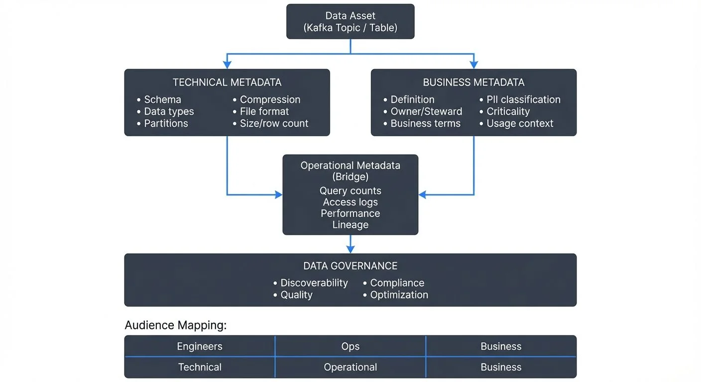

In modern data architectures, metadata serves as the foundation for understanding, governing, and operationalizing data assets. Yet many organizations struggle to distinguish between technical and business metadata, leading to fragmented governance strategies and missed opportunities for data-driven insights. This article explores the critical differences between these metadata types and demonstrates how mastering both is essential for Data Architects and Data Governance Officers.

<!-- ORIGINAL_DIAGRAM
```
┌─────────────────────────────────────────────────────────────────┐
│         METADATA LAYERS: TECHNICAL vs BUSINESS                  │
└─────────────────────────────────────────────────────────────────┘

                      Data Asset
                 (Kafka Topic / Table)
                          │
        ┌─────────────────┴─────────────────┐
        │                                   │
        ▼                                   ▼
┌────────────────────┐           ┌────────────────────┐
│ TECHNICAL METADATA │           │ BUSINESS METADATA  │
├────────────────────┤           ├────────────────────┤
│ • Schema           │           │ • Definition       │
│ • Data types       │           │ • Owner/Steward    │
│ • Partitions       │           │ • Business terms   │
│ • Compression      │           │ • PII classification│
│ • File format      │           │ • Criticality      │
│ • Size/row count   │           │ • Usage context    │
└────────┬───────────┘           └────────┬───────────┘
         │                                │
         │         Operational Metadata   │
         │              (Bridge)          │
         │          ┌──────────────┐      │
         └─────────▶│ Query counts │◀─────┘
                    │ Access logs  │
                    │ Performance  │
                    │ Lineage      │
                    └──────┬───────┘
                           │
                           ▼
                  ┌─────────────────┐
                  │ DATA GOVERNANCE │
                  │  • Discoverability
                  │  • Quality
                  │  • Compliance
                  │  • Optimization
                  └─────────────────┘

    Audience Mapping:
    ┌──────────────┬──────────────┬──────────────┐
    │   Engineers  │     Ops      │   Business   │
    ├──────────────┼──────────────┼──────────────┤
    │  Technical   │ Operational  │   Business   │
    └──────────────┴──────────────┴──────────────┘
```
-->

## Understanding the Metadata Landscape

Metadata—data about data—exists in multiple dimensions across your data ecosystem. While all metadata describes characteristics of your data assets, the distinction between technical and business metadata reflects fundamentally different perspectives on the same underlying information.

**Technical metadata** captures the structural, operational, and system-level characteristics of data assets. It answers questions like: What is the schema? How is data stored? What transformations occur? Where does data flow? This metadata is typically generated automatically by systems and tools, reflecting the mechanical reality of your data infrastructure.

**Business metadata**, conversely, describes the semantic meaning, context, and organizational relevance of data. It addresses questions such as: What does this data represent? Who owns it? What business processes does it support? How should it be interpreted? This metadata bridges the gap between technical implementation and business understanding, making data accessible to non-technical stakeholders.

### A Concrete Example: Customer Revenue Field

Consider a simple field to illustrate both metadata types working together:

**Technical Metadata:**
- Field name: `customer_revenue_mtd`
- Data type: `DECIMAL(10,2)`
- Kafka topic: `finance.revenue.events`
- Schema version: `v3.2`
- Partition key: `customer_id`
- Compression: `snappy`
- Update frequency: Every 5 minutes

**Business Metadata:**
- Display name: "Customer Revenue Month-to-Date"
- Definition: "Cumulative revenue generated by a customer account from the first day of the current calendar month through the current date"
- Owner: Finance Data Team
- Data steward: jane.smith@company.com
- Business criticality: High (feeds executive dashboards)
- PII classification: Non-sensitive (aggregated revenue only)
- Related business terms: Revenue Recognition, Monthly Recurring Revenue (MRR)

This example shows how technical metadata enables engineers to integrate and process the data, while business metadata ensures analysts and business users understand its meaning and proper use.

### Metadata Types Comparison

| Aspect | Technical Metadata | Business Metadata | Operational Metadata |
|--------|-------------------|-------------------|---------------------|
| **Primary Audience** | Data Engineers, Platform Teams | Data Analysts, Business Users | SREs, Data Ops Teams |
| **Generation** | Automated (system-generated) | Manual (human-curated) | Automated (usage tracking) |
| **Content Focus** | Structure, format, location | Meaning, ownership, policies | Usage patterns, performance |
| **Update Frequency** | Real-time (as systems change) | Periodic (as understanding evolves) | Continuous (runtime metrics) |
| **Examples** | Schema, data types, partitions | Definitions, data stewards, tags | Query counts, access patterns |
| **Primary Value** | Enables integration & processing | Enables understanding & governance | Enables optimization & monitoring |

## Technical Metadata: The Infrastructure Foundation

Technical metadata forms the backbone of data operations and engineering workflows. Data Architects rely on this metadata to design scalable systems, optimize performance, and ensure data quality.

### Core Components

**Schema metadata** defines data structures: column names, data types, constraints, indexes, and relationships. In streaming platforms like Apache Kafka, schema metadata managed through Schema Registry (a centralized service for storing and validating schemas) becomes crucial for ensuring producer-consumer compatibility and enabling schema evolution without breaking downstream applications.

**Lineage metadata** traces data movement across systems, capturing source-to-target mappings, transformation logic, and dependency chains. Understanding that a Kafka topic receives data from three upstream services, undergoes enrichment via a stream processor (a component that processes events in real-time), and feeds into five downstream consumers provides critical insight for impact analysis and troubleshooting. For comprehensive coverage of data lineage implementation, see [Data Lineage: Tracking Data from Source to Consumption](https://conduktor.io/glossary/data-lineage-tracking-data-from-source-to-consumption).

**Operational metadata** tracks runtime characteristics: execution times, data volumes, error rates, resource consumption, and performance metrics. For streaming architectures, this includes lag monitoring (tracking how far behind consumers are from the latest messages), throughput measurements, and partition distribution (how data is distributed across Kafka partitions)—metrics that directly impact system reliability.

### Streaming Integration Considerations

In streaming architectures, technical metadata takes on additional complexity. Unlike batch systems with discrete execution boundaries, streaming platforms generate continuous metadata streams. Modern governance tools like Conduktor provide comprehensive metadata visibility for Kafka environments, exposing cluster configurations, topic schemas, consumer group positions, and real-time performance metrics in a unified interface. Open-source metadata platforms like DataHub and OpenMetadata also offer robust Kafka integration for metadata discovery and lineage tracking.

This visibility becomes critical when debugging issues like consumer lag (when message processing falls behind) or partition skew (uneven data distribution across partitions). Technical metadata reveals that a consumer group is falling behind on specific partitions, while operational metadata shows which transformations are consuming excessive resources—enabling targeted optimization.

## Business Metadata: The Semantic Layer

While technical metadata describes how systems operate, business metadata explains what data means and why it matters. For Data Governance Officers, business metadata transforms data catalogs from technical inventories into strategic assets.

### Essential Elements

**Semantic definitions** provide clear, standardized descriptions of data elements. A field named `cust_rev_mtd` might be technically described as `DECIMAL(10,2)`, but business metadata explains it as "Customer Revenue Month-to-Date: The cumulative revenue generated by a customer account from the first day of the current calendar month through the current date, measured in USD."

**Ownership and stewardship** metadata identifies who is responsible for data quality, who can authorize access, and who should be consulted about interpretation. In distributed architectures where data flows across team boundaries, clear ownership prevents ambiguity and establishes accountability.

**Business rules and policies** document constraints, calculations, and governance requirements. These might include data retention policies, masking requirements for PII (Personally Identifiable Information), or business logic for calculating derived metrics. For streaming data, this could specify how late-arriving events (messages that arrive after their expected processing window) should be handled or when windowed aggregations (calculations over time periods) should be materialized.

**Usage context** captures how data supports business processes, which reports or dashboards consume it, and what decisions it informs. This metadata helps prioritize data quality efforts and assess the impact of schema changes.

## The Operational Metadata Bridge

A third category—operational metadata—sits at the intersection of technical and business concerns. It captures how data systems are actually being used: query patterns, access frequencies, user interactions, and data consumption trends.

For streaming platforms, operational metadata might reveal that a particular Kafka topic thought to be deprecated still has active consumers, or that a specific data field is queried thousands of times daily despite being marked as low-priority in business metadata. These insights drive informed decisions about resource allocation and deprecation strategies.

## Modern Metadata Technologies (2025)

The metadata management landscape has evolved significantly with new standards, AI-powered tools, and automated approaches that bridge technical and business perspectives more effectively than ever.

### OpenLineage: The Lineage Standard

OpenLineage has emerged as the industry standard for data lineage interoperability. Rather than each tool maintaining its own lineage format, OpenLineage provides a unified specification for capturing and exchanging lineage metadata across heterogeneous systems.

With OpenLineage, you can track data flow from Kafka topics through Flink transformations to data warehouse tables using a consistent metadata format. Modern orchestrators (Airflow 2.7+, Dagster 1.5+) emit OpenLineage events natively, enabling end-to-end lineage visualization across your entire data platform without vendor lock-in.

### AI-Powered Metadata Discovery

Large language models are transforming metadata generation from manual documentation to intelligent automation. Modern metadata platforms now offer:

**Automated Classification**: LLMs scan column names, sample data, and usage patterns to automatically classify data as PII, financial, operational, or other sensitive categories—dramatically reducing the manual tagging burden for data governance teams.

**Semantic Description Generation**: AI analyzes table and column names, data distributions, and relationships to generate human-readable descriptions. A field named `txn_amt_usd` with values ranging from 0-50000 might be automatically described as "Transaction amount in US dollars, typically representing purchase or payment values."

**Smart Tagging and Relationships**: Machine learning identifies implicit relationships between datasets based on join patterns, shared keys, and usage co-occurrence, surfacing connections that manual documentation might miss.

### Active Metadata: From Documentation to Automation

Active metadata represents a paradigm shift from passive documentation to actionable intelligence. Rather than simply describing data, active metadata triggers workflows and enforces policies in real-time.

**Metadata-Driven Data Quality**: Tools like Soda Core read metadata definitions to automatically generate and execute data quality checks. When business metadata specifies that a revenue field "must always be positive," the system generates validation SQL without manual rule coding.

**Dynamic Access Control**: Data classification metadata (PII, PHI, confidential) automatically triggers masking rules or access restrictions. Tag a Kafka topic field as containing email addresses, and governance policies immediately apply appropriate encryption or tokenization.

**Reverse ETL Automation**: Modern platforms use metadata about data freshness and dependencies to automatically trigger downstream syncs when upstream data updates complete, eliminating manual orchestration overhead.

### Column-Level Lineage

While table-level lineage shows that `customer_revenue_summary` derives from `raw_transactions`, column-level lineage reveals that the `total_revenue` field specifically comes from aggregating `raw_transactions.amount` where `transaction_type = 'purchase'`. This granularity becomes critical for:

- **Impact Analysis**: Understanding exactly which reports break when changing a specific field
- **Compliance Auditing**: Proving that sensitive PII fields are properly masked or excluded from analytics tables
- **Optimization**: Identifying unused columns that can be safely dropped to reduce storage costs

Modern metadata platforms (DataHub 0.12+, OpenMetadata 1.4+) support field-level lineage through SQL parsing, data transformation analysis, and API instrumentation.

### Data Contracts as Metadata Bridges

Data contracts formalize the interface between data producers and consumers, combining technical schemas with business guarantees. A data contract for a customer events stream might specify:

- **Technical Schema**: Avro schema with required fields and data types
- **Business Semantics**: Field definitions, valid value ranges, update frequency
- **Quality Guarantees**: Maximum null rates, freshness SLAs, uniqueness constraints
- **Lifecycle Policies**: Retention periods, deprecation warnings, breaking change notifications

Tools like dbt contracts and Great Expectations enable contracts to be defined in code, tested automatically, and published to data catalogs as integrated metadata—creating a single source of truth that serves both engineering and business needs. For detailed guidance on implementing business terminology and definitions, see [Building a Business Glossary for Data Governance](https://conduktor.io/glossary/building-a-business-glossary-for-data-governance).

### Modern Metadata Platform Ecosystem

**Open-Source Platforms:**
- **DataHub** (LinkedIn/Acryl): Extensible metadata platform with strong Kafka and streaming support, GraphQL API, and rich lineage visualization
- **OpenMetadata**: Modern UI, AI-powered discovery, comprehensive connector ecosystem for batch and streaming sources
- **Apache Amundsen**: Pioneered metadata-as-a-product approach, strong on data discovery and user collaboration

**Specialized Tools:**
- **dbt**: Transforms analytics code into rich business metadata through documentation, tests, and lineage graphs
- **Soda Core**: Data quality platform that generates metadata about data health, anomalies, and test results
- **Conduktor**: Commercial Kafka governance platform providing comprehensive metadata visibility, schema management, and access control for Kafka environments

**Semantic Layer Tools:**
- **dbt Semantic Layer**: Defines business metrics as metadata, ensuring consistent definitions across BI tools
- **Cube**: Headless BI platform using metadata to generate optimized queries and maintain metric consistency

## Implementing Integrated Metadata Management

Effective metadata management requires treating technical and business metadata as complementary rather than separate concerns.

### Establishing Bidirectional Linkage

Every technical asset should connect to corresponding business metadata. A Kafka topic schema should link to business glossary terms, ownership information, and usage policies. Conversely, business metadata entries should reference their technical implementations—knowing which tables, topics, or streams contain specific business entities.

### Automating Technical Metadata Capture

Leverage tools that automatically extract and maintain technical metadata. Schema registries, data catalogs, and platform-specific governance tools continuously harvest metadata from running systems, ensuring accuracy and reducing manual overhead.

For streaming architectures, automated metadata capture includes tracking schema versions, monitoring consumer group configurations, and recording partition assignments—information that changes frequently and must remain current.

**Example: Programmatic Metadata Enrichment with DataHub**

Here's how to automatically enrich a Kafka topic with business metadata using DataHub's Python SDK:

```python
from datahub.emitter.mce_builder import make_dataset_urn
from datahub.emitter.rest_emitter import DatahubRestEmitter
from datahub.metadata.schema_classes import (
    DatasetPropertiesClass,
    OwnershipClass,
    OwnerClass,
    OwnershipTypeClass,
    GlobalTagsClass,
    TagAssociationClass,
)

# Initialize connection to DataHub
emitter = DatahubRestEmitter("http://datahub:8080")

# Create dataset URN for Kafka topic
dataset_urn = make_dataset_urn(
    platform="kafka",
    name="production.customer.revenue.events",
    env="PROD"
)

# Add business metadata: ownership
ownership = OwnershipClass(
    owners=[
        OwnerClass(
            owner="urn:li:corpuser:jane.smith",
            type=OwnershipTypeClass.DATAOWNER,
        )
    ]
)

# Add business metadata: description and custom properties
properties = DatasetPropertiesClass(
    description="Real-time customer revenue events emitted when "
                "transactions are processed. Used for executive "
                "dashboards and revenue forecasting.",
    customProperties={
        "business_criticality": "HIGH",
        "data_classification": "INTERNAL",
        "update_frequency": "Real-time (5 min SLA)",
        "retention_period": "90 days",
    }
)

# Add business metadata: tags for classification
tags = GlobalTagsClass(
    tags=[
        TagAssociationClass(tag="urn:li:tag:PII"),
        TagAssociationClass(tag="urn:li:tag:Financial"),
        TagAssociationClass(tag="urn:li:tag:Revenue"),
    ]
)

# Emit metadata to DataHub
emitter.emit_mcp(
    MetadataChangeProposalWrapper(
        entityUrn=dataset_urn,
        aspect=ownership,
    )
)
emitter.emit_mcp(
    MetadataChangeProposalWrapper(
        entityUrn=dataset_urn,
        aspect=properties,
    )
)
emitter.emit_mcp(
    MetadataChangeProposalWrapper(
        entityUrn=dataset_urn,
        aspect=tags,
    )
)

print(f"Enriched metadata for {dataset_urn}")
```

This approach enables CI/CD pipelines to automatically publish metadata when new Kafka topics are created, ensuring documentation stays synchronized with infrastructure.

### Crowdsourcing Business Metadata

Unlike technical metadata, business metadata often requires human input. Implement workflows that encourage data producers and consumers to document definitions, add tags, and identify sensitive data. Treat metadata enrichment as part of the data development lifecycle rather than an afterthought.

### Creating Unified Discovery Experiences

Data catalogs should present both metadata types in context. When a data analyst searches for "customer revenue," they should see technical details (location, schema, refresh frequency) alongside business context (definition, owner, certified status) in a single view. This integration accelerates understanding and reduces time-to-insight. For guidance on building discoverable data platforms, see [What is a Data Catalog? Modern Data Discovery](https://conduktor.io/glossary/what-is-a-data-catalog-modern-data-discovery).

## Governance Implications

The distinction between technical and business metadata has profound governance implications. Technical metadata enables operational controls—access policies, data quality checks, lineage tracking. Business metadata enables strategic governance—standardized terminology, clear ownership, compliant data handling.

Effective data governance requires both. Technical metadata without business context creates compliance blind spots—you might track data lineage perfectly but not recognize which flows contain regulated PII. Business metadata without technical grounding creates enforcement gaps—policies that can't be translated into automated controls remain aspirational rather than operational.

## Conclusion

Mastering the distinction between technical and business metadata represents a maturity milestone for data organizations. Technical metadata provides the operational foundation, capturing how systems work and data flows. Business metadata adds semantic richness, explaining what data means and why it matters. Operational metadata bridges these perspectives, revealing actual usage patterns.

For Data Architects and Data Governance Officers, success requires treating metadata management not as documentation overhead but as critical infrastructure. In streaming architectures where data moves continuously across system boundaries, comprehensive metadata—both technical and business—transforms complexity into clarity, enabling teams to build reliable, governable, and business-aligned data platforms.

The organizations that invest in integrated metadata management gain competitive advantages: faster time-to-insight, reduced operational risk, stronger regulatory compliance, and data ecosystems that truly serve business needs. The question isn't whether to prioritize technical or business metadata—it's how to unite them into a coherent whole that empowers every stakeholder in your data journey.

## Related Concepts

- [Data Lineage: Tracking Data from Source to Consumption](https://conduktor.io/glossary/data-lineage-tracking-data-from-source-to-consumption) - Understanding how metadata flows through pipelines
- [Building a Business Glossary for Data Governance](https://conduktor.io/glossary/building-a-business-glossary-for-data-governance) - Creating business context for technical assets
- [Schema Registry and Schema Management](https://conduktor.io/glossary/schema-registry-and-schema-management) - Managing technical metadata for streaming platforms

## Getting Started: Practical Steps

If you're beginning your metadata management journey, follow this phased approach:

**Phase 1: Foundation (Weeks 1-4)**
1. **Select a metadata platform**: Evaluate DataHub, OpenMetadata, or Amundsen based on your technology stack and team size
2. **Connect technical sources**: Start with automated metadata extraction from your most critical systems (databases, Kafka clusters, data warehouses)
3. **Establish governance team**: Identify data stewards and owners across business domains
4. **Define metadata standards**: Document required fields for all datasets (minimally: description, owner, update frequency)

**Phase 2: Enrichment (Weeks 5-12)**
1. **Add business context**: Have domain experts enrich top 20% of datasets with business metadata (these likely represent 80% of usage)
2. **Implement data classification**: Use automated PII detection tools to tag sensitive data
3. **Document lineage**: Enable lineage capture for key pipelines and transformations
4. **Create business glossary**: Document 20-30 critical business terms with clear definitions

**Phase 3: Activation (Weeks 13+)**
1. **Implement metadata-driven policies**: Use classification tags to automatically enforce access controls and masking
2. **Enable self-service discovery**: Train analysts to use data catalog for finding and understanding data
3. **Integrate with CI/CD**: Automatically publish metadata when deploying new pipelines or schemas
4. **Measure adoption**: Track catalog search usage, metadata completeness scores, and time-to-insight metrics

**Quick Wins:**
- Start with Kafka topics: Schema Registry already provides technical metadata—add business descriptions and ownership
- Use existing documentation: Import READMEs, Confluence pages, and data dictionaries as starting business metadata
- Focus on pain points: If teams repeatedly ask "what does this field mean?", that's your first enrichment target

## Sources and References

- [DAMA-DMBOK: Data Management Body of Knowledge](https://www.dama.org/cpages/body-of-knowledge)
- [The Data Catalog: Your Guide to Metadata Management](https://www.oreilly.com/library/view/the-enterprise-data/9781492054771/)
- [Apache Kafka Schema Registry Documentation](https://kafka.apache.org/documentation/#schemaregistry)
- [Data Governance: The Definitive Guide](https://www.oreilly.com/library/view/data-governance-the/9781492063483/)
- [DataHub: Modern Metadata Platform](https://datahubproject.io/)
- [OpenMetadata: Open Source Data Discovery and Observability](https://open-metadata.org/)
- [OpenLineage: Open Standard for Data Lineage](https://openlineage.io/)
