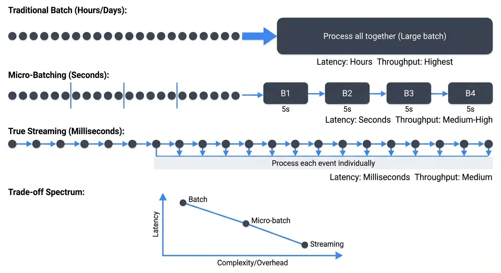

Stream processing exists on a spectrum. On one end, traditional batch processing handles large volumes of data at scheduled intervals—hourly, daily, or weekly. On the other end, true streaming processes each event individually as it arrives, achieving latencies measured in single-digit milliseconds. Micro-batching sits squarely in the middle, offering a pragmatic compromise that has powered some of the world's largest streaming applications.

Rather than processing events one-by-one or waiting hours for batch jobs, micro-batching collects small groups of events over short time windows—typically ranging from 100 milliseconds to several minutes—and processes them as tiny batches. This hybrid approach unlocks significant architectural advantages while maintaining near-real-time responsiveness for many use cases.



<!-- ORIGINAL_DIAGRAM
```
┌─────────────────────────────────────────────────────────────────┐
│     PROCESSING MODELS: BATCH vs MICRO-BATCH vs STREAMING       │
└─────────────────────────────────────────────────────────────────┘

Traditional Batch (Hours/Days):
    Events: ●●●●●●●●●●●●●●●●●●●●●●●●●●●●●●●●●
                         │
                         ▼
            ┌────────────────────────┐
            │  Process all together  │
            │   (Large batch)        │
            └────────────────────────┘
    Latency: Hours          Throughput: Highest

Micro-Batching (Seconds):
    Events: ●●●●●●│●●●●●●│●●●●●●│●●●●●●│●●●●●●
                  ▼       ▼       ▼       ▼
            ┌────┐  ┌────┐  ┌────┐  ┌────┐
            │ B1 │  │ B2 │  │ B3 │  │ B4 │
            └────┘  └────┘  └────┘  └────┘
              5s      5s      5s      5s
    Latency: Seconds        Throughput: Medium-High

True Streaming (Milliseconds):
    Events: ●─▶●─▶●─▶●─▶●─▶●─▶●─▶●─▶●─▶●─▶
            │  │  │  │  │  │  │  │  │  │
            ▼  ▼  ▼  ▼  ▼  ▼  ▼  ▼  ▼  ▼
         Process each event individually
    Latency: Milliseconds   Throughput: Medium

Trade-off Spectrum:
    ┌─────────────────────────────────────────────┐
    │ Latency      ▲                              │
    │              │  Batch                       │
    │              │    ▲                         │
    │              │    │ Micro-batch             │
    │              │    │   ▲                     │
    │              │    │   │ Streaming           │
    └──────────────┼────┼───┼────────────────────▶
                        Complexity/Overhead
```
-->

## How Micro-Batching Works

At its core, micro-batching applies batch processing semantics to streaming data by dividing the continuous stream into discrete, time-bounded chunks. Every few seconds (or subseconds), the system collects all events that arrived during that interval and processes them together as a single batch.

Consider a typical micro-batch pipeline processing clickstream events. With a 5-second batch interval, the system accumulates all clicks received between 12:00:00 and 12:00:05, processes this group together, then moves to the 12:00:05-12:00:10 window. Each micro-batch is independent, executed as a bounded dataset with clear start and end points.

This approach leverages the well-understood batch processing model. Each micro-batch runs through the same execution plan: read from source, apply transformations, write to sink. State management becomes simpler because the system only needs to coordinate state within each small batch rather than managing continuously evolving state across individual events.

The batch interval becomes the fundamental tuning parameter. Shorter intervals reduce latency but increase overhead from job scheduling and coordination. Longer intervals improve throughput by amortizing overhead across more events but increase end-to-end latency proportionally.

## Why Micro-Batching Exists

Micro-batching emerged as a practical engineering solution to three fundamental challenges in stream processing: exactly-once semantics, fault tolerance, and operational simplicity.

**Exactly-once processing** is significantly easier to achieve with micro-batching. Because each batch is atomic and deterministic, the system can replay failed batches without worrying about partial progress or duplicate processing. If batch 1,427 fails halfway through, simply reprocess batch 1,427 from the beginning. The bounded nature of each batch makes idempotent reprocessing straightforward.

**Fault tolerance** builds naturally on batch boundaries. When a node fails, the system only needs to recompute the affected micro-batches—not reconstruct complex in-flight state for thousands of individual events. Checkpointing happens between batches at well-defined points, creating clean recovery semantics. This aligns perfectly with distributed computing frameworks designed around batch operations.

**Operational simplicity** matters enormously in production systems. Developers already understand batch processing. They know how to reason about bounded datasets, optimize batch jobs, and debug processing logic. Micro-batching lets teams apply this existing expertise to streaming problems without mastering the additional complexity of per-record state management, watermarks (timestamp-based markers that track event-time progress in out-of-order streams), and event-time processing that true streaming demands.

The trade-off is clear: accept slightly higher latency (measured in seconds rather than milliseconds) in exchange for simpler programming models and more robust exactly-once guarantees.

## Spark Structured Streaming Implementation

Apache Spark popularized micro-batching through Structured Streaming (Spark 3.5+), which treats streams as unbounded tables that grow continuously. The programming model is elegant: write the same DataFrame operations you'd use for batch processing, and Spark handles the streaming execution.

Here's a basic example processing Kafka events with a 5-second micro-batch interval:

```python
from pyspark.sql import SparkSession
from pyspark.sql.functions import window, count

spark = SparkSession.builder \
    .appName("MicroBatchExample") \
    .getOrCreate()

# Read from Kafka as a stream
clicks = spark.readStream \
    .format("kafka") \
    .option("kafka.bootstrap.servers", "localhost:9092") \
    .option("subscribe", "clickstream") \
    .load()

# Process micro-batches every 5 seconds
windowed_counts = clicks \
    .selectExpr("CAST(value AS STRING) as click") \
    .groupBy(window("timestamp", "1 minute")) \
    .agg(count("click").alias("click_count"))

query = windowed_counts.writeStream \
    .outputMode("update") \
    .format("console") \
    .trigger(processingTime="5 seconds") \
    .start()

query.awaitTermination()
```

Structured Streaming offers three trigger modes that control how micro-batches execute:

**Processing time triggers** execute micro-batches at fixed intervals. Setting `trigger(processingTime='5 seconds')` runs a new batch every 5 seconds, regardless of how long the previous batch took. This mode works well when you need predictable intervals and can keep up with the data rate.

**Once triggers** process all available data as a single batch and then stop. This proves valuable for testing streaming jobs or implementing scheduled near-real-time workflows that run periodically rather than continuously.

**Continuous triggers** (introduced in Spark 2.3, refined in 3.5+) attempt to achieve lower latency by using a different execution engine that processes records with minimal delay. Unlike traditional micro-batching which waits for the trigger interval, continuous mode achieves end-to-end latencies as low as 1 millisecond for simple operations by maintaining long-running tasks that continuously process incoming data. However, this mode has limitations—it only supports map-like operations and certain sources/sinks, not complex stateful aggregations.

### Checkpointing and Fault Tolerance

Under the hood, Spark uses incremental execution planning combined with write-ahead logs for reliability. Each micro-batch analyzes what new data arrived, generates an optimized query plan, executes it across the cluster, and checkpoints progress to fault-tolerant storage (HDFS, S3, etc.).

The checkpoint location stores:
- **Offset logs**: Which data has been processed from each source
- **State snapshots**: Intermediate aggregation results for stateful operations
- **Commit logs**: Confirmation that batches completed successfully

If a job fails, Spark reads the checkpoint to determine the last successfully processed offset, then replays subsequent micro-batches. This design makes exactly-once processing straightforward—each batch is idempotent and can be safely reprocessed.

```python
# Checkpoint configuration
query = windowed_counts.writeStream \
    .outputMode("update") \
    .format("kafka") \
    .option("kafka.bootstrap.servers", "localhost:9092") \
    .option("topic", "aggregated_clicks") \
    .option("checkpointLocation", "/tmp/checkpoint") \
    .trigger(processingTime="5 seconds") \
    .start()
```

For organizations managing complex Spark streaming deployments at scale, monitoring and governance become critical. Conduktor provides comprehensive capabilities for [monitoring streaming pipeline health](https://docs.conduktor.io/guide/monitor-brokers-apps/index), tracking data lineage across micro-batch jobs, enforcing data quality policies, and ensuring compliance as your streaming infrastructure grows. For Kafka-specific details, see [Apache Kafka](https://conduktor.io/glossary/apache-kafka).

## Latency and Performance Trade-offs

Micro-batching's latency characteristics fall into a distinct range. End-to-end latency typically spans from 100 milliseconds to several minutes, depending on batch interval and processing complexity. This makes micro-batching suitable for near-real-time use cases but not for ultra-low-latency scenarios.

Several factors determine actual latency:

**Batch interval** sets the minimum latency floor. A 10-second interval means events wait an average of 5 seconds just to be included in a batch, plus processing time. You cannot achieve sub-second latency with minute-long batch intervals.

**Processing time** adds to the batch interval. Consider a concrete example: if your batch interval is 5 seconds and your pipeline receives 100,000 events per batch, processing those events (parsing, transforming, aggregating) might take 2 seconds on a properly sized cluster. This means effective average latency is 5 seconds (wait time) + 2 seconds (processing) = 7 seconds. If processing slows to 6 seconds due to increased load, your effective latency jumps to 11 seconds, and you start falling behind.

**Scheduling overhead** becomes significant at very short intervals. Starting and coordinating a distributed job carries fixed costs—typically tens to hundreds of milliseconds. At sub-second batch intervals, this overhead can dominate, making micro-batching inefficient compared to true streaming.

**Throughput optimization** often conflicts with latency goals. Increasing batch interval improves throughput by amortizing overhead and enabling better compression, but directly increases latency. The sweet spot typically falls between 1-30 seconds for most workloads.

Performance tuning focuses on finding the right balance. Increase parallelism to process larger batches faster. Adjust batch intervals to match your latency requirements. Monitor end-to-end latency metrics to ensure batches complete within their interval window, avoiding backlog buildup.

## Micro-Batching vs True Streaming

The distinction between micro-batching and true streaming matters for architecture decisions. For deep comparisons, see [Flink vs Spark Streaming: When to Choose Each](https://conduktor.io/glossary/flink-vs-spark-streaming-when-to-choose-each) and [Kafka Streams vs Apache Flink](https://conduktor.io/glossary/kafka-streams-vs-apache-flink). For foundational Kafka knowledge, see [Apache Kafka](https://conduktor.io/glossary/apache-kafka).

**True streaming engines** like Apache Flink (1.19+) process events one-at-a-time through a dataflow graph. This enables single-digit millisecond latencies and more natural event-time semantics. Flink's state backend has matured significantly—RocksDB state backend now supports incremental checkpointing, state TTL (time-to-live) for automatic cleanup, and changelog-based recovery in Flink 1.15+. For comprehensive coverage, see [Flink State Management and Checkpointing](https://conduktor.io/glossary/flink-state-management-and-checkpointing). However, it requires sophisticated state management, complex checkpointing mechanisms, and careful watermark handling to achieve exactly-once guarantees.

**Kafka Streams** (3.0+) takes a different approach to true streaming, embedding stream processing directly into your application as a library. It processes records individually but maintains local state stores and coordinates distributed processing through Kafka's consumer groups. With `processing.guarantee=exactly_once_v2` (introduced in Kafka 2.5, refined in 3.0+), Kafka Streams achieves exactly-once semantics with significantly lower overhead than earlier implementations. This achieves low latency while leveraging Kafka's durability and replication.

Here's a Kafka Streams example for comparison to the earlier Spark micro-batching code:

```java
Properties props = new Properties();
props.put(StreamsConfig.APPLICATION_ID_CONFIG, "click-counter");
props.put(StreamsConfig.BOOTSTRAP_SERVERS_CONFIG, "localhost:9092");
props.put(StreamsConfig.PROCESSING_GUARANTEE_CONFIG, "exactly_once_v2");

StreamsBuilder builder = new StreamsBuilder();
KStream<String, String> clicks = builder.stream("clickstream");

// Process each event individually (true streaming)
clicks
    .groupByKey()
    .windowedBy(TimeWindows.ofSizeWithNoGrace(Duration.ofMinutes(1)))
    .count()
    .toStream()
    .to("aggregated_clicks");

KafkaStreams streams = new KafkaStreams(builder.build(), props);
streams.start();
```

**Micro-batching frameworks** trade latency for simplicity. By processing small groups of events together, they achieve stronger exactly-once semantics more easily and offer simpler failure recovery. The programming model is more accessible to developers familiar with batch processing.

The performance gap has narrowed over time. Spark's continuous mode reduces micro-batch overhead, while Flink's checkpointing has become more efficient. Modern micro-batching can achieve sub-second latencies for many operations, while true streaming has simplified its programming models.

Choose based on requirements: if you need millisecond-level latency or complex event-time processing, true streaming excels. If second-level latency suffices and you value operational simplicity, micro-batching often proves more pragmatic.

## Use Cases and When to Choose Micro-Batching

Micro-batching shines in specific scenarios where near-real-time processing suffices and operational simplicity matters.

**Aggregations and metrics** work naturally with micro-batching. Computing page views per minute, calculating rolling averages, or generating dashboards updated every few seconds aligns perfectly with batch intervals. The slight delay is acceptable, and batch processing makes aggregations efficient.

**ETL and data synchronization** between systems often tolerates seconds of latency. Moving data from Kafka to a data warehouse, synchronizing databases, or updating search indexes every 5-30 seconds satisfies most business requirements while batching improves throughput.

**Machine learning feature generation** benefits from micro-batching's throughput. Computing features for recommendation systems or fraud detection models can happen in 10-second batches, providing fresh features without requiring millisecond latency.

**Business monitoring and alerting** where response times of 10-60 seconds are acceptable. Detecting anomalies in application logs, monitoring business KPIs, or triggering alerts based on threshold violations work well with micro-batching.

Avoid micro-batching when you need sub-second latency for user-facing features, complex event pattern matching requiring precise timing, or financial trading systems where milliseconds matter. In these cases, true streaming engines provide necessary performance.

The evolution continues toward hybrid approaches. Modern frameworks increasingly blur the lines, offering both micro-batch and continuous modes. As systems mature, choose based on your specific latency requirements, team expertise, and operational complexity tolerance rather than strict architectural dogma.

Understanding micro-batching's strengths and limitations helps you build the right streaming architecture for your needs—one that balances performance, simplicity, and maintainability in production.

## Related Concepts

- [Flink vs Spark Streaming: When to Choose Each](https://conduktor.io/glossary/flink-vs-spark-streaming-when-to-choose-each) - Comparing micro-batching to true streaming architectures
- [What is Apache Flink: Stateful Stream Processing](https://conduktor.io/glossary/what-is-apache-flink-stateful-stream-processing) - True streaming alternative to micro-batching
- [Apache Kafka](https://conduktor.io/glossary/apache-kafka) - Platform commonly used as input source for micro-batch processing

## Sources and References

1. **Apache Spark Structured Streaming Programming Guide** - Official documentation covering micro-batching architecture, trigger modes, and performance tuning in Spark 3.5+. [https://spark.apache.org/docs/latest/structured-streaming-programming-guide.html](https://spark.apache.org/docs/latest/structured-streaming-programming-guide.html)

2. **Apache Flink Documentation** - Official documentation for Apache Flink's true streaming architecture and state management. [https://flink.apache.org/](https://flink.apache.org/)

3. **Kafka Streams Documentation** - Official guide covering Kafka Streams architecture and exactly-once semantics. [https://kafka.apache.org/documentation/streams/](https://kafka.apache.org/documentation/streams/)

4. **Conduktor** - Comprehensive platform for managing, monitoring, and governing Kafka and streaming data pipelines including Spark Structured Streaming deployments. [https://www.conduktor.io/](https://www.conduktor.io/)

5. **Tyler Akidau et al. - The Dataflow Model** - Research paper introducing streaming concepts and discussing batch vs streaming trade-offs. Google, 2015.
