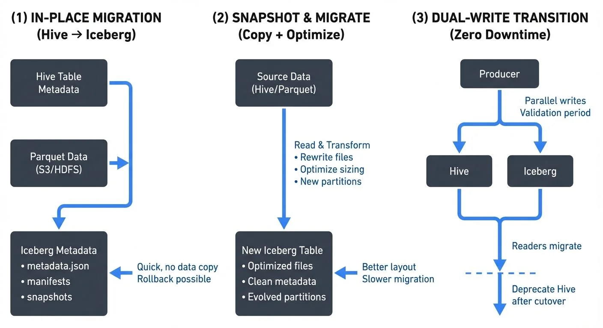

Apache Iceberg has emerged as the leading table format for modern [data lakehouses](https://conduktor.io/glossary/introduction-to-lakehouse-architecture), offering features like ACID transactions, time travel, schema evolution, and partition evolution that traditional Hive tables and raw Parquet files cannot provide. As of 2025, [Apache Iceberg](https://conduktor.io/glossary/apache-iceberg) 1.7+ provides production-grade migration tools, REST catalog support, and advanced features like branches and tags that make migration safer and more flexible than ever.

Migrating to Iceberg unlocks these capabilities while maintaining compatibility with your existing query engines and data infrastructure. This guide explores proven migration strategies, practical conversion techniques, and critical considerations for data engineers and architects planning an Iceberg migration.



<!-- ORIGINAL_DIAGRAM
```
┌─────────────────────────────────────────────────────────────────┐
│           ICEBERG MIGRATION STRATEGIES COMPARISON               │
└─────────────────────────────────────────────────────────────────┘

(1) IN-PLACE MIGRATION (Hive → Iceberg)
    ┌──────────────┐
    │  Hive Table  │
    │   Metadata   │──┐
    └──────────────┘  │ Convert metadata
    ┌──────────────┐  │ (Data stays put)
    │ Parquet Data │  │
    │   (S3/HDFS)  │  │
    └──────────────┘  ▼
    ┌──────────────────────┐
    │  Iceberg Metadata    │
    │ • metadata.json      │◀── Quick, no data copy
    │ • manifests          │    Rollback possible
    │ • snapshots          │
    └──────────────────────┘

(2) SNAPSHOT & MIGRATE (Copy + Optimize)
    ┌──────────────┐
    │  Source Data │
    │ (Hive/Parquet)│
    └──────┬───────┘
           │ Read & Transform
           │ • Rewrite files
           │ • Optimize sizing
           │ • New partitions
           ▼
    ┌──────────────────────┐
    │  New Iceberg Table   │
    │ • Optimized files    │◀── Better layout
    │ • Clean metadata     │    Slower migration
    │ • Evolved partitions │
    └──────────────────────┘

(3) DUAL-WRITE TRANSITION (Zero Downtime)
    ┌──────────┐
    │ Producer │
    └────┬─────┘
         │
         ├────────┬────────┐
         ▼        ▼        │
    ┌────────┐ ┌────────┐ │
    │  Hive  │ │Iceberg │ │ ◀── Parallel writes
    └───┬────┘ └───┬────┘ │     Validation period
        │          │       │
        │  Readers migrate │
        │          │       │
        └──────────┴───────┘
                   │
           Deprecate Hive after cutover
```
-->

## Table of Contents

1. [Understanding the Migration Landscape](#understanding-the-migration-landscape)
2. [Migration Strategies](#migration-strategies)
3. [Migrating Hive Tables to Iceberg](#migrating-hive-tables-to-iceberg)
4. [Converting Parquet Datasets to Iceberg](#converting-parquet-datasets-to-iceberg)
5. [Streaming Integration During Migration](#streaming-integration-during-migration)
6. [Validation and Testing](#validation-and-testing)
7. [Best Practices and Considerations](#best-practices-and-considerations)

## Understanding the Migration Landscape

Before initiating a migration, assess your current state and requirements:

**From Hive Tables:**
- Existing Hive metastore integration
- Partition structures and naming conventions
- Table statistics and metadata
- Query patterns and access frequencies
- Downstream dependencies on Hive-specific features

**From Raw Parquet:**
- File organization and directory structure
- Partition schemes (if any)
- Schema consistency across files
- Metadata availability
- Current read/write patterns

Iceberg's design accommodates both scenarios with different migration approaches: **in-place migration** for Hive tables (converting metadata without moving data) and **metadata-based adoption** for Parquet datasets (creating Iceberg metadata to track existing files). For comprehensive coverage of Iceberg's metadata architecture, see [Iceberg Table Architecture: Metadata and Snapshots](https://conduktor.io/glossary/iceberg-table-architecture-metadata-and-snapshots).

## Migration Strategies

### Strategy 1: In-Place Migration (Hive to Iceberg)

In-place migration converts existing Hive tables to Iceberg tables without moving or rewriting data files. This approach offers:

- **Minimal downtime**: Metadata conversion happens quickly
- **No data movement**: Original Parquet/ORC files remain in place
- **Rollback capability**: Can revert to Hive if needed
- **Resource efficiency**: No data copying or rewriting required

**When to use:** Production Hive tables with stable partition schemes, large datasets where data copying is prohibitive, or scenarios requiring minimal disruption.

### Strategy 2: Snapshot and Migrate

Create an Iceberg table and copy data from the source, allowing for optimization during migration:

- **Data optimization**: Rewrite files to optimal sizes
- **Partition evolution**: Restructure partitioning scheme
- **Schema refinement**: Clean up schema inconsistencies
- **Incremental migration**: Migrate in batches over time

**When to use:** When data reorganization is beneficial, source tables have performance issues, or you want to optimize file layouts during migration.

### Strategy 3: Dual-Write Transition

Temporarily write to both old and new formats during transition:

- **Zero downtime**: Seamless cutover for readers
- **Extended validation**: Verify Iceberg behavior with production workloads
- **Gradual migration**: Migrate read traffic incrementally

**When to use:** Mission-critical tables where zero downtime is mandatory, or when extensive validation is required before full cutover.

## Migrating Hive Tables to Iceberg

### Using Spark SQL for In-Place Migration

Spark 3.5+ provides native support for in-place Hive table migration with Iceberg 1.7+:

```sql
-- Migrate a Hive table to Iceberg format in-place (Iceberg 1.4+)
CALL system.migrate('db_name.table_name');

-- Verify migration success
DESCRIBE EXTENDED db_name.table_name;
```

This command performs the following operations:
1. Reads existing Hive table metadata and partition information
2. Creates Iceberg metadata files (metadata.json, manifest lists, manifest files)
3. Updates the Hive metastore to point to Iceberg table format
4. Preserves all existing data files in their current locations (no data movement)
5. Maintains backward compatibility for readers that haven't been updated yet

### Programmatic Migration with Spark

For more control over the migration process (Spark 3.5+ with Iceberg 1.7+):

```scala
import org.apache.iceberg.spark.actions.SparkActions

// Configure Spark with Iceberg support
val spark = SparkSession.builder()
  .config("spark.sql.catalog.spark_catalog", "org.apache.iceberg.spark.SparkSessionCatalog")
  .config("spark.sql.catalog.spark_catalog.type", "hive")  // Using Hive Metastore for catalog
  .config("spark.sql.extensions", "org.apache.iceberg.spark.extensions.IcebergSparkSessionExtensions")
  .enableHiveSupport()
  .getOrCreate()

// Perform in-place migration with granular control
val actions = SparkActions.get()
val migrationResult = actions
  .migrateTable("db_name.table_name")
  .execute()

// Migration result provides detailed statistics
println(s"Migrated ${migrationResult.migratedDataFilesCount} files")
println(s"Migration completed in ${migrationResult.executionTimeMillis}ms")
```

### Snapshot Migration Approach

For scenarios requiring data rewrite and optimization:

```sql
-- Create new Iceberg table with optimized settings (Iceberg 1.7+)
CREATE TABLE iceberg_catalog.db_name.new_table
USING iceberg
PARTITIONED BY (date, region)
TBLPROPERTIES (
  'write.format.default' = 'parquet',
  'write.parquet.compression-codec' = 'zstd',  -- Modern compression (Zstandard)
  'write.target-file-size-bytes' = '536870912',  -- 512 MB target file size
  'write.metadata.compression-codec' = 'gzip'  -- Compress metadata files
)
AS SELECT * FROM hive_db.legacy_table;

-- Verify data integrity
SELECT COUNT(*), SUM(bytes_size)
FROM iceberg_catalog.db_name.new_table;
```

### Using Branches for Safe Migration Testing (Iceberg 1.5+)

Iceberg's branch feature allows you to test migrations in isolation before committing to production:

```sql
-- Create a migration test branch
ALTER TABLE iceberg_catalog.db_name.new_table
CREATE BRANCH IF NOT EXISTS migration_test
RETAIN 7 DAYS;

-- Test writes and transformations on the branch
INSERT INTO iceberg_catalog.db_name.new_table.branch_migration_test
SELECT * FROM hive_db.legacy_table WHERE date = '2025-01-15';

-- Validate data on the branch
SELECT COUNT(*), AVG(metric_value)
FROM iceberg_catalog.db_name.new_table VERSION AS OF 'migration_test';

-- If validation passes, fast-forward main to the branch
CALL iceberg_catalog.system.fast_forward(
  'db_name.new_table',
  'main',
  'migration_test'
);
```

This branching approach provides a safety net for migration testing, allowing you to validate transformations before affecting production queries.

## Converting Parquet Datasets to Iceberg

### Adding Metadata to Existing Parquet Files

Iceberg can adopt existing Parquet files without rewriting them using the modern bulk import API (Iceberg 1.6+):

```scala
import org.apache.iceberg.spark.actions.SparkActions
import org.apache.iceberg.PartitionSpec
import org.apache.iceberg.catalog.TableIdentifier

// Infer schema from existing Parquet files
val schema = spark.read.parquet("s3://bucket/data/events/")
  .schema

// Define partition specification using hidden partitioning
val spec = PartitionSpec.builderFor(schema)
  .day("event_time")  // Transforms event_time into daily partitions automatically
  .identity("region")  // Uses region column as-is for partitioning
  .build()

// Create Iceberg table metadata structure (no data movement)
spark.sql("""
  CREATE TABLE iceberg_catalog.db_name.events (
    event_id STRING,
    user_id BIGINT,
    event_time TIMESTAMP,
    region STRING,
    properties MAP<STRING, STRING>
  )
  USING iceberg
  PARTITIONED BY (days(event_time), region)
  LOCATION 's3://bucket/data/events/'
  TBLPROPERTIES (
    'write.format.default' = 'parquet'
  )
""")

// Bulk import existing Parquet files into Iceberg table metadata (Iceberg 1.6+)
SparkActions.get(spark)
  .rewriteDataFiles(
    TableIdentifier.of("db_name", "events")
  )
  .option("use-starting-sequence-number", "true")  // Preserves file ordering
  .execute()
```

Note: The `days()` partition function automatically handles date transformations, extracting the date component from the timestamp field for efficient partition pruning.

### Incremental Data Migration

For large datasets, migrate in stages to minimize resource consumption and enable parallel processing:

```sql
-- Create Iceberg table structure
CREATE TABLE iceberg_catalog.analytics.user_events (
  user_id BIGINT,
  event_type STRING,
  event_time TIMESTAMP,
  properties MAP<STRING, STRING>
)
USING iceberg
PARTITIONED BY (days(event_time));

-- Migrate data in daily increments (can be parallelized across multiple Spark jobs)
INSERT INTO iceberg_catalog.analytics.user_events
SELECT * FROM parquet.`s3://bucket/legacy/events/date=2025-01-01/`;

INSERT INTO iceberg_catalog.analytics.user_events
SELECT * FROM parquet.`s3://bucket/legacy/events/date=2025-01-02/`;

-- Use dynamic SQL for bulk migration across date ranges
INSERT INTO iceberg_catalog.analytics.user_events
SELECT * FROM parquet.`s3://bucket/legacy/events/`
WHERE date BETWEEN '2025-01-01' AND '2025-01-31';
```

## Streaming Integration During Migration

### Kafka to Iceberg with Spark Structured Streaming

During migration, establish streaming pipelines to keep Iceberg tables updated (Spark 3.5+ with Iceberg 1.7+):

```scala
import org.apache.spark.sql.streaming.Trigger

// Read from Kafka with modern connector configuration
val kafkaStream = spark.readStream
  .format("kafka")
  .option("kafka.bootstrap.servers", "localhost:9092")
  .option("subscribe", "user-events")
  .option("startingOffsets", "earliest")
  .option("maxOffsetsPerTrigger", "10000")  // Control batch size for backpressure
  .load()

// Parse and transform Kafka messages
val parsedStream = kafkaStream
  .selectExpr("CAST(value AS STRING) as json")
  .select(from_json($"json", schema).as("data"))
  .select("data.*")

// Write stream to Iceberg with exactly-once semantics (Iceberg 1.7+)
parsedStream.writeStream
  .format("iceberg")
  .outputMode("append")
  .trigger(Trigger.ProcessingTime("30 seconds"))
  .option("checkpointLocation", "s3://bucket/checkpoints/user-events")
  .option("fanout-enabled", "true")  // Distribute writes across workers for parallelism
  .option("write.format.default", "parquet")  // Explicit format specification
  .option("write.parquet.compression-codec", "zstd")  // Modern compression
  .toTable("iceberg_catalog.analytics.user_events")
```

### Monitoring Streaming Migrations with Conduktor

Managing Kafka-to-Iceberg streaming pipelines during migration requires comprehensive observability and governance. **Conduktor** provides essential capabilities for production-grade migrations:

- **Data Quality Monitoring**: Validate message schemas and enforce data contracts before writes reach Iceberg tables, preventing corrupted migrations
- **Consumer Lag Tracking**: Monitor streaming job performance in real-time using [topic monitoring](https://docs.conduktor.io/guide/manage-kafka/kafka-resources/topics) to ensure migration keeps pace with incoming data, preventing backlog accumulation
- **Topic Management**: Visualize and coordinate multiple Kafka topics feeding into Iceberg tables during phased migrations
- **Schema Registry Integration**: Manage schema evolution across both legacy and Iceberg tables with [Schema Registry](https://docs.conduktor.io/guide/manage-kafka/kafka-resources/schema-registry), ensuring compatibility during the transition
- **Pipeline Testing with Conduktor Gateway**: Inject chaos scenarios (network delays, broker failures, partition rebalances) to validate exactly-once semantics and checkpoint recovery before production deployment
- **Data Lineage Tracking**: Trace data flow from Kafka topics through transformations to Iceberg snapshots, enabling end-to-end visibility. Manage connectors with [Kafka Connect](https://docs.conduktor.io/guide/manage-kafka/kafka-resources/kafka-connect)

Conduktor's governance features help data engineers identify bottlenecks, validate data consistency, and ensure zero data loss during the transition to Iceberg-based architectures. For mission-critical migrations, testing pipeline resilience with Conduktor Gateway before cutover reduces risk and ensures production stability.

### Handling Late-Arriving Data

Iceberg's ACID guarantees make it ideal for handling late data during migration without data loss or duplication:

```sql
-- Merge late-arriving historical data (Iceberg 1.4+)
MERGE INTO iceberg_catalog.analytics.user_events t
USING (
  SELECT * FROM parquet.`s3://bucket/late-data/2025-01/`
) s
ON t.user_id = s.user_id AND t.event_time = s.event_time
WHEN NOT MATCHED THEN INSERT *;
```

## Validation and Testing

### Data Integrity Validation

Post-migration, verify data completeness and correctness:

```sql
-- Row count comparison
SELECT
  (SELECT COUNT(*) FROM hive_db.legacy_table) as legacy_count,
  (SELECT COUNT(*) FROM iceberg_catalog.db.new_table) as iceberg_count,
  ABS((SELECT COUNT(*) FROM hive_db.legacy_table) - (SELECT COUNT(*) FROM iceberg_catalog.db.new_table)) as difference;

-- Sample data comparison (identify records present in source but not in target)
SELECT * FROM hive_db.legacy_table LIMIT 100
EXCEPT
SELECT * FROM iceberg_catalog.db.new_table LIMIT 100;

-- Aggregate consistency check (identify date partitions with mismatches)
SELECT
  date,
  COUNT(*) as record_count,
  SUM(amount) as total_amount
FROM hive_db.legacy_table
GROUP BY date
EXCEPT
SELECT
  date,
  COUNT(*) as record_count,
  SUM(amount) as total_amount
FROM iceberg_catalog.db.new_table
GROUP BY date;
```

### Performance Testing

Compare query performance before and after migration to validate improvements:

```scala
// Benchmark query execution with statistical analysis
def benchmarkQuery(query: String, iterations: Int = 5): Unit = {
  val times = (1 to iterations).map { _ =>
    val start = System.currentTimeMillis()
    spark.sql(query).count()
    System.currentTimeMillis() - start
  }
  val avg = times.sum / iterations
  val min = times.min
  val max = times.max
  println(s"Average: ${avg}ms, Min: ${min}ms, Max: ${max}ms")
}

// Compare performance on typical query patterns
benchmarkQuery("SELECT COUNT(*) FROM hive_db.legacy_table WHERE date >= '2025-01-01'")
benchmarkQuery("SELECT COUNT(*) FROM iceberg_catalog.db.new_table WHERE date >= '2025-01-01'")

// Test partition pruning efficiency
benchmarkQuery("SELECT AVG(amount) FROM hive_db.legacy_table WHERE date = '2025-01-15'")
benchmarkQuery("SELECT AVG(amount) FROM iceberg_catalog.db.new_table WHERE date = '2025-01-15'")
```

## Best Practices and Considerations

### Metadata Management

Choosing the right catalog implementation is critical for migration success. As of 2025, catalog options include:

- **REST Catalog (Recommended for 2025)**: Modern cloud-native catalogs like **Apache Polaris** (Snowflake's open-source catalog) or **Project Nessie** offer vendor neutrality, multi-tenancy, and Git-like versioning. Ideal for new implementations and multi-cloud environments.
- **AWS Glue**: Native AWS integration with IAM-based access control. Best for AWS-centric architectures but creates cloud vendor lock-in.
- **Hive Metastore**: Legacy option for backward compatibility with existing Hadoop ecosystems. Not recommended for new implementations—consider migrating to REST catalogs.

**Metadata Storage Best Practices**:
- Store metadata in highly available storage (S3 with versioning, HDFS with replication)
- Configure snapshot retention policies to balance time travel capabilities with storage costs
- Enable metadata compression for large-scale tables (Iceberg 1.7+)

```sql
-- Set snapshot retention policy (Iceberg 1.4+)
ALTER TABLE iceberg_catalog.analytics.events
SET TBLPROPERTIES (
  'write.metadata.delete-after-commit.enabled' = 'true',
  'write.metadata.previous-versions-max' = '100',
  'write.metadata.compression-codec' = 'gzip'  -- Compress metadata files
);
```

### Performance Optimization

- **File Sizing**: Target 512MB-1GB files for optimal query performance
- **Compaction**: Schedule regular compaction for tables with many small files
- **Partition Evolution**: Leverage hidden partitioning to avoid partition explosion

```sql
-- Compact small files
CALL iceberg_catalog.system.rewrite_data_files(
  table => 'analytics.events',
  options => map(
    'target-file-size-bytes', '536870912',
    'min-file-size-bytes', '134217728'
  )
);
```

### Rollback Planning

Maintain rollback capabilities during migration:

```sql
-- Snapshot Iceberg table before major changes
CALL iceberg_catalog.system.create_changelog_view(
  table => 'analytics.events',
  options => map('start-snapshot-id', '12345678')
);

-- Rollback to previous snapshot if needed
CALL iceberg_catalog.system.rollback_to_snapshot(
  'analytics.events',
  12345678
);
```

### Incremental Adoption

Don't migrate everything at once:

1. **Start with non-critical tables**: Gain experience with low-risk tables
2. **Validate thoroughly**: Run parallel workloads to compare results
3. **Monitor performance**: Track query latency, throughput, and resource usage
4. **Gather feedback**: Involve data consumers in validation
5. **Scale gradually**: Expand to critical tables after proven success

## Related Concepts

- [Streaming ETL vs Traditional ETL](/streaming-etl-vs-traditional-etl)
- [Kafka Connect: Building Data Integration Pipelines](/kafka-connect-building-data-integration-pipelines)
- [Data Pipeline Orchestration with Streaming](/data-pipeline-orchestration-with-streaming)

## Conclusion

Migrating to Apache Iceberg from Hive or Parquet represents a strategic investment in modern data infrastructure. As of 2025, Iceberg 1.7+ provides production-grade features—REST catalogs, branches and tags, puffin statistics, and improved streaming integrations—that make migration safer and more flexible than ever.

Whether using in-place migration for minimal disruption, snapshot migration for optimization opportunities, or dual-write for zero-downtime transitions, careful planning and validation ensure successful outcomes. Leveraging modern tools like Apache Polaris for catalog management and Conduktor for streaming governance significantly reduces migration risk.

The migration journey requires coordinated effort across data engineering, data architecture, and analytics teams. By following these strategies and best practices, organizations can unlock Iceberg's powerful capabilities—ACID transactions, time travel, schema evolution, and partition evolution—while minimizing risk and maintaining business continuity.

Start with pilot migrations, validate rigorously using branches for isolated testing, and scale systematically. The result is a robust, flexible data lakehouse foundation that supports evolving analytics and data science requirements for years to come.

For deeper understanding of Iceberg's capabilities, explore [Apache Iceberg](https://conduktor.io/glossary/apache-iceberg) for comprehensive feature coverage, [Iceberg Table Architecture: Metadata and Snapshots](https://conduktor.io/glossary/iceberg-table-architecture-metadata-and-snapshots) for internal architecture details, and [Introduction to Lakehouse Architecture](https://conduktor.io/glossary/introduction-to-lakehouse-architecture) for broader architectural context.

## Sources

- [Apache Iceberg 1.7.x Documentation - Migration Guide](https://iceberg.apache.org/docs/1.7.0/spark-procedures/#migrate)
- [Apache Iceberg 1.7.x - Table Migration Strategies](https://iceberg.apache.org/docs/1.7.0/migration/)
- [Apache Iceberg 1.7.x - Spark SQL Guide](https://iceberg.apache.org/docs/1.7.0/spark-queries/)
- [Apache Iceberg 1.7.x - Configuration and Best Practices](https://iceberg.apache.org/docs/1.7.0/configuration/)
- [Apache Iceberg - Branching and Tagging (1.5+)](https://iceberg.apache.org/docs/1.7.0/branching/)
- [Apache Polaris - Open-Source Iceberg Catalog](https://www.polaris.io/)
- [Project Nessie - Git-like Catalog for Iceberg](https://projectnessie.org/)
- [Apache Spark 3.5+ Structured Streaming Guide](https://spark.apache.org/docs/3.5.0/structured-streaming-programming-guide.html)
