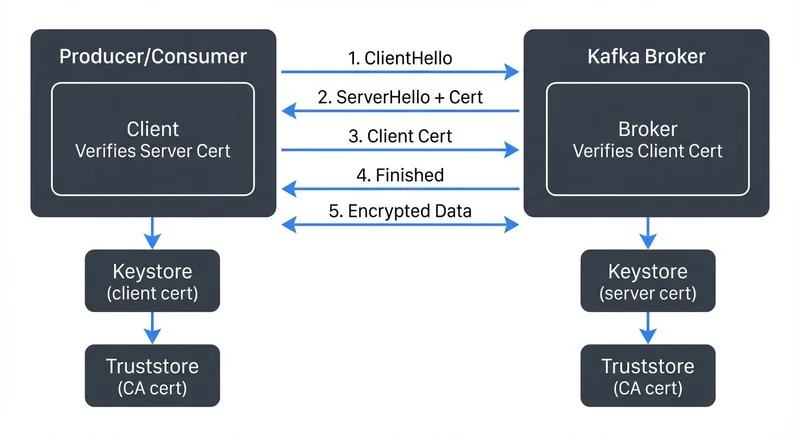

In modern data streaming architectures, securing machine-to-machine communications is paramount. While many systems rely on one-way TLS to encrypt data in transit, regulated industries and zero-trust environments demand stronger authentication guarantees.

mTLS extends traditional TLS by requiring both the client and server to present valid certificates during the connection handshake. For Kafka, this means brokers authenticate clients, and clients authenticate brokers—creating a cryptographically verified identity for every participant in the streaming platform.

mTLS is one of several authentication mechanisms available in Kafka. For a comprehensive comparison of authentication approaches including SASL/SCRAM, SASL/PLAIN, and OAuth 2.0, see [Kafka Authentication: SASL, SSL, OAuth](https://conduktor.io/glossary/kafka-authentication-sasl-ssl-oauth). For broader security context covering authorization, encryption, and operational best practices, refer to [Kafka Security Best Practices](https://conduktor.io/glossary/kafka-security-best-practices).

## Understanding mTLS vs. One-Way TLS

Traditional TLS (often called one-way TLS) establishes an encrypted connection where only the server presents a certificate to prove its identity. The client verifies this certificate against a trusted Certificate Authority (CA), ensuring it's connecting to the legitimate server. However, the server accepts any client connection without cryptographic proof of the client's identity.

Mutual TLS adds a critical second verification step. After the client verifies the server's certificate, the server requests the client's certificate and validates it against its own trusted CA. Both parties must successfully authenticate each other before any data exchange occurs.

While mTLS provides authentication (proving identity), it works in conjunction with encryption in transit. For detailed coverage of how TLS encryption protects Kafka data as it moves through your infrastructure, see [Encryption at Rest and In Transit for Kafka](https://conduktor.io/glossary/encryption-at-rest-and-in-transit-for-kafka).

<!-- ORIGINAL_DIAGRAM
```
┌──────────────────────────────────────────────────────────────────┐
│                   mTLS Handshake Flow                            │
├──────────────────────────────────────────────────────────────────┤
│                                                                  │
│  Producer/Consumer                          Kafka Broker         │
│  ┌────────────┐                            ┌────────────┐        │
│  │            │                            │            │        │
│  │  Client    │──1. ClientHello ─────────▶│   Broker   │        │
│  │            │                            │            │        │
│  │            │◀─2. ServerHello + Cert────│            │        │
│  │            │                            │            │        │
│  │  Verifies  │──3. Client Cert ─────────▶│  Verifies  │        │
│  │  Server    │                            │  Client    │        │
│  │  Cert      │◀─4. Finished ─────────────│  Cert      │        │
│  │            │                            │            │        │
│  │            │──5. Encrypted Data ───────│            │        │
│  │            │                            │            │        │
│  └────────────┘                            └────────────┘        │
│       │                                           │              │
│       ▼                                           ▼              │
│  ┌──────────┐                              ┌──────────┐          │
│  │ Keystore │                              │ Keystore │          │
│  │  (client │                              │ (server  │          │
│  │   cert)  │                              │   cert)  │          │
│  └──────────┘                              └──────────┘          │
│       │                                           │              │
│       ▼                                           ▼              │
│  ┌──────────┐                              ┌──────────┐          │
│  │Truststore│                              │Truststore│          │
│  │  (CA     │                              │  (CA     │          │
│  │   cert)  │                              │   cert)  │          │
│  └──────────┘                              └──────────┘          │
│                                                                  │
└──────────────────────────────────────────────────────────────────┘
```
-->

This bidirectional authentication model is crucial for Kafka because:

- **Machine-to-machine authentication**: Producers and consumers are typically applications, not human users. Traditional username/password mechanisms are poorly suited for automated systems that need to authenticate thousands of times per second.

- **Zero-trust architecture**: In environments where network perimeter security cannot be assumed, every connection must be individually authenticated and authorized.

- **Regulatory compliance**: Industries like finance, healthcare, and government often mandate cryptographic authentication for sensitive data streams.

## Certificate Architecture for Kafka

Implementing mTLS for Kafka requires a well-designed certificate infrastructure with three primary components:

**Certificate Authority (CA)**: The CA sits at the root of trust, issuing and signing certificates for both brokers and clients. Organizations typically operate a private CA for internal Kafka deployments, though some cloud environments integrate with managed certificate services.

**Server Certificates**: Each Kafka broker receives a server certificate signed by the CA. This certificate contains the broker's identity (typically its hostname or FQDN) and proves to clients that they're connecting to a legitimate broker. The certificate's Subject Alternative Name (SAN) field must match the broker's advertised listener addresses.

**Client Certificates**: Every producer and consumer application requires its own client certificate, also signed by the CA. These certificates identify the specific application or service, forming the basis for Kafka's Access Control Lists (ACLs). The certificate's Distinguished Name (DN) or Common Name (CN) becomes the principal used in authorization policies.

For example, a typical client certificate DN might look like:
```
CN=payment-processor,OU=Finance,O=Acme Corp,L=San Francisco,ST=California,C=US
```

Breaking this down:
- **CN** (Common Name): `payment-processor` - The application/service identifier
- **OU** (Organizational Unit): `Finance` - Department or team
- **O** (Organization): `Acme Corp` - Company name
- **L** (Locality): `San Francisco` - City
- **ST** (State): `California` - State/province
- **C** (Country): `US` - Two-letter country code

Many organizations use minimal DNs for simplicity: `CN=payment-processor,OU=production,O=Acme` contains sufficient information for most authorization policies.

The trust chain works as follows: Clients trust the CA, the CA signs broker certificates, therefore clients trust brokers. The same logic applies in reverse for broker-to-client authentication.

## Implementation: Keystores and Truststores

Kafka's mTLS implementation relies on Java's keystore and truststore mechanism:

**Keystores** contain private keys and certificates that identify the entity. Brokers have keystores with their server certificates and private keys. Clients have keystores with their client certificates and private keys. These files must be protected with strong passwords and filesystem permissions, as compromise of a private key allows impersonation.

**Truststores** contain the CA certificates used to verify the other party. Both brokers and clients need truststores containing the CA certificate that signed the certificates they'll be validating.

For Kafka brokers, the configuration looks like this:

```properties
listeners=SSL://kafka-broker:9093
security.inter.broker.protocol=SSL

# TLS 1.3 is the modern standard (2025), offering better performance and security
ssl.protocol=TLSv1.3
ssl.enabled.protocols=TLSv1.3

# PKCS12 is the modern keystore format (JKS is deprecated in Java 9+)
ssl.keystore.type=PKCS12
ssl.keystore.location=/var/private/ssl/kafka.server.keystore.p12
ssl.keystore.password=keystore-password
ssl.key.password=key-password

ssl.truststore.type=PKCS12
ssl.truststore.location=/var/private/ssl/kafka.server.truststore.p12
ssl.truststore.password=truststore-password

# Enforce mutual authentication (alternatives: 'requested' allows but doesn't require client certs)
ssl.client.auth=required
```

The critical parameter is `ssl.client.auth=required`, which enforces mutual authentication by demanding client certificates. Setting this to `requested` would allow both authenticated and unauthenticated clients, while `none` disables client certificate verification entirely.

## mTLS in KRaft Mode

Kafka 3.3+ introduced KRaft mode, eliminating ZooKeeper dependencies. KRaft mode introduces additional mTLS considerations for controller-to-controller and broker-to-controller communications.

In KRaft deployments, you must configure mTLS for the controller quorum in addition to client-facing listeners:

```properties
# Controller listener (separate from client listeners)
controller.listener.names=CONTROLLER
listeners=CONTROLLER://kafka-controller:9094,SSL://kafka-broker:9093

# Controller inter-communication uses mTLS
controller.quorum.voters=1@kafka-controller-1:9094,2@kafka-controller-2:9094,3@kafka-controller-3:9094

# Apply TLS configuration to controller listener
listener.security.protocol.map=CONTROLLER:SSL,SSL:SSL
ssl.client.auth=required
```

KRaft controllers form a Raft consensus group that stores cluster metadata. Securing this communication with mTLS is critical, as compromised controller access allows complete cluster control. Modern Kafka deployments should treat controller certificates with the same rigor as broker certificates, implementing automated rotation and monitoring.

## Certificate Lifecycle Management

Certificates have finite lifespans, and managing their lifecycle presents operational challenges in production Kafka deployments.

**Certificate Rotation**: Industry best practices recommend certificate rotation every 90 days or less. For large Kafka clusters with hundreds of applications, this creates significant operational overhead. Automation becomes mandatory—manual certificate updates across distributed systems are error-prone and don't scale.

**Expiration Monitoring**: Expired certificates cause immediate application failures. Monitoring systems must track certificate expiration dates and alert operators well in advance. Many organizations set alerts at 30, 14, and 7 days before expiration.

**Certificate Revocation**: When private keys are compromised or applications are decommissioned, their certificates must be revoked. Kafka supports Certificate Revocation Lists (CRLs) and Online Certificate Status Protocol (OCSP), though many production deployments rely on short certificate lifespans (24-72 hours) rather than implementing revocation checking. OCSP stapling, where the server provides certificate status during the handshake, is more practical than traditional CRL downloads for distributed Kafka clusters.

**Key Storage Security**: Private keys represent the security foundation of mTLS. They should never be stored in version control, shared via email, or placed in unsecured locations. Hardware Security Modules (HSMs) or cloud key management services provide the highest security, though many deployments use encrypted keystores with strict filesystem permissions.

## Performance Considerations

mTLS introduces computational overhead that impacts Kafka performance, particularly for high-throughput deployments. However, modern TLS implementations and hardware acceleration significantly reduce this overhead.

**TLS 1.3 Performance Improvements**: TLS 1.3 (recommended for 2025 deployments) offers substantial performance gains over TLS 1.2:
- **Reduced handshake latency**: TLS 1.3 completes handshakes in one round-trip instead of two, cutting connection establishment time in half
- **0-RTT resumption**: Clients can send encrypted data in the first packet when resuming sessions, eliminating handshake overhead for subsequent connections
- **Simplified cipher suites**: TLS 1.3 removes weak cryptographic algorithms, improving negotiation speed and security

**Session Resumption**: Modern Kafka clients should implement TLS session caching. When a client reconnects to a broker it recently communicated with, session resumption allows bypassing the full handshake, reusing previously negotiated keys. This dramatically improves reconnection performance, especially in microservice architectures where applications frequently restart.

**Hardware Acceleration**: Modern server processors include specialized instructions that accelerate cryptographic operations:
- **AES-NI**: Intel/AMD instruction set for hardware-accelerated AES encryption (reduces encryption overhead by 80-90%)
- **AES-GCM**: Galois/Counter Mode provides both encryption and authentication in a single operation
- **AVX-512**: Vector instructions further accelerate cryptographic operations on recent processors

**Connection Pooling**: Applications should maintain persistent connections to brokers rather than creating new connections for each operation. Connection pooling amortizes the handshake cost across thousands of messages. Most Kafka client libraries handle connection pooling automatically.

**Performance Impact**: With TLS 1.3 and modern hardware, mTLS overhead is typically 5-15% CPU increase compared to plaintext connections—significantly better than the 20-30% overhead of TLS 1.2. The exact impact varies with message size, throughput, and hardware capabilities. For most deployments, the security benefits of mTLS far outweigh the modest performance cost.

## Integration with Kafka ACLs

mTLS authentication integrates seamlessly with Kafka's authorization system. The certificate's Distinguished Name becomes the principal in ACL rules.

For example, a client certificate with `CN=payment-processor,OU=Finance,O=Company` produces the principal `CN=payment-processor,OU=Finance,O=Company`. ACL rules can then grant specific permissions:

```bash
kafka-acls --add --allow-principal "User:CN=payment-processor,OU=Finance,O=Company" \
  --operation Write --topic payments
```

This tight integration between authentication and authorization creates a robust security model: clients prove their identity with certificates, then ACLs enforce what each authenticated identity can do.

Some organizations use certificate Subject Alternative Names (SANs) or custom certificate extensions to encode additional metadata like environment (dev/staging/prod) or team ownership, enabling sophisticated authorization policies.

## Operational Challenges

Despite its security benefits, mTLS introduces operational complexity that teams must address.

**Certificate Distribution**: Every client application needs its certificate and keystore. In large organizations with hundreds of microservices, distributing and installing certificates securely becomes a significant challenge. Manual distribution doesn't scale, and automated solutions must ensure certificates reach only their intended recipients.

**Key Management**: Private keys must be protected throughout their lifecycle—during generation, storage, distribution, and eventual destruction. Leaked private keys allow attackers to impersonate legitimate applications.

**Debugging**: Connection failures in mTLS environments can stem from expired certificates, incorrect CA chains, hostname mismatches, or misconfigured truststores. Troubleshooting requires SSL/TLS expertise and careful examination of certificate properties.

**Multi-tenant Environments**: Platforms serving multiple teams or customers must isolate certificates and ensure one tenant cannot use another's credentials. This requires careful certificate namespace design and strict validation of certificate properties.

## Best Practices for Production

Successful mTLS deployments in production Kafka environments follow several key practices:

**Automate Certificate Management**: Use tools like cert-manager (Kubernetes), HashiCorp Vault, or AWS Certificate Manager to automate certificate issuance, renewal, and distribution. Manual processes don't scale and create security vulnerabilities.

**Implement Certificate Monitoring**: Deploy monitoring systems that track certificate expiration dates, validate certificate chains, and alert on upcoming expirations or validation failures.

**Use Short Certificate Lifespans**: While operationally more challenging, shorter certificate validity periods (30-90 days) limit the damage from compromised keys and force automation maturity.

**Separate Environments**: Use different CAs or certificate namespaces for development, staging, and production environments. This prevents production certificates from being accidentally deployed to less secure environments.

**Document Certificate Standards**: Establish organizational standards for certificate DNs, including naming conventions for different application types and environments.

**Test Certificate Rotation**: Regularly test certificate rotation procedures in non-production environments to ensure automation works correctly and applications handle certificate updates gracefully.

**Implement Least Privilege**: Combine mTLS authentication with fine-grained ACLs that grant each application only the minimum permissions required for its function.

## Certificate Management Tools

Modern infrastructure platforms provide tools that simplify mTLS implementation for 2025 deployments:

**cert-manager (Kubernetes)**: A Kubernetes-native certificate management tool that automates certificate issuance and renewal from various CAs (Let's Encrypt, Vault, AWS Private CA). It integrates seamlessly with Kafka deployments running in Kubernetes, automatically rotating certificates and updating secrets. cert-manager supports PKCS12 keystores and can configure certificates for StatefulSets running Kafka brokers.

**SPIFFE/SPIRE**: The Secure Production Identity Framework For Everyone (SPIFFE) provides workload identity standards, while SPIRE implements these standards. SPIRE automatically issues and rotates short-lived certificates (often with 1-hour lifespans) for cloud-native applications. This approach eliminates most certificate lifecycle management overhead:

```yaml
# SPIRE automatically provisions certificates for Kafka clients
apiVersion: v1
kind: Pod
metadata:
  name: kafka-producer
spec:
  serviceAccountName: payment-processor
  # SPIRE injects certificates via volume mount or Unix domain socket
  volumes:
  - name: spire-agent-socket
    hostPath:
      path: /run/spire/sockets/agent.sock
```

SPIRE's automatic rotation means applications never handle long-lived certificates, dramatically reducing security risk from compromised keys.

**HashiCorp Vault PKI**: Provides a PKI secrets engine that acts as an internal CA, issuing short-lived certificates programmatically. Vault's API-driven approach fits automated deployment pipelines and integrates with Kubernetes via the Vault Agent Injector:

```bash
# Issue a 24-hour certificate via Vault API
vault write pki/issue/kafka-client common_name="payment-processor.prod" ttl=24h
```

**AWS Certificate Manager Private CA**: Issues certificates for internal workloads and integrates with AWS Secrets Manager for automated distribution. While primarily designed for AWS environments, ACM Private CA supports external certificate signing requests (CSRs) from Kafka clients running anywhere.

**Modern Keystore Formats**: Note that all modern certificate management tools default to PKCS12 keystores rather than legacy JKS (Java KeyStore). PKCS12 is an industry-standard format that works across languages and platforms, while JKS was deprecated in Java 9. When generating keystores for Kafka, always specify `-storetype PKCS12` with keytool.

These tools transform mTLS from an operational burden into a manageable, largely automated component of Kafka infrastructure.

## Governance and Compliance

Organizations concerned with data governance—particularly those in regulated industries—need comprehensive visibility into their Kafka security posture beyond just implementing mTLS. While mTLS handles authentication and encryption at the connection level, governance platforms provide operational oversight and compliance enforcement.

**Conduktor** offers governance capabilities that complement mTLS authentication by providing:
- **Centralized security visibility**: Monitor which certificates are being used, track access patterns, and audit authentication attempts across your entire Kafka infrastructure
- **Certificate lifecycle tracking**: Dashboard views of certificate expiration dates, rotation schedules, and compliance with organizational policies
- **Policy enforcement**: Ensure all clients use approved certificate authorities and detect unauthorized certificate usage
- **Compliance reporting**: Generate audit trails showing that only properly authenticated clients accessed sensitive topics, supporting SOC 2, HIPAA, and GDPR requirements

For organizations running Kafka in production with strict security requirements, combining mTLS authentication with governance platforms creates a complete security and compliance solution. mTLS provides the cryptographic foundation, while governance tools ensure policies are consistently enforced and auditable.

## Troubleshooting Common mTLS Issues

mTLS configuration errors can be cryptic and difficult to diagnose. Here are the most common issues and their solutions:

**Certificate Hostname Mismatch**
```
ERROR: Certificate doesn't match broker address
```
**Cause**: The broker's certificate Subject Alternative Name (SAN) doesn't match the hostname used to connect.

**Solution**: Ensure the certificate SAN includes all advertised listener addresses. Verify with:
```bash
openssl x509 -in server.crt -text -noout | grep "Subject Alternative Name" -A1
```

**Expired Certificates**
```
ERROR: Certificate has expired
```
**Cause**: Client or server certificate has passed its validity period.

**Solution**: Check certificate expiration dates before failures occur:
```bash
openssl x509 -in client.crt -noout -dates
```
Implement automated monitoring with alerts at 30, 14, and 7 days before expiration.

**Truststore Issues**
```
ERROR: unable to find valid certification path
```
**Cause**: The truststore doesn't contain the CA certificate that signed the peer's certificate, or the trust chain is incomplete.

**Solution**: Verify the truststore contains the correct CA:
```bash
keytool -list -keystore kafka.server.truststore.p12 -storepass password
```
Ensure intermediate certificates are included if your CA uses a multi-level hierarchy.

**Permission Denied After Successful Authentication**
```
ERROR: Not authorized to access topics
```
**Cause**: mTLS authentication succeeded, but Kafka ACLs don't grant permissions to the certificate's DN.

**Solution**: Verify the principal extracted from your certificate:
```bash
openssl x509 -in client.crt -noout -subject
```
Then check ACLs match this exact principal:
```bash
kafka-acls --list --principal "User:CN=payment-processor,OU=Finance,O=Acme Corp"
```

**TLS Protocol Mismatch**
```
ERROR: Received fatal alert: protocol_version
```
**Cause**: Client and server don't support compatible TLS versions.

**Solution**: Ensure both client and broker enable TLS 1.3 or at minimum TLS 1.2. Never enable TLS 1.0/1.1 (deprecated and insecure).

**Debugging Certificate Chains**
For complex certificate issues, enable SSL debugging in your Kafka clients:
```properties
# Add to producer/consumer properties
ssl.debug=all
```
Or set the JVM property:
```bash
-Djavax.net.debug=ssl:handshake:verbose
```

This produces detailed logs showing certificate validation steps, helping identify exactly where authentication fails.

## Conclusion

Mutual TLS represents the gold standard for authenticating Kafka clients in enterprise and regulated environments. While it introduces operational complexity compared to simpler authentication methods, the security guarantees justify the investment for organizations handling sensitive data or operating in zero-trust architectures.

Successful mTLS deployments require careful planning of certificate infrastructure, investment in automation tools, and operational discipline around certificate lifecycle management. Teams that master these aspects gain cryptographically verified identity for every Kafka client—the foundation for robust authorization policies and regulatory compliance.

## Related Concepts

- [Kafka Authentication: SASL, SSL, OAuth](https://conduktor.io/glossary/kafka-authentication-sasl-ssl-oauth) - Comprehensive comparison of mTLS with other authentication mechanisms like SASL/SCRAM and OAuth.
- [Zero Trust for Streaming](https://conduktor.io/glossary/zero-trust-for-streaming) - How mTLS fits into a broader zero-trust security architecture for streaming platforms.
- [Encryption at Rest and in Transit for Kafka](https://conduktor.io/glossary/encryption-at-rest-and-in-transit-for-kafka) - TLS encryption configuration that complements mTLS authentication.

## Sources and References

- [Apache Kafka Security Documentation](https://kafka.apache.org/documentation/#security) - Official Kafka security configuration and SSL/TLS setup
- [Confluent Security Tutorial](https://docs.confluent.io/platform/current/security/security_tutorial.html) - Comprehensive guide to Kafka security including mTLS implementation
- [NIST SP 800-52 Rev. 2: Guidelines for TLS Implementations](https://csrc.nist.gov/publications/detail/sp/800-52/rev-2/final) - Federal guidelines for TLS configuration and certificate management
- [RFC 5280: Internet X.509 Public Key Infrastructure](https://datatracker.ietf.org/doc/html/rfc5280) - Standard for X.509 certificates used in mTLS
- [HashiCorp Vault PKI Secrets Engine](https://developer.hashicorp.com/vault/docs/secrets/pki) - Automated certificate management for distributed systems
