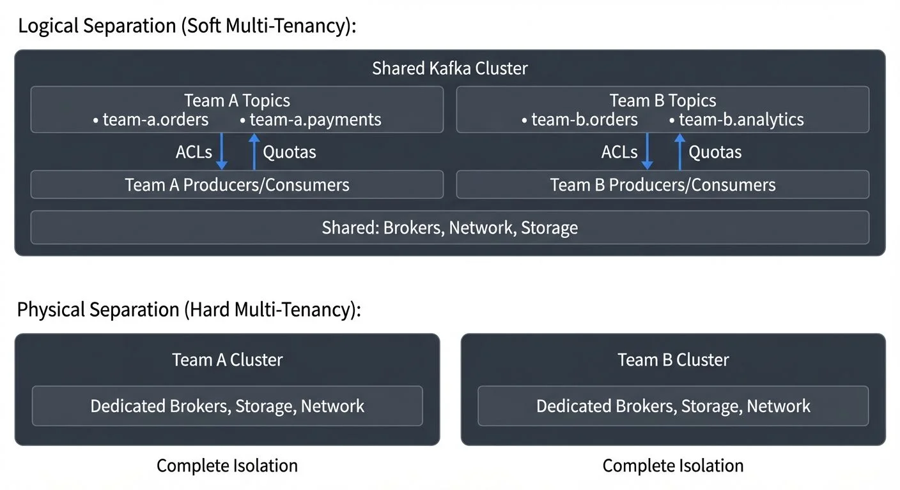

# Multi-Tenancy in Kafka Environments

As organizations scale their use of Apache Kafka, they often face a critical decision: should each team or application have its own dedicated Kafka cluster, or can multiple tenants safely share the same infrastructure? Multi-tenancy in Kafka environments offers a way to consolidate resources, reduce operational overhead, and lower costs while maintaining the isolation and security that different teams require.

## What is Multi-Tenancy?

Multi-tenancy refers to the architectural approach where a single Kafka deployment serves multiple independent users, teams, or applications—each considered a "tenant." The goal is to share infrastructure resources efficiently while ensuring that tenants remain isolated from each other in terms of data access, performance, and operational impact.

In a multi-tenant Kafka environment, different business units might share the same cluster. For example, a financial services company could host data streams for their trading platform, risk management system, and customer analytics on a single cluster, with each system operating as a separate tenant.

The alternative to multi-tenancy is deploying dedicated clusters for each use case. While this provides maximum isolation, it significantly increases infrastructure costs, operational complexity, and management overhead.

For background on Kafka's architecture and capabilities, see [Apache Kafka](apache-kafka.md).

## Multi-Tenancy Models in Kafka

Organizations can implement multi-tenancy in Kafka using different models, each with distinct trade-offs:



<!-- ORIGINAL_DIAGRAM
```
Logical Separation (Soft Multi-Tenancy):
┌───────────────────────────────────────────────────────────┐
│              Shared Kafka Cluster                          │
│                                                            │
│  ┌──────────────────────┐      ┌──────────────────────┐  │
│  │   Team A Topics      │      │   Team B Topics      │  │
│  │  • team-a.orders     │      │  • team-b.orders     │  │
│  │  • team-a.payments   │      │  • team-b.analytics  │  │
│  └──────────────────────┘      └──────────────────────┘  │
│           │  ACLs                        │  ACLs          │
│           ▼  Quotas                      ▼  Quotas        │
│  ┌──────────────────────┐      ┌──────────────────────┐  │
│  │  Team A Producers/   │      │  Team B Producers/   │  │
│  │     Consumers        │      │     Consumers        │  │
│  └──────────────────────┘      └──────────────────────┘  │
│                                                            │
│       Shared: Brokers, Network, Storage                   │
└────────────────────────────────────────────────────────────┘

Physical Separation (Hard Multi-Tenancy):
┌──────────────────────┐        ┌──────────────────────┐
│  Team A Cluster      │        │  Team B Cluster      │
│  ┌────────────────┐  │        │  ┌────────────────┐  │
│  │ Dedicated      │  │        │  │ Dedicated      │  │
│  │ Brokers        │  │        │  │ Brokers        │  │
│  │ Storage        │  │        │  │ Storage        │  │
│  │ Network        │  │        │  │ Network        │  │
│  └────────────────┘  │        │  └────────────────┘  │
└──────────────────────┘        └──────────────────────┘
   Complete Isolation             Complete Isolation
```
-->

### Logical Separation (Soft Multi-Tenancy)

In this model, all tenants share the same physical Kafka cluster but are separated through logical boundaries. Tenants use different topic namespaces, consumer groups, and access controls.

For example, topics might follow a naming convention like `team-a.orders` and `team-b.orders`, with ACLs preventing Team A from accessing Team B's data. This approach maximizes resource utilization and minimizes infrastructure costs.

However, tenants still share underlying brokers, network bandwidth, and storage. This means one tenant's behavior can potentially impact others—a problem known as the "noisy neighbor" effect, where one tenant's excessive resource consumption (high throughput, many connections, or disk usage) degrades performance for other tenants sharing the same infrastructure.

### Physical Separation (Hard Multi-Tenancy)

Physical separation involves deploying dedicated Kafka clusters for each tenant or group of tenants. This provides strong isolation guarantees and eliminates noisy neighbor problems.

Organizations often choose this model when regulatory requirements mandate complete data separation, or when performance SLAs are critical. The downside is increased cost and operational complexity, as each cluster requires separate management, monitoring, and maintenance.

### Hybrid Approach

Many enterprises adopt a hybrid model, using logical separation for most use cases while reserving dedicated clusters for high-criticality or regulated workloads. This balances cost efficiency with isolation requirements.

### KRaft Mode Benefits for Multi-Tenancy (Kafka 4.0+)

Kafka's KRaft mode (production-ready in Kafka 4.0+) brings significant advantages for multi-tenant deployments:

**Metadata Performance**: KRaft eliminates ZooKeeper dependency, enabling much faster metadata operations. This is critical in multi-tenant environments where frequent topic creation, ACL updates, and partition reassignments are common across many tenants.

**Higher Partition Scalability**: KRaft clusters can efficiently handle 500,000+ partitions, compared to ~200,000 with ZooKeeper. This allows more tenants to coexist on a single cluster or enables more granular topic partitioning strategies.

**Faster Cluster Operations**: Controller failover, partition leader elections, and configuration changes complete in milliseconds rather than seconds. This reduces the impact of administrative operations on tenant workloads.

**Simplified Operations**: Removing ZooKeeper reduces operational complexity, infrastructure costs, and the failure domains in multi-tenant clusters—one less distributed system to manage.

For detailed information on KRaft mode, see [Understanding KRaft Mode in Kafka](understanding-kraft-mode-in-kafka.md).

## Isolation Strategies

Effective multi-tenancy requires multiple layers of isolation to protect tenants from each other:

### Namespace Isolation

The foundation of logical multi-tenancy is namespace organization. Teams should adopt clear naming conventions for topics, consumer groups, and other resources. A common pattern is prefixing resources with team or application identifiers, such as `finance.transactions` or `marketing.events`.

This makes it easier to apply access controls and track resource ownership at scale.

### Access Control Lists (ACLs)

Kafka's ACL system controls which principals (users or applications) can perform specific operations on resources. A principal is an authenticated identity in Kafka, such as a user account or service account, that can be granted permissions. In a multi-tenant environment, ACLs ensure that tenants can only access their own topics and consumer groups.

For example, you might configure ACLs so that the `analytics-team` principal has read and write access to topics matching `analytics.*`, but no access to `finance.*` topics.

Governance platforms can simplify ACL management by providing visual interfaces to create, review, and audit permissions across tenants, reducing the risk of misconfiguration.

For comprehensive coverage of ACL patterns and best practices, see [Kafka ACLs and Authorization Patterns](kafka-acls-and-authorization-patterns.md).

### Quotas and Rate Limiting

Kafka supports quotas to limit the resources any single client can consume. Quotas can restrict:

- **Producer byte rate**: How much data a producer can send per second
- **Consumer byte rate**: How much data a consumer can fetch per second
- **Request rate**: Number of requests per second (Kafka 0.11+)
- **Controller mutation rate**: Rate of metadata changes like topic creation or ACL updates (Kafka 3.3+, KRaft-specific)

By setting quotas per tenant, platform teams can prevent one tenant from monopolizing cluster resources. For instance, if Team A starts producing data at 100 MB/s, quotas ensure they don't degrade performance for Team B's applications.

```bash
# Modern quota configuration using kafka-configs (dynamic, no broker restart)
# Set producer quota for tenant-a user
kafka-configs.sh --bootstrap-server localhost:9092 \
  --alter --add-config 'producer_byte_rate=10485760,consumer_byte_rate=20971520' \
  --entity-type users --entity-name tenant-a

# Set controller mutation quota (KRaft mode, Kafka 3.3+)
kafka-configs.sh --bootstrap-server localhost:9092 \
  --alter --add-config 'controller_mutation_rate=10' \
  --entity-type users --entity-name tenant-a

# Set request rate quota (Kafka 0.11+)
kafka-configs.sh --bootstrap-server localhost:9092 \
  --alter --add-config 'request_percentage=50' \
  --entity-type users --entity-name tenant-a
```

Modern Kafka (3.0+) allows dynamic quota updates without broker restarts, enabling real-time adjustment based on tenant behavior or SLA changes.

For detailed quota implementation patterns, see [Quotas and Rate Limiting in Kafka](quotas-and-rate-limiting-in-kafka.md).

## Security and Access Control

Security is paramount in multi-tenant environments where sensitive data from different business units coexists.

### Authentication

Kafka supports multiple authentication mechanisms including SASL/PLAIN, SASL/SCRAM, SASL/OAUTHBEARER (OAuth/OIDC), Kerberos, and mutual TLS (mTLS). Each tenant should have unique credentials, preventing unauthorized access if one tenant's credentials are compromised.

Modern deployments (Kafka 2.0+) increasingly use OAuth/OIDC for authentication, enabling integration with enterprise identity providers and centralized access management. For more on securing Kafka with mutual TLS, see [mTLS for Kafka](mtls-for-kafka.md).

### Authorization

Beyond authentication, authorization through ACLs ensures tenants can only perform permitted operations. Role-based access control (RBAC) can simplify this by assigning roles like "producer," "consumer," or "admin" to users.

Modern governance platforms like Conduktor provide advanced authorization capabilities, including centralized policy management, visual ACL editors, and audit trails for tracking permission changes across tenants.

### Encryption

Data in transit should be encrypted using TLS to prevent eavesdropping. For highly sensitive use cases, consider encryption at rest as well, though this can impact performance.

## Performance and Resource Management

Multi-tenancy introduces challenges around resource contention and performance predictability.

### Preventing Noisy Neighbors

Without proper controls, one tenant's workload can impact others. Common scenarios include:

- A producer sending data faster than the cluster can handle
- A consumer creating lag that increases disk usage
- Misconfigured applications creating excessive connections

Quotas are the primary defense against noisy neighbors, but monitoring is equally important. Platform teams should track metrics like produce/fetch rates, disk usage, and connection counts per tenant to identify problems early.

### Capacity Planning

Multi-tenant clusters require careful capacity planning. Consider:

- The number of partitions (Kafka 4.0+ with KRaft can handle 500,000+ partitions per cluster, a significant improvement over ZooKeeper-based deployments)
- Network throughput requirements across all tenants
- Storage growth rates and retention policies
- The number of concurrent connections

KRaft mode (Kafka 3.0+, production-ready in 4.0+) dramatically improves metadata performance for multi-tenant clusters, enabling faster topic creation, partition rebalancing, and controller operations—critical for environments with many tenants.

Tools that provide tenant-level observability can help platform teams understand usage patterns and plan capacity accordingly. For comprehensive capacity planning guidance, see [Kafka Capacity Planning](kafka-capacity-planning.md).

## Operational Challenges and Best Practices

Running multi-tenant Kafka environments introduces operational complexity:

### Self-Service with Guardrails

Teams want autonomy to create topics and manage their data streams, but without governance, clusters can become chaotic. Implementing self-service portals with built-in policy enforcement helps balance autonomy with control.

Governance platforms like Conduktor enable teams to request topic creation through a UI while automatically enforcing policies like naming conventions, replication factors, and retention limits. This reduces the burden on platform teams while maintaining standards.

**Testing Multi-Tenant Isolation**: Conduktor Gateway provides proxy-based capabilities to test multi-tenant behavior, including:
- Simulating quota enforcement and throttling
- Testing tenant isolation under chaos conditions
- Validating ACL configurations without impacting production
- Intercepting and filtering messages at the tenant level

This enables platform teams to validate multi-tenancy strategies before deploying to production.

### Monitoring and Observability

In multi-tenant environments, monitoring must provide both cluster-wide and tenant-specific views. Platform teams need cluster health metrics, while individual tenants need visibility into their own resource usage and application performance.

Tagging resources by tenant and using tenant-aware dashboards helps teams quickly identify and troubleshoot issues without sifting through unrelated data.

### Schema Management

When multiple teams produce data to shared clusters, schema management becomes critical. Using a schema registry with permissions aligned to tenants prevents incompatible schema changes from breaking downstream consumers.

In multi-tenant environments, the schema registry itself should support namespace isolation, ensuring tenants can only modify schemas for their own topics. For comprehensive coverage of schema management strategies, see [Schema Registry and Schema Management](schema-registry-and-schema-management.md).

### Cost Allocation

Organizations often want to charge back infrastructure costs to the teams using it. Tracking resource consumption (throughput, storage, partition count) per tenant enables fair cost allocation and encourages efficient resource use.

## Multi-Tenancy in the Streaming Ecosystem

Multi-tenancy considerations extend beyond Kafka to the broader streaming ecosystem. Apache Flink, ksqlDB, and other stream processing frameworks must also support tenant isolation when operating on shared infrastructure.

For Flink, this might involve namespace separation for jobs, resource quotas per tenant, and isolated state backends. The principles are similar to Kafka: balance shared infrastructure efficiency with the isolation requirements of each workload.

Platforms like Conduktor provide comprehensive multi-tenancy features out of the box, including quota management, ACLs, monitoring, and self-service governance portals. Cloud-based options like AWS MSK also offer multi-tenancy capabilities. However, understanding these concepts remains essential for designing secure and performant streaming architectures.

## Summary

Multi-tenancy in Kafka environments enables organizations to consolidate infrastructure, reduce costs, and simplify operations while serving multiple teams and applications. Success requires careful implementation of isolation strategies including namespace organization, ACLs, quotas, and security controls.

The choice between logical and physical separation depends on your specific requirements around cost, isolation, and compliance. Most organizations benefit from a hybrid approach that uses shared clusters where appropriate and dedicated clusters for critical workloads.

Key best practices include:

- Enforce clear naming conventions and resource tagging
- Implement quotas to prevent noisy neighbor problems
- Use authentication and authorization to secure tenant data
- Provide self-service capabilities with governance guardrails
- Monitor both cluster-wide and tenant-specific metrics
- Plan capacity based on aggregate tenant requirements

With thoughtful design and proper tooling, multi-tenant Kafka deployments can deliver the benefits of shared infrastructure without compromising on isolation, security, or performance.

## Sources and References

1. [Confluent - Multi-Tenancy Deployment Options](https://docs.confluent.io/platform/current/kafka/deployment.html) - Official documentation on Kafka multi-tenancy patterns and best practices.

2. [Apache Kafka Documentation - Security](https://kafka.apache.org/documentation/#security) - Comprehensive guide to Kafka's authentication, authorization, and encryption capabilities.

3. [Uber Engineering - Scaling Kafka at Uber](https://www.uber.com/blog/kafka/) - Case study detailing Uber's approach to multi-tenant Kafka infrastructure at massive scale.

4. [Kafka Quotas Documentation](https://kafka.apache.org/documentation/#design_quotas) - Technical specification of Kafka's quota mechanisms for resource management.

5. [AWS MSK - Best Practices for Multi-Tenancy](https://docs.aws.amazon.com/msk/latest/developerguide/best-practices.html) - Cloud provider guidance on implementing multi-tenant Kafka deployments.
