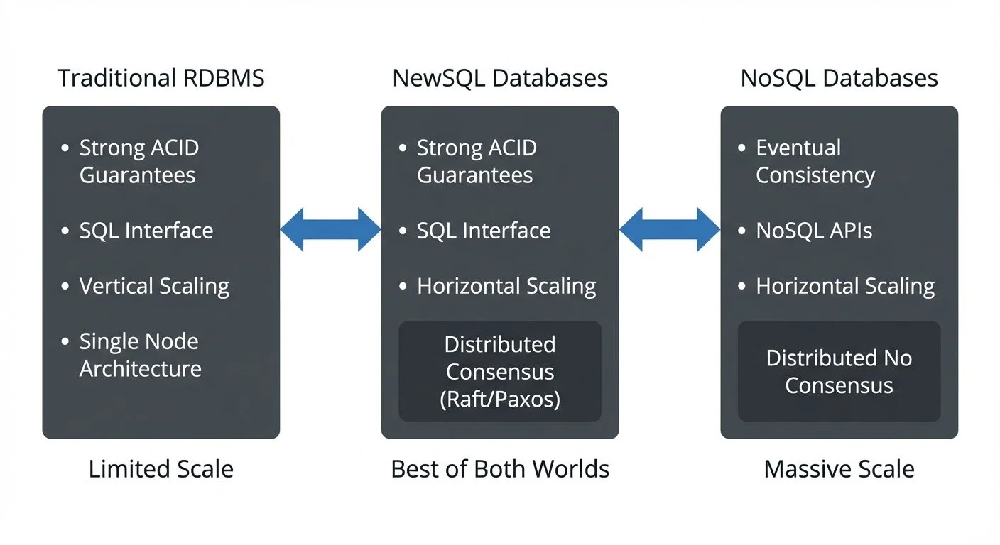

## Introduction: The NewSQL Evolution

For decades, organizations faced a difficult choice when selecting databases. Traditional relational databases (RDBMS) like PostgreSQL and MySQL offered strong ACID guarantees and familiar SQL interfaces, but struggled to scale horizontally. [NoSQL databases](https://conduktor.io/glossary/nosql-databases-real-time) like Cassandra and MongoDB provided massive scalability, but sacrificed transactional consistency and the powerful querying capabilities of SQL.

NewSQL databases emerged to bridge this gap, offering the best of both worlds: the familiar SQL interface and ACID guarantees of traditional RDBMS, combined with the horizontal scalability and fault tolerance of NoSQL systems. As [real-time data streaming](https://conduktor.io/glossary/what-is-real-time-data-streaming) becomes essential for modern applications, NewSQL databases provide the transactional guarantees and scale needed to power [event-driven architectures](https://conduktor.io/glossary/event-driven-architecture).

## What is NewSQL?

NewSQL is a category of modern relational database management systems that provide the same scalable performance as NoSQL systems while maintaining the ACID guarantees and SQL interface of traditional databases. The term was coined around 2011 to describe this new generation of distributed databases.



<!-- ORIGINAL_DIAGRAM
```
Traditional RDBMS          NewSQL Databases           NoSQL Databases
┌─────────────────┐      ┌─────────────────┐      ┌─────────────────┐
│ Strong ACID     │      │ Strong ACID     │      │ Eventual        │
│ Guarantees      │      │ Guarantees      │      │ Consistency     │
│                 │      │                 │      │                 │
│ SQL Interface   │◀────▶│ SQL Interface   │◀────▶│ NoSQL APIs      │
│                 │      │                 │      │                 │
│ Vertical        │      │ Horizontal      │      │ Horizontal      │
│ Scaling         │      │ Scaling         │      │ Scaling         │
│                 │      │                 │      │                 │
│ Single Node     │      │ ┌─────────────┐ │      │ ┌─────────────┐ │
│ Architecture    │      │ │Distributed  │ │      │ │Distributed  │ │
│                 │      │ │Consensus    │ │      │ │No Consensus │ │
│                 │      │ │(Raft/Paxos) │ │      │ │             │ │
│                 │      │ └─────────────┘ │      │ └─────────────┘ │
└─────────────────┘      └─────────────────┘      └─────────────────┘
     Limited                Best of Both               Massive
     Scale                     Worlds                  Scale
```
-->

The core promise of NewSQL is simple: you shouldn't have to choose between consistency and scalability. These systems achieve this through modern distributed systems techniques, including:

- **Distributed consensus protocols** like Raft or Paxos (algorithms that coordinate agreement across multiple nodes) for maintaining consistency across nodes
- **Automatic sharding** that distributes data across multiple machines transparently
- **Global transaction coordination** that ensures ACID properties across distributed data
- **Multi-version concurrency control (MVCC)** for high-performance reads without blocking writes. MVCC keeps multiple versions of data simultaneously, allowing readers to access consistent snapshots while writers continue making changes

Unlike traditional databases that scale vertically (adding more resources to a single machine), NewSQL databases scale horizontally by adding more commodity servers to the cluster.

## Key NewSQL Characteristics

### Distributed Architecture

NewSQL databases are designed from the ground up for distributed deployment. Data is automatically partitioned (sharded) across multiple nodes, with each shard replicated for fault tolerance. If a node fails, the system automatically reroutes requests to healthy replicas without data loss or downtime.

### Strong Consistency

Despite being distributed, NewSQL databases maintain strong consistency guarantees. Unlike eventually consistent NoSQL systems where different nodes might temporarily show different values, NewSQL databases ensure that all clients see the same view of the data. This is achieved through distributed consensus protocols that coordinate writes across replicas.

### Horizontal Scalability

NewSQL databases can grow by adding more machines to the cluster. This happens transparently—applications don't need to be rewritten when the cluster expands. The database automatically rebalances data across the new nodes and adjusts query routing.

### SQL Compatibility

NewSQL databases support standard SQL interfaces, making them compatible with existing tools, ORMs, and developer skills. Most implement large subsets of the SQL standard, including joins, transactions, indexes, and constraints.

## Popular NewSQL Databases

### CockroachDB

Built on Google's Spanner design, CockroachDB uses a distributed key-value architecture with a SQL layer on top. It emphasizes survivability, automatically replicating and rebalancing data across geographically distributed nodes. CockroachDB uses a multi-active availability model, meaning all nodes can accept both reads and writes.

**2025 Capabilities**: CockroachDB Serverless offers elastic scaling with pay-per-use pricing, ideal for variable streaming workloads. Multi-region SQL capabilities allow fine-grained control over data placement, enabling low-latency reads near stream consumers while maintaining global consistency. The distributed SQL optimizer includes cost-based query planning that adapts to streaming write patterns.

### YugabyteDB

YugabyteDB combines PostgreSQL's query layer with a distributed storage engine inspired by Apache HBase. It offers both SQL and Cassandra-compatible APIs. YugabyteDB focuses on PostgreSQL compatibility, making migration from traditional PostgreSQL databases relatively straightforward.

**2025 Enhancements**: Improved distributed SQL optimizer reduces latency for complex analytical queries on streaming data. Native support for row-level geo-partitioning enables compliance with data residency requirements while processing global event streams. Point-in-time recovery (PITR) enhancements provide sub-second granularity for recovering from data quality incidents.

### TiDB

Developed by PingCAP, TiDB uses a layered architecture with stateless SQL nodes (TiDB) and a distributed transactional key-value store (TiKV). It's MySQL-compatible and particularly popular in the APAC region. TiDB separates storage (TiKV) from compute (TiDB layer), allowing independent scaling.

**2025 Features**: Resource Control groups allow prioritization of streaming ingestion workloads versus analytical queries on the same cluster. Placement Policies provide declarative control over data location, useful for processing region-specific event streams. TiFlash (columnar storage extension) enables real-time OLAP on freshly ingested streaming data without ETL.

### Google Spanner

The original inspiration for many NewSQL systems, Spanner is Google's globally distributed database service. It uses atomic clocks and GPS to provide external consistency across data centers worldwide. While proprietary to Google Cloud, Spanner's design papers have influenced the entire NewSQL category.

### Emerging Serverless Options

**Neon** provides serverless PostgreSQL with branching capabilities, enabling instant creation of database copies for testing streaming pipelines. Its separation of storage and compute allows elastic scaling that matches streaming ingestion patterns.

**PlanetScale** offers serverless MySQL built on Vitess, with non-blocking schema changes that integrate seamlessly with streaming workflows. Schema changes propagate without downtime, critical for evolving event schemas in production streams.

## NewSQL in Streaming Architectures

NewSQL databases play several critical roles in real-time streaming architectures.

### Change Data Capture (CDC)

NewSQL databases can serve as source systems for event streams through [Change Data Capture (CDC)](https://conduktor.io/glossary/what-is-change-data-capture-cdc-fundamentals). Tools like [Debezium](https://conduktor.io/glossary/implementing-cdc-with-debezium) can capture row-level changes from databases like CockroachDB and YugabyteDB, publishing them to Kafka topics. Because NewSQL databases support transactions, CDC can capture changes in a consistent, ordered manner that preserves transactional boundaries—meaning if three table updates happen in one database transaction, CDC ensures all three changes are captured as a cohesive unit with the same transaction ID.

**Example: Financial Transaction CDC**

Consider a money transfer between two accounts within a NewSQL database. The transaction updates two rows atomically:

```sql
BEGIN;
UPDATE accounts SET balance = balance - 100 WHERE account_id = 'A';
UPDATE accounts SET balance = balance + 100 WHERE account_id = 'B';
COMMIT;
```

Debezium captures both updates from the transaction log and publishes them to Kafka with metadata indicating they belong to the same transaction. Downstream consumers can reconstruct the transactional boundary, ensuring the transfer is processed atomically in the streaming pipeline.

For scenarios requiring guaranteed event publishing alongside database writes, consider the [Outbox pattern](https://conduktor.io/glossary/outbox-pattern-for-reliable-event-publishing), which uses CDC to reliably publish events from an outbox table within the same transaction as business data updates.

**CockroachDB CDC Configuration**

CockroachDB provides native CDC through changefeeds that stream row-level changes directly to Kafka:

```sql
-- Create an enterprise changefeed for CockroachDB
CREATE CHANGEFEED FOR TABLE accounts, transactions
  INTO 'kafka://kafka-broker:9092'
  WITH updated, resolved = '10s',
       format = 'avro',
       confluent_schema_registry = 'http://schema-registry:8081';
```

This changefeed configuration:
- Monitors the `accounts` and `transactions` tables
- Publishes changes to Kafka in Avro format
- Includes full row data after updates (not just changed columns)
- Emits resolved timestamps every 10 seconds for watermark tracking

**YugabyteDB CDC with Debezium**

For YugabyteDB, which is PostgreSQL-compatible, use the Debezium PostgreSQL connector:

```json
{
  "name": "yugabyte-cdc-connector",
  "config": {
    "connector.class": "io.debezium.connector.postgresql.PostgresConnector",
    "database.hostname": "yugabyte-host",
    "database.port": "5433",
    "database.user": "debezium_user",
    "database.password": "secret",
    "database.dbname": "ecommerce",
    "database.server.name": "yugabyte_prod",
    "table.include.list": "public.orders,public.order_items",
    "plugin.name": "pgoutput",
    "publication.autocreate.mode": "filtered",
    "transforms": "unwrap",
    "transforms.unwrap.type": "io.debezium.transforms.ExtractNewRecordState",
    "transforms.unwrap.drop.tombstones": "false"
  }
}
```

The configuration captures changes from the `orders` and `order_items` tables, using YugabyteDB's native PostgreSQL replication protocol. The `ExtractNewRecordState` transform simplifies the CDC payload, extracting just the new row state rather than the full before/after envelope.

### Real-Time OLTP

NewSQL databases excel as the operational data store for real-time applications that consume from streams. Consider an inventory management system that processes order events from Kafka. The system needs to:

- Update inventory counts transactionally
- Enforce constraints (no overselling)
- Serve real-time queries about current stock levels
- Scale to handle high order volumes

A NewSQL database can handle all these requirements while maintaining ACID guarantees that prevent inventory inconsistencies, even under high concurrency.

**Example: Kafka Consumer to NewSQL**

This Java example shows a Kafka consumer writing to CockroachDB with proper transaction handling and idempotency:

```java
import org.apache.kafka.clients.consumer.*;
import java.sql.*;
import java.util.*;

public class InventoryStreamProcessor {
    private final Connection dbConnection;
    private final KafkaConsumer<String, OrderEvent> consumer;

    public void processOrderStream() {
        consumer.subscribe(Collections.singletonList("orders"));

        while (true) {
            ConsumerRecords<String, OrderEvent> records =
                consumer.poll(Duration.ofMillis(100));

            for (ConsumerRecord<String, OrderEvent> record : records) {
                try {
                    // Use Kafka offset as idempotency key
                    processOrderWithIdempotency(record);

                    // Commit offset only after successful DB write
                    consumer.commitSync(Collections.singletonMap(
                        new TopicPartition(record.topic(), record.partition()),
                        new OffsetAndMetadata(record.offset() + 1)
                    ));
                } catch (SQLException e) {
                    // Handle DB errors with retry or DLQ
                    handleProcessingError(record, e);
                }
            }
        }
    }

    private void processOrderWithIdempotency(
        ConsumerRecord<String, OrderEvent> record) throws SQLException {

        dbConnection.setAutoCommit(false);

        try {
            // Check if already processed using offset tracking table
            String checkSql = """
                SELECT 1 FROM processed_offsets
                WHERE topic = ? AND partition = ? AND offset = ?
                """;
            try (PreparedStatement ps = dbConnection.prepareStatement(checkSql)) {
                ps.setString(1, record.topic());
                ps.setInt(2, record.partition());
                ps.setLong(3, record.offset());
                ResultSet rs = ps.executeQuery();
                if (rs.next()) {
                    dbConnection.rollback();
                    return; // Already processed
                }
            }

            // Deduct inventory with constraint check
            String updateSql = """
                UPDATE inventory
                SET quantity = quantity - ?,
                    updated_at = NOW()
                WHERE product_id = ? AND quantity >= ?
                """;
            try (PreparedStatement ps = dbConnection.prepareStatement(updateSql)) {
                ps.setInt(1, record.value().quantity);
                ps.setString(2, record.value().productId);
                ps.setInt(3, record.value().quantity);
                int updated = ps.executeUpdate();

                if (updated == 0) {
                    // Insufficient inventory
                    publishToOutOfStockTopic(record.value());
                    dbConnection.rollback();
                    return;
                }
            }

            // Record processed offset
            String insertOffsetSql = """
                INSERT INTO processed_offsets (topic, partition, offset, processed_at)
                VALUES (?, ?, ?, NOW())
                """;
            try (PreparedStatement ps = dbConnection.prepareStatement(insertOffsetSql)) {
                ps.setString(1, record.topic());
                ps.setInt(2, record.partition());
                ps.setLong(3, record.offset());
                ps.executeUpdate();
            }

            dbConnection.commit();

        } catch (SQLException e) {
            dbConnection.rollback();
            throw e;
        }
    }
}
```

**Key Patterns Demonstrated:**

1. **Idempotency**: The `processed_offsets` table tracks which Kafka messages have been processed, preventing duplicate inventory deductions if the consumer restarts.

2. **Atomic Operations**: All updates (inventory, offset tracking) happen in a single database transaction, ensuring consistency.

3. **Constraint Enforcement**: The `WHERE quantity >= ?` clause in the UPDATE prevents overselling, leveraging NewSQL's transaction guarantees.

4. **Manual Offset Management**: Offsets are committed only after successful database commits, ensuring at-least-once processing without data loss.

### Event Sourcing and CQRS

In [event sourcing](https://conduktor.io/glossary/event-sourcing-patterns-with-kafka) architectures, NewSQL databases often serve as the read model (query side) in [CQRS patterns](https://conduktor.io/glossary/cqrs-and-event-sourcing-with-kafka). Events from Kafka are consumed and projected into queryable tables that support complex analytical queries. The distributed nature of NewSQL databases allows these read models to scale independently of the write-optimized event log.

**Event Sourcing Concept Primer**: In event sourcing, every state change is captured as an immutable event in Kafka. Instead of updating database records directly, you append events to a log. To determine current state, you replay events from the beginning (or from a snapshot). CQRS (Command Query Responsibility Segregation) separates write operations (commands that generate events) from read operations (queries against optimized read models).

**CQRS Read Model with NewSQL**

Consider an e-commerce system where all orders are event-sourced in Kafka. The command side writes events (`OrderPlaced`, `PaymentProcessed`, `OrderShipped`), while the read side maintains a queryable view in a NewSQL database:

```python
from kafka import KafkaConsumer
import psycopg2  # Works with YugabyteDB (PostgreSQL-compatible)
import json

# Consumer for YugabyteDB read model projection
consumer = KafkaConsumer(
    'order-events',
    bootstrap_servers='kafka:9092',
    value_deserializer=lambda m: json.loads(m.decode('utf-8')),
    group_id='order-read-model-projector'
)

# Connection to YugabyteDB
conn = psycopg2.connect(
    host='yugabyte-host',
    port=5433,
    database='ecommerce',
    user='app_user',
    password='secret'
)

def project_event_to_read_model(event):
    """
    Projects Kafka events into a denormalized read model
    optimized for queries
    """
    cursor = conn.cursor()

    if event['type'] == 'OrderPlaced':
        # Create denormalized order view
        cursor.execute("""
            INSERT INTO order_read_model (
                order_id, customer_id, total_amount, status,
                created_at, updated_at
            ) VALUES (%s, %s, %s, 'PENDING', %s, %s)
            ON CONFLICT (order_id) DO UPDATE SET
                updated_at = EXCLUDED.updated_at
            """,
            (event['orderId'], event['customerId'], event['totalAmount'],
             event['timestamp'], event['timestamp'])
        )

    elif event['type'] == 'PaymentProcessed':
        # Update order status
        cursor.execute("""
            UPDATE order_read_model
            SET status = 'PAID',
                payment_method = %s,
                updated_at = %s
            WHERE order_id = %s
            """,
            (event['paymentMethod'], event['timestamp'], event['orderId'])
        )

    elif event['type'] == 'OrderShipped':
        # Update with shipping info
        cursor.execute("""
            UPDATE order_read_model
            SET status = 'SHIPPED',
                tracking_number = %s,
                shipped_at = %s,
                updated_at = %s
            WHERE order_id = %s
            """,
            (event['trackingNumber'], event['timestamp'],
             event['timestamp'], event['orderId'])
        )

    conn.commit()
    cursor.close()

# Process events continuously
for message in consumer:
    project_event_to_read_model(message.value)
```

This pattern leverages NewSQL's strengths:
- **Complex Queries**: The denormalized `order_read_model` table supports rich analytics (`SELECT status, COUNT(*) FROM order_read_model WHERE created_at > NOW() - INTERVAL '7 days' GROUP BY status`)
- **Scalability**: Read models can be partitioned geographically using NewSQL's distributed capabilities
- **Consistency**: Each projection update is transactional, preventing partial updates
- **Rebuild Capability**: If the read model schema changes, replay all events from Kafka to rebuild it

### Stream Processing State Stores

Modern stream processors like [Kafka Streams](https://conduktor.io/glossary/introduction-to-kafka-streams) and [Apache Flink](https://conduktor.io/glossary/what-is-apache-flink-stateful-stream-processing) typically use embedded state stores (RocksDB) for optimal performance. However, NewSQL databases serve as external state stores in specific scenarios:

**When to Use External NewSQL State**:

1. **Multi-Application Access**: When multiple independent applications need to query the same stateful data. Embedded state stores are isolated to individual stream processors.

2. **Interactive SQL Analytics**: When data scientists or analysts need ad-hoc SQL access to streaming state for debugging or analysis.

3. **Cross-Region State Sharing**: When stream processors deployed across multiple regions need access to consistent, globally distributed state.

4. **State Beyond Stream Processor Lifecycle**: When state must persist independently of stream processor restarts or redeployments.

**2025 Context**: Kafka Streams' RocksDB state stores have become highly optimized with incremental snapshots, compression, and fast recovery. Apache Flink's managed state with incremental checkpoints to object storage (S3, GCS) provides durability without external databases. External NewSQL state stores are now reserved for the specific scenarios above, rather than being a default pattern.

**Trade-offs**: External state stores introduce network latency for every state access. For high-throughput, low-latency stream processing, embedded state remains superior. Use external NewSQL state when queryability and multi-consumer access outweigh per-record latency concerns.

## Streaming Integration Best Practices

### Connection Pooling for High-Throughput Consumers

Kafka consumers processing thousands of messages per second need efficient database connection management. NewSQL databases handle connection pooling similarly to traditional databases, but with distributed considerations.

**HikariCP Configuration for CockroachDB:**

```java
import com.zaxxer.hikari.HikariConfig;
import com.zaxxer.hikari.HikariDataSource;

public class NewSQLConnectionPool {
    public static HikariDataSource createPool() {
        HikariConfig config = new HikariConfig();
        config.setJdbcUrl("jdbc:postgresql://cockroachdb-load-balancer:26257/app");
        config.setUsername("app_user");
        config.setPassword("secret");

        // Pool sizing for streaming workloads
        // Rule of thumb: (num_kafka_consumer_threads * 2) + overhead
        config.setMaximumPoolSize(20);
        config.setMinimumIdle(10);

        // Connection lifetime and timeout
        config.setMaxLifetime(600000);  // 10 minutes
        config.setConnectionTimeout(5000);  // 5 seconds
        config.setIdleTimeout(300000);  // 5 minutes

        // Distributed database considerations
        config.addDataSourceProperty("ApplicationName", "kafka-consumer-app");
        config.addDataSourceProperty("reWriteBatchedInserts", "true");
        config.setLeakDetectionThreshold(60000);

        // Validation query for CockroachDB health checks
        config.setConnectionTestQuery("SELECT 1");

        return new HikariDataSource(config);
    }
}
```

**Key Considerations:**
- **Pool Size**: Match connection pool size to Kafka consumer thread count. Over-provisioning wastes database resources; under-provisioning causes contention.
- **Connection Lifetime**: NewSQL databases rebalance nodes dynamically. Periodic connection refresh ensures load distribution across the cluster.
- **Geographic Awareness**: For multi-region NewSQL deployments, configure connection pools per region to minimize cross-region latency.

### Idempotency and Exactly-Once Semantics

Achieving [exactly-once semantics](https://conduktor.io/glossary/exactly-once-semantics-in-kafka) when writing from Kafka to NewSQL requires careful coordination. The earlier inventory example demonstrated offset tracking tables. Here's an alternative using Kafka transactions with database writes:

**Transactional Writes Pattern:**

When using Kafka's transactional producer alongside NewSQL, you can implement a two-phase commit coordination:

```java
// Producer commits to Kafka only after DB commit succeeds
dbConnection.setAutoCommit(false);
producer.beginTransaction();

try {
    // Write to database
    updateInventory(dbConnection, order);

    // Send result event to output topic
    producer.send(new ProducerRecord<>("inventory-updated", key, value));

    // Commit both atomically (from consumer perspective)
    dbConnection.commit();
    producer.commitTransaction();

} catch (Exception e) {
    dbConnection.rollback();
    producer.abortTransaction();
    throw e;
}
```

This pattern works well when the NewSQL database acts as both a sink and source for derived events. For pure sink scenarios, the offset tracking approach (shown in the inventory example) remains more straightforward.

### Schema Evolution Strategies

Streaming systems with NewSQL databases face a unique challenge: Kafka schemas (Avro, Protobuf) evolve independently of database schemas. Coordination prevents runtime errors.

**Schema Evolution Patterns:**

1. **Backward Compatible Database Changes**: When adding optional columns to NewSQL tables, existing Kafka consumers can continue writing without code changes:

```sql
-- Safe: Add nullable column
ALTER TABLE orders ADD COLUMN loyalty_points INT DEFAULT 0;

-- Safe: Add column with default
ALTER TABLE customers ADD COLUMN email_verified BOOLEAN DEFAULT FALSE;
```

2. **Forward Compatible Stream Schema Changes**: When Kafka message schemas add new fields, consumers using older database schemas must handle gracefully:

```java
// Consumer handles new fields not yet in database
public void processOrder(OrderEvent event) {
    // Insert only fields that exist in current DB schema
    String sql = "INSERT INTO orders (order_id, customer_id, total) VALUES (?, ?, ?)";
    // event.getLoyaltyPoints() exists in new schema but ignored until DB migration
}
```

3. **Coordinated Schema Migration**: For breaking changes, use a multi-phase deployment:
   - **Phase 1**: Deploy consumers that accept both old and new message formats
   - **Phase 2**: Migrate database schema with dual-write support
   - **Phase 3**: Update producers to new schema
   - **Phase 4**: Remove backward compatibility code

**Schema Registry Integration**: Use [Schema Registry](https://conduktor.io/glossary/schema-registry-and-schema-management) with compatibility rules that match your database evolution strategy. Set `BACKWARD` compatibility for additive-only changes, `FULL` for bidirectional compatibility during migrations.

## NewSQL vs Traditional Databases and NoSQL

| Aspect | Traditional RDBMS | NoSQL | NewSQL |
|--------|------------------|-------|---------|
| **Scalability** | Vertical (limited) | Horizontal (unlimited) | Horizontal (unlimited) |
| **Consistency** | Strong (ACID) | Eventual (typically) | Strong (ACID) |
| **Query Language** | SQL | Varies | SQL |
| **Transaction Support** | Full ACID | Limited/None | Full ACID |
| **CAP Trade-off** | CP (availability suffers during partitions) | AP (consistency suffers) | CP (optimized for availability) |
| **Use Cases** | Traditional OLTP | High-volume writes, flexible schema | Distributed OLTP, real-time apps |

### CAP Theorem Considerations

The CAP theorem states that distributed systems can provide at most two of three guarantees: Consistency, Availability, and Partition tolerance. NewSQL databases choose consistency and partition tolerance (CP), prioritizing correctness over availability during network splits. However, they use advanced techniques to maximize availability:

- Multi-region replication for geographic redundancy
- Automatic failover with minimal downtime (typically seconds)
- Read replicas for distributing query load without impacting write performance
- Sophisticated consensus protocols (Raft, Multi-Paxos) that minimize coordination overhead

While they may have slightly lower availability during network partitions compared to AP systems like [Cassandra](https://conduktor.io/glossary/nosql-databases-real-time), modern NewSQL databases achieve 99.95%+ availability—sufficient for most production requirements. For comparison with NoSQL trade-offs, see [NoSQL Databases for Real-Time Streaming](https://conduktor.io/glossary/nosql-databases-real-time).

## When to Choose NewSQL

### Ideal Use Cases

NewSQL databases are particularly well-suited for:

**Financial Services**: Transaction processing that requires strong consistency, such as payment systems, trading platforms, and account management. The combination of ACID guarantees and horizontal scalability makes NewSQL ideal for [financial workloads](https://conduktor.io/glossary/streaming-data-in-financial-services) that can't tolerate inconsistency but need to scale globally. For complex multi-service financial transactions, combine NewSQL with the [Saga pattern](https://conduktor.io/glossary/saga-pattern-for-distributed-transactions).

**Inventory and Supply Chain**: Real-time [inventory management](https://conduktor.io/glossary/supply-chain-visibility-with-real-time-streaming) where overselling prevention is critical. NewSQL transactions ensure that concurrent order processing doesn't violate stock constraints, while scalability handles peak shopping periods.

**User-Facing Applications**: Social platforms, SaaS applications, and gaming systems that need responsive queries, transactional updates, and the ability to scale with user growth. The SQL interface accelerates development with familiar tools and patterns.

**IoT and Time-Series**: Ingesting sensor data at scale while supporting complex analytical queries. NewSQL databases can handle high write throughput while maintaining the ability to run sophisticated SQL analytics on [IoT streams](https://conduktor.io/glossary/iot-data-streaming-architectures).

**Multi-Region Deployments**: Applications serving global users with low-latency requirements across regions. NewSQL databases like CockroachDB and Spanner can place data close to users while maintaining consistency.

### Decision Criteria

Choose NewSQL when you need:

1. **Strong consistency** across distributed data
2. **SQL interface** for developer productivity and tool compatibility
3. **Horizontal scalability** beyond what a single database server can provide
4. **High availability** with automatic failover
5. **Complex transactions** involving multiple rows or tables
6. **Regulatory compliance** requiring ACID guarantees and audit trails

Consider alternatives when:

- Simple key-value access patterns dominate (consider [NoSQL](https://conduktor.io/glossary/nosql-databases-real-time))
- Eventual consistency is acceptable (consider NoSQL)
- You don't need horizontal scalability (consider traditional RDBMS)
- Cost is the primary concern and scale is limited (traditional RDBMS is typically cheaper)

### Governance and Compliance

In regulated industries, NewSQL databases offer advantages for [data governance](https://conduktor.io/glossary/data-governance-framework-roles-and-responsibilities). When NewSQL databases feed streams via [CDC](https://conduktor.io/glossary/what-is-change-data-capture-cdc-fundamentals), governance tooling ensures that sensitive database changes are properly classified, masked, and audited as they flow through the streaming platform.

**Governance Integration Patterns:**

1. **Schema Governance**: Use [Schema Registry](https://conduktor.io/glossary/schema-registry-and-schema-management) to enforce compatibility rules between CDC event schemas and downstream consumers.

2. **Access Control**: Implement [data access controls](https://conduktor.io/glossary/data-access-control-rbac-and-abac) at both the NewSQL database layer (row-level security) and streaming layer (Kafka ACLs, governance tooling).

3. **Data Masking**: Apply [masking and anonymization](https://conduktor.io/glossary/data-masking-and-anonymization-for-streaming) to CDC streams containing PII before downstream consumers access sensitive fields.

4. **Audit Logging**: Combine NewSQL transaction logs with [streaming audit logs](https://conduktor.io/glossary/streaming-audit-logs) for comprehensive compliance reporting.

5. **Data Quality**: Monitor [data quality dimensions](https://conduktor.io/glossary/data-quality-dimensions-accuracy-completeness-and-consistency) (completeness, accuracy, consistency) as data flows from NewSQL sources through streaming pipelines.

The combination of transactional guarantees in NewSQL and streaming governance creates end-to-end data integrity—from the database transaction log through Kafka topics to downstream consumers. Tools like Conduktor provide centralized governance for streaming platforms, offering policy enforcement, data lineage tracking, and compliance auditing across your entire NewSQL-to-stream-to-consumer pipeline.

## Conclusion

NewSQL databases represent a significant evolution in database technology, eliminating the false choice between consistency and scalability. For real-time streaming architectures, they serve as reliable, scalable systems of record that can both source and sink event streams while maintaining strong transactional guarantees.

The key is understanding when the trade-offs of NewSQL—typically slightly higher latency than pure NoSQL and higher cost than traditional single-server databases—are worth the benefits of distributed ACID transactions and horizontal scalability. For applications where correctness and consistency are paramount, but scale is essential, NewSQL databases are often the optimal choice.

## Related Concepts

- [Apache Kafka](https://conduktor.io/glossary/apache-kafka) - The streaming platform that NewSQL databases integrate with for CDC and event-driven architectures
- [NoSQL Databases for Real-Time Streaming: Patterns and Integration](https://conduktor.io/glossary/nosql-databases-real-time) - Alternative database architectures favoring eventual consistency and higher throughput
- [Data Governance Framework: Roles and Responsibilities](https://conduktor.io/glossary/data-governance-framework-roles-and-responsibilities) - Critical for managing transactional data across distributed systems

## Sources and References

- [CockroachDB Architecture Documentation](https://www.cockroachlabs.com/docs/stable/architecture/overview.html) - Detailed architecture of a leading NewSQL database
- [Google Spanner: TrueTime and External Consistency](https://research.google/pubs/pub39966/) - Original research paper on Spanner's distributed transaction model
- [YugabyteDB Documentation](https://docs.yugabyte.com/preview/architecture/) - Architecture and design of PostgreSQL-compatible NewSQL
- [CAP Theorem: Revisiting the CAP Theorem](https://www.infoq.com/articles/cap-twelve-years-later-how-the-rules-have-changed/) - Eric Brewer's updated perspective on CAP theorem and modern databases
- [Debezium CDC for Change Data Capture](https://debezium.io/documentation/) - Connecting NewSQL databases to streaming platforms
