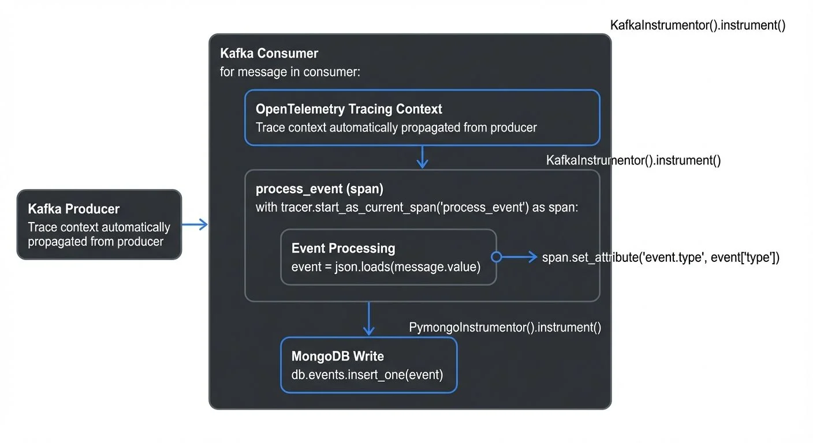

Modern streaming applications generate continuous, high-velocity data that traditional relational databases struggle to handle efficiently. NoSQL databases emerged to address these challenges, offering flexible schemas, horizontal scalability, and optimized write performance that align perfectly with [streaming workloads](https://conduktor.io/glossary/what-is-real-time-data-streaming).

When [Apache Kafka](https://conduktor.io/glossary/apache-kafka) or other streaming platforms deliver thousands of events per second, the downstream database must absorb this volume without bottlenecks while maintaining low-latency access for real-time applications. NoSQL databases excel in this role, providing the throughput and flexibility that [streaming architectures](https://conduktor.io/glossary/streaming-data-pipeline) demand.

## NoSQL Database Categories

Understanding the main NoSQL categories helps you choose the right database for your streaming use case:

### Choosing the Right NoSQL Database

| **Use Case** | **Recommended Database** | **Why** |
|-------------|-------------------------|---------|
| **Flexible event schemas** | MongoDB, Couchbase | JSON documents accommodate evolving event structures without migrations |
| **Ultra-high write throughput** | ScyllaDB, Cassandra | 1M+ writes/sec per node, append-only architecture |
| **Sub-millisecond reads** | Redis Stack, Valkey | In-memory storage, perfect for caching and session management |
| **Time-series telemetry** | Cassandra, ScyllaDB, TimescaleDB | Optimized for time-based queries, automatic data expiration |
| **Real-time analytics** | ClickHouse, Apache Druid | Sub-second analytical queries on streaming data |
| **Complex relationships** | Neo4j, Amazon Neptune | Graph queries for fraud detection, recommendations |
| **Serverless/variable load** | DynamoDB, MongoDB Atlas Serverless | Auto-scaling with pay-per-request pricing |

### Database Category Details

**Document Stores** like MongoDB 8.0 store data as JSON-like documents, making them ideal for event data with nested structures. Their flexible schema accommodates evolving event formats without migrations. MongoDB Atlas (2025) now offers integrated Stream Processing for real-time aggregations directly within the database, eliminating the need for separate stream processors in many use cases.

**Key-Value Stores** such as Redis Stack and DynamoDB provide the fastest read/write operations through simple lookups. Redis Stack (2025) extends traditional Redis with JSON documents, time-series data structures, and full-text search capabilities. Valkey, the Linux Foundation's Redis-compatible alternative launched in 2024, offers similar performance without licensing concerns. DynamoDB's on-demand v2 pricing model provides true serverless scaling for variable streaming workloads.

**Wide-Column Stores** like Apache Cassandra 5.0 and ScyllaDB organize data in column families, optimized for massive write throughput. ScyllaDB's C++ implementation delivers 10x higher throughput than Cassandra on identical hardware—often exceeding 1 million writes/second per node—making it the preferred choice for ultra-high-volume streaming workloads. Their architecture handles time-series data exceptionally well, making them perfect for IoT and telemetry streams.

**Graph Databases** including Neo4j 5.x and Amazon Neptune model relationships explicitly, enabling real-time fraud detection or social network analysis by querying connected data patterns as events arrive.

**OLAP-Style NoSQL** databases like Apache Druid and ClickHouse specialize in real-time analytics on streaming data. These systems ingest from Kafka while simultaneously serving sub-second analytical queries, bridging the gap between operational NoSQL databases and data warehouses.

## Core Real-Time Characteristics

NoSQL databases designed for streaming workloads share several critical characteristics:

**High Write Throughput**: Streaming pipelines generate continuous writes. NoSQL databases achieve this through append-only structures (like Cassandra's commit logs), in-memory buffers, and batching mechanisms. A well-tuned Cassandra cluster can handle hundreds of thousands of writes per second per node.

**Low-Latency Reads**: Real-time applications need instant access to fresh data. NoSQL databases minimize read latency through in-memory caching, optimized indexes, and denormalized data models. Redis, for instance, serves reads in sub-millisecond timeframes by keeping entire datasets in memory.

**Horizontal Scalability**: As stream volume grows, adding nodes should increase capacity linearly. NoSQL databases achieve this through consistent hashing, automatic sharding, and peer-to-peer architectures that eliminate single points of failure.

## NoSQL + Kafka Integration Patterns

### MongoDB + Kafka: Change Streams and Connectors

MongoDB's change streams feature transforms the database into an event source. Applications can subscribe to real-time notifications of inserts, updates, and deletes. Combined with [Kafka Connect](https://conduktor.io/glossary/kafka-connect-building-data-integration-pipelines)'s MongoDB source connector, you can:

- Stream database changes into Kafka topics for downstream processing
- Build [event-driven architectures](https://conduktor.io/glossary/event-driven-architecture) where database modifications trigger workflows
- Implement [CDC (Change Data Capture)](https://conduktor.io/glossary/what-is-change-data-capture-cdc-fundamentals) patterns—capturing every modification to database records as events—for data synchronization across systems

The MongoDB sink connector allows Kafka to write directly to MongoDB collections, handling [schema evolution](https://conduktor.io/glossary/schema-evolution-best-practices) and automatic retries. This bidirectional integration creates powerful data pipelines where MongoDB serves both as a streaming destination and source.

```javascript
// MongoDB Kafka Sink Connector Configuration
{
  "name": "mongodb-sink-user-events",
  "config": {
    "connector.class": "com.mongodb.kafka.connect.MongoSinkConnector",
    "topics": "user-events",
    "connection.uri": "mongodb://mongo-cluster:27017",
    "database": "analytics",
    "collection": "user_events",
    "max.num.retries": 3,
    "retries.defer.timeout": 5000,
    "document.id.strategy": "com.mongodb.kafka.connect.sink.processor.id.strategy.PartialValueStrategy",
    "document.id.strategy.partial.value.projection.list": "event_id",
    "document.id.strategy.partial.value.projection.type": "AllowList",
    "writemodel.strategy": "com.mongodb.kafka.connect.sink.writemodel.strategy.ReplaceOneBusinessKeyStrategy"
  }
}
```

**MongoDB Atlas Stream Processing (2025)**: For simpler use cases, MongoDB Atlas now processes Kafka streams natively without external connectors:

```javascript
// Atlas Stream Processing Pipeline - Direct Kafka Integration
sp.process(
  [
    { $source: { connectionName: "kafka-prod", topic: "user-events" } },
    { $match: { event_type: "purchase" } },
    { $group: {
        _id: "$user_id",
        total_revenue: { $sum: "$amount" },
        purchase_count: { $sum: 1 }
    }},
    { $merge: { into: { db: "analytics", coll: "user_totals" } } }
  ]
)
```

### Cassandra + Kafka: High-Volume Ingestion

Cassandra's distributed architecture and tunable consistency make it a natural fit for absorbing Kafka streams. Common patterns include:

**Time-Series Storage**: IoT sensors produce millions of readings per hour. The Kafka-Cassandra connector writes these events to time-partitioned tables, enabling efficient queries by time range.

```sql
-- Cassandra Table Schema for IoT Time-Series Data
CREATE TABLE iot_readings (
    device_id text,
    reading_date date,
    timestamp timestamp,
    temperature double,
    humidity double,
    pressure double,
    PRIMARY KEY ((device_id, reading_date), timestamp)
) WITH CLUSTERING ORDER BY (timestamp DESC)
  AND compaction = {'class': 'TimeWindowCompactionStrategy', 'compaction_window_size': 1}
  AND default_time_to_live = 2592000; -- 30 days TTL

-- Query recent readings for a device
SELECT * FROM iot_readings
WHERE device_id = 'sensor-001'
  AND reading_date = '2025-12-17'
  AND timestamp > '2025-12-17 10:00:00'
LIMIT 100;
```

```java
// Kafka Connect Cassandra Sink Configuration
{
  "name": "cassandra-sink-iot-readings",
  "config": {
    "connector.class": "com.datastax.oss.kafka.sink.CassandraSinkConnector",
    "topics": "iot-sensor-readings",
    "contactPoints": "cassandra-node1,cassandra-node2,cassandra-node3",
    "loadBalancing.localDc": "dc1",
    "cloud.secureConnectBundle": "/path/to/secure-connect.zip",
    "topic.iot-sensor-readings.iot_telemetry.iot_readings.mapping":
      "device_id=value.deviceId, reading_date=value.timestamp, timestamp=value.timestamp, temperature=value.temp, humidity=value.hum, pressure=value.pres",
    "topic.iot-sensor-readings.iot_telemetry.iot_readings.consistencyLevel": "LOCAL_QUORUM"
  }
}
```

**Event Logging**: Application logs flow through Kafka into Cassandra's wide-column structure, where they're organized by service, timestamp, and severity. The write-optimized storage handles massive volumes while supporting operational queries.

**Materialized Views**: Stream processors like [Kafka Streams](https://conduktor.io/glossary/introduction-to-kafka-streams), [Apache Flink](https://conduktor.io/glossary/what-is-apache-flink-stateful-stream-processing), or [ksqlDB](https://conduktor.io/glossary/ksqldb-for-real-time-data-processing) consume events, compute aggregations, and write results to Cassandra. The database serves these precomputed views with low latency.

```sql
-- ksqlDB Materialized View to Cassandra (2025 Pattern)
CREATE STREAM user_events (
  user_id VARCHAR,
  event_type VARCHAR,
  amount DOUBLE,
  timestamp BIGINT
) WITH (
  KAFKA_TOPIC='user-events',
  VALUE_FORMAT='JSON'
);

CREATE TABLE user_stats AS
  SELECT user_id,
         COUNT(*) as event_count,
         SUM(amount) as total_amount,
         MAX(timestamp) as last_seen
  FROM user_events
  GROUP BY user_id
  EMIT CHANGES;

-- Sink to Cassandra via Connector
CREATE SINK CONNECTOR cassandra_user_stats WITH (
  'connector.class' = 'com.datastax.oss.kafka.sink.CassandraSinkConnector',
  'topics' = 'USER_STATS',
  'contactPoints' = 'cassandra-cluster:9042',
  'loadBalancing.localDc' = 'dc1',
  'topic.USER_STATS.analytics.user_statistics.mapping' =
    'user_id=key, event_count=value.event_count, total_amount=value.total_amount, last_seen=value.last_seen'
);
```

### Redis + Kafka: Caching and Session Management

Redis excels at storing transient streaming data:

**Session Stores**: User sessions from web applications flow through Kafka into Redis with TTL (time-to-live) settings. The in-memory database provides instant session lookup for authentication and personalization.

```python
# Redis Sink with Kafka Consumer (Python Example)
from kafka import KafkaConsumer
import redis
import json

# Initialize connections
redis_client = redis.Redis(host='redis-cluster', port=6379, decode_responses=True)
consumer = KafkaConsumer(
    'user-sessions',
    bootstrap_servers='kafka:9092',
    value_deserializer=lambda m: json.loads(m.decode('utf-8')),
    group_id='session-manager'
)

# Process session events from Kafka to Redis
for message in consumer:
    session = message.value
    session_key = f"session:{session['session_id']}"

    # Store session with 30-minute TTL
    redis_client.setex(
        session_key,
        1800,  # 30 minutes in seconds
        json.dumps(session)
    )

    # Update user's active session list
    redis_client.sadd(f"user:{session['user_id']}:sessions", session['session_id'])
    redis_client.expire(f"user:{session['user_id']}:sessions", 86400)  # 24 hours
```

**Real-Time Counters**: Streaming analytics update Redis counters, sorted sets, and HyperLogLog structures. Dashboards query these structures for real-time metrics without touching slower persistent stores.

```python
# Redis TimeSeries for Real-Time Metrics (Redis Stack 2025)
from redistimeseries.client import Client
from kafka import KafkaConsumer
import json

rts = Client(host='redis-stack', port=6379)
consumer = KafkaConsumer('page-views', bootstrap_servers='kafka:9092')

# Create time-series for page views per URL
for message in consumer:
    event = json.loads(message.value)

    # Add data point to time-series
    rts.add(f"pageviews:{event['url']}", event['timestamp'], 1)

    # Increment daily counter using HyperLogLog for unique visitors
    redis_client.pfadd(f"unique_visitors:{event['date']}", event['user_id'])

    # Update top pages sorted set
    redis_client.zincrby("top_pages:realtime", 1, event['url'])

# Query real-time metrics
unique_visitors_today = redis_client.pfcount("unique_visitors:2025-12-17")
top_5_pages = redis_client.zrevrange("top_pages:realtime", 0, 4, withscores=True)
```

**Cache Warming**: As Kafka delivers database changes, a stream processor updates corresponding Redis cache entries, ensuring cache consistency with minimal staleness.

### DynamoDB Streams and Integration

AWS DynamoDB provides built-in streams that capture item-level modifications. These streams integrate with:

- AWS Lambda for serverless event processing
- Kinesis Data Streams for cross-region replication
- Kafka via Kinesis-Kafka connectors for hybrid architectures

DynamoDB's pay-per-request pricing and automatic scaling make it attractive for variable streaming workloads where throughput fluctuates significantly.

## Real-Time Use Cases

**IoT Telemetry Ingestion**: [Connected devices](https://conduktor.io/glossary/iot-data-streaming-architectures) generate continuous sensor readings. A typical architecture uses Kafka to buffer and partition data by device type, then writes to Cassandra for long-term storage and Redis for real-time thresholds and alerts.

**User Activity Tracking**: Web and mobile applications emit [clickstream events](https://conduktor.io/glossary/clickstream-analytics-with-kafka) through Kafka. Stream processors compute [session boundaries](https://conduktor.io/glossary/session-windows-in-stream-processing), user journeys, and conversion funnels, storing results in MongoDB for flexible querying by product teams.

**Session Management**: Authentication services write session tokens to Kafka topics. A consumer updates Redis with session metadata, enabling sub-millisecond session validation across distributed services.

**Event Sourcing**: Applications store all state changes as immutable events in Kafka. Consumers rebuild current state in NoSQL databases (often MongoDB or Cassandra), enabling temporal queries and audit trails. Learn more about [event sourcing patterns](https://conduktor.io/glossary/event-sourcing-patterns-with-kafka) and the [CQRS pattern](https://conduktor.io/glossary/cqrs-and-event-sourcing-with-kafka).

## Consistency and Query Patterns

**Eventual Consistency**: Most NoSQL databases default to eventual consistency, where writes propagate asynchronously. For streaming workloads, this typically isn't problematic—events arrive in near real-time, and slight delays (milliseconds to seconds) align with stream processing latencies.

*Example*: A user posts a comment through a mobile app. The write goes to Cassandra with consistency level ONE (fastest), immediately returns success to the user, then replicates to other nodes in the background. Analytics dashboards querying this data 100ms later will see the comment—well within acceptable bounds for most use cases.

**Strong Consistency**: When required, databases like MongoDB offer strong consistency through replica set read concerns, while Cassandra provides tunable consistency (QUORUM, LOCAL_QUORUM) at the cost of increased latency.

```python
# MongoDB Strong Consistency Example
from pymongo import MongoClient, ReadConcern, WriteConcern

client = MongoClient('mongodb://replica-set:27017')
db = client.analytics

# Write with majority acknowledgment
result = db.user_transactions.insert_one(
    {"user_id": "user123", "amount": 99.99, "timestamp": 1734451200},
    write_concern=WriteConcern(w='majority')  # Wait for majority of replicas
)

# Read with strong consistency guarantees
transaction = db.user_transactions.find_one(
    {"_id": result.inserted_id},
    read_concern=ReadConcern('majority')  # Read from majority of replicas
)
```

```sql
-- Cassandra Tunable Consistency
-- Write with QUORUM: (replication_factor / 2) + 1 nodes must acknowledge
INSERT INTO user_events (user_id, event_id, event_type, timestamp)
VALUES ('user123', uuid(), 'purchase', toTimestamp(now()))
USING CONSISTENCY QUORUM;

-- Read with LOCAL_QUORUM: majority within same datacenter
SELECT * FROM user_events
WHERE user_id = 'user123'
AND timestamp > '2025-12-01'
USING CONSISTENCY LOCAL_QUORUM;
```

**Query Optimization**: Design your data model around query patterns. For time-series data in Cassandra, use time-based clustering keys. In MongoDB, create indexes on frequently filtered fields like timestamp, user_id, or device_id. Avoid full table scans by leveraging partition keys that align with your [Kafka topic partitioning strategy](https://conduktor.io/glossary/kafka-partitioning-strategies-and-best-practices).

**Time-Series Considerations**: Many streaming use cases involve time-series data. Use TTL (time-to-live) features to automatically expire old data. Partition tables by time windows (hourly, daily) to isolate queries and simplify data retention policies.

## Scaling Strategies

**Partitioning and Sharding**: Align your database partitioning with Kafka topic partitions. If you partition Kafka topics by user_id, use user_id as the Cassandra partition key. This ensures events for the same entity land on the same database node, enabling local aggregations.

**Write Optimization**: Batch writes when possible. Kafka Connect connectors typically buffer events before writing to the database. Tune these batch sizes based on your latency requirements—larger batches improve throughput but increase end-to-end latency.

**Read Replica Patterns**: Separate operational reads from analytical queries using read replicas. Write streaming data to primary nodes while directing dashboards and reports to replicas, preventing query load from impacting ingestion performance.

**Data Governance**: As your streaming pipelines grow in complexity, maintaining data quality and compliance becomes critical. Platforms like Conduktor provide comprehensive governance capabilities for Kafka ecosystems, ensuring schemas are validated, sensitive data is masked, and data lineage is tracked from streams through to NoSQL databases. Conduktor Gateway acts as a proxy layer that enforces policies, validates data contracts, and provides audit trails across your entire streaming pipeline.

## Observability and Monitoring

Monitoring NoSQL databases in streaming architectures requires visibility across multiple layers:

**Write Performance Metrics**:
- **Write latency percentiles** (p50, p95, p99): Track end-to-end time from Kafka consumption to database write acknowledgment
- **Write throughput**: Measure events/second ingested, watching for degradation that indicates capacity issues
- **Connector lag**: For Kafka Connect deployments, [monitor consumer group lag](https://conduktor.io/glossary/consumer-lag-monitoring) to detect ingestion delays
- **Batch sizes**: Track the average number of events per batch write—too small hurts throughput, too large increases latency

**Read Performance Metrics**:
- **Query latency**: Monitor p99 read latencies for user-facing queries; spikes often indicate missing indexes or suboptimal data models
- **Cache hit rates**: For Redis/caching layers, track hit/miss ratios to ensure cache effectiveness
- **Connection pool saturation**: Exhausted connection pools cause timeouts and request queueing

**Database-Specific Metrics**:
- **Cassandra**: Compaction backlog, memtable flush queues, read repair frequency
- **MongoDB**: Working set size vs available RAM, replication lag, oplog window
- **Redis**: Memory fragmentation ratio, eviction rate, keyspace hit ratio
- **DynamoDB**: Consumed vs provisioned capacity units, throttled requests

**Distributed Tracing**:
Implement end-to-end tracing from event production through Kafka to database writes. OpenTelemetry instrumentation reveals where latency accumulates:

<!-- ORIGINAL_DIAGRAM
```python
# OpenTelemetry Tracing for Kafka → MongoDB Pipeline
from opentelemetry import trace
from opentelemetry.instrumentation.kafka import KafkaInstrumentor
from opentelemetry.instrumentation.pymongo import PymongoInstrumentor

# Auto-instrument Kafka and MongoDB
KafkaInstrumentor().instrument()
PymongoInstrumentor().instrument()

tracer = trace.get_tracer(__name__)

for message in consumer:
    # Trace context automatically propagated from producer
    with tracer.start_as_current_span("process_event") as span:
        event = json.loads(message.value)
        span.set_attribute("event.type", event['type'])

        # MongoDB write is automatically traced
        db.events.insert_one(event)
```
-->

**Alerting Strategy**:
- **Critical**: Connector failures, database unavailability, consumer group stuck (no progress for 5+ minutes)
- **Warning**: p99 write latency exceeds SLA, consumer lag growing, connection pool >80% utilized
- **Info**: Planned maintenance, schema migrations, capacity scaling events

## Anti-Patterns to Avoid

**❌ Not Aligning Partitioning Strategies**: Writing Kafka events partitioned by `user_id` to a Cassandra table partitioned by `timestamp` forces scatter-gather queries across nodes. Always align partition keys between Kafka topics and database tables.

**❌ Treating NoSQL Like Relational Databases**: Attempting complex JOINs, normalization, or ACID transactions across tables defeats NoSQL's strengths. Denormalize data, duplicate where necessary, and embrace eventual consistency for streaming workloads.

**❌ Ignoring Hot Partitions**: Poorly chosen partition keys (e.g., `timestamp` rounded to the hour) concentrate writes on a single node, creating bottlenecks. Use high-cardinality keys like `user_id` or `device_id` to distribute load evenly.

**❌ Synchronous Writes in Stream Processors**: Blocking on each database write kills throughput. Use asynchronous writes, batching, and connection pooling to parallelize database operations.

**❌ No TTL/Data Retention Policy**: Unbounded data growth degrades query performance and inflates costs. Implement TTL at the database level (Cassandra, Redis) or archive/delete old data via scheduled jobs.

**❌ Missing Indexes for Query Patterns**: Cassandra and MongoDB require indexes designed for your specific queries. Full table scans on streaming data with millions of records will timeout. Profile queries and add covering indexes.

**❌ Undersized Connection Pools**: Kafka Connect workers or stream processors with insufficient database connections create queueing and timeouts. Size pools based on concurrency (worker count × max tasks per worker).

**❌ Ignoring Schema Evolution**: Writing evolving JSON events to document stores without schema validation leads to data quality issues. Use [Schema Registry](https://conduktor.io/glossary/schema-registry-and-schema-management) with JSON Schema or Avro to enforce contracts, even with schemaless databases. Implementing [data contracts](https://conduktor.io/glossary/data-contracts-for-reliable-pipelines) prevents downstream breakage.

**❌ Lack of Monitoring and Observability**: Operating NoSQL-Kafka pipelines without comprehensive [observability](https://conduktor.io/glossary/what-is-data-observability-the-five-pillars) leads to blind spots during incidents. Implement [distributed tracing](https://conduktor.io/glossary/distributed-tracing-for-kafka-applications) and metrics collection from the start.

**❌ Ignoring Backpressure**: When databases can't keep up with stream velocity, unconsumed events accumulate in Kafka, eventually exhausting disk space or causing OOM errors. Implement [backpressure handling](https://conduktor.io/glossary/backpressure-handling-in-streaming-systems) and autoscaling policies.

## Conclusion

NoSQL databases and streaming platforms form a powerful combination for modern data architectures. By understanding the characteristics of different NoSQL categories and implementing proven integration patterns, you can build systems that handle massive scale while maintaining the low latency that real-time applications demand.

Choose document stores for flexible event schemas, key-value stores for caching and session management, wide-column stores for time-series data, and graph databases for relationship-heavy workloads. Design your partitioning strategies to align with your stream topology, tune consistency levels based on your requirements, and leverage specialized tools to govern your data pipelines.

For complementary storage solutions, explore [NewSQL databases](https://conduktor.io/glossary/newsql-databases-streaming) for distributed SQL with strong consistency, or consider [lakehouse architectures](https://conduktor.io/glossary/streaming-to-lakehouse-tables) with Delta Lake, Iceberg, or Hudi for analytical workloads requiring historical queryability alongside real-time ingestion.

The landscape continues to evolve with managed services, serverless options, and tighter integrations, but the fundamental principles remain: optimize for your write patterns, query what you need efficiently, and scale horizontally as your streams grow.

## Related Concepts

- [Apache Kafka](https://conduktor.io/glossary/apache-kafka) - The streaming platform at the heart of most NoSQL integration patterns
- [NewSQL Databases: Distributed SQL for Real-Time Applications](https://conduktor.io/glossary/newsql-databases-streaming) - Alternative database approach combining ACID guarantees with horizontal scalability
- [Data Governance Framework: Roles and Responsibilities](https://conduktor.io/glossary/data-governance-framework-roles-and-responsibilities) - Essential for managing data quality across NoSQL-Kafka pipelines

## Sources and References

- [Apache Cassandra Documentation](https://cassandra.apache.org/doc/latest/) - Official documentation for wide-column NoSQL database
- [MongoDB Architecture Guide](https://www.mongodb.com/docs/manual/core/databases-and-collections/) - Document store design patterns and streaming integration
- [Redis Documentation](https://redis.io/documentation) - In-memory data structures for real-time applications
- [Kafka Connect](https://kafka.apache.org/documentation/#connect) - Framework for connecting Kafka with external systems including NoSQL databases
- [DynamoDB Streams](https://docs.aws.amazon.com/amazondynamodb/latest/developerguide/Streams.html) - Change data capture for DynamoDB integration with streaming platforms
