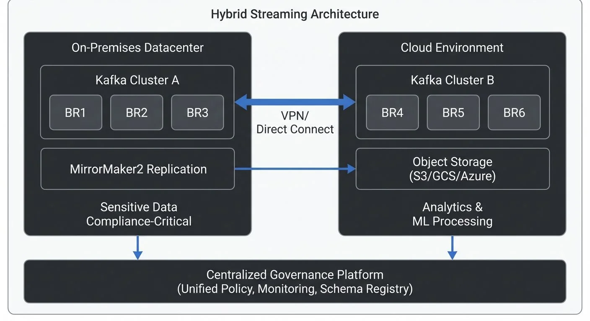

Organizations building data streaming platforms face a fundamental architectural decision: where should the streaming infrastructure live? While cloud-native solutions offer compelling advantages, many enterprises operate streaming platforms on-premises, in hybrid configurations spanning multiple environments, or across multiple cloud providers. Understanding these patterns and their governance implications is essential for building resilient, compliant streaming architectures.

<!-- ORIGINAL_DIAGRAM
```
┌──────────────────────── Hybrid Streaming Architecture ─────────────┐
│                                                                     │
│  On-Premises Datacenter          Cloud Environment                 │
│  ┌─────────────────────┐         ┌──────────────────────┐          │
│  │  Kafka Cluster A    │◀───────▶│  Kafka Cluster B     │          │
│  │  ┌───┐ ┌───┐ ┌───┐ │  VPN/   │  ┌───┐ ┌───┐ ┌───┐  │          │
│  │  │BR1│ │BR2│ │BR3│ │  Direct │  │BR4│ │BR5│ │BR6│  │          │
│  │  └───┘ └───┘ └───┘ │  Connect│  └───┘ └───┘ └───┘  │          │
│  │  ┌─────────────┐   │         │  ┌──────────────┐    │          │
│  │  │MirrorMaker2 │───┼─────────┼─▶│Object Storage│    │          │
│  │  │Replication  │   │         │  │(S3/GCS/Azure)│    │          │
│  │  └─────────────┘   │         │  └──────────────┘    │          │
│  │                     │         │                      │          │
│  │  Sensitive Data     │         │  Analytics &         │          │
│  │  Compliance-Critical│         │  ML Processing       │          │
│  └─────────────────────┘         └──────────────────────┘          │
│           │                               │                         │
│           ▼                               ▼                         │
│  ┌─────────────────────────────────────────────────────┐           │
│  │         Centralized Governance Platform             │           │
│  │    (Unified Policy, Monitoring, Schema Registry)    │           │
│  └─────────────────────────────────────────────────────┘           │
└─────────────────────────────────────────────────────────────────────┘
```
-->

## Why On-Premises Streaming Still Matters

Despite the cloud's dominance, on-premises streaming remains relevant for specific use cases. Financial institutions often run Kafka clusters in their own datacenters to meet strict regulatory requirements around data sovereignty—certain jurisdictions mandate that sensitive data never leave specific geographic boundaries or organizational control. When millisecond-level latency is critical, such as in high-frequency trading or real-time manufacturing systems, on-premises deployments eliminate network hops to external cloud providers.

Cost considerations also drive on-prem decisions. Organizations with existing datacenter investments and stable workloads may find that owning and operating infrastructure is more economical than paying ongoing cloud fees, particularly when data volumes are massive and predictable. Additionally, some enterprises prefer the operational control that comes with managing their own hardware, networking, and security stack, especially when integrating with legacy systems that cannot easily move to the cloud.

However, on-premises streaming comes with responsibilities: capacity planning, hardware procurement, upgrades, patching, and 24/7 operations fall entirely on internal teams. The operational burden is significant, requiring specialized expertise in distributed systems, storage, and networking. Modern on-premises deployments in 2025 increasingly leverage Kubernetes operators like [Strimzi](https://conduktor.io/glossary/strimzi-kafka-operator-for-kubernetes) for automated cluster management and [KRaft mode](https://conduktor.io/glossary/understanding-kraft-mode-in-kafka) (Kafka's native consensus protocol that replaced ZooKeeper, now the default in Kafka 4.0+) for simpler operations and better scalability.

## Cloud Streaming: Managed Services and Operational Simplicity

Cloud-based streaming platforms like [Amazon MSK](https://conduktor.io/glossary/amazon-msk-managed-kafka-on-aws), [Azure Event Hubs](https://conduktor.io/glossary/azure-event-hubs-and-kafka-compatibility), and Google Cloud Pub/Sub shift much of the operational complexity to the provider. These managed services handle cluster provisioning, scaling, patching, monitoring, and disaster recovery, allowing teams to focus on building streaming applications rather than managing infrastructure.

Elasticity is a key advantage—cloud platforms can scale up during peak demand and scale down during quiet periods, paying only for resources consumed. Geographic distribution becomes simpler, with providers offering multi-region deployments that provide low-latency access to global users and built-in disaster recovery capabilities.

Cloud providers also integrate streaming platforms with their broader ecosystems: IAM for authentication, KMS for encryption, CloudWatch or Azure Monitor for observability, and native connectors to storage, analytics, and machine learning services. This integration accelerates development but introduces platform lock-in that can make future migrations costly.

The trade-off is reduced control and potential cost unpredictability. Cloud egress fees—charges for data leaving the provider's network—can be substantial for streaming workloads that replicate data across regions or to on-premises systems. Organizations must carefully model costs, especially for high-throughput scenarios where bandwidth charges accumulate quickly.

## Hybrid Streaming: Bridging Multiple Environments

Hybrid streaming architectures combine on-premises and cloud deployments, creating unified platforms that span environments. Common motivations include gradual cloud migration (maintaining on-prem systems while building cloud-native capabilities), regulatory compliance (keeping sensitive data on-prem while leveraging cloud for analytics), and business continuity (using the cloud for disaster recovery while running primary workloads on-prem).

A typical hybrid pattern involves running Kafka clusters in both environments with bi-directional replication. For example, a financial services firm might process transactions in an on-premises cluster for compliance, replicate sanitized events to a cloud cluster for analytics and machine learning, then stream insights back on-prem for operational systems.

Successful hybrid architectures require careful network design. VPN tunnels or dedicated interconnects (like AWS Direct Connect, which provides private fiber connections to AWS, or Azure ExpressRoute for private Azure connectivity) provide secure, low-latency connectivity between environments. However, network latency between datacenters and cloud regions introduces replication lag that applications must tolerate. Bandwidth constraints also limit throughput, requiring prioritization of which topics replicate and in which direction.

In 2025, hybrid deployments commonly leverage [tiered storage](https://conduktor.io/glossary/tiered-storage-in-kafka) to reduce on-premises storage costs by offloading older data to cloud object storage (S3, GCS, Azure Blob) while maintaining local access to recent data. This approach combines the performance of on-prem with the cost-efficiency of cloud storage.

## Replication Strategies for Multi-Environment Consistency

Several technologies enable data replication across streaming environments, each with distinct characteristics:

**MirrorMaker 2.0** is Kafka's native replication tool, supporting active-passive (one cluster receives all writes, others are standby replicas) and active-active (multiple clusters accept writes simultaneously) patterns with topic and consumer group replication. It's open-source and flexible but requires operational expertise to tune for performance and reliability. MirrorMaker 2.0 provides exactly-once semantics (guaranteeing each message is replicated exactly once, preventing duplicates) and can preserve timestamps and offsets for consistent disaster recovery.

**Conduktor Gateway** offers advanced replication capabilities with built-in governance, enabling policy enforcement, data quality validation, and security controls during cross-environment replication. Unlike basic replication tools, Gateway ensures that governance policies defined centrally apply consistently as data flows between on-prem and cloud clusters, preventing configuration drift and compliance violations.

**Custom Kafka Connectors** can implement specialized replication logic using Kafka Connect, allowing transformation, filtering, and integration with external systems during replication. This approach provides maximum flexibility but requires development and maintenance effort.

Choosing the right tool depends on requirements: MirrorMaker suits straightforward replication with failover needs, Conduktor Gateway excels when governance consistency across environments is critical, and custom connectors handle unique transformation or integration requirements. In 2025, organizations increasingly prioritize tools that unify governance across hybrid deployments rather than treating replication as a pure data movement problem.

## Governance Consistency Across Environments

One of hybrid streaming's biggest challenges is maintaining consistent governance policies across disparate environments. [Data quality](https://conduktor.io/glossary/building-a-data-quality-framework) standards, [access controls](https://conduktor.io/glossary/access-control-for-streaming), [schema validation](https://conduktor.io/glossary/schema-registry-and-schema-management), and compliance policies must apply uniformly whether data flows through on-prem clusters, AWS, Azure, or Google Cloud.

Centralized [governance platforms](https://conduktor.io/glossary/data-governance-framework-roles-and-responsibilities) address this by providing a single control plane for [policy definition and enforcement](https://conduktor.io/glossary/policy-enforcement-in-streaming) across all streaming infrastructure. Tools like Conduktor enable teams to define data quality rules, access policies, and compliance requirements once, then apply them consistently to every cluster regardless of location. This prevents configuration drift where security policies are strict on-prem but lax in the cloud, or where schema validation works in one environment but not others.

Unified governance also simplifies [auditing and compliance reporting](https://conduktor.io/glossary/audit-logging-for-streaming-platforms). Rather than collecting logs and metrics from multiple systems with inconsistent formats, centralized platforms provide a single view of who accessed what data, when, and from where—critical for GDPR, HIPAA, and other regulatory frameworks.

## Multi-Cloud Streaming: Avoiding Vendor Lock-In

Some organizations adopt multi-cloud strategies, running streaming platforms on multiple cloud providers to avoid vendor lock-in, improve resilience, or leverage best-of-breed services. For example, an organization might use AWS for primary workloads, Google Cloud for machine learning analytics, and Azure for integration with Microsoft enterprise tools.

Multi-cloud streaming introduces complexity: each provider has different IAM models, networking constructs, and managed services. [Cross-cloud replication](https://conduktor.io/glossary/cross-az-traffic-streaming) incurs egress fees from both providers, and network latency may be higher than within a single provider's backbone. However, the architectural flexibility can be valuable—applications can failover between clouds, and data can be processed in whichever environment offers the best price or performance for specific workloads.

The governance challenge multiplies: policies must now span not just on-prem and cloud but multiple cloud providers with different primitives. Abstraction layers that provide cloud-agnostic interfaces become essential, whether through [Kubernetes-based deployments](https://conduktor.io/glossary/running-kafka-on-kubernetes), infrastructure-as-code templates that work across providers, or governance platforms that treat all clusters uniformly.

## Edge Streaming: Distributed Processing at the Source

Edge streaming extends hybrid architectures to the network edge—factory floors, retail locations, vehicles, and IoT devices. These edge nodes run lightweight streaming platforms (like Kafka running on minimal hardware or MQTT—Message Queuing Telemetry Transport, a lightweight pub/sub protocol—brokers for IoT) that process data locally, then selectively replicate relevant events to regional or central clusters.

Edge streaming reduces latency for time-critical decisions (a manufacturing robot responds to sensor data in milliseconds without round-tripping to the cloud), minimizes bandwidth usage (preprocessing filters out irrelevant data before transmission), and maintains operation during network outages (local processing continues even when cloud connectivity is lost).

In 2025, edge deployments increasingly use lightweight Kubernetes distributions (K3s, MicroK8s) or purpose-built edge orchestration platforms (KubeEdge, Azure IoT Edge) for automated deployment and management. WebAssembly (Wasm) is emerging as a runtime for stream processing at the edge, offering near-native performance with strong sandboxing and portability across diverse hardware architectures.

However, edge deployments face unique constraints: limited compute and storage resources, unreliable networking, and difficult physical access for maintenance. Governance becomes especially important—ensuring that edge nodes enforce security policies, validate [data quality](https://conduktor.io/glossary/automated-data-quality-testing), and comply with regulations without constant manual intervention requires robust automation and centralized policy management. Modern edge governance platforms can push policy updates from a central control plane to thousands of distributed edge nodes, maintaining consistent security and compliance posture. [Chaos engineering](https://conduktor.io/glossary/chaos-engineering-for-streaming-systems) practices are particularly valuable for edge deployments, testing resilience against network partitions, hardware failures, and other common edge scenarios.

## Security in Hybrid Environments

Security consistency is paramount in hybrid streaming. Authentication and authorization must work seamlessly across environments, ideally through identity federation that allows users to authenticate once and access resources everywhere. SAML (Security Assertion Markup Language, an XML-based standard for single sign-on) or OAuth (Open Authorization, a token-based authentication protocol) based SSO (Single Sign-On) integrations enable this, with centralized identity providers (like Okta, Azure AD, or corporate LDAP) authenticating users and issuing tokens valid across all clusters.

Encryption must be consistent: TLS for data in transit and encryption-at-rest for stored data should apply uniformly. Key management becomes complex when spanning environments—organizations often use centralized KMS (Key Management Service) solutions or HSMs (Hardware Security Modules, tamper-resistant devices for cryptographic key storage) that work across on-prem and cloud, ensuring keys are rotated, audited, and protected consistently.

Network security requires careful segmentation. Hybrid architectures should use private networking (not public internet) for replication, with firewalls restricting which systems can communicate. [Zero-trust principles](https://conduktor.io/glossary/zero-trust-for-streaming)—verify every access attempt regardless of network location—help prevent lateral movement if one environment is compromised. In 2025, zero-trust network access (ZTNA) has become standard, often implemented through service meshes (like Istio, Linkerd) that provide mutual TLS authentication and fine-grained authorization between services, whether they run on-prem or in the cloud. Service meshes also enable consistent observability, capturing traffic patterns and security events across all environments.

## Cost Considerations and Optimization

Hybrid streaming's cost structure combines on-premises capital expenses (hardware, datacenter space, power) with cloud operational expenses (compute instances, storage, network egress). Egress fees are often the hidden cost—replicating terabytes daily from cloud to on-prem can dwarf other expenses. Organizations should model data flows carefully, minimizing unnecessary replication and compressing data where possible.

In 2025, FinOps practices (financial operations that optimize cloud spending) have become essential for hybrid architectures. Teams use tools like AWS Cost Explorer, Azure Cost Management, and third-party platforms (CloudHealth, Kubecost) to track costs in real-time, set budgets, and identify optimization opportunities. Common strategies include:

- **Reserved capacity**: Committing to long-term cloud resources (1-3 years) for predictable workloads reduces costs by 30-70% versus on-demand pricing
- **Spot instances**: Using spare cloud capacity at steep discounts for fault-tolerant streaming workloads like batch replication or analytics
- **Tiered storage**: Automatically moving older Kafka data to cheaper object storage (S3 Glacier, Azure Cool Blob) while keeping recent data on fast local disks (see [tiered storage](https://conduktor.io/glossary/tiered-storage-in-kafka) for implementation details)
- **Cross-region optimization**: Routing traffic to minimize egress fees, such as processing data in the same region where it's generated rather than replicating it elsewhere

Compute costs vary by environment: cloud offers elasticity but at a premium, while on-prem requires upfront investment but lower marginal costs. The optimal balance depends on workload characteristics—steady-state workloads favor on-prem, while bursty or unpredictable workloads benefit from cloud elasticity.

Management overhead is another consideration. Cloud reduces the engineering effort for infrastructure but increases complexity in governance, cost monitoring, and avoiding lock-in. On-prem requires larger operational teams but provides tighter control. Hybrid architectures often have the highest management overhead, requiring expertise in multiple environments and tooling to provide unified visibility. Understanding your [streaming total cost of ownership](https://conduktor.io/glossary/streaming-total-cost-of-ownership) across all deployment models is essential for making informed architectural decisions. For implementing cost visibility and chargeback across hybrid deployments, see [Conduktor's Cost Control Insights](https://docs.conduktor.io/guide/insights/cost-control) which provides unified cost tracking regardless of deployment model.

## Practical Implementation: Infrastructure as Code for Hybrid Deployments

Modern hybrid streaming architectures rely on infrastructure-as-code (IaC) to maintain consistency across environments. Here's an example using Terraform to define a hybrid Kafka deployment:

```hcl
# On-premises Kafka cluster using Strimzi on Kubernetes
resource "kubernetes_manifest" "onprem_kafka_cluster" {
  provider = kubernetes.onprem

  manifest = {
    apiVersion = "kafka.strimzi.io/v1beta2"
    kind       = "Kafka"
    metadata = {
      name      = "production-cluster"
      namespace = "kafka"
    }
    spec = {
      kafka = {
        version  = "3.8.0"
        replicas = 5
        config = {
          "offsets.topic.replication.factor" = 3
          "transaction.state.log.replication.factor" = 3
          "transaction.state.log.min.isr" = 2
          "log.retention.hours" = 168
        }
        storage = {
          type = "persistent-claim"
          size = "1Ti"
          class = "fast-ssd"
        }
      }
      # KRaft mode configuration (no ZooKeeper needed in Kafka 4.0+)
      kafka = {
        metadataVersion = "3.8"
      }
    }
  }
}

# Cloud Kafka cluster (AWS MSK)
resource "aws_msk_cluster" "cloud_cluster" {
  cluster_name           = "analytics-cluster"
  kafka_version          = "3.8.0"
  number_of_broker_nodes = 3

  broker_node_group_info {
    instance_type = "kafka.m5.2xlarge"
    client_subnets = [
      aws_subnet.private_a.id,
      aws_subnet.private_b.id,
      aws_subnet.private_c.id,
    ]
    storage_info {
      ebs_storage_info {
        volume_size = 1000
      }
    }
  }

  encryption_info {
    encryption_in_transit {
      client_broker = "TLS"
      in_cluster    = true
    }
  }
}

# MirrorMaker 2 for bi-directional replication
resource "kubernetes_manifest" "mirror_maker" {
  provider = kubernetes.onprem

  manifest = {
    apiVersion = "kafka.strimzi.io/v1beta2"
    kind       = "KafkaMirrorMaker2"
    metadata = {
      name      = "hybrid-replication"
      namespace = "kafka"
    }
    spec = {
      version  = "3.8.0"
      replicas = 3
      connectCluster = "cloud-cluster"

      clusters = [
        {
          alias = "onprem-cluster"
          bootstrapServers = "production-cluster-kafka-bootstrap:9092"
        },
        {
          alias = "cloud-cluster"
          bootstrapServers = aws_msk_cluster.cloud_cluster.bootstrap_brokers_tls
          config = {
            "security.protocol" = "SSL"
          }
        }
      ]

      mirrors = [
        {
          sourceCluster = "onprem-cluster"
          targetCluster = "cloud-cluster"
          sourceConnector = {
            config = {
              "replication.factor" = 3
              "sync.group.offsets.enabled" = true
              "refresh.topics.interval.seconds" = 60
            }
          }
          checkpointConnector = {
            config = {
              "checkpoints.topic.replication.factor" = 3
              "sync.group.offsets.enabled" = true
            }
          }
          topicsPattern = "transactions\\..*, analytics\\..*"
          groupsPattern = "analytics-.*"
        }
      ]
    }
  }
}
```

This Terraform configuration demonstrates:
- **On-prem deployment** using Strimzi operator with KRaft mode (Kafka's native consensus replacing ZooKeeper)
- **Cloud deployment** using AWS MSK with encryption
- **Replication** via MirrorMaker 2 with topic and consumer group synchronization
- **Consistent configuration** managed through code, preventing drift between environments

## Conclusion

Choosing between on-premises, cloud, and hybrid streaming architectures is not a one-time decision but an evolving strategy aligned with business needs, regulatory requirements, and technical capabilities. On-premises deployments offer control and can be cost-effective for stable workloads but demand significant operational investment. Cloud platforms provide elasticity and integration but introduce lock-in and cost variability. Hybrid approaches bridge these worlds, enabling gradual migration, compliance, and resilience at the cost of increased complexity.

Regardless of architecture, consistent governance across environments is non-negotiable. Unified [policy management](https://conduktor.io/glossary/policy-enforcement-in-streaming), centralized [observability](https://conduktor.io/glossary/what-is-data-observability-the-five-pillars), and standardized security controls ensure that data quality, compliance, and [access controls](https://conduktor.io/glossary/data-access-control-rbac-and-abac) apply everywhere data flows. As streaming platforms increasingly span multiple clouds, edge locations, and on-premises datacenters, the ability to govern them holistically becomes a competitive differentiator—enabling organizations to move fast without sacrificing control, compliance, or security.

Organizations should assess their architectural needs using a [streaming maturity model](https://conduktor.io/glossary/streaming-maturity-model) to determine when hybrid complexity is justified versus simpler single-environment deployments. For regulated industries, understanding [data governance frameworks](https://conduktor.io/glossary/data-governance-framework-roles-and-responsibilities) and compliance requirements upfront prevents costly architectural rework later.

## Related Concepts

- [Apache Kafka](https://conduktor.io/glossary/apache-kafka) - Platform architecture supporting on-prem, cloud, and hybrid deployments
- [Disaster Recovery Strategies for Kafka Clusters](https://conduktor.io/glossary/disaster-recovery-strategies-for-kafka-clusters) - Planning for business continuity in hybrid environments
- [Streaming Total Cost of Ownership](https://conduktor.io/glossary/streaming-total-cost-of-ownership) - Comparing costs across deployment models

## Sources and References

1. **Apache Kafka MirrorMaker 2.0 Documentation** - Official documentation on Kafka's native replication tool for multi-datacenter deployments. [https://cwiki.apache.org/confluence/display/KAFKA/KIP-382%3A+MirrorMaker+2.0](https://cwiki.apache.org/confluence/display/KAFKA/KIP-382%3A+MirrorMaker+2.0)

2. **Strimzi Kafka Operator** - Cloud-native Apache Kafka deployment on Kubernetes with automated operations and KRaft support. [https://strimzi.io/](https://strimzi.io/)

3. **KIP-500: Replace ZooKeeper with a Self-Managed Metadata Quorum (KRaft)** - Apache Kafka's architectural evolution removing ZooKeeper dependency. [https://cwiki.apache.org/confluence/display/KAFKA/KIP-500](https://cwiki.apache.org/confluence/display/KAFKA/KIP-500)

4. **AWS Direct Connect Documentation** - Guide to establishing dedicated network connections between on-premises datacenters and AWS for hybrid architectures. [https://aws.amazon.com/directconnect/](https://aws.amazon.com/directconnect/)

5. **Microsoft Azure ExpressRoute** - Documentation on private connectivity between on-premises infrastructure and Azure cloud services. [https://azure.microsoft.com/en-us/products/expressroute/](https://azure.microsoft.com/en-us/products/expressroute/)

6. **KIP-405: Kafka Tiered Storage** - Apache Kafka's tiered storage architecture for hybrid cloud deployments. [https://cwiki.apache.org/confluence/display/KAFKA/KIP-405](https://cwiki.apache.org/confluence/display/KAFKA/KIP-405)

7. **FinOps Foundation** - Best practices for cloud financial management and cost optimization in hybrid architectures. [https://www.finops.org/](https://www.finops.org/)

8. **CNCF Service Mesh Landscape** - Overview of service mesh technologies for secure hybrid deployments. [https://landscape.cncf.io/card-mode?category=service-mesh](https://landscape.cncf.io/card-mode?category=service-mesh)

9. **NIST Cloud Computing Standards** - Framework for understanding cloud deployment models including hybrid and multi-cloud architectures. [https://www.nist.gov/programs-projects/nist-cloud-computing-program-nccp](https://www.nist.gov/programs-projects/nist-cloud-computing-program-nccp)
