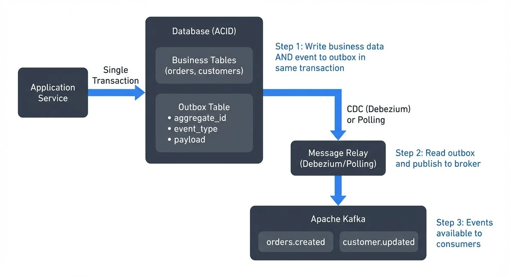

# Outbox Pattern for Reliable Event Publishing

In distributed systems and event-driven architectures, ensuring that database changes and event publications happen atomically is one of the most challenging problems developers face. The outbox pattern provides an elegant solution to this problem, enabling reliable event publishing without compromising data consistency.

This pattern is foundational for building robust microservices architectures. For broader context on distributed transaction patterns, see [Saga Pattern for Distributed Transactions](https://conduktor.io/glossary/saga-pattern-for-distributed-transactions) and [CQRS and Event Sourcing with Kafka](https://conduktor.io/glossary/cqrs-and-event-sourcing-with-kafka).

## The Dual-Write Problem

The dual-write problem occurs when an application needs to perform two separate operations that should succeed or fail together: updating a database and publishing an event to a message broker.

Consider an e-commerce order service. When a customer places an order, the service must:

1. Save the order to the database
2. Publish an `OrderCreated` event to notify other services (inventory, shipping, analytics)

The naive approach attempts both operations sequentially:

```
saveOrder(order)           // Write to database
publishEvent(orderEvent)   // Write to message broker
```

This creates several failure scenarios:

- The database write succeeds, but the event publish fails (network issue, broker unavailable)
- The event publish succeeds, but the database write fails (validation error, constraint violation)
- Both operations appear to succeed initially, but one is later rolled back

These inconsistencies lead to data loss, duplicate processing, and complex recovery logic. Traditional distributed transactions (2PC) can solve this but introduce significant performance overhead and tight coupling between systems.

## How the Outbox Pattern Works

The outbox pattern transforms the dual-write problem into a single-write problem by treating event publishing as part of the database transaction.

The pattern introduces an "outbox" table within the application's database. Instead of publishing events directly to a message broker, the application writes events to this table in the same transaction as the business data:



<!-- ORIGINAL_DIAGRAM
```
┌─────────────────────────────────────────────────────────────┐
│                   Outbox Pattern Flow                       │
└─────────────────────────────────────────────────────────────┘

  ┌──────────────┐
  │ Application  │
  │   Service    │
  └──────┬───────┘
         │ Single Transaction
         ▼
  ┌──────────────────────────────┐
  │      Database (ACID)         │
  │  ┌────────────────────────┐  │
  │  │   Business Tables      │  │  Step 1: Write business data
  │  │   (orders, customers)  │  │         AND event to outbox
  │  └────────────────────────┘  │         in same transaction
  │  ┌────────────────────────┐  │
  │  │   Outbox Table         │  │
  │  │  - aggregate_id        │  │
  │  │  - event_type          │  │
  │  │  - payload             │  │
  │  └────────────────────────┘  │
  └──────────────┬───────────────┘
                 │
                 ▼ CDC (Debezium) or Polling
  ┌──────────────────────────────┐
  │       Message Relay          │  Step 2: Read outbox and
  │   (Debezium/Polling)         │         publish to broker
  └──────────────┬───────────────┘
                 │
                 ▼
  ┌──────────────────────────────┐
  │       Apache Kafka           │
  │  ┌────────┐  ┌────────┐      │  Step 3: Events available
  │  │orders. │  │customer│      │         to consumers
  │  │created │  │.updated│      │
  │  └────────┘  └────────┘      │
  └──────────────────────────────┘
```
-->

A separate process then reads events from the outbox table and publishes them to the message broker. This decouples event publishing from the business transaction while maintaining consistency through database ACID guarantees.

The key insight is that the database becomes the single source of truth. If the transaction commits, both the business data and the event are persisted. If it rolls back, neither is saved.

## Implementation Approaches

There are two primary approaches to implementing the relay process that reads from the outbox table and publishes events.

### Polling-Based Relay

The simplest approach uses a scheduled job that periodically queries the outbox table for unpublished events:

```
SELECT * FROM outbox WHERE published = false ORDER BY created_at
```

After successfully publishing each event to the message broker, the relay marks it as published or deletes the record. This approach is straightforward to implement but has limitations:

- Polling interval creates latency between database commit and event publication
- Inefficient for high-throughput systems (constant database queries)
- Requires careful handling of failures and retries

### Change Data Capture (CDC)

A more sophisticated approach uses Change Data Capture to stream database changes directly to a message broker. CDC tools monitor the database transaction log—the write-ahead log (WAL) in PostgreSQL or binary log (binlog) in MySQL—which records every committed transaction for durability and replication purposes. For comprehensive coverage of CDC fundamentals, see [What is Change Data Capture (CDC) Fundamentals](https://conduktor.io/glossary/what-is-change-data-capture-cdc-fundamentals).

Tools like Debezium (version 2.5+ as of 2025) have become the industry standard for CDC-based outbox implementations. Debezium reads these transaction logs and publishes changes to Kafka in near real-time, typically within single-digit milliseconds of the database commit.

CDC offers several advantages over polling:

- **Near-zero latency**: Events published within milliseconds of database commit
- **No polling overhead**: Eliminates constant database queries
- **Scales efficiently**: Handles high-throughput scenarios with minimal database impact
- **Complete capture**: Captures all changes without application-level filtering
- **Ordered delivery**: Maintains transaction order within a single table

**Modern Debezium 2.5+ Features (2025)**:

Debezium 2.5 and later versions introduce significant improvements for outbox pattern implementations:

- **Incremental snapshots**: Capture existing outbox records without locking tables, essential for migrating existing data
- **Notification channels**: PostgreSQL implementations can use `LISTEN/NOTIFY` for immediate event detection
- **Improved schema history**: Better handling of schema evolution in outbox tables
- **Custom routing**: Enhanced SMT configurations for complex routing scenarios
- **Metrics and monitoring**: Comprehensive JMX metrics for tracking outbox processing lag

**Debezium Outbox Event Router SMT**:

Debezium's Outbox Event Router SMT (Single Message Transform) provides specialized support for the outbox pattern. An SMT is a Kafka Connect component that transforms records as they flow from source to Kafka, allowing you to convert raw database change events into clean, routable business events.

The SMT extracts specific fields from your outbox table and uses them to:
- Route events to different Kafka topics based on event type
- Set message keys for proper partitioning
- Create clean event payloads without database metadata
- Add headers for routing and filtering

## Practical Implementation

### Outbox Table Schema

The outbox table design varies slightly between databases but follows a common pattern. Here are production-ready schemas for PostgreSQL and MySQL:

**PostgreSQL Outbox Table**:

```sql
CREATE TABLE outbox (
    id UUID PRIMARY KEY DEFAULT gen_random_uuid(),
    aggregate_type VARCHAR(255) NOT NULL,
    aggregate_id VARCHAR(255) NOT NULL,
    event_type VARCHAR(255) NOT NULL,
    payload JSONB NOT NULL,
    created_at TIMESTAMP NOT NULL DEFAULT CURRENT_TIMESTAMP,

    INDEX idx_outbox_created (created_at)
);
```

**MySQL Outbox Table**:

```sql
CREATE TABLE outbox (
    id BINARY(16) PRIMARY KEY DEFAULT (UUID_TO_BIN(UUID())),
    aggregate_type VARCHAR(255) NOT NULL,
    aggregate_id VARCHAR(255) NOT NULL,
    event_type VARCHAR(255) NOT NULL,
    payload JSON NOT NULL,
    created_at TIMESTAMP(6) NOT NULL DEFAULT CURRENT_TIMESTAMP(6),

    INDEX idx_outbox_created (created_at)
) ENGINE=InnoDB;
```

**Key Fields**:
- `aggregate_type`: Entity type (e.g., "Order", "Customer") for routing
- `aggregate_id`: Entity identifier (e.g., order ID) used as the Kafka message key
- `event_type`: Specific event (e.g., "OrderCreated", "OrderShipped") determines the Kafka topic
- `payload`: Event data in JSON format
- `created_at`: Timestamp for ordering and debugging

### Debezium Connector Configuration

A complete Debezium PostgreSQL connector configuration using the Outbox Event Router SMT:

```json
{
  "name": "orders-outbox-connector",
  "config": {
    "connector.class": "io.debezium.connector.postgresql.PostgresConnector",
    "database.hostname": "postgres.example.com",
    "database.port": "5432",
    "database.user": "debezium",
    "database.password": "${file:/secrets/db-password.txt:password}",
    "database.dbname": "orders_service",
    "database.server.name": "orders",
    "slot.name": "orders_outbox_slot",

    "table.include.list": "public.outbox",
    "tombstones.on.delete": "false",
    "publication.autocreate.mode": "filtered",

    "transforms": "outbox",
    "transforms.outbox.type": "io.debezium.transforms.outbox.EventRouter",
    "transforms.outbox.table.field.event.type": "event_type",
    "transforms.outbox.table.field.event.id": "id",
    "transforms.outbox.table.field.event.key": "aggregate_id",
    "transforms.outbox.table.field.event.payload": "payload",
    "transforms.outbox.route.topic.replacement": "orders.${routedByValue}",
    "transforms.outbox.route.by.field": "aggregate_type"
  }
}
```

This configuration:
1. Connects to PostgreSQL and creates a replication slot named `orders_outbox_slot`
2. Monitors only the `outbox` table
3. Uses the Outbox Event Router SMT to transform raw change events
4. Routes events to topics like `orders.Order` based on `aggregate_type`
5. Uses `aggregate_id` as the Kafka message key for proper partitioning
6. Extracts the `payload` field as the message value

**Application Code Example**:

When creating an order, your application inserts both the business data and the outbox event in a single transaction:

```java
@Transactional
public void createOrder(Order order) {
    // Insert business data
    orderRepository.save(order);

    // Insert outbox event in same transaction
    OutboxEvent event = new OutboxEvent(
        UUID.randomUUID(),
        "Order",
        order.getId(),
        "OrderCreated",
        jsonMapper.writeValueAsString(new OrderCreatedEvent(
            order.getId(),
            order.getCustomerId(),
            order.getTotalAmount(),
            order.getItems()
        )),
        Instant.now()
    );

    outboxRepository.save(event);

    // If transaction commits, both order and event are saved
    // If transaction rolls back, neither is saved
}
```

### Database Prerequisites

For CDC to function, your database must have transaction logging enabled and configured correctly:

**PostgreSQL Requirements**:
- Logical replication enabled: `wal_level = logical` in `postgresql.conf`
- Replication slot available (created automatically by Debezium)
- Appropriate user permissions: `REPLICATION` and `SELECT` on the outbox table

**MySQL Requirements**:
- Binary logging enabled: `log_bin = ON`
- Row-based replication format: `binlog_format = ROW`
- Binary log retention configured: `binlog_expire_logs_seconds` set appropriately
- User with `REPLICATION SLAVE` and `REPLICATION CLIENT` privileges

## Connection to Data Streaming

The outbox pattern naturally integrates with streaming platforms, particularly Apache Kafka, creating a bridge between transactional databases and event streams.

When using CDC with Kafka Connect, the outbox table becomes a reliable source for Kafka topics. Each outbox record is transformed into a Kafka message, enabling downstream consumers to react to business events in real-time.

For example, an order service's outbox events might populate these topics:

- `orders.created` - New orders for inventory and fulfillment services
- `orders.updated` - Order modifications for customer notifications
- `orders.cancelled` - Cancellations for refund processing

Apache Flink and other stream processors can consume these topics to build real-time analytics, complex event processing, or stateful workflows. The outbox pattern ensures that the foundation of these streaming pipelines is built on reliable, consistent data.

**Monitoring and Testing with Conduktor**:

Platforms like Conduktor help teams manage and monitor CDC pipelines at scale, providing comprehensive visibility into the outbox pattern implementation:

- **Kafka Connect Management**: Monitor Debezium connector health, lag metrics, and throughput
- **Topic Inspection**: View outbox events flowing through Kafka topics with schema awareness
- **Data Quality**: Validate that outbox events match expected schemas and business rules
- **Consumer Lag Tracking**: Ensure downstream consumers keep up with outbox event production

Conduktor Gateway adds powerful testing capabilities specifically valuable for outbox pattern implementations:

- **Chaos Engineering**: Simulate database or Kafka Connect failures to test recovery mechanisms
- **Latency Injection**: Test how your system handles CDC lag scenarios
- **Network Partitioning**: Validate behavior when Debezium loses connectivity to Kafka
- **Schema Evolution Testing**: Test schema compatibility across producer and consumer versions

For example, you can use Conduktor Gateway to inject artificial delays into the CDC pipeline, validating that your application gracefully handles the eventual consistency window between database commit and event availability in Kafka. This type of testing is critical for production readiness of outbox-based systems.

For more on testing distributed systems, see [Chaos Engineering for Streaming Systems](https://conduktor.io/glossary/chaos-engineering-for-streaming-systems) and [Testing Strategies for Streaming Applications](https://conduktor.io/glossary/testing-strategies-for-streaming-applications).

## Benefits and Trade-offs

The outbox pattern provides significant benefits for event-driven architectures:

**Guaranteed Delivery**: Events are persisted durably before the transaction commits, eliminating the risk of lost events due to broker failures.

**Exactly-Once Semantics**: Each business operation produces exactly one event (within the database transaction), avoiding duplicate event publishing from retry logic.

**Decoupled Systems**: The application doesn't need direct connectivity to the message broker during transaction processing, improving resilience.

**Audit Trail**: The outbox table provides a complete history of all events, useful for debugging and compliance.

However, the pattern introduces trade-offs:

**Increased Complexity**: Additional infrastructure (CDC tools, relay processes) and database schema changes.

**Eventual Consistency**: A small delay exists between transaction commit and event publication, requiring consumers to handle eventual consistency.

**Database Load**: The outbox table adds write volume and storage requirements to the database.

**Operational Overhead**: CDC-based approaches require managing additional connectors and monitoring the event pipeline.

## Real-World Considerations

When implementing the outbox pattern in production systems, several practical concerns emerge.

**Message Ordering**: If event ordering matters, design your outbox table and publishing logic to preserve order. CDC tools like Debezium maintain ordering within a single database table but not across tables. Consider using a single outbox table per aggregate root (a domain-driven design concept representing the main entity that owns a transaction boundary, like "Order" or "Customer") or including sequence numbers. Kafka's partitioning strategy ensures that events with the same key (aggregate_id) are delivered to consumers in order. For more on Kafka message ordering, see [Apache Kafka](https://conduktor.io/glossary/apache-kafka).

**Schema Evolution**: Event payloads stored in the outbox table require careful schema management as your system evolves. Unlike direct Kafka publishing where Schema Registry enforces compatibility at write time, the outbox pattern stores JSON payloads that may need to support multiple schema versions simultaneously.

Best practices for schema evolution with outbox:
- Include a `schema_version` field in your event payload to track format changes
- Use Schema Registry with Avro or Protobuf for strongly-typed event definitions
- Apply schema validation before inserting into the outbox table
- Use backward-compatible changes when possible (adding optional fields, not removing fields)
- Consider using Kafka Connect's Avro converter to transform JSON outbox events into Avro when publishing to Kafka

For example, evolving an `OrderCreated` event:

```json
// Version 1
{
  "schema_version": "1.0",
  "order_id": "123",
  "customer_id": "456",
  "total": 99.99
}

// Version 2 (backward compatible - adds optional field)
{
  "schema_version": "2.0",
  "order_id": "123",
  "customer_id": "456",
  "total": 99.99,
  "currency": "USD"  // New optional field with default
}
```

For detailed schema evolution strategies, see [Schema Registry and Schema Management](https://conduktor.io/glossary/schema-registry-and-schema-management) and [Schema Evolution Best Practices](https://conduktor.io/glossary/schema-evolution-best-practices).

**Cleanup Strategy**: Decide how long to retain published events in the outbox table. Options include immediate deletion after publishing, time-based retention for debugging, or archival to separate storage for compliance.

**Idempotency**: Consumers must handle duplicate event delivery gracefully. While the outbox pattern provides at-least-once delivery, network issues or reprocessing scenarios can cause duplicates. Design consumers with idempotent processing logic using techniques like deduplication keys or idempotency tokens.

**Testing**: Simulate failure scenarios (database rollbacks, broker unavailability, CDC lag) in testing environments to validate the complete event publishing pipeline.

## Outbox Pattern vs. Other Distributed Transaction Approaches

The outbox pattern is one of several strategies for managing distributed transactions. Understanding when to use each approach helps you make informed architectural decisions.

**Outbox Pattern vs. Saga Pattern**:

The outbox pattern solves the dual-write problem within a single service, ensuring atomic database updates and event publishing. The [Saga Pattern](https://conduktor.io/glossary/saga-pattern-for-distributed-transactions) solves the broader problem of coordinating transactions across multiple services.

These patterns are complementary:
- **Outbox**: Guarantees that a single service reliably publishes events when its local state changes
- **Saga**: Coordinates a sequence of local transactions across multiple services, with each service using outbox to publish its events

For example, an order fulfillment saga might involve:
1. Order Service creates order (using outbox to publish `OrderCreated`)
2. Inventory Service reserves items (using outbox to publish `InventoryReserved`)
3. Payment Service processes payment (using outbox to publish `PaymentCompleted`)

Each service uses the outbox pattern internally, while the saga pattern coordinates the overall workflow.

**Outbox Pattern vs. Two-Phase Commit (2PC)**:

Traditional distributed transactions using two-phase commit guarantee ACID properties across multiple databases or services, but come with significant drawbacks:

- **Outbox + CDC**: Asynchronous, eventual consistency, high availability, loose coupling
- **2PC**: Synchronous, strong consistency, reduced availability, tight coupling

The outbox pattern trades immediate consistency for better availability and scalability, making it more suitable for modern microservices architectures where services should remain independent.

**Outbox Pattern vs. Event Sourcing**:

[Event Sourcing](https://conduktor.io/glossary/cqrs-and-event-sourcing-with-kafka) stores all state changes as a sequence of events, making the event log the source of truth. The outbox pattern stores business data in traditional tables and uses events for inter-service communication.

- **Outbox**: Traditional database model with event notifications
- **Event Sourcing**: Event log as the primary storage, state derived from events

Choose outbox when you want traditional database patterns with reliable event publishing. Choose event sourcing when you need complete audit history and time-travel capabilities as core requirements.

## Summary

The outbox pattern elegantly solves the dual-write problem by leveraging database transactions to ensure atomic updates and event publishing. By persisting events to an outbox table within the same transaction as business data, applications gain guaranteed delivery and exactly-once semantics without the complexity of distributed transactions.

Implementation approaches range from simple polling-based relays to sophisticated Change Data Capture solutions like Debezium. CDC-based implementations offer near real-time event publishing and natural integration with streaming platforms like Apache Kafka, enabling reliable foundations for event-driven architectures.

While the pattern introduces some complexity and operational overhead, the benefits of data consistency and reliability make it a fundamental pattern for modern distributed systems. When building systems that require both strong consistency and event-driven communication, the outbox pattern provides a proven, battle-tested approach.

## Related Concepts

- [Saga Pattern for Distributed Transactions](https://conduktor.io/glossary/saga-pattern-for-distributed-transactions) - Coordinating distributed transactions with reliable event publishing
- [Event-Driven Architecture](https://conduktor.io/glossary/event-driven-architecture) - Architectural patterns that benefit from reliable event publishing
- [Data Contracts for Reliable Pipelines](https://conduktor.io/glossary/data-contracts-for-reliable-pipelines) - Ensuring data quality in event-driven systems

## Sources and References

1. Richardson, C. (2024). "Pattern: Transactional Outbox". *Microservices.io*. https://microservices.io/patterns/data/transactional-outbox.html

2. Debezium Project. (2024). "Outbox Event Router". *Debezium Documentation*. https://debezium.io/documentation/reference/transformations/outbox-event-router.html

3. Fowler, M. (2017). "What do you mean by 'Event-Driven'?". *Martin Fowler's Blog*. https://martinfowler.com/articles/201701-event-driven.html

4. Narkhede, N., Shapira, G., & Palino, T. (2017). *Kafka: The Definitive Guide*. O'Reilly Media.

5. Kleppmann, M. (2017). *Designing Data-Intensive Applications*. O'Reilly Media. Chapter 11: Stream Processing.
