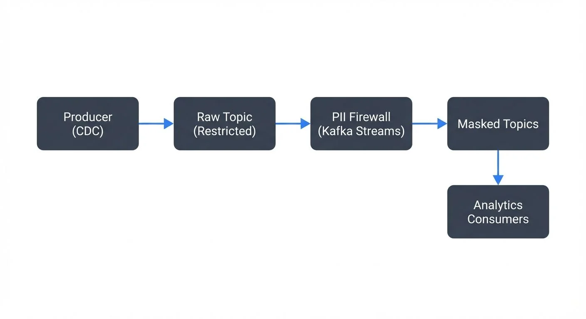

# PII Detection and Handling in Event Streams

## Introduction: What is PII and Why It Matters in Streaming

Personally Identifiable Information (PII) refers to any data that can identify a specific individual. This includes obvious identifiers like social security numbers, email addresses, and phone numbers, as well as less obvious data like IP addresses, device IDs, or combinations of demographic information that could uniquely identify someone.

In event streaming systems, PII presents unique challenges. Unlike batch processing where data can be scanned and cleaned before use, streaming data flows continuously and must be processed in real-time. A single event containing unprotected PII can propagate through multiple downstream systems in milliseconds, creating compliance risks and potential data breaches. For comprehensive strategies on preventing unintended PII exposure, see [PII Leakage Prevention](pii-leakage-prevention.md).

Consider an e-commerce platform streaming checkout events. These events might contain customer names, addresses, credit card numbers, and email addresses. Without proper PII handling, this sensitive data could end up in analytics databases, logs, monitoring dashboards, or third-party systems where it shouldn't be accessible.

The stakes are high. Regulations like GDPR and CCPA impose strict requirements on how PII must be handled, with significant penalties for violations. Organizations need to detect and protect PII at the point of ingestion, not downstream where the data has already spread. For detailed guidance on GDPR compliance, see [GDPR Compliance for Data Teams](gdpr-compliance-for-data-teams.md).

## PII Detection Techniques in Event Streams

Detecting PII in real-time streams requires automated approaches that can keep pace with high-volume data flows. Several techniques are commonly used:

**Pattern Matching and Regular Expressions**: The most straightforward approach uses regex patterns to identify common PII formats. Credit card numbers follow predictable patterns (using the Luhn algorithm, which validates credit card numbers by checking digit sequences), email addresses match standard formats, and social security numbers have consistent structures. While fast and deterministic, this approach can generate false positives and misses PII in unexpected formats.

**Schema-Based Detection**: When using schema registries with formats like Avro or Protobuf, field names and metadata can indicate PII. Fields named "email", "ssn", or "credit_card" are obvious candidates. Schema annotations can explicitly mark fields as containing PII, enabling automated detection and handling policies. For comprehensive schema management strategies, see [Schema Registry and Schema Management](schema-registry-and-schema-management.md) and [Data Classification and Tagging Strategies](data-classification-and-tagging-strategies.md).

**Machine Learning Classifiers**: More sophisticated systems use ML models trained on labeled PII datasets. Modern 2025 tools include:
- **AWS Macie**: Provides automated PII discovery using machine learning, supporting 40+ PII types including credentials, financial data, and health records
- **Google Cloud DLP API**: Offers 150+ built-in detectors with customizable detection rules and de-identification templates
- **Microsoft Presidio**: Open-source PII detection and anonymization framework with pre-trained models for multiple languages
- **Pilar (AWS Labs)**: Lightweight open-source library for detecting PII in structured and unstructured data

These models can identify PII based on context and content patterns, even when field names don't reveal the data's nature. However, ML approaches add latency (typically 10-50ms per event) and computational overhead to stream processing.

**Contextual Analysis**: Some PII only becomes identifiable in combination with other data. A zip code alone isn't PII, but combined with birthdate and gender, it can uniquely identify individuals. Contextual detection requires analyzing multiple fields together, adding complexity to stream processing logic.

## Handling Strategies: Masking, Redaction, and Tokenization

Once PII is detected, it must be protected. Different strategies offer different tradeoffs between security, utility, and reversibility:

**Masking**: Replaces parts of PII with placeholder characters. For example, a credit card number "4532-1234-5678-9010" becomes "4532-****-****-9010". Masking preserves partial utility (the first and last digits might be needed for customer service) while protecting the full value. It's irreversible but maintains some data format.

**Redaction**: Completely removes or replaces PII with generic values. An email "user@example.com" might become "[REDACTED]" or "anonymous@example.com". This provides strong protection but eliminates all utility of the original data.

**Hashing**: Applies one-way cryptographic functions to PII. The same input always produces the same hash, enabling joins and deduplication without revealing the original value. However, hashes of common values (like popular email domains) can be reverse-engineered through rainbow tables (precomputed tables of hash values used to crack password hashes). Use salted hashing with algorithms like SHA-256 or Argon2 to mitigate this risk.

**Tokenization**: Replaces PII with randomly generated tokens stored in a secure token vault (a dedicated, access-controlled database or key management service). The original value can be retrieved when needed (by authorized systems) but the token itself reveals nothing. This preserves data utility while maintaining strong security, though it requires maintaining a token mapping database.

**Encryption**: Applies symmetric or asymmetric encryption to PII. Unlike hashing, encryption is reversible with the proper key. This works well when some downstream systems need access to the original data, but key management becomes critical. For comprehensive encryption strategies, see [Encryption at Rest and in Transit for Kafka](encryption-at-rest-and-in-transit-for-kafka.md).

In streaming architectures, these techniques are typically applied at ingestion time using stream processors or Single Message Transforms (SMTs - reusable transformation components in Kafka Connect that modify messages in flight) in Kafka Connect. For detailed masking and anonymization techniques, see [Data Masking and Anonymization for Streaming](data-masking-and-anonymization-for-streaming.md).

## PII in Data Streaming Architectures

Modern streaming platforms provide various mechanisms for PII handling:

**Apache Kafka 4.0+ with KRaft**: Kafka 4.0 brings improved security foundations with KRaft mode (removing ZooKeeper dependency), making PII protection implementations more streamlined. The simplified architecture enables better audit trails and consistent policy enforcement. For details on KRaft's benefits, see [Understanding KRaft Mode in Kafka](understanding-kraft-mode-in-kafka.md). Kafka Connect offers SMTs that can mask, redact, or encrypt fields during data movement (see [Kafka Connect Single Message Transforms](kafka-connect-single-message-transforms.md)). Kafka Streams applications can implement custom PII detection and handling logic within stream processing topologies (see [Introduction to Kafka Streams](introduction-to-kafka-streams.md)).

Here's a practical example using Kafka Connect SMT to mask PII fields:

```json
{
  "name": "customer-events-connector",
  "config": {
    "connector.class": "io.confluent.connect.jdbc.JdbcSourceConnector",
    "connection.url": "jdbc:postgresql://localhost:5432/customers",
    "table.whitelist": "customer_events",
    "mode": "incrementing",
    "incrementing.column.name": "id",
    "topic.prefix": "raw-",
    "transforms": "maskEmail,hashSSN,tokenizeCard",
    "transforms.maskEmail.type": "org.apache.kafka.connect.transforms.MaskField$Value",
    "transforms.maskEmail.fields": "email",
    "transforms.maskEmail.replacement": "***MASKED***",
    "transforms.hashSSN.type": "com.github.jcustenborder.kafka.connect.transform.hash.Hash$Value",
    "transforms.hashSSN.fields": "ssn",
    "transforms.hashSSN.algorithm": "SHA256",
    "transforms.tokenizeCard.type": "org.apache.kafka.connect.transforms.ReplaceField$Value",
    "transforms.tokenizeCard.include": "credit_card",
    "transforms.tokenizeCard.renames": "credit_card:card_token"
  }
}
```

**Apache Flink 1.18+**: Flink's rich DataStream API enables complex PII detection and transformation logic. The latest versions include enhanced Python support and improved state backends optimized for stateful PII operations. Custom functions can implement ML-based detection, while built-in operators handle filtering and transformation. Flink's state management can maintain tokenization mappings or detection models. For comprehensive Flink guidance, see [What is Apache Flink](what-is-apache-flink-stateful-stream-processing.md) and [Flink State Management and Checkpointing](flink-state-management-and-checkpointing.md).

Example PII masking with Flink DataStream API:

```java
import org.apache.flink.streaming.api.datastream.DataStream;
import org.apache.flink.streaming.api.environment.StreamExecutionEnvironment;
import org.apache.flink.api.common.functions.MapFunction;

public class PiiMaskingJob {
    public static void main(String[] args) throws Exception {
        StreamExecutionEnvironment env = StreamExecutionEnvironment.getExecutionEnvironment();

        DataStream<CustomerEvent> events = env
            .addSource(new FlinkKafkaConsumer<>(
                "raw-customer-events",
                new CustomerEventSchema(),
                kafkaProps
            ));

        // Apply PII masking transformation
        DataStream<CustomerEvent> maskedEvents = events.map(new MapFunction<CustomerEvent, CustomerEvent>() {
            @Override
            public CustomerEvent map(CustomerEvent event) {
                // Mask email - show first character and domain only
                String email = event.getEmail();
                if (email != null && email.contains("@")) {
                    String[] parts = email.split("@");
                    event.setEmail(parts[0].charAt(0) + "***@" + parts[1]);
                }

                // Hash SSN with SHA-256
                String ssn = event.getSsn();
                if (ssn != null) {
                    event.setSsn(hashWithSHA256(ssn).substring(0, 16));
                }

                // Tokenize credit card (simplified - use proper tokenization service)
                String creditCard = event.getCreditCard();
                if (creditCard != null) {
                    event.setCreditCard(generateToken(creditCard));
                }

                return event;
            }

            private String hashWithSHA256(String input) {
                try {
                    MessageDigest digest = MessageDigest.getInstance("SHA-256");
                    byte[] hash = digest.digest(input.getBytes(StandardCharsets.UTF_8));
                    return Base64.getEncoder().encodeToString(hash);
                } catch (NoSuchAlgorithmException e) {
                    throw new RuntimeException(e);
                }
            }

            private String generateToken(String input) {
                // In production, call tokenization service
                return "TOKEN-" + UUID.randomUUID().toString();
            }
        });

        maskedEvents.addSink(new FlinkKafkaProducer<>(
            "masked-customer-events",
            new CustomerEventSchema(),
            kafkaProps
        ));

        env.execute("PII Masking Job");
    }
}
```

**Schema Registry Integration**: Schema registries enable schema-level PII marking. Fields can be tagged with sensitivity classifications, and consumers can automatically apply appropriate handling based on these tags. This creates a centralized governance model where PII policies are defined once in schemas rather than in every consuming application.

**Conduktor Gateway**: A modern approach uses Conduktor Gateway, which acts as a transparent proxy between applications and Kafka brokers. Gateway can apply PII masking policies dynamically based on consumer identity, enabling different data views for different teams without modifying application code:

```yaml
# Conduktor Gateway interceptor configuration
interceptors:
  - type: dataMasking
    priority: 100
    config:
      rules:
        - topic: customer-events
          field: $.email
          maskingType: EMAIL_DOMAIN
          applies_to:
            consumer_groups: [analytics-team, ml-training]

        - topic: customer-events
          field: $.ssn
          maskingType: HASH_SHA256
          applies_to:
            consumer_groups: [analytics-team, support-team, ml-training]

        - topic: customer-events
          field: $.credit_card
          maskingType: REDACT
          applies_to:
            consumer_groups: [analytics-team]

        # Production systems get full access
        - topic: customer-events
          field: $.credit_card
          maskingType: NONE
          applies_to:
            consumer_groups: [payment-processor, fraud-detection]
```

**Stream Processing Patterns - The PII Firewall**: A common architectural pattern is the "PII firewall" - a dedicated stream processing job that sits between producers and the main Kafka cluster. All events flow through this firewall, which detects and protects PII before data reaches downstream consumers. This centralizes PII handling and ensures consistent policy enforcement.



<!-- ORIGINAL_DIAGRAM
```
┌──────────┐     ┌─────────────────┐     ┌────────────────┐     ┌───────────┐
│ Producer │────▶│  Raw Topic      │────▶│  PII Firewall  │────▶│  Masked   │
│  (CDC)   │     │  (Restricted)   │     │  (Kafka        │     │  Topics   │
└──────────┘     └─────────────────┘     │   Streams)     │     └───────────┘
                                          └────────────────┘            │
                                                                        ▼
                                                                  ┌──────────┐
                                                                  │ Analytics│
                                                                  │ Consumers│
                                                                  └──────────┘
```
-->

## Compliance and Governance Considerations

PII handling in event streams must align with regulatory requirements:

**GDPR and Right to Erasure**: GDPR grants individuals the right to have their personal data deleted. In immutable log systems like Kafka, this is challenging. Modern 2025 solutions include:

- **Tombstone Messages**: Send null-value messages with the user's key to Kafka compacted topics. During log compaction, Kafka removes all previous messages with that key, effectively deleting the data.
- **Tokenization-Based Erasure**: Store PII in a secure token vault and use tokens in Kafka. When a user requests deletion, remove the token mapping - all downstream systems now see only meaningless tokens.
- **Topic Compaction with Custom Deleters**: Use Kafka's log compaction with custom cleanup policies that recognize deletion markers.
- **Time-Based Retention**: Configure short retention periods (7-30 days) for PII-containing topics, ensuring old data automatically expires.

Example tombstone message for user deletion:

```java
// Send tombstone to trigger deletion in compacted topic
ProducerRecord<String, String> tombstone = new ProducerRecord<>(
    "customer-pii-compacted",
    "customer-123",  // User ID as key
    null             // Null value signals deletion
);

// Add deletion metadata in headers
tombstone.headers().add("deletion-reason", "GDPR Right to Erasure".getBytes());
tombstone.headers().add("deletion-timestamp", String.valueOf(System.currentTimeMillis()).getBytes());
tombstone.headers().add("deleted-by", "privacy-team".getBytes());

producer.send(tombstone);
```

**Data Residency**: Some regulations require PII to remain within specific geographic boundaries. Multi-region streaming architectures must prevent PII from flowing to unauthorized regions, potentially using topic-level geo-fencing or region-specific clusters. Modern Kafka deployments use cluster linking with filters to enforce data sovereignty requirements. For multi-region architecture patterns, see [Disaster Recovery Strategies for Kafka Clusters](disaster-recovery-strategies-for-kafka-clusters.md).

**Audit Trails**: Compliance often requires detailed logs of who accessed PII and when. Streaming systems need to capture access patterns, transformation operations, and downstream consumption for audit purposes. Modern platforms integrate with SIEM systems for real-time audit monitoring. For comprehensive audit strategies, see [Audit Logging for Streaming Platforms](audit-logging-for-streaming-platforms.md) and [Streaming Audit Logs](streaming-audit-logs.md).

**Retention Policies**: Different PII types have different retention requirements. Credit card data (PCI-DSS) requires minimal retention after transaction completion, while tax-related PII might need seven-year retention. Topic-level retention policies and time-based deletion strategies help meet these requirements:

```bash
# Set retention policy for PII topic (7 days)
kafka-configs --bootstrap-server localhost:9092 \
  --entity-type topics \
  --entity-name customer-pii \
  --alter \
  --add-config retention.ms=604800000

# Enable log compaction for compacted PII topic
kafka-configs --bootstrap-server localhost:9092 \
  --entity-type topics \
  --entity-name customer-pii-compacted \
  --alter \
  --add-config cleanup.policy=compact
```

## Implementing PII Protection in Production

Building production-grade PII protection requires careful planning:

**Start with Classification**: Inventory your data streams and classify fields by sensitivity. Not everything is PII, and not all PII requires the same protection level. Create a data catalog that documents what PII exists and where it flows.

**Implement Defense in Depth**: Don't rely on a single protection mechanism. Combine schema-based detection, pattern matching, and access controls. If one layer fails, others provide backup protection.

**Consider Performance Impact**: Real-time PII detection and transformation add latency and computational overhead. Benchmark your approaches under realistic load. Sometimes simpler pattern matching outperforms ML-based detection when latency budgets are tight.

**Use Specialized Tools**: Platforms like Conduktor provide built-in data masking capabilities, schema validation, and audit trails specifically designed for Kafka environments. These tools can accelerate implementation and ensure consistent policy enforcement across teams. For access control patterns that complement PII protection, see [Access Control for Streaming](access-control-for-streaming.md) and [Kafka ACLs and Authorization Patterns](kafka-acls-and-authorization-patterns.md).

**Test Thoroughly**: Validate that PII detection catches actual sensitive data without excessive false positives. Test that masked or tokenized data still enables necessary downstream analytics. Verify that compliance requirements are met through regular audits.

**Monitor Continuously**: Implement alerting for potential PII leaks. Monitor for schema changes that might introduce new PII fields. Track PII-related metrics like detection rates, masking operations, and access patterns. For monitoring strategies, see [Kafka Cluster Monitoring and Metrics](kafka-cluster-monitoring-and-metrics.md) and [Data Observability](what-is-data-observability-the-five-pillars.md).

## Summary

PII detection and handling in event streams is a critical requirement for modern data platforms. The real-time nature of streaming systems demands automated, performant approaches to identifying and protecting sensitive data before it propagates through downstream systems.

Effective PII protection combines multiple detection techniques - from simple pattern matching to ML-based classification - with appropriate handling strategies like masking, tokenization, or encryption. The choice of technique depends on data utility requirements, performance constraints, and compliance obligations.

Streaming platforms like Kafka and Flink provide the building blocks for PII protection through stream processors, SMTs, and schema registries. However, successful implementation requires careful planning, thorough testing, and continuous monitoring to ensure sensitive data remains protected while maintaining the value of real-time data pipelines.

Organizations that treat PII protection as a first-class concern in their streaming architectures not only meet compliance requirements but also build trust with customers and reduce the risk of costly data breaches.

## Sources and References

1. **GDPR Official Text** - European Commission comprehensive resource on GDPR requirements including PII definitions and processing obligations: https://gdpr.eu/
2. **NIST Special Publication 800-122** - Guide to Protecting the Confidentiality of Personally Identifiable Information with technical guidance on PII safeguards and de-identification techniques: https://csrc.nist.gov/publications/detail/sp/800-122/final
3. **Apache Kafka Security Documentation** - Official documentation on Kafka security features including encryption and access controls: https://kafka.apache.org/documentation/#security
4. **Apache Flink Security Documentation** - Details on implementing security controls in Flink stream processing: https://nightlies.apache.org/flink/flink-docs-stable/docs/deployment/security/
5. **California Consumer Privacy Act (CCPA)** - California Attorney General official resource detailing consumer privacy rights and business obligations: https://oag.ca.gov/privacy/ccpa
6. **OWASP Top 10 Privacy Risks** - Industry-standard reference for understanding and mitigating privacy risks: https://owasp.org/www-project-top-10-privacy-risks/
