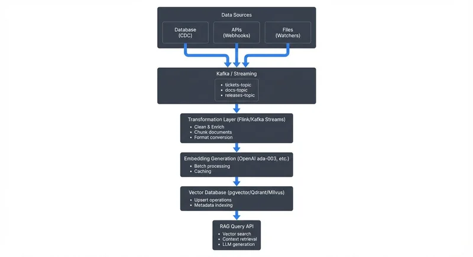

Retrieval-Augmented Generation (RAG) has become a cornerstone technique for building AI applications that combine the reasoning capabilities of large language models (LLMs) with external knowledge sources. However, many RAG implementations suffer from a critical limitation: stale data. When your knowledge base updates hourly, daily, or even weekly, your AI system risks providing outdated or incorrect information to users.

Real-time RAG pipelines address this challenge by continuously ingesting, processing, and indexing fresh data as it becomes available. This article explores how to build RAG systems that stay current with streaming data, the architectural patterns involved, and the role of data streaming platforms in making this possible.

**Prerequisites**: This article assumes familiarity with basic concepts like databases, APIs, and LLMs. Understanding of Apache Kafka and vector databases is helpful but not required - we explain key concepts inline.

## What is RAG and Why Real-Time Matters

Retrieval-Augmented Generation works by retrieving relevant context from a knowledge base and including it in prompts sent to an LLM (Large Language Model). When a user asks a question, the system:

1. Converts the query into a vector embedding (a numerical representation that captures semantic meaning)
2. Searches a vector database for semantically similar documents (finding content with related meaning, not just keyword matches)
3. Retrieves the top matching documents
4. Constructs a prompt combining the query and retrieved context
5. Sends this augmented prompt to the LLM for generation

This approach allows LLMs to access information beyond their training data and reduces hallucinations by grounding responses in factual sources.

The problem arises when the knowledge base becomes outdated. Consider a customer support chatbot that relies on product documentation. If a critical bug fix is deployed but the documentation isn't updated in the RAG system for hours, the chatbot will continue providing incorrect troubleshooting steps. In industries like finance, healthcare, or real-time monitoring, stale data can have serious consequences.

Real-time RAG pipelines eliminate this lag by treating data updates as a continuous stream rather than periodic batches.

## Traditional RAG vs Real-Time RAG

| Aspect | Traditional Batch RAG | Real-Time RAG |
|--------|----------------------|---------------|
| **Update Frequency** | Hourly, daily, or weekly | Continuous (seconds to milliseconds) |
| **Architecture** | Pull-based batch jobs | Push-based event streaming |
| **Data Freshness** | Hours to days behind | Near-real-time (< 1 minute lag) |
| **Complexity** | Lower - simple scheduled jobs | Higher - requires streaming infrastructure |
| **Cost** | Lower initial cost | Higher infrastructure cost, but optimizable |
| **Use Cases** | Static documentation, historical data | Customer support, monitoring, financial data |
| **When to Use** | Data changes < 10 times/day | Data changes > 10 times/hour |

**Traditional RAG** pipelines operate on a batch schedule:

- Documents are collected periodically (hourly, daily)
- A batch job generates embeddings for new or updated content
- Embeddings are bulk-loaded into the vector database
- The system uses this snapshot until the next update cycle

This approach is simple but introduces latency between data creation and availability in the knowledge base. Real-time RAG, by contrast, processes updates as events:

- Data changes trigger immediate events (database updates, API calls, file modifications)
- A streaming platform captures these events in real-time
- Embeddings are generated continuously as data arrives
- Vector database updates happen within seconds or milliseconds of source changes

The key difference is the shift from pull-based batch processing to push-based event streaming. This requires different architectural patterns and tooling.

## Building a Real-Time RAG Pipeline

A real-time RAG pipeline consists of several interconnected components:

<!-- ORIGINAL_DIAGRAM
```
         Real-Time RAG Pipeline Architecture

┌──────────────────────────────────────────────────┐
│            Data Sources                          │
│  ┌──────────┐  ┌──────────┐  ┌──────────┐      │
│  │Database  │  │   APIs   │  │  Files   │      │
│  │  (CDC)   │  │(Webhooks)│  │(Watchers)│      │
│  └────┬─────┘  └────┬─────┘  └────┬─────┘      │
└───────┼─────────────┼─────────────┼─────────────┘
        │             │             │
        └─────────────┼─────────────┘
                      ▼
         ┌────────────────────────┐
         │   Kafka / Streaming    │
         │  ┌──────────────────┐  │
         │  │ tickets-topic    │  │
         │  │ docs-topic       │  │
         │  │ releases-topic   │  │
         │  └──────────────────┘  │
         └───────────┬────────────┘
                     │
                     ▼
         ┌────────────────────────┐
         │  Transformation Layer  │
         │  (Flink/Kafka Streams) │
         │  • Clean & Enrich      │
         │  • Chunk documents     │
         │  • Format conversion   │
         └───────────┬────────────┘
                     │
                     ▼
         ┌────────────────────────┐
         │  Embedding Generation  │
         │ (OpenAI ada-003, etc.) │
         │  • Batch processing    │
         │  • Caching             │
         └───────────┬────────────┘
                     │
                     ▼
         ┌────────────────────────┐
         │   Vector Database      │
         │(pgvector/Qdrant/Milvus)│
         │  • Upsert operations   │
         │  • Metadata indexing   │
         └───────────┬────────────┘
                     │
                     ▼
         ┌────────────────────────┐
         │      RAG Query API     │
         │  • Vector search       │
         │  • Context retrieval   │
         │  • LLM generation      │
         └────────────────────────┘
```
-->

## Implementation Example: Real-Time Document Indexing

Here's a practical example showing how to build a real-time RAG pipeline that indexes documentation updates:

```python
from kafka import KafkaConsumer
from openai import OpenAI
import psycopg2
from pgvector.psycopg2 import register_vector

# Initialize services
openai_client = OpenAI()
db_conn = psycopg2.connect("postgresql://localhost/rag_db")
register_vector(db_conn)

# Kafka consumer for document updates
consumer = KafkaConsumer(
    'document-updates',
    bootstrap_servers=['localhost:9092'],
    group_id='rag-indexer',
    value_deserializer=lambda m: json.loads(m.decode('utf-8')),
    enable_auto_commit=False  # Manual offset management for reliability
)

def chunk_document(text, chunk_size=500, overlap=50):
    """Split document into overlapping chunks for better context."""
    chunks = []
    start = 0
    while start < len(text):
        end = start + chunk_size
        chunks.append(text[start:end])
        start = end - overlap
    return chunks

def generate_embedding(text):
    """Generate embedding using OpenAI's latest model."""
    response = openai_client.embeddings.create(
        input=text,
        model="text-embedding-3-large"
    )
    return response.data[0].embedding

def upsert_to_vector_db(doc_id, chunk_id, text, embedding, metadata):
    """Store embedding in pgvector with metadata."""
    cursor = db_conn.cursor()
    cursor.execute("""
        INSERT INTO document_embeddings (doc_id, chunk_id, content, embedding, metadata)
        VALUES (%s, %s, %s, %s, %s)
        ON CONFLICT (doc_id, chunk_id)
        DO UPDATE SET content = EXCLUDED.content,
                      embedding = EXCLUDED.embedding,
                      metadata = EXCLUDED.metadata,
                      updated_at = NOW()
    """, (doc_id, chunk_id, text, embedding, json.dumps(metadata)))
    db_conn.commit()

# Process streaming updates
for message in consumer:
    try:
        doc = message.value

        # Skip if content hasn't meaningfully changed (semantic hashing)
        if not has_semantic_change(doc['id'], doc['content']):
            consumer.commit()
            continue

        # Chunk the document
        chunks = chunk_document(doc['content'])

        # Batch generate embeddings (more efficient than one-by-one)
        texts = [chunk for chunk in chunks]
        embeddings_response = openai_client.embeddings.create(
            input=texts,
            model="text-embedding-3-large"
        )

        # Store each chunk with its embedding
        for idx, (chunk, emb_data) in enumerate(zip(chunks, embeddings_response.data)):
            upsert_to_vector_db(
                doc_id=doc['id'],
                chunk_id=idx,
                text=chunk,
                embedding=emb_data.embedding,
                metadata={
                    'title': doc['title'],
                    'category': doc['category'],
                    'updated_at': doc['timestamp']
                }
            )

        # Commit offset only after successful processing
        consumer.commit()

    except Exception as e:
        # Log error and send to dead letter queue
        print(f"Error processing document: {e}")
        send_to_dlq(message)
```

**Query Example:**

```python
def query_rag_system(user_query, top_k=5):
    """Query the RAG system with user question."""
    # Generate embedding for user query
    query_embedding = generate_embedding(user_query)

    # Vector similarity search with metadata filter
    cursor = db_conn.cursor()
    cursor.execute("""
        SELECT doc_id, content, metadata,
               1 - (embedding <=> %s) as similarity
        FROM document_embeddings
        WHERE metadata->>'category' = 'product-docs'
        ORDER BY embedding <=> %s
        LIMIT %s
    """, (query_embedding, query_embedding, top_k))

    results = cursor.fetchall()

    # Build context from top results
    context = "\n\n".join([row[1] for row in results])

    # Send to LLM with context
    response = openai_client.chat.completions.create(
        model="gpt-4o",
        messages=[
            {"role": "system", "content": "Answer based on the provided documentation."},
            {"role": "user", "content": f"Context:\n{context}\n\nQuestion: {user_query}"}
        ]
    )

    return response.choices[0].message.content
```

This example demonstrates key patterns: consuming from Kafka with manual offset management for reliability, chunking documents with overlap to preserve context, batch embedding generation to optimize API costs, and using pgvector's upsert to handle both new and updated documents.

### Data Sources and Change Data Capture

The pipeline begins with capturing changes from source systems. Common patterns include:

- **Database CDC (Change Data Capture)**: Tools like Debezium capture row-level changes from databases (INSERT, UPDATE, DELETE) and publish them as events. CDC monitors database transaction logs to detect changes without impacting application performance. For detailed implementation guidance, see [Implementing CDC with Debezium](https://conduktor.io/glossary/implementing-cdc-with-debezium) and [What is Change Data Capture (CDC) Fundamentals](https://conduktor.io/glossary/what-is-change-data-capture-cdc-fundamentals).
- **Application events**: Services emit events when business actions occur (new ticket created, document updated, transaction completed)
- **File system watchers**: Monitor directories for new or modified files
- **API webhooks**: External systems push updates via HTTP callbacks

### Streaming Platform

A streaming platform like Apache Kafka (4.0+ with KRaft mode) acts as the central nervous system, organizing events by data type. Events are retained for configurable periods, enabling replay and recovery. Multiple consumers can process the same events independently, and partitioning enables parallel processing for high throughput. Modern Kafka deployments using KRaft (Kafka Raft) eliminate ZooKeeper dependencies, simplifying operations and improving metadata scalability for real-time pipelines. For foundational understanding, see [Apache Kafka](https://conduktor.io/glossary/apache-kafka) and [Understanding KRaft Mode in Kafka](https://conduktor.io/glossary/understanding-kraft-mode-in-kafka).

### Transformation and Enrichment

Raw change events often need processing before embedding generation: data cleaning (remove HTML tags, standardize formats, filter sensitive fields), enrichment (join with reference data), chunking (split large documents), and format conversion (transform to text suitable for semantic search).

Apache Flink or Kafka Streams can perform these transformations in real-time, maintaining exactly-once processing semantics (guaranteeing each event is processed exactly once, even during failures) to ensure data consistency. For implementation details, see [What is Apache Flink: Stateful Stream Processing](https://conduktor.io/glossary/what-is-apache-flink-stateful-stream-processing) and [Kafka Streams vs Apache Flink](https://conduktor.io/glossary/kafka-streams-vs-apache-flink).

### Embedding Generation

The transformation layer outputs text chunks to an embedding service. Modern embedding models (2025) convert text to dense vector representations that capture semantic meaning:

**Modern Embedding Models:**
- **OpenAI text-embedding-3-large/small** (2024+): Improved semantic understanding with reduced dimensionality options
- **Cohere Embed v3** (2024+): Supports multiple languages and compression options
- **Open-source alternatives**: sentence-transformers (all-MiniLM-L6-v2), BGE embeddings, or self-hosted models for privacy-sensitive deployments

**Optimization Strategies:**
- **Batch processing**: Group multiple texts into single API calls (10-100 items) to improve throughput and reduce overhead
- **Caching**: Store embeddings for frequently accessed or unchanged content using Redis or in-memory caches to reduce API costs by 60-80%
- **Semantic hashing**: Detect meaningful changes vs. cosmetic edits (typos, formatting) to avoid re-embedding identical content
- **Error handling**: Implement exponential backoff for rate limits, circuit breakers for API failures, and dead letter queues for problematic documents

### Vector Database Writes

Finally, embeddings and metadata are written to a vector database. Modern vector databases (2025) offer diverse deployment options:

**Vector Database Options:**
- **pgvector** (PostgreSQL 15+): Adds vector similarity search to existing PostgreSQL databases, ideal for teams already using Postgres
- **Qdrant**: High-performance vector database with built-in filtering and multi-tenancy support
- **Milvus**: Distributed vector database designed for billion-scale deployments
- **Weaviate**: Vector database with built-in vectorization and hybrid search capabilities

For comprehensive guidance on vector databases in streaming architectures, see [Vector Databases and Streaming Architectures](https://conduktor.io/glossary/vector-databases-and-streaming-architectures) and [Vector Embeddings in Streaming](https://conduktor.io/glossary/vector-embeddings-in-streaming).

**Key Operations:**
- **Upsert operations**: Handle both new documents and updates to existing ones atomically, using document IDs as keys
- **Metadata filters**: Enable hybrid search combining vector similarity with traditional filters (date ranges, categories, user permissions)
- **Partitioning strategies**: Organize vectors by tenant, region, or time period to manage large-scale deployments and optimize query performance
- **Hybrid search** (2024-2025): Combine dense vector search with sparse retrieval (BM25) for improved accuracy, especially on keyword-specific queries

## The Streaming Data Connection

Data streaming platforms are essential to real-time RAG for several reasons:

**Decoupling**: Source systems don't need to know about downstream embedding pipelines. They publish events to Kafka, and consumers process them asynchronously. This separation allows RAG systems to evolve independently.

**Scalability**: Kafka's partitioned log architecture enables horizontal scaling. As embedding generation demand grows, you can add more consumer instances to process events in parallel.

**Reliability**: Event persistence means the pipeline can recover from failures without data loss. If the embedding service crashes, it can resume processing from the last committed offset.

**Ordering and consistency**: Kafka maintains message ordering within partitions, ensuring updates to the same document are processed sequentially. This prevents race conditions where an old version overwrites a newer one in the vector database.

**Schema evolution**: As data structures change over time, schema registries enable backward and forward compatibility, allowing producers and consumers to evolve at different rates. Apache Kafka's Schema Registry manages schemas centrally, ensuring data consistency across the pipeline. For schema management best practices, see [Schema Registry and Schema Management](https://conduktor.io/glossary/schema-registry-and-schema-management) and [Schema Evolution Best Practices](https://conduktor.io/glossary/schema-evolution-best-practices).

Platforms like Conduktor provide comprehensive governance and monitoring for these streaming pipelines, offering visibility into data quality issues before they affect the RAG system:

- **Schema validation**: Automatically validate incoming events against [registered schemas](https://docs.conduktor.io/guide/manage-kafka/kafka-resources/schema-registry) to prevent malformed data from entering the RAG pipeline
- **Data masking**: Redact sensitive fields (PII, credentials) in real-time to ensure embeddings don't leak confidential information
- **Pipeline health dashboards**: Monitor consumer lag, throughput, and error rates across the entire RAG ingestion pipeline
- **Data quality rules**: Set up automated checks for [data completeness, freshness, and accuracy](https://docs.conduktor.io/guide/use-cases/observe-data-quality) before embedding generation
- **Testing with Conduktor Gateway**: Simulate failure scenarios and chaos engineering tests to validate pipeline resilience without impacting production

These governance capabilities help teams maintain reliable, compliant real-time data flows from source systems to vector databases.

## Managing Real-Time Embeddings at Scale

Operating a real-time RAG pipeline introduces operational challenges:

**Embedding latency**: Generating embeddings via API calls adds latency. A single document might take 100-500ms to embed. At high volumes, this requires careful batching and parallelization.

**Performance Targets:**
- **Low-volume**: < 100 documents/hour - Simple single-threaded consumer works fine
- **Medium-volume**: 100-10,000 documents/hour - Requires batch processing and 3-5 parallel consumers
- **High-volume**: > 10,000 documents/hour - Needs distributed processing (Flink/Kafka Streams), multi-region embedding services, and vector database sharding

**Cost management**: Embedding APIs charge per token. Processing every minor change (like a typo correction) can be expensive.

**Cost Estimates (Example: 10,000 documents/day, 500 tokens each):**
- **Embedding costs**: OpenAI text-embedding-3-large = ~$13/million tokens = $65/month
- **Vector database**: pgvector (self-hosted) = $50-100/month compute | Qdrant Cloud = $100-300/month depending on scale
- **Kafka hosting**: Self-managed on cloud = $100-200/month | Managed service (MSK/Aiven) = $300-500/month
- **Total estimated cost**: $500-1,000/month for a medium-scale deployment

**Optimization strategies**: Implement semantic hashing to detect meaningful changes (can reduce embedding API calls by 40-60%), cache frequently accessed embeddings, and use deduplication to avoid re-embedding identical content.

**Vector database consistency**: Ensure that document deletes propagate to the vector database. Orphaned embeddings can pollute search results.

**Monitoring and alerting**: Track metrics like embedding generation lag, vector database write throughput, and search relevance. Anomalies might indicate pipeline degradation or data quality issues. For monitoring best practices, see [Consumer Lag Monitoring](https://conduktor.io/glossary/consumer-lag-monitoring) and [What is Data Observability: The Five Pillars](https://conduktor.io/glossary/what-is-data-observability-the-five-pillars).

## Practical Use Cases

Real-time RAG pipelines deliver value in scenarios where information freshness is critical:

**Customer Support**: As new support tickets, resolutions, and product documentation are created, they immediately become searchable by AI assistants. A support agent or chatbot can access the latest troubleshooting steps within seconds of publication.

**Financial Analysis**: Market data, news feeds, and regulatory filings stream continuously. Real-time RAG enables analysts to query recent events with natural language and receive context-aware summaries grounded in the latest information.

**Monitoring and Incident Response**: System logs, metrics, and alerts flow into a RAG system that helps engineers diagnose issues. When an outage occurs, the knowledge base includes recent deployments, configuration changes, and similar past incidents.

For related ML and streaming use cases, see [Real-Time ML Inference with Streaming Data](https://conduktor.io/glossary/real-time-ml-inference-with-streaming-data) and [Real-Time ML Pipelines](https://conduktor.io/glossary/real-time-ml-pipelines).

## Summary

Real-time RAG pipelines represent the convergence of AI and event-driven architectures. By treating knowledge base updates as continuous streams rather than periodic batches, organizations can build AI systems that provide accurate, current information to users.

The architecture combines change data capture, streaming platforms like Apache Kafka, real-time transformation with Flink or Kafka Streams, embedding generation services, and vector databases. Each component plays a specific role in the data flow from source systems to queryable knowledge.

While traditional batch RAG remains suitable for static or slowly changing content, real-time RAG is essential for domains where information freshness directly impacts user value and business outcomes. As streaming infrastructure matures and becomes more accessible, real-time RAG will become the standard approach for production AI applications.

## Related Concepts

- [Streaming Data Pipeline](/streaming-data-pipeline) - Build end-to-end RAG data pipelines
- [Data Quality Dimensions: Accuracy, Completeness, and Consistency](/data-quality-dimensions-accuracy-completeness-and-consistency) - Ensure high-quality RAG inputs
- [Schema Registry and Schema Management](/schema-registry-and-schema-management) - Manage document and embedding schemas

## Sources and References

1. **"Retrieval-Augmented Generation for Knowledge-Intensive NLP Tasks"** - Lewis et al., Facebook AI Research (2020) - The foundational RAG research paper
2. **Apache Kafka Documentation** - [https://kafka.apache.org/documentation/](https://kafka.apache.org/documentation/) - Streaming platform architecture and patterns
3. **Pinecone Vector Database Documentation** - [https://docs.pinecone.io/](https://docs.pinecone.io/) - Real-time vector indexing and search
4. **Debezium Documentation** - [https://debezium.io/documentation/](https://debezium.io/documentation/) - Change Data Capture for databases
5. **"Building LLM Applications for Production"** - Chip Huyen (2023) - Practical patterns for production LLM systems including RAG
