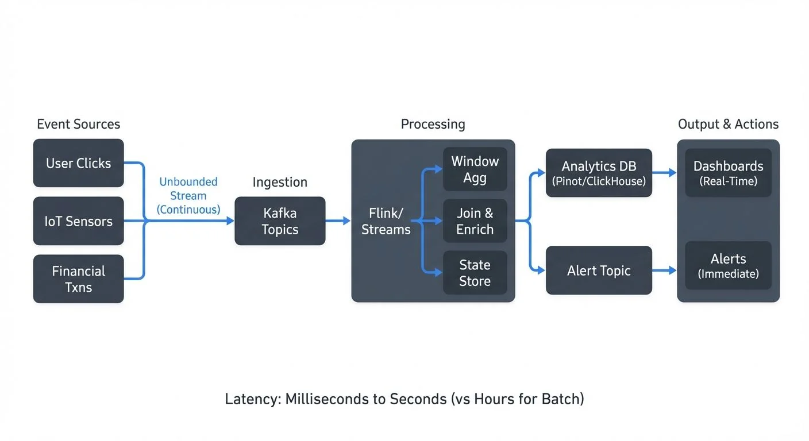

Real-time analytics has become essential for organizations that need to make decisions based on data as it arrives, rather than waiting for batch processing cycles. From detecting fraudulent transactions within milliseconds to monitoring IoT sensor networks, the ability to analyze streaming data in real-time enables use cases that were previously impossible.



<!-- ORIGINAL_DIAGRAM
```
┌──────────────── Real-Time Analytics Flow ─────────────────┐
│                                                            │
│  Event Sources          Ingestion         Processing      │
│  ┌────────────┐         ┌───────┐        ┌──────────┐    │
│  │ User       │────────▶│ Kafka │───────▶│ Flink/   │    │
│  │ Clicks     │         │Topics │        │ Streams  │    │
│  └────────────┘         └───────┘        │          │    │
│  ┌────────────┐              │           │ ┌──────┐ │    │
│  │ IoT        │──────────────┤           │ │Window│ │    │
│  │ Sensors    │              │           │ │ Agg  │ │    │
│  └────────────┘              │           │ └──────┘ │    │
│  ┌────────────┐              │           │ ┌──────┐ │    │
│  │ Financial  │──────────────┘           │ │Join &│ │    │
│  │ Txns       │                          │ │Enrich│ │    │
│  └────────────┘                          │ └──────┘ │    │
│                                          │ ┌──────┐ │    │
│  Unbounded Stream                        │ │State │ │    │
│  (Continuous)                            │ │Store │ │    │
│                                          │ └──────┘ │    │
│                                          └──────────┘    │
│                                               │          │
│                                               ▼          │
│  Output & Actions                    ┌──────────────┐   │
│  ┌──────────────┐                    │ Analytics DB │   │
│  │ Dashboards   │◀───────────────────│ (Pinot/      │   │
│  │ (Real-Time)  │                    │  ClickHouse) │   │
│  └──────────────┘                    └──────────────┘   │
│  ┌──────────────┐                    ┌──────────────┐   │
│  │ Alerts       │◀───────────────────│ Alert Topic  │   │
│  │ (Immediate)  │                    └──────────────┘   │
│  └──────────────┘                                        │
│                                                          │
│  Latency: Milliseconds to Seconds (vs Hours for Batch) │
└──────────────────────────────────────────────────────────┘
```
-->

Unlike traditional batch analytics that processes historical data at scheduled intervals, real-time analytics operates on continuous data streams, producing insights with latencies measured in seconds or even milliseconds. This shift requires fundamentally different technologies, architectures, and thinking patterns.

## Understanding Streaming Data

Streaming data is characterized by its continuous, unbounded nature. Events arrive one after another in a never-ending flow, whether they're user clicks on a website, sensor readings from industrial equipment, or financial transactions.

The key distinction from batch data is temporal. Batch systems ask "what happened?" while streaming systems ask "what is happening right now?" This temporal dimension introduces challenges around ordering, completeness, and timeliness that don't exist in batch processing.

Streaming data typically exhibits three important characteristics:

**Volume and velocity**: Data arrives continuously at rates that can range from dozens to millions of events per second. The system must process events as fast as they arrive to maintain real-time responsiveness.

**Event time vs processing time**: Events carry timestamps indicating when they occurred (event time), which may differ from when the system processes them (processing time). Network delays, system failures, or out-of-order delivery can cause significant differences between these times.

**Unbounded datasets**: Unlike batch jobs that process a finite dataset with a clear beginning and end, streaming datasets have no natural conclusion. Analytics must be designed to operate continuously without accumulating unbounded state.

## Stream Processing Technologies

Several technologies have emerged to handle the complexities of real-time analytics on streaming data.

**Apache Kafka** serves as the foundation for many streaming architectures. It provides a distributed, fault-tolerant platform for ingesting, storing, and distributing streaming data. Kafka's log-based architecture ensures durability and allows consumers to replay historical data when needed. Topics partition data across multiple brokers, enabling horizontal scaling to handle massive throughput. For detailed coverage of Kafka fundamentals, see [Apache Kafka](https://conduktor.io/glossary/apache-kafka). Modern Kafka deployments (4.0+) use [KRaft mode](https://conduktor.io/glossary/understanding-kraft-mode-in-kafka) instead of ZooKeeper, simplifying operations and improving scalability.

**Apache Flink** provides true stream processing with low latency and exactly-once semantics. Flink excels at complex stateful computations, event-time processing, and sophisticated windowing operations. For an in-depth exploration, see [What is Apache Flink](https://conduktor.io/glossary/what-is-apache-flink-stateful-stream-processing).

**Apache Spark** offers Structured Streaming, which provides both micro-batch and continuous processing modes. While historically known for micro-batching, Spark 2.3+ introduced continuous processing for sub-millisecond latencies, making it viable for true streaming use cases.

**Kafka Streams** provides a lightweight library for building stream processing applications that run within your existing JVM applications, eliminating the need for separate cluster infrastructure.

**ksqlDB** brings SQL semantics to stream processing, allowing developers to query Kafka topics using familiar SQL syntax. It's particularly useful for teams without deep stream processing expertise who need to perform transformations, aggregations, and joins using declarative SQL rather than procedural code.

**Modern analytical databases** like Apache Pinot, RisingWave, and Materialize are purpose-built for real-time analytics. Apache Pinot provides OLAP capabilities on streaming data with sub-second query latencies. RisingWave offers PostgreSQL-compatible streaming SQL with materialized views that update in real-time. Materialize maintains incrementally updated views over streams, enabling SQL queries on constantly changing data.

These technologies work together in typical architectures: Kafka handles ingestion and distribution, while processing engines like Flink perform the actual analytics and transformations.

## Common Real-Time Analytics Patterns

Several patterns appear repeatedly in real-time analytics implementations.

### Windowing

Since streaming data is unbounded, analytics must operate on finite subsets defined by time windows. For comprehensive coverage of windowing patterns and implementation details, see [Windowing in Apache Flink](https://conduktor.io/glossary/windowing-in-apache-flink-tumbling-sliding-and-session-windows). Three common window types are:

- **Tumbling windows**: Fixed-size, non-overlapping windows (e.g., "count events every 5 minutes")
- **Sliding windows**: Overlapping windows that advance by a smaller interval than their size (e.g., "calculate the average over the last 10 minutes, updated every minute")
- **Session windows**: Dynamic windows based on activity periods, useful for user behavior analysis. For detailed session window patterns, see [Session Windows in Stream Processing](https://conduktor.io/glossary/session-windows-in-stream-processing).

Here's a practical example using Flink SQL to calculate average transaction amounts in 5-minute tumbling windows:

```sql
SELECT
    user_id,
    TUMBLE_START(event_time, INTERVAL '5' MINUTE) as window_start,
    AVG(transaction_amount) as avg_amount,
    COUNT(*) as transaction_count
FROM transactions
GROUP BY
    user_id,
    TUMBLE(event_time, INTERVAL '5' MINUTE)
HAVING AVG(transaction_amount) > 1000;
```

For fraud detection, a real-time system might use ksqlDB to track transaction patterns:

```sql
CREATE STREAM transaction_alerts AS
SELECT
    user_id,
    COUNT(*) as tx_count,
    SUM(amount) as total_amount
FROM transactions
WINDOW TUMBLING (SIZE 1 MINUTE)
GROUP BY user_id
HAVING COUNT(*) > 10 OR SUM(amount) > 10000
EMIT CHANGES;
```

For detailed fraud detection patterns, see [Real-Time Fraud Detection with Streaming](https://conduktor.io/glossary/real-time-fraud-detection-with-streaming).

### Stateful Processing

Many analytics require maintaining state across events. Counting unique users, detecting patterns, or correlating related events all need the system to remember information from previous events. For deep dive into state management, see [State Stores in Kafka Streams](https://conduktor.io/glossary/state-stores-in-kafka-streams).

Stream processors manage state in memory for fast access while checkpointing to persistent storage for fault tolerance. Modern stream processors like Flink (1.13+) and Kafka Streams (3.0+) have significantly improved exactly-once processing performance, making stateful operations reliable even at high throughput.

Here's a Kafka Streams example tracking unique user visits per page:

```java
StreamsBuilder builder = new StreamsBuilder();

KTable<String, Long> uniqueVisitors = builder
    .stream("page-views")
    .groupBy((key, view) -> view.getPageId())
    .aggregate(
        () -> new HashSet<String>(), // Initialize empty set
        (pageId, view, visitors) -> {
            visitors.add(view.getUserId());
            return visitors;
        },
        Materialized.<String, Set<String>, KeyValueStore<Bytes, byte[]>>as(
            "unique-visitors-store")
    )
    .mapValues(visitors -> (long) visitors.size());
```

This stateful computation maintains a set of unique user IDs per page, automatically handling state recovery if the application restarts.

### Stream Joins

Joining multiple streams or enriching streaming data with reference data is common but complex. For instance, joining a stream of purchases with a stream of inventory updates requires handling time synchronization and dealing with late-arriving events. For comprehensive join patterns and implementation strategies, see [Stream Joins and Enrichment Patterns](https://conduktor.io/glossary/stream-joins-and-enrichment-patterns).

Here's a Flink example joining order streams with customer data:

```java
DataStream<Order> orders = env.addSource(new FlinkKafkaConsumer<>("orders", ...));
DataStream<Customer> customers = env.addSource(new FlinkKafkaConsumer<>("customers", ...));

DataStream<EnrichedOrder> enrichedOrders = orders
    .keyBy(Order::getCustomerId)
    .intervalJoin(customers.keyBy(Customer::getId))
    .between(Time.minutes(-5), Time.minutes(5))
    .process(new ProcessJoinFunction<Order, Customer, EnrichedOrder>() {
        @Override
        public void processElement(Order order, Customer customer, Context ctx,
                                  Collector<EnrichedOrder> out) {
            out.collect(new EnrichedOrder(order, customer));
        }
    });
```

This interval join ensures orders are matched with customer records that arrive within a 10-minute time window, handling slight timing differences between streams.

## Challenges and Best Practices

Real-time analytics introduces operational challenges that require careful consideration.

### Handling Late and Out-of-Order Data

Network delays and system failures mean events don't always arrive in order. A transaction that occurred at 10:00:01 might arrive after one from 10:00:05. Stream processors use **watermarks**—special markers that track progress through event time—to determine when to close windows and emit results. Watermarks define how long to wait for late events before considering a window complete.

For detailed coverage of watermark strategies and trigger mechanisms, see [Watermarks and Triggers in Stream Processing](https://conduktor.io/glossary/watermarks-and-triggers-in-stream-processing). Modern stream processors allow configuring allowed lateness and side outputs for handling extremely late data without losing it.

### Exactly-Once Semantics

For many use cases like financial analytics, processing each event exactly once is critical. Neither missing events (data loss) nor processing duplicates (incorrect counts) is acceptable. Modern stream processors like Flink achieve exactly-once semantics through distributed snapshots and transactional writes, but this comes with performance overhead.

### Scalability and Performance

As data volumes grow, streaming systems must scale horizontally. This requires partitioning data across multiple processing instances while maintaining ordering guarantees where needed. Proper partitioning strategies based on keys (like user ID or device ID) ensure related events are processed by the same instance.

### Monitoring and Debugging

Unlike batch jobs that complete and report final status, streaming jobs run indefinitely. Detecting issues requires continuous monitoring of key metrics:

- **Consumer lag**: The difference between the latest message offset and the consumer's current position. Growing lag indicates the consumer can't keep up with incoming data. For detailed lag monitoring strategies, see [Consumer Lag Monitoring](https://conduktor.io/glossary/consumer-lag-monitoring).
- **Processing latency**: Time between event occurrence and processing completion. Increasing latency signals potential bottlenecks.
- **Throughput**: Events processed per second. Declining throughput may indicate resource constraints or inefficient operations.
- **Backpressure**: When downstream operators can't keep pace with upstream data rates. For handling strategies, see [Backpressure Handling in Streaming Systems](https://conduktor.io/glossary/backpressure-handling-in-streaming-systems).
- **Checkpoint duration**: Time required to snapshot application state. Long checkpoint times can impact overall system performance.
- **State size**: Memory consumed by stateful operations. Unbounded state growth leads to out-of-memory errors.

Platforms like Conduktor provide comprehensive visibility into streaming pipelines, helping teams monitor these metrics, inspect message contents, validate data quality, and debug issues before they impact downstream analytics. Teams can centrally manage and monitor [Kafka topics](https://docs.conduktor.io/guide/manage-kafka/kafka-resources/topics) to ensure healthy streaming operations. For broader data quality concerns, see [What is Data Observability](https://conduktor.io/glossary/what-is-data-observability-the-five-pillars).

## Architectural Patterns for Real-Time Analytics

Modern real-time analytics architectures typically follow one of two patterns:

### Lambda Architecture

Lambda architecture maintains separate batch and streaming pipelines that run in parallel. The batch layer processes complete historical datasets to produce accurate views, while the speed layer processes recent data with lower latency. Results are merged at query time. While this provides both accuracy and real-time responsiveness, maintaining two separate codebases increases operational complexity.

### Kappa Architecture

Kappa architecture simplifies operations by using a single streaming pipeline for both real-time and historical data. All data flows through the streaming system, which processes it incrementally. By storing the complete event log (like Kafka's infinite retention), the system can reprocess historical data by simply replaying the stream. This reduces complexity but requires the streaming system to handle both real-time and batch-scale processing efficiently.

### Lakehouse Integration

Modern real-time analytics increasingly integrates with lakehouse architectures, writing streaming data to transactional table formats like Apache Iceberg or Delta Lake. This enables:

- **Unified batch and streaming**: Query the same tables using both real-time stream processing and batch SQL engines
- **Time travel**: Replay historical data or query past states of the data
- **ACID transactions**: Ensure consistency between streaming writes and batch operations
- **Cost-effective storage**: Hot data in streaming processors, cold data in object storage

For detailed patterns, see [Streaming to Lakehouse Tables](https://conduktor.io/glossary/streaming-to-lakehouse-tables) and [Apache Iceberg](https://conduktor.io/glossary/apache-iceberg).

## Real-World Applications

Real-time analytics powers critical systems across industries.

**Fraud detection**: Financial institutions analyze transaction streams in real-time, comparing patterns against historical behavior and known fraud signatures. A credit card transaction that occurs in a different country minutes after a previous transaction can be flagged instantly, preventing fraudulent charges. For implementation details, see [Real-Time Fraud Detection with Streaming](https://conduktor.io/glossary/real-time-fraud-detection-with-streaming).

**IoT monitoring**: Manufacturing facilities monitor thousands of sensors in real-time to detect equipment failures before they occur. By analyzing temperature, vibration, and pressure readings as they stream in, predictive maintenance systems can alert operators to potential issues, reducing downtime.

**Personalization engines**: E-commerce platforms track user behavior in real-time to adjust recommendations and pricing using clickstream analytics. Every click, view, and purchase updates the user's profile, enabling immediate personalization of the shopping experience. For clickstream patterns, see [Clickstream Analytics with Kafka](https://conduktor.io/glossary/clickstream-analytics-with-kafka).

**Gaming analytics**: Gaming companies process millions of player events per second to detect cheating, balance gameplay, and personalize experiences in real-time. For specialized gaming patterns, see [Real-Time Gaming Analytics with Streaming](https://conduktor.io/glossary/real-time-gaming-analytics-with-streaming).

**Machine learning inference**: Real-time ML systems analyze streaming data to make instant predictions, from content recommendations to predictive maintenance alerts. For ML patterns, see [Real-Time ML Inference with Streaming Data](https://conduktor.io/glossary/real-time-ml-inference-with-streaming-data).

**Network operations**: Telecommunications companies analyze network traffic patterns in real-time to detect anomalies, optimize routing, and identify potential security threats. Processing millions of events per second allows operators to respond to issues before customers notice degraded service. For security patterns, see [Real-Time Threat Detection](https://conduktor.io/glossary/real-time-threat-detection).

## Summary

Real-time analytics with streaming data represents a fundamental shift from traditional batch processing, enabling organizations to act on insights as events occur rather than hours or days later. The ecosystem has matured significantly, with Apache Kafka providing data distribution, stream processors like Apache Flink and Kafka Streams handling analytics, and modern analytical databases like Apache Pinot and RisingWave enabling SQL queries on streaming data.

Success requires understanding the unique characteristics of streaming data: its unbounded nature, the distinction between event time and processing time, and the challenges of late and out-of-order events handled through watermarks. Common patterns like windowing, stateful processing, and stream joins provide building blocks for implementing analytics, while modern improvements in exactly-once semantics (Flink 1.13+, Kafka 3.0+) have made these systems production-ready at scale.

Architectural choices matter: Lambda architecture offers separate batch and streaming paths, Kappa simplifies with streaming-only processing, and lakehouse integration provides unified batch/streaming access through Apache Iceberg or Delta Lake. Comprehensive monitoring of consumer lag, processing latency, backpressure, and state size ensures reliable operations.

As more systems generate continuous data streams, the ability to analyze and act on that data in real-time becomes increasingly critical. Organizations that master real-time analytics gain competitive advantages through faster decision-making, improved customer experiences, and operational efficiency across domains from fraud detection to personalization to IoT monitoring.

## Related Concepts

- [Apache Kafka](/apache-kafka) - Distributed streaming platform for data distribution in real-time analytics
- [What is Apache Flink: Stateful Stream Processing](/what-is-apache-flink-stateful-stream-processing) - Stateful stream processing engine for complex analytics
- [Consumer Lag Monitoring](/consumer-lag-monitoring) - Track stream processing health and performance

## Sources and References

1. Kleppmann, M. (2017). *Designing Data-Intensive Applications*. O'Reilly Media. Chapter 11: Stream Processing.

2. Akidau, T., Chernyak, S., & Lax, R. (2018). *Streaming Systems: The What, Where, When, and How of Large-Scale Data Processing*. O'Reilly Media.

3. Apache Flink Documentation. (2025). "Concepts: Timely Stream Processing." https://flink.apache.org/

4. Narkhede, N., Shapira, G., & Palino, T. (2017). *Kafka: The Definitive Guide*. O'Reilly Media.

5. Apache Kafka Documentation. (2025). "KRaft Mode and Stream Processing." https://kafka.apache.org/

6. Apache Pinot Documentation. (2025). "Real-Time Analytics at Scale." https://pinot.apache.org/
