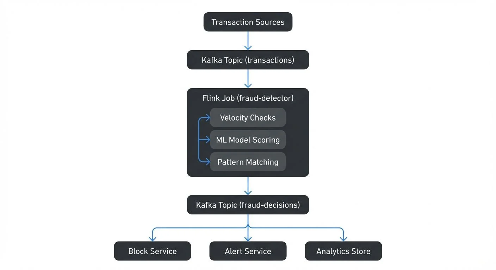

# Real-Time Fraud Detection with Streaming

Fraud detection has evolved from batch processing delayed by hours or days to real-time systems that analyze transactions in milliseconds. This shift is critical because fraudulent transactions can cause immediate financial damage, and prevention must happen before transactions complete. Streaming platforms provide the infrastructure to process millions of events per second, enabling organizations to detect and prevent fraud as it occurs.

This article explores how streaming technologies enable real-time fraud detection, covering core architectures, detection patterns, implementation examples, and operational challenges.

## The Challenge with Traditional Fraud Detection

Traditional fraud detection systems rely on batch processing. Transactions are collected throughout the day, analyzed overnight, and suspicious activity is flagged the next morning. This delay creates a window of opportunity for fraudsters.

Consider a stolen credit card scenario. In a batch system, a fraudster could make dozens of purchases before the fraud detection system even processes the first transaction. By the time fraud is detected, significant damage has occurred.

Real-time fraud detection solves this by analyzing each transaction immediately. If a card is used in New York at 2:00 PM and then in London at 2:05 PM, the system can flag or block the second transaction instantly because the physical impossibility indicates fraud.

## How Streaming Enables Real-Time Fraud Detection

Streaming platforms like [Apache Kafka](/apache-kafka) and processing engines like [Apache Flink](/what-is-apache-flink-stateful-stream-processing) form the backbone of modern fraud detection systems. Here's how they work together:

**Event Streaming with Kafka**: Every transaction becomes an event published to Kafka topics. When a customer swipes a card, submits a payment, or transfers money, that event flows through Kafka in real-time. Kafka's distributed architecture handles millions of transactions per second while guaranteeing event ordering and durability.

**Stream Processing with Flink**: Flink consumes transaction events from Kafka and applies fraud detection logic in real-time. Unlike batch systems that process data in chunks, Flink processes each event individually as it arrives. It maintains stateful computations, tracking customer behavior patterns, transaction history, and risk scores across time windows.

**Low Latency**: Streaming systems process events in milliseconds, not hours. This speed is essential because fraud detection must complete before the transaction authorization responds to the customer. Payment processors typically have 100-200 millisecond windows to approve or decline transactions.

The streaming approach transforms fraud detection from a reactive report to a preventive control system.

## Key Components of a Streaming Fraud Detection System

A complete fraud detection pipeline consists of several interconnected components:

**Data Sources**: Transaction systems, payment gateways, mobile apps, and web applications generate events. These sources publish events to Kafka topics with schemas defining transaction amount, merchant, location, timestamp, customer ID, and device fingerprints.

**Event Processing Layer**: Stream processors like Flink consume events and apply detection logic. This layer performs stateful operations such as aggregating transaction counts per customer over rolling time windows, calculating velocity metrics, and comparing current behavior against historical patterns.

**Feature Store**: Machine learning models require features computed from streaming data. A feature store is a specialized database that stores and serves pre-computed features with extremely low latency (typically single-digit milliseconds). Modern feature stores like Feast (open source), Tecton, or AWS Feature Store provide low-latency access to computed features like "number of transactions in the last 10 minutes" or "average transaction amount over 30 days." These systems solve the critical challenge of feature consistency between training (offline, batch-computed features) and inference (online, real-time features), ensuring that your production models receive the same feature representations they were trained on.

**Decision Engine**: This component combines rule-based logic and ML model predictions to make fraud determinations. It might score each transaction on a 0-100 risk scale, where scores above 80 trigger automatic blocks and scores between 50-80 require additional verification.

**Action System**: When fraud is detected, the system must take action: declining transactions, sending alerts, triggering multi-factor authentication, or flagging accounts for review. These actions often feed back into Kafka as new events.

**State Management**: Stream processors maintain state across millions of customers. Flink uses pluggable state backends to track customer profiles, running aggregations, and model predictions efficiently. RocksDB is the most common choice for large-scale production deployments, providing disk-backed state that can handle terabytes of data. For lower-latency scenarios with smaller state sizes, heap-based state backends store data in JVM memory, while cloud-native state backends like AWS S3 can reduce operational overhead at the cost of slightly higher latency.

## Common Fraud Detection Patterns and Techniques

Real-time fraud detection employs several proven patterns:

**Velocity Checks**: These detect unusually high transaction frequency. If a customer typically makes 2-3 transactions per week but suddenly makes 20 transactions in an hour, the system flags this as suspicious. Implementation uses [tumbling or sliding windows](/windowing-in-apache-flink-tumbling-sliding-and-session-windows) to count events over time periods.

**Geolocation Impossibility**: As mentioned earlier, transactions in geographically distant locations within impossible timeframes indicate fraud. The system calculates distance and time between consecutive transactions to identify violations of physical constraints.

**Anomaly Detection**: Machine learning models learn normal customer behavior patterns and flag deviations that could indicate fraud. Modern fraud detection systems use algorithms like Isolation Forest (efficient for high-dimensional data), LSTM autoencoders (for detecting temporal sequence anomalies), or one-class SVM (for learning normal behavior boundaries). For example, a customer who always makes small purchases under $50 suddenly attempting a $5,000 transaction would score high on anomaly detection. In 2025, transformer-based models and vector embeddings have become increasingly popular, as they can capture complex patterns across multiple features simultaneously and detect subtle fraud signatures that traditional algorithms miss.

**Pattern Matching**: Complex Event Processing (CEP) is a technique for detecting specific sequences of events over time. Flink's CEP library allows you to define patterns declaratively and match them against streaming data. For instance, testing transactions with small amounts followed by large purchases is a common fraud pattern called "card testing." The CEP library can detect patterns like: "three transactions under $1 within 5 minutes, followed by a transaction over $500 within the next 10 minutes." When this pattern matches, the system flags the account for immediate review or blocking.

**Network Analysis**: Graph processing identifies fraud rings where multiple accounts share devices, IP addresses, or shipping addresses. These network patterns are difficult to detect in isolation but become obvious when analyzing relationship graphs. Graph databases like Neo4j and TigerGraph excel at this analysis, storing entity relationships (accounts, devices, addresses, payment methods) and running graph algorithms like community detection, PageRank, and shortest-path analysis to identify suspicious clusters. Streaming graph processing tools can update these graphs in real-time as new transactions flow through Kafka, enabling dynamic fraud ring detection.

## Architecture Example: Building a Fraud Detection Pipeline

Here's a concrete architecture for a fraud detection system:



<!-- ORIGINAL_DIAGRAM
```
Transaction Sources → Kafka Topic (transactions)
                           ↓
                    Flink Job (fraud-detector)
                           ↓
                    ├→ Velocity Checks
                    ├→ ML Model Scoring
                    ├→ Pattern Matching
                           ↓
              Kafka Topic (fraud-decisions)
                           ↓
              ├→ Block Service
              ├→ Alert Service
              └→ Analytics Store
```
-->

The Flink job implements multiple detection strategies:

1. **Velocity Check**: Counts transactions per customer using a 10-minute sliding window
2. **Amount Anomaly**: Compares transaction amount against customer's 30-day average
3. **ML Scoring**: Invokes a deployed model with transaction features
4. **Final Decision**: Combines all signals into a risk score and decision

State management is crucial. The Flink job maintains:
- Customer transaction counts per time window
- Customer average transaction amounts
- Last transaction location per customer
- Fraud pattern states (for CEP)

This state must be fault-tolerant and recoverable. Flink checkpoints state to durable storage, ensuring that even if the processing job crashes, it can resume with accurate state.

## Implementation Example: Velocity Check with Flink

Here's a concrete example of implementing velocity-based fraud detection using Flink's DataStream API:

```java
DataStream<Transaction> transactions = env
    .addSource(new FlinkKafkaConsumer<>(
        "transactions",
        new TransactionDeserializationSchema(),
        kafkaProps
    ));

DataStream<FraudAlert> alerts = transactions
    .keyBy(txn -> txn.getCustomerId())
    .window(SlidingEventTimeWindows.of(Time.minutes(10), Time.minutes(1)))
    .aggregate(new TransactionCountAggregator(), new VelocityChecker());

alerts.addSink(new FlinkKafkaProducer<>(
    "fraud-alerts",
    new FraudAlertSerializationSchema(),
    kafkaProps
));

// Aggregator counts transactions per customer in window
public static class TransactionCountAggregator
    implements AggregateFunction<Transaction, TransactionCount, TransactionCount> {

    @Override
    public TransactionCount createAccumulator() {
        return new TransactionCount(0, 0.0);
    }

    @Override
    public TransactionCount add(Transaction txn, TransactionCount acc) {
        return new TransactionCount(
            acc.count + 1,
            acc.totalAmount + txn.getAmount()
        );
    }

    @Override
    public TransactionCount getResult(TransactionCount acc) {
        return acc;
    }

    @Override
    public TransactionCount merge(TransactionCount a, TransactionCount b) {
        return new TransactionCount(
            a.count + b.count,
            a.totalAmount + b.totalAmount
        );
    }
}

// Checker evaluates if velocity exceeds threshold
public static class VelocityChecker
    extends ProcessWindowFunction<TransactionCount, FraudAlert, String, TimeWindow> {

    @Override
    public void process(String customerId, Context ctx,
                       Iterable<TransactionCount> counts,
                       Collector<FraudAlert> out) {
        TransactionCount count = counts.iterator().next();

        // Alert if customer exceeds 10 transactions in 10-minute window
        if (count.count > 10) {
            out.collect(new FraudAlert(
                customerId,
                "VELOCITY_EXCEEDED",
                count.count,
                count.totalAmount,
                ctx.window().getStart()
            ));
        }
    }
}
```

This example demonstrates:
- Consuming transactions from Kafka in real-time
- Keying by customer ID to track per-customer behavior
- Using sliding windows to continuously evaluate transaction velocity
- Aggregating transaction counts and amounts efficiently
- Publishing fraud alerts back to Kafka for downstream action

For Pattern Matching with Flink CEP:

```java
Pattern<Transaction, ?> cardTestingPattern = Pattern
    .<Transaction>begin("small-tests")
    .where(new SimpleCondition<Transaction>() {
        @Override
        public boolean filter(Transaction txn) {
            return txn.getAmount() < 1.0;
        }
    })
    .times(3).within(Time.minutes(5))
    .followedBy("large-purchase")
    .where(new SimpleCondition<Transaction>() {
        @Override
        public boolean filter(Transaction txn) {
            return txn.getAmount() > 500.0;
        }
    })
    .within(Time.minutes(10));

PatternStream<Transaction> patternStream = CEP.pattern(
    transactions.keyBy(Transaction::getCustomerId),
    cardTestingPattern
);

DataStream<FraudAlert> cepAlerts = patternStream.select(
    new PatternSelectFunction<Transaction, FraudAlert>() {
        @Override
        public FraudAlert select(Map<String, List<Transaction>> pattern) {
            List<Transaction> tests = pattern.get("small-tests");
            Transaction largePurchase = pattern.get("large-purchase").get(0);

            return new FraudAlert(
                largePurchase.getCustomerId(),
                "CARD_TESTING_DETECTED",
                tests.size(),
                largePurchase.getAmount(),
                largePurchase.getTimestamp()
            );
        }
    }
);
```

This CEP example detects the classic "card testing" pattern where fraudsters make multiple small transactions to verify a stolen card works before attempting a large purchase.

## ML Model Integration

Modern fraud detection systems combine rule-based checks with machine learning models. Here's how to integrate ML inference:

```java
// Async I/O for non-blocking model inference
DataStream<ScoredTransaction> scoredTransactions = transactions
    .keyBy(Transaction::getCustomerId)
    .process(new AsyncDataStream.unorderedWait(
        new AsyncMLScoringFunction(),
        1000,  // timeout
        TimeUnit.MILLISECONDS,
        100    // max concurrent requests
    ));

public class AsyncMLScoringFunction
    extends AsyncFunction<Transaction, ScoredTransaction> {

    private transient MLModelClient modelClient;

    @Override
    public void open(Configuration parameters) {
        // Initialize model client (TensorFlow Serving, SageMaker, etc.)
        modelClient = new MLModelClient("fraud-model-v3", endpoint);
    }

    @Override
    public void asyncInvoke(Transaction txn, ResultFuture<ScoredTransaction> resultFuture) {
        // Build feature vector from transaction
        FeatureVector features = buildFeatures(txn);

        // Async call to ML model endpoint
        CompletableFuture<Double> scoreFuture = modelClient.predict(features);

        scoreFuture.thenAccept(fraudScore -> {
            resultFuture.complete(Collections.singleton(
                new ScoredTransaction(txn, fraudScore)
            ));
        });
    }

    private FeatureVector buildFeatures(Transaction txn) {
        return FeatureVector.builder()
            .add("amount", txn.getAmount())
            .add("merchant_category", txn.getMerchantCategory())
            .add("hour_of_day", txn.getTimestamp().getHour())
            .add("day_of_week", txn.getTimestamp().getDayOfWeek().getValue())
            // Additional features from feature store
            .build();
    }
}

// Combine multiple signals into final decision
DataStream<FraudDecision> decisions = scoredTransactions
    .keyBy(ScoredTransaction::getCustomerId)
    .process(new DecisionEngine());

public class DecisionEngine extends KeyedProcessFunction<
    String, ScoredTransaction, FraudDecision> {

    private transient ValueState<CustomerProfile> profileState;

    @Override
    public void processElement(ScoredTransaction scored, Context ctx,
                              Collector<FraudDecision> out) {
        CustomerProfile profile = profileState.value();
        double mlScore = scored.getFraudScore();

        // Combine ML score with rules
        String decision;
        if (mlScore > 0.8 || isGeolocationImpossible(scored, profile)) {
            decision = "BLOCK";
        } else if (mlScore > 0.5) {
            decision = "REVIEW";
        } else {
            decision = "APPROVE";
        }

        out.collect(new FraudDecision(
            scored.getTransaction(),
            decision,
            mlScore
        ));

        // Update customer profile
        profileState.update(updateProfile(profile, scored));
    }
}
```

This demonstrates:
- Asynchronous ML model inference to avoid blocking stream processing
- Building feature vectors from transaction data
- Combining multiple fraud signals (ML scores, rule-based checks)
- Maintaining customer profile state for context-aware decisions

## Operational Challenges and Best Practices

Running production fraud detection systems presents several operational challenges:

**Data Quality**: Fraud detection accuracy depends on clean, consistent data. [Schema evolution](/schema-registry-and-schema-management), missing fields, or malformed events can cause false positives or missed fraud. Conduktor provides schema validation, data quality monitoring, and issue detection capabilities that help catch problems before they impact fraud detection accuracy. For comprehensive cluster and application monitoring, see the [Conduktor Monitoring Guide](https://docs.conduktor.io/guide/monitor-brokers-apps/index). Conduktor Gateway acts as a policy enforcement layer between producers and Kafka, validating schemas, enforcing data contracts, and blocking malformed events before they enter your fraud detection pipeline.

**Pipeline Monitoring**: When fraud detection fails, understanding why requires visibility into the entire pipeline. Are events arriving in Kafka? Is the Flink job processing them? Are fraud scores being calculated correctly? Conduktor provides comprehensive monitoring and debugging capabilities for streaming pipelines, with real-time visibility into [consumer lag](/consumer-lag-monitoring), message inspection, and end-to-end data lineage tracking. This helps teams quickly identify and resolve issues like processing bottlenecks, schema mismatches, or model inference failures.

**False Positives**: Overly aggressive fraud detection frustrates legitimate customers. Teams must continuously tune thresholds and models to balance fraud prevention with customer experience. A/B testing different configurations requires careful pipeline management and data lineage tracking.

**Backpressure and Performance**: Fraud detection must keep up with transaction volumes during peak periods. If the processing pipeline falls behind, latency increases and fraud can slip through. [Backpressure](/backpressure-handling-in-streaming-systems) occurs when downstream fraud detection components can't process transactions as fast as they arrive. Monitoring [consumer lag](/consumer-lag-monitoring), processing rates, and resource utilization is essential. Flink provides backpressure monitoring built into its web UI, showing which operators are bottlenecks.

**Testing and Validation**: Testing fraud detection logic before production deployment is critical. Replaying historical transaction data through updated fraud detection rules helps validate that changes improve detection without increasing false positives. Kafka's time-travel capabilities and Flink's savepoints enable safe testing by restoring state to specific points in time. Conduktor's data masking features protect sensitive information during testing, allowing teams to work with production-like data while maintaining PII compliance.

**Model Monitoring and Drift Detection**: ML models degrade over time as fraud patterns evolve. In 2025, production fraud detection systems implement continuous model monitoring to detect performance degradation. Track metrics like precision, recall, F1 score, and false positive rate in real-time. When fraud tactics change, model accuracy drops—this is called concept drift. Tools like Evidently AI, WhyLabs, or custom Flink jobs can compute drift metrics by comparing recent predictions against baseline distributions. When drift is detected, trigger model retraining pipelines automatically. Track model versions in production, A/B test new models against current ones, and maintain model lineage for compliance and debugging.

**Compliance and Auditing**: Financial regulations require audit trails showing why transactions were blocked or approved. Streaming systems must capture decision metadata, model versions, and rule configurations for compliance purposes. Store all fraud decisions with explainability data: which rules triggered, what the ML model score was, what features influenced the decision. This audit trail enables regulatory compliance, customer dispute resolution, and continuous improvement of fraud detection logic.

## Summary

Real-time fraud detection with streaming platforms transforms fraud prevention from reactive reporting to proactive blocking. By processing transactions as events in systems like [Apache Kafka](/apache-kafka) and [Apache Flink](/what-is-apache-flink-stateful-stream-processing), organizations can detect fraud in milliseconds rather than hours or days.

Key takeaways include:

- Streaming enables sub-second fraud detection, essential for preventing fraudulent transactions before they complete
- Modern architectures combine Kafka for event streaming with Flink for stateful stream processing
- Effective fraud detection uses multiple techniques: velocity checks, anomaly detection, pattern matching, and [ML models](/real-time-ml-inference-with-streaming-data)
- Advanced detection leverages graph databases (Neo4j, TigerGraph) for fraud ring identification and transformer models with vector embeddings for sophisticated pattern matching
- Feature stores (Feast, Tecton, AWS Feature Store) solve train-serve skew by maintaining consistent features between model training and real-time inference
- Operational excellence requires strong data quality, pipeline monitoring, model drift detection, and testing practices
- Conduktor and Conduktor Gateway provide essential visibility, policy enforcement, and data quality monitoring for production fraud detection systems
- Continuous model monitoring detects concept drift and triggers retraining as fraud patterns evolve

As fraud techniques evolve, the ability to rapidly deploy new detection logic and process events at scale becomes increasingly important. Streaming platforms provide the foundation for building adaptive fraud detection systems that protect both businesses and customers.

## Related Concepts

- [Apache Kafka](/apache-kafka) - Distributed streaming platform that powers fraud detection pipelines
- [What is Apache Flink: Stateful Stream Processing](/what-is-apache-flink-stateful-stream-processing) - Deep dive into stateful stream processing for fraud detection
- [Exactly-Once Semantics](/exactly-once-semantics) - Critical processing guarantee for financial fraud detection systems

## Related Topics

- [Real-Time ML Inference with Streaming Data](/real-time-ml-inference-with-streaming-data) - Learn how to deploy ML models for real-time predictions on streaming data
- [Consumer Lag Monitoring](/consumer-lag-monitoring) - Essential for ensuring fraud detection keeps pace with transaction volumes
- [Backpressure Handling in Streaming Systems](/backpressure-handling-in-streaming-systems) - Strategies for handling load spikes during fraud attacks
- [Schema Registry and Schema Management](/schema-registry-and-schema-management) - Maintaining data quality and preventing schema-related false positives
- [What is Apache Flink](/what-is-apache-flink-stateful-stream-processing) - Deep dive into stateful stream processing for fraud detection
- [Streaming Data in Financial Services](/streaming-data-in-financial-services) - Broader context of streaming in finance beyond fraud detection

## Sources and References

1. Apache Flink Documentation - "Fraud Detection with the DataStream API" - https://nightlies.apache.org/flink/flink-docs-stable/docs/try-flink/datastream/
2. Apache Kafka Documentation - "Use Cases: Fraud Detection" - https://kafka.apache.org/uses
3. Stripe Engineering - "Scaling Online Payment Fraud Detection with Streaming" - https://stripe.com/blog/online-payment-fraud-detection
4. Dal Pozzolo, Andrea et al. (2015) - "Learned lessons in credit card fraud detection from a practitioner perspective" - Expert Systems with Applications, Volume 41, Issue 10
5. Amazon Web Services - "Real-Time Fraud Detection Architecture Patterns" - https://aws.amazon.com/solutions/implementations/fraud-detection-using-machine-learning/
6. Evidently AI - "Monitoring Machine Learning Models in Production" - https://www.evidentlyai.com/
7. Feast Feature Store Documentation - "Real-Time Feature Serving" - https://docs.feast.dev/
