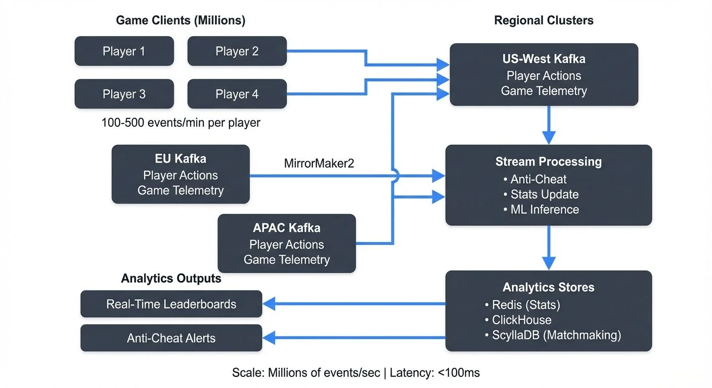

Modern gaming platforms generate enormous volumes of data every second. From player movements and combat actions to in-game purchases and social interactions, these events must be captured, processed, and analyzed in real-time to deliver competitive, engaging experiences. Unlike traditional batch analytics that process data hours or days later, real-time gaming analytics requires streaming architectures capable of handling millions of events per second with sub-second latency.

<!-- ORIGINAL_DIAGRAM
```
┌────────── Real-Time Gaming Analytics Architecture ──────────┐
│                                                              │
│  Game Clients (Millions)    Regional Clusters               │
│  ┌──────┐  ┌──────┐         ┌──────────────────┐           │
│  │Player│  │Player│         │ US-West Kafka    │           │
│  │ 1    │  │ 2    │────────▶│ Player Actions   │           │
│  └──────┘  └──────┘         │ Game Telemetry   │           │
│  ┌──────┐  ┌──────┐         └──────────────────┘           │
│  │Player│  │Player│                  │                      │
│  │ 3    │  │ 4    │──────┐           ▼                      │
│  └──────┘  └──────┘      │  ┌────────────────┐             │
│                          │  │ Stream          │             │
│  100-500 events/min      └─▶│ Processing      │             │
│  per player                 │ • Anti-Cheat    │             │
│                             │ • Stats Update  │             │
│  ┌──────────────────┐       │ • ML Inference  │             │
│  │ EU Kafka         │       └────────────────┘             │
│  │ Player Actions   │◀───MirrorMaker2───┐                  │
│  │ Game Telemetry   │                   │                  │
│  └──────────────────┘       ┌────────────────┐             │
│          │                  │ APAC Kafka     │             │
│          └──────────────────│ Player Actions │             │
│                             │ Game Telemetry │             │
│                             └────────────────┘             │
│                                      │                      │
│  Analytics Outputs                   ▼                      │
│  ┌──────────────┐          ┌──────────────────┐            │
│  │ Real-Time    │◀─────────│ Analytics Stores │            │
│  │ Leaderboards │          │ • Redis (Stats)  │            │
│  └──────────────┘          │ • ClickHouse     │            │
│  ┌──────────────┐          │ • ScyllaDB       │            │
│  │ Anti-Cheat   │◀─────────│ (Matchmaking)    │            │
│  │ Alerts       │          └──────────────────┘            │
│  └──────────────┘                                           │
│                                                             │
│  Scale: Millions of events/sec | Latency: <100ms          │
└─────────────────────────────────────────────────────────────┘
```
-->

For example, when a player fires a weapon in a multiplayer shooter, that action generates an event containing the player's ID, weapon type, target, position, and timestamp. This event must be processed immediately to update kill/death statistics, detect potential cheating (impossible accuracy or reaction times), and adjust matchmaking rankings - all within milliseconds.

This article explores how [streaming data platforms](https://conduktor.io/glossary/what-is-real-time-data-streaming) like Apache Kafka and Apache Flink enable real-time analytics in gaming, the technical challenges involved, and the architectural patterns that make it possible.

## Understanding Gaming Analytics in Real-Time

Gaming analytics encompasses the collection and analysis of all player interactions and system telemetry within a game. This includes player behavior (kills, deaths, movement patterns), game state changes (level completions, achievements), technical metrics (latency, frame rate), and business events (purchases, ad impressions).

The real-time aspect is critical because many gaming use cases cannot tolerate delays. Anti-cheat systems must detect suspicious patterns within seconds to prevent damage. Matchmaking algorithms need current player skill ratings to create balanced matches. Live operations teams require instant visibility into server issues affecting thousands of concurrent players.

Traditional analytics approaches that batch process data every hour or day are inadequate for these requirements. Streaming architectures that process events as they occur have become the standard for modern gaming platforms.

## The Event Landscape: What Data Gaming Systems Generate

A typical multiplayer game generates diverse event types across multiple dimensions:

**Player Actions**: Every button press, movement, ability use, and combat interaction generates an event. A single player in a fast-paced shooter might generate 100-500 events per minute during active gameplay. To put this in perspective: a popular game with 1 million concurrent players could generate 1.7 million to 8.3 million events per minute (28,000-139,000 events per second) from player actions alone.

**Game State Events**: Level completions, quest progress, achievement unlocks, and inventory changes represent higher-level game state. These events are less frequent but carry important context about player progression and engagement.

**Social and Economic Events**: Friend requests, chat messages, clan activities, marketplace transactions, and in-game purchases form a critical data stream for community management and monetization analytics.

**System Telemetry**: Server performance metrics, network latency measurements, client frame rates, and error logs provide operational visibility. This technical telemetry is essential for maintaining service quality.

Each event type requires different processing logic, retention policies, and latency requirements. A streaming architecture must handle this heterogeneity while maintaining order guarantees and [exactly-once processing](https://conduktor.io/glossary/exactly-once-semantics-in-kafka) semantics where required.

Here's an example of a player action event schema using Avro format:

```json
{
  "type": "record",
  "name": "PlayerAction",
  "namespace": "com.game.events",
  "fields": [
    {"name": "event_id", "type": "string"},
    {"name": "timestamp", "type": "long", "logicalType": "timestamp-millis"},
    {"name": "player_id", "type": "string"},
    {"name": "session_id", "type": "string"},
    {"name": "action_type", "type": {"type": "enum", "name": "ActionType",
      "symbols": ["MOVE", "SHOOT", "USE_ABILITY", "RELOAD", "INTERACT"]}},
    {"name": "position", "type": {"type": "record", "name": "Position",
      "fields": [
        {"name": "x", "type": "float"},
        {"name": "y", "type": "float"},
        {"name": "z", "type": "float"}
      ]}},
    {"name": "target_id", "type": ["null", "string"], "default": null},
    {"name": "metadata", "type": {"type": "map", "values": "string"}},
    {"name": "schema_version", "type": "string", "default": "1.0"}
  ]
}
```

This schema provides type safety, enables schema evolution, and includes metadata for tracking schema versions as game features change over time.

## Streaming Architecture for Gaming Analytics

Apache Kafka has become the backbone of gaming analytics pipelines due to its ability to handle high-throughput event ingestion, durable storage, and exactly-once processing semantics. Modern deployments (2025) use [KRaft mode](https://conduktor.io/glossary/understanding-kraft-mode-in-kafka), which eliminates the ZooKeeper dependency and reduces operational complexity while improving scalability to millions of partitions.

Game servers and clients publish events to Kafka topics, partitioned by player ID or game session to maintain ordering within a player's event stream. This partitioning strategy ensures that all events for a given player are processed in sequence, which is critical for game state reconstruction and detecting temporal patterns.

A typical architecture includes several layers:

**Ingestion Layer**: Game servers write events to Kafka topics through high-performance producers configured with idempotent writes and transactional guarantees. Events are typically serialized using [Avro, Protocol Buffers, or JSON Schema](https://conduktor.io/glossary/avro-vs-protobuf-vs-json-schema) to ensure [schema evolution](https://conduktor.io/glossary/schema-evolution-best-practices) compatibility as game features change. [Schema Registry](https://conduktor.io/glossary/schema-registry-and-schema-management) validates all events against registered schemas before they enter the pipeline, preventing malformed data from corrupting downstream analytics.

```java
// Example: Publishing player action events with idempotent producer
Properties props = new Properties();
props.put("bootstrap.servers", "kafka-cluster:9092");
props.put("key.serializer", "org.apache.kafka.common.serialization.StringSerializer");
props.put("value.serializer", "io.confluent.kafka.serializers.KafkaAvroSerializer");
props.put("schema.registry.url", "http://schema-registry:8081");
props.put("enable.idempotence", "true"); // Exactly-once semantics
props.put("acks", "all");
props.put("compression.type", "lz4");

KafkaProducer<String, PlayerAction> producer = new KafkaProducer<>(props);

PlayerAction action = PlayerAction.newBuilder()
    .setEventId(UUID.randomUUID().toString())
    .setTimestamp(System.currentTimeMillis())
    .setPlayerId(playerId)
    .setSessionId(sessionId)
    .setActionType(ActionType.SHOOT)
    .setPosition(new Position(x, y, z))
    .build();

ProducerRecord<String, PlayerAction> record =
    new ProducerRecord<>("player-actions", playerId, action);

producer.send(record, (metadata, exception) -> {
    if (exception != null) {
        logger.error("Failed to publish event", exception);
    }
});
```

**Processing Layer**: [Apache Flink](https://conduktor.io/glossary/what-is-apache-flink-stateful-stream-processing) and Kafka Streams applications consume events from Kafka topics and perform stateful computations. This might include calculating player statistics, detecting anomalous behavior patterns, or aggregating metrics across game sessions.

Modern gaming platforms (2025) increasingly use Flink SQL for ad-hoc analytics queries, enabling analysts to query streaming data using familiar SQL syntax. For example, calculating real-time player engagement metrics:

```sql
-- Flink SQL: Real-time player engagement metrics
SELECT
    window_start,
    COUNT(DISTINCT player_id) as active_players,
    COUNT(*) as total_actions,
    AVG(session_duration_ms) as avg_session_duration
FROM TABLE(
    TUMBLE(TABLE player_actions, DESCRIPTOR(event_time), INTERVAL '5' MINUTES)
)
GROUP BY window_start;
```

Kafka Streams provides lightweight [stateful processing](https://conduktor.io/glossary/state-stores-in-kafka-streams) for scenarios requiring embedded stream processing within game services:

```java
// Kafka Streams: Real-time player statistics
StreamsBuilder builder = new StreamsBuilder();
KStream<String, PlayerAction> actions = builder.stream("player-actions");

KTable<String, PlayerStats> playerStats = actions
    .groupByKey()
    .aggregate(
        PlayerStats::new,
        (playerId, action, stats) -> stats.update(action),
        Materialized.<String, PlayerStats, KeyValueStore<Bytes, byte[]>>as("player-stats-store")
            .withKeySerde(Serdes.String())
            .withValueSerde(new JsonSerde<>(PlayerStats.class))
    );

// Expose stats via interactive queries for low-latency lookups
ReadOnlyKeyValueStore<String, PlayerStats> store =
    streams.store(StoreQueryParameters.fromNameAndType("player-stats-store", QueryableStoreTypes.keyValueStore()));
```

**Storage Layer**: Processed results flow to multiple destinations based on use case. Time-series databases (InfluxDB, TimescaleDB) store metrics for real-time dashboards. Analytical databases (ClickHouse, DuckDB) receive aggregated statistics for business intelligence. Low-latency data stores (Redis, ScyllaDB) cache current player states for matchmaking or personalization systems.

The streaming platform serves as the central nervous system, ensuring events flow reliably from source to destination while enabling multiple consumers to process the same event stream for different purposes.

## Key Use Cases: From Anti-Cheat to Player Engagement

Real-time streaming analytics enables several critical gaming use cases:

**Anti-Cheat Detection**: Modern anti-cheat systems (2025) combine rule-based pattern detection with machine learning models to identify cheating in real-time. Streaming processors analyze player behavior patterns using Complex Event Processing (CEP) and ML inference.

For example, a Flink CEP pattern might detect impossible player movements (teleportation), while an ML model evaluates behavioral features extracted from the event stream:

```java
// Flink CEP: Detect impossible player movements
Pattern<PlayerAction, ?> teleportPattern = Pattern.<PlayerAction>begin("start")
    .where(new SimpleCondition<PlayerAction>() {
        @Override
        public boolean filter(PlayerAction action) {
            return action.getActionType() == ActionType.MOVE;
        }
    })
    .next("end")
    .where(new SimpleCondition<PlayerAction>() {
        @Override
        public boolean filter(PlayerAction action) {
            return action.getActionType() == ActionType.MOVE;
        }
    })
    .within(Time.milliseconds(100));

DataStream<Alert> alerts = CEP.pattern(playerActions, teleportPattern)
    .select((PatternSelectFunction<PlayerAction, Alert>) pattern -> {
        PlayerAction start = pattern.get("start").get(0);
        PlayerAction end = pattern.get("end").get(0);
        double distance = calculateDistance(start.getPosition(), end.getPosition());
        double timeDelta = end.getTimestamp() - start.getTimestamp();
        double speed = distance / (timeDelta / 1000.0); // meters per second

        if (speed > MAX_PLAYER_SPEED) {
            return new Alert(start.getPlayerId(), "TELEPORT_DETECTED", speed);
        }
        return null;
    });
```

For ML-based detection, features like headshot percentage, reaction time, aiming patterns, and movement consistency are extracted in real-time and fed to lightweight models (XGBoost, ONNX) deployed within Flink jobs for [real-time ML inference](https://conduktor.io/glossary/real-time-ml-inference-with-streaming-data):

```java
// Real-time ML inference for cheat detection
DataStream<CheatScore> cheatScores = playerActions
    .keyBy(PlayerAction::getPlayerId)
    .window(TumblingEventTimeWindows.of(Time.minutes(5)))
    .process(new ProcessWindowFunction<PlayerAction, CheatScore, String, TimeWindow>() {
        private transient Model onnxModel;

        @Override
        public void open(Configuration parameters) {
            // Load ONNX model for inference
            onnxModel = loadONNXModel("cheat-detection-v2.onnx");
        }

        @Override
        public void process(String playerId, Context context,
                          Iterable<PlayerAction> actions,
                          Collector<CheatScore> out) {
            // Extract features from action window
            FeatureVector features = extractFeatures(actions);

            // Run ML inference
            double cheatProbability = onnxModel.predict(features);

            if (cheatProbability > 0.85) {
                out.collect(new CheatScore(playerId, cheatProbability,
                    context.window().getEnd(), features));
            }
        }
    });
```

This dual approach (rule-based CEP + ML models) provides both immediate detection of obvious cheats and sophisticated detection of subtle behavioral anomalies. When a player's cheat score exceeds the threshold, the system can trigger automatic actions (shadow banning, forced logout) or flag for human review, all within seconds of detecting the suspicious behavior.

**Dynamic Matchmaking**: Modern matchmaking systems consider real-time player skill ratings, latency, and queue wait times. Streaming processors continuously update player rankings based on recent match results, ensuring the matchmaking algorithm uses fresh data to create balanced teams.

**Live Operations and Monetization**: Game developers run limited-time events and sales that require real-time tracking of player participation and spending. Streaming analytics power dashboards showing event engagement as it happens, enabling teams to adjust parameters or extend promotions based on live data.

**Player Retention and Engagement**: By analyzing play patterns in real-time, games can trigger personalized interventions. If a new player shows signs of frustration (repeated deaths, declining session length), the system might offer helpful tips or easier content to improve retention.

## Technical Challenges at Gaming Scale

Gaming analytics at scale presents unique technical challenges:

**Volume and Velocity**: Popular games serve millions of concurrent players across global regions. This translates to billions of events per day, with peak loads reaching millions of events per second during new releases or special events.

**Latency Requirements**: Many use cases require sub-second processing. Anti-cheat systems must act quickly. Real-time leaderboards need instant updates. This demands careful tuning of streaming processors, including proper parallelization, state management, and checkpoint intervals.

**Global Distribution**: Players connect from worldwide locations, requiring data pipelines that span multiple regions while respecting data sovereignty regulations. Modern gaming platforms deploy active-active Kafka clusters across regions using MirrorMaker 2 (MM2) for bi-directional replication.

For GDPR compliance, player data can be geo-partitioned by region, ensuring European player data remains in EU data centers:

```properties
# MirrorMaker 2 configuration for cross-region replication
clusters = us-west, eu-central, asia-pacific

us-west.bootstrap.servers = kafka-us.example.com:9092
eu-central.bootstrap.servers = kafka-eu.example.com:9092
asia-pacific.bootstrap.servers = kafka-apac.example.com:9092

# Replicate player events across regions
us-west->eu-central.enabled = true
us-west->eu-central.topics = player-actions-global, game-telemetry
us-west->eu-central.replication.factor = 3

# GDPR-protected topics stay regional
eu-central->us-west.topics.exclude = player-pii-.*
```

Players are automatically routed to their nearest regional cluster, minimizing latency while maintaining data sovereignty. Analytics jobs aggregate data from regional clusters for global insights.

**Schema Evolution**: Games constantly evolve with new features, requiring flexible event schemas that can accommodate changes without breaking existing consumers. Schema Registry enforces compatibility rules (FORWARD, BACKWARD, or FULL compatibility) to ensure safe schema evolution.

For example, adding a new optional field to the PlayerAction schema:

```json
{
  "type": "record",
  "name": "PlayerAction",
  "namespace": "com.game.events",
  "fields": [
    {"name": "event_id", "type": "string"},
    {"name": "timestamp", "type": "long"},
    {"name": "player_id", "type": "string"},
    {"name": "action_type", "type": "string"},
    {"name": "position", "type": "Position"},
    {"name": "weapon_id", "type": ["null", "string"], "default": null},
    {"name": "new_field_2025", "type": ["null", "string"], "default": null}
  ]
}
```

Schema Registry validates that this change is backward compatible (old consumers can still read new events by ignoring the new field) before allowing deployment. This prevents breaking production analytics pipelines when game features are added.

**State Management**: Stateful processing at scale requires careful consideration. A player statistics aggregator maintaining state for millions of players must handle state size, recovery times, and consistent snapshots.

## Implementation Patterns and Best Practices

Successful gaming analytics implementations follow several key patterns:

**Event Schema Design**: Use structured formats with explicit schemas. Include event metadata like timestamp, version, and player ID in every event. Partition events by player ID to maintain ordering of a player's action sequence.

**Stateful Stream Processing**: Leverage Flink's managed state for aggregations and pattern detection. For example, maintaining a [tumbling window](https://conduktor.io/glossary/windowing-in-apache-flink-tumbling-sliding-and-session-windows) of the last 100 player actions enables detection of suspicious patterns without reprocessing historical data. [Session windows](https://conduktor.io/glossary/session-windows-in-stream-processing) are particularly useful for analyzing player behavior within game sessions that have variable lengths.

**Exactly-Once Semantics**: For critical analytics like purchase tracking or achievement awards, configure exactly-once processing to prevent duplicate counting or missed events.

**Monitoring and Observability**: Instrument streaming pipelines with metrics on throughput, latency, consumer lag, and error rates. Dead letter queues capture problematic events for later analysis without blocking the main pipeline.

**Player State Reconstruction**: Gaming platforms must be able to reconstruct complete player state from event logs for debugging, customer support, and regulatory compliance. This requires:

- **Event Compaction Strategies**: Use Kafka's log compaction for player profile topics, ensuring the latest state is always available while maintaining historical changes.

- **Snapshotting**: Periodically snapshot player state to enable fast recovery and historical analysis. Flink's savepoints provide consistent snapshots of stateful computations.

- **GDPR Compliance**: For handling the "right to be forgotten," implement a dual-topic pattern where PII lives in a separate compacted topic that can be tombstoned without losing the rest of the player's anonymized behavioral data:

```java
// Separate PII and behavioral events for GDPR compliance
ProducerRecord<String, PlayerBehavior> behaviorEvent =
    new ProducerRecord<>("player-behavior", playerId, behaviorData);

ProducerRecord<String, PlayerPII> piiEvent =
    new ProducerRecord<>("player-pii-compacted", playerId, piiData);

// On GDPR deletion request, publish tombstone to PII topic
ProducerRecord<String, PlayerPII> deletionRecord =
    new ProducerRecord<>("player-pii-compacted", playerId, null);
```

**Serverless Analytics (2025)**: Modern gaming platforms increasingly use serverless functions (AWS Lambda, Google Cloud Functions) as lightweight Kafka consumers for specific analytics tasks:

```yaml
# Example: Serverless function triggered by Kafka events
functions:
  achievement-processor:
    handler: processAchievement
    events:
      - kafka:
          topic: player-actions
          batchSize: 100
          startingPosition: LATEST
    environment:
      ACHIEVEMENTS_TABLE: player-achievements
      NOTIFICATIONS_TOPIC: player-notifications
```

This pattern enables auto-scaling individual analytics workloads without managing Flink or Kafka Streams clusters, reducing costs for low-throughput use cases.

## Managing Streaming Pipelines in Production

Operating streaming analytics at gaming scale requires robust operational tooling and gaming-specific monitoring strategies. Teams need visibility into topic configurations, consumer lag, schema evolution, data quality, and game-specific metrics.

**Gaming-Specific Monitoring**: Beyond standard Kafka metrics, gaming analytics requires tracking:

- **Player Session Reconstruction**: Monitor the completeness of player event sequences. Missing events can indicate network issues, client crashes, or producer failures. Track the ratio of session-start to session-end events, and alert on gaps in player action sequences.

- **Event Ordering Violations**: Since game state depends on correct event ordering, monitor out-of-order events within partitions. This can indicate clock skew issues or incorrect producer timestamps.

- **Duplicate Event Detection**: Despite exactly-once semantics, monitor for duplicate event IDs. Duplicates can occur due to client retries or network issues, and must be deduplicated to maintain accurate statistics.

- **[Consumer Lag](https://conduktor.io/glossary/consumer-lag-monitoring) by Use Case Priority**: Different consumers have different latency requirements. Anti-cheat systems require near-zero lag, while batch analytics can tolerate hours of lag. Set alerting thresholds based on use case criticality:

```yaml
# Example monitoring thresholds for gaming analytics
consumer_groups:
  anti-cheat-detector:
    max_lag_seconds: 5
    alert_severity: critical

  matchmaking-ranker:
    max_lag_seconds: 30
    alert_severity: high

  player-retention-ml:
    max_lag_seconds: 300
    alert_severity: medium

  daily-analytics:
    max_lag_seconds: 3600
    alert_severity: low
```

**Governance and Management**: Platforms like Conduktor provide centralized management and monitoring capabilities for Kafka clusters, making it easier to track consumer group performance, validate schema changes before deployment, and troubleshoot pipeline issues.

For gaming analytics teams managing dozens or hundreds of Kafka topics across multiple environments (development, staging, production), Conduktor's unified interface provides:

- Real-time consumer lag monitoring with customizable alerts ([Monitoring Guide](https://docs.conduktor.io/guide/monitor-brokers-apps/index))
- Schema Registry integration for safe schema evolution
- Topic configuration management and drift detection ([Topics Guide](https://docs.conduktor.io/guide/manage-kafka/kafka-resources/topics))
- Data quality monitoring and validation rules
- ACL and security policy management for multi-team access

This unified visibility reduces operational overhead and accelerates incident response when game launches or events cause traffic spikes.

## Summary

Real-time gaming analytics has transformed how game developers understand and optimize player experiences. Streaming data platforms like Apache Kafka and Apache Flink provide the foundation for processing millions of player events per second with low latency.

The key requirements include handling diverse event types, maintaining stateful computations across millions of players, and supporting use cases from anti-cheat detection to personalized engagement. While the technical challenges of scale, latency, and global distribution are significant, established architectural patterns and operational best practices make these systems achievable.

As games continue to grow in complexity and player bases expand, streaming analytics will remain essential for delivering competitive, engaging, and profitable gaming experiences.

## Related Concepts

- [Apache Kafka](/apache-kafka) - Distributed streaming platform for gaming event processing
- [What is Apache Flink: Stateful Stream Processing](/what-is-apache-flink-stateful-stream-processing) - Stateful analytics for player behavior and anti-cheat detection
- [Exactly-Once Semantics](/exactly-once-semantics) - Guarantee accurate player statistics and analytics

## Sources and References

1. Apache Kafka Documentation: "Use Cases: Gaming" - Technical overview of Kafka architectures in gaming platforms (https://kafka.apache.org/uses)

2. Apache Flink: "Stream Processing for Real-Time Analytics" - Documentation on stateful stream processing patterns (https://flink.apache.org)

3. Unity Technologies: "Understanding Game Analytics" - Industry perspective on gaming telemetry and player behavior analysis (https://unity.com/solutions/gaming-analytics)

4. AWS Blog: "Building Real-Time Gaming Analytics at Scale" - Architecture patterns for cloud-based gaming analytics (https://aws.amazon.com/blogs/gametech)

5. Riot Games Engineering Blog: "Data Infrastructure at Scale" - Real-world insights from League of Legends' data platform (https://technology.riotgames.com)

6. Conduktor: "Kafka Governance and Management" - Platform for managing and monitoring Kafka infrastructure at scale (https://www.conduktor.io)
