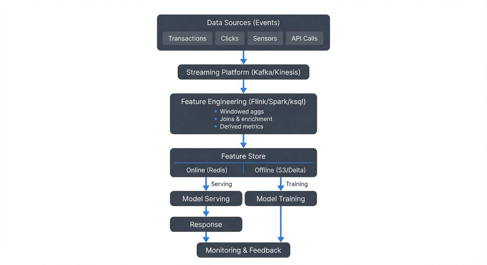
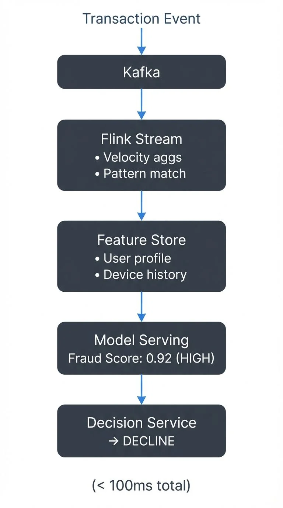
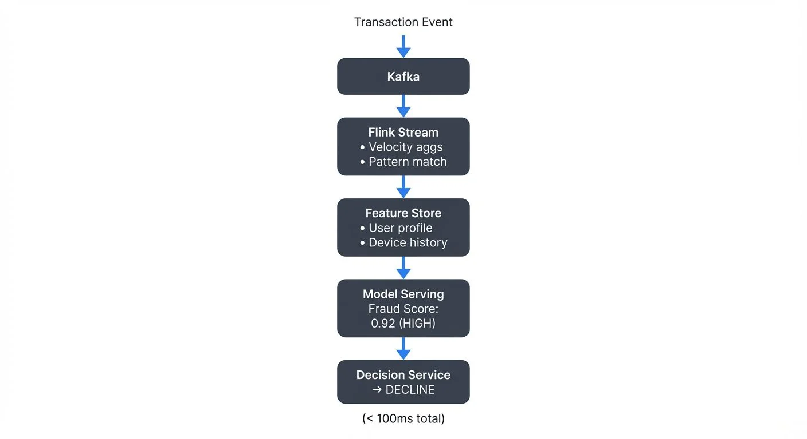

Traditional machine learning systems operate in batch mode: data is collected, processed overnight or periodically, models are trained on historical data, and predictions are generated in large batches. While this approach works for many scenarios, it fundamentally limits how quickly systems can respond to changing conditions.

**Real-time ML pipelines** process streaming data to deliver predictions with millisecond to sub-second latency. Unlike batch systems that might update every 24 hours, real-time ML continuously ingests events, computes features on-the-fly, and serves predictions immediately.

Consider [fraud detection](/real-time-fraud-detection-with-streaming): by the time a batch system identifies suspicious patterns from yesterday's data, fraudulent transactions have already cleared. Real-time ML evaluates each transaction as it occurs, blocking fraud before money moves.

### Real-Time Inference vs Online Learning

It's crucial to distinguish two patterns often conflated under "real-time ML":

- **Real-time inference**: Models trained offline (often in batch) serve predictions on streaming data with low latency
- **Online learning**: Models continuously update their parameters as new data arrives, adapting without full retraining

Most production systems use [real-time inference](/real-time-ml-inference-with-streaming-data) with periodic model updates. True online learning remains challenging due to stability concerns and infrastructure complexity.

---

## Architecture Components

A complete real-time ML pipeline consists of several interconnected layers:

<!-- ORIGINAL_DIAGRAM
```
           Real-Time ML Pipeline Architecture

┌──────────────────────────────────────────────────┐
│         Data Sources (Events)                    │
│  Transactions │ Clicks │ Sensors │ API Calls    │
└────────────────┬─────────────────────────────────┘
                 │
                 ▼
      ┌──────────────────────┐
      │  Streaming Platform  │
      │   (Kafka/Kinesis)    │
      └──────────┬───────────┘
                 │
                 ▼
      ┌──────────────────────┐
      │ Feature Engineering  │
      │  (Flink/Spark/ksql)  │
      │ • Windowed aggs      │
      │ • Joins & enrichment │
      │ • Derived metrics    │
      └──────────┬───────────┘
                 │
                 ▼
      ┌──────────────────────┐
      │   Feature Store      │
      ├──────────────────────┤
      │ Online  │  Offline   │
      │ (Redis) │ (S3/Delta) │
      └────┬─────┴──────┬────┘
           │            │
    Serving│            │Training
           ▼            ▼
      ┌─────────┐  ┌─────────┐
      │  Model  │  │ Model   │
      │ Serving │  │Training │
      └────┬────┘  └────┬────┘
           │            │
           ▼            │
      ┌─────────┐       │
      │Response │       │
      └─────────┘       │
           │            │
           └────┬───────┘
                ▼
         ┌──────────────┐
         │  Monitoring  │
         │ & Feedback   │
         └──────────────┘
```
-->

### Feature Engineering Layer

Raw events from Kafka, Kinesis, or other [streaming platforms](/what-is-real-time-data-streaming) rarely match the feature vectors models expect. The feature engineering layer transforms streaming events into ML-ready features through:

- **Windowed aggregations**: "user's transaction count in last 1 hour"
- **Joins**: enriching events with user profiles, product catalogs (see [stream joins and enrichment patterns](/stream-joins-and-enrichment-patterns))
- **Derived metrics**: ratios, percentiles, z-scores computed in real-time

[Apache Flink](/what-is-apache-flink-stateful-stream-processing), Spark Structured Streaming, and Kafka Streams excel at these transformations, maintaining stateful computations across event streams.

### Feature Stores

[Feature stores](/feature-stores-for-machine-learning) solve the dual-access pattern problem: training needs historical features (batch access), while serving requires latest features (real-time lookup).

**Offline store**: Batch-accessible feature history for training (often Parquet/Delta Lake/Iceberg on S3)
**Online store**: Low-latency key-value lookups for serving (Redis, DynamoDB, Cassandra, ScyllaDB)

Streaming feature pipelines write to both stores, ensuring training-serving consistency. Tools like Feast, Tecton, Databricks Feature Store, Hopsworks, and Feathr orchestrate this dual-write pattern.

**Modern feature store ecosystem (2025)**:
- **Feast 0.38+**: Most popular open-source option with improved streaming support and performance
- **Hopsworks**: Enterprise feature store with built-in feature monitoring and versioning
- **Feathr**: LinkedIn's open-source feature store optimized for large-scale feature engineering
- **Tecton**: Managed feature platform with advanced real-time capabilities

### Model Serving Infrastructure

Once features are ready, models must generate predictions within strict latency budgets. Serving patterns include:

- **REST/gRPC endpoints**: Synchronous request-response (TensorFlow Serving, Seldon)
- **Stream processing**: Predictions written to output topics (embedded models in Flink/Kafka Streams)
- **Sidecar containers**: Models deployed alongside application services

### Feedback Loops

Real-time ML systems must capture prediction outcomes to detect [model drift](/model-drift-in-streaming) and retrain:
 and retrain](images/diagrams/real-time-ml-pipelines-1.webp)
<!-- ORIGINAL_DIAGRAM
```
Event → Features → Prediction → Action → Outcome → Training Data
                       ↓
                  Monitoring
```
-->

Outcomes (was the prediction correct?) feed back into training pipelines, creating continuous improvement cycles. See [data drift in streaming](/data-drift-in-streaming) for detection strategies.

---

## Real-Time Feature Engineering

Feature engineering accounts for 70-80% of real-time ML pipeline complexity. Streaming frameworks provide primitives for common patterns:

### Windowed Aggregations

Time windows aggregate streaming events into features. Window types include:
- **Tumbling**: Fixed, non-overlapping intervals (e.g., 1-hour buckets: 1pm-2pm, 2pm-3pm). Use for daily summaries, hourly statistics. Example: "total transactions per hour."
- **Sliding**: Overlapping intervals (e.g., last 1 hour, updated every 5 minutes). Use for moving averages, recent trends. Example: "average purchase amount in last 60 minutes, updated continuously."
- **Session**: Dynamic windows based on activity gaps (e.g., group clicks separated by < 30 minutes). Use for user sessions, activity bursts. Example: "session duration" for recommendation features.

### Sessionization

User sessions (sequences of activity separated by inactivity) are powerful features that capture user intent and engagement patterns critical for recommendations and personalization.

### Feature Freshness Guarantees

Real-time features have expiration semantics. A "user's 1-hour transaction count" computed at 2:00 PM becomes stale by 3:01 PM.

Feature stores track feature **freshness**:
- **Timestamp**: When the feature was computed
- **TTL**: How long the feature remains valid
- **Watermarks**: Latest event time processed

Serving layers must handle feature staleness, either by rejecting predictions or falling back to older feature versions.

### Preventing Training-Serving Skew

**Training-serving skew** occurs when features computed differently in training vs serving:

- Training uses Spark batch aggregations
- Serving uses Flink streaming aggregations
- Subtle logic differences cause distribution shift

This is one of the most critical challenges in production ML. [Feature stores](/feature-stores-for-machine-learning) are specifically designed to prevent this issue.

**Prevention strategies**:
1. **Single codebase**: Same transformation logic for batch and streaming
2. **Backfill validation**: Run streaming pipeline on historical data, compare to batch features
3. **Feature store contracts**: [Schema enforcement](/schema-registry-and-schema-management) ensures consistent feature definitions

---

## Model Serving Patterns

### Embedded Models

Models run inside stream processing applications (Flink, Kafka Streams).

**Pros**: No network latency, batch predictions
**Cons**: Tight coupling, difficult to update models independently

### Sidecar Pattern

Models deploy as sidecar containers alongside application pods.

**Pros**: Language independence, separate scaling
**Cons**: Local communication overhead, resource contention

### Dedicated Model Servers

Centralized serving infrastructure (TensorFlow Serving, Seldon Core, KServe, Ray Serve).

**Pros**: Independent scaling, specialized hardware (GPUs), A/B testing, model versioning
**Cons**: Network latency, additional infrastructure

**2025 Ecosystem**:
- **KServe** (formerly KFServe): The industry standard for Kubernetes-native model serving with autoscaling, canary deployments, and multi-framework support
- **Ray Serve**: Scalable model serving built on Ray, excellent for complex inference workflows and distributed Python applications
- **BentoML**: Framework-agnostic model serving with built-in monitoring and adaptive batching

### Latency and Throughput Trade-offs

| Pattern | Latency (p99) | Throughput | Use Case |
|---------|---------------|------------|----------|
| Embedded | <5ms | 100K+ req/s | Ultra-low latency |
| Sidecar | 5-20ms | 50K req/s | Moderate latency |
| Dedicated | 20-100ms | 10K+ req/s | Complex models, GPUs |

Choose based on your latency SLA and model complexity.

---

## Online Learning vs Real-Time Inference

### Real-Time Inference (Common)

Models trained offline periodically, served in real-time:

1. Collect data in feature store (continuous)
2. Train model on historical data (daily/weekly)
3. Deploy new model version
4. Serve predictions on streaming data

**Advantages**: Stable models, rigorous validation, mature tooling

### Online Learning (Advanced)

Models update continuously as data arrives through incremental learning, a technique where the model updates its parameters with each new batch of data without full retraining. For example, an online linear regression model can update its coefficients after seeing each new data point, adapting to changing patterns in real-time.

**Modern online learning frameworks (2025)**:
- **River**: Python library designed specifically for online machine learning, supporting incremental versions of popular algorithms (linear models, trees, neural networks)
- **Vowpal Wabbit**: High-performance online learning system for large-scale applications
- **PyTorch Lightning with streaming datasets**: Enables continuous model updates with proper checkpointing

**Challenges**:
- **Catastrophic forgetting**: New data erases old knowledge. Example: A recommendation model trained on summer fashion trends may "forget" winter preferences when fall data arrives. Solutions include experience replay (storing representative samples from past data) and regularization techniques.
- **Concept drift detection**: When to trust new patterns vs ignore noise. If your fraud model suddenly sees unusual transaction patterns, is this emerging fraud or a temporary anomaly? Statistical tests (KS test, drift scores) help distinguish signal from noise.
- **Validation**: How to evaluate continuously updating models. Traditional holdout sets become stale. Approaches include prequential evaluation (test-then-train on each sample) and time-based validation windows.

**Use cases**: Ad click prediction, content ranking where patterns shift rapidly, real-time recommendations, dynamic pricing

### A/B Testing and Shadow Deployment

Before fully deploying new models:

**Shadow mode**: New model scores traffic but doesn't serve predictions. Both models run in parallel, but only the primary model's predictions are used. This allows comparison before switching. Track metrics like prediction distribution, latency, and feature importance differences. If shadow model predictions differ significantly (e.g., fraud scores vary by >10%), investigate before promotion.

**A/B testing**: Split traffic between model versions, typically starting with a small percentage for the new model (5-10%) and gradually increasing based on performance metrics. Monitor business KPIs (conversion rate, fraud catch rate) and technical metrics (latency, error rate). Example: Route 10% of users to new recommendation model for 7 days, compare click-through rate against control group before full rollout.

---

## Production Considerations

### Latency Requirements

Real-time ML systems must meet strict SLAs:

- **p50 latency**: Typical case performance
- **p99 latency**: 99th percentile, catches tail latencies
- **p999 latency**: Extreme cases, often determines user experience

Example targets:
- Fraud detection: p99 < 50ms
- Recommendations: p99 < 200ms
- Search ranking: p99 < 100ms

**Latency budget breakdown**:

<!-- ORIGINAL_DIAGRAM
```
Total: 50ms (p99)
├─ Feature lookup: 10ms
├─ Feature computation: 15ms
├─ Model inference: 20ms
└─ Overhead: 5ms
```
-->

Instrument each component to identify bottlenecks.

### Feature Quality Monitoring

Features can degrade silently:

- **Upstream data quality**: Source events missing fields, [schema changes](/schema-evolution-best-practices)
- **Computation errors**: Window aggregations incorrect due to late data
- **Staleness**: Feature updates delayed due to infrastructure issues

**Monitoring strategies**: Validate feature ranges, check for null values, track staleness, and log feature distributions to alert on drift from expected ranges. See [building a data quality framework](/building-a-data-quality-framework) for comprehensive quality strategies.

### Model Lineage and Auditing

In regulated industries (finance, healthcare), you must explain predictions:

**Model lineage** tracks:
- Training data version and time range
- Feature definitions and versions
- Hyperparameters and training code commit
- Evaluation metrics pre-deployment

**Prediction auditing** logs:
- Input features used
- Model version that generated prediction
- Prediction value and confidence
- Outcome (if available)

This enables reproducing predictions and diagnosing errors months later.

### Data Governance for ML Pipelines

As real-time ML systems scale, data governance becomes critical. **Conduktor** provides comprehensive governance capabilities specifically designed for streaming ML pipelines:

- **Schema validation**: Ensure streaming events match feature expectations before they enter ML pipelines. Conduktor's [Schema Registry integration](https://docs.conduktor.io/guide/manage-kafka/kafka-resources/schema-registry) prevents malformed events from corrupting feature computations.
- **Data quality gates**: Block corrupt data before it reaches feature pipelines through Conduktor's [data quality module](https://docs.conduktor.io/guide/use-cases/observe-data-quality), which validates ranges, patterns, and business rules on streaming data.
- **Lineage tracking**: Trace features from source events through transformations with Conduktor's data lineage visualization, critical for debugging ML pipeline issues.
- **Access controls**: Restrict who can modify feature definitions or deploy models through [topic-level ACLs](https://docs.conduktor.io/guide/manage-kafka/kafka-resources/topics) and governance policies.
- **Audit logs**: Track all changes to feature pipelines and model deployments, essential for regulated industries.

For example, Conduktor can enforce that all events in the `transactions` topic include required fields (`user_id`, `amount`, `timestamp`) with valid data types and ranges before feature engineering begins, preventing silent failures in downstream ML pipelines. This governance layer acts as quality gates between data producers and ML consumers.

---

## Use Cases and Implementation

### Fraud Detection Systems

**Real-time requirements**: Evaluate transactions before authorization (50-100ms)

For comprehensive coverage, see [real-time fraud detection with streaming](/real-time-fraud-detection-with-streaming).

<!-- ORIGINAL_DIAGRAM
```
      Fraud Detection Real-Time Pipeline

Transaction Event
      │
      ▼
┌──────────────┐
│    Kafka     │
└──────┬───────┘
       │
       ▼
┌──────────────────┐
│  Flink Stream    │
│  • Velocity aggs │
│  • Pattern match │
└──────┬───────────┘
       │
       ▼
┌──────────────────┐
│  Feature Store   │
│  • User profile  │
│  • Device history│
└──────┬───────────┘
       │
       ▼
┌──────────────────┐
│  Model Serving   │
│  Fraud Score:    │
│  0.92 (HIGH)     │
└──────┬───────────┘
       │
       ▼
┌──────────────────┐
│ Decision Service │
│  → DECLINE       │
└──────────────────┘
   (< 100ms total)
```
-->

**Features**:
- Velocity: Transaction count in last 1h/24h/7d
- Behavioral: Distance from user's typical transaction amount/merchant
- Contextual: Device fingerprint, IP geolocation

### Real-Time Recommendations

**Real-time requirements**: Personalize content as users browse (100-300ms)

For detailed implementation patterns, see [building recommendation systems with streaming data](/building-recommendation-systems-with-streaming-data).

**Features**:
- User history: Recently viewed items, categories
- Session context: Current session duration, items viewed
- Popularity: Trending items in last 1h

Recommendations are computed by aggregating session data in real-time, combining it with user profiles, and calling the recommendation model to serve personalized top-K items.

### Dynamic Pricing

**Real-time requirements**: Adjust prices based on demand signals (seconds to minutes)

**Features**:
- Demand indicators: Search volume, cart adds in last 15min
- Supply: Inventory levels, competitor pricing
- External: Time of day, seasonality, events

Pricing models consume demand signals (search volume, cart adds) and supply signals (inventory, competitor prices) to compute optimal prices in real-time, publishing updates back to the application database.

### Infrastructure Stack

Typical real-time ML infrastructure:

**Data Layer**:
- **Streaming**: [Apache Kafka](/apache-kafka) (4.0+ with [KRaft](/understanding-kraft-mode-in-kafka)), Amazon Kinesis, Redpanda
- **Processing**: [Apache Flink](/what-is-apache-flink-stateful-stream-processing) (1.18+), Spark Structured Streaming (3.5+), Kafka Streams
- **Storage**: S3/Delta Lake/[Apache Iceberg](/apache-iceberg) (offline), Redis/DynamoDB/ScyllaDB (online)

**ML Layer**:
- **Feature Store**: Feast (0.38+), Hopsworks, Feathr, Databricks Feature Store
- **Training**: Spark MLlib, scikit-learn, TensorFlow/PyTorch, XGBoost
- **Serving**: KServe, Ray Serve, TensorFlow Serving, Seldon Core, BentoML
- **Online Learning**: River, Vowpal Wabbit, PyTorch Lightning

**Orchestration & MLOps (2025)**:
- **ML Orchestration**: Flyte, Metaflow, Hamilton (declarative dataflow)
- **Distributed Compute**: Ray (distributed Python), Dask
- **Experiment Tracking**: MLflow 2.x, Weights & Biases, Neptune
- **Model Registry**: MLflow Model Registry, BentoML

**Observability**:
- **Metrics**: Prometheus, Datadog, Grafana
- **Tracing**: Jaeger, OpenTelemetry, Zipkin
- **Logging**: ELK Stack, Grafana Loki
- **ML Monitoring**: Evidently AI, WhyLabs, NannyML

**Governance & Quality**:
- **Platform Governance**: Conduktor (streaming data governance, quality gates, lineage) - [manage Kafka resources](https://docs.conduktor.io/guide/manage-kafka/kafka-resources/topics) and [enforce data quality](https://docs.conduktor.io/guide/use-cases/observe-data-quality)
- **Data Quality**: [Great Expectations](/great-expectations-data-testing-framework), Soda Core, dbt tests
- **Feature Monitoring**: Built into modern feature stores (drift detection, staleness tracking)

---

## Conclusion

Real-time ML pipelines enable applications to react to events as they occur, powering fraud detection, personalization, and dynamic optimization. Success requires careful architecture across feature engineering, model serving, and feedback loops.

Key takeaways:

1. **Distinguish real-time inference from online learning** - most systems use the former
2. **Feature stores bridge batch training and real-time serving** - preventing training-serving skew
3. **Feature engineering dominates complexity** - invest in robust streaming transformations
4. **Choose serving patterns based on latency SLA** - embedded, sidecar, or dedicated servers
5. **Production requires comprehensive monitoring** - feature quality, model performance, and governance

As ML systems increasingly operate on streaming data, mastering real-time pipelines becomes essential for competitive, responsive applications. Start simple with real-time inference on periodically trained models, then evolve toward more sophisticated online learning as requirements and expertise grow.

The future of ML is real-time, building the infrastructure to support it is one of the most impactful investments in modern data systems.

**Related Articles**:
- [Real-Time ML Inference with Streaming Data](/real-time-ml-inference-with-streaming-data) - Deep dive into inference patterns
- [Feature Stores for Machine Learning](/feature-stores-for-machine-learning) - Comprehensive guide to feature management
- [Model Drift in Streaming](/model-drift-in-streaming) - Detection and remediation strategies
- [Data Drift in Streaming](/data-drift-in-streaming) - Managing data quality in ML pipelines
- [Real-Time Fraud Detection with Streaming](/real-time-fraud-detection-with-streaming) - Production use case
- [Building Recommendation Systems with Streaming Data](/building-recommendation-systems-with-streaming-data) - Implementation patterns

## Related Concepts

- [Kafka Connect: Building Data Integration Pipelines](/kafka-connect-building-data-integration-pipelines) - Integrate ML feature stores with external data sources
- [Streaming Data Pipeline](/streaming-data-pipeline) - Build end-to-end pipelines for ML feature engineering
- [Real-Time Analytics with Streaming Data](/real-time-analytics-with-streaming-data) - Analytics patterns that complement ML inference

## Sources and References

- [Apache Flink ML Documentation](https://nightlies.apache.org/flink/flink-ml-docs-stable/) - Stream processing for real-time machine learning
- [Feast Feature Store](https://docs.feast.dev/) - Open-source feature store for ML operational architecture
- [TensorFlow Serving](https://www.tensorflow.org/tfx/guide/serving) - Production ML model serving infrastructure
- [MLOps: Continuous Delivery for Machine Learning](https://ml-ops.org/) - Best practices for ML pipeline operations
- [Databricks Feature Store Documentation](https://docs.databricks.com/en/machine-learning/feature-store/) - Unified feature management for batch and streaming
