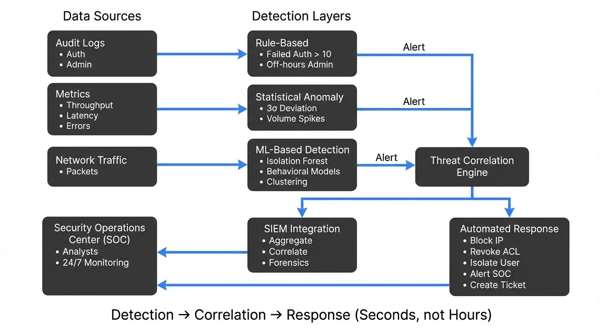

## Introduction

As streaming platforms become the backbone of modern data architectures, they also become prime targets for security threats. Real-time threat detection applies security monitoring and anomaly detection techniques to identify malicious activities as they occur in streaming infrastructure. Unlike traditional batch-based security analysis, real-time threat detection operates on live [data streams](https://conduktor.io/glossary/what-is-real-time-data-streaming), enabling immediate response to security incidents such as unauthorized access, data exfiltration, and denial-of-service attacks.

<!-- ORIGINAL_DIAGRAM
```
┌───────── Real-Time Threat Detection Architecture ──────────┐
│                                                             │
│  Data Sources              Detection Layers                │
│  ┌──────────────┐         ┌─────────────────────┐          │
│  │ Audit Logs   │────────▶│ Rule-Based          │          │
│  │ • Auth       │         │ • Failed Auth > 10  │──Alert──▶│
│  │ • Admin      │         │ • Off-hours Admin   │          │
│  └──────────────┘         └─────────────────────┘          │
│  ┌──────────────┐         ┌─────────────────────┐          │
│  │ Metrics      │────────▶│ Statistical Anomaly │          │
│  │ • Throughput │         │ • 3σ Deviation      │──Alert──▶│
│  │ • Latency    │         │ • Volume Spikes     │          │
│  │ • Errors     │         └─────────────────────┘          │
│  └──────────────┘         ┌─────────────────────┐          │
│  ┌──────────────┐         │ ML-Based Detection  │          │
│  │ Network      │────────▶│ • Isolation Forest  │──Alert──▶│
│  │ Traffic      │         │ • Behavioral Models │          │
│  │ • Packets    │         │ • Clustering        │          │
│  └──────────────┘         └─────────────────────┘          │
│                                     │                       │
│                                     ▼                       │
│  SIEM Integration          ┌─────────────────┐             │
│  ┌────────────────┐        │ Threat          │             │
│  │ Splunk/Elastic │◀───────│ Correlation     │             │
│  │ • Aggregate    │        │ Engine          │             │
│  │ • Correlate    │        └─────────────────┘             │
│  │ • Forensics    │                │                        │
│  └────────────────┘                ▼                        │
│         │              ┌─────────────────────┐              │
│         └─────────────▶│ Automated Response  │              │
│                        │ • Block IP          │              │
│  Security Operations   │ • Revoke ACL        │              │
│  Center (SOC)          │ • Isolate User      │              │
│  ┌────────────────┐    │ • Alert SOC         │              │
│  │ Analysts       │◀───│ • Create Ticket     │              │
│  │ 24/7 Monitoring│    └─────────────────────┘              │
│  └────────────────┘                                         │
│                                                             │
│  Detection → Correlation → Response (Seconds, not Hours)  │
└─────────────────────────────────────────────────────────────┘
```
-->

The challenge lies in balancing detection speed and accuracy while minimizing false positives that can overwhelm security teams. This article explores the approaches, architectures, and best practices for implementing effective threat detection in streaming environments.

## Understanding Threat Types in Streaming Platforms

Streaming platforms face both traditional and streaming-specific security threats:

**Traditional Security Threats:**
- **Unauthorized Access**: Attempts to access topics, consumer groups, or administrative interfaces without proper credentials (see [Access Control](https://conduktor.io/glossary/access-control-for-streaming))
- **Data Exfiltration**: Unauthorized reading or copying of sensitive data from streams
- **DDoS Attacks**: Overwhelming brokers or consumers with excessive requests
- **Injection Attacks**: Malicious payloads injected into streams to exploit downstream consumers

**Streaming-Specific Threats:**
- **Topic Hijacking**: Unauthorized creation, deletion, or modification of topics
- **Consumer Impersonation**: Malicious actors joining consumer groups to intercept data (e.g., an attacker joins the "payment-processor" consumer group to intercept financial transactions)
- **Offset Manipulation**: Resetting consumer offsets to replay messages (to cause duplicate processing) or skip messages (to hide evidence of an attack)
- **Schema Poisoning**: Injecting incompatible schemas to break downstream processing (e.g., changing a schema to make all consumers fail deserialization—see [Schema Evolution Best Practices](https://conduktor.io/glossary/schema-evolution-best-practices))
- **Resource Exhaustion**: Creating excessive partitions or connections to degrade performance (related to [Quotas and Rate Limiting](https://conduktor.io/glossary/quotas-and-rate-limiting-in-kafka))

**2025-Era Cloud and AI Threats:**
- **AI Model Poisoning**: Injecting malicious training data into streaming ML pipelines to compromise model integrity (see [Real-Time ML Pipelines](https://conduktor.io/glossary/real-time-ml-pipelines))
- **API Key Sprawl**: Compromised credentials in client applications that access streaming platforms
- **Supply Chain Attacks**: Malicious or vulnerable Kafka connectors, Stream Processing plugins, or dependencies
- **Cloud IAM Exploitation**: Hijacking service accounts or IAM roles to gain unauthorized access to streaming resources (related to [Zero Trust for Streaming](https://conduktor.io/glossary/zero-trust-for-streaming))
- **SSRF Attacks**: Exploiting connectors or integrations to access internal cloud services

Understanding these threat vectors is essential for designing detection mechanisms that cover the full attack surface.

## Detection Approaches

### Rule-Based Detection

Rule-based detection applies predefined conditions to identify known threat patterns:

```yaml
rules:
  - name: "Excessive Failed Auth Attempts"
    condition: "failed_auth_count > 10 within 1 minute"
    severity: high
    action: block_ip

  - name: "Unusual Topic Access Pattern"
    condition: "topics_accessed > 50 within 5 minutes"
    severity: medium
    action: alert

  - name: "Administrative Action Outside Business Hours"
    condition: "admin_action AND time NOT IN business_hours"
    severity: high
    action: alert_and_require_mfa
```

Rule-based systems excel at detecting known attack patterns with minimal false positives, but struggle with novel or sophisticated threats.

### Statistical Anomaly Detection

Statistical methods establish baselines of normal behavior and flag deviations:

- **Threshold-Based**: Alert when metrics exceed predetermined limits (e.g., throughput > 10x average)
- **Standard Deviation**: Flag events beyond 3σ (3 sigma, meaning 3 standard deviations) from the mean—this captures roughly 99.7% of normal behavior, making outliers highly suspicious
- **Time-Series Analysis**: Detect sudden spikes, drops, or pattern changes in metrics over time (e.g., CPU usage suddenly jumping from 20% to 95%)
- **Rate Limiting**: Track request rates per user, IP, or application to detect brute-force or DoS attacks
- **Probabilistic Data Structures** (2025): Use HyperLogLog for cardinality estimation (counting unique IPs or users) and P² algorithm for streaming percentile calculations without storing all data

Statistical approaches work well for detecting volume-based attacks and unusual access patterns without prior knowledge of specific threats.

### Machine Learning-Based Detection

ML models learn complex patterns from historical data to identify anomalies. Choose supervised learning when you have labeled examples of attacks, or unsupervised learning when you need to discover unknown threats.

**Supervised Learning**: Train classifiers on labeled attack/normal data
- **Random Forests**: Tree-based ensemble models excellent for categorical threat classification (e.g., "Is this login attempt malicious?")
- **Gradient Boosting** (XGBoost, LightGBM): Sequential tree models that achieve high accuracy by learning from previous errors
- **Neural Networks**: Deep learning models that discover complex, non-linear patterns in user behavior

**Unsupervised Learning**: Detect anomalies without labeled data—ideal for discovering zero-day attacks
- **Isolation Forests**: Algorithms that isolate outliers by building random decision trees (anomalies are easier to isolate than normal points)
- **Autoencoders**: Neural networks that learn to compress and reconstruct normal behavior; poor reconstruction indicates anomalies
- **Clustering Algorithms**: Group similar behaviors together
  - **DBSCAN**: Density-based clustering that identifies outliers as points that don't fit any cluster
  - **K-means**: Partitions data into K clusters; points far from cluster centers are suspicious

**Example ML-Based Detection Flow:**

```python
from sklearn.ensemble import IsolationForest
import pandas as pd
from datetime import datetime, timedelta

# Feature extraction for anomaly detection
def extract_features(user_id, events, window_minutes=5):
    """Extract behavioral features from streaming events"""
    now = datetime.now()
    window_start = now - timedelta(minutes=window_minutes)
    recent_events = [e for e in events if e['timestamp'] > window_start]

    features = {
        'auth_failures_1m': sum(1 for e in recent_events
                                if e['type'] == 'auth' and e['result'] == 'failure'),
        'unique_topics_accessed': len(set(e['topic'] for e in recent_events
                                          if e['type'] == 'access')),
        'bytes_read_rate': sum(e['bytes_read'] for e in recent_events) / window_minutes,
        'connection_frequency': sum(1 for e in recent_events if e['type'] == 'connect'),
        'access_time_of_day': now.hour,
        'geographic_anomaly': 1 if is_new_location(user_id, recent_events[0]['ip']) else 0,
        'consumer_group_changes': sum(1 for e in recent_events
                                     if e['type'] in ['group_join', 'group_leave'])
    }
    return features

# Train Isolation Forest model (one-time setup)
historical_data = load_historical_normal_behavior()
model = IsolationForest(contamination=0.01, random_state=42)
model.fit(historical_data)

# Real-time detection
for user_id, events in stream_events():
    features = extract_features(user_id, events)
    feature_vector = pd.DataFrame([features])

    # Predict returns -1 for anomalies, 1 for normal
    anomaly_score = model.predict(feature_vector)[0]

    if anomaly_score == -1:
        trigger_alert(
            user_id=user_id,
            severity='high',
            features=features,
            message=f"Anomalous behavior detected for user {user_id}"
        )
```

ML-based detection excels at identifying sophisticated attacks and zero-day threats but requires careful tuning to minimize false positives.

## Data Sources for Threat Detection

Comprehensive threat detection aggregates multiple data sources:

**Audit Logs** (see [Audit Logging for Streaming Platforms](https://conduktor.io/glossary/audit-logging-for-streaming-platforms)):
- Authentication and authorization events
- Administrative actions (topic creation, ACL changes)
- Configuration modifications
- User activity trails

**Metrics and Monitoring Data** (see [Data Observability](https://conduktor.io/glossary/what-is-data-observability-the-five-pillars)):
- Broker performance metrics (CPU, memory, disk I/O)
- Network traffic patterns (bytes in/out, connection counts)
- Producer and consumer metrics (throughput, latency, errors)
- JMX metrics for internal broker state
- [Consumer lag](https://conduktor.io/glossary/consumer-lag-monitoring) for detecting unusual consumption patterns

**Network Traffic**:
- Packet capture and inspection
- TLS certificate validation
- Protocol-level analysis (Kafka protocol anomalies)
- DNS queries and IP reputation
- **eBPF-based monitoring** (2025): Kernel-level network observability without performance overhead, capturing every connection attempt and data flow

**Application Logs**:
- Client application errors
- [Schema registry](https://conduktor.io/glossary/schema-registry-and-schema-management) access
- Connect worker activities
- [Stream processing](https://conduktor.io/glossary/what-is-apache-flink-stateful-stream-processing) job logs
- **OpenTelemetry traces** (2025): Distributed tracing across producers, brokers, and consumers for end-to-end visibility

Centralizing these diverse sources enables correlation analysis to detect multi-stage attacks.

## SIEM Integration

Security Information and Event Management (SIEM) platforms aggregate, correlate, and analyze security data from multiple sources. Modern SIEM solutions provide real-time threat detection, automated response, and forensic analysis capabilities.

**Splunk Integration** (2025 approach):
```yaml
# Use Kafka Connect with Splunk HTTP Event Collector (HEC)
# connector.properties
name=splunk-security-sink
connector.class=com.splunk.kafka.connect.SplunkSinkConnector
topics=audit-logs,broker-metrics,auth-events
splunk.hec.uri=https://splunk.company.com:8088
splunk.hec.token=${SPLUNK_HEC_TOKEN}
splunk.indexes=kafka_security
splunk.sourcetypes=kafka:audit,kafka:metrics,kafka:auth

# Splunk SPL query for threat detection
index=kafka_security sourcetype=kafka:auth
| stats count as attempts by user, src_ip, result
| where result="FAILURE" AND attempts > 10
| eval threat_level="high"
| sendalert security_team
```

**Elastic SIEM**:
- Use **Elastic Agent** or **Filebeat** with Kafka input to ingest streaming audit logs
- Leverage **Elastic Detection Rules** for known threat patterns (failed auth, privilege escalation)
- Visualize attack timelines and user behavior with **Kibana Security**
- Integrate **Elastic Machine Learning** jobs for behavioral anomaly detection
- Create automated **response actions** (block IP, revoke credentials)

**Cloud-Native SIEM Solutions** (2025):
- **Datadog Security Monitoring**: Ingest Kafka logs via Datadog Agent, leverage cloud-native detection rules
- **AWS Security Hub**: Aggregate findings from GuardDuty, Inspector, and custom Kafka security events
- **Wiz**: Cloud security platform with agentless scanning and real-time threat detection for cloud workloads
- **Orca Security**: Graph-based security platform that maps relationships between streaming infrastructure and threats

**Azure Sentinel**:
- Connect via **Azure Event Hubs** (native Kafka compatibility) or Kafka Connect
- Apply **built-in analytics rules** and **playbooks** for automated response
- Correlate Kafka security events with **Azure AD**, **Defender for Cloud**, and other Azure security signals
- Use **SOAR** (Security Orchestration, Automation, and Response) capabilities for incident workflows

SIEM platforms provide centralized visibility, correlation capabilities, and integration with broader security infrastructure, enabling security teams to detect and respond to threats across the entire streaming ecosystem.

## Alerting and Response Automation

Effective alerting balances timely notification with actionable information:

**Alert Severity Levels**:
- **Critical**: Confirmed attack in progress, immediate action required
- **High**: Strong indicators of malicious activity
- **Medium**: Suspicious behavior requiring investigation
- **Low**: Minor policy violations or potential false positives

**Response Automation**:
```yaml
incident_response:
  - trigger: "unauthorized_topic_access"
    actions:
      - revoke_acl: true
      - isolate_user: true
      - snapshot_logs: true
      - notify: security_team

  - trigger: "ddos_detected"
    actions:
      - enable_rate_limiting: true
      - block_source_ips: true
      - scale_brokers: auto
      - create_incident_ticket: true

  - trigger: "data_exfiltration_suspected"
    actions:
      - terminate_sessions: true
      - freeze_credentials: true
      - initiate_forensics: true
      - escalate: security_operations
```

Automation reduces response time from minutes to milliseconds, critical for containing active threats.

## Behavioral Analysis and Baseline Establishment

Understanding normal behavior is foundational to anomaly detection:

**Baseline Establishment**:
1. **Data Collection**: Gather metrics over representative time periods (weeks to months)
2. **Pattern Identification**: Identify daily, weekly, and seasonal patterns
3. **User Profiling**: Build profiles of typical user behavior (access patterns, volume, timing)
4. **Application Fingerprinting**: Establish normal patterns for each application or service

**Anomaly Detection**:
- **Deviation Analysis**: Compare current behavior against baseline
- **Contextual Analysis**: Consider time of day, day of week, deployment events
- **Peer Comparison**: Flag users behaving differently from similar cohorts
- **Historical Comparison**: Detect gradual changes in individual user behavior

**Example Behavioral Model**:
```python
user_baseline = {
    'typical_topics': ['orders', 'inventory', 'analytics'],
    'avg_messages_per_hour': 1500,
    'peak_hours': [9, 10, 11, 14, 15, 16],
    'typical_consumer_groups': ['order-processor', 'analytics-pipeline'],
    'geographic_locations': ['US-East', 'US-West']
}

current_behavior = extract_behavior(user_id, window='1h')
anomalies = detect_deviations(current_behavior, user_baseline)
```

Behavioral analysis provides context-aware detection that adapts to legitimate changes in usage patterns.

## Use Cases

**Fraud Detection** (see [Real-Time Fraud Detection with Streaming](https://conduktor.io/glossary/real-time-fraud-detection-with-streaming)):
Real-time analysis of financial transactions to identify fraudulent patterns before completion. Correlate multiple data streams (transaction history, device fingerprints, geolocation) to detect account takeover, payment fraud, and identity theft.

**Intrusion Detection**:
Monitor network traffic and system logs for signs of unauthorized access. Detect lateral movement, privilege escalation, and data exfiltration attempts within the streaming infrastructure.

**Compliance Monitoring** (see [Policy Enforcement in Streaming](https://conduktor.io/glossary/policy-enforcement-in-streaming)):
Ensure streaming operations comply with regulations (GDPR, HIPAA, PCI-DSS). Detect and alert on policy violations such as unauthorized access to sensitive topics, data retention violations, or encryption failures. Monitor for [PII leakage](https://conduktor.io/glossary/pii-leakage-prevention) in real time.

**Insider Threat Detection**:
Identify malicious or negligent actions by authorized users. Detect unusual data access patterns, bulk downloads, or attempts to circumvent security controls.

## Building a Security Operations Center for Streaming

A streaming-focused SOC requires specialized capabilities:

**Architecture Components**:
1. **Data Ingestion Layer**: Collect logs, metrics, and events from all streaming components (see [Streaming Audit Logs](https://conduktor.io/glossary/streaming-audit-logs))
2. **Processing Pipeline**: Real-time correlation and enrichment of security events using [stream processing](https://conduktor.io/glossary/what-is-apache-flink-stateful-stream-processing)
3. **Detection Engine**: Apply rules, statistical models, and ML algorithms
4. **Alerting System**: Route alerts based on severity and type
5. **Response Orchestration**: Automate containment and remediation actions
6. **Forensics Store**: Long-term storage of security events for investigation

**Operational Processes**:
- **Continuous Monitoring**: 24/7 observation of security dashboards and alerts
- **Incident Response**: Documented procedures for handling security events
- **Threat Hunting**: Proactive search for hidden threats
- **Baseline Tuning**: Regular updates to detection models and thresholds
- **Post-Incident Analysis**: Review and improve detection capabilities

**Governance and Security Policy Enforcement**:

Modern streaming governance platforms like **Conduktor Gateway** enhance security operations by providing unified visibility, policy enforcement, and threat prevention across streaming infrastructure. These platforms enable security teams to:

- **Real-time Policy Enforcement**: Block unauthorized access attempts before they reach brokers, preventing data exfiltration and malicious operations
- **Data Lineage Tracking**: Map data flows to identify exposure paths during security incidents and understand blast radius
- **Comprehensive Audit Logging**: Capture all administrative actions, data access events, and policy violations with detailed attribution for forensic analysis
- **Automated Security Guardrails**: Prevent misconfigurations (e.g., world-readable topics, missing encryption) through policy-as-code validation
- **Multi-Cluster Security Monitoring**: Monitor compliance with security policies across development, staging, and production clusters from a unified interface ([Monitoring](https://docs.conduktor.io/guide/monitor-brokers-apps/index))
- **Traffic Inspection and Filtering**: Inspect message payloads for malicious content, PII leakage ([Data Masking](https://docs.conduktor.io/guide/conduktor-in-production/admin/data-mask)), or schema violations before data reaches consumers

By integrating governance platforms into the security architecture, organizations create an additional layer of defense that operates at the application protocol level, complementing traditional network and host-based security controls.

## Balancing Detection Accuracy and False Positives

The effectiveness of threat detection depends on minimizing both false positives and false negatives:

**Strategies to Reduce False Positives**:
- **Contextual Enrichment**: Add business context (deployment schedules, maintenance windows)
- **Correlation Analysis**: Require multiple indicators before alerting
- **Progressive Alerting**: Start with low-severity alerts, escalate based on confidence
- **Feedback Loops**: Incorporate analyst feedback to tune detection models
- **Whitelisting**: Exclude known-good patterns from triggering alerts

**Strategies to Reduce False Negatives**:
- **Defense in Depth**: Layer multiple detection mechanisms
- **Diverse Data Sources**: Aggregate signals from multiple systems
- **Regular Model Updates**: Retrain ML models on recent attack patterns
- **Red Team Exercises**: Test detection capabilities with simulated attacks
- **Threat Intelligence Integration**: Incorporate external threat feeds

**Measuring Effectiveness**:

Threat detection systems should be evaluated using standard metrics from information retrieval and incident response:

```python
detection_metrics = {
    'true_positives': confirmed_threats_detected,
    'false_positives': benign_events_flagged,
    'false_negatives': missed_threats,

    # Precision: Of all alerts raised, what % are real threats?
    # High precision = few false alarms
    'precision': true_positives / (true_positives + false_positives),

    # Recall: Of all real threats, what % did we detect?
    # High recall = few missed attacks
    'recall': true_positives / (true_positives + false_negatives),

    # F1-score: Harmonic mean of precision and recall
    # Balances both metrics (1.0 is perfect)
    'f1_score': 2 * (precision * recall) / (precision + recall),

    # Response time metrics
    'mean_time_to_detect': avg_time_from_incident_to_alert,
    'mean_time_to_respond': avg_time_from_alert_to_containment
}
```

Continuous measurement and tuning ensure detection systems remain effective as threats evolve.

## Conclusion

Real-time threat detection is essential for securing modern streaming platforms. By combining rule-based, statistical, and machine learning approaches, organizations can identify and respond to security threats before they cause significant damage. Success requires comprehensive data collection, intelligent correlation, automated response, and continuous refinement of detection models.

As streaming platforms scale and become more critical to business operations, investment in robust threat detection capabilities becomes not just advisable, but imperative. The integration of security monitoring into streaming architectures, supported by governance platforms and SIEM solutions, creates a defense-in-depth strategy that protects data, infrastructure, and ultimately, the business.

## Related Concepts

- [Apache Kafka](/apache-kafka) - Distributed streaming platform requiring security monitoring
- [Data Governance Framework: Roles and Responsibilities](/data-governance-framework-roles-and-responsibilities) - Governance framework for secure streaming operations
- [GDPR Compliance for Data Teams](/gdpr-compliance-for-data-teams) - Regulatory compliance and data protection

## Sources and References

- [NIST Cybersecurity Framework](https://www.nist.gov/cyberframework) - Comprehensive framework for managing cybersecurity risk
- [MITRE ATT&CK Framework](https://attack.mitre.org/) - Knowledge base of adversary tactics and techniques
- [Apache Kafka Security](https://kafka.apache.org/documentation/#security) - Security best practices for streaming platforms
- [Elastic Security SIEM](https://www.elastic.co/security/siem) - Security information and event management for real-time threat detection
- [OWASP Security Logging](https://cheatsheetseries.owasp.org/cheatsheets/Logging_Cheat_Sheet.html) - Best practices for security event logging and monitoring
