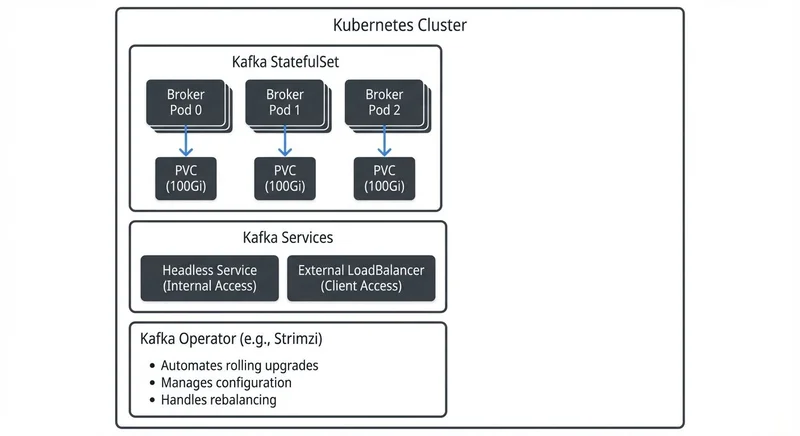

# Running Kafka on Kubernetes

Apache Kafka has become the de facto standard for building real-time data streaming platforms. As organizations increasingly adopt Kubernetes for container orchestration, running Kafka on Kubernetes has emerged as a natural evolution. This article explores the benefits, challenges, and best practices for deploying Kafka in Kubernetes environments.

## Why Run Kafka on Kubernetes?

Kubernetes offers several compelling advantages for running Kafka clusters. The platform provides built-in service discovery, load balancing, and automated rollouts, which simplify operational tasks that would otherwise require custom tooling.

Resource efficiency is another key benefit. Kubernetes allows teams to run multiple Kafka clusters on shared infrastructure with strong isolation guarantees. This multi-tenancy capability reduces hardware costs and enables better utilization of compute resources.

Infrastructure portability also matters. Kafka deployments on Kubernetes can run consistently across different cloud providers and on-premises data centers. This flexibility helps organizations avoid vendor lock-in and simplifies disaster recovery strategies.

Finally, Kubernetes integrates well with modern CI/CD pipelines. Teams can version control their Kafka infrastructure as code, apply GitOps principles, and automate testing of cluster configurations before production deployment. For comprehensive guidance on streaming CI/CD patterns, see [CI/CD Best Practices for Streaming Applications](https://conduktor.io/glossary/cicd-best-practices-for-streaming-applications) and [Testing Strategies for Streaming Applications](https://conduktor.io/glossary/testing-strategies-for-streaming-applications).

## Key Challenges and Considerations

Despite its benefits, running Kafka on Kubernetes introduces technical challenges that require careful planning. Kafka was designed as a stateful system with specific assumptions about network stability and persistent storage that don't always align with Kubernetes' dynamic nature.

Storage is the first major consideration. Kafka brokers require persistent volumes that survive pod restarts and rescheduling. Kubernetes Persistent Volume Claims (PVCs) provide this capability, but teams must choose appropriate storage classes with sufficient I/O performance.

Modern Kubernetes deployments (1.27+) offer several storage options:
- **CSI drivers** (Container Storage Interface) provide vendor-agnostic storage with volume health monitoring
- **Local persistent volumes** with StatefulSet affinity offer SSD-level performance while maintaining data locality
- **Network-attached storage** (NAS/SAN) provides easier operational management but may introduce latency that impacts Kafka's throughput
- **Tiered storage** (Kafka 3.6+) enables offloading older data to object storage like S3, reducing local disk requirements significantly (see [Tiered Storage in Kafka](https://conduktor.io/glossary/tiered-storage-in-kafka))

For high-throughput workloads, local SSDs offer the best performance but require careful planning for broker failures and data replication.

Network configuration presents another challenge. Kafka clients need stable broker addresses to maintain connections. While Kubernetes services provide abstraction, Kafka's protocol requires clients to connect to specific broker instances. This necessitates careful configuration of advertised listeners and external access patterns.

Resource allocation requires precise tuning. Kafka brokers are memory-intensive applications that benefit from dedicated CPU cores. Kubernetes resource requests and limits must account for both JVM heap memory and operating system page cache requirements. Under-provisioning leads to poor performance, while over-provisioning wastes resources.

When configuring JVM settings for containerized Kafka, enable container awareness with `-XX:+UseContainerSupport` (default in Java 11+). This ensures the JVM correctly detects container memory limits rather than seeing the entire host's memory. Set memory requests and limits to the same value to avoid throttling, and allocate roughly 50% of container memory to JVM heap, leaving the remainder for page cache which Kafka relies on heavily for performance.

## Deployment Approaches

There are three primary approaches to deploying Kafka on Kubernetes, each with distinct trade-offs.



<!-- ORIGINAL_DIAGRAM
```
┌────────────────────────────────────────────────────────────────┐
│                    Kubernetes Cluster                           │
│                                                                 │
│  ┌──────────────────────────────────────────────────────────┐  │
│  │              Kafka StatefulSet                           │  │
│  │  ┌──────────┐    ┌──────────┐    ┌──────────┐           │  │
│  │  │  Broker  │    │  Broker  │    │  Broker  │           │  │
│  │  │  Pod 0   │    │  Pod 1   │    │  Pod 2   │           │  │
│  │  └────┬─────┘    └────┬─────┘    └────┬─────┘           │  │
│  │       │               │               │                  │  │
│  │       ▼               ▼               ▼                  │  │
│  │  ┌──────────┐    ┌──────────┐    ┌──────────┐           │  │
│  │  │   PVC    │    │   PVC    │    │   PVC    │           │  │
│  │  │ (100Gi)  │    │ (100Gi)  │    │ (100Gi)  │           │  │
│  │  └──────────┘    └──────────┘    └──────────┘           │  │
│  └──────────────────────────────────────────────────────────┘  │
│                                                                 │
│  ┌──────────────────────────────────────────────────────────┐  │
│  │              Kafka Services                              │  │
│  │  ┌──────────────────────┐  ┌────────────────────────┐   │  │
│  │  │  Headless Service    │  │  External LoadBalancer │   │  │
│  │  │  (Internal Access)   │  │  (Client Access)       │   │  │
│  │  └──────────────────────┘  └────────────────────────┘   │  │
│  └──────────────────────────────────────────────────────────┘  │
│                                                                 │
│  ┌──────────────────────────────────────────────────────────┐  │
│  │         Kafka Operator (e.g., Strimzi)                   │  │
│  │  • Automates rolling upgrades                            │  │
│  │  • Manages configuration                                 │  │
│  │  • Handles rebalancing                                   │  │
│  └──────────────────────────────────────────────────────────┘  │
└─────────────────────────────────────────────────────────────────┘
```
-->

**StatefulSets** provide the foundational building block. This Kubernetes resource manages pods with stable network identities and persistent storage with essentials like:
- Stable network identities for each broker
- Persistent volumes that survive pod restarts
- Ordered deployment and scaling

Here's a simplified example of a Kafka broker StatefulSet configuration:

```yaml
apiVersion: apps/v1
kind: StatefulSet
metadata:
  name: kafka
spec:
  serviceName: kafka-headless
  replicas: 3
  selector:
    matchLabels:
      app: kafka
  template:
    metadata:
      labels:
        app: kafka
    spec:
      containers:
      - name: kafka
        image: apache/kafka:4.0.0
        ports:
        - containerPort: 9092
          name: kafka
        env:
        - name: KAFKA_PROCESS_ROLES
          value: "broker,controller"
        - name: KAFKA_NODE_ID
          valueFrom:
            fieldRef:
              fieldPath: metadata.name
        - name: KAFKA_CONTROLLER_QUORUM_VOTERS
          value: "0@kafka-0.kafka-headless:9093,1@kafka-1.kafka-headless:9093,2@kafka-2.kafka-headless:9093"
        resources:
          requests:
            memory: "4Gi"
            cpu: "2"
          limits:
            memory: "4Gi"
            cpu: "2"
        volumeMounts:
        - name: data
          mountPath: /var/lib/kafka/data
  volumeClaimTemplates:
  - metadata:
      name: data
    spec:
      accessModes: [ "ReadWriteOnce" ]
      resources:
        requests:
          storage: 100Gi
```

This approach offers maximum control but requires manual management of metadata management. Modern deployments (Kafka 4.0+, released 2024) use KRaft mode as the default, which eliminates ZooKeeper dependencies entirely. KRaft mode simplifies operations by using Kafka's native Raft-based consensus protocol for cluster metadata. For details on KRaft's architecture and migration paths, see [Understanding KRaft Mode in Kafka](https://conduktor.io/glossary/understanding-kraft-mode-in-kafka). Legacy deployments still using ZooKeeper should plan migrations as ZooKeeper support is deprecated.

This manual approach also requires configuration of security, monitoring, and upgrades.

**Helm charts** provide a higher-level abstraction. Charts like those from Bitnami package Kafka along with necessary dependencies and sensible defaults. They reduce initial setup time and standardize configurations across deployments.

**Kubernetes Operators** represent the most sophisticated approach. Projects like Strimzi (see [Strimzi: Kafka Operator for Kubernetes](https://conduktor.io/glossary/strimzi-kafka-operator-for-kubernetes)) automate day-two operations including rolling upgrades, automatic rebalancing, and configuration management. Strimzi 0.42+ (2025) provides enhanced KRaft support, improved security configurations, and better integration with Kubernetes observability tools. Operators understand Kafka-specific operational requirements and can make intelligent decisions about cluster health and scaling.

For production environments, operators typically provide the best balance of automation and reliability, though they introduce additional complexity and dependencies.

## KRaft Mode Deployment Patterns

Kafka 4.0+ defaults to KRaft mode, which changes how you deploy and manage clusters on Kubernetes. KRaft eliminates the need for separate ZooKeeper StatefulSets, simplifying the overall architecture.

**Combined vs. Separated Modes**

KRaft supports two deployment topologies:
- **Combined mode**: Each broker also acts as a controller, handling both data and metadata. Suitable for smaller clusters (3-5 nodes) and development environments.
- **Separated mode**: Dedicated controller nodes manage metadata while broker nodes handle data. Recommended for production clusters with 6+ nodes for better resource isolation and operational flexibility.

In Kubernetes, separated mode typically uses two StatefulSets: one for controllers (typically 3 replicas) and one for brokers (scaled based on workload). Controllers require minimal CPU/memory but need fast, reliable storage for the metadata log.

**Simplified Operations**

KRaft mode offers several operational advantages on Kubernetes:
- Faster startup times (no ZooKeeper coordination overhead)
- Reduced resource footprint (no separate ZooKeeper pods)
- Simplified networking (fewer service endpoints)
- Better scaling characteristics (metadata operations scale with broker count)

When migrating existing deployments from ZooKeeper to KRaft, plan for cluster downtime or use Kafka's migration tools. Most operators like Strimzi provide automation for this process.

## Best Practices for Production

Running production Kafka on Kubernetes requires attention to several operational details.

**Resource isolation** is critical. Use Kubernetes namespaces to separate Kafka clusters and apply resource quotas to prevent noisy neighbor problems. Pod anti-affinity rules ensure that brokers spread across different worker nodes and availability zones for high availability.

**Storage management** requires planning for growth. Use storage classes with volume expansion capabilities to avoid complex migration procedures. Monitor disk usage proactively and implement retention policies that balance data availability with storage costs.

**Network policies** should restrict traffic to authorized clients and services. Kafka clusters often handle sensitive data, and Kubernetes network policies provide fine-grained control over ingress and egress traffic.

**Upgrade strategies** must minimize downtime. Use Kafka's rolling restart capabilities in conjunction with Kubernetes' rolling update strategies. Always test upgrades in staging environments and maintain rollback plans.

Consider implementing **rack awareness** using Kubernetes topology spread constraints. This ensures that topic replicas distribute across failure domains, improving fault tolerance.

**Security configuration** deserves special attention in Kubernetes environments. Enable TLS for all broker-to-broker and client-to-broker communication. Use Kubernetes Secrets to manage certificates and credentials, rotating them regularly. Implement network policies to restrict pod-to-pod communication, allowing only authorized clients to reach Kafka services. For authentication, configure SASL (typically SCRAM or OAUTHBEARER) and integrate with your organization's identity provider. Enable Kafka's ACLs (Access Control Lists) to control topic-level permissions, and consider using [Quotas and Rate Limiting in Kafka](https://conduktor.io/glossary/quotas-and-rate-limiting-in-kafka) to prevent resource exhaustion attacks.

**Testing resilience** should be part of your operational practice. Apply chaos engineering principles to validate that your Kafka cluster handles node failures, network partitions, and resource constraints gracefully. Tools like Conduktor Gateway enable controlled chaos testing without impacting production workloads (see [Chaos Engineering for Streaming Systems](https://conduktor.io/glossary/chaos-engineering-for-streaming-systems)). For deploying Conduktor Gateway on Kubernetes alongside your Kafka clusters, see the [Gateway Kubernetes Deployment Guide](https://docs.conduktor.io/guide/conduktor-in-production/deploy-artifacts/deploy-gateway/kubernetes).

## Monitoring and Observability in Streaming Platforms

Effective monitoring becomes even more important when running Kafka on Kubernetes. The dynamic nature of container orchestration introduces additional failure modes and makes troubleshooting more complex.

Kubernetes-native monitoring tools like Prometheus integrate well with Kafka exporters to collect broker metrics, consumer lag, and cluster health indicators. Use JMX Exporter for broker metrics and Kafka Lag Exporter for consumer group monitoring (see [Consumer Lag Monitoring](https://conduktor.io/glossary/consumer-lag-monitoring)). Configure alerts for critical metrics such as under-replicated partitions, high consumer lag, and disk space exhaustion. Popular Grafana dashboards provide pre-built visualizations for Kafka on Kubernetes deployments.

Distributed tracing helps track message flows through complex streaming pipelines. Tools that correlate Kafka producer/consumer spans with application traces provide end-to-end visibility in microservices architectures.

For teams managing multiple Kafka clusters on Kubernetes, platforms like Conduktor provide centralized governance and monitoring capabilities. These tools offer unified views of cluster health, topic configurations, and consumer groups across different environments, simplifying operational workflows in containerized deployments.

Log aggregation from both Kafka and Kubernetes components enables comprehensive root cause analysis. Ensure that logs include correlation IDs that span pod restarts and redeployments.

## Scaling Kafka on Kubernetes

One advantage of Kubernetes deployments is simplified horizontal scaling. However, scaling Kafka requires coordination between the orchestration platform and Kafka's internal partition rebalancing mechanisms.

When adding brokers to a StatefulSet, Kafka doesn't automatically reassign existing partitions. Teams must trigger partition reassignment manually or use operators that automate this process. Here's a typical scaling workflow:

1. **Increase the StatefulSet replica count**: `kubectl scale statefulset kafka --replicas=5`
2. **Wait for new broker pods to join the cluster**: Monitor with `kubectl get pods -l app=kafka`
3. **Generate partition reassignment plan**: Use Kafka's `kafka-reassign-partitions.sh` tool or operator-managed automation
4. **Execute reassignment with throttling**: Set replication throttle (e.g., 50MB/s per broker) to avoid network saturation: `kafka-configs.sh --bootstrap-server kafka:9092 --entity-type brokers --entity-default --alter --add-config follower.replication.throttled.rate=52428800,leader.replication.throttled.rate=52428800`
5. **Monitor replication progress**: Track under-replicated partitions until balanced

Modern operators like Strimzi handle steps 3-5 automatically, including optimal throttling calculations based on cluster capacity.

Vertical scaling (adjusting CPU and memory) requires more care. Changing resource requests or limits typically triggers pod recreation, which can impact cluster availability if not performed as a controlled rolling restart.

Autoscaling Kafka on Kubernetes remains challenging because traditional metrics like CPU utilization don't always correlate with Kafka's capacity. Custom metrics based on consumer lag or request queue depth provide better signals for scaling decisions.

## Summary

Running Kafka on Kubernetes offers significant operational benefits including resource efficiency, infrastructure portability, and integration with cloud-native tooling. However, success requires careful consideration of storage performance, network configuration, and resource allocation.

StatefulSets provide the foundation for Kafka deployments, while operators like Strimzi automate complex operational tasks. Production deployments should implement resource isolation, rack awareness, and comprehensive monitoring to ensure reliability.

The combination of Kubernetes orchestration and Kafka's distributed streaming capabilities enables organizations to build scalable, resilient data platforms. As both technologies continue to evolve, the operational patterns for running Kafka on Kubernetes will mature, making this deployment model increasingly accessible.

Teams embarking on this journey should start with pilot projects, invest in automation through operators, and establish strong observability practices before scaling to production workloads.

## Related Concepts

- [Strimzi Kafka Operator for Kubernetes](https://conduktor.io/glossary/strimzi-kafka-operator-for-kubernetes) - Automate Kafka deployment and operations on Kubernetes using the CNCF operator pattern.
- [Infrastructure as Code for Kafka Deployments](https://conduktor.io/glossary/infrastructure-as-code-for-kafka-deployments) - Apply IaC practices to manage Kubernetes-based Kafka infrastructure declaratively with GitOps workflows.
- [Kafka Capacity Planning](https://conduktor.io/glossary/kafka-capacity-planning) - Size Kubernetes resource requests and limits based on workload characteristics and performance requirements.

## Key Terminology

Understanding these Kubernetes and Kafka-specific terms helps when deploying streaming infrastructure:

- **StatefulSet**: A Kubernetes resource type that manages stateful applications, providing stable network identities and persistent storage for each pod instance
- **PVC (Persistent Volume Claim)**: A request for storage in Kubernetes that binds to a Persistent Volume, ensuring data survives pod restarts
- **Headless Service**: A Kubernetes service without a cluster IP that allows direct access to individual pod IPs, necessary for Kafka's broker discovery
- **Advertised Listeners**: Kafka configuration that specifies the addresses brokers advertise to clients for establishing connections
- **CSI (Container Storage Interface)**: A standard interface for container orchestrators to interact with storage systems, enabling vendor-agnostic storage management
- **Operator Pattern**: A Kubernetes extension that uses custom resources and controllers to automate complex application management tasks
- **Topology Spread Constraints**: Kubernetes feature that controls how pods distribute across failure domains like availability zones or nodes
- **KRaft Mode**: Kafka's native consensus protocol that eliminates ZooKeeper dependencies by managing cluster metadata internally
- **Rolling Update**: A deployment strategy that gradually replaces old pods with new ones, maintaining availability during upgrades

## Sources and References

1. **Apache Kafka Documentation** - "Running Kafka in Production"
   https://kafka.apache.org/documentation/#operations

2. **Apache Kafka KIP-500** - "Replace ZooKeeper with a Self-Managed Metadata Quorum"
   https://cwiki.apache.org/confluence/display/KAFKA/KIP-500

3. **Strimzi Project Documentation** - "Deploying and Managing Apache Kafka on Kubernetes"
   https://strimzi.io/documentation/

4. **Kubernetes StatefulSets Documentation** - "StatefulSet Basics"
   https://kubernetes.io/docs/concepts/workloads/controllers/statefulset/

5. **Kubernetes Storage Documentation** - "Container Storage Interface (CSI)"
   https://kubernetes.io/docs/concepts/storage/volumes/#csi

6. **CNCF Blog** - "Kubernetes Operators: Automating the Container Orchestration Platform"
   https://www.cncf.io/blog/2022/06/15/kubernetes-operators-what-are-they-some-examples/

7. **Conduktor Documentation** - "Monitoring Kafka on Kubernetes"
   https://www.conduktor.io/
