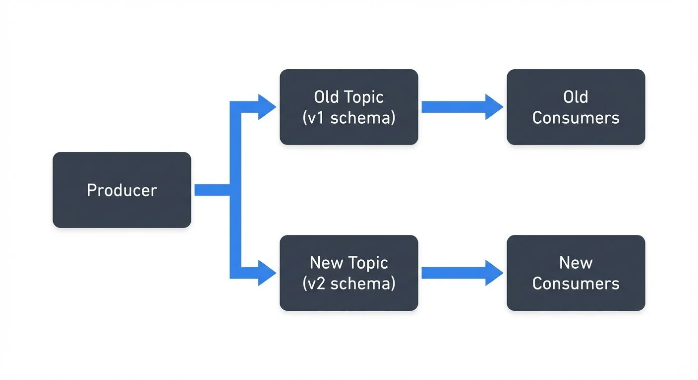

# Schema Evolution Best Practices

Schema evolution is the process of changing data structures over time while maintaining compatibility with existing systems. In distributed architectures, where producers and consumers operate independently, managing schema changes incorrectly can break applications, corrupt data, or bring down entire pipelines.

This article explores best practices for evolving schemas safely, with a focus on streaming platforms where schema evolution is particularly critical.

## Understanding Schema Evolution

A schema defines the structure of data: field names, types, constraints, and relationships. As business requirements change, schemas must adapt. You might need to add new fields to capture additional information, deprecate unused fields, or modify existing structures.

The challenge is that in distributed systems, not all components upgrade simultaneously. A producer might send data with a new schema while consumers still expect the old format. Schema evolution strategies determine whether these mismatched versions can coexist.

Without careful management, schema changes can cause:
- Deserialization failures when consumers cannot parse new data formats
- Data loss when fields are removed without migration
- Breaking changes that require synchronized deployments across services
- Silent data corruption when type mismatches go undetected (data appears valid but has incorrect values)

Effective schema evolution is essential for [data contracts](https://conduktor.io/glossary/data-contracts-for-reliable-pipelines) that define expectations between data producers and consumers.

## Understanding Compatibility Modes

Schema evolution revolves around compatibility modes that define which changes are allowed. The three primary modes are:

### Backward Compatibility

New schemas can read data written with old schemas. This means consumers can upgrade first.

**Example**: Adding an optional field with a default value is backward compatible. Old data lacks this field, but new consumers can handle its absence by applying the default.

```json
// Old schema
{
  "name": "User",
  "fields": [
    {"name": "id", "type": "string"},
    {"name": "email", "type": "string"}
  ]
}

// New schema (backward compatible)
{
  "name": "User",
  "fields": [
    {"name": "id", "type": "string"},
    {"name": "email", "type": "string"},
    {"name": "phone", "type": "string", "default": ""}
  ]
}
```

### Forward Compatibility

Old schemas can read data written with new schemas. This means producers can upgrade first.

**Example**: Removing an optional field is forward compatible. Old consumers simply ignore the missing field when processing new data.

```json
// Old schema
{
  "name": "User",
  "fields": [
    {"name": "id", "type": "string"},
    {"name": "email", "type": "string"},
    {"name": "phone", "type": ["null", "string"], "default": null}
  ]
}

// New schema (forward compatible - removed optional field)
{
  "name": "User",
  "fields": [
    {"name": "id", "type": "string"},
    {"name": "email", "type": "string"}
  ]
}
```

### Full Compatibility

Schemas are both backward and forward compatible. This provides maximum flexibility but is the most restrictive. Only safe changes like adding or removing optional fields with defaults are allowed.

**Example**: Full compatibility allows gradual rollouts in any order:

```json
// Version 1
{
  "name": "Product",
  "fields": [
    {"name": "id", "type": "string"},
    {"name": "price", "type": "double"}
  ]
}

// Version 2 (fully compatible - added optional field with default)
{
  "name": "Product",
  "fields": [
    {"name": "id", "type": "string"},
    {"name": "price", "type": "double"},
    {"name": "currency", "type": "string", "default": "USD"}
  ]
}
```

### Transitive Compatibility

Transitive modes extend compatibility checks beyond just the previous version:

- **Backward Transitive**: New schema must be compatible with ALL previous versions, not just the last one
- **Forward Transitive**: All previous schemas must be compatible with the new schema
- **Full Transitive**: Combines both backward and forward transitive checks

Use transitive modes when consumers might lag by multiple versions. Without transitive compatibility, a consumer running version 1 might fail when the schema is at version 5, even though each consecutive version change was individually compatible.

Most streaming platforms default to backward compatibility because it is the most common requirement and allows consumers to lag behind producers.

### Choosing the Right Compatibility Mode

Use this decision guide to select the appropriate compatibility mode for your use case:

| **Choose This Mode** | **When** | **Trade-offs** |
|---------------------|----------|----------------|
| **Backward** | Consumers upgrade first or lag behind producers | Most flexible for producers; consumers must handle missing fields |
| **Forward** | Producers upgrade first | Most flexible for consumers; producers can't use new fields until consumers upgrade |
| **Full** | You need flexibility to upgrade in any order | Most restrictive; only optional fields with defaults allowed |
| **Backward Transitive** | Consumers might skip multiple versions | Safest for consumer lag; limits evolution options |
| **Forward Transitive** | Producers might skip multiple versions | Safest for producer version jumps; rare in practice |
| **Full Transitive** | Maximum safety across all versions | Most restrictive; use for critical shared schemas |
| **None** | You control all producers and consumers tightly | No safety net; coordinate deployments carefully |

**General Recommendation**: Start with backward compatibility. Only move to stricter modes (full, transitive) if you encounter version skew issues in production.

## Schema Evolution in Data Streaming

In Apache Kafka and similar streaming platforms, schema evolution is managed through a [Schema Registry](https://conduktor.io/glossary/schema-registry-and-schema-management). This centralized service stores schemas and enforces compatibility rules.

### How Schema Registry Works

When a producer sends a message, it includes a schema ID in the message payload (typically as a 4-byte prefix after a magic byte). The Schema Registry validates that the new schema is compatible with previous versions before assigning an ID. Consumers use this ID to retrieve the schema and deserialize messages.

**Message Format Example**:
```
[Magic Byte: 0x00][Schema ID: 4 bytes][Avro/Protobuf/JSON data: N bytes]
Example: 0x00 0x00 0x00 0x00 0x05 [payload...]
         ^    ^----- Schema ID 5 ----^
```

This approach provides several benefits:
- **Centralized governance**: All schema changes go through a single point of control
- **Automatic validation**: Incompatible changes are rejected before reaching production
- **Efficient storage**: Messages contain only a 5-byte schema identifier, not the full schema
- **Version history**: All schema versions are preserved for auditing and rollback
- **Schema caching**: Clients cache schemas by ID, minimizing registry lookups

Common serialization formats in streaming include:
- **[Avro](https://conduktor.io/glossary/avro-vs-protobuf-vs-json-schema)**: Binary format with built-in schema evolution rules and schema resolution at read time
- **[Protocol Buffers](https://conduktor.io/glossary/avro-vs-protobuf-vs-json-schema)**: Efficient binary format with field numbers for compatibility; supports reserved fields
- **[JSON Schema](https://conduktor.io/glossary/avro-vs-protobuf-vs-json-schema)**: Human-readable but less efficient for high-throughput streams

Each format has specific rules about which changes preserve compatibility. For example, Avro requires default values for new fields in backward-compatible changes, while Protobuf relies on field numbers remaining stable and supports reserved keywords to prevent reuse of deprecated field numbers.

**Choosing a Format**:
- **Avro**: Best for schema evolution flexibility and when schemas change frequently. No code generation required.
- **Protobuf**: Best for performance and cross-language compatibility. Requires code generation but offers smaller payloads.
- **JSON Schema**: Best when human readability matters more than efficiency, or when integrating with REST APIs.

### Modern Schema Registry Features (2025)

Schema Registries have evolved beyond basic compatibility checking to offer advanced governance and operational features:

**Schema Linking** enables replicating schemas across clusters or regions, essential for multi-datacenter deployments and disaster recovery. When you have active-active Kafka clusters in different regions, Schema Linking ensures schema definitions stay synchronized without manual intervention.

**Schema Normalization** reduces duplicate schemas by recognizing semantically equivalent schemas. If two teams independently define the same structure with fields in different orders, normalization identifies them as identical, reducing registry bloat.

**Custom Validation Rules** allow enforcing organization-specific constraints beyond compatibility. For example, you can require all schemas to include metadata fields like `owner` or `data_classification`, or enforce naming conventions like `snake_case` for field names.

**Schema References** enable composing complex schemas from reusable components. Instead of duplicating common structures like Address or Timestamp across multiple schemas, you define them once and reference them:

```json
{
  "name": "Order",
  "fields": [
    {"name": "id", "type": "string"},
    {"name": "shipping_address", "type": "Address"}  // References Address schema
  ]
}
```

**Tag-Based Governance** lets you attach metadata tags to schemas (PII, confidential, public) and enforce policies based on these tags. For example, schemas tagged as `PII` might require additional approval workflows or encryption at rest.

## Best Practices for Safe Schema Evolution

### 1. Always Add Defaults to New Fields

When adding fields, provide default values. This ensures old data without the field can still be processed by new code.

### 2. Never Remove Required Fields

Removing a required field breaks backward compatibility. Consumers expecting the field will fail when it is absent. Instead, deprecate the field and make it optional.

### 3. Avoid Changing Field Types

Changing a field from `string` to `int` is almost always incompatible. Even seemingly safe changes like `int` to `long` can cause issues depending on the serialization format. If a type change is necessary, add a new field with the new type and deprecate the old one.

### 4. Use Field Aliases for Renaming

If you must rename a field, use aliases rather than removing the old field and adding a new one. Many formats support aliases that map old names to new names transparently.

**Example in Avro**:
```json
{
  "name": "Customer",
  "fields": [
    {"name": "id", "type": "string"},
    {"name": "fullName", "type": "string", "aliases": ["full_name", "name"]}
  ]
}
```

In this example, data written with field name `full_name` or `name` can be read using `fullName`, and vice versa. This enables gradual migration without breaking existing producers or consumers.

### 5. Version Your Schemas Explicitly

Use semantic versioning or date-based versioning for schemas. This makes it clear when breaking changes occur and helps teams coordinate upgrades.

### 6. Test Compatibility Before Deployment

Use schema validation tools to test that new schemas are compatible with previous versions. Catching incompatibilities in development is far cheaper than discovering them in production.

## Common Pitfalls and How to Avoid Them

### Pitfall 1: Removing Fields Without Migration

Teams often remove fields they believe are unused, only to discover legacy consumers still rely on them. Before removing a field, audit all consumers and provide a migration period where the field is deprecated but still present.

### Pitfall 2: Changing Defaults on Existing Fields

Changing the default value of an existing field can alter the meaning of historical data. Old messages without the field will be interpreted differently by new consumers. Instead, add a new field with the new default.

### Pitfall 3: Not Documenting Breaking Changes

Even when breaking changes are necessary, failing to document them causes confusion. Maintain a changelog for schemas and communicate breaking changes clearly to all stakeholders.

### Pitfall 4: Ignoring Schema Drift

In organizations with many teams, schemas can drift as different teams make independent changes. Regular schema audits and automated validation help catch drift before it causes integration issues.

## Handling Breaking Changes: Migration Strategies

Sometimes breaking changes are unavoidable. Business requirements might mandate restructuring data in ways incompatible with previous versions. Here are strategies for managing these transitions:

### Dual-Writing Pattern

During migration, producers write to both old and new topics simultaneously. Consumers gradually migrate from the old topic to the new one. Once all consumers have migrated, retire the old topic.



<!-- ORIGINAL_DIAGRAM
```
Producer → Old Topic (v1 schema) → Old Consumers
         ↘ New Topic (v2 schema) → New Consumers
```
-->

This approach provides a clean cutover point but doubles write load and requires maintaining two code paths.

### Versioned Topics

Use separate topics for incompatible schema versions: `orders.v1`, `orders.v2`. Consumers specify which version they support. This enables long-term coexistence but fragments data across topics.

### Transform-on-Read

Store data in the new format but provide a transformation layer that converts it to the old format for legacy consumers. This centralizes the compatibility logic but adds latency and computational overhead.

### Coordinated Deployment

For tightly coupled systems, schedule maintenance windows where all producers and consumers upgrade simultaneously. This is the simplest approach but requires downtime and careful coordination.

### Choosing a Strategy

- **Dual-writing**: Best when you have a clear migration timeline (weeks to months)
- **Versioned topics**: Best when versions must coexist long-term or serve different use cases
- **Transform-on-read**: Best when writes dominate and you have few legacy consumers
- **Coordinated deployment**: Best for small systems or when downtime is acceptable

All strategies benefit from feature flags that allow toggling between old and new behavior without redeployment.

## Tooling and Governance

Effective schema evolution requires both technical tooling and organizational governance.

### Technical Tools

Schema Registries provide validation and version control for your data structures. Open-source options include Apicurio Registry (Red Hat), Karapace (Aiven), and the Apache Kafka implementation. Each offers REST APIs for schema management and compatibility enforcement.

Platforms like Conduktor provide visual interfaces for exploring schemas, testing compatibility changes before deployment, and understanding the impact of proposed changes across topics and consumer groups. Conduktor Gateway can also enforce schema policies at the infrastructure level, blocking non-compliant producers before data enters your topics. This visibility and control is valuable when managing dozens or hundreds of schemas across multiple teams. For practical schema management workflows, see [Conduktor's Schema Registry guide](https://docs.conduktor.io/guide/manage-kafka/kafka-resources/schema-registry).

Many organizations use schema linters that enforce naming conventions and flag risky changes during code review, integrating schema validation into CI/CD pipelines.

### Enforcing Schema Requirements with Conduktor Interceptors

Beyond Schema Registry's compatibility validation, Conduktor Interceptors provide runtime enforcement of schema requirements at the infrastructure level. Interceptors are Gateway plugins that validate messages against schema requirements before they reach brokers, catching violations from legacy clients or misconfigured producers that bypass application-level validation. Any message without a valid schema ID or with an incompatible schema gets rejected immediately.

Interceptors can enforce schema policies beyond basic compatibility—requiring specific metadata fields in schemas, enforcing format standards (e.g., Avro only for customer data topics), or validating semantic correctness during schema evolution. For organizations implementing phased migrations, Interceptors validate that producers correctly write to both old and new topics with appropriate schema versions. Learn more at the [Interceptors documentation](https://docs.conduktor.io/guide/conduktor-concepts/interceptors).

### Governance Practices

Establish clear ownership for schemas. Each schema should have a designated team responsible for changes. Create approval processes for breaking changes that require coordination across teams. This ownership model aligns with [data governance frameworks](https://conduktor.io/glossary/data-governance-framework-roles-and-responsibilities) that define roles and responsibilities.

Document compatibility requirements in a schema evolution policy. Specify which compatibility mode is required for different types of data and what exceptions process exists for breaking changes. Define which schemas are considered [data contracts](https://conduktor.io/glossary/data-contracts-for-reliable-pipelines) with stricter governance requirements.

Regular schema reviews help identify technical debt like deprecated fields that can be safely removed or overly complex schemas that should be simplified. Use [data quality frameworks](https://conduktor.io/glossary/building-a-data-quality-framework) to validate that schema changes don't degrade data quality metrics.

## Summary

Schema evolution is essential in distributed systems where components evolve independently. The key principles are:

- Understand compatibility modes and choose the right one for your use case
- Always add defaults to new fields and never remove required fields
- Test compatibility before deploying schema changes
- Use Schema Registry to centralize validation and governance
- Document changes and communicate breaking changes clearly
- Establish ownership and approval processes for schema modifications

By following these practices, teams can evolve schemas safely without breaking existing systems, reducing downtime and data quality issues in production environments.

## Related Concepts

- [Schema Registry and Schema Management](https://conduktor.io/glossary/schema-registry-and-schema-management) - Essential infrastructure for centralized schema storage and compatibility validation during evolution.
- [Avro vs Protobuf vs JSON Schema](https://conduktor.io/glossary/avro-vs-protobuf-vs-json-schema) - Compare how different serialization formats handle schema evolution with their specific compatibility rules.
- [Data Contracts for Reliable Pipelines](https://conduktor.io/glossary/data-contracts-for-reliable-pipelines) - Understand how schema evolution relates to maintaining data contracts between producers and consumers.

## Sources and References

1. [Apicurio Registry Documentation](https://www.apicur.io/registry/) - Open-source schema registry with multi-format support
2. Kleppmann, Martin. *Designing Data-Intensive Applications*. O'Reilly Media, 2017. Chapter 4: Encoding and Evolution
3. [Apache Avro Specification](https://avro.apache.org/docs/current/specification/) - Details on Avro schema evolution rules
4. [Protocol Buffers: Updating A Message Type](https://protobuf.dev/programming-guides/proto3/#updating) - Google's guidelines for evolving Protobuf schemas
5. Narkhede, Neha, Gwen Shapira, and Todd Palino. *Kafka: The Definitive Guide*. O'Reilly Media, 2021. Chapter 3: Kafka Producers - Schema Evolution section
