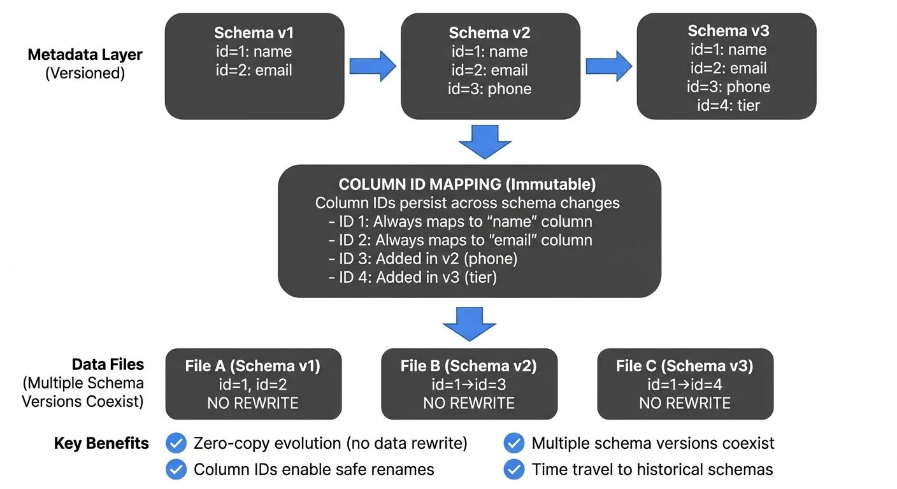

Schema evolution is a critical capability for modern data lakehouses, allowing data engineers to adapt table structures as business requirements change without disrupting existing workloads or rewriting massive datasets. [Apache Iceberg](https://conduktor.io/glossary/apache-iceberg) provides robust schema evolution capabilities that surpass traditional data lake formats, making it the preferred choice for enterprise data platforms.

As of 2025, with Iceberg versions 1.8.0 through 1.10.0, schema evolution has expanded to support new data types including Variant for semi-structured data, nanosecond-precision timestamps, and geospatial types, alongside enhanced performance through deletion vectors and row lineage tracking.

<!-- ORIGINAL_DIAGRAM
```
┌─────────────────────────────────────────────────────────────────┐
│                    ICEBERG SCHEMA EVOLUTION                     │
├─────────────────────────────────────────────────────────────────┤
│                                                                 │
│  Metadata Layer (Versioned)                                    │
│  ┌──────────────┐  ┌──────────────┐  ┌──────────────┐         │
│  │ Schema v1    │  │ Schema v2    │  │ Schema v3    │         │
│  │ id=1: name   │→ │ id=1: name   │→ │ id=1: name   │         │
│  │ id=2: email  │  │ id=2: email  │  │ id=2: email  │         │
│  │              │  │ id=3: phone  │  │ id=3: phone  │         │
│  │              │  │              │  │ id=4: tier   │         │
│  └──────────────┘  └──────────────┘  └──────────────┘         │
│         │                 │                 │                   │
│         └─────────────────┴─────────────────┘                   │
│                           │                                     │
│                           ▼                                     │
│  ┌──────────────────────────────────────────────────┐          │
│  │         COLUMN ID MAPPING (Immutable)            │          │
│  │  Column IDs persist across schema changes        │          │
│  │  - ID 1: Always maps to "name" column           │          │
│  │  - ID 2: Always maps to "email" column          │          │
│  │  - ID 3: Added in v2 (phone)                    │          │
│  │  - ID 4: Added in v3 (tier)                     │          │
│  └──────────────────────────────────────────────────┘          │
│                           │                                     │
│                           ▼                                     │
│  Data Files (Multiple Schema Versions Coexist)                 │
│  ┌─────────────┐  ┌─────────────┐  ┌─────────────┐            │
│  │ File A      │  │ File B      │  │ File C      │            │
│  │ (Schema v1) │  │ (Schema v2) │  │ (Schema v3) │            │
│  │ id=1, id=2  │  │ id=1→id=3   │  │ id=1→id=4   │            │
│  │ NO REWRITE  │  │ NO REWRITE  │  │ NO REWRITE  │            │
│  └─────────────┘  └─────────────┘  └─────────────┘            │
│                                                                 │
│  Key Benefits:                                                  │
│  ✓ Zero-copy evolution (no data rewrite)                       │
│  ✓ Column IDs enable safe renames                              │
│  ✓ Multiple schema versions coexist                            │
│  ✓ Time travel to historical schemas                           │
└─────────────────────────────────────────────────────────────────┘
```
-->

## Understanding Schema Evolution

Schema evolution refers to the ability to modify a table's structure over time while maintaining compatibility with existing data and queries. In traditional data lakes built on formats like Parquet or ORC, schema changes often require expensive full-table rewrites or complex partition-level operations.

Iceberg fundamentally reimagines this process by decoupling the schema definition from the physical data files. This means the table's schema exists separately as metadata, rather than being tightly bound to each data file. When you make schema changes, you're updating this central metadata definition, not rewriting data files.

Iceberg tracks schema changes through versioned metadata, allowing multiple schema versions to coexist. Each data file retains its original schema, while Iceberg's metadata layer handles the translation between different schema versions at read time. This architecture enables zero-copy schema evolution for most operations, meaning schema changes don't require copying or rewriting data files, dramatically reducing the operational overhead of schema changes.

For comprehensive guidance on schema evolution patterns across different systems, see [Schema Evolution Best Practices](https://conduktor.io/glossary/schema-evolution-best-practices).

## Safe Schema Changes in Iceberg

Iceberg supports several types of schema changes, each with different compatibility guarantees:

### Adding Columns

Adding new columns is the most common and safest schema evolution operation. Iceberg allows you to add columns at any position in the table schema, not just at the end:

```sql
-- Add a new column to an Iceberg table
ALTER TABLE events
ADD COLUMN user_segment STRING
COMMENT 'User engagement segment';

-- Add a column with a default value
ALTER TABLE events
ADD COLUMN is_premium BOOLEAN DEFAULT false;
```

When reading older data files that don't contain the new column, Iceberg returns null values (or the specified default) for those columns. This ensures backward compatibility without requiring any data rewrite.

### Renaming Columns

Unlike traditional formats that rely on column position or name matching, Iceberg uses unique column IDs for each field. This enables true column renaming without touching data files:

```sql
-- Rename a column safely
ALTER TABLE events
RENAME COLUMN user_id TO customer_id;
```

After renaming, existing queries using the old column name will fail, but the physical data remains unchanged. This prevents silent data corruption that can occur with position-based schemas.

### Dropping Columns

Iceberg supports soft column deletion through the DROP COLUMN operation:

```sql
-- Drop a column from the schema
ALTER TABLE events
DROP COLUMN deprecated_field;
```

Dropped columns disappear from the table schema immediately, but the underlying data files retain the column data. This allows for quick schema cleanup without expensive rewrites, and the column can potentially be recovered from historical metadata if needed.

### Type Promotion

Iceberg supports safe type promotions that widen data types without loss of precision. "Widening" means expanding a type's capacity to hold larger values or more precise numbers, ensuring no data is lost during conversion:

```sql
-- Promote integer to long
ALTER TABLE events
ALTER COLUMN event_count TYPE BIGINT;

-- Promote float to double
ALTER TABLE metrics
ALTER COLUMN measurement TYPE DOUBLE;
```

Supported type promotions include:
- `int` → `long` (safe: all int values fit in long)
- `float` → `double` (safe: double has greater precision)
- `decimal(P, S)` → `decimal(P', S)` where P' > P (safe: more digits allowed)

These are safe because the target type can represent all possible values from the source type without loss. The opposite direction (long → int, double → float) would be unsafe as it risks data loss or overflow.

### Modern Type Support (Iceberg 1.8.0+)

Starting with Iceberg 1.8.0 (February 2025), new data types expand schema evolution capabilities:

**Variant Type**: For semi-structured, JSON-like data that doesn't conform to a fixed schema:

```sql
-- Add a variant column for flexible event properties
ALTER TABLE events
ADD COLUMN flexible_metadata VARIANT;
```

This enables ingesting dynamic data structures without defining every possible field upfront, ideal for evolving event schemas or third-party integrations.

**Nanosecond Timestamp Precision**: For high-precision temporal data required in trading systems, IoT telemetry, and distributed tracing:

```sql
-- Create table with nanosecond timestamps
CREATE TABLE high_frequency_trades (
  trade_id LONG,
  symbol STRING,
  trade_time TIMESTAMP_NS,  -- Nanosecond precision
  price DECIMAL(18, 2)
) USING iceberg;
```

**Geospatial Types**: Native support for geometry and geography columns:

```sql
-- Add location tracking
ALTER TABLE store_visits
ADD COLUMN visit_location GEOGRAPHY;
```

## Column Mapping and Identity Columns

Iceberg's schema evolution capabilities are powered by its sophisticated column mapping system. Each column in an Iceberg table receives a unique identifier at creation time, independent of the column's position or name.

### Column ID Assignment

When you create a table, Iceberg assigns monotonically increasing IDs (starting from 1 and incrementing sequentially) to each column:

```python
from pyspark.sql import SparkSession

spark = SparkSession.builder.appName("iceberg-schema").getOrCreate()

# Create table with implicit column IDs
spark.sql("""
CREATE TABLE catalog.db.events (
  event_id LONG,           -- Assigned ID: 1
  event_type STRING,       -- Assigned ID: 2
  timestamp TIMESTAMP,     -- Assigned ID: 3
  user_id LONG,           -- Assigned ID: 4
  properties MAP<STRING, STRING>  -- Assigned ID: 5
) USING iceberg
""")
```

These IDs persist throughout the table's lifetime, enabling column renaming and reordering without breaking the connection to physical data files. This design prevents the positional dependency issues common in Hive-style tables.

### Name Mapping for Legacy Data

For tables migrated from other formats (like Hive tables or raw Parquet files), Iceberg supports name-based column mapping as a fallback mechanism. Instead of relying on column IDs, which may not exist in legacy data, Iceberg can match columns by name when reading older data files.

```python
# Enable name mapping for a migrated table
spark.sql("""
ALTER TABLE catalog.db.legacy_events
SET TBLPROPERTIES (
  'schema.name-mapping.default'='[
    {"field-id": 1, "names": ["event_id", "old_event_id"]},
    {"field-id": 2, "names": ["event_type"]}
  ]'
)
""")
```

This provides a migration path from legacy systems while maintaining Iceberg's evolution capabilities. Once migrated, new columns receive proper IDs and benefit from Iceberg's full schema evolution features.

## Streaming Integration and Schema Evolution

Schema evolution in Iceberg integrates seamlessly with streaming data pipelines, a critical requirement for real-time data platforms. Unlike batch-only systems that can coordinate schema changes during maintenance windows, streaming systems must handle schema evolution continuously and gracefully.

### Streaming Writes with Evolving Schemas

Iceberg supports streaming writes from Apache Spark Structured Streaming and Apache Flink with automatic schema evolution. For details on designing streaming pipelines to lakehouses, see [Streaming Ingestion to Lakehouse](https://conduktor.io/glossary/streaming-ingestion-to-lakehouse).

```python
# Spark Structured Streaming with schema evolution
streaming_df = spark.readStream \
    .format("kafka") \
    .option("kafka.bootstrap.servers", "localhost:9092") \
    .option("subscribe", "events") \
    .load()

# Write to Iceberg with schema evolution enabled
streaming_df.writeStream \
    .format("iceberg") \
    .outputMode("append") \
    .option("path", "catalog.db.events") \
    .option("checkpointLocation", "/tmp/checkpoint") \
    .option("mergeSchema", "true") \
    .start()
```

When `mergeSchema` is enabled, Iceberg automatically incorporates new columns discovered in the stream, allowing producers to add fields without coordinating with all consumers. This automatic schema merging works seamlessly with Iceberg's metadata versioning.

### Schema Registry Integration

For production streaming environments, combining Iceberg with a schema registry provides governed schema evolution. For comprehensive coverage of schema registry patterns, see [Schema Registry and Schema Management](https://conduktor.io/glossary/schema-registry-and-schema-management).

The integration pattern typically involves:
1. Producer registers schema changes in the schema registry
2. Schema registry validates compatibility rules (backward, forward, or full compatibility)
3. Streaming pipeline applies schema changes to Iceberg tables
4. Data governance platforms like Conduktor provide visibility and audit trails

This multi-layered approach ensures that schema evolution remains controlled and traceable, even in complex streaming architectures with dozens of data producers and consumers. Conduktor Gateway can enforce schema policies at the streaming layer before data reaches your Iceberg tables, preventing invalid schema changes from propagating downstream. For implementing schema governance with Conduktor, see [Schema Registry Management](https://docs.conduktor.io/guide/manage-kafka/kafka-resources/schema-registry) and [Data Quality Policies](https://docs.conduktor.io/guide/conduktor-concepts/data-quality-policies).

## Backward Compatibility and Versioning

Iceberg's metadata versioning provides robust backward compatibility guarantees. Every schema change creates a new metadata version, and Iceberg maintains a complete history of schema evolution:

```sql
-- View schema history
SELECT * FROM catalog.db.events.history;

-- Query table at a specific schema version
SELECT * FROM catalog.db.events
VERSION AS OF 'snapshot-id-here';
```

This time-travel capability extends to schema evolution, allowing you to query data with historical schemas for debugging, auditing, or regulatory compliance. When reading older snapshots, Iceberg applies the schema that was active at that point in time. For comprehensive coverage of time travel features, see [Time Travel with Apache Iceberg](https://conduktor.io/glossary/time-travel-with-apache-iceberg).

### Managing Breaking Changes

While Iceberg supports many safe schema changes, some operations remain breaking changes:
- Dropping required columns that downstream queries depend on
- Type changes that narrow precision (e.g., `long` → `int`, `double` → `float`), narrowing loses capacity or precision
- Changing column nullability from nullable to required

For these scenarios, data engineers should follow a structured approach:

**Example breaking change scenario**: You need to remove a deprecated `legacy_user_id` column that some downstream dashboards still query.

1. **Identify impact**: Use data lineage tools to find which queries, dashboards, and applications reference the column
2. **Communicate changes**: Document the deprecation timeline in table properties and notify downstream teams
3. **Provide migration path**: Create a new recommended column (e.g., `user_id`) and update documentation
4. **Implement deprecation period**: Allow 30-90 days for teams to migrate their queries
5. **Monitor usage**: Track queries accessing the deprecated column during the grace period
6. **Execute removal**: Drop the column only after confirming zero downstream usage

```sql
-- Document breaking change in table properties
ALTER TABLE events
SET TBLPROPERTIES (
  'schema.deprecated.columns'='legacy_user_id',
  'schema.deprecation.date'='2025-01-15',
  'schema.removal.date'='2025-04-15'
);
```

Data governance platforms like Conduktor can automate impact analysis, identifying which downstream applications and queries will be affected by proposed schema changes before they're applied.

## Best Practices for Schema Evolution

To maximize the benefits of Iceberg's schema evolution capabilities, follow these guidelines:

**Design for Evolution**: When creating tables, anticipate future needs by using appropriate data types from the start. Choose `long` over `int` for identifiers, use `timestamp` with time zone for temporal data, and prefer `decimal` over `float` for financial data.

**Additive Changes First**: Prefer adding new columns over modifying existing ones. This maintains the highest degree of compatibility with existing queries and applications.

**Leverage Default Values**: When adding required fields to tables with existing data, always specify default values to ensure backward compatibility with older data files.

**Test Schema Changes**: Use Iceberg's branching and tagging features (available in Iceberg 1.5+) to test schema changes in isolation before applying them to production tables:

```sql
-- Create a branch for testing schema changes
ALTER TABLE events CREATE BRANCH test_schema;

-- Apply schema changes to the branch
ALTER TABLE events.branch_test_schema
ADD COLUMN new_field STRING;

-- Test queries on the branch
SELECT * FROM events.branch_test_schema LIMIT 10;

-- Merge back if successful
ALTER TABLE events REPLACE BRANCH main WITH BRANCH test_schema;
```

Note: Branch support varies by catalog implementation. Verify your catalog (Hive Metastore, AWS Glue, Nessie, or Polaris) supports branching before relying on this feature.

**Monitor Schema Drift**: Implement monitoring to detect unexpected schema changes, especially in streaming pipelines where multiple producers may modify schemas independently.

Example scenario: A streaming pipeline ingests events from multiple microservices. One service starts sending a new field `user_tier` without coordination. Schema drift monitoring detects this addition, alerts the data team, and they can decide whether to accept the change or enforce stricter schema validation at the producer level using Conduktor Gateway.

**Document Changes**: Maintain schema evolution documentation in table properties or external governance systems, providing context for future data engineers about why changes were made.

## Advanced Features for Schema Evolution (2025)

### Deletion Vectors (Iceberg 1.8.0+)

Deletion vectors provide an efficient way to handle row-level deletes without rewriting data files, which has implications for schema evolution in update-heavy tables:

```sql
-- Enable deletion vectors for efficient updates
ALTER TABLE events
SET TBLPROPERTIES (
  'write.delete.mode'='merge-on-read',
  'write.update.mode'='merge-on-read'
);
```

With deletion vectors, schema changes on tables with frequent updates become more efficient. Instead of rewriting entire files during updates, Iceberg maintains compact bitmaps indicating which rows are deleted, allowing schema evolution operations to complete faster.

### Row Lineage Tracking (Iceberg 1.9.0+)

Row lineage metadata allows query engines to track which rows changed between commits, simplifying incremental processing when schemas evolve:

```python
# Query only rows affected by recent schema changes
changed_rows_df = spark.read \
    .format("iceberg") \
    .option("start-snapshot-id", previous_snapshot) \
    .option("end-snapshot-id", current_snapshot) \
    .load("catalog.db.events") \
    .where("_change_type IN ('insert', 'update_after')")
```

This capability is particularly useful when evolving schemas in streaming pipelines, as you can identify which records need reprocessing after adding computed columns or changing data types.

## Related Concepts

- [Real-Time Analytics with Streaming Data](/real-time-analytics-with-streaming-data)
- [What is Change Data Capture: CDC Fundamentals](/what-is-change-data-capture-cdc-fundamentals)
- [Kafka Connect: Building Data Integration Pipelines](/kafka-connect-building-data-integration-pipelines)

## Summary

Apache Iceberg's schema evolution capabilities represent a significant advancement over traditional data lake formats. Through column-level identity tracking, versioned metadata, and zero-copy evolution, Iceberg enables data engineers to adapt table structures safely and efficiently as business requirements evolve.

Key takeaways:
- Iceberg uses unique column IDs to enable true column renaming and reordering
- Most schema changes (adding columns, renaming, dropping) require no data rewriting
- Modern types (Variant, nanosecond timestamps, geospatial) expand schema evolution flexibility (v1.8.0+)
- Deletion vectors and row lineage tracking improve performance for evolving schemas (v1.8.0-1.9.0)
- Schema evolution integrates seamlessly with streaming pipelines and time-travel queries
- Versioned metadata provides complete schema history and backward compatibility
- Governance tools like Conduktor enhance schema evolution with impact analysis and policy enforcement

By following best practices and leveraging Iceberg's robust schema evolution features, data teams can build flexible, maintainable data lakehouses that adapt to changing business needs without the operational burden of massive data rewrites.

## Sources and References

- Apache Iceberg Documentation: Schema Evolution - [https://iceberg.apache.org/docs/latest/evolution/](https://iceberg.apache.org/docs/latest/evolution/)
- Apache Iceberg Specification: Column Identity - [https://iceberg.apache.org/spec/#schemas-and-data-types](https://iceberg.apache.org/spec/#schemas-and-data-types)
- Netflix Technology Blog: Iceberg Table Spec - [https://netflixtechblog.com/](https://netflixtechblog.com/)
- Tabular: Understanding Iceberg Schema Evolution - [https://tabular.io/blog/](https://tabular.io/blog/)
- Apache Spark Structured Streaming with Iceberg - [https://iceberg.apache.org/docs/latest/spark-structured-streaming/](https://iceberg.apache.org/docs/latest/spark-structured-streaming/)
