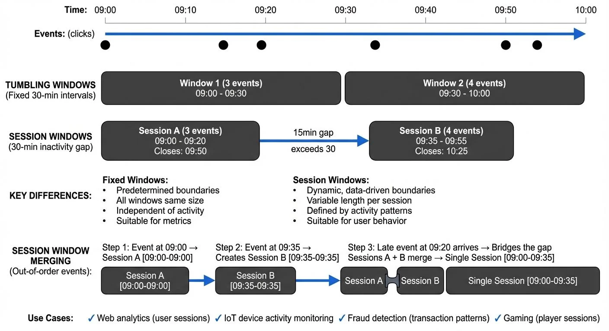

# Session Windows in Stream Processing

In stream processing, choosing the right windowing strategy determines how you aggregate and analyze continuous data streams. While tumbling and hopping windows operate on fixed time intervals, session windows take a fundamentally different approach by grouping events based on activity patterns. This makes them particularly valuable for tracking user behavior, monitoring device activity, and detecting anomalous patterns in real-time data streams.



<!-- ORIGINAL_DIAGRAM
```
┌──────────────────────────────────────────────────────────────────┐
│              SESSION WINDOWS vs FIXED WINDOWS                    │
├──────────────────────────────────────────────────────────────────┤
│                                                                  │
│  Time:    09:00   09:10   09:20   09:30   09:40   09:50   10:00 │
│           ──────────────────────────────────────────────────────▶│
│                                                                  │
│  Events:    ●       ●  ●           ●               ●      ●  ●   │
│  (clicks)                                                        │
│                                                                  │
│  TUMBLING WINDOWS (Fixed 30-min intervals)                      │
│  ┌─────────────────────────────┐ ┌─────────────────────────────┐│
│  │      Window 1 (3 events)    │ │      Window 2 (4 events)    ││
│  │   09:00 - 09:30             │ │   09:30 - 10:00             ││
│  └─────────────────────────────┘ └─────────────────────────────┘│
│                                                                  │
│  SESSION WINDOWS (30-min inactivity gap)                        │
│  ┌─────────────────┐                ┌──────────────────────────┐│
│  │   Session A     │                │      Session B           ││
│  │   (3 events)    │                │      (4 events)          ││
│  │  09:00 - 09:20  │   15min gap    │   09:35 - 09:55          ││
│  │  Closes: 09:50  │◀──exceeds 30───│   Closes: 10:25          ││
│  └─────────────────┘                └──────────────────────────┘│
│                                                                  │
│  KEY DIFFERENCES:                                                │
│                                                                  │
│  Fixed Windows:           Session Windows:                       │
│  • Predetermined boundaries   • Dynamic, data-driven boundaries  │
│  • All windows same size      • Variable length per session     │
│  • Independent of activity    • Defined by activity patterns    │
│  • Suitable for metrics       • Suitable for user behavior      │
│                                                                  │
│  SESSION WINDOW MERGING (Out-of-order events):                  │
│                                                                  │
│  Step 1: Event at 09:00 → Creates Session A [09:00-09:00]       │
│  Step 2: Event at 09:35 → Creates Session B [09:35-09:35]       │
│  Step 3: Late event at 09:20 arrives → Bridges the gap          │
│          Sessions A + B merge → Single Session [09:00-09:35]    │
│                                                                  │
│  Use Cases:                                                      │
│  ✓ Web analytics (user sessions)                                │
│  ✓ IoT device activity monitoring                               │
│  ✓ Fraud detection (transaction patterns)                       │
│  ✓ Gaming (player sessions)                                     │
└──────────────────────────────────────────────────────────────────┘
```
-->

## What Are Session Windows?

Session windows are dynamic, data-driven windows that group events together based on periods of activity separated by a configurable gap of inactivity. Unlike tumbling windows (fixed, non-overlapping intervals) or hopping windows (fixed, overlapping intervals), session windows have no predetermined start or end time. Instead, they close only after a specified period of inactivity occurs. For comprehensive coverage of all window types in Flink, see [Windowing in Apache Flink: Tumbling, Sliding, and Session Windows](https://conduktor.io/glossary/windowing-in-apache-flink-tumbling-sliding-and-session-windows).

The key parameter in session windowing is the **session gap** or **timeout duration**. When events from the same key arrive within this gap, they belong to the same session. If the gap exceeds the timeout, the current session closes and a new session begins with the next event.

For example, consider a website tracking user clicks. With a 30-minute session gap, if a user clicks at 2:00 PM, 2:15 PM, and 2:25 PM, all three clicks belong to one session. If their next click occurs at 3:10 PM (45 minutes after the last click), it starts a new session because the 30-minute gap was exceeded.

## How Session Windows Work

Session windows dynamically expand and contract based on incoming events. The stream processing engine maintains state for each key and tracks the timestamp of the last event. When a new event arrives:

1. The system checks if it falls within the session gap of the current session
2. If yes, it merges into the existing session and extends the session's end time
3. If no, the current session closes and triggers any downstream processing
4. A new session begins with the new event

This window merging behavior is crucial. Multiple session windows can merge when events arrive out of order. Consider this example with a 10-minute session gap:

1. Event at timestamp 10:00 arrives → Creates Window A [10:00 - 10:00], will close at 10:10
2. Event at timestamp 10:20 arrives → Creates Window B [10:20 - 10:20], will close at 10:30 (separate window, gap exceeded)
3. Event at timestamp 10:05 arrives late → Bridges the gap between Windows A and B
4. System merges Windows A + B → Single Window [10:00 - 10:20], will close at 10:30

This merging ensures logically connected events form a single session even when network delays cause out-of-order arrival.

### Technical Example

Consider IoT temperature sensors sending readings:

```
Sensor A: 09:00:00 (22°C)
Sensor A: 09:03:00 (23°C)
Sensor A: 09:06:00 (24°C)
Sensor A: 09:21:00 (22°C)  # New session starts
```

With a 10-minute session gap, the first three readings form one session (activity from 09:00-09:06). The fourth reading at 09:21 starts a new session because 15 minutes elapsed since the last reading, exceeding the 10-minute gap.

## Use Cases for Session Windows

### Web Analytics and User Behavior

Session windows naturally align with how we think about user sessions on websites or applications. E-commerce platforms use session windows to:

- Calculate average session duration
- Track conversion funnels within a single user visit
- Identify abandoned shopping carts (sessions ending without purchase)
- Measure engagement metrics per visit

A 30-minute session gap is common for web analytics, matching Google Analytics' default session timeout.

### IoT and Device Monitoring

Manufacturing equipment, connected vehicles, and smart devices often operate in bursts of activity followed by idle periods. Session windows help:

- Detect machine operational cycles
- Calculate active vs. idle time
- Identify unusual patterns (sessions too short or too long)
- Aggregate sensor readings during active periods

### Fraud Detection

Financial systems use session windows to detect suspicious patterns. Rapid sequences of transactions from the same account might indicate fraud if they occur within an unusually short session.

## Session Windows in Streaming Platforms

### Apache Kafka Streams

Kafka Streams provides native support for session windows through the `SessionWindows` class. Here's a basic implementation compatible with Kafka Streams 3.x+ (including Kafka 4.0):

```java
StreamsBuilder builder = new StreamsBuilder();
KStream<String, ClickEvent> clicks = builder.stream("user-clicks");

clicks
    .groupByKey()
    .windowedBy(SessionWindows
        .with(Duration.ofMinutes(30))
        .grace(Duration.ofMinutes(5)))  // Allow 5-minute grace period for late data
    .count()
    .toStream()
    .to("session-counts");
```

This code groups click events by user ID and creates session windows with a 30-minute inactivity gap. The `count()` aggregation calculates the number of clicks per session. The `grace()` method configures a grace period—additional time after the session gap expires during which late-arriving events can still be merged into the session. This is crucial for handling out-of-order data without indefinitely keeping session state.

### Apache Flink

Flink offers session windows through its `EventTimeSessionWindows` and `ProcessingTimeSessionWindows` classes. Here's an example compatible with Flink 1.13+ (including Flink 1.20):

```java
DataStream<Event> events = // source stream
events
    .keyBy(event -> event.getUserId())
    .window(EventTimeSessionWindows.withGap(Time.minutes(30)))
    .allowedLateness(Time.minutes(5))  // Accept late events for 5 minutes after watermark
    .reduce(new SessionAggregator())
    .addSink(new SessionSink());
```

Flink's implementation handles complex scenarios like window merging and late data with configurable allowed lateness. The `allowedLateness()` method keeps window state available for a specified duration after the watermark passes the window end, allowing late events to update already-emitted results. This trades increased state size for more complete results with out-of-order data.

## Challenges and Best Practices

### Choosing the Right Session Gap

The session gap significantly impacts results. Too short, and you fragment natural sessions. Too long, and you merge unrelated activities. The optimal gap depends on your domain:

- Web sessions: 15-30 minutes
- Mobile app sessions: 5-10 minutes
- IoT sensors: Seconds to minutes depending on expected activity patterns
- Financial transactions: Minutes to hours

Start with domain conventions and adjust based on observed data patterns.

### Handling Late-Arriving Data

Session windows are particularly sensitive to late data since late events can extend closed sessions or merge previously separate sessions. Most frameworks support allowed lateness windows:

- In Kafka Streams, use `grace()` to allow late data within a grace period
- In Flink, configure `allowedLateness()` on window operations

Understanding how watermarks track event time progression is crucial for accurate late data handling. For detailed coverage of watermarks and how they determine when windows can close, see [Watermarks and Triggers in Stream Processing](https://conduktor.io/glossary/watermarks-and-triggers-in-stream-processing) and [Event Time and Watermarks in Flink](https://conduktor.io/glossary/event-time-and-watermarks-in-flink).

### State Management

Session windows require maintaining state for each key until the session closes. For high-cardinality keys (many unique key values, such as individual user IDs or device IDs) or long session gaps, this can consume significant memory.

As a rough guideline, if you have 1 million concurrent active sessions with an average of 50 events per session and 100 bytes per event, you could expect approximately 5 GB of state (1M sessions × 50 events × 100 bytes). Actual state size depends on the data structures used, serialization format, and framework overhead.

Monitor state size and consider:

- Setting retention policies to prevent unbounded state growth
- Using RocksDB state backend (Kafka Streams, Flink) for larger-than-memory state
- Implementing session timeouts or maximum session durations

For deeper understanding of how Kafka Streams manages state for windowing operations, including state stores, changelog topics, and fault tolerance mechanisms, see [State Stores in Kafka Streams](https://conduktor.io/glossary/state-stores-in-kafka-streams).

### Monitoring and Observability

Understanding session window behavior in production requires proper monitoring. Track metrics like:

- Average session duration
- Session window state size
- Late arrival rates
- Window merge frequency

Modern observability practices for session windows (as of 2025) include:

- **Platform monitoring**: Tools like Conduktor provide [observability into Kafka Streams applications](https://docs.conduktor.io/guide/monitor-brokers-apps/index), allowing you to monitor session window state stores, track lag, and debug window behavior in production environments
- **OpenTelemetry integration**: Instrument session window operations with distributed tracing to track event flow through windowing logic, measure latency, and correlate window closures with downstream processing
- **Kafka 4.0 metrics**: Leverage improved metrics APIs in Kafka 4.0 for granular monitoring of window state store sizes, compaction rates, and restoration times
- **Consumer lag monitoring**: Track windowed consumer group lag to detect processing bottlenecks. For comprehensive lag monitoring strategies, see [Consumer Lag Monitoring](https://conduktor.io/glossary/consumer-lag-monitoring)

## Session Windows and Data Streaming Architecture

Session windows are a core building block in modern streaming architectures built on Apache Kafka, Apache Flink, or Apache Pulsar. They enable stateful stream processing that respects natural data patterns rather than imposing artificial time boundaries.

In a typical architecture, session windows integrate with:

- **Event time processing**: Using event timestamps rather than processing time ensures accurate sessions even with delayed data
- **Watermarks**: Flink's watermark mechanism helps determine when sessions can safely close
- **State stores**: Persistent state backends enable recovery after failures
- **Changelog topics**: Kafka Streams backs session window state with changelog topics (internal Kafka topics that durably persist all state changes) for fault tolerance

Session windows also interact with other streaming concepts like exactly-once semantics, compaction, and retention policies. For instance, session window results often feed into compacted topics where only the latest session state matters.

Testing session window logic requires strategies for handling time progression, out-of-order events, and window merging behavior. For comprehensive testing approaches including unit testing with time manipulation and integration testing with embedded clusters, see [Testing Strategies for Streaming Applications](https://conduktor.io/glossary/testing-strategies-for-streaming-applications).

## Summary

Session windows provide a dynamic, data-driven approach to windowing in stream processing, grouping events based on activity patterns rather than fixed time intervals. They excel in use cases involving user behavior, device monitoring, and pattern detection where natural sessions have variable durations.

The key to effective session windows lies in choosing appropriate session gaps, handling late data correctly, and managing state efficiently. Both Apache Kafka Streams and Apache Flink offer robust implementations with features like window merging, allowed lateness, and fault-tolerant state management.

As real-time analytics and streaming architectures continue to evolve, session windows remain essential for capturing meaningful patterns in continuous data streams. Understanding when and how to apply them distinguishes simple event processing from sophisticated behavioral analysis.

## Related Concepts

- [Windowing in Apache Flink](https://conduktor.io/glossary/windowing-in-apache-flink-tumbling-sliding-and-session-windows) - Comprehensive guide to all window types including session windows in Flink
- [Watermarks and Triggers in Stream Processing](https://conduktor.io/glossary/watermarks-and-triggers-in-stream-processing) - How watermarks determine session window boundaries and trigger closures
- [Real-Time Analytics with Streaming Data](https://conduktor.io/glossary/real-time-analytics-with-streaming-data) - Applying session windows for user behavior analytics and metrics

## Sources and References

1. **Apache Kafka Documentation**: Streams DSL - Windowing. [https://kafka.apache.org/documentation/streams/](https://kafka.apache.org/documentation/streams/) - Official documentation covering session windows in Kafka Streams with detailed API references.

2. **Apache Flink Documentation**: Windows. [https://nightlies.apache.org/flink/flink-docs-stable/docs/dev/datastream/operators/windows/](https://nightlies.apache.org/flink/flink-docs-stable/docs/dev/datastream/operators/windows/) - Comprehensive guide to Flink's windowing mechanisms including session windows.

3. **Confluent**: Windowing in Kafka Streams. [https://www.confluent.io/](https://www.confluent.io/) - Technical articles and tutorials on practical implementation of session windows.

4. **Kleppmann, Martin**: "Designing Data-Intensive Applications" (O'Reilly, 2017) - Chapter on stream processing fundamentals including windowing strategies.

5. **Google Analytics**: About Sessions. [https://support.google.com/analytics/](https://support.google.com/analytics/) - Industry standard for web session definition, providing context for session timeout conventions.
