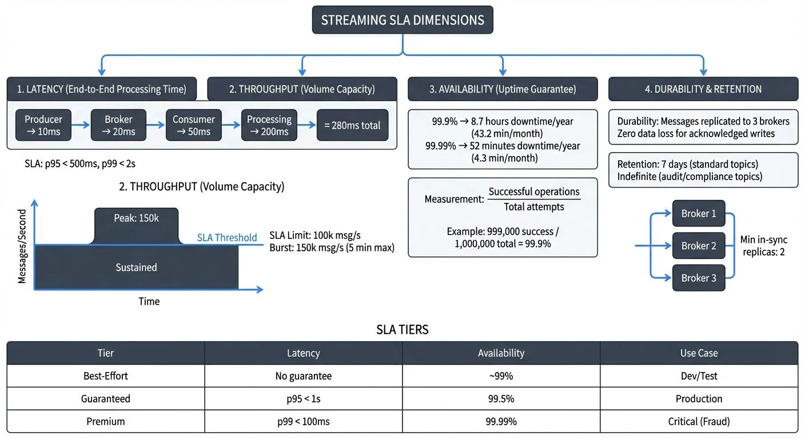

# SLAs for Streaming: Defining and Measuring Real-Time Guarantees

## Introduction to Streaming SLAs

In the world of real-time data processing, **Service Level Agreements (SLAs)** define the commitments and expectations around streaming system performance. Unlike traditional batch processing where jobs run on schedules and delays are measured in hours, streaming SLAs focus on continuous operation with guarantees measured in milliseconds or seconds.

A streaming SLA is a formal agreement that specifies the expected quality of service for data streaming infrastructure. It answers critical questions: How fast will messages be delivered? What happens if the system fails? How long will data be retained? These commitments become especially critical in regulated industries like banking, healthcare, and telecommunications, where data latency can have financial, legal, or safety implications.

The fundamental difference between streaming and batch SLAs lies in the **continuous nature** of the commitment. While a batch job SLA might guarantee completion within 4 hours once per day, a streaming SLA must maintain its promises 24/7, across millions of messages, with no scheduled downtime windows.



<!-- ORIGINAL_DIAGRAM
```
┌──────────────────────────────────────────────────────────────────┐
│                 STREAMING SLA DIMENSIONS                         │
├──────────────────────────────────────────────────────────────────┤
│                                                                  │
│  1. LATENCY (End-to-End Processing Time)                        │
│  ┌────────────────────────────────────────────────────────────┐ │
│  │ Producer → Broker → Consumer → Processing                  │ │
│  │    10ms     20ms      50ms        200ms    = 280ms total   │ │
│  │                                                            │ │
│  │ SLA: p95 < 500ms, p99 < 2s                                │ │
│  └────────────────────────────────────────────────────────────┘ │
│                                                                  │
│  2. THROUGHPUT (Volume Capacity)                                │
│  ┌────────────────────────────────────────────────────────────┐ │
│  │                  Messages/Second                           │ │
│  │  ▲                                                         │ │
│  │  │  ┌──────────────────┐                                  │ │
│  │  │  │   Peak: 150k     │  SLA Limit: 100k msg/s           │ │
│  │  │  │                  │  Burst: 150k msg/s (5 min max)   │ │
│  │  │──┤                  ├─────────────────── SLA Threshold │ │
│  │  │  │   Sustained      │                                  │ │
│  │  │  └──────────────────┘                                  │ │
│  │  │                                                         │ │
│  │  └──────────────────────────────────────────────────────▶  │ │
│  │                       Time                                 │ │
│  └────────────────────────────────────────────────────────────┘ │
│                                                                  │
│  3. AVAILABILITY (Uptime Guarantee)                             │
│  ┌────────────────────────────────────────────────────────────┐ │
│  │  99.9%  → 8.7 hours downtime/year  (43.2 min/month)       │ │
│  │  99.99% → 52 minutes downtime/year (4.3 min/month)        │ │
│  │                                                            │ │
│  │  Measurement: Successful operations / Total attempts      │ │
│  │  Example: 999,000 success / 1,000,000 total = 99.9%       │ │
│  └────────────────────────────────────────────────────────────┘ │
│                                                                  │
│  4. DURABILITY & RETENTION                                      │
│  ┌────────────────────────────────────────────────────────────┐ │
│  │  Durability: Messages replicated to 3 brokers             │ │
│  │              Zero data loss for acknowledged writes        │ │
│  │                                                            │ │
│  │  Retention:  7 days (standard topics)                     │ │
│  │              Indefinite (audit/compliance topics)          │ │
│  │                                                            │ │
│  │  ┌──────┐  ┌──────┐  ┌──────┐                            │ │
│  │  │Broker│  │Broker│  │Broker│   Min in-sync replicas: 2  │ │
│  │  │  1   │  │  2   │  │  3   │                            │ │
│  │  └──────┘  └──────┘  └──────┘                            │ │
│  └────────────────────────────────────────────────────────────┘ │
│                                                                  │
│  SLA TIERS:                                                     │
│  ┌────────────┬─────────────┬──────────────┬─────────────────┐ │
│  │ Tier       │ Latency     │ Availability │ Use Case        │ │
│  ├────────────┼─────────────┼──────────────┼─────────────────┤ │
│  │ Best-Effort│ No guarantee│ ~99%         │ Dev/Test        │ │
│  │ Guaranteed │ p95 < 1s    │ 99.5%        │ Production      │ │
│  │ Premium    │ p99 < 100ms │ 99.99%       │ Critical (Fraud)│ │
│  └────────────┴─────────────┴──────────────┴─────────────────┘ │
└──────────────────────────────────────────────────────────────────┘
```
-->

## Core SLA Dimensions for Streaming

Streaming SLAs encompass multiple dimensions, each addressing a different aspect of system performance:

### Latency Guarantees

**End-to-end latency** measures the time from when a producer publishes a message until a consumer successfully processes it. This includes network transmission, broker processing, consumer polling, and application logic. Organizations typically commit to latency targets like "95% of messages processed within 500ms" or "99th percentile latency under 2 seconds."

Latency SLAs must account for the entire pipeline, not just individual components. A message might spend 10ms in the broker, 50ms in network transit, and 200ms in consumer processing—each contributing to the total latency that matters to end users. For detailed guidance on tracking data freshness and latency as part of SLA management, see [Data Freshness Monitoring and SLA Management](https://conduktor.io/glossary/data-freshness-monitoring-sla-management).

### Throughput Commitments

**Throughput** defines the volume of data the system can handle, typically measured in messages per second or megabytes per second. A throughput SLA might guarantee "support for 100,000 messages/second during peak hours" or "handle 500 MB/s sustained ingestion."

Throughput SLAs protect against system overload and ensure adequate capacity for business operations. They often include provisions for burst capacity—temporarily handling higher loads—and degradation policies when limits are exceeded.

### Availability Targets

**Availability** measures the percentage of time the streaming system is operational and accepting data. Common targets include 99.9% uptime (roughly 8.7 hours of downtime per year) or 99.99% (52 minutes annually).

For streaming systems, availability means more than just "the broker is running." It includes the ability to publish messages, consume them, and maintain topic metadata. Partial outages—where some topics work but others don't—must be factored into availability calculations.

With **Kafka 4.0's KRaft architecture** (removing ZooKeeper dependency), availability SLAs become simpler to guarantee and monitor. KRaft eliminates an entire failure domain—the separate ZooKeeper ensemble—reducing the "infrastructure is running but metadata is inaccessible" failure mode that complicated traditional Kafka availability calculations. This architectural improvement makes it easier to achieve and verify high-availability targets. For details on KRaft's benefits, see [Understanding KRaft Mode in Kafka](https://conduktor.io/glossary/understanding-kraft-mode-in-kafka).

### Durability and Retention

**Durability** guarantees that once acknowledged, messages will not be lost. This typically involves replication across multiple brokers and acknowledgment policies. An SLA might state "messages replicated to 3 brokers before acknowledgment" or "zero data loss for acknowledged writes."

**Retention** specifies how long data remains available for consumption. Retention SLAs are crucial for replay scenarios, regulatory compliance, and debugging. For example: "7 days retention for all topics" or "indefinite retention for audit topics."

## Measuring and Monitoring SLA Metrics

Effective SLA enforcement requires precise measurement and continuous monitoring. The key is selecting metrics that accurately reflect user experience rather than just system internals.

### Percentile-Based Latency

Simple averages obscure the user experience. A system with 50ms average latency might have a 99th percentile of 5 seconds, meaning 1% of users experience terrible performance. **Percentile metrics** (p50, p95, p99, p999) provide a complete latency picture:

- **p50 (median)**: Half of requests are faster
- **p95**: 95% of requests meet this threshold
- **p99**: Captures outliers affecting 1 in 100 requests
- **p999**: Extreme outliers, critical for high-volume systems

**Concrete example**: In a system processing 1 million messages per hour, a p99 < 100ms target means 990,000 messages complete within 100ms, while up to 10,000 messages may take longer. For critical applications, this means understanding that even with excellent p99 performance, some requests will exceed targets—requiring careful SLA design and error handling.

Most organizations commit to p95 or p99 latencies, balancing user experience with achievability. Banking systems might target p99 < 100ms, while analytics pipelines might accept p95 < 5s.

### Uptime Calculations

Availability percentage seems simple but requires careful definition. Does a 30-second broker restart count as downtime if producers buffer messages successfully? Does slow performance (violating latency SLAs) count as unavailable?

The industry-standard approach measures **successful operations over total attempts**. If 999,000 out of 1,000,000 publish attempts succeed, that's 99.9% availability. This focuses on user impact rather than infrastructure state.

### Throughput Tracking

Throughput monitoring must cover both **current usage** and **capacity limits**. Tracking messages/second and bytes/second provides early warning when approaching SLA limits. Many systems implement "headroom alerts" that trigger at 80% of committed throughput, allowing proactive scaling.

### Data Loss Detection

Durability SLAs require detecting lost messages. Techniques include:

- **End-to-end checksums**: Comparing published vs consumed message counts
- **Sequence number gaps**: Detecting missing messages in ordered streams
- **Reconciliation processes**: Periodic audits comparing source and destination
- **Replication lag monitoring**: Ensuring replicas stay synchronized

## Defining Realistic SLAs

Creating achievable yet meaningful SLAs requires balancing business needs, technical capabilities, and costs.

### SLA Tiers

Many organizations implement **tiered SLAs** to match guarantees with importance:

**Best-effort**: No specific guarantees. Suitable for non-critical analytics, experimental pipelines, or development environments. System operates reliably but without contractual obligations.

**Guaranteed**: Explicit commitments with monitoring and alerting. For example: 99.5% availability, p95 latency < 1s, 3-day retention. Covers most production workloads.

**Premium**: Strictest guarantees for critical systems. For example: 99.99% availability, p99 latency < 100ms, indefinite retention, dedicated capacity. Used for payment processing, fraud detection, real-time trading.

### Producer-Side vs Consumer-Side SLAs

SLAs can focus on different stakeholders:

**Producer-side SLAs** guarantee the platform will accept and persist data. Example: "Publish API will acknowledge 99.99% of valid messages within 50ms." This protects producers from platform failures.

**Consumer-side SLAs** ensure data availability for consumption. Example: "Messages available for consumption within 500ms of publication." This guarantees timely access to data.

Comprehensive SLAs address both sides, creating end-to-end commitments.

### Internal vs External Contracts

**Internal SLAs** govern platform teams providing streaming infrastructure to application teams within the same organization. These are often more flexible, allowing renegotiation as needs evolve.

**External contracts** with customers or vendors carry legal weight. A fintech company might contractually commit to processing payment events within 200ms. These require conservative targets with safety margins.

## SLA Compliance and Breach Management

Defining SLAs is only the beginning. Organizations must continuously monitor compliance and respond effectively to violations.

### Continuous Monitoring

Modern streaming platforms implement **real-time SLA monitoring** through:

- **Embedded metrics**: Brokers, producers, and consumers expose latency, throughput, and error metrics
- **Distributed tracing**: Following individual messages through the entire pipeline to identify bottlenecks (see [Distributed Tracing for Kafka Applications](https://conduktor.io/glossary/distributed-tracing-for-kafka-applications))
- **Synthetic monitoring**: Test messages sent through the system to verify end-to-end functionality
- **Consumer lag tracking**: Monitors how far behind consumers are in processing messages (see [Consumer Lag Monitoring](https://conduktor.io/glossary/consumer-lag-monitoring))

**Modern SLA Monitoring Tools (2025):**

Leading platforms for comprehensive Kafka SLA monitoring include:

- **Conduktor**: Enterprise platform providing real-time SLA tracking dashboards, consumer lag visualization, latency percentile monitoring, and alerting for SLA breaches. [Monitor brokers and applications](https://docs.conduktor.io/guide/monitor-brokers-apps/index) with comprehensive SLA compliance reporting and historical trend analysis through the [Insights Dashboard](https://docs.conduktor.io/guide/insights/index).
- **Kafka Lag Exporter**: Open-source tool that exports consumer group lag metrics to Prometheus, enabling percentile-based SLA tracking and alerting through Grafana dashboards.
- **Prometheus + Grafana**: Industry-standard metrics collection and visualization stack with pre-built Kafka dashboards for tracking broker performance, consumer lag, and end-to-end latency.
- **JMX Exporters**: Extract detailed JVM and Kafka-specific metrics from brokers and clients for comprehensive SLA monitoring across all system components.

These tools integrate with alerting systems to notify teams immediately when SLA thresholds are approached or breached.

### Alerting for Breaches

SLA breach alerts must be **actionable and prioritized**. Not every minor violation requires waking an engineer at 3 AM. Common approaches:

- **Severity levels**: P1 for customer-facing SLA breaches, P2 for approaching thresholds, P3 for internal SLA violations
- **Duration thresholds**: Alert only if violation persists for 5+ minutes, avoiding noise from transient issues
- **Error budgets**: Define acceptable downtime allowances (e.g., 99.9% uptime allows 43 minutes monthly downtime). Track cumulative violations over time, alerting when the budget is being consumed rapidly or nearly exhausted

### Remediation Strategies

When SLA breaches occur, teams need predefined response plans:

- **Automated scaling**: Increase capacity when throughput approaches limits
- **Traffic shedding**: Drop low-priority messages (prioritizing critical flows) to protect system stability
- **Failover**: Route traffic to standby clusters or regions
- **Rollback**: Revert recent changes causing performance degradation
- **Communication**: Notify affected consumers about degraded service

Organizations should regularly test these remediation strategies through chaos engineering practices to validate SLA resilience. For comprehensive testing approaches, see [Chaos Engineering for Streaming Systems](https://conduktor.io/glossary/chaos-engineering-for-streaming-systems).

## Reporting and Governance

SLAs connect technical operations to business governance, requiring visibility and accountability.

### Dashboards and Reporting

Effective SLA reporting provides multiple audiences with relevant views:

- **Executive dashboards**: Monthly uptime percentages, SLA compliance rates, trend analysis
- **Operational dashboards**: Real-time latency percentiles, current throughput vs capacity, active alerts
- **Consumer portals**: Per-topic SLA metrics, allowing teams to verify their data feeds meet commitments

For broader context on monitoring streaming data quality and performance, see [What is Data Observability: The Five Pillars](https://conduktor.io/glossary/what-is-data-observability-the-five-pillars).

### Integration with Data Contracts

Governance platforms integrate SLAs into **data contracts**—formal agreements about data structure, quality, and delivery guarantees. Modern platforms like Conduktor and data catalog tools allow teams to codify SLA commitments as machine-readable contracts. For comprehensive coverage of data contracts, see [Data Contracts for Reliable Pipelines](https://conduktor.io/glossary/data-contracts-for-reliable-pipelines).

Here's an example of how SLAs are specified in a data contract:

```yaml
topic: payment-events
schema: payment-v2.avro
sla:
  latency_p95: 200ms
  availability: 99.9%
  retention: 30days
  durability: ack-all-replicas
```

This codifies expectations and enables automated compliance checking, with monitoring tools validating actual performance against these declared SLA targets.

### Data Products and SLAs

When streaming data is packaged as **data products**—self-contained datasets with clear ownership and SLAs—streaming guarantees become product features. The payment-events product promises specific latency and availability, just like an API promises response times. For comprehensive guidance on building data products with built-in SLA guarantees, see [Building and Managing Data Products](https://conduktor.io/glossary/building-and-managing-data-products).

This shift elevates streaming infrastructure from invisible plumbing to managed services with clear value propositions.

### Audit Trails

Compliance and regulatory requirements often demand proof of SLA adherence. Organizations maintain:

- **Historical metrics**: Timestamped latency, throughput, and availability data
- **Incident logs**: Documented breaches with root causes and remediation
- **Configuration history**: Changes to SLA targets and infrastructure
- **Exception records**: Approved maintenance windows excluded from SLA calculations

For comprehensive audit logging practices that support SLA compliance verification, see [Audit Logging for Streaming Platforms](https://conduktor.io/glossary/audit-logging-for-streaming-platforms).

## Conclusion

Streaming SLAs transform real-time data platforms from best-effort systems into reliable, predictable infrastructure that business operations can depend on. By defining clear commitments across latency, throughput, availability, and durability, organizations create accountability and enable data-driven decision-making with confidence.

**Best practices for streaming SLAs include:**

- Start with achievable targets based on actual system performance, then tighten as capabilities improve
- Measure what matters to users (end-to-end latency) not just infrastructure metrics (broker CPU)
- Implement tiered SLAs to match guarantees with criticality and cost
- Automate monitoring and alerting to catch breaches before users notice
- Integrate SLAs into data contracts and governance frameworks
- Maintain transparency through dashboards and regular reporting
- Plan for failures with clear remediation procedures and communication protocols

As streaming systems mature and become central to business operations, SLA requirements will continue to evolve. Organizations that invest in robust SLA frameworks today position themselves to meet tomorrow's demands for faster, more reliable, and more compliant real-time data processing.

The difference between a streaming platform and a **trusted streaming platform** often comes down to one thing: keeping your promises. SLAs are how you make—and measure—those promises.

## Related Concepts

- [Data Freshness Monitoring and SLA Management](https://conduktor.io/glossary/data-freshness-monitoring-sla-management) - Tracking data timeliness as part of SLA compliance
- [Consumer Lag Monitoring](https://conduktor.io/glossary/consumer-lag-monitoring) - Key metric for streaming SLA validation
- [Kafka Cluster Monitoring and Metrics](https://conduktor.io/glossary/kafka-cluster-monitoring-and-metrics) - Infrastructure metrics supporting SLA tracking

## Sources and References

- [Apache Kafka Monitoring and Metrics](https://kafka.apache.org/documentation/#monitoring) - Official Kafka metrics and monitoring guidelines
- [Google SRE Book: Service Level Objectives](https://sre.google/sre-book/service-level-objectives/) - Foundational concepts for SLA/SLO management
- [Site Reliability Engineering Workbook](https://sre.google/workbook/implementing-slos/) - Practical implementation of SLOs and error budgets
- [Conduktor Platform](https://www.conduktor.io/) - Enterprise Kafka monitoring with comprehensive SLA tracking and compliance reporting
- [Kafka Lag Exporter](https://github.com/seglo/kafka-lag-exporter) - Open-source consumer lag metrics for SLA monitoring
- [Prometheus Kafka Exporter](https://github.com/danielqsj/kafka_exporter) - JMX metrics collection for Kafka SLA monitoring
- [Grafana Kafka Dashboards](https://grafana.com/grafana/dashboards/) - Pre-built visualization dashboards for Kafka SLA metrics
