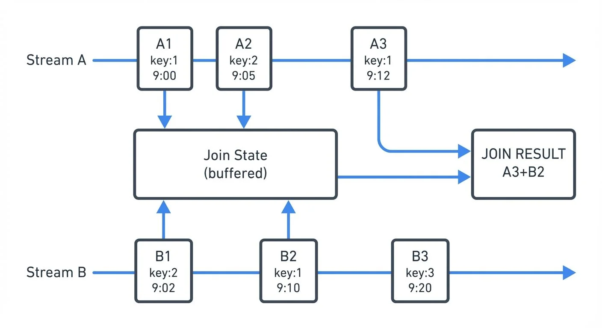
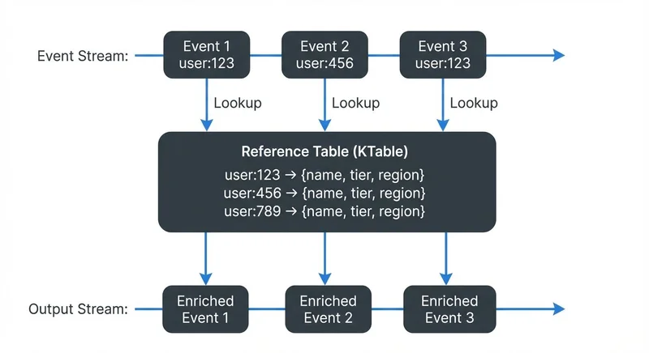

# Stream Joins and Enrichment Patterns

Real-time data processing often requires combining information from multiple sources. A single event stream rarely contains all the context needed for meaningful analysis or decision-making. Stream joins and enrichment patterns solve this challenge by correlating data across streams and augmenting events with additional information in real-time.

Understanding these patterns is essential for building robust streaming applications that deliver timely, contextualized insights. Whether you're enriching clickstream data with user profiles, correlating sensor readings, or joining transaction events with fraud detection signals, mastering stream joins is fundamental to effective stream processing. For foundational knowledge of the underlying platform, see [Apache Kafka](https://conduktor.io/glossary/apache-kafka).

## Key Concepts

Before exploring join patterns, it's important to understand the fundamental abstractions used in stream processing:

**KStream (Event Stream)**: An unbounded sequence of events where each record is a new, independent event. Multiple records with the same key represent separate occurrences. Example: clickstream events, transactions, sensor readings.

**KTable (Changelog Stream)**: Represents the latest state for each key, like a database table. New records with the same key update the previous value. Only the current state matters. Example: user profiles, product catalog, account balances.

These abstractions determine which join patterns apply. Stream-to-stream joins correlate independent events, while stream-to-table joins enrich events with current reference data.

## Types of Stream Joins

Stream processing frameworks support several join types, each suited to different use cases and data characteristics.

### Stream-to-Stream Joins

Stream-to-stream joins correlate events from two unbounded data streams based on matching keys and time windows. Unlike batch joins, both inputs are continuously flowing, requiring the framework to maintain state for events within a time window.



<!-- ORIGINAL_DIAGRAM
```
         Stream-to-Stream Join (10-minute window)

Stream A:  ─┬─────┬──────┬────────┬─────────▶
            │ A1  │  A2  │   A3   │
            │key:1│ key:2│  key:1 │
            │9:00 │ 9:05 │  9:12  │
            │     │      │        │
            ▼     ▼      │        ▼
         ┌──────────────┐│    ┌────────┐
         │  Join State  ││    │  JOIN  │
         │ (buffered)   ││    │ RESULT │
         └──────────────┘│    │ A3+B2  │
            ▲            │    └────────┘
            │     ┌──────┘
            │     │
Stream B:  ─┴─────┴──────┴────────┴─────────▶
            │ B1  │  B2  │   B3   │
            │key:2│ key:1│  key:3 │
            │9:02 │ 9:10 │  9:20  │
```
-->

**Inner joins** emit results only when matching events exist in both streams within the time window. **Left joins** emit all events from the left stream, with null values when no match exists in the right stream. **Outer joins** emit events from both streams, filling nulls when matches don't exist.

The time window determines how long the system waits for matching events. A 10-minute window means events with the same key must arrive within 10 minutes of each other to join successfully.

### Stream-to-Table Joins

Stream-to-table joins enrich stream events with the latest state from a table (changelog stream). The table represents the current snapshot of reference data, continuously updated as change events arrive.



<!-- ORIGINAL_DIAGRAM
```
         Stream-to-Table Join (Enrichment)

Event Stream:  ─┬────────┬────────┬────────▶
                │Event 1 │Event 2 │Event 3 │
                │user:123│user:456│user:123│
                │        │        │        │
                └────┬───┴────┬───┴────┬───┘
                     │        │        │
                     │ Lookup │ Lookup │ Lookup
                     ▼        ▼        ▼
         ┌──────────────────────────────────┐
         │     Reference Table (KTable)     │
         ├──────────────────────────────────┤
         │ user:123 → {name, tier, region} │
         │ user:456 → {name, tier, region} │
         │ user:789 → {name, tier, region} │
         └──────────────────────────────────┘
                     │        │        │
                     ▼        ▼        ▼
Output Stream: ─────┴────────┴────────┴────▶
                Enriched   Enriched   Enriched
                Event 1    Event 2    Event 3
```
-->

This pattern is ideal for enrichment scenarios where stream events need contextual information from slowly changing dimensions. For example, enriching order events with current customer profile data, or adding product information to clickstream events.

The table side maintains only the latest value per key, while the stream side flows through. Each stream event triggers a lookup against the current table state, producing an enriched output event.

### Temporal Join Semantics

Temporal semantics define which version of data gets joined. **Processing-time joins** use whatever data is available when the join operation executes. **Event-time joins** use the timestamp embedded in the events themselves, ensuring deterministic results regardless of when processing occurs.

Consider a concrete example: An order event with timestamp 10:00 AM joins with a user profile. If the profile was updated at 10:05 AM:
- **Processing-time join**: Uses the profile state available when the order is processed (could be the 10:05 AM version if processing is delayed)
- **Event-time join**: Uses the profile state that existed at 10:00 AM (the order's event time), ensuring the join reflects what was true when the order actually occurred

Event-time semantics provide correctness guarantees and reproducibility even with late-arriving or out-of-order data, making them preferable for most production scenarios. Processing-time joins are simpler but sacrifice reproducibility - reprocessing historical data produces different results.

## Enrichment Patterns in Practice

### Lookup Enrichment

The most common pattern involves enriching fast-moving event streams with reference data from slower-changing tables. A user activity stream might be enriched with user demographics, device information, or account tier details.

```java
// Kafka Streams example: Enrich clicks with user profiles
KStream<String, ClickEvent> clicks = builder.stream("clicks");
KTable<String, UserProfile> profiles = builder.table("user-profiles");

KStream<String, EnrichedClick> enriched = clicks
    .leftJoin(profiles, (click, profile) -> {
        return new EnrichedClick(click, profile);
    });
```

The pattern maintains user profiles as a KTable backed by a compacted Kafka topic (a topic configured to retain only the latest value per key). Each click event joins against the current profile state, producing an enriched event with combined information.

### Bidirectional Stream Correlation

Some scenarios require correlating events from two active streams. Fraud detection might join payment initiation events with payment authorization events, matching them within a time window to detect anomalies.

```java
// Kafka Streams: Join payment streams with time window
KStream<String, PaymentInit> initStream = builder.stream("payment-init");
KStream<String, PaymentAuth> authStream = builder.stream("payment-auth");

KStream<String, PaymentCorrelation> correlated = initStream
    .join(authStream,
        (init, auth) -> new PaymentCorrelation(init, auth),
        JoinWindows.ofTimeDifferenceWithNoGrace(Duration.ofMinutes(5))
    );
```

This pattern requires maintaining state for both streams within the join window, consuming more memory than stream-to-table joins. The join window determines how far apart in time two events can be and still match - in this case, payment initialization and authorization must occur within 5 minutes of each other.

### Multi-Step Enrichment

Complex scenarios may require multiple enrichment steps, creating a pipeline of joins. An order event might first be enriched with customer data, then with product details, then with inventory status.

Chain these operations carefully to avoid excessive state and latency. Each join step adds processing time and state storage requirements.

## Windowing and Time Semantics

Time windows are fundamental to stream joins, defining how long the system retains events waiting for matches. Understanding windowing is critical for designing correct join logic.

### Tumbling Windows

Tumbling windows divide time into fixed, non-overlapping intervals. A 1-hour tumbling window creates distinct buckets: 00:00-01:00, 01:00-02:00, etc. Events within the same window can join, but events in adjacent windows cannot.

### Sliding Windows

Sliding windows define a time range relative to each event. A 10-minute sliding window means an event at 12:05:00 can join with events from 11:55:00 to 12:15:00. This is the most common window type for stream-to-stream joins.

### Session Windows

Session windows group events by periods of activity separated by inactivity gaps. These are useful for user session analysis but less common for joins. For detailed coverage of session-based processing, see [Session Windows in Stream Processing](https://conduktor.io/glossary/session-windows-in-stream-processing).

For comprehensive window patterns in Flink, see [Windowing in Apache Flink: Tumbling, Sliding, and Session Windows](https://conduktor.io/glossary/windowing-in-apache-flink-tumbling-sliding-and-session-windows).

### Choosing Window Sizes

Window size directly impacts both correctness and resource usage. Consider these factors:

**Business requirements**: How far apart can related events occur? Payment authorization typically happens within seconds to minutes of initiation, while click-to-conversion might span hours or days.

**Resource constraints**: Larger windows require more state storage. A 1-hour window with 10,000 events/second buffers ~36 million events. A 10-minute window buffers only 6 million events - a 6x reduction in memory/disk requirements.

**Latency tolerance**: Longer windows delay results. If you need real-time alerts, use shorter windows (seconds to minutes). For analytical workloads, longer windows (hours) are acceptable.

**Practical starting points**:
- **Real-time correlation** (fraud detection, system monitoring): 1-5 minutes
- **User session analysis**: 15-30 minutes
- **Click-to-conversion tracking**: 1-24 hours
- **IoT sensor correlation**: 5-30 seconds

Start conservative (shorter windows) and expand based on observed event timing patterns in your data.

### Late Data Handling

Real-world streams produce late-arriving events due to network delays, system failures, or mobile devices coming back online. **Watermarks** track the progress of event time, acting as a signal that "event time has progressed to timestamp T, so all earlier events have likely arrived." This allows systems to trigger joins while accounting for expected lateness.

**Grace periods** extend how long the system accepts late data after a window closes. For example, with a 10-minute join window and a 2-minute grace period, an event arriving 11 minutes after its timestamp will still be processed (within grace), but one arriving after 12 minutes will be dropped as too late.

Balancing completeness (accepting late data) with latency (closing windows quickly) is a key operational consideration. For deep dive into watermark strategies and late data handling, see [Watermarks and Triggers in Stream Processing](https://conduktor.io/glossary/watermarks-and-triggers-in-stream-processing).

## Implementation with Kafka Streams and Flink

### Kafka Streams

Kafka Streams (Kafka 3.x+) provides a high-level DSL for joins with automatic state management and fault tolerance. The framework handles state store creation, changelog topics for recovery, and partitioning requirements.

Key considerations:
- Join inputs must be co-partitioned (same number of partitions, same partitioning key) - this means both input topics must have identical partitioning schemes so matching keys end up on the same processing instance
- State stores consume local disk and memory, with RocksDB-based stores providing efficient disk-backed storage
- Changelog topics enable state recovery but increase storage costs
- With Kafka 4.0+ and KRaft mode (ZooKeeper-free), cluster rebalancing during joins is faster and more predictable, reducing join disruption. For migration details, see [Understanding KRaft Mode in Kafka](https://conduktor.io/glossary/understanding-kraft-mode-in-kafka)

Modern Kafka Streams features (3.x+) include versioned state stores, which allow querying historical join state, and improved grace period handling for more flexible late-data processing.

### Apache Flink

Flink (1.13+) offers powerful join operators with flexible time window options and custom join logic support. Flink excels at complex temporal joins with sophisticated watermark strategies and exactly-once processing guarantees.

Flink provides both DataStream API (imperative) and Table API/SQL (declarative) approaches for joins. The SQL approach is particularly powerful for complex join logic:

```sql
-- Flink SQL: Stream-to-stream join with interval
SELECT
  o.order_id,
  o.amount,
  p.payment_status
FROM orders o
JOIN payments p
  ON o.order_id = p.order_id
  AND p.payment_time BETWEEN o.order_time - INTERVAL '5' MINUTE
                          AND o.order_time + INTERVAL '5' MINUTE;
```

For Flink-specific patterns and watermark strategies, see [What is Apache Flink: Stateful Stream Processing](https://conduktor.io/glossary/what-is-apache-flink-stateful-stream-processing) and [Event Time and Watermarks in Flink](https://conduktor.io/glossary/event-time-and-watermarks-in-flink).

### Choosing Between Frameworks

Kafka Streams integrates tightly with Kafka and simplifies deployment (standard Java applications). Flink provides more advanced features like iterative processing, complex event processing, and better SQL support. Both handle joins effectively for most use cases.

## Challenges and Best Practices

### State Management

Joins require maintaining state for events within time windows. State stores are local databases (typically RocksDB) that hold buffered events waiting for matches. Large windows or high-throughput streams create significant state storage requirements. For example, a 1-hour join window on a stream with 10,000 events/second might buffer millions of events, requiring several GB of storage.

Monitor state store size and tune retention policies to balance completeness with resource usage. RocksDB-based state stores (used by both Kafka Streams and Flink) provide disk-backed storage for large state with memory caching for performance.

For Kafka Streams specifically, state stores are backed by changelog topics for fault tolerance, enabling recovery after failures. For detailed state management patterns, see [State Stores in Kafka Streams](https://conduktor.io/glossary/state-stores-in-kafka-streams).

### Data Skew

Uneven key distribution causes some partitions to handle disproportionate load. A celebrity user ID or popular product might generate far more events than others, creating hotspots.

Mitigation strategies include key salting (adding randomness to keys), increasing parallelism, or redesigning partitioning strategies.

### Schema Evolution

As systems evolve, data schemas change. Joins between streams with different schema versions can fail. Use schema registries to manage compatibility and version schemas explicitly. Tools like Conduktor provide visualization of schema dependencies across joined streams through [topic management](https://docs.conduktor.io/guide/manage-kafka/kafka-resources/topics), making it easier to identify compatibility issues before they cause runtime failures. For detailed schema management strategies, see [Schema Registry and Schema Management](https://conduktor.io/glossary/schema-registry-and-schema-management).

### Join Ordering

When enriching with multiple tables, join order affects performance and state requirements. Join with smaller tables first to reduce intermediate data volume.

### Testing

Stream joins are harder to test than batch joins due to time semantics and state. Use test frameworks that support time manipulation (Kafka Streams TopologyTestDriver, Flink testing utilities) to verify join behavior with controlled event sequences.

For integration testing and chaos engineering, Conduktor Gateway can simulate network delays, message reordering, and partition failures to verify join behavior under adverse conditions. This helps validate that your watermark strategies and grace periods handle real-world scenarios appropriately. For comprehensive testing strategies, see [Chaos Engineering for Streaming Systems](https://conduktor.io/glossary/chaos-engineering-for-streaming-systems).

### Monitoring

Track metrics like join rate, watermark lag, late events dropped, and state store size. Conduktor provides real-time visualization of stream topologies and data lineage through [topic management](https://docs.conduktor.io/guide/manage-kafka/kafka-resources/topics), helping teams understand how data flows through complex join operations and identify bottlenecks. For production deployments, monitor consumer lag to ensure join operations keep pace with input streams - see [Consumer Lag Monitoring](https://conduktor.io/glossary/consumer-lag-monitoring).

## Troubleshooting Common Issues

### Events Not Joining

**Symptom**: Join produces no results despite events flowing through both inputs.

**Common causes**:
- **Different keys**: Verify both streams use identical key values and serialization formats
- **Co-partitioning mismatch**: Check that input topics have the same number of partitions and use the same partitioning strategy
- **Window mismatch**: Events arrive outside the join window - check timestamps and increase window size
- **Watermark lag**: Watermark hasn't progressed enough to trigger join - check watermark advancement

**Debug steps**: Enable debug logging, inspect actual event timestamps and keys, verify watermark progression.

### High State Store Size

**Symptom**: RocksDB state stores consuming excessive disk space.

**Common causes**:
- **Window too large**: Reduce window size if business logic permits
- **High throughput**: More events = more state - consider scaling out (more parallel instances)
- **Skewed keys**: Hot keys cause uneven state distribution - use key salting or redesign partitioning

**Mitigation**: Monitor per-partition state size, implement retention policies, use compacted topics for reference data.

### Join Lag Increasing

**Symptom**: Join output falls behind input streams.

**Common causes**:
- **Insufficient parallelism**: Scale up processing instances
- **Expensive join logic**: Optimize the join function (avoid blocking I/O, complex computations)
- **GC pressure**: State stores causing garbage collection issues - tune JVM settings

**Solutions**: Increase application parallelism, optimize join function, tune RocksDB settings, consider stream partitioning adjustments.

## Summary

Stream joins and enrichment patterns enable real-time correlation and contextualization of data across multiple streams. Understanding the differences between stream-to-stream and stream-to-table joins, temporal semantics, and windowing strategies is essential for designing effective streaming applications.

Key takeaways:
- Understand KStream vs KTable abstractions before implementing joins
- Use stream-to-table joins for enrichment with reference data
- Use stream-to-stream joins for correlating active event streams
- Choose event-time semantics for deterministic, correct results
- Size windows based on business requirements, resource constraints, and latency tolerance
- Monitor state size, watermark lag, and join throughput
- Handle late data with watermarks and grace periods
- Test join behavior with controlled time progression and chaos engineering tools
- Leverage Kafka 4.0+ with KRaft mode for improved rebalancing performance
- Use modern tools like Conduktor for topology visualization and monitoring

Both Kafka Streams (3.x+) and Apache Flink (1.13+) provide robust join implementations with different trade-offs. Kafka Streams offers tight Kafka integration and simple deployment, while Flink provides advanced SQL support and sophisticated watermark handling. Select based on your ecosystem, operational preferences, and advanced feature requirements.

Mastering these patterns unlocks the full potential of stream processing, enabling real-time analytics, contextual decision-making, and responsive applications that react to events as they happen.

## Related Concepts

- [What is Apache Flink: Stateful Stream Processing](https://conduktor.io/glossary/what-is-apache-flink-stateful-stream-processing) - Stream processing framework with advanced join capabilities
- [Handling Late-Arriving Data in Streaming](https://conduktor.io/glossary/handling-late-arriving-data-in-streaming) - Managing out-of-order events in joins
- [Consumer Lag Monitoring](https://conduktor.io/glossary/consumer-lag-monitoring) - Tracking processing delays in streaming pipelines

## Sources and References

1. Confluent Documentation, "Kafka Streams - Join Semantics" - https://docs.confluent.io/platform/current/streams/developer-guide/dsl-api.html#joining
2. Apache Flink Documentation, "Joining" - https://nightlies.apache.org/flink/flink-docs-stable/docs/dev/datastream/operators/joining/
3. Akidau, Tyler, et al. "Streaming Systems: The What, Where, When, and How of Large-Scale Data Processing." O'Reilly Media, 2018.
4. Kleppmann, Martin. "Designing Data-Intensive Applications." O'Reilly Media, 2017. Chapter 11: Stream Processing.
5. Narkhede, Neha, et al. "Kafka: The Definitive Guide." O'Reilly Media, 2017. Chapter 11: Stream Processing with Kafka Streams.
