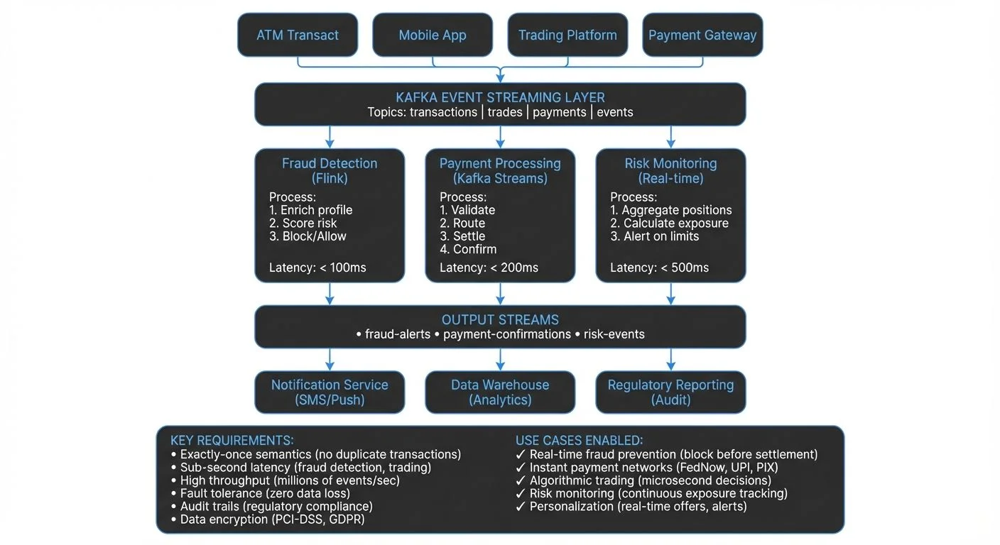

Financial services operate in an environment where milliseconds matter. Whether detecting fraudulent transactions, processing payments, executing trades, or monitoring risk exposure, the ability to act on data in real time has become a competitive necessity. Streaming data platforms have emerged as the backbone of modern financial infrastructure, enabling institutions to move from batch-oriented systems to event-driven architectures that process information as it happens.

This shift represents more than a technical upgrade. It fundamentally changes how financial institutions operate, allowing them to prevent fraud before it completes, settle payments instantly, and manage risk with up-to-the-second accuracy. For foundational concepts, see [What is Real-Time Data Streaming](https://conduktor.io/glossary/what-is-real-time-data-streaming).

<!-- ORIGINAL_DIAGRAM
```
┌──────────────────────────────────────────────────────────────────┐
│       STREAMING DATA IN FINANCIAL SERVICES ARCHITECTURE          │
├──────────────────────────────────────────────────────────────────┤
│                                                                  │
│  Event Sources                                                   │
│  ┌──────────┐  ┌──────────┐  ┌──────────┐  ┌──────────┐        │
│  │   ATM    │  │  Mobile  │  │ Trading  │  │ Payment  │        │
│  │ Transact │  │   App    │  │ Platform │  │ Gateway  │        │
│  └────┬─────┘  └────┬─────┘  └────┬─────┘  └────┬─────┘        │
│       │             │             │             │               │
│       └─────────────┴─────────────┴─────────────┘               │
│                           │                                     │
│                           ▼                                     │
│  ┌──────────────────────────────────────────────────────────┐   │
│  │              KAFKA EVENT STREAMING LAYER                 │   │
│  │  Topics: transactions | trades | payments | events       │   │
│  └────────────────────────┬─────────────────────────────────┘   │
│                           │                                     │
│              ┌────────────┼────────────┐                        │
│              ▼            ▼            ▼                        │
│  ┌──────────────┐ ┌──────────────┐ ┌──────────────┐           │
│  │ Fraud        │ │ Payment      │ │ Risk         │           │
│  │ Detection    │ │ Processing   │ │ Monitoring   │           │
│  │ (Flink)      │ │ (Kafka       │ │ (Real-time)  │           │
│  │              │ │  Streams)    │ │              │           │
│  │ Process:     │ │              │ │ Process:     │           │
│  │ 1. Enrich    │ │ Process:     │ │ 1. Aggregate │           │
│  │    profile   │ │ 1. Validate  │ │    positions │           │
│  │ 2. Score     │ │ 2. Route     │ │ 2. Calculate │           │
│  │    risk      │ │ 3. Settle    │ │    exposure  │           │
│  │ 3. Block/    │ │ 4. Confirm   │ │ 3. Alert on  │           │
│  │    Allow     │ │              │ │    limits    │           │
│  │              │ │ Latency:     │ │              │           │
│  │ Latency:     │ │ < 200ms      │ │ Latency:     │           │
│  │ < 100ms      │ │              │ │ < 500ms      │           │
│  └──────┬───────┘ └──────┬───────┘ └──────┬───────┘           │
│         │                │                │                    │
│         ▼                ▼                ▼                    │
│  ┌──────────────────────────────────────────────────────────┐   │
│  │                  OUTPUT STREAMS                          │   │
│  │  • fraud-alerts  • payment-confirmations  • risk-events  │   │
│  └────────────────────────┬─────────────────────────────────┘   │
│                           │                                     │
│              ┌────────────┼────────────┐                        │
│              ▼            ▼            ▼                        │
│  ┌──────────────┐ ┌──────────────┐ ┌──────────────┐           │
│  │ Notification │ │ Data         │ │ Regulatory   │           │
│  │ Service      │ │ Warehouse    │ │ Reporting    │           │
│  │ (SMS/Push)   │ │ (Analytics)  │ │ (Audit)      │           │
│  └──────────────┘ └──────────────┘ └──────────────┘           │
│                                                                  │
│  KEY REQUIREMENTS:                                              │
│  • Exactly-once semantics (no duplicate transactions)          │
│  • Sub-second latency (fraud detection, trading)               │
│  • High throughput (millions of events/sec)                    │
│  • Fault tolerance (zero data loss)                            │
│  • Audit trails (regulatory compliance)                        │
│  • Data encryption (PCI-DSS, GDPR)                             │
│                                                                  │
│  USE CASES ENABLED:                                             │
│  ✓ Real-time fraud prevention (block before settlement)        │
│  ✓ Instant payment networks (FedNow, UPI, PIX)                 │
│  ✓ Algorithmic trading (microsecond decisions)                 │
│  ✓ Risk monitoring (continuous exposure tracking)              │
│  ✓ Personalization (real-time offers, alerts)                  │
└──────────────────────────────────────────────────────────────────┘
```
-->

## Why Streaming Data Matters in Finance

Traditional batch processing systems update their state periodically—hourly, daily, or even weekly. For many financial use cases, this delay is unacceptable. A fraudulent transaction flagged hours after it occurs has already caused damage. A trading algorithm operating on 15-minute-old market data has already missed opportunities or taken on unwanted risk.

Streaming data platforms process events as they arrive, typically within milliseconds. This enables financial institutions to:

- **Detect and prevent fraud in real time** by analyzing transaction patterns as they occur
- **Process payments instantly** rather than waiting for batch settlement windows
- **Monitor risk exposure continuously** across trading portfolios and lending books
- **Personalize customer experiences** by responding immediately to user actions
- **Maintain regulatory compliance** through real-time transaction monitoring and audit trails

The financial impact is significant. According to industry studies, real-time fraud detection can reduce losses by 50-70% compared to batch-based systems. Instant payment settlement improves cash flow and reduces counterparty risk. Real-time risk monitoring prevents cascading failures during market volatility.

## Key Use Cases for Streaming Data

### Fraud Detection and Prevention

Credit card fraud detection exemplifies the power of streaming data. When a cardholder swipes their card, the transaction flows through a real-time processing pipeline that evaluates it against multiple fraud models within milliseconds.

A typical fraud detection pipeline might work as follows:

1. Transaction event arrives in Kafka topic
2. Kafka Streams application enriches the event with customer profile data (enrichment means adding contextual information like the customer's location history, typical spending patterns, and account age from a separate data store)
3. Multiple fraud detection models run in parallel (location analysis, spending pattern analysis, merchant risk scoring)
4. Results are aggregated and scored
5. High-risk transactions are blocked or flagged for review before authorization completes

This entire process must complete in under 100 milliseconds to avoid customer experience degradation. Streaming platforms like Apache Kafka and Flink make this possible through their ability to process millions of events per second with low, predictable latency. For an introduction to Apache Kafka's capabilities, see [Apache Kafka](https://conduktor.io/glossary/apache-kafka) and [What is Apache Flink](https://conduktor.io/glossary/what-is-apache-flink-stateful-stream-processing).

### Payment Processing

The shift from batch payment settlement to real-time payment networks (like FedNow in the US, Faster Payments in the UK, SEPA Instant in Europe, PIX in Brazil, and UPI in India) requires streaming data infrastructure. Each payment generates multiple events: initiation, validation, fraud check, settlement confirmation, notification.

Event-driven architectures ensure these events flow through the system reliably, maintaining exactly-once processing semantics even when individual components fail. This reliability is critical—a duplicated payment or a lost transaction can have serious financial and regulatory consequences. For architectural patterns in payment systems, see [Event-Driven Architecture](https://conduktor.io/glossary/event-driven-architecture).

### Trading and Market Data

Financial markets generate enormous volumes of streaming data. A single stock can produce thousands of price updates per second. Trading algorithms must process this data, make decisions, and execute trades within microseconds to remain competitive.

Beyond algorithmic trading, streaming data powers:

- **Risk management systems** that monitor positions and exposure in real time
- **Market surveillance** to detect manipulation or insider trading
- **Post-trade processing** for settlement and reconciliation
- **Regulatory reporting** with real-time transaction records

### Customer Experience and Personalization

Banks and fintech companies use streaming data to personalize customer interactions. When a customer logs into their mobile app, streaming data pipelines can:

- Calculate current account balances from recent transactions
- Generate personalized product recommendations based on spending patterns
- Provide instant notifications for account activity
- Update credit scores in real time as payments are made

## Technical Architecture and Technologies

Most financial institutions build their streaming infrastructure on Apache Kafka for event storage and distribution, combined with stream processing frameworks like Apache Flink (1.18+) or Kafka Streams for real-time computation. Modern Kafka deployments (4.0+) use KRaft mode, which removes the ZooKeeper dependency and simplifies operations, improves scalability, and reduces operational complexity. For details on this architectural shift, see [Understanding KRaft Mode in Kafka](https://conduktor.io/glossary/understanding-kraft-mode-in-kafka).

A typical architecture includes:

**Event Sources**: Transaction systems, trading platforms, mobile apps, ATMs, and external data feeds publish events to Kafka topics.

**Stream Processing**: Flink or Kafka Streams applications process these events, performing joins, aggregations, pattern detection, and enrichment. For detailed patterns on combining multiple streams, see [Stream Joins and Enrichment Patterns](https://conduktor.io/glossary/stream-joins-and-enrichment-patterns).

**State Management**: Stream processors maintain state (customer profiles, account balances, fraud models) that must be updated and queried in real time. State represents data that persists across multiple events—for example, maintaining a running sum of transactions for the day or storing the last 30 days of customer activity. Apache Flink uses RocksDB as its state backend for high-performance local storage, while Kafka Streams maintains state in local state stores backed by changelog topics. For implementation details, see [State Stores in Kafka Streams](https://conduktor.io/glossary/state-stores-in-kafka-streams).

**Data Sinks**: Processed events flow to databases, data warehouses, notification systems, and other downstream consumers.

**Schema Management**: Financial data requires strict schema governance to ensure compatibility and prevent data quality issues. Schema Registry enforces schema validation and evolution rules, ensuring backward and forward compatibility as data structures evolve. For detailed coverage of schema management patterns, see [Schema Registry and Schema Management](https://conduktor.io/glossary/schema-registry-and-schema-management).

The distributed nature of these systems introduces operational complexity. Teams must monitor cluster health, track data lineage, manage access controls, and ensure data quality across hundreds of topics and applications. Platforms like Conduktor help by providing centralized visibility into Kafka infrastructure, enforcing governance policies, and simplifying operations for development teams. For hands-on topic management and configuration, see the [Conduktor Topics Guide](https://docs.conduktor.io/guide/manage-kafka/kafka-resources/topics). Conduktor Gateway adds an additional layer for policy enforcement, chaos engineering testing, and compliance controls in streaming architectures.

## Compliance and Regulatory Considerations

Financial services face stringent regulatory requirements around transaction monitoring, audit trails, and data protection. Streaming data platforms must address several compliance challenges:

**Audit Trails**: Every transaction must be traceable. Kafka's immutable log provides a natural audit trail, but institutions must implement proper retention policies and ensure data cannot be tampered with. For comprehensive audit logging strategies, see [Audit Logging for Streaming Platforms](https://conduktor.io/glossary/audit-logging-for-streaming-platforms).

**Data Privacy**: Regulations like GDPR require the ability to delete customer data on request. This conflicts with Kafka's append-only design, requiring careful architectural choices around data masking, encryption, and deletion strategies. Common approaches include using data masking for PII in transit and maintaining external deletion registries. Conduktor provides enterprise-grade data masking capabilities to protect sensitive financial data—learn more in the [Conduktor Data Masking documentation](https://docs.conduktor.io/guide/conduktor-in-production/admin/data-mask). For detailed streaming-specific strategies, see [Data Masking and Anonymization for Streaming](https://conduktor.io/glossary/data-masking-and-anonymization-for-streaming).

**Transaction Monitoring**: Regulations like the Bank Secrecy Act and EU Anti-Money Laundering directives require real-time monitoring of transactions for suspicious activity. Streaming platforms enable this by processing every transaction through detection algorithms as it occurs.

**Data Residency**: Financial data often cannot cross national borders. Kafka deployments must respect data residency requirements through proper cluster topology and replication strategies.

**Access Control**: Not all data should be accessible to all systems. Fine-grained access control, encryption in transit and at rest, and comprehensive audit logging are essential. Modern streaming platforms implement role-based access control (RBAC) and attribute-based access control (ABAC) for granular permissions. For access control patterns, see [Access Control for Streaming](https://conduktor.io/glossary/access-control-for-streaming) and [Encryption at Rest and in Transit for Kafka](https://conduktor.io/glossary/encryption-at-rest-and-in-transit-for-kafka).

## Challenges and Best Practices

Implementing streaming data in financial services comes with challenges:

**Latency Requirements**: Trading systems may require sub-millisecond latency, while fraud detection typically needs sub-100ms. Meeting these targets requires careful performance tuning and hardware selection.

**Data Quality**: Poor data quality in real-time systems causes immediate operational issues. Implement schema validation, data quality checks, and monitoring to catch issues before they propagate. Modern data quality tools like Soda Core and Great Expectations can validate streaming data in real time, checking for anomalies, null values, format violations, and business rule compliance. For comprehensive data quality strategies, see [Building a Data Quality Framework](https://conduktor.io/glossary/building-a-data-quality-framework) and [Automated Data Quality Testing](https://conduktor.io/glossary/automated-data-quality-testing).

**Exactly-Once Semantics**: Financial transactions must be processed exactly once—no duplicates, no losses. This means if a payment of $100 is processed, it should debit the account exactly once, even if the system experiences failures or retries. Modern Kafka (2.5+) provides improved exactly-once semantics (EOS) using transactional APIs, while Apache Flink offers end-to-end exactly-once processing through its checkpointing mechanism. Use platforms and frameworks that support exactly-once processing guarantees and test failure scenarios thoroughly. For implementation details, see [Exactly-Once Semantics in Kafka](https://conduktor.io/glossary/exactly-once-semantics-in-kafka).

**Backpressure and Rate Limiting**: Downstream systems may not keep up with peak event rates. Backpressure occurs when a consumer processes data slower than the producer sends it, leading to memory buildup and potential system failures. Implement proper backpressure mechanisms (such as flow control, buffering, or dynamic rate adjustment) and rate limiting to prevent cascade failures. For comprehensive patterns and strategies, see [Backpressure Handling in Streaming Systems](https://conduktor.io/glossary/backpressure-handling-in-streaming-systems).

**Testing and Validation**: Testing streaming applications is harder than batch systems. Invest in tools for replaying production traffic, generating synthetic events, and validating processing logic under various scenarios. Modern testing approaches include using Testcontainers for integration testing with real Kafka instances, and Conduktor Gateway for chaos engineering and governance testing in pre-production environments. For comprehensive testing strategies, see [Testing Strategies for Streaming Applications](https://conduktor.io/glossary/testing-strategies-for-streaming-applications) and [Chaos Engineering for Streaming Systems](https://conduktor.io/glossary/chaos-engineering-for-streaming-systems).

**Observability**: Real-time systems fail in real time. Comprehensive monitoring, alerting, and debugging tools are essential. Track metrics like end-to-end latency, processing rates, error rates, and data freshness. Modern observability stacks typically include Kafka Lag Exporter for consumer lag monitoring, Prometheus for metrics collection, and Grafana for visualization. For consumer lag patterns, see [Consumer Lag Monitoring](https://conduktor.io/glossary/consumer-lag-monitoring).

## Real-World Implementation Example

Consider how a major credit card processor might implement fraud detection:

The system processes 10,000 transactions per second during peak hours. Each transaction is published to a Kafka topic as it arrives. A Flink application maintains a state store with customer spending patterns, updated continuously from transaction history.

For each incoming transaction, the application:
1. Retrieves the customer's recent transaction history (last 30 days)
2. Calculates metrics like average transaction amount, typical merchant categories, and geographic patterns
3. Compares the current transaction against these patterns using ML models
4. Checks the transaction against known fraud indicators (blacklisted merchants, suspicious locations)
5. Generates a fraud score and publishes it to an output topic

This processing completes in 50-80 milliseconds on average. Transactions scoring above a threshold are automatically declined. Those in a medium-risk range trigger additional verification steps like SMS verification.

The entire system runs on a distributed Flink cluster processing events from a multi-region Kafka deployment for high availability. All data is encrypted in transit and at rest, with comprehensive audit logging for regulatory compliance.

## Summary

Streaming data has become fundamental infrastructure in financial services. From fraud detection to payment processing to trading, the ability to process events in real time enables capabilities that batch systems simply cannot provide.

The core technologies—primarily Apache Kafka for event streaming and Apache Flink or Kafka Streams for processing—are mature and battle-tested at scale. However, successfully implementing streaming data requires careful attention to architecture, compliance, data quality, and operational best practices.

Financial institutions that invest in building robust streaming data platforms gain competitive advantages through faster fraud detection, instant payment processing, better risk management, and improved customer experiences. As real-time expectations continue to grow and regulatory requirements evolve, streaming data will only become more central to financial services operations.

## Related Concepts

- [Apache Kafka](/apache-kafka) - Distributed streaming platform for financial data pipelines
- [Exactly-Once Semantics](/exactly-once-semantics) - Critical for financial transactions and payment processing
- [GDPR Compliance for Data Teams](/gdpr-compliance-for-data-teams) - Regulatory compliance for financial data privacy

## Sources and References

1. **Apache Kafka Documentation** - "Use Cases: Financial Services" - https://kafka.apache.org/powered-by - Detailed case studies from Capital One, Goldman Sachs, and other major financial institutions

2. **The Federal Reserve** - "The Federal Reserve's FedNow Service" - https://www.frbservices.org/financial-services/fednow - Technical documentation on instant payment infrastructure requirements

3. **Confluent** - "Event-Driven Architecture in Financial Services" - https://www.confluent.io/resources/financial-services/ - Technical architecture patterns and best practices for streaming data in finance

4. **Apache Flink** - "Stream Processing for Financial Services" - https://flink.apache.org - Documentation on exactly-once processing semantics and state management for financial applications

5. **European Banking Authority** - "Guidelines on Fraud Reporting under PSD2" - https://www.eba.europa.eu - Regulatory requirements for real-time fraud detection and reporting in payment services
