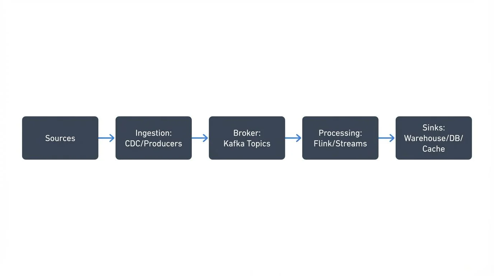
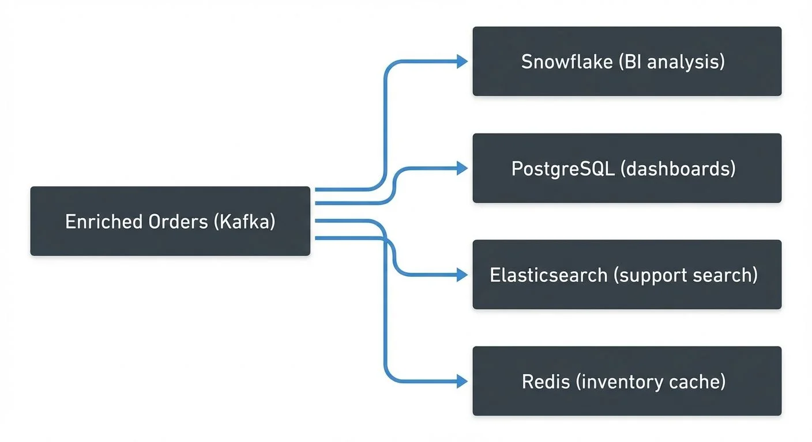

Modern organizations increasingly rely on real-time insights to power operational decisions, personalized user experiences, and automated systems. Unlike traditional batch processing that operates on periodic snapshots of data, streaming data pipelines process events continuously as they occur, enabling millisecond-to-second latency between data generation and action.

Understanding the architecture of streaming pipelines—their components, data flows, and operational characteristics—is essential for anyone building systems that react to data in real time.

## What Is a Streaming Data Pipeline?

A streaming data pipeline is a set of technologies that captures data as soon as it's generated, processes it in near real-time, and makes it available to users and applications continuously. This contrasts with traditional batch ETL that collects data over time and processes it in large blocks periodically.

**Visual Architecture:**


<!-- ORIGINAL_DIAGRAM
```
[Sources] → [Ingestion: CDC/Producers] → [Broker: Kafka Topics] 
         → [Processing: Flink/Streams] → [Sinks: Warehouse/DB/Cache]
```
-->

**Key characteristics:**
- **Decoupling**: Components scale, fail, and evolve independently
- **Low Latency**: Data processed within milliseconds to seconds
- **Continuous Flow**: Unbounded streams vs discrete batch jobs

## When to Choose Streaming

Choose streaming pipelines when:
- Real-time decisioning matters (fraud detection, dynamic pricing)
- Operational systems need current state (inventory, order status)
- Late data loses value (financial trading, IoT monitoring)
- Multiple consumers need the same data independently

**Cost consideration**: Streaming typically costs 2-3x more than batch due to continuous compute and operational overhead, but business value of immediate insights often justifies this investment.

Continue with batch when historical analysis doesn't require real-time freshness or costs outweigh benefits.

## The Five Core Components

Streaming pipelines consist of five building blocks that map to four logical phases. Source and Ingestion together form the entry point, Broker provides transport, Processing transforms data, and Sink delivers results.

1. **Source**: Systems generating events—databases, applications, IoT devices, APIs
2. **Ingestion Layer**: Entry point capturing events through direct producers, CDC connectors, or API gateways
3. **Transport/Event Broker**: Central durable channel (Apache Kafka) providing ordered, replayable event logs
4. **Processing Layer**: Stream processors (Kafka Streams, Flink) transforming and enriching data
5. **Sink/Delivery Layer**: Destinations like data warehouses, databases, search indexes, or caches

Each component operates independently, allowing horizontal scaling and graceful failure handling through buffering and replay.

## Ingestion Layer: Capturing Events from Diverse Sources

### Direct Producers

Applications publish events directly using the Kafka Producer API:
```java
producer.send(new ProducerRecord<>(
    "orders",                    // topic
    order.getCustomerId(),       // key for partitioning
    orderToJson(order)           // event payload
));
```

This provides lowest latency but requires modifying application code.

### Change Data Capture (CDC)

For existing databases, Debezium operates as a Source Connector, reading transaction logs and converting every INSERT, UPDATE, or DELETE into events without impacting source database performance.
```json
{
  "name": "inventory-connector",
  "config": {
    "connector.class": "io.debezium.connector.postgresql.PostgresConnector",
    "database.hostname": "postgres.example.com",
    "table.include.list": "public.products,public.orders"
  }
}
```

CDC enables streaming from legacy systems without code changes. For comprehensive coverage of CDC patterns and implementation details, see [What is Change Data Capture (CDC) Fundamentals](https://conduktor.io/glossary/what-is-change-data-capture-cdc-fundamentals) and [Implementing CDC with Debezium](https://conduktor.io/glossary/implementing-cdc-with-debezium).

### Kafka Connect Framework

Kafka Connect provides standardized connectors integrating external systems, handling offset management, error handling, and scalability automatically.

Delivery semantics (at-least-once or exactly-once) configured on producers ensure events aren't lost during failures.

## The Data Stream Broker: The Backbone

Apache Kafka serves as the architectural backbone, fundamentally distinguishing streaming from point-to-point integration. Modern Kafka deployments (Kafka 3.3+, standard in 4.0+) run in KRaft mode—eliminating the previous ZooKeeper dependency for improved operational simplicity and scalability. For details on this architecture shift, see [Understanding KRaft Mode in Kafka](https://conduktor.io/glossary/understanding-kraft-mode-in-kafka).

**Core responsibilities:**
- **Decoupling**: Producers and consumers operate independently. Producers write without knowing consumers exist; consumers read without knowing producers.
- **Durability**: Events stored as immutable logs, replicated across brokers. Data remains available based on retention policies (hours to indefinitely), surviving server failures and enabling replay.
- **Ordered Transport**: Events with the same partition key (e.g., customer-123) go to the same partition, maintaining causal ordering.
- **Elastic Buffering**: Acts as shock absorber between fast producers and slow consumers. Events accumulate safely if processing falls behind.

Kafka's log-centric design enables multiple independent consumers, historical replay, reprocessing after bugs, and long-term event storage—what makes streaming ecosystems reliable at scale.

**Partition sizing guidance**: Kafka topics are divided into partitions that enable parallel processing across consumer groups. Start with 1-2 partitions per expected peak consumer instance. For 10 anticipated consumers, begin with 10-20 partitions. Monitor consumer lag and adjust upward as needed. For detailed information on how consumers coordinate partition assignment and track offsets, see [Kafka Consumer Groups Explained](https://conduktor.io/glossary/kafka-consumer-groups-explained) and [Consumer Lag: Monitoring and Managing Streaming Health](https://conduktor.io/glossary/consumer-lag-monitoring).

## Processing Layer: Transforming Streams in Motion

Stream processors extract business value from raw data through continuous operations:

### Processing Patterns:
- **Filtering**: Remove irrelevant events (orders above $100, critical errors)
- **Transformation**: Convert formats, extract fields, calculate derived values
- **Aggregations (stateful)**: Count events per minute, sum amounts per hour, track unique users
- **Stream Joins**: Merge order events with customer profiles for enrichment
- **Windowing**: Group into tumbling windows (hourly reports), sliding windows (moving averages), or session windows (user sessions)
- **Complex Event Processing**: Detect patterns like failed logins followed by successful access

### Framework Comparison:

**Kafka Streams** operates directly on Kafka without separate infrastructure:
```java
KStream orders = builder.stream("orders");
KTable counts = orders
    .groupBy((key, order) -> order.getRegion())
    .windowedBy(TimeWindows.of(Duration.ofMinutes(5)))
    .count();
```

**Apache Flink** (1.19+/1.20+ as of 2025) handles complex event-time processing, late-arriving data, and large stateful computations with exactly-once semantics. For detailed coverage, see [What is Apache Flink: Stateful Stream Processing](https://conduktor.io/glossary/what-is-apache-flink-stateful-stream-processing).

**Spark Structured Streaming** leverages existing Spark ecosystem for teams with Spark expertise.

Choose based on complexity (simple transforms vs complex joins), latency requirements, and team skills. For framework comparisons, see [Kafka Streams vs Apache Flink](https://conduktor.io/glossary/kafka-streams-vs-apache-flink).

## Delivery Layer: Writing to Multiple Destinations

### Sink Connectors

Pre-built Kafka Connect Sink Connectors handle delivery, managing batching, retries, and exactly-once semantics.

**Configuration example (Snowflake):**
```properties
buffer.count.records=10000       # Batch size
buffer.flush.time=60             # Flush every 60 seconds
```

Provides 1-2 minute latency while controlling warehouse costs.

### Common Destinations

- **Data Warehouses** (Snowflake, BigQuery): Historical analysis and BI
- **Operational Databases** (PostgreSQL): Current state for applications
- **Data Lakes** (S3, HDFS): Long-term archival and ML training
- **Search Indexes** (Elasticsearch): Full-text search and real-time analytics
- **Caches** (Redis): Sub-millisecond reads for recommendations and pricing
- **APIs/Webhooks**: Trigger external systems

### The Fan-Out Pattern

Single streams serve multiple destinations simultaneously:


<!-- ORIGINAL_DIAGRAM
```
Enriched Orders (Kafka)
  ├→ Snowflake (BI analysis)
  ├→ PostgreSQL (dashboards)
  ├→ Elasticsearch (support search)
  └→ Redis (inventory cache)
```
-->

Each consumer processes independently. Kafka buffers during downstream failures.

**Exactly-once vs at-least-once**: Choose exactly-once when duplicates cause incorrect results (financial transactions, inventory updates). Use at-least-once with idempotent consumers when performance matters and systems handle duplicates (updating current state, upserts). Exactly-once adds 2-5ms latency and 10-20% throughput reduction. For implementation details, see [Exactly-Once Semantics in Kafka](https://conduktor.io/glossary/exactly-once-semantics-in-kafka).

## Operational Concerns: Monitoring and Governance

### End-to-End Latency Tracking

Monitor these metrics separately—each reveals different bottlenecks:
- **Producer Throughput**: Volume ingested, detecting source slowdowns
- **Event-to-Ingestion Latency**: Time from generation to Kafka
- **Consumer Lag**: Gap between latest event and consumer position (indicates bottlenecks)
- **Processing Latency**: Time spent in stream processor
- **Connector Status**: Failed tasks halting ingestion/delivery
- **End-to-End Latency**: Total time from creation to sink (ultimate SLA measure)

Modern monitoring stacks (2025) typically use Kafka Lag Exporter with Prometheus and Grafana for granular lag metrics with minimal overhead, replacing older tools like Burrow. For comprehensive consumer lag monitoring strategies, see [Consumer Lag: Monitoring and Managing Streaming Health](https://conduktor.io/glossary/consumer-lag-monitoring).

**Correlation IDs** enable distributed tracing: unique identifiers attached at ingestion propagate through all stages, allowing operators to trace individual events through the complete pipeline.

```json
{
  "orderId": "order-12345",
  "customerId": "cust-789",
  "correlationId": "trace-abc123-def456",
  "timestamp": "2025-01-15T10:30:00Z",
  "amount": 299.99
}
```

The `correlationId` flows from producer → Kafka → stream processor → sink, enabling end-to-end tracking in monitoring dashboards.

### Data Quality and Schema Evolution

Schema Registry validates schemas before allowing writes. If producers attempt incompatible schemas, the registry rejects requests with errors, preventing malformed data from entering. For comprehensive coverage of schema management strategies, see [Schema Registry and Schema Management](https://conduktor.io/glossary/schema-registry-and-schema-management).

**Compatibility rules:**
- **Backward**: New schemas readable by old consumers
- **Forward**: New consumers read old schemas
- **Full**: Both directions compatible

Invalid events route to dead letter queues—separate Kafka topics storing failed events for inspection and reprocessing without blocking main data flow. For detailed DLQ implementation patterns, see [Dead Letter Queues for Error Handling](https://conduktor.io/glossary/dead-letter-queues-for-error-handling).

### Backpressure Management

When consumers fall behind, events accumulate in Kafka. Teams respond by:
- Scaling consumers horizontally (up to partition count)
- Optimizing processing logic
- Increasing partition counts (requires coordination)

For comprehensive strategies including throttling, load shedding, and batching approaches, see [Backpressure Handling in Streaming Systems](https://conduktor.io/glossary/backpressure-handling-in-streaming-systems).

### Pipeline Lineage and Governance

Data lineage tracks complete data paths for:
- **Auditing**: Precise path from Debezium source through Flink to Snowflake
- **Debugging**: Trace quality issues to source transformations
- **Impact Analysis**: Understand downstream effects of changes
- **Compliance**: Demonstrate handling for GDPR, CCPA, SOX

Commercial governance platforms like Conduktor centralize operational visibility and control for Kafka ecosystems, enabling teams to:
- Inspect Source/Sink Connector status across clusters with [Kafka Connect Management](https://docs.conduktor.io/guide/manage-kafka/kafka-resources/kafka-connect)
- Track consumer group offsets and lag via unified dashboards
- Visualize pipeline topology (topics → processors → sinks)
- Monitor schema versions and evolution history
- Enforce governance policies on sensitive streams with [Interceptors](https://docs.conduktor.io/guide/conduktor-concepts/interceptors)
- Troubleshoot bottlenecks without accessing multiple CLI tools
- Test resilience with Conduktor Gateway (proxy-based chaos engineering for network failures, latency injection, and message manipulation)

Operators trace events through stages, identify latency spikes, and understand impact before modifying schemas—essential for operating at scale. For testing strategies including chaos engineering, see [Chaos Engineering for Streaming Systems](https://conduktor.io/glossary/chaos-engineering-for-streaming-systems).

## Summary

Streaming data pipelines enable continuous data movement through decoupled, event-driven architectures, replacing batch processes with real-time flows that reduce latency from hours to milliseconds.

**Why It Matters**: Understanding the five components (sources, ingestion, broker, processing, sinks) and how they interact through immutable event logs allows teams to architect pipelines that scale reliably while maintaining quality. Streaming enables use cases impossible with batch—real-time fraud detection, dynamic pricing, operational dashboards.

**How Teams Approach It Today**: Organizations layer specialized components: CDC tools for database ingestion, Kafka as durable transport, Flink/Kafka Streams for stateful transformations, Sink Connectors for multi-destination delivery. Teams monitor end-to-end latency, manage schema evolution through registries, scale consumers based on lag, and choose delivery semantics (exactly-once vs at-least-once) based on data criticality.

**Where Platforms Fit**: Governance platforms provide observability and control layers essential for complex streaming architectures—centralizing schema management, tracking lineage, monitoring health metrics, enforcing policies, and enabling troubleshooting across distributed processing stages.

## Related Concepts

- [Streaming ETL vs Traditional ETL](/streaming-etl-vs-traditional-etl) - Comparing streaming and batch pipeline approaches
- [Data Pipeline Orchestration with Streaming](/data-pipeline-orchestration-with-streaming) - Managing and coordinating streaming pipelines
- [Streaming to Lakehouse Tables](/streaming-to-lakehouse-tables) - Delivering streaming data to lakehouse storage

## Sources and References

- Apache Software Foundation. [Apache Kafka Documentation: Stream Processing](https://kafka.apache.org/documentation/#uses_streamprocessing)
- Apache Software Foundation. [Apache Kafka Connect](https://kafka.apache.org/documentation/#connect)
- Apache Software Foundation. [Apache Flink: Stateful Stream Processing](https://nightlies.apache.org/flink/flink-docs-stable/docs/concepts/stateful-stream-processing/)
- Kleppmann, Martin. *Designing Data-Intensive Applications*. O'Reilly Media, 2017. Chapter 11.
- Databricks. [Stream Processing Guide](https://databricks.com/glossary/stream-processing)
