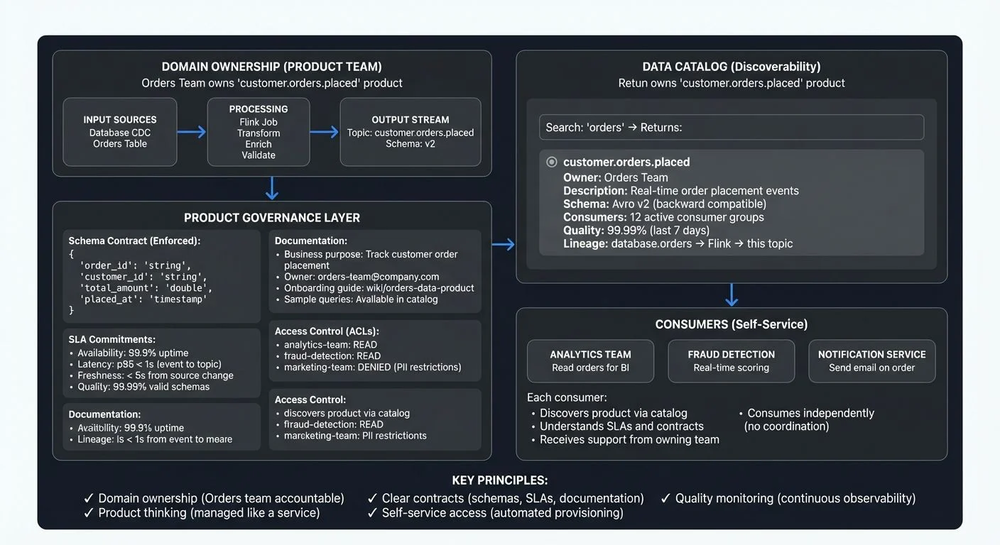

As organizations scale their data platforms beyond centralized teams and monolithic pipelines, a new paradigm has emerged: treating data itself as a product. Rather than viewing data as a byproduct of applications, data products are managed assets with clear ownership, defined quality standards, discoverable interfaces, and committed service levels.

When applied to streaming architectures, this product thinking transforms how organizations build, govern, and consume real-time data. Understanding streaming data products, their principles, components, and governance requirements, is essential for building scalable, decentralized data platforms.

<!-- ORIGINAL_DIAGRAM
```
┌──────────────────────────────────────────────────────────────────┐
│              STREAMING DATA PRODUCT ARCHITECTURE                 │
├──────────────────────────────────────────────────────────────────┤
│                                                                  │
│  Domain Ownership (Product Team)                                │
│  ┌────────────────────────────────────────────────────────────┐ │
│  │  Orders Team owns "customer.orders.placed" product        │ │
│  │                                                            │ │
│  │  Input Sources        Processing         Output Stream    │ │
│  │  ┌──────────┐        ┌──────────┐       ┌──────────────┐ │ │
│  │  │ Database │        │ Flink    │       │ Topic:       │ │ │
│  │  │ CDC      │───────▶│ Job      │──────▶│ customer.    │ │ │
│  │  │          │        │          │       │ orders.      │ │ │
│  │  │ Orders   │        │ Transform│       │ placed       │ │ │
│  │  │ Table    │        │ Enrich   │       │              │ │ │
│  │  └──────────┘        │ Validate │       │ Schema: v2   │ │ │
│  │                      └──────────┘       └──────────────┘ │ │
│  └────────────────────────────────────────────────────────────┘ │
│                           │                                     │
│  ┌────────────────────────────────────────────────────────────┐ │
│  │               PRODUCT GOVERNANCE LAYER                     │ │
│  │                                                            │ │
│  │  Schema Contract (Enforced):                              │ │
│  │  {                                                         │ │
│  │    "order_id": "string",                                   │ │
│  │    "customer_id": "string",                                │ │
│  │    "total_amount": "double",                               │ │
│  │    "placed_at": "timestamp"                                │ │
│  │  }                                                         │ │
│  │                                                            │ │
│  │  SLA Commitments:                                          │ │
│  │  • Availability: 99.9% uptime                              │ │
│  │  • Latency: p95 < 1s (event to topic)                     │ │
│  │  • Freshness: < 5s from source change                     │ │
│  │  • Quality: 99.99% valid schemas                          │ │
│  │                                                            │ │
│  │  Documentation:                                            │ │
│  │  • Business purpose: Track customer order placement       │ │
│  │  • Owner: orders-team@company.com                         │ │
│  │  • Onboarding guide: wiki/orders-data-product             │ │
│  │  • Sample queries: Available in catalog                   │ │
│  │                                                            │ │
│  │  Access Control (ACLs):                                    │ │
│  │  • analytics-team: READ                                    │ │
│  │  • fraud-detection: READ                                   │ │
│  │  • marketing-team: DENIED (PII restrictions)              │ │
│  └────────────────────────────────────────────────────────────┘ │
│                           │                                     │
│  ┌────────────────────────────────────────────────────────────┐ │
│  │             DATA CATALOG (Discoverability)                 │ │
│  │                                                            │ │
│  │  Search: "orders" → Returns:                               │ │
│  │  ┌──────────────────────────────────────────────────────┐ │ │
│  │  │ ◉ customer.orders.placed                             │ │ │
│  │  │   Owner: Orders Team                                 │ │ │
│  │  │   Description: Real-time order placement events      │ │ │
│  │  │   Schema: Avro v2 (backward compatible)              │ │ │
│  │  │   Consumers: 12 active consumer groups               │ │ │
│  │  │   Quality: 99.99% (last 7 days)                      │ │ │
│  │  │   Lineage: database.orders → Flink → this topic      │ │ │
│  │  └──────────────────────────────────────────────────────┘ │ │
│  └────────────────────────────────────────────────────────────┘ │
│                           │                                     │
│  ┌────────────────────────────────────────────────────────────┐ │
│  │                  CONSUMERS (Self-Service)                  │ │
│  │                                                            │ │
│  │  ┌──────────────┐  ┌──────────────┐  ┌──────────────┐    │ │
│  │  │ Analytics    │  │ Fraud        │  │ Notification │    │ │
│  │  │ Team         │  │ Detection    │  │ Service      │    │ │
│  │  │              │  │              │  │              │    │ │
│  │  │ Read orders  │  │ Real-time    │  │ Send email   │    │ │
│  │  │ for BI       │  │ scoring      │  │ on order     │    │ │
│  │  └──────────────┘  └──────────────┘  └──────────────┘    │ │
│  │                                                            │ │
│  │  Each consumer:                                            │ │
│  │  • Discovers product via catalog                          │ │
│  │  • Understands SLAs and contracts                         │ │
│  │  • Receives support from owning team                      │ │
│  │  • Consumes independently (no coordination)               │ │
│  └────────────────────────────────────────────────────────────┘ │
│                                                                  │
│  KEY PRINCIPLES:                                                │
│  ✓ Domain ownership (Orders team accountable)                  │
│  ✓ Product thinking (managed like a service)                   │
│  ✓ Clear contracts (schemas, SLAs, documentation)              │
│  ✓ Self-service access (automated provisioning)                │
│  ✓ Quality monitoring (continuous observability)               │
└──────────────────────────────────────────────────────────────────┘
```
-->

## What Is a Data Product and Why Streaming?

A data product is a curated dataset designed for consumption by specific users or applications, managed with the same rigor as a software product. It has:

- **Clear ownership:** A team responsible for quality, availability, and evolution
- **Quality standards:** SLAs for accuracy, freshness, completeness, and uptime
- **Stable interfaces:** Documented schemas, access methods, and contracts
- **Documentation:** Business context, usage examples, and support channels

### Raw Topic vs Data Product

**Raw Kafka Topic:**
- Name: `orders_topic`, no documentation, unclear owner, ad-hoc schema changes

**Data Product:**
- Name: `customer.orders.placed`, owned by Orders team, documented SLAs (99.9% uptime), versioned schema, quality metrics, onboarding guide

The difference is treating data as a managed service with accountability, not just bytes in a topic.

### Why Streaming Matters

A streaming data product applies these principles to continuous event flows. The product's primary interface is a well-governed, versioned Kafka topic. Unlike batch products that update periodically, streaming products deliver events continuously, enabling:

- **Real-time operational systems:** Inventory, order status, fraud alerts require current state
- **Event-driven automation:** Payment processing, notifications trigger immediately
- **Time-sensitive analytics:** Trading, IoT monitoring lose value within seconds
- **Multiple consumers:** Different teams process the same events independently

**Example:** A Customer team creates `customer.profile.updated`, a stream publishing events when profile information changes. Marketing, fraud detection, and personalization systems all consume this product for their specific needs.

## The Principles of Streaming Data Products

### Discoverability

Centralized catalogs document available streams with business context, searchable metadata, and ownership information. Modern data catalogs allow consumers to "shop" for data, with platforms like Conduktor providing Kafka-specific catalog capabilities integrated with governance features.

### Addressability

Stable interfaces through topic naming conventions (`<domain>.<entity>.<event-type>`), versioned schemas in registries, and documented access patterns.

### Trustworthiness

Schema contracts enforced through validation, quality metrics (accuracy, completeness), uptime SLAs (99.9% availability, <1s latency), and clear incident response.

### Self-Service Access

Automated provisioning, clear onboarding documentation, consumer support channels, and optional query interfaces for point-in-time lookups.

### Observability

Real-time metrics (throughput, latency, errors), consumer lag monitoring using tools like Kafka Lag Exporter (2025 standard for Prometheus-based monitoring), usage analytics, and alerting on quality degradation. For monitoring patterns, see [Consumer Lag Monitoring](https://conduktor.io/glossary/consumer-lag-monitoring) and [What Is Data Observability: The Five Pillars](https://conduktor.io/glossary/what-is-data-observability-the-five-pillars).

## Anatomy of a Streaming Data Product

A complete streaming data product consists of:

**Input Streams:** Raw Kafka topics or CDC logs consumed as the foundation. For CDC implementation details, see [What Is Change Data Capture: CDC Fundamentals](https://conduktor.io/glossary/what-is-change-data-capture-cdc-fundamentals).

**Stream Processing Logic:** Flink jobs (Flink 1.18+) or Kafka Streams applications performing continuous transformations, joining, aggregating, filtering, or enriching before publishing. For in-depth coverage, see [What Is Apache Flink: Stateful Stream Processing](https://conduktor.io/glossary/what-is-apache-flink-stateful-stream-processing).

**Output Stream (The API):** Well-defined, versioned Kafka topics:
- `payments.transactions.authorized`
- `payments.transactions.settled`

**Schemas and Contracts:** Structured event definitions enforcing contracts via schema registries:
```json
{
  "type": "record",
  "name": "OrderPlaced",
  "fields": [
    {"name": "order_id", "type": "string"},
    {"name": "customer_id", "type": "string"},
    {"name": "total_amount", "type": "double"}
  ]
}
```
For schema management patterns, see [Schema Registry and Schema Management](https://conduktor.io/glossary/schema-registry-and-schema-management) and [Avro vs Protobuf vs JSON Schema](https://conduktor.io/glossary/avro-vs-protobuf-vs-json-schema).

**Access Policies:** ACLs defining which teams can read topics. For access control patterns, see [Access Control for Streaming](https://conduktor.io/glossary/access-control-for-streaming).

**Documentation:** Business context, sample queries, limitations, quality metrics. For data contracts and documentation patterns, see [Data Contracts for Reliable Pipelines](https://conduktor.io/glossary/data-contracts-for-reliable-pipelines).

**SLAs:** Committed availability, latency, and freshness levels. For freshness monitoring, see [Data Freshness Monitoring: SLA Management](https://conduktor.io/glossary/data-freshness-monitoring-sla-management).

### Domain Ownership

The product owner team (e.g., Payments, Inventory, Customer team) owns the entire lifecycle: ingestion, processing, quality assurance, delivery, support, schema evolution, and incident response. This eliminates organizational friction and prevents "orphaned topics" with no accountability.

## Building Streaming Data Products on Kafka

Kafka's architecture naturally supports data product patterns. Modern Kafka deployments (Kafka 4.0+) benefit from KRaft mode, eliminating ZooKeeper dependencies for simpler operations and faster metadata propagation. For details on this modernization, see [Understanding KRaft Mode in Kafka](https://conduktor.io/glossary/understanding-kraft-mode-in-kafka).

**Durable Event Logs:** Unlike message queues, Kafka retains events based on retention policies, enabling multiple independent consumers, new consumer onboarding through replay, and reprocessing after bug fixes. For foundational concepts, see [Apache Kafka](https://conduktor.io/glossary/apache-kafka).

**Topic-Based Organization:** Topics provide natural boundaries. Naming conventions communicate ownership, domain teams own their namespaces.

**Schema Registries:** Enforce contracts by validating schemas before publication. When producers attempt incompatible changes (removing required fields), the registry rejects requests. Producer code receives errors, preventing invalid data from entering topics. Failed events route to dead letter queues, separate topics storing invalid events for investigation. For error handling patterns, see [Dead Letter Queues for Error Handling](https://conduktor.io/glossary/dead-letter-queues-for-error-handling).

**Consumer Groups:** Allow multiple teams to read the same product at their own pace, analytics processing every event, ML sampling 10%, operational systems consuming real-time.

**Multi-Tenancy:** Quotas limit throughput per client, network isolation separates sensitive products, priority classes provide different SLAs.

## Sharing Data Products with Partner Zones

When streaming data products need to be shared with external organizations, traditional approaches involve replicating topics, creating synchronization challenges and duplicate storage costs. Conduktor Partner Zones enable secure data product sharing without replication by providing dedicated logical boundaries with customized access to Kafka topics. Data product owners grant partners access while maintaining single source of truth, partners consume directly from original topics through their assigned zones.

Partner Zones also provide traffic analytics tracking consumption within each zone, enabling data product owners to monitor adoption and measure value delivered to partners. For implementation details, see the [Partner Zones documentation](https://docs.conduktor.io/guide/conduktor-concepts/partner-zones).

## Data Product Governance

Effective governance ensures streaming data products remain trustworthy and discoverable at scale. For governance frameworks and roles, see [Data Governance Framework: Roles and Responsibilities](https://conduktor.io/glossary/data-governance-framework-roles-and-responsibilities) and [Data Product Governance](https://conduktor.io/glossary/data-product-governance).

### Catalogs and Discovery

Centralized catalogs document available products, schemas, ownership, SLAs, consumers, and lineage showing upstream sources and downstream dependencies. Conduktor provides a comprehensive data catalog for Kafka environments, learn more in the [Conduktor Data Products guide](https://docs.conduktor.io/guide/conduktor-concepts/data-products). For broader data cataloging concepts, see [What Is a Data Catalog: Modern Data Discovery](https://conduktor.io/glossary/what-is-a-data-catalog-modern-data-discovery). For lineage tracking, see [Data Lineage: Tracking Data from Source to Consumption](https://conduktor.io/glossary/data-lineage-tracking-data-from-source-to-consumption).

### Schema Evolution

Governance enforces compatibility:
- **Backward compatible:** New schemas readable by old consumers
- **Forward compatible:** Old schemas readable by new consumers
- **Full compatible:** Both directions (recommended)

Quality rules enforced in processing logic certify product quality before publication. Modern quality frameworks like Soda Core (2025 standard) enable automated quality checks in streaming pipelines. For quality testing patterns, see [Great Expectations Data Testing Framework](https://conduktor.io/glossary/great-expectations-data-testing-framework), [Automated Data Quality Testing](https://conduktor.io/glossary/automated-data-quality-testing), and [Building a Data Quality Framework](https://conduktor.io/glossary/building-a-data-quality-framework).

### Access Control

Domain teams enforce security through ACLs, audit logs tracking access, data classification labels, and encryption for sensitive products. For security patterns, see [Audit Logging for Streaming Platforms](https://conduktor.io/glossary/audit-logging-for-streaming-platforms) and [Encryption at Rest and in Transit for Kafka](https://conduktor.io/glossary/encryption-at-rest-and-in-transit-for-kafka).

Platforms like Conduktor centralize governance by enabling teams to visualize and manage ACLs, maintain searchable catalogs across clusters, monitor quality metrics through unified dashboards, and automate consumer onboarding while validating standards.

## From Monolithic Pipelines to Data Product Thinking

Traditional platforms centralize processing in a single team, creating bottlenecks. Data product thinking distributes ownership to domain teams:

- Orders team owns `orders.placed`, `orders.shipped`
- Inventory team owns `inventory.stock_levels`
- Customer team owns `customers.profiles`

This is the core of **Data Mesh**, an organizational pattern decentralizing data ownership to domain teams rather than central platforms. Each domain publishes products as their public interface, replacing centralized ETL with distributed ownership. For comprehensive coverage of Data Mesh principles, see [Data Mesh: Principles and Implementation](https://conduktor.io/glossary/data-mesh-principles-and-implementation) and [Building and Managing Data Products](https://conduktor.io/glossary/building-and-managing-data-products).

**Federated computational governance** means domain teams make local decisions (what to publish, how to process) while organization-wide policies enforce standards (naming conventions, schema compatibility, security), local autonomy with global guardrails.

Streaming platforms enable this because teams publish to topics without central gatekeepers, consumers read without coordinating with producers, and Kafka handles hundreds of products from dozens of teams on shared infrastructure.

### Organizational Change

This shift requires buy-in. Domain teams need time, skills, and resources. Start small: begin with 1-2 pilot products from engaged teams before broad rollout. Use pilots to establish conventions, build shared tooling, train teams on Kafka and stream processing, and demonstrate value.

Common challenges include defining product boundaries (how granular?), coordinating across domains on shared entities (customer data), and allocating engineering time for maintenance.

## Getting Started

To create your first streaming data product:

1. Identify a domain dataset consumers need (order events, user activity)
2. Define the output schema using Avro/Protobuf with descriptive fields
3. Register in schema registry with compatibility mode set
4. Implement processing logic with quality checks and dead letter queues
5. Document purpose and SLAs in your catalog
6. Configure ACLs for authorized consumer groups
7. Monitor quality metrics and set up alerts
8. Onboard first consumers and iterate on feedback

## Summary

Streaming data products treat real-time data as managed assets with API-like interfaces (Kafka topics), backed by ownership, quality commitments, and governance.

**Why It Matters:** This enables organizational scale by replacing brittle centralized pipelines with resilient, consumer-centric streams. Streaming products deliver real-time value impossible with batch, enabling operational systems, automation, and time-sensitive analytics.

**How Teams Approach It Today:** Organizations build products by packaging Flink/Kafka Streams jobs, establishing naming conventions, registering schemas, defining SLAs, documenting in catalogs, and assigning domain ownership. Success requires pilot products, shared tooling, and organizational learning time.

**Where Platforms Fit:** Governance platforms provide discovery and access control layers, enabling catalog maintenance, schema policy enforcement, quality monitoring, ACL management, and consumer onboarding automation, ensuring decentralized ownership doesn't devolve into chaos while preserving streaming's agility.

## Related Concepts

- [Kafka ACLs and Authorization Patterns](https://conduktor.io/glossary/kafka-acls-and-authorization-patterns) - Fine-grained access control mechanisms essential for securing streaming data products across multiple consumers
- [Data Freshness Monitoring: SLA Management](https://conduktor.io/glossary/data-freshness-monitoring-sla-management) - Techniques for ensuring streaming data products meet their committed service level agreements
- [Access Control for Streaming](https://conduktor.io/glossary/access-control-for-streaming) - Comprehensive patterns for managing who can access streaming data products and under what conditions

## Sources and References

- Dehghani, Zhamak. [*Data Mesh: Delivering Data-Driven Value at Scale*](https://www.oreilly.com/library/view/data-mesh/9781492092384/). O'Reilly Media, 2022.
- Fowler, Martin. [Data Mesh Principles and Logical Architecture](https://martinfowler.com/articles/data-mesh-principles.html)
- Apache Software Foundation. [Apache Kafka: Multi-Tenancy](https://kafka.apache.org/documentation/#multitenancy)
- ThoughtWorks. [Technology Radar: Data as a Product](https://www.thoughtworks.com/radar/techniques/data-as-a-product)
