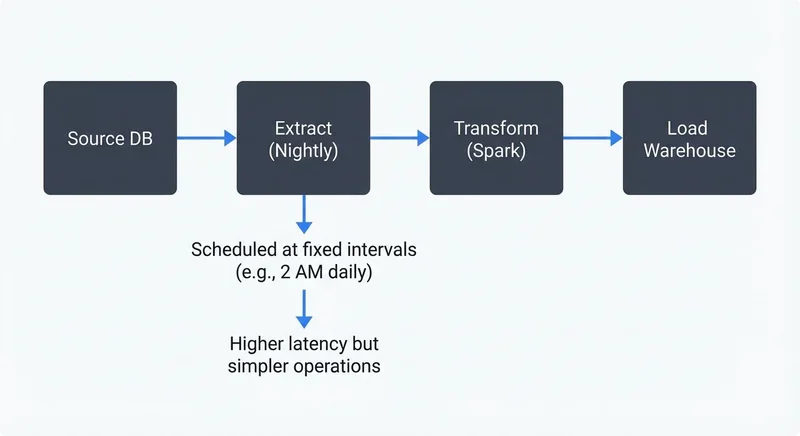
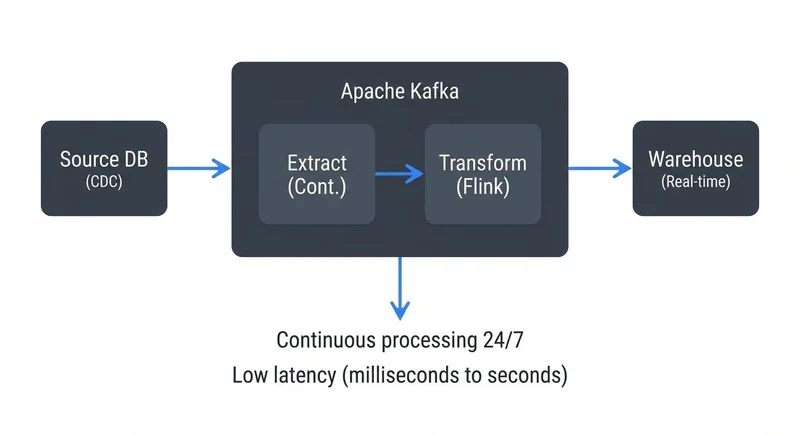

# Streaming ETL vs Traditional ETL

ETL (Extract, Transform, Load) has been the backbone of data integration for decades. As organizations demand faster insights and real-time decision-making, the choice between traditional batch ETL and streaming ETL has become a fundamental architectural decision. This article explores both approaches, their technical characteristics, and how to choose the right pattern for your use case.

## What is ETL?

ETL is a data integration process that moves and transforms data from source systems to destination systems, typically data warehouses or data lakes.

**Extract** retrieves data from one or more sources—databases, APIs, files, or message queues. **Transform** applies business logic, data cleaning, aggregations, or enrichment to make the data suitable for analysis. **Load** writes the processed data to a target system where it can be queried and analyzed.

The ETL pattern separates data collection from data consumption, allowing analytics systems to operate independently from operational systems. This separation has proven valuable for decades but comes with trade-offs in latency and complexity.

## Traditional Batch ETL

Traditional ETL operates on a batch processing model. Data is collected over a time window (hourly, daily, weekly) and processed as a discrete batch job.



<!-- ORIGINAL_DIAGRAM
```
Batch ETL Flow:

  ┌──────────┐     ┌──────────┐     ┌──────────┐     ┌───────────┐
  │  Source  │────▶│ Extract  │────▶│Transform │────▶│   Load    │
  │    DB    │     │ (Nightly)│     │ (Spark)  │     │Warehouse  │
  └──────────┘     └──────────┘     └──────────┘     └───────────┘
                   Scheduled at fixed intervals (e.g., 2 AM daily)
                   ↓
                   Higher latency but simpler operations
```
-->

A typical batch ETL workflow runs on a schedule: extract data accumulated since the last run, transform it using tools like Apache Spark or custom scripts, and load it into a data warehouse such as Snowflake or BigQuery. Each batch represents a complete processing cycle with clear start and end points.

**Characteristics of batch ETL:**

- **Scheduled execution**: Jobs run at fixed intervals (e.g., every night at 2 AM)
- **High throughput**: Optimized for processing large volumes efficiently
- **Simpler failure recovery**: Failed batches can be reprocessed in isolation
- **Higher latency**: Data freshness depends on batch frequency
- **Resource optimization**: Processing resources can be allocated during off-peak hours

Batch ETL excels when data doesn't need to be immediately available. A retail company might run nightly ETL jobs to update their data warehouse with yesterday's sales, inventory movements, and customer activities. The overnight processing window provides sufficient time for complex transformations and ensures analysts have fresh data each morning.

## Streaming ETL

Streaming ETL processes data continuously as it arrives, transforming and loading records individually or in micro-batches (small groups of records processed together for efficiency) within seconds or milliseconds.



<!-- ORIGINAL_DIAGRAM
```
Streaming ETL Flow:

  ┌──────────┐                                         ┌───────────┐
  │  Source  │────▶┌─────────────────────────────┐───▶│Warehouse  │
  │    DB    │     │      Apache Kafka           │    │  (Real-   │
  └──────────┘     │  ┌─────────┐  ┌──────────┐  │    │   time)   │
    (CDC)          │  │ Extract │─▶│Transform │  │    └───────────┘
                   │  │ (Cont.) │  │ (Flink)  │  │
                   │  └─────────┘  └──────────┘  │
                   └─────────────────────────────┘
                   Continuous processing 24/7
                   ↓
                   Low latency (milliseconds to seconds)
```
-->

Instead of waiting for scheduled intervals, streaming ETL pipelines react to new data events. When a user clicks a button, a sensor emits a reading, or a transaction occurs, the event flows through the pipeline immediately. Transformations happen in-flight, and results are continuously updated in the destination system.

**Characteristics of streaming ETL:**

- **Continuous processing**: Data flows through the pipeline 24/7
- **Low latency**: Near real-time data availability (seconds to milliseconds)
- **Event-driven**: Processing triggered by data arrival, not schedules
- **Stateful operations**: Maintains context across events for operations like windowing (aggregating data over time periods), joins (combining streams), and running totals
- **Higher operational complexity**: Requires always-on infrastructure and monitoring

Streaming ETL is essential when timely data drives business value. A fraud detection system might use streaming ETL to analyze credit card transactions as they occur, flagging suspicious patterns within milliseconds. An IoT platform could process sensor data from thousands of devices, detecting anomalies and triggering alerts before problems escalate. For a comprehensive introduction to streaming concepts, see [What is Real-Time Data Streaming](https://conduktor.io/glossary/what-is-real-time-data-streaming).

## Key Differences Between Batch and Streaming ETL

The choice between batch and streaming ETL involves several technical and business trade-offs.

**Latency**: Batch ETL inherently has higher latency—from minutes to hours or days depending on batch frequency. Streaming ETL achieves subsecond to low-second latencies. If your use case can tolerate data that's hours old, batch may suffice. If decisions depend on current state, streaming is necessary.

**Complexity**: Batch ETL is conceptually simpler. Each batch is independent, making debugging and testing straightforward. Streaming ETL requires managing stateful operations, handling out-of-order events, and dealing with exactly-once processing semantics (ensuring each event is processed exactly once, avoiding duplicates or data loss even during failures). The operational overhead of maintaining streaming infrastructure is higher.

**Cost**: Batch ETL can be more cost-effective for high-volume, infrequent processing. You spin up compute resources, process the batch, and shut down. Streaming ETL requires continuously running infrastructure, though cloud-native streaming platforms have made this more economical with auto-scaling and managed services.

**Use cases**: Batch ETL suits historical reporting, compliance archiving, and bulk data migrations. Streaming ETL fits real-time dashboards, operational analytics, fraud detection, and event-driven architectures.

**Failure handling**: Batch jobs can be rerun if they fail, reprocessing the same input. Streaming pipelines must handle failures while data continues arriving, requiring checkpointing and state management to avoid data loss or duplication.

## Streaming ETL Technologies and Platforms

Modern streaming ETL relies on specialized platforms designed for continuous data processing.

**Apache Kafka** serves as the backbone for many streaming ETL architectures. Kafka acts as a distributed event streaming platform, capturing data from sources and making it available to downstream processors. Kafka Connect provides connectors to extract data from databases, applications, and cloud services, while Kafka Streams enables lightweight stream processing. Modern Kafka (4.0+) has eliminated the ZooKeeper dependency through KRaft mode, significantly simplifying cluster operations and reducing operational overhead for streaming ETL pipelines. For foundational Kafka concepts, see [Apache Kafka](https://conduktor.io/glossary/apache-kafka).

**Apache Flink** is a stream processing framework built for stateful computations over unbounded data streams. Flink excels at complex event processing, windowed aggregations, and exactly-once semantics. It can process millions of events per second with millisecond latency. Flink 1.18+ introduces improved Table API and unified batch-streaming capabilities, allowing teams to write transformation logic once and execute it in either batch or streaming mode depending on requirements. For a deep dive into Flink's architecture and capabilities, see [What is Apache Flink: Stateful Stream Processing](https://conduktor.io/glossary/what-is-apache-flink-stateful-stream-processing).

**Other technologies** include Apache Pulsar (an alternative to Kafka with built-in multi-tenancy), Apache Beam (a unified programming model for batch and streaming), and cloud-native services like AWS Kinesis, Google Cloud Dataflow, and Azure Stream Analytics.

A typical streaming ETL pipeline might use Kafka Connect with Debezium to capture database changes via change data capture (CDC reads database transaction logs to capture inserts, updates, and deletes in real-time), Kafka Streams or Flink to transform and enrich events, and sink connectors to load results into destinations like Elasticsearch for real-time search, Snowflake for analytics, or lakehouse table formats such as Apache Iceberg and Delta Lake. For detailed CDC patterns, see [What is Change Data Capture (CDC) Fundamentals](https://conduktor.io/glossary/what-is-change-data-capture-cdc-fundamentals).

Platforms like Conduktor help teams manage Kafka-based streaming ETL pipelines by providing monitoring, data quality validation, and governance tools. Conduktor Gateway enables testing transformation logic and chaos engineering for streaming pipelines before production deployment, helping teams validate ETL behavior under failure conditions. As streaming architectures grow in complexity, visibility and governance become critical operational requirements.

**Lakehouse Integration**: Modern streaming ETL increasingly targets lakehouse architectures using table formats like Apache Iceberg, Delta Lake, and Apache Hudi. These formats enable ACID transactions, time travel, and schema evolution while supporting both batch and streaming writes, unifying traditionally separate batch and streaming storage layers. Streaming ETL can now write directly to lakehouse tables with the same transactional guarantees as traditional databases. For more on lakehouse patterns, see [Streaming to Lakehouse Tables](https://conduktor.io/glossary/streaming-to-lakehouse-tables).

## Choosing Between Batch and Streaming ETL

The decision isn't always binary. Many organizations use both approaches for different use cases or combine them in hybrid architectures.

**Choose batch ETL when:**
- Data freshness requirements are measured in hours or days
- Processing large historical datasets efficiently is the priority
- Simpler operational requirements are preferred
- Cost optimization through scheduled resource allocation is important
- Use cases involve complex transformations better suited to batch processing frameworks

**Choose streaming ETL when:**
- Real-time or near-real-time data is required for business decisions
- Event-driven architectures are being built
- Continuous monitoring or alerting is needed
- Data volume is manageable for continuous processing
- The organization has expertise in streaming platforms

**Hybrid approaches** are increasingly common. A company might use streaming ETL to feed real-time dashboards and operational systems while running batch ETL overnight to update historical reporting tables with complex transformations. The Lambda architecture pattern explicitly combines batch and streaming layers to balance speed and accuracy, maintaining separate code paths for each. However, modern tools increasingly favor the simpler Kappa architecture, which uses a streaming-only approach with the ability to reprocess historical data when needed, eliminating the complexity of maintaining two separate systems.

Consider starting with batch ETL for foundational analytics needs, then introducing streaming ETL for specific high-value real-time use cases. This pragmatic approach balances business value against operational complexity.

## Summary

Traditional batch ETL and streaming ETL represent different architectural approaches to data integration, each with distinct strengths. Batch ETL offers simplicity, cost-effectiveness, and high throughput for scheduled processing, making it ideal for historical reporting and bulk data loads. Streaming ETL provides low latency and continuous processing, essential for real-time analytics and event-driven applications.

The choice depends on latency requirements, operational complexity tolerance, cost considerations, and specific use cases. Modern data platforms often employ both patterns, using streaming for time-sensitive workloads and batch for comprehensive historical processing. Technologies like Apache Kafka and Apache Flink have matured streaming ETL into a production-ready approach, while tools for managing these pipelines continue to evolve.

Understanding both approaches allows data engineers to design architectures that balance business requirements with technical and operational realities.

## Sources and References

1. Kleppmann, Martin. *Designing Data-Intensive Applications*. O'Reilly Media, 2017. (Chapter 11: Stream Processing)

2. Apache Kafka Documentation. "Kafka Streams", "Kafka Connect", and "KRaft Mode". https://kafka.apache.org/documentation/ (Updated 2024-2025 for Kafka 4.0+)

3. Apache Flink Documentation. "DataStream API", "Table API", and "Stateful Stream Processing". https://flink.apache.org/ (Updated 2024-2025 for Flink 1.18+)

4. Narkhede, Neha, Gwen Shapira, and Todd Palino. *Kafka: The Definitive Guide*. O'Reilly Media, 2017.

5. Databricks. "Delta Live Tables: ETL Framework for Batch and Streaming". https://www.databricks.com/product/delta-live-tables

6. Apache Iceberg Documentation. "Streaming Writes and Table Evolution". https://iceberg.apache.org/ (2024-2025)

7. Conduktor Documentation. "Kafka Pipeline Management, Testing, and Governance". https://www.conduktor.io/ (2024-2025)

8. Debezium Documentation. "Change Data Capture for Streaming ETL". https://debezium.io/ (2024-2025)
