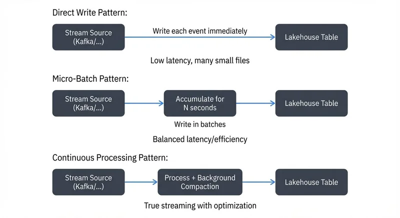

## Introduction

The Lakehouse architecture has emerged as a unified approach to data management, combining the flexibility of data lakes with the structure and performance of data warehouses. At the heart of modern Lakehouse implementations lies a critical component: the streaming ingestion pipeline. This pipeline serves as the bridge between real-time data sources and analytical platforms, enabling organizations to process and analyze data as it arrives rather than waiting for batch processing windows.

A streaming ingestion pipeline continuously captures data from various sources—such as Apache Kafka, AWS Kinesis, Azure Event Hubs, or Change Data Capture (CDC) systems—and writes it to Lakehouse table formats like Delta Lake, Apache Iceberg, or Apache Hudi. This real-time data path is the first step toward building a responsive analytics platform that can power everything from operational dashboards to machine learning models.

For foundational understanding of lakehouse concepts, see [Introduction to Lakehouse Architecture](https://conduktor.io/glossary/introduction-to-lakehouse-architecture). To understand CDC as a streaming source, refer to [What is Change Data Capture (CDC)](https://conduktor.io/glossary/what-is-change-data-capture-cdc-fundamentals).

## Streaming Ingestion Architecture Patterns

<!-- ORIGINAL_DIAGRAM
```
Direct Write Pattern:
┌─────────────┐
│   Stream    │──────▶ Write each event ──────▶┌──────────────┐
│   Source    │        immediately              │  Lakehouse   │
│ (Kafka/...)│                                  │   Table      │
└─────────────┘                                 └──────────────┘
                Low latency, many small files

Micro-Batch Pattern:
┌─────────────┐         ┌──────────────┐        ┌──────────────┐
│   Stream    │────────▶│ Accumulate   │───────▶│  Lakehouse   │
│   Source    │         │ for N seconds│        │   Table      │
│ (Kafka/...)│         └──────────────┘        └──────────────┘
└─────────────┘         Write in batches
                Balanced latency/efficiency

Continuous Processing Pattern:
┌─────────────┐         ┌──────────────┐        ┌──────────────┐
│   Stream    │────────▶│ Process +    │───────▶│  Lakehouse   │
│   Source    │         │ Background   │        │   Table      │
│ (Kafka/...)│         │ Compaction   │        │              │
└─────────────┘         └──────────────┘        └──────────────┘
                True streaming with optimization
```
-->

### Direct Write Pattern

The direct write pattern streams data directly from the source to the Lakehouse table format without intermediate staging. Each incoming event triggers an immediate write operation, providing the lowest possible latency. This pattern works best for high-value, low-volume data streams where immediate availability is critical.

However, direct writes can be inefficient for high-throughput scenarios. Writing individual records generates many small files, leading to performance degradation during queries. The small file problem is particularly acute in object storage systems like S3, where metadata operations become a bottleneck.

### Micro-Batch Pattern

Micro-batching collects streaming events into small batches before writing to the Lakehouse. This approach balances latency and efficiency by accumulating data over short time windows (typically seconds to minutes) and then writing larger, more efficient files.

Apache Spark Structured Streaming popularized this pattern with its trigger intervals. A 30-second micro-batch, for example, accumulates all events within that window and writes them as a single transaction. This reduces the number of files created and improves query performance while maintaining near-real-time freshness.

### Continuous Processing Pattern

Continuous processing treats the stream as an infinite table, applying transformations and aggregations as data flows through the pipeline. Rather than batching at fixed intervals, the system processes records as soon as possible while maintaining efficient file sizes through background compaction.

Apache Flink excels at this pattern, offering true continuous processing with millisecond latency. The system handles **backpressure** gracefully (the automatic slowing of data ingestion when downstream processing can't keep up) and maintains exactly-once semantics even under failure scenarios. For detailed coverage of backpressure strategies, see [Backpressure Handling in Streaming Systems](https://conduktor.io/glossary/backpressure-handling-in-streaming-systems).

## Data Format Considerations

### Columnar Formats: Parquet and ORC

Lakehouse architectures typically use columnar file formats optimized for analytical queries. Apache Parquet has become the de facto standard due to its excellent compression, efficient encoding schemes, and broad ecosystem support. ORC (Optimized Row Columnar) offers similar benefits with slightly different trade-offs.

Columnar formats enable query engines to read only the columns needed for a specific query, dramatically reducing I/O. They also support **predicate pushdown**, a query optimization technique where filter conditions are applied during file reads rather than after loading data into memory, further reducing I/O and processing time.

When ingesting streaming data, choose appropriate Parquet row group sizes (typically 128MB to 1GB) to balance write efficiency with read performance. Row groups are chunks of rows stored together within a Parquet file; smaller row groups enable better filtering and skipping during reads but increase metadata overhead, while larger row groups reduce metadata but may force reading more data than needed.

### Schema Evolution

Streaming ingestion pipelines must handle schema changes gracefully. Producer applications evolve, adding new fields, changing data types, or restructuring nested objects. Your pipeline needs a strategy for managing these changes without breaking downstream consumers.

Delta Lake, Iceberg, and Hudi all support schema evolution with varying capabilities:

- **Additive changes** (new columns) are generally safe and can be handled automatically
- **Column deletions** require careful consideration of existing queries
- **Type changes** may need explicit migration logic
- **Nested schema changes** in JSON/Avro structures require special handling

Implement schema validation at ingestion time to catch incompatible changes early. Use a schema registry (like AWS Glue Schema Registry or open-source schema registry solutions) to enforce contracts between producers and consumers.

## Partitioning Strategies

### Time-Based Partitioning

Most streaming datasets exhibit strong temporal patterns. Partitioning by date or hour is the most common strategy, enabling efficient time-range queries and simplifying data retention policies.

```
/table_name/
  year=2025/
    month=12/
      day=17/
        hour=14/
          part-00000.parquet
          part-00001.parquet
```

Time-based partitioning aligns naturally with streaming workloads where recent data is queried most frequently. Queries with time filters can skip entire partitions, dramatically reducing data scanned.

### Composite Partitioning

Combine temporal partitioning with high-cardinality dimensions for more selective filtering. For example, partition by `date` and `region` to enable efficient queries filtered by both dimensions.

Be cautious with partition explosion—too many partitions create metadata overhead and slow down query planning. Aim for partitions between 256MB and 1GB in size. If a partitioning scheme creates thousands of small partitions, consider using Z-ordering or data skipping instead.

### Dynamic Partitioning

Streaming ingestion pipelines must handle dynamic partition discovery. Unlike batch jobs that process known partitions, streams continuously create new time-based partitions as data arrives.

Ensure your catalog (AWS Glue, Hive Metastore, or the table format's native catalog) automatically registers new partitions. Delta Lake and Iceberg provide atomic operations that update both data and metadata in a single transaction, eliminating partition registration as a separate step.

## Ensuring Exactly-Once Semantics

### The Challenge of Distributed Processing

Achieving exactly-once processing in distributed streaming systems is notoriously difficult. Network failures, process crashes, and rebalancing events can cause messages to be processed multiple times or skipped entirely.

For analytical workloads, duplicate records corrupt aggregations, double-count metrics, and erode trust in data. Exactly-once semantics ensures each record affects the final output exactly once, regardless of failures. For deeper understanding of exactly-once guarantees, see [Exactly-Once Semantics in Kafka](https://conduktor.io/glossary/exactly-once-semantics-in-kafka).

### Checkpointing and State Management

Streaming frameworks use **checkpointing** to achieve fault tolerance. Checkpointing is the process of periodically saving the processing position (offsets in Kafka, sequence numbers in Kinesis) along with any stateful computations to durable storage.

On failure, the system restarts from the last successful checkpoint, reprocessing any records since that point. This provides **at-least-once semantics**—a delivery guarantee where records might be processed multiple times but are never skipped or lost.

### Transactional Writes

Lakehouse table formats elevate this to exactly-once through transactional writes. Delta Lake, Iceberg, and Hudi support ACID transactions that commit data and update metadata atomically.

The pattern works as follows:

1. Read data from the stream starting at the last committed offset
2. Process and transform the data
3. Write results to temporary files
4. Commit the transaction, atomically updating both the table metadata and the checkpoint
5. If the commit fails (due to conflicts or crashes), discard temporary files and retry from the checkpoint

This ensures that each batch of streaming data is either fully committed or not visible at all. Duplicate processing attempts produce identical outputs, and the transaction layer deduplicates them automatically.

## Backfill and Replay Capabilities

### Historical Data Loading

Streaming pipelines must often backfill historical data when onboarding new sources or recovering from extended outages. The challenge is processing months or years of historical data while simultaneously handling live streaming data.

Use the same pipeline code for both backfill and streaming to ensure consistency. Configure different parallelism levels and checkpointing intervals for historical batch loads versus continuous streaming. Tools like Apache Spark can dynamically adjust these parameters based on the source type.

### Time Travel and Replay

Lakehouse table formats provide time travel capabilities, allowing queries to read data as it existed at any point in the past. This is invaluable for debugging data quality issues, auditing changes, and reproducing historical analyses.

Delta Lake's `VERSION AS OF` and Iceberg's snapshot isolation enable point-in-time queries without maintaining separate copies of data. For more on Iceberg's time travel capabilities, see [Time Travel with Apache Iceberg](https://conduktor.io/glossary/time-travel-with-apache-iceberg). Streaming pipelines can replay specific time ranges by reading from historical table versions, supporting use cases like:

- Reprocessing data with corrected business logic
- A/B testing new transformation algorithms
- Validating data quality fixes

Implement retention policies to balance storage costs with time travel requirements. Most organizations keep 30-90 days of historical versions for operational needs.

## Monitoring and Observability

### Throughput and Latency Metrics

Monitor end-to-end latency from event generation to Lakehouse availability. Track:

- **Source lag**: How far behind is the consumer from the latest offset? For detailed monitoring approaches, see [Consumer Lag Monitoring](https://conduktor.io/glossary/consumer-lag-monitoring).
- **Processing latency**: Time spent transforming and enriching data
- **Write latency**: Time to commit data to the Lakehouse
- **Query latency**: Time for data to become visible in downstream queries

Set up alerts when lag exceeds acceptable thresholds. For time-sensitive applications, 5-minute lag might be concerning; for others, 1-hour lag is acceptable.

Measure throughput in records per second and megabytes per second. Compare actual throughput against expected rates to detect bottlenecks or capacity issues.

Use dedicated monitoring tools like **Conduktor** for comprehensive Kafka cluster visibility and consumer lag tracking with [Kafka Connect Management](https://docs.conduktor.io/guide/manage-kafka/kafka-resources/kafka-connect), or open-source solutions like kafka-lag-exporter or Burrow combined with Prometheus and Grafana for custom monitoring dashboards.

### Data Quality Monitoring

Ingestion pipelines should validate data quality in real-time:

- **Schema validation**: Reject malformed records that violate schema constraints
- **Null checks**: Monitor unexpected null values in critical fields
- **Range validation**: Detect values outside expected ranges (negative prices, future dates)
- **Freshness**: Alert when data stops arriving from a source

Modern data quality frameworks like Soda Core or Great Expectations can be integrated into streaming pipelines to enforce data quality rules continuously. For comprehensive data quality strategies, see [Building a Data Quality Framework](https://conduktor.io/glossary/building-a-data-quality-framework). Route invalid records to a dead-letter queue for investigation rather than failing the entire pipeline. For error handling patterns, refer to [Dead Letter Queues for Error Handling](https://conduktor.io/glossary/dead-letter-queues-for-error-handling).

### Operational Metrics

Track infrastructure health:

- **Resource utilization**: CPU, memory, and network usage
- **Backpressure**: Is the pipeline keeping up with the incoming data rate?
- **Failure rates**: Processing errors, transaction conflicts, retry attempts
- **File metrics**: Number and size of files created per partition

Modern Lakehouse platforms provide built-in monitoring dashboards. For Spark Structured Streaming, the web UI shows micro-batch statistics, execution plans, and performance metrics.

## Tools and Technologies

### Apache Spark Structured Streaming

Spark Structured Streaming extends Spark's DataFrames API to handle infinite streams. It provides exactly-once semantics when combined with Delta Lake, Iceberg, or Hudi, making it a popular choice for Lakehouse ingestion.

Structured Streaming's micro-batch execution model simplifies reasoning about streaming logic. Developers write familiar batch-style transformations, and Spark handles the streaming execution automatically.

Key features include:
- Unified batch and streaming code
- Built-in support for watermarking and late data handling
- Integration with all major Lakehouse formats
- Extensive connector ecosystem for sources and sinks

**Example: Kafka to Delta Lake Pipeline**

```python
from pyspark.sql import SparkSession
from pyspark.sql.functions import from_json, col
from pyspark.sql.types import StructType, StructField, StringType, TimestampType

# Initialize Spark with Delta Lake support
spark = SparkSession.builder \
    .appName("KafkaToDeltaLake") \
    .config("spark.sql.extensions", "io.delta.sql.DeltaSparkSessionExtension") \
    .config("spark.sql.catalog.spark_catalog", "org.apache.spark.sql.delta.catalog.DeltaCatalog") \
    .getOrCreate()

# Define schema for incoming events
event_schema = StructType([
    StructField("user_id", StringType()),
    StructField("event_type", StringType()),
    StructField("timestamp", TimestampType()),
    StructField("properties", StringType())
])

# Read from Kafka
kafka_stream = spark \
    .readStream \
    .format("kafka") \
    .option("kafka.bootstrap.servers", "localhost:9092") \
    .option("subscribe", "user-events") \
    .option("startingOffsets", "earliest") \
    .load()

# Parse JSON and transform
parsed_stream = kafka_stream \
    .select(from_json(col("value").cast("string"), event_schema).alias("data")) \
    .select("data.*")

# Write to Delta Lake with checkpointing for exactly-once semantics
query = parsed_stream \
    .writeStream \
    .format("delta") \
    .outputMode("append") \
    .option("checkpointLocation", "/tmp/checkpoints/user-events") \
    .trigger(processingTime="30 seconds") \
    .partitionBy("timestamp") \
    .start("/data/lakehouse/user_events")

query.awaitTermination()
```

This example demonstrates a complete streaming pipeline with exactly-once semantics via checkpointing, 30-second micro-batches for efficiency, and automatic time-based partitioning.

### Apache Flink

Flink is a true stream-first processing engine designed for low-latency, high-throughput workloads. It offers millisecond latency with exactly-once guarantees through its checkpointing mechanism. For comprehensive coverage, see [What is Apache Flink: Stateful Stream Processing](https://conduktor.io/glossary/what-is-apache-flink-stateful-stream-processing).

Flink excels at complex event processing, temporal joins, and stateful aggregations. For use cases requiring sub-second freshness, Flink is often the better choice over Spark's micro-batch approach. For a detailed comparison, refer to [Flink vs Spark Streaming: When to Choose Each](https://conduktor.io/glossary/flink-vs-spark-streaming-when-to-choose-each).

Recent Flink versions include native support for Iceberg and Delta Lake, enabling direct streaming writes to Lakehouse tables without external connectors. For more on Flink's state management, see [Flink State Management and Checkpointing](https://conduktor.io/glossary/flink-state-management-and-checkpointing).

### Native Connectors

Lakehouse platforms increasingly offer native streaming connectors that simplify ingestion:

- **Databricks Auto Loader**: Ingests files from cloud storage with exactly-once guarantees
- **Delta Live Tables**: Declarative pipeline framework for streaming and batch ETL
- **Kafka Connect with Iceberg/Delta sinks**: Direct Kafka-to-Lakehouse streaming without custom code

These managed solutions reduce operational complexity but may offer less flexibility than custom Spark or Flink jobs. Evaluate trade-offs based on your team's expertise and specific requirements.

### Modern Features and Best Practices (2025)

**Kafka 4.0+ with KRaft**: Modern Kafka deployments use KRaft consensus protocol instead of ZooKeeper, improving reliability, reducing operational complexity, and providing faster metadata operations for streaming ingestion pipelines. KRaft is now the default and recommended deployment model. For detailed information, see [Understanding KRaft Mode in Kafka](https://conduktor.io/glossary/understanding-kraft-mode-in-kafka).

**Flink 1.18+**: Recent Flink versions include significant improvements relevant to lakehouse ingestion:
- Enhanced checkpoint coordination for faster recovery times
- Improved memory management reducing overhead for connector operations
- Better backpressure handling and adaptive batch sizing
- Native support for hybrid batch/streaming processing

**Delta Lake 3.x Liquid Clustering**: Replaces manual partitioning with automatic data layout optimization. Liquid clustering continuously reorganizes data in the background to optimize query performance without requiring explicit partition keys, particularly beneficial for high-cardinality streaming data. For more details, see [Delta Lake Liquid Clustering: Modern Partitioning](https://conduktor.io/glossary/delta-lake-liquid-clustering-modern-partitioning).

**Iceberg 1.4+ Advanced Features**:
- Partition evolution: Change partitioning strategies without rewriting existing data
- Branching and tagging: Test schema changes or new ingestion logic on isolated table branches
- Z-ordering improvements: Better multi-dimensional clustering for complex query patterns

For comprehensive Iceberg details, see [Apache Iceberg](https://conduktor.io/glossary/apache-iceberg) and [Iceberg Partitioning and Performance Optimization](https://conduktor.io/glossary/iceberg-partitioning-and-performance-optimization).

**Apache Hudi 0.14+**: Enhanced merge-on-read performance and improved compaction strategies for streaming upserts, making it increasingly competitive for CDC and streaming ingestion workloads.

## Governance and Compliance

### Data Lineage

Understanding data flow from source systems through streaming pipelines to final Lakehouse tables is critical for debugging, auditing, and compliance. Implement lineage tracking that captures:

- Source topic/stream and partition
- Transformation logic applied
- Target table and partition
- Processing timestamp and job ID

Tools like Apache Atlas, OpenLineage, and commercial solutions provide lineage visualization and impact analysis. When a data quality issue arises, lineage helps trace it back to the root cause. For comprehensive coverage, see [Data Lineage: Tracking Data from Source to Consumption](https://conduktor.io/glossary/data-lineage-tracking-data-from-source-to-consumption).

### Cataloging and Discovery

Register all Lakehouse tables in a central catalog with rich metadata:

- Schema and partitioning scheme
- Data quality metrics and SLAs
- Owner and steward contacts
- Sensitivity classification (PII, confidential, public)

AWS Glue Data Catalog, Databricks Unity Catalog, and open-source projects like Amundsen enable data discovery and governance at scale. For more on cataloging strategies, see [What is a Data Catalog: Modern Data Discovery](https://conduktor.io/glossary/what-is-a-data-catalog-modern-data-discovery).

### Access Control

Implement fine-grained access control on streaming ingestion pipelines and Lakehouse tables. Define who can:

- Read from source streams
- Write to specific Lakehouse tables
- Modify pipeline configurations
- Access sensitive data columns

Modern Lakehouse platforms support column-level security, row-level filtering, and dynamic data masking. For example, Unity Catalog and Apache Ranger provide attribute-based access control (ABAC) that adapts permissions based on user roles and data classification. For detailed access control strategies, see [Access Control for Streaming](https://conduktor.io/glossary/access-control-for-streaming).

Platforms like **Conduktor** extend governance to the streaming layer, providing visibility, policy enforcement, and access control across Kafka clusters. Validate data quality before it reaches the lakehouse with [Data Quality Monitoring](https://docs.conduktor.io/guide/use-cases/observe-data-quality) and manage connectors with [Kafka Connect tools](https://docs.conduktor.io/guide/manage-kafka/kafka-resources/kafka-connect). By governing data at the source, you establish a foundation of quality and compliance that flows through to the Lakehouse. For audit considerations, refer to [Audit Logging for Streaming Platforms](https://conduktor.io/glossary/audit-logging-for-streaming-platforms).

## Conclusion

Streaming ingestion to Lakehouse architectures represents a fundamental shift in how organizations handle data. By connecting real-time streams directly to analytical platforms, you enable faster decision-making, more responsive applications, and unified data pipelines that serve both operational and analytical workloads.

Success requires careful attention to architecture patterns, data formats, partitioning strategies, and exactly-once semantics. Modern tools like Spark Structured Streaming and Apache Flink, combined with Lakehouse table formats like Delta Lake and Iceberg, provide the building blocks for robust streaming ingestion.

As you design your pipelines, prioritize monitoring and observability. Streaming systems are complex and distributed; comprehensive metrics and alerts are essential for maintaining reliability. For comprehensive observability strategies, see [What is Data Observability: The Five Pillars](https://conduktor.io/glossary/what-is-data-observability-the-five-pillars). Implement governance early—lineage, cataloging, and access control become exponentially harder to retrofit after the fact.

The result is a real-time data platform that supports both traditional batch analytics and emerging streaming use cases, all built on a unified Lakehouse foundation.

## Related Concepts

- [Streaming ETL vs Traditional ETL](/streaming-etl-vs-traditional-etl)
- [Kafka Connect: Building Data Integration Pipelines](/kafka-connect-building-data-integration-pipelines)
- [Data Lineage: Tracking Data from Source to Consumption](/data-lineage-tracking-data-from-source-to-consumption)

## Sources and References

- [Apache Kafka Documentation](https://kafka.apache.org/documentation/) - Comprehensive guide to streaming platform architecture
- [Delta Lake Documentation](https://docs.delta.io/) - ACID transactions and streaming writes to lakehouse tables
- [Apache Iceberg Documentation](https://iceberg.apache.org/docs/latest/) - Open table format for large analytic datasets
- [Apache Flink Streaming](https://nightlies.apache.org/flink/flink-docs-stable/) - Stream processing framework for real-time data pipelines
- [Databricks Lakehouse Platform](https://www.databricks.com/product/data-lakehouse) - Unified architecture for streaming and batch analytics
