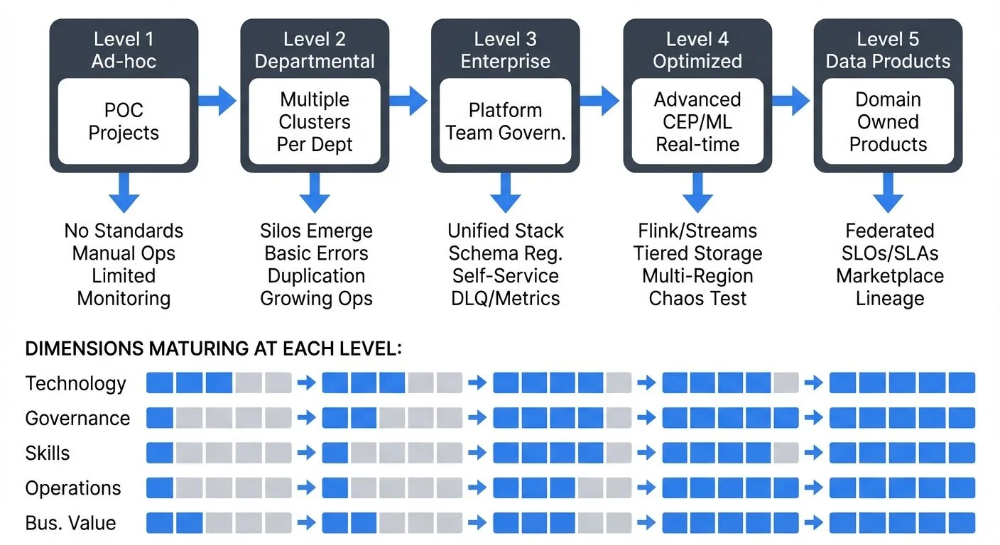

# Streaming Maturity Model: Assessing Your Real-Time Data Capabilities

Organizations adopting streaming technologies often face a common challenge: how to evolve from initial proof-of-concepts to enterprise-grade real-time data platforms. A streaming maturity model provides a structured framework for assessing your current capabilities and charting a path toward more sophisticated streaming architectures.



<!-- ORIGINAL_DIAGRAM
```
STREAMING MATURITY MODEL: 5-LEVEL PROGRESSION

Level 1          Level 2           Level 3           Level 4          Level 5
Ad-hoc      →   Departmental  →   Enterprise   →   Optimized   →   Data Products

┌─────────┐     ┌──────────┐     ┌──────────┐     ┌─────────┐     ┌──────────┐
│  POC    │     │ Multiple │     │ Platform │     │ Advanced│     │ Domain   │
│Projects │ ──▶ │ Clusters │ ──▶ │  Team    │ ──▶ │ CEP/ML  │ ──▶ │ Owned    │
│         │     │ Per Dept │     │ Govern.  │     │ Real-time│     │ Products │
└─────────┘     └──────────┘     └──────────┘     └─────────┘     └──────────┘
    │               │                 │                 │               │
    ▼               ▼                 ▼                 ▼               ▼
No Standards   Silos Emerge    Unified Stack     Flink/Streams    Federated
Manual Ops     Basic Errors    Schema Reg.       Tiered Storage   SLOs/SLAs
Limited         Duplication    Self-Service      Multi-Region     Marketplace
Monitoring      Growing Ops    DLQ/Metrics       Chaos Test       Lineage

DIMENSIONS MATURING AT EACH LEVEL:
┌────────────────────────────────────────────────────────────────────┐
│ Technology  ▰▰▱▱▱ → ▰▰▰▱▱ → ▰▰▰▰▱ → ▰▰▰▰▰ → ▰▰▰▰▰                │
│ Governance  ▰▱▱▱▱ → ▰▰▱▱▱ → ▰▰▰▰▱ → ▰▰▰▰▰ → ▰▰▰▰▰                │
│ Skills      ▰▱▱▱▱ → ▰▰▱▱▱ → ▰▰▰▱▱ → ▰▰▰▰▱ → ▰▰▰▰▰                │
│ Operations  ▰▱▱▱▱ → ▰▰▱▱▱ → ▰▰▰▰▱ → ▰▰▰▰▰ → ▰▰▰▰▰                │
│ Bus. Value  ▰▰▱▱▱ → ▰▰▱▱▱ → ▰▰▰▱▱ → ▰▰▰▰▱ → ▰▰▰▰▰                │
└────────────────────────────────────────────────────────────────────┘
```
-->

## Understanding Maturity Models for Streaming

A maturity model is a diagnostic and planning tool that helps organizations understand where they are in their streaming journey and what capabilities they need to develop next. Unlike traditional batch-oriented data architectures, streaming platforms require distinct competencies across technology, governance, skills, and operations.

The value of a maturity model lies in its ability to:
- **Benchmark** your current streaming capabilities objectively
- **Identify gaps** between current state and desired outcomes
- **Prioritize investments** in technology, people, and processes
- **Communicate** streaming strategy to stakeholders
- **Track progress** over time with measurable indicators

### Key Terminology

Before diving into maturity levels, here are essential concepts you'll encounter:

- **Schema Registry**: A centralized service that stores and validates data schemas, ensuring all producers and consumers agree on data formats. For detailed coverage, see [Schema Registry and Schema Management](https://conduktor.io/glossary/schema-registry-and-schema-management).
- **Data Contracts**: Explicit agreements between data producers and consumers defining schema, SLAs, and quality expectations. Learn more in [Data Contracts for Reliable Pipelines](https://conduktor.io/glossary/data-contracts-for-reliable-pipelines).
- **Consumer Groups**: Mechanism for distributing message processing across multiple consumers for scalability and fault tolerance.
- **Dead Letter Queue (DLQ)**: A separate queue for messages that fail processing after retries, enabling error isolation and investigation. See [Dead Letter Queues for Error Handling](https://conduktor.io/glossary/dead-letter-queues-for-error-handling).
- **Stream Processing**: Real-time transformation and analysis of data as it flows through the system, often involving stateful operations like aggregations and joins.
- **Data Lineage**: Tracking data flow from source through transformations to consumption, essential for debugging and compliance. For more details, see [Data Lineage Tracking](https://conduktor.io/glossary/data-lineage-tracking-data-from-source-to-consumption).
- **KRaft Mode**: Kafka's modern consensus mechanism (as of Kafka 4.0) that eliminates ZooKeeper dependency. See [Understanding KRaft Mode in Kafka](https://conduktor.io/glossary/understanding-kraft-mode-in-kafka) for the full story.

## The Five Levels of Streaming Maturity

### Level 1: Ad-hoc/Experimental

Organizations at this stage are exploring streaming technologies through isolated proof-of-concepts. Teams typically run experimental projects to validate use cases like real-time monitoring or event-driven microservices.

**Characteristics:**
- Single or few streaming use cases
- No standardized technology stack
- Developer-centric setup and maintenance
- Limited understanding of streaming patterns
- Minimal operational support

**Common pitfalls:**
- Treating streaming like batch processing
- Underestimating operational complexity
- Lack of schema management
- No disaster recovery planning

**Success indicators:**
- Successful POC demonstrating business value
- Executive sponsorship secured
- Initial team trained on streaming concepts

**Example Implementation (Level 1):**
```python
# Simple Kafka consumer - no error handling, manual offset management
from kafka import KafkaConsumer
import json

consumer = KafkaConsumer('user-events', bootstrap_servers='localhost:9092')
for message in consumer:
    event = json.loads(message.value)
    print(f"Processing: {event['user_id']}")
    # Direct processing without retry logic or dead letter queue
    process_event(event)
```

### Level 2: Departmental

Multiple teams begin adopting streaming for their specific needs, leading to organic growth but potential fragmentation. Different departments may choose different technologies or implement incompatible patterns.

**Characteristics:**
- Multiple streaming clusters or platforms
- Department-specific standards emerging
- Growing operational burden
- Duplicated effort across teams
- Inconsistent data quality and governance

**Common pitfalls:**
- Technology sprawl and vendor lock-in
- Siloed streaming clusters
- Inconsistent naming and data formats
- Security and compliance gaps
- Lack of cross-team knowledge sharing

**Success indicators:**
- Documented streaming use cases across departments
- Recognition of need for centralized platform
- Initial governance discussions begun

**Example Implementation (Level 2):**
```python
# Departmental consumer - basic error handling, logging, but no schema validation
from kafka import KafkaConsumer
import logging
import json

logging.basicConfig(level=logging.INFO)
logger = logging.getLogger(__name__)

consumer = KafkaConsumer(
    'user-events',
    bootstrap_servers='kafka.dept-a:9092',  # Department-specific cluster
    group_id='dept-a-user-processor',
    enable_auto_commit=True,  # Simple auto-commit
    value_deserializer=lambda x: json.loads(x.decode('utf-8'))
)

for message in consumer:
    try:
        event = message.value
        logger.info(f"Processing user {event.get('user_id')}")

        # Department-specific processing logic
        process_event(event)

    except json.JSONDecodeError as e:
        logger.error(f"Invalid JSON: {e}")
        # No DLQ - just log and continue

    except KeyError as e:
        logger.error(f"Missing required field: {e}")
        # No schema validation - runtime errors

    except Exception as e:
        logger.error(f"Processing error: {e}")
        # Limited error handling
```

At Level 2, teams add basic reliability features but lack enterprise standards. Each department may use different error handling patterns, logging formats, and infrastructure configurations.

### Level 3: Enterprise

The organization establishes a centralized streaming platform with defined standards, governance, and self-service capabilities. This level represents a significant maturity leap requiring dedicated platform teams and executive commitment.

**Characteristics:**
- Unified streaming platform (Apache Kafka 4.0+ with KRaft mode, eliminating ZooKeeper complexity)
- Schema registry and data contracts enforced (Avro, Protobuf, or JSON Schema)
- Self-service provisioning for teams via governance platforms like Conduktor
- Centralized monitoring and operations (Prometheus metrics, Kafka Lag Exporter, distributed tracing)
- Security and compliance frameworks (mTLS, RBAC, audit logging)
- Reusable streaming connectors library (Kafka Connect, Debezium for CDC)
- Kubernetes-based deployment with operators like Strimzi for automated infrastructure management

**Common pitfalls:**
- Over-engineering governance processes
- Slow self-service provisioning
- Resistance to standards from legacy teams
- Insufficient monitoring and alerting
- Skills gap in streaming expertise

**Success indicators:**
- Platform uptime SLAs met consistently
- Reduced time to onboard new streaming use cases
- Growing catalog of reusable data streams
- Positive feedback from platform consumers

**Example Implementation (Level 3):**
```python
# Enterprise-grade consumer with schema validation, error handling, and monitoring
from confluent_kafka import DeserializingConsumer
from confluent_kafka.schema_registry import SchemaRegistryClient
from confluent_kafka.schema_registry.avro import AvroDeserializer
from confluent_kafka.serialization import StringDeserializer
from prometheus_client import Counter, Histogram
import structlog
import json

logger = structlog.get_logger()
events_processed = Counter('events_processed', 'Events processed', ['status'])
processing_duration = Histogram('processing_duration_seconds', 'Processing duration')

# Schema registry for data contracts
schema_registry_conf = {'url': 'http://schema-registry:8081'}
schema_registry_client = SchemaRegistryClient(schema_registry_conf)

# Create Avro deserializer for message values
avro_deserializer = AvroDeserializer(schema_registry_client,
                                     schema_str=None)  # Auto-fetch from registry

consumer_conf = {
    'bootstrap.servers': 'kafka:9092',
    'group.id': 'user-processor-v1',
    'key.deserializer': StringDeserializer('utf_8'),
    'value.deserializer': avro_deserializer,
    'enable.auto.commit': False,
    'auto.offset.reset': 'earliest'
}

consumer = DeserializingConsumer(consumer_conf)
consumer.subscribe(['user-events'])

retry_count = 0
MAX_RETRIES = 3

try:
    while True:
        msg = consumer.poll(1.0)
        if msg is None:
            continue
        if msg.error():
            logger.error("consumer_error", error=str(msg.error()))
            continue

        try:
            with processing_duration.time():
                # Message automatically validated against schema
                event = msg.value()
                logger.info("processing_event", user_id=event['user_id'],
                           event_type=event['event_type'])

                process_event(event)
                consumer.commit(msg)
                events_processed.labels(status='success').inc()
                retry_count = 0  # Reset on success

        except (KeyError, TypeError) as e:
            # Schema validation or data type errors
            send_to_dlq(msg, error=str(e))
            events_processed.labels(status='validation_error').inc()
            logger.error("validation_failed", error=str(e))
            consumer.commit(msg)  # Commit to skip bad message

        except Exception as e:
            # Retry logic with exponential backoff
            if retry_count < MAX_RETRIES:
                retry_count += 1
                logger.warning("retrying_message", attempt=retry_count, error=str(e))
                # Don't commit - will reprocess on next poll
            else:
                send_to_dlq(msg, error=str(e))
                events_processed.labels(status='error').inc()
                logger.error("processing_failed", error=str(e))
                consumer.commit(msg)  # Commit to skip after max retries
                retry_count = 0

finally:
    consumer.close()
```

The key differences between Level 1 and Level 3 implementations:
- **Schema enforcement** via schema registry ensures data contracts. For schema strategy details, see [Schema Registry and Schema Management](https://conduktor.io/glossary/schema-registry-and-schema-management) and [Avro vs Protobuf vs JSON Schema](https://conduktor.io/glossary/avro-vs-protobuf-vs-json-schema).
- **Structured logging** for observability and debugging with context propagation
- **Metrics instrumentation** for monitoring and alerting using Prometheus patterns
- **Error handling** with dead letter queues and retry logic. See [Dead Letter Queues for Error Handling](https://conduktor.io/glossary/dead-letter-queues-for-error-handling).
- **Manual commit control** for exactly-once processing guarantees. For deep dive, see [Exactly-Once Semantics in Kafka](https://conduktor.io/glossary/exactly-once-semantics-in-kafka).
- **Consumer groups** for scalable parallel processing with automatic rebalancing

### Level 4: Optimized

Organizations reach this level when streaming becomes deeply integrated into the technical architecture, with advanced patterns like stream processing, real-time analytics, and machine learning pipelines operating at scale.

**Characteristics:**
- Complex event processing with Apache Flink 1.18+ or Kafka Streams 3.x for stateful operations (windowing, joins, aggregations). For Flink capabilities, see [What is Apache Flink: Stateful Stream Processing](https://conduktor.io/glossary/what-is-apache-flink-stateful-stream-processing).
- Real-time analytics and dashboards with sub-second latency
- ML model serving on streaming data with feature stores. See [Feature Stores for Machine Learning](https://conduktor.io/glossary/feature-stores-for-machine-learning).
- Multi-region/multi-cloud streaming with cross-cluster replication
- Advanced governance with automated data lineage tracking and impact analysis
- Performance optimization and cost management (tiered storage, compression tuning). For Kafka's tiered storage, see [Tiered Storage in Kafka](https://conduktor.io/glossary/tiered-storage-in-kafka).
- Streaming data quality frameworks with automated testing (Soda Core, Great Expectations). Learn more in [Automated Data Quality Testing](https://conduktor.io/glossary/automated-data-quality-testing) and [Building a Data Quality Framework](https://conduktor.io/glossary/building-a-data-quality-framework).
- Chaos engineering practices using tools like Conduktor Gateway to test resilience and failure scenarios. See [Chaos Engineering for Streaming Systems](https://conduktor.io/glossary/chaos-engineering-for-streaming-systems).
- OpenTelemetry-based distributed tracing for end-to-end observability. For Kafka-specific tracing, see [Distributed Tracing for Kafka Applications](https://conduktor.io/glossary/distributed-tracing-for-kafka-applications).

**Common pitfalls:**
- Premature optimization
- Complexity creep in stream processing logic
- Insufficient testing of streaming pipelines
- Neglecting developer experience
- Over-reliance on specific technologies

**Success indicators:**
- Sub-second data latency achieved
- Real-time ML models in production
- Automated data quality monitoring
- Streaming costs optimized and predictable

### Level 5: Data Products

The most mature organizations treat streaming data as first-class products aligned with business domains. This level embodies streaming data mesh principles where domain teams own and publish high-quality data products consumed across the organization. For comprehensive coverage of data mesh concepts, see [Data Mesh Principles and Implementation](https://conduktor.io/glossary/data-mesh-principles-and-implementation).

**Characteristics:**
- Domain-oriented data product ownership (e.g., Marketing owns "Customer 360" product, Sales owns "Lead Scoring" product)
- Federated governance with central standards (domains make local decisions within platform guardrails)
- Business-aligned data contracts with SLOs (99.9% availability, < 5 second latency, defined schema evolution policies)
- Real-time data marketplace or catalog with self-service discovery and documentation
- Comprehensive data lineage and observability showing data flow from source systems through transformations
- Automated compliance and privacy controls (PII masking, retention policies, access audit trails)
- Cross-functional streaming teams combining data engineers, domain experts, and SREs

**Common pitfalls:**
- Organizational resistance to federated ownership
- Unclear product boundaries
- Insufficient investment in platform capabilities
- Complex coordination across domains
- Maintaining consistency while enabling autonomy

**Success indicators:**
- Data products with defined SLOs
- Business KPIs directly tied to streaming metrics
- High data product reuse across domains
- Self-service data discovery and consumption
- Compliance automation embedded in workflows

**Concrete Example (Level 5):**

The Marketing domain owns a "Customer Engagement Events" data product that publishes real-time user interactions. This product:

- **Has a published contract**: Avro schema with backward compatibility guarantees, SLO of 99.95% availability and p99 latency < 3 seconds
- **Provides documentation**: Business glossary explaining each event type, sample queries, and use cases
- **Implements quality gates**: Automated tests validate event completeness, freshness SLAs, and PII masking
- **Tracks consumption**: Data catalog shows 12 downstream consumers across Sales, Analytics, and Product domains
- **Maintains lineage**: Full visibility from source (web/mobile apps) through Kafka topics to data warehouse

The Product team can self-service subscribe to this data product through the catalog, automatically inheriting proper access controls and monitoring. When Marketing updates the schema, consumers receive notifications and compatibility is automatically validated. For more on data product management, see [Building and Managing Data Products](https://conduktor.io/glossary/building-and-managing-data-products).

## Dimensions of Streaming Maturity

Assessing maturity requires evaluating multiple dimensions simultaneously:

**Technology:** Infrastructure sophistication, tooling, integration capabilities, scalability, and reliability of the streaming platform. Modern stacks typically include Kafka 4.0+ with KRaft, container orchestration via Kubernetes (using Strimzi operator), and integration with cloud-native services. For Kubernetes deployment details, see [Strimzi Kafka Operator for Kubernetes](https://conduktor.io/glossary/strimzi-kafka-operator-for-kubernetes).

**Governance:** Schema management, data contracts, access controls, compliance frameworks, and data quality standards. Platforms like Conduktor provide visibility into streaming ecosystems and help enforce policies across infrastructure. Topics include schema evolution strategies, data masking for PII, and audit logging. See [Data Governance Framework](https://conduktor.io/glossary/data-governance-framework-roles-and-responsibilities) and [Audit Logging for Streaming Platforms](https://conduktor.io/glossary/audit-logging-for-streaming-platforms).

**Skills:** Team expertise in streaming patterns, available training, community of practice, and knowledge sharing mechanisms. Advanced teams understand exactly-once semantics, stateful processing, watermarking, and distributed systems concepts. For testing knowledge, refer to [Testing Strategies for Streaming Applications](https://conduktor.io/glossary/testing-strategies-for-streaming-applications).

**Operations:** Monitoring, alerting, incident response, disaster recovery, performance optimization, and cost management. Critical practices include consumer lag monitoring (using Kafka Lag Exporter), distributed tracing with OpenTelemetry, and chaos engineering to validate resilience. For monitoring guidance, see [Consumer Lag Monitoring](https://conduktor.io/glossary/consumer-lag-monitoring) and [Chaos Engineering for Streaming Systems](https://conduktor.io/glossary/chaos-engineering-for-streaming-systems).

**Business Value:** Measurable impact on business outcomes, stakeholder satisfaction, time-to-value for new use cases, and ROI demonstration. Mature organizations track data product consumption, streaming TCO, and business KPIs enabled by real-time data. See [Streaming Total Cost of Ownership](https://conduktor.io/glossary/streaming-total-cost-of-ownership) for cost optimization strategies.

## Assessing Your Current State

To determine your organization's maturity level:

1. **Audit existing streaming implementations** - Document all streaming use cases, technologies, and teams involved
2. **Evaluate each dimension** - Use a scoring rubric (1-5) for technology, governance, skills, operations, and business value
3. **Identify capability gaps** - Compare current state against characteristics of the next maturity level
4. **Survey stakeholders** - Gather input from platform teams, consumers, and business sponsors
5. **Benchmark externally** - Compare with industry peers and best practices

### Quick Self-Assessment Checklist

Use these questions to quickly identify your maturity level:

**Level 1 Indicators:**
- [ ] Running 1-3 streaming proof-of-concepts
- [ ] No schema validation or data contracts
- [ ] Manual deployment and configuration
- [ ] Limited or no monitoring beyond basic logs

**Level 2 Indicators:**
- [ ] Multiple teams using streaming independently
- [ ] Different clusters or technologies per department
- [ ] Basic error handling and logging
- [ ] Inconsistent data formats across teams

**Level 3 Indicators:**
- [ ] Centralized streaming platform (Kafka/Pulsar)
- [ ] Schema registry enforcing data contracts
- [ ] Self-service topic provisioning
- [ ] Consumer lag monitoring and alerting
- [ ] Dead letter queues for error handling
- [ ] Running on Kubernetes with operators

**Level 4 Indicators:**
- [ ] Stream processing frameworks in production (Flink, Kafka Streams)
- [ ] Real-time analytics dashboards
- [ ] Automated data quality testing (Soda Core, Great Expectations)
- [ ] Chaos engineering tests for resilience
- [ ] Multi-region deployment
- [ ] End-to-end distributed tracing

**Level 5 Indicators:**
- [ ] Domain teams own and operate data products
- [ ] Data catalog with self-service discovery
- [ ] Published SLOs for data products
- [ ] Automated data lineage tracking
- [ ] Federated governance model
- [ ] Data products widely reused across organization

Your maturity level is generally where you can check all boxes. Mixed results suggest transition between levels.

## Creating Your Maturity Roadmap

Advancing maturity levels requires a structured roadmap:

**For Level 1 → 2:**
- Standardize on core streaming technology
- Document successful use cases and patterns
- Begin forming a platform team
- Establish basic operational procedures

**For Level 2 → 3:**
- Consolidate streaming infrastructure onto Kafka 4.0+ with KRaft mode
- Implement schema registry (Confluent Schema Registry or Apicurio) and enforce data contracts
- Build self-service provisioning with governance platform (Conduktor) or custom portal
- Establish governance framework with RBAC, ACLs, and audit logging
- Create reusable connector library (Kafka Connect, Debezium for CDC)
- Deploy on Kubernetes using Strimzi operator for automated management
- Implement consumer lag monitoring with Kafka Lag Exporter and Prometheus

**For Level 3 → 4:**
- Deploy stream processing frameworks (Apache Flink 1.18+ for complex CEP, Kafka Streams 3.x for simpler transformations)
- Build real-time analytics capabilities with streaming SQL and dashboards
- Integrate ML pipelines with feature stores and real-time model serving
- Implement advanced monitoring: OpenTelemetry distributed tracing, data quality testing (Soda Core, Great Expectations)
- Introduce chaos engineering with Conduktor Gateway to test failure scenarios
- Optimize for performance (compression, batching, partitioning) and cost (tiered storage, retention tuning)
- Enable multi-region replication for disaster recovery. See [Disaster Recovery Strategies for Kafka Clusters](https://conduktor.io/glossary/disaster-recovery-strategies-for-kafka-clusters).

**For Level 4 → 5:**
- Adopt data mesh principles with domain-oriented ownership model
- Define domain-oriented data products with clear boundaries and ownership
- Federate ownership while maintaining platform standards (schemas, security, quality)
- Build data marketplace or catalog (DataHub, Amundsen, or commercial solutions)
- Establish data product SLOs and contracts. See [Data Contracts for Reliable Pipelines](https://conduktor.io/glossary/data-contracts-for-reliable-pipelines).
- Automate compliance (PII detection, retention policies, access reviews) and governance workflows
- Create cross-functional teams with product management, engineering, and domain expertise

## Measuring Progress

Track these KPIs aligned to your current maturity level:

**Levels 1-2:**
- Number of streaming use cases
- Teams using streaming technology
- Time to deploy new streaming application

**Levels 3-4:**
- Platform uptime and availability
- Time to onboard new data streams
- Data quality scores
- Streaming connection utilization
- Mean time to recovery (MTTR)

**Level 5:**
- Data product SLO achievement
- Cross-domain data product reuse
- Business value realized per data product
- Self-service adoption rates
- Compliance audit success rate

## Conclusion

The journey to streaming maturity is not linear, and organizations may exhibit different maturity levels across dimensions. The key is understanding your current state, defining clear objectives for advancement, and investing systematically in technology, governance, skills, and operations.

Start by honestly assessing where you are today. Whether you're running experimental POCs or operating enterprise-grade streaming platforms, there's always room to evolve toward more sophisticated, business-aligned real-time data capabilities. The maturity model provides the roadmap—your organization's commitment and execution will determine the pace of progress.

Remember that maturity is not about reaching Level 5 quickly, but about building sustainable capabilities that deliver business value at each stage. Focus on mastering your current level before advancing, and ensure your governance and operational practices keep pace with your technological ambitions.

As you advance through maturity levels, invest in observability and monitoring from the start. Data observability—tracking data quality, freshness, volume, schema, and lineage—becomes increasingly critical at higher maturity levels. For comprehensive coverage of observability practices, see [What is Data Observability: The Five Pillars](https://conduktor.io/glossary/what-is-data-observability-the-five-pillars) and [Data Quality vs Data Observability: Key Differences](https://conduktor.io/glossary/data-quality-vs-data-observability-key-differences).

## Related Concepts

- [DataOps for Streaming](https://conduktor.io/glossary/dataops-for-streaming) - Operational practices that accelerate maturity progression
- [Infrastructure as Code for Kafka Deployments](https://conduktor.io/glossary/infrastructure-as-code-for-kafka-deployments) - Foundation for enterprise-level streaming
- [Streaming Total Cost of Ownership](https://conduktor.io/glossary/streaming-total-cost-of-ownership) - Understanding costs at each maturity level

## Sources and References

1. **Kreps, Jay. "The Log: What every software engineer should know about real-time data's unifying abstraction."** LinkedIn Engineering Blog, 2013. Foundational article on streaming data architectures and their maturity evolution.

2. **Stopford, Ben. "Designing Event-Driven Systems."** O'Reilly Media, 2018. Comprehensive guide covering enterprise streaming patterns and organizational maturity considerations.

3. **Narkhede, Neha, Gwen Shapira, and Todd Palino. "Kafka: The Definitive Guide."** O'Reilly Media, 2017. Industry-standard reference for building production-grade streaming platforms with operational best practices.

4. **Machado, Zhamak Dehghani. "Data Mesh: Delivering Data-Driven Value at Scale."** O'Reilly Media, 2022. Framework for federated data architectures and data product thinking that informs Level 5 maturity.

5. **Kleppmann, Martin. "Designing Data-Intensive Applications."** O'Reilly Media, 2017. Technical foundations for distributed data systems including streaming architectures and consistency models.
